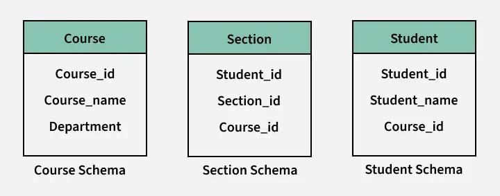
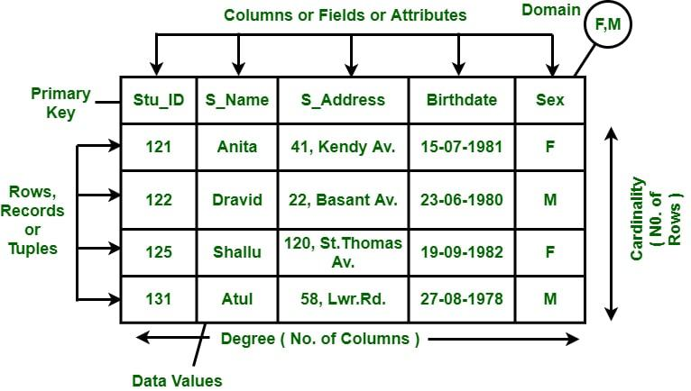
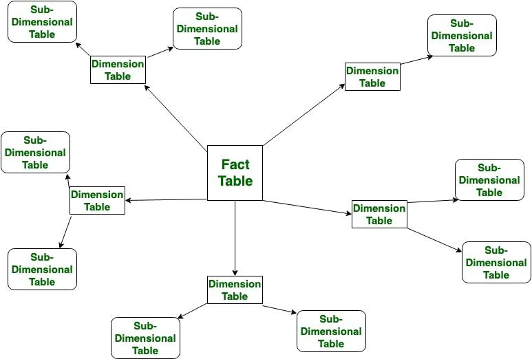
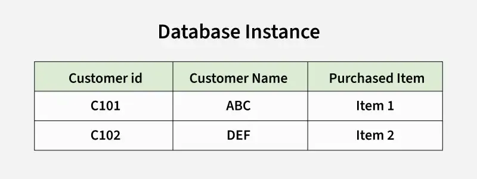

# Database Schemas

(Nguồn gốc: https://www.geeksforgeeks.org/dbms/database-schemas/)

## Hình ảnh minh họa

(Ảnh được lưu trong thư mục `images/`)

---

*Hình: Ví dụ sơ đồ schema.*

*Hình: Các dạng schema.*

*Hình: Flat model.*

*Hình: Hierarchical model.*

*Hình: Network model.*

*Hình: Relational model.*

*Hình: Star schema (data warehouse design).* 

*Hình: Snowflake schema.*

*Hình: Database instance (snapshot of data).* 
