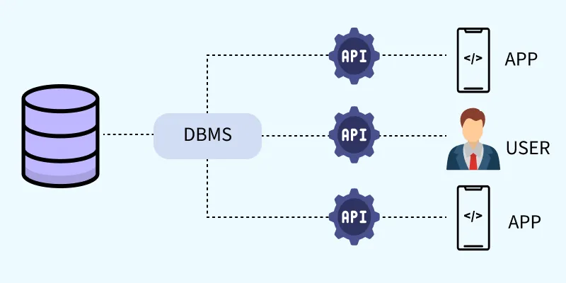
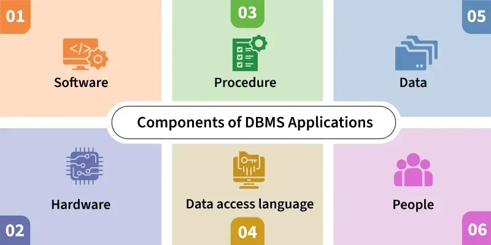
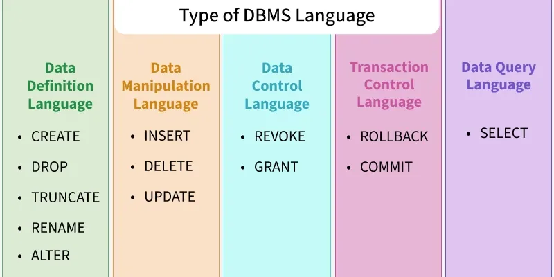
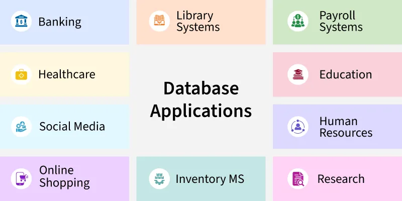

# Giới thiệu về DBMS

**Cập nhật lần cuối:** 14/05/2026

---

DBMS (*Database Management System* - Hệ quản trị cơ sở dữ liệu) là một hệ thống phần mềm dùng để quản lý, lưu trữ và truy xuất dữ liệu một cách hiệu quả theo định dạng có cấu trúc. DBMS đóng vai trò như một cầu nối giữa cơ sở dữ liệu trung tâm và nhiều phía sử dụng khác nhau, bao gồm ứng dụng và người dùng.

Một hệ quản trị cơ sở dữ liệu có thể:

- Kết nối cơ sở dữ liệu trung tâm với nhiều phía sử dụng, bao gồm ứng dụng và người dùng.
- Cho phép người dùng tạo, cập nhật và truy vấn cơ sở dữ liệu một cách hiệu quả.
- Đảm bảo tính toàn vẹn, tính nhất quán và tính bảo mật của dữ liệu khi có nhiều người dùng và ứng dụng cùng sử dụng.
- Giảm dư thừa dữ liệu và tình trạng dữ liệu không nhất quán thông qua cơ chế quản lý tập trung.
- Hỗ trợ truy cập đồng thời, quản lý giao dịch và sao lưu tự động.
	- Sử dụng API để xử lý các yêu cầu dữ liệu, từ đó đảm bảo truy cập an toàn và hiệu quả.

---

## 1. Các vấn đề của hệ thống quản lý tệp truyền thống

Trước khi các hệ quản trị cơ sở dữ liệu hiện đại ra đời, dữ liệu thường được quản lý bằng các hệ thống tệp cơ bản trên ổ cứng. Cách tiếp cận này cho phép người dùng lưu trữ, truy xuất và cập nhật tệp khi cần, nhưng cũng phát sinh nhiều hạn chế.

Các vấn đề thường gặp gồm:

- **Dư thừa dữ liệu**: Cùng một thông tin có thể bị lặp lại trong nhiều tệp khác nhau.
- **Không nhất quán dữ liệu**: Thông tin giữa các tệp có thể mâu thuẫn hoặc lỗi thời.
- **Khó truy cập dữ liệu**: Người dùng phải tìm kiếm thủ công trong các tệp.
- **Bảo mật kém**: Không có cơ chế kiểm soát quyền truy cập dữ liệu rõ ràng.
- **Thiếu hỗ trợ đa người dùng**: Không hỗ trợ tốt việc nhiều người cùng làm việc hoặc cộng tác trên dữ liệu.
- **Không có cơ chế sao lưu và phục hồi**: Khi dữ liệu bị mất, việc khôi phục thường rất khó hoặc không thể thực hiện.

Ví dụ, một hệ thống quản lý dữ liệu trong trường đại học theo kiểu tệp, trong đó dữ liệu được lưu riêng trong các tệp như *Academics*, *Results*, *Hostels*, thường gặp các vấn đề nêu trên.

---

## 2. Các thành phần của ứng dụng DBMS

Một ứng dụng dựa trên DBMS thường gồm sáu thành phần chính phối hợp với nhau để xử lý dữ liệu một cách hiệu quả.

### 2.1. Phần cứng

Phần cứng bao gồm các thiết bị vật lý như máy chủ, ổ đĩa, thiết bị nhập - xuất như bàn phím, màn hình và máy in.

Vai trò chính của phần cứng là:

- Lưu trữ và xử lý dữ liệu.
- Là giao diện giữa dữ liệu đầu vào từ thế giới thực và hệ thống số.
- Hỗ trợ các hoạt động vận hành của DBMS.

Ví dụ: ổ cứng máy tính cá nhân, RAM, thiết bị mạng và máy chủ cơ sở dữ liệu.

### 2.2. Phần mềm

Phần mềm là thành phần thực hiện các chức năng quản trị cơ sở dữ liệu. Các ví dụ phổ biến gồm MySQL, Oracle và PostgreSQL.

Thành phần phần mềm có thể bao gồm:

- Hệ quản trị cơ sở dữ liệu.
- Hệ điều hành.
- Phần mềm mạng.
- Các công cụ ứng dụng.
- Bộ máy cơ sở dữ liệu dùng để xử lý các thao tác truy cập dữ liệu.

Phần mềm DBMS có nhiệm vụ chuyển đổi các ngôn ngữ truy cập cơ sở dữ liệu thành các thao tác cụ thể trên dữ liệu.

### 2.3. Dữ liệu

Dữ liệu là các sự kiện hoặc thông tin thô được lưu trữ dưới dạng có cấu trúc hoặc phi cấu trúc.

Trong DBMS, dữ liệu thường bao gồm:

- **Dữ liệu vận hành**: Là dữ liệu thực tế của người dùng, ví dụ như tên, tuổi, địa chỉ, điểm số.
- **Siêu dữ liệu** (*metadata*): Là dữ liệu mô tả dữ liệu, ví dụ như thời điểm lưu trữ, kích thước, kiểu dữ liệu.

Dữ liệu là lý do cốt lõi khiến DBMS tồn tại, bởi DBMS được xây dựng để quản lý, lưu trữ và khai thác dữ liệu một cách hiệu quả.

### 2.4. Quy trình

Quy trình là tập hợp các hướng dẫn và quy tắc để sử dụng DBMS một cách hiệu quả.

Các quy trình thường bao gồm:

- Cài đặt hệ thống.
- Đăng nhập và đăng xuất.
- Kiểm tra và xác thực dữ liệu.
- Sao lưu dữ liệu.
- Kiểm soát truy cập.
- Tạo báo cáo.

Quy trình giúp đảm bảo hệ thống được sử dụng một cách nhất quán, an toàn và có kiểm soát.

### 2.5. Ngôn ngữ truy cập cơ sở dữ liệu

Ngôn ngữ truy cập cơ sở dữ liệu được dùng để tương tác với cơ sở dữ liệu, bao gồm tạo, đọc, cập nhật và xóa dữ liệu.

Ví dụ:

- SQL.
- MyAccess.
- Oracle PL/SQL.

Một số nhóm lệnh quan trọng gồm:

- **DDL** (*Data Definition Language*): Ngôn ngữ định nghĩa dữ liệu, gồm các lệnh như `CREATE`, `ALTER`, `DROP`.
- **DML** (*Data Manipulation Language*): Ngôn ngữ thao tác dữ liệu, gồm các lệnh như `INSERT`, `UPDATE`, `DELETE`.

### 2.6. Con người

Con người là những đối tượng tương tác với DBMS ở nhiều cấp độ khác nhau.

Các nhóm người dùng chính gồm:

- **Quản trị viên cơ sở dữ liệu** (*Database Administrator - DBA*): Quản lý bảo mật, hiệu năng và quyền truy cập của người dùng.
- **Nhà phát triển**: Xây dựng các ứng dụng sử dụng cơ sở dữ liệu.
- **Người dùng cuối**: Sử dụng các ứng dụng để truy cập dữ liệu, ví dụ như sinh viên, nhân viên hoặc khách hàng.

---

## 3. Các loại DBMS

Có nhiều loại hệ quản trị cơ sở dữ liệu khác nhau. Mỗi loại được thiết kế để phù hợp với một kiểu cấu trúc dữ liệu, nhu cầu mở rộng và mục đích ứng dụng nhất định.

### 3.1. Hệ quản trị cơ sở dữ liệu quan hệ

Hệ quản trị cơ sở dữ liệu quan hệ (*Relational Database Management System - RDBMS*) tổ chức dữ liệu thành các bảng, còn gọi là các quan hệ. Mỗi bảng gồm các hàng và cột.

Đặc điểm chính:

- Dữ liệu được lưu trong các bảng.
- Khóa chính được dùng để định danh duy nhất từng hàng.
- Khóa ngoại được dùng để thiết lập quan hệ giữa các bảng.
- Các truy vấn thường được viết bằng SQL, giúp thao tác và truy xuất dữ liệu hiệu quả.

Ví dụ: MySQL, Oracle, Microsoft SQL Server, PostgreSQL.

### 3.2. NoSQL DBMS

NoSQL DBMS được thiết kế để xử lý dữ liệu quy mô lớn và cung cấp hiệu năng cao trong những tình huống mà mô hình quan hệ truyền thống có thể bị hạn chế.

Đặc điểm chính:

- Lưu trữ dữ liệu theo nhiều định dạng phi quan hệ khác nhau.
- Có thể sử dụng dạng cặp khóa - giá trị, tài liệu, đồ thị hoặc cột.
- Phù hợp với dữ liệu phi cấu trúc hoặc bán cấu trúc.
- Hỗ trợ mở rộng nhanh và linh hoạt.

Ví dụ: MongoDB, Cassandra, DynamoDB, Redis.

### 3.3. Hệ quản trị cơ sở dữ liệu hướng đối tượng

Hệ quản trị cơ sở dữ liệu hướng đối tượng (*Object-Oriented DBMS - OODBMS*) tích hợp các khái niệm của lập trình hướng đối tượng vào môi trường cơ sở dữ liệu. Dữ liệu có thể được lưu dưới dạng các đối tượng.

Đặc điểm chính:

- Hỗ trợ các kiểu dữ liệu phức tạp.
- Cho phép biểu diễn các quan hệ phức tạp giữa dữ liệu.
- Phù hợp với các ứng dụng cần mô hình hóa dữ liệu nâng cao hoặc mô phỏng thế giới thực.

Ví dụ: ObjectDB, db4o.

### 3.4. Cơ sở dữ liệu phân cấp

Cơ sở dữ liệu phân cấp tổ chức dữ liệu theo cấu trúc dạng cây. Mỗi bản ghi, hay còn gọi là một nút, có một nút cha và có thể có nhiều nút con.

Đặc điểm chính:

- Mô hình tương tự hệ thống tệp với thư mục và thư mục con.
- Hiệu quả với dữ liệu có quan hệ phân cấp rõ ràng.
- Phù hợp với dữ liệu như sơ đồ tổ chức hoặc hệ thống thư mục.
- Việc truy cập dữ liệu nhanh và dễ dự đoán nhờ cấu trúc cố định.
- Thiếu linh hoạt khi cần tái cấu trúc hoặc xử lý các quan hệ nhiều - nhiều phức tạp.

Ví dụ: IBM Information Management System (IMS).

### 3.5. Cơ sở dữ liệu mạng

Cơ sở dữ liệu mạng sử dụng mô hình dạng đồ thị để biểu diễn các quan hệ phức tạp giữa các thực thể.

Đặc điểm chính:

- Khác với mô hình phân cấp, một nút con có thể có nhiều nút cha.
- Hỗ trợ biểu diễn quan hệ nhiều - nhiều.
- Dữ liệu được biểu diễn bằng bản ghi và tập hợp, trong đó các tập hợp xác định quan hệ giữa các bản ghi.
- Linh hoạt hơn mô hình phân cấp.
- Phù hợp với các ứng dụng có nhiều liên kết dữ liệu phức tạp.

Ví dụ: Integrated Data Store (IDS), TurboIMAGE.

### 3.6. Cơ sở dữ liệu trên nền tảng đám mây

Cơ sở dữ liệu trên nền tảng đám mây được lưu trữ trên các nền tảng điện toán đám mây như AWS, Azure hoặc Google Cloud.

Đặc điểm chính:

- Có khả năng mở rộng theo nhu cầu.
- Có tính sẵn sàng cao.
- Hỗ trợ sao lưu tự động.
- Cho phép truy cập từ xa.
- Có thể là cơ sở dữ liệu quan hệ hoặc phi quan hệ.
- Thường được nhà cung cấp dịch vụ đám mây duy trì, giúp giảm gánh nặng quản trị hệ thống.
- Hỗ trợ các yêu cầu ứng dụng hiện đại như truy cập phân tán và phân tích thời gian thực.

Ví dụ: Amazon RDS cho cơ sở dữ liệu SQL, MongoDB Atlas cho NoSQL, Google BigQuery.

---

## 4. Ngôn ngữ cơ sở dữ liệu

Ngôn ngữ cơ sở dữ liệu là tập hợp các lệnh và chỉ dẫn chuyên biệt được dùng để định nghĩa, thao tác và kiểm soát dữ liệu trong cơ sở dữ liệu. Mỗi loại ngôn ngữ đóng một vai trò riêng trong quản trị cơ sở dữ liệu, giúp đảm bảo lưu trữ, truy xuất và bảo mật dữ liệu hiệu quả.

Các nhóm ngôn ngữ cơ sở dữ liệu chính gồm:

### 4.1. Ngôn ngữ định nghĩa dữ liệu

DDL là viết tắt của *Data Definition Language*, tức ngôn ngữ định nghĩa dữ liệu. Nhóm lệnh này liên quan đến lược đồ cơ sở dữ liệu và mô tả cách dữ liệu được tổ chức trong cơ sở dữ liệu.

Các lệnh phổ biến:

- `CREATE`: Tạo cơ sở dữ liệu và các đối tượng như bảng, chỉ mục, khung nhìn, thủ tục lưu trữ, hàm và trigger.
- `ALTER`: Thay đổi cấu trúc của cơ sở dữ liệu hiện có.
- `DROP`: Xóa các đối tượng khỏi cơ sở dữ liệu.
- `TRUNCATE`: Xóa toàn bộ bản ghi khỏi một bảng, đồng thời giải phóng không gian đã cấp phát cho các bản ghi.
- `COMMENT`: Thêm chú thích vào từ điển dữ liệu.
- `RENAME`: Đổi tên một đối tượng.

### 4.2. Ngôn ngữ thao tác dữ liệu

DML là viết tắt của *Data Manipulation Language*, tức ngôn ngữ thao tác dữ liệu. DML tập trung vào việc thao tác với dữ liệu được lưu trong cơ sở dữ liệu, cho phép người dùng truy xuất, thêm, cập nhật và xóa dữ liệu.

Các lệnh phổ biến:

- `INSERT`: Chèn dữ liệu vào bảng.
- `UPDATE`: Cập nhật dữ liệu hiện có trong bảng.
- `DELETE`: Xóa các bản ghi khỏi bảng.
- `MERGE`: Thực hiện thao tác *UPSERT*, tức chèn mới hoặc cập nhật.
- `CALL`: Gọi một chương trình con PL/SQL hoặc Java.
- `EXPLAIN PLAN`: Diễn giải đường dẫn truy cập dữ liệu.
- `LOCK TABLE`: Khóa bảng để kiểm soát truy cập đồng thời.

### 4.3. Ngôn ngữ kiểm soát dữ liệu

DCL là viết tắt của *Data Control Language*, tức ngôn ngữ kiểm soát dữ liệu. Các lệnh DCL quản lý quyền truy cập, giúp đảm bảo bảo mật dữ liệu bằng cách kiểm soát người dùng nào được thực hiện hành động nào trên cơ sở dữ liệu.

Các lệnh phổ biến:

- `GRANT`: Cấp quyền cụ thể cho người dùng, ví dụ như quyền `SELECT`, `INSERT`.
- `REVOKE`: Thu hồi các quyền đã cấp cho người dùng.

### 4.4. Ngôn ngữ kiểm soát giao dịch

TCL là viết tắt của *Transaction Control Language*, tức ngôn ngữ kiểm soát giao dịch. Các lệnh TCL quản lý dữ liệu giao dịch nhằm duy trì tính nhất quán, độ tin cậy và tính nguyên tử của giao dịch.

Các lệnh phổ biến:

- `ROLLBACK`: Hoàn tác các thay đổi đã thực hiện trong một giao dịch.
- `COMMIT`: Lưu toàn bộ các thay đổi đã thực hiện trong một giao dịch.
- `SAVEPOINT`: Thiết lập một điểm trong giao dịch để có thể quay lui về điểm đó sau này.

### 4.5. Ngôn ngữ truy vấn dữ liệu

DQL là viết tắt của *Data Query Language*, tức ngôn ngữ truy vấn dữ liệu. DQL là một tập con của SQL, dùng để truy xuất dữ liệu từ cơ sở dữ liệu mà không làm thay đổi dữ liệu.

Lệnh chính của DQL là:

- `SELECT`: Truy xuất thông tin cụ thể từ cơ sở dữ liệu theo yêu cầu của người dùng.

---

## 5. Ứng dụng của DBMS

DBMS được sử dụng rộng rãi trong nhiều lĩnh vực khác nhau.

Một số ứng dụng tiêu biểu gồm:

- **Ngân hàng**: Quản lý tài khoản và giao dịch.
- **Thương mại điện tử**: Theo dõi sản phẩm, đơn hàng và khách hàng.
- **Y tế**: Lưu trữ hồ sơ bệnh nhân và chẩn đoán.
- **Giáo dục**: Quản lý điểm số, lịch học và thông tin sinh viên.
- **Mạng xã hội**: Quản lý hồ sơ người dùng và các tương tác.
- **Khoa học dữ liệu**: Hỗ trợ phân tích dữ liệu và dự đoán.

---

## 6. Tóm tắt

DBMS là một thành phần quan trọng trong các hệ thống thông tin hiện đại. Nó giúp tổ chức, lưu trữ, bảo vệ và khai thác dữ liệu một cách hiệu quả. So với hệ thống tệp truyền thống, DBMS có nhiều ưu điểm hơn về tính nhất quán, bảo mật, khả năng truy cập đồng thời, quản lý giao dịch và sao lưu dữ liệu.

Các loại DBMS như RDBMS, NoSQL, OODBMS, cơ sở dữ liệu phân cấp, cơ sở dữ liệu mạng và cơ sở dữ liệu đám mây được thiết kế để đáp ứng các nhu cầu dữ liệu khác nhau. Bên cạnh đó, các nhóm ngôn ngữ cơ sở dữ liệu như DDL, DML, DCL, TCL và DQL giúp người dùng định nghĩa, thao tác, kiểm soát và truy vấn dữ liệu một cách có hệ thống.

