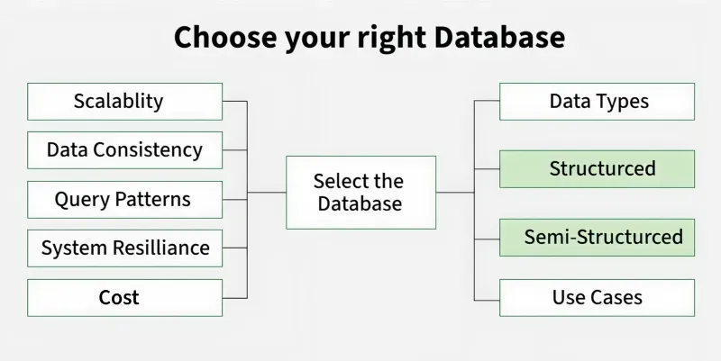
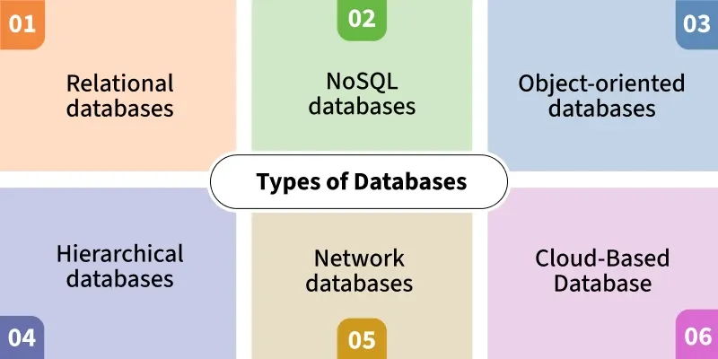

# Cách lựa chọn hệ quản trị cơ sở dữ liệu phù hợp

**Cập nhật lần cuối:** 31/05/2026

**Nguồn tham khảo:**  
- GeeksforGeeks: [How to Choose the Database](https://www.geeksforgeeks.org/dbms/how-to-choose-the-database/)

---

## 1. Mục tiêu bài giảng

Sau khi hoàn thành bài học này, người học có thể:

1. Hiểu vì sao việc lựa chọn hệ quản trị cơ sở dữ liệu là một quyết định kiến trúc quan trọng.
2. Phân biệt các loại cơ sở dữ liệu phổ biến: quan hệ, tài liệu, khóa-giá trị, chuỗi thời gian, cột và đồ thị.
3. Biết các tiêu chí chính khi lựa chọn DBMS cho một hệ thống phần mềm.
4. Hiểu khi nào nên sử dụng cơ sở dữ liệu tự quản lý và khi nào nên dùng dịch vụ cơ sở dữ liệu được quản lý.
5. Vận dụng được kiến thức để chọn loại cơ sở dữ liệu phù hợp cho một bài toán thực tế.
6. Hoàn thành được các câu hỏi ôn tập và bài tập vận dụng về lựa chọn DBMS.

---

## 2. Giới thiệu tổng quan

Trong bất kỳ hệ thống phần mềm nào có sử dụng dữ liệu, việc lựa chọn đúng **hệ quản trị cơ sở dữ liệu** là một quyết định rất quan trọng.

Một lựa chọn phù hợp có thể giúp hệ thống:

- Lưu trữ dữ liệu an toàn và nhất quán.
- Truy vấn dữ liệu nhanh hơn.
- Dễ mở rộng khi số lượng người dùng tăng.
- Giảm chi phí vận hành.
- Dễ bảo trì và phát triển trong tương lai.

Ngược lại, nếu lựa chọn sai loại cơ sở dữ liệu, hệ thống có thể gặp nhiều vấn đề như:

- Truy vấn chậm.
- Khó mở rộng.
- Dữ liệu không nhất quán.
- Chi phí vận hành cao.
- Khó thay đổi cấu trúc dữ liệu khi hệ thống phát triển.

Vì vậy, không nên chọn cơ sở dữ liệu chỉ vì nó phổ biến. Thay vào đó, cần lựa chọn dựa trên:

- Kiểu dữ liệu của hệ thống.
- Cách dữ liệu được truy vấn.
- Yêu cầu về hiệu năng.
- Yêu cầu về tính nhất quán.
- Khả năng mở rộng.
- Năng lực vận hành của đội ngũ kỹ thuật.

<p align="center">
  
</p>

<p align="center">
  <em>Hình 1. Tổng quan về việc lựa chọn cơ sở dữ liệu phù hợp.</em>
</p>

---

### Quiz nhanh: Giới thiệu tổng quan

**Câu 1.** Vì sao không nên chọn DBMS chỉ vì nó phổ biến?

A. Vì DBMS phổ biến luôn miễn phí  
B. Vì lựa chọn DBMS cần dựa trên dữ liệu, truy vấn, hiệu năng và vận hành  
C. Vì DBMS phổ biến không hỗ trợ bảo mật  
D. Vì mọi hệ thống chỉ nên dùng một loại database  

**Câu 2.** Một lựa chọn DBMS không phù hợp có thể gây ra vấn đề nào?

A. Tăng độ phân giải màn hình  
B. Giảm số lượng bảng bắt buộc trong mọi hệ thống  
C. Truy vấn chậm và khó mở rộng  
D. Tự động loại bỏ nhu cầu backup  

**Câu 3.** Người học có thể ứng dụng chủ đề này vào việc gì?

A. Chọn loại database phù hợp cho một bài toán phần mềm cụ thể  
B. Thiết kế màu sắc giao diện người dùng  
C. Thay thế toàn bộ quy trình phát triển phần mềm  
D. Tự động viết mọi truy vấn SQL  

---

## 3. Khái niệm cơ bản

### 3.1. DBMS là gì?

**DBMS** là viết tắt của **Database Management System**, nghĩa là **hệ quản trị cơ sở dữ liệu**.

DBMS là phần mềm dùng để:

- Tạo cơ sở dữ liệu.
- Lưu trữ dữ liệu.
- Truy vấn dữ liệu.
- Cập nhật dữ liệu.
- Xóa dữ liệu.
- Đảm bảo an toàn và toàn vẹn dữ liệu.

Ví dụ về DBMS:

- MySQL
- PostgreSQL
- SQL Server
- Oracle Database
- MongoDB
- Redis
- Neo4j
- Snowflake

---

### Quiz nhanh: Khái niệm cơ bản

**Câu 1.** DBMS là viết tắt của cụm từ nào?

A. Data Backup Monitoring Service  
B. Distributed Binary Model Server  
C. Database Management System  
D. Database Mapping Syntax  

**Câu 2.** Chức năng nào sau đây thuộc về DBMS?

A. Thiết kế giao diện đồ họa cho người dùng  
B. Tạo, lưu trữ, truy vấn, cập nhật và bảo vệ dữ liệu  
C. Biên dịch mã nguồn ứng dụng  
D. Thay thế hoàn toàn hệ điều hành  

**Câu 3.** MySQL, PostgreSQL và MongoDB là ví dụ của gì?

A. Hệ quản trị cơ sở dữ liệu  
B. Ngôn ngữ lập trình frontend  
C. Giao thức mạng  
D. Phần mềm chỉnh sửa ảnh  

---

## 4. Các tiêu chí chính khi lựa chọn DBMS

Khi lựa chọn cơ sở dữ liệu cho một hệ thống, cần xem xét các tiêu chí sau.

---

### 4.1. Khả năng mở rộng

Khả năng mở rộng cho biết hệ thống có thể xử lý tốt hơn khi dữ liệu hoặc số lượng người dùng tăng lên hay không.

Có hai hướng mở rộng chính:

#### Mở rộng theo chiều dọc

Mở rộng theo chiều dọc nghĩa là tăng tài nguyên cho một máy chủ hiện có.

Ví dụ:

- Tăng CPU.
- Tăng RAM.
- Tăng dung lượng ổ cứng.
- Dùng máy chủ mạnh hơn.

Các cơ sở dữ liệu quan hệ như MySQL, PostgreSQL, SQL Server thường phù hợp với mở rộng theo chiều dọc.

#### Mở rộng theo chiều ngang

Mở rộng theo chiều ngang nghĩa là thêm nhiều máy chủ vào hệ thống.

Ví dụ:

- Chia dữ liệu trên nhiều máy.
- Phân tán tải truy vấn.
- Sử dụng cụm máy chủ.

Các cơ sở dữ liệu NoSQL thường được thiết kế tốt cho mở rộng theo chiều ngang.

---

### 4.2. Tính nhất quán dữ liệu

Tính nhất quán dữ liệu cho biết dữ liệu có chính xác và đồng bộ tại mọi thời điểm hay không.

Ví dụ, trong hệ thống ngân hàng:

- Khi tài khoản A chuyển tiền cho tài khoản B,
- Số tiền của A phải bị trừ,
- Số tiền của B phải được cộng,
- Hai thao tác này phải xảy ra cùng nhau.

Nếu chỉ trừ tiền A mà chưa cộng tiền B thì dữ liệu bị sai lệch.

Các hệ thống tài chính, kế toán, ngân hàng thường cần tính nhất quán mạnh và tuân thủ ACID.

Trong khi đó, một số hệ thống khác có thể chấp nhận dữ liệu nhất quán sau một khoảng thời gian ngắn.

Ví dụ:

- Mạng xã hội.
- Hệ thống gợi ý.
- Hệ thống log.
- Hệ thống thống kê lượt xem.

---

### 4.3. Mẫu truy vấn và khối lượng công việc

Trước khi chọn DBMS, cần hiểu hệ thống chủ yếu làm gì với dữ liệu.

Một số hệ thống có đặc điểm:

- Đọc nhiều hơn ghi.
- Ghi nhiều hơn đọc.
- Cân bằng giữa đọc và ghi.
- Cần truy vấn phức tạp.
- Cần truy vấn đơn giản nhưng tốc độ rất cao.

Ví dụ:

| Đặc điểm hệ thống | Loại cơ sở dữ liệu phù hợp |
|---|---|
| Cần nhiều phép JOIN phức tạp | Cơ sở dữ liệu quan hệ |
| Cần báo cáo, thống kê, phân tích | Cơ sở dữ liệu quan hệ hoặc columnar database |
| Cần truy xuất theo khóa rất nhanh | Key-value store |
| Dữ liệu dạng JSON linh hoạt | Document database |
| Dữ liệu cảm biến theo thời gian | Time-series database |
| Dữ liệu có nhiều quan hệ phức tạp | Graph database |

---

### 4.4. Độ phức tạp vận hành

Một hệ thống cơ sở dữ liệu không chỉ cần thiết kế tốt mà còn cần được vận hành tốt.

Các công việc vận hành bao gồm:

- Sao lưu dữ liệu.
- Khôi phục dữ liệu.
- Cập nhật phiên bản.
- Giám sát hiệu năng.
- Phân quyền người dùng.
- Mã hóa dữ liệu.
- Thiết lập nhân bản dữ liệu.
- Xử lý sự cố.

Nếu đội ngũ kỹ thuật chưa có nhiều kinh nghiệm quản trị cơ sở dữ liệu, nên cân nhắc sử dụng **managed database**.

---

### 4.5. Khả năng phục hồi và độ sẵn sàng

Một số hệ thống yêu cầu phải hoạt động liên tục.

Ví dụ:

- Ngân hàng số.
- Thương mại điện tử.
- Hệ thống đặt vé.
- Hệ thống quản lý bệnh viện.
- Hệ thống logistics thời gian thực.

Các hệ thống này cần:

- Tự động sao lưu.
- Tự động chuyển đổi khi máy chủ lỗi.
- Nhân bản dữ liệu.
- Hỗ trợ nhiều vùng địa lý.
- Khả năng khôi phục sau thảm họa.

---

### 4.6. Yêu cầu hiệu năng

Hiệu năng có thể được đánh giá qua:

- Độ trễ thấp.
- Thông lượng cao.
- Tốc độ ghi dữ liệu.
- Tốc độ đọc dữ liệu.
- Khả năng xử lý truy vấn đồng thời.

Ví dụ:

- Hệ thống cache cần độ trễ rất thấp.
- Hệ thống IoT cần tốc độ ghi rất cao.
- Hệ thống BI cần xử lý truy vấn phân tích lớn.
- Hệ thống giao dịch cần tính nhất quán và độ tin cậy cao.

---

### Quiz nhanh: Tiêu chí lựa chọn DBMS

**Câu 1.** Khả năng mở rộng theo chiều ngang có nghĩa là gì?

A. Tăng thêm CPU, RAM cho một máy chủ hiện có  
B. Thêm nhiều máy chủ vào hệ thống để phân tán tải hoặc dữ liệu  
C. Giảm số lượng người dùng của hệ thống  
D. Chuyển mọi dữ liệu sang file văn bản  

**Câu 2.** Hệ thống ngân hàng thường cần đặc tính nào?

A. Chỉ cần eventual consistency trong mọi giao dịch  
B. Không cần kiểm soát toàn vẹn dữ liệu  
C. Tính nhất quán mạnh và giao dịch ACID  
D. Không cần backup  

**Câu 3.** Nếu hệ thống cần truy xuất theo khóa cực nhanh, loại database nào thường phù hợp?

A. Key-value store  
B. Graph database  
C. Columnar database  
D. Time-series database  

---

## 5. Các loại cơ sở dữ liệu phổ biến

<p align="center">
  
</p>

<p align="center">
  <em>Hình 2. Các loại cơ sở dữ liệu phổ biến.</em>
</p>

---

### Quiz nhanh: Các loại cơ sở dữ liệu phổ biến

**Câu 1.** Dữ liệu dạng bảng, có khóa chính và khóa ngoại thường phù hợp với loại database nào?

A. Relational database  
B. Time-series database  
C. Graph database  
D. Key-value store  

**Câu 2.** Dữ liệu JSON linh hoạt thường phù hợp với loại database nào?

A. Columnar database  
B. Document database  
C. Relational database bắt buộc trong mọi trường hợp  
D. Time-series database  

**Câu 3.** Dữ liệu có nhiều quan hệ phức tạp giữa các đối tượng thường phù hợp với loại database nào?

A. Key-value store  
B. Time-series database  
C. Graph database  
D. File CSV đơn lẻ  

---

## 6. Cơ sở dữ liệu quan hệ

### 6.1. Khái niệm

**Relational Database Management System**, hay **RDBMS**, là hệ quản trị cơ sở dữ liệu lưu dữ liệu dưới dạng bảng.

Mỗi bảng gồm:

- Các hàng.
- Các cột.
- Khóa chính.
- Khóa ngoại.
- Ràng buộc dữ liệu.

Ví dụ:

Bảng `Students`:

| student_id | full_name | major |
|---|---|---|
| 1 | Nguyễn An | Data Science |
| 2 | Trần Bình | Logistics |
| 3 | Lê Chi | Information Systems |

RDBMS thường sử dụng ngôn ngữ SQL để truy vấn dữ liệu.

Ví dụ:

```sql
SELECT full_name, major
FROM Students
WHERE major = 'Data Science';
```

---

### 6.2. Khi nào nên dùng RDBMS?

Nên dùng RDBMS khi:

- Dữ liệu có cấu trúc rõ ràng.
- Cần đảm bảo tính toàn vẹn dữ liệu.
- Cần giao dịch ACID.
- Cần JOIN giữa nhiều bảng.
- Cần báo cáo và truy vấn phức tạp.
- Hệ thống liên quan đến tài chính, kế toán, quản lý đơn hàng, quản lý sinh viên.

Ví dụ phù hợp:

- Hệ thống ngân hàng.
- Hệ thống quản lý sinh viên.
- Hệ thống bán hàng.
- Hệ thống quản lý kho.
- Hệ thống kế toán.

---

### 6.3. Khi nào nên dùng Managed RDBMS?

Nên dùng dịch vụ RDBMS được quản lý khi:

- Cần độ sẵn sàng cao.
- Muốn tự động sao lưu dữ liệu.
- Muốn khôi phục dữ liệu theo thời điểm.
- Không muốn tự quản lý nâng cấp phiên bản.
- Cần bảo mật, mã hóa và giám sát tích hợp.
- Muốn giảm gánh nặng vận hành.

Ví dụ:

- Amazon RDS
- Google Cloud SQL
- Azure SQL Database

---

### 6.4. Khi nào không nên dùng Managed RDBMS?

Không nên dùng managed RDBMS nếu:

- Cần kiểm soát sâu bên trong database engine.
- Có yêu cầu bắt buộc dữ liệu phải lưu tại chỗ.
- Có ràng buộc pháp lý không cho phép lưu dữ liệu trên cloud.
- Chi phí cloud không phù hợp với ngân sách.

---

## 7. Document Database

### 7.1. Khái niệm

**Document database** lưu dữ liệu dưới dạng tài liệu, thường là JSON hoặc BSON.

Ví dụ một tài liệu sinh viên:

```json
{
  "student_id": 1,
  "full_name": "Nguyễn An",
  "major": "Data Science",
  "skills": ["Python", "SQL", "Machine Learning"],
  "address": {
    "city": "Hanoi",
    "district": "Hoan Kiem"
  }
}
```

Khác với cơ sở dữ liệu quan hệ, document database không bắt buộc mọi bản ghi phải có cùng cấu trúc.

---

### 7.2. Khi nào nên dùng Document Database?

Nên dùng document database khi:

- Dữ liệu có cấu trúc linh hoạt.
- Dữ liệu dạng JSON.
- Schema thay đổi thường xuyên.
- Dữ liệu có cấu trúc lồng nhau.
- Ứng dụng phát triển nhanh, cần thay đổi mô hình dữ liệu linh hoạt.

Ví dụ phù hợp:

- Hồ sơ người dùng.
- Catalog sản phẩm.
- Nội dung bài viết.
- Ứng dụng mobile.
- Hệ thống quản lý nội dung.

---

### 7.3. Managed Document Database

Nên dùng managed document database khi:

- Cần mở rộng nhanh.
- Không muốn tự cấu hình replication, sharding, backup.
- Cần triển khai dữ liệu ở nhiều khu vực địa lý.
- Cần kiểm soát truy cập và giám sát tích hợp.

Ví dụ:

- MongoDB Atlas
- Amazon DocumentDB
- Couchbase Capella

---

## 8. Key-Value Store

### 8.1. Khái niệm

**Key-value database** lưu dữ liệu dưới dạng cặp khóa và giá trị.

Ví dụ:

```text
user:1001 -> "Nguyễn An"
cart:1001 -> ["book", "laptop", "mouse"]
session:abc123 -> "active"
```

Loại cơ sở dữ liệu này rất đơn giản nhưng có tốc độ truy xuất rất nhanh.

---

### 8.2. Khi nào nên dùng Key-Value Store?

Nên dùng key-value store khi:

- Cần truy xuất dữ liệu cực nhanh.
- Dữ liệu được truy vấn chủ yếu bằng khóa.
- Cần lưu session người dùng.
- Cần cache dữ liệu.
- Cần leaderboard trong game.
- Cần xử lý hàng triệu request mỗi giây.

Ví dụ phù hợp:

- Cache sản phẩm.
- Phiên đăng nhập người dùng.
- Giỏ hàng tạm thời.
- Bảng xếp hạng.
- Bộ đếm lượt xem.

---

### 8.3. Ví dụ hệ quản trị

- Redis
- Memcached
- Amazon ElastiCache
- Azure Cache for Redis
- Google Memorystore

---

## 9. Time-Series Database

### 9.1. Khái niệm

**Time-series database** là cơ sở dữ liệu chuyên dùng cho dữ liệu gắn với thời gian.

Mỗi bản ghi thường có:

- Timestamp.
- Giá trị đo.
- Nguồn phát sinh dữ liệu.

Ví dụ:

```text
2026-05-31 10:00:00 | sensor_01 | temperature | 32.5
2026-05-31 10:01:00 | sensor_01 | temperature | 32.7
2026-05-31 10:02:00 | sensor_01 | temperature | 32.6
```

---

### 9.2. Khi nào nên dùng Time-Series Database?

Nên dùng time-series database khi xử lý:

- Dữ liệu cảm biến.
- Dữ liệu IoT.
- Log hệ thống.
- Metric giám sát.
- Dữ liệu tài chính theo thời gian.
- Dữ liệu vận hành máy móc.

Ví dụ phù hợp:

- Theo dõi nhiệt độ kho lạnh.
- Giám sát CPU, RAM, disk của server.
- Theo dõi vị trí xe tải theo thời gian.
- Phân tích giá cổ phiếu.
- Phân tích dữ liệu điện năng tiêu thụ.

---

### 9.3. Ví dụ hệ quản trị

- InfluxDB Cloud
- Amazon Timestream
- Azure Data Explorer
- TimescaleDB

---

## 10. Columnar Database

### 10.1. Khái niệm

**Columnar database** lưu dữ liệu theo cột thay vì theo hàng.

Trong cơ sở dữ liệu quan hệ truyền thống, dữ liệu thường được lưu theo hàng.

Ví dụ bảng bán hàng:

| order_id | customer_id | amount | date |
|---|---|---|---|
| 1 | C01 | 100 | 2026-05-01 |
| 2 | C02 | 200 | 2026-05-02 |
| 3 | C03 | 150 | 2026-05-03 |

Nếu cần tính tổng doanh thu, hệ thống chỉ cần đọc cột `amount`.

Do đó, columnar database rất hiệu quả cho phân tích dữ liệu lớn.

---

### 10.2. Khi nào nên dùng Columnar Database?

Nên dùng columnar database khi:

- Cần phân tích dữ liệu lớn.
- Cần BI hoặc data warehouse.
- Truy vấn chủ yếu là đọc và tổng hợp.
- Cần tính toán thống kê trên nhiều triệu hoặc tỷ dòng dữ liệu.
- Cần tách riêng lưu trữ và tính toán.

Ví dụ phù hợp:

- Báo cáo doanh thu.
- Phân tích hành vi khách hàng.
- Dashboard quản trị.
- Kho dữ liệu doanh nghiệp.
- Phân tích dữ liệu logistics.

---

### 10.3. Ví dụ hệ quản trị

- Google BigQuery
- Amazon Redshift
- Snowflake
- Azure Synapse Analytics

---

## 11. Graph Database

### 11.1. Khái niệm

**Graph database** biểu diễn dữ liệu dưới dạng:

- Node: đỉnh.
- Edge: quan hệ.
- Property: thuộc tính.

Ví dụ:

```text
Minh --friend_of--> An
An --works_at--> Company A
Company A --located_in--> Hanoi
```

Graph database rất phù hợp khi mối quan hệ giữa các đối tượng quan trọng hơn bản thân từng đối tượng riêng lẻ.

---

### 11.2. Khi nào nên dùng Graph Database?

Nên dùng graph database khi:

- Dữ liệu có nhiều quan hệ phức tạp.
- Cần truy vấn đường đi hoặc mạng quan hệ.
- Cần phân tích liên kết.
- Cần phát hiện gian lận.
- Cần xây dựng hệ thống gợi ý.

Ví dụ phù hợp:

- Mạng xã hội.
- Hệ thống gợi ý bạn bè.
- Phân tích gian lận tài chính.
- Gợi ý sản phẩm.
- Quản lý tri thức.
- Phân tích chuỗi cung ứng có nhiều quan hệ phụ thuộc.

---

### 11.3. Ví dụ hệ quản trị

- Neo4j Aura
- Amazon Neptune
- Azure Cosmos DB Gremlin API

---

## 12. Managed Database là gì?

**Managed database** là dịch vụ cơ sở dữ liệu được nhà cung cấp cloud quản lý thay cho đội ngũ kỹ thuật của doanh nghiệp.

Nhà cung cấp có thể hỗ trợ:

- Sao lưu tự động.
- Khôi phục dữ liệu.
- Cập nhật phiên bản.
- Mở rộng tài nguyên.
- Nhân bản dữ liệu.
- Giám sát hiệu năng.
- Mã hóa dữ liệu.
- Chuyển đổi khi có lỗi.

Ví dụ:

- Amazon RDS
- Google Cloud SQL
- Azure Cosmos DB
- MongoDB Atlas
- Amazon Timestream
- Snowflake

---

## 13. Khi nào nên chọn Managed Database?

Nên chọn managed database khi:

- Đội ngũ kỹ thuật nhỏ.
- Không muốn mất nhiều thời gian vận hành.
- Cần độ sẵn sàng cao.
- Cần backup và recovery tự động.
- Cần monitoring tích hợp.
- Cần bảo mật và tuân thủ.
- Muốn tập trung vào phát triển ứng dụng thay vì quản trị hạ tầng.

---

## 14. Khi nào nên tự quản lý database?

Có thể tự quản lý database khi:

- Cần kiểm soát sâu cấu hình hệ thống.
- Cần cài đặt module đặc biệt.
- Có yêu cầu dữ liệu phải đặt tại chỗ.
- Có đội ngũ DBA mạnh.
- Muốn tối ưu chi phí trong một số trường hợp cụ thể.
- Có yêu cầu đặc thù về bảo mật hoặc pháp lý.

---

## 15. Các mẫu kiến trúc ảnh hưởng đến lựa chọn database

---

### 15.1. Polyglot Persistence

**Polyglot persistence** nghĩa là một hệ thống sử dụng nhiều loại cơ sở dữ liệu khác nhau cho các nhu cầu khác nhau.

Ví dụ một hệ thống thương mại điện tử có thể dùng:

- PostgreSQL cho đơn hàng và thanh toán.
- MongoDB cho catalog sản phẩm.
- Redis cho cache.
- Elasticsearch cho tìm kiếm.
- Snowflake cho phân tích dữ liệu.

Ý tưởng chính là: không nhất thiết toàn bộ hệ thống phải dùng một loại database duy nhất.

---

### 15.2. CQRS

**CQRS** là viết tắt của **Command Query Responsibility Segregation**.

Ý tưởng chính:

- Tách phần ghi dữ liệu.
- Tách phần đọc dữ liệu.

Ví dụ:

- Cơ sở dữ liệu SQL dùng cho ghi giao dịch.
- Columnar database dùng cho báo cáo và phân tích.

CQRS phù hợp khi hệ thống có sự khác biệt lớn giữa nhu cầu ghi và nhu cầu đọc.

---

### 15.3. Event Sourcing

**Event sourcing** lưu lại các sự kiện thay đổi trạng thái thay vì chỉ lưu trạng thái cuối cùng.

Ví dụ với đơn hàng:

```text
OrderCreated
PaymentConfirmed
OrderPacked
OrderShipped
OrderDelivered
```

Ưu điểm:

- Có lịch sử thay đổi đầy đủ.
- Dễ audit.
- Có thể tái dựng trạng thái tại một thời điểm trong quá khứ.
- Phù hợp với hệ thống cần truy vết.

---

### 15.4. Microservices

Trong kiến trúc microservices, mỗi service có thể quản lý database riêng.

Ví dụ:

- Service người dùng dùng PostgreSQL.
- Service sản phẩm dùng MongoDB.
- Service cache dùng Redis.
- Service phân tích dùng BigQuery.

Điều này giúp mỗi service chọn database phù hợp nhất với nghiệp vụ của nó.

---

## 16. Bảng so sánh nhanh các loại database

| Loại database | Dạng dữ liệu chính | Phù hợp với | Ví dụ |
|---|---|---|---|
| Relational database | Bảng, hàng, cột | Giao dịch, dữ liệu có cấu trúc, JOIN | MySQL, PostgreSQL |
| Document database | JSON, BSON | Dữ liệu linh hoạt, schema thay đổi | MongoDB |
| Key-value store | Khóa - giá trị | Cache, session, truy xuất cực nhanh | Redis |
| Time-series database | Dữ liệu theo thời gian | IoT, log, metric, sensor | InfluxDB |
| Columnar database | Lưu theo cột | BI, OLAP, data warehouse | BigQuery, Snowflake |
| Graph database | Node và edge | Quan hệ phức tạp, mạng xã hội, fraud detection | Neo4j |

---

## 17. Quy trình lựa chọn DBMS

Có thể sử dụng quy trình sau:

### Bước 1: Xác định bản chất dữ liệu

Câu hỏi cần trả lời:

- Dữ liệu có cấu trúc cố định không?
- Dữ liệu có dạng bảng không?
- Dữ liệu có dạng JSON không?
- Dữ liệu có phụ thuộc thời gian không?
- Dữ liệu có nhiều quan hệ phức tạp không?

---

### Bước 2: Xác định kiểu truy vấn

Câu hỏi cần trả lời:

- Có cần JOIN nhiều bảng không?
- Có cần truy vấn theo khóa nhanh không?
- Có cần phân tích dữ liệu lớn không?
- Có cần truy vấn quan hệ nhiều tầng không?
- Có cần dashboard thời gian thực không?

---

### Bước 3: Xác định yêu cầu nhất quán

Câu hỏi cần trả lời:

- Hệ thống có cần ACID không?
- Có thể chấp nhận eventual consistency không?
- Sai lệch dữ liệu tạm thời có gây hậu quả nghiêm trọng không?

---

### Bước 4: Xác định yêu cầu mở rộng

Câu hỏi cần trả lời:

- Hệ thống cần mở rộng theo chiều dọc hay chiều ngang?
- Dữ liệu có tăng nhanh không?
- Số lượng người dùng có tăng đột biến không?
- Có cần triển khai đa vùng địa lý không?

---

### Bước 5: Xác định năng lực vận hành

Câu hỏi cần trả lời:

- Đội ngũ có kinh nghiệm quản trị database không?
- Có DBA chuyên trách không?
- Có cần backup tự động không?
- Có cần giám sát tích hợp không?
- Có nên dùng managed database không?

---

## 18. Ví dụ tình huống lựa chọn DBMS

### Tình huống 1: Hệ thống quản lý sinh viên

Đặc điểm:

- Dữ liệu có cấu trúc rõ ràng.
- Có nhiều bảng như sinh viên, lớp, môn học, điểm.
- Cần JOIN dữ liệu.
- Cần đảm bảo toàn vẹn dữ liệu.

Lựa chọn phù hợp:

```text
PostgreSQL hoặc MySQL
```

Lý do:

- Phù hợp với dữ liệu quan hệ.
- Hỗ trợ SQL.
- Hỗ trợ khóa chính, khóa ngoại.
- Dễ tạo báo cáo.

---

### Tình huống 2: Ứng dụng mạng xã hội

Đặc điểm:

- Dữ liệu người dùng có thể linh hoạt.
- Có bài viết, bình luận, tương tác.
- Có quan hệ bạn bè, theo dõi.
- Cần mở rộng lớn.

Lựa chọn có thể kết hợp:

```text
MongoDB cho nội dung
Redis cho cache
Graph database cho quan hệ bạn bè
Columnar database cho phân tích
```

---

### Tình huống 3: Hệ thống IoT giám sát nhiệt độ kho lạnh

Đặc điểm:

- Dữ liệu được ghi liên tục theo thời gian.
- Mỗi bản ghi có timestamp.
- Cần dashboard thời gian thực.
- Cần lưu trữ và tổng hợp dữ liệu lịch sử.

Lựa chọn phù hợp:

```text
InfluxDB hoặc Amazon Timestream
```

Lý do:

- Tối ưu cho dữ liệu time-series.
- Hỗ trợ retention policy.
- Hỗ trợ phân tích dữ liệu theo thời gian.

---

### Tình huống 4: Hệ thống thương mại điện tử

Đặc điểm:

- Đơn hàng cần tính nhất quán cao.
- Sản phẩm có thông tin linh hoạt.
- Cần cache để tăng tốc.
- Cần phân tích doanh thu.

Lựa chọn kết hợp:

```text
PostgreSQL cho đơn hàng
MongoDB cho catalog sản phẩm
Redis cho cache
BigQuery hoặc Snowflake cho phân tích
```

---

## 19. Một số lưu ý triển khai

Khi triển khai hệ thống cơ sở dữ liệu, cần chú ý:

- Thiết kế backup ngay từ đầu.
- Có kế hoạch khôi phục sau sự cố.
- Theo dõi hiệu năng truy vấn.
- Theo dõi lỗi replication.
- Thiết kế schema có khả năng tiến hóa.
- Không tối ưu quá sớm khi chưa hiểu workload.
- Không chọn database chỉ vì xu hướng công nghệ.
- Ưu tiên giải pháp đơn giản nếu bài toán chưa quá phức tạp.

---

## 20. Tóm tắt bài học

Trong bài này, chúng ta đã học:

- Lựa chọn DBMS là một quyết định kiến trúc quan trọng.
- RDBMS phù hợp với dữ liệu có cấu trúc và yêu cầu tính nhất quán cao.
- Document database phù hợp với dữ liệu linh hoạt như JSON.
- Key-value store phù hợp với cache và truy xuất cực nhanh.
- Time-series database phù hợp với dữ liệu theo thời gian.
- Columnar database phù hợp với phân tích dữ liệu lớn.
- Graph database phù hợp với dữ liệu có nhiều quan hệ phức tạp.
- Managed database giúp giảm gánh nặng vận hành.
- Một hệ thống lớn có thể dùng nhiều loại database khác nhau.

---

## 21. Câu hỏi ôn tập

### Câu 1

Vì sao không nên chọn DBMS chỉ vì nó phổ biến?

### Câu 2

Hãy phân biệt mở rộng theo chiều dọc và mở rộng theo chiều ngang.

### Câu 3

Loại database nào phù hợp với hệ thống ngân hàng? Vì sao?

### Câu 4

Khi nào nên sử dụng document database?

### Câu 5

Redis thường được dùng trong những tình huống nào?

### Câu 6

Time-series database phù hợp với loại dữ liệu nào?

### Câu 7

Columnar database khác gì so với cơ sở dữ liệu lưu theo hàng?

### Câu 8

Graph database phù hợp với bài toán nào?

### Câu 9

Managed database có ưu điểm gì?

### Câu 10

Polyglot persistence là gì?

---

### Quiz ôn tập ngắn

**Câu 1.** Khi chọn DBMS, yếu tố nào nên được xem xét trước tiên?

A. Logo của nhà cung cấp  
B. Bản chất dữ liệu và cách hệ thống truy vấn dữ liệu  
C. Database nào đang phổ biến nhất trên mạng xã hội  
D. Ngôn ngữ lập trình của giao diện người dùng  

**Đáp án:** B

---

**Câu 2.** Hệ thống ngân hàng thường ưu tiên loại cơ sở dữ liệu nào?

A. Relational database  
B. Key-value store  
C. Graph database  
D. Time-series database  

**Đáp án:** A

---

**Câu 3.** Nếu dữ liệu có cấu trúc JSON linh hoạt và schema thay đổi thường xuyên, lựa chọn phù hợp là gì?

A. Document database  
B. Columnar database  
C. Time-series database  
D. Key-value store  

**Đáp án:** A

---

**Câu 4.** Redis thường phù hợp nhất với tình huống nào?

A. Truy vấn JOIN phức tạp giữa nhiều bảng  
B. Lưu cache, session hoặc dữ liệu truy xuất theo khóa rất nhanh  
C. Phân tích dữ liệu lịch sử nhiều tỷ dòng  
D. Mô hình hóa quan hệ xã hội nhiều tầng  

**Đáp án:** B

---

**Câu 5.** Dữ liệu cảm biến IoT gửi liên tục theo timestamp nên ưu tiên loại database nào?

A. Graph database  
B. Time-series database  
C. Document database  
D. Relational database  

**Đáp án:** B

---

**Câu 6.** Columnar database phù hợp nhất cho nhu cầu nào?

A. Lưu session đăng nhập  
B. Phân tích, tổng hợp và báo cáo dữ liệu lớn                                                                                                     
C. Lưu quan hệ bạn bè trong mạng xã hội  
D. Quản lý giao dịch ngân hàng theo ACID  

**Đáp án:** B

---

**Câu 7.** Graph database mạnh ở điểm nào?

A. Truy vấn và phân tích quan hệ phức tạp giữa các đối tượng  
B. Lưu file ảnh kích thước lớn  
C. Thay thế hoàn toàn hệ điều hành  
D. Chỉ lưu dữ liệu dạng bảng cố định  

**Đáp án:** A

---

**Câu 8.** Managed database giúp đội ngũ kỹ thuật giảm bớt công việc nào?

A. Thiết kế giao diện người dùng  
B. Viết toàn bộ nghiệp vụ ứng dụng  
C. Backup, monitoring, cập nhật phiên bản và xử lý failover  
D. Xóa bỏ nhu cầu bảo mật dữ liệu  

**Đáp án:** C

---

## 22. Bài tập vận dụng

### Bài tập 1

Một startup xây dựng ứng dụng quản lý đơn hàng online. Hệ thống có các chức năng:

- Quản lý khách hàng.
- Quản lý sản phẩm.
- Quản lý đơn hàng.
- Thanh toán.
- Báo cáo doanh thu.
- Tìm kiếm sản phẩm.

Hãy đề xuất loại database phù hợp cho từng chức năng.

---

### Bài tập 2

Một công ty logistics muốn lưu dữ liệu vị trí xe tải theo thời gian thực. Mỗi xe gửi dữ liệu GPS mỗi 10 giây.

Hãy trả lời:

- Nên dùng loại database nào?
- Vì sao?
- Có nên dùng RDBMS truyền thống không?
- Nếu cần dashboard thời gian thực thì cần bổ sung công cụ gì?

---

### Bài tập 3

Một hệ thống mạng xã hội cần lưu:

- Hồ sơ người dùng.
- Bài viết.
- Bình luận.
- Quan hệ bạn bè.
- Gợi ý bạn bè.
- Thống kê lượt xem.

Hãy đề xuất kiến trúc lưu trữ dữ liệu sử dụng nhiều loại database khác nhau.

---

## 23. Câu hỏi trắc nghiệm

### Câu 1

Loại database nào phù hợp nhất cho dữ liệu có cấu trúc rõ ràng và cần JOIN phức tạp?

A. Key-value store  
B. Relational database  
C. Time-series database  
D. Graph database  

---

### Câu 2

Redis thường được dùng cho mục đích nào?

A. Phân tích dữ liệu lớn  
B. Lưu quan hệ xã hội phức tạp  
C. Cache và session  
D. Lưu dữ liệu dạng cột  

---

### Câu 3

Dữ liệu cảm biến IoT theo thời gian phù hợp nhất với loại database nào?

A. Time-series database  
B. Graph database  
C. Document database  
D. Relational database  

---

### Câu 4

MongoDB là ví dụ phổ biến của loại database nào?

A. Columnar database  
B. Document database  
C. Key-value store  
D. Time-series database  

---

### Câu 5

Graph database phù hợp nhất với bài toán nào?

A. Lưu session người dùng  
B. Phân tích quan hệ phức tạp  
C. Tính tổng doanh thu theo tháng  
D. Lưu log cảm biến  

---

## 24. Kết luận

Không có một loại cơ sở dữ liệu nào phù hợp với mọi bài toán.

Một lựa chọn tốt cần dựa trên:

- Bản chất dữ liệu.
- Kiểu truy vấn.
- Yêu cầu nhất quán.
- Yêu cầu hiệu năng.
- Khả năng mở rộng.
- Năng lực vận hành.
- Chi phí.
- Định hướng phát triển hệ thống.

Trong các hệ thống hiện đại, việc kết hợp nhiều loại cơ sở dữ liệu là rất phổ biến. Điều quan trọng là mỗi loại database phải được dùng đúng với điểm mạnh của nó.

---

## 25. Từ khóa chính

- DBMS
- Relational Database
- Document Database
- Key-Value Store
- Time-Series Database
- Columnar Database
- Graph Database
- Managed Database
- ACID
- Eventual Consistency
- Scalability
- Vertical Scaling
- Horizontal Scaling
- Polyglot Persistence
- CQRS
- Event Sourcing
- Microservices
- Backup
- Failover
- Workload

---

## 26. Đáp án và gợi ý trả lời

### Quiz nhanh: Giới thiệu tổng quan

- **Câu 1.** B
- **Câu 2.** C
- **Câu 3.** A

### Quiz nhanh: Khái niệm cơ bản

- **Câu 1.** C
- **Câu 2.** B
- **Câu 3.** A

### Quiz nhanh: Tiêu chí lựa chọn DBMS

- **Câu 1.** B
- **Câu 2.** C
- **Câu 3.** A

### Quiz nhanh: Các loại cơ sở dữ liệu phổ biến

- **Câu 1.** A
- **Câu 2.** B
- **Câu 3.** C

### Quiz ôn tập ngắn

- **Câu 1.** B
- **Câu 2.** A
- **Câu 3.** A
- **Câu 4.** B
- **Câu 5.** B
- **Câu 6.** B
- **Câu 7.** A
- **Câu 8.** C

### Câu hỏi trắc nghiệm

- **Câu 1.** B
- **Câu 2.** C
- **Câu 3.** A
- **Câu 4.** B
- **Câu 5.** B

### Câu hỏi ôn tập - Gợi ý trả lời

#### Câu 1

Không nên chọn DBMS chỉ vì nó phổ biến vì mỗi hệ thống có bản chất dữ liệu, mẫu truy vấn, yêu cầu nhất quán, hiệu năng, mở rộng và vận hành khác nhau. Một lựa chọn phổ biến nhưng không phù hợp có thể làm hệ thống chậm, khó mở rộng hoặc khó bảo trì.

#### Câu 2

Mở rộng theo chiều dọc là tăng tài nguyên cho một máy chủ hiện có, ví dụ thêm CPU, RAM hoặc ổ đĩa. Mở rộng theo chiều ngang là thêm nhiều máy chủ để phân tán tải hoặc phân tán dữ liệu.

#### Câu 3

Hệ thống ngân hàng thường phù hợp với relational database vì cần dữ liệu có cấu trúc rõ ràng, giao dịch ACID, tính nhất quán mạnh và khả năng bảo đảm toàn vẹn dữ liệu.

#### Câu 4

Nên sử dụng document database khi dữ liệu có dạng JSON/BSON, cấu trúc linh hoạt, schema thay đổi thường xuyên hoặc dữ liệu có nhiều trường lồng nhau.

#### Câu 5

Redis thường dùng cho cache, session, giỏ hàng tạm thời, leaderboard, bộ đếm lượt xem hoặc các dữ liệu cần truy xuất theo khóa với độ trễ rất thấp.

#### Câu 6

Time-series database phù hợp với dữ liệu gắn với thời gian như log, metric hệ thống, dữ liệu cảm biến IoT, dữ liệu tài chính theo thời gian hoặc dữ liệu giám sát vận hành.

#### Câu 7

Columnar database lưu dữ liệu theo cột nên hiệu quả cho truy vấn phân tích, tổng hợp và đọc một số cột trên khối lượng dữ liệu lớn. Cơ sở dữ liệu lưu theo hàng thường phù hợp hơn với giao dịch đọc/ghi từng bản ghi.

#### Câu 8

Graph database phù hợp với các bài toán có quan hệ phức tạp như mạng xã hội, gợi ý bạn bè, phát hiện gian lận, phân tích chuỗi cung ứng hoặc quản lý tri thức.

#### Câu 9

Managed database giúp giảm gánh nặng vận hành như backup, monitoring, cập nhật phiên bản, replication, bảo mật, mở rộng tài nguyên và failover.

#### Câu 10

Polyglot persistence là cách một hệ thống sử dụng nhiều loại database khác nhau cho các nhu cầu khác nhau, ví dụ PostgreSQL cho giao dịch, MongoDB cho catalog, Redis cho cache và Snowflake cho phân tích.

### Bài tập vận dụng - Gợi ý trả lời

#### Bài tập 1

Có thể dùng PostgreSQL hoặc MySQL cho khách hàng, đơn hàng và thanh toán; MongoDB cho catalog sản phẩm linh hoạt; Elasticsearch cho tìm kiếm sản phẩm; BigQuery, Snowflake hoặc một columnar database cho báo cáo doanh thu.

#### Bài tập 2

Nên ưu tiên time-series database như InfluxDB, TimescaleDB hoặc Amazon Timestream vì dữ liệu GPS được gửi liên tục theo thời gian. RDBMS vẫn có thể dùng cho metadata như thông tin xe, tài xế, tuyến đường, nhưng không nên là lựa chọn duy nhất cho luồng dữ liệu thời gian thực lớn. Dashboard có thể bổ sung Grafana hoặc công cụ BI/streaming phù hợp.

#### Bài tập 3

Có thể dùng document database cho hồ sơ người dùng, bài viết và bình luận; graph database cho quan hệ bạn bè và gợi ý; Redis cho cache; columnar database hoặc data warehouse cho thống kê lượt xem và phân tích hành vi.
