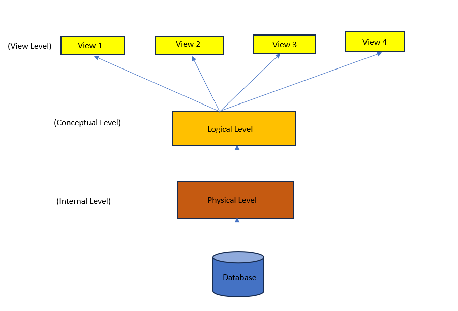

# Bài giảng: Data Abstraction trong DBMS

**Cập nhật lần cuối:** 23/07/2025

---

## 1. Mục tiêu bài giảng

Sau khi hoàn thành bài học này, người học có thể:

1. Giải thích được khái niệm **Data Abstraction** trong hệ quản trị cơ sở dữ liệu.
2. Trình bày được vai trò của trừu tượng hóa dữ liệu trong việc che giấu chi tiết không cần thiết khỏi người dùng cuối.
3. Phân biệt được ba mức trừu tượng dữ liệu trong DBMS:
   - **Physical/Internal Level** - mức vật lý hoặc mức trong.
   - **Logical/Conceptual Level** - mức logic hoặc mức khái niệm.
   - **View/External Level** - mức khung nhìn hoặc mức ngoài.
4. Mô tả được vai trò của người dùng cuối, lập trình viên và quản trị viên cơ sở dữ liệu ở từng mức.
5. Vận dụng khái niệm data abstraction để giải thích cách người dùng tương tác với cơ sở dữ liệu trong các hệ thống thực tế.

---

## 2. Data Abstraction là gì?

**Data Abstraction** hay **trừu tượng hóa dữ liệu** là một trong những khái niệm quan trọng nhất trong hệ quản trị cơ sở dữ liệu (**DBMS**).

Data abstraction là quá trình **che giấu các chi tiết không cần thiết, không liên quan hoặc quá phức tạp** khỏi người dùng cuối. Thay vì để người dùng nhìn thấy toàn bộ cách dữ liệu được lưu trữ và tổ chức bên trong database, DBMS chỉ hiển thị phần dữ liệu mà người dùng thực sự cần.

Nói cách khác, data abstraction giúp người dùng:

- Truy cập dữ liệu cần thiết.
- Không cần biết dữ liệu được lưu ở đâu.
- Không cần biết dữ liệu được lưu như thế nào.
- Không cần hiểu chi tiết cấu trúc vật lý phức tạp của database.
- Làm việc với dữ liệu ở mức đơn giản, dễ hiểu và phù hợp với vai trò của mình.

---

<p align="center">
  
</p>

<p align="center">
  <em>Hình 1. Tổng quan về Data Abstraction trong DBMS. (Ảnh gốc lưu tại `images/db.png`)</em>
</p>

---

## 3. Vì sao cần Data Abstraction?

Trong một hệ thống cơ sở dữ liệu, dữ liệu có thể được lưu trữ theo nhiều cách phức tạp:

- Dữ liệu có thể nằm trong nhiều file khác nhau.
- Dữ liệu có thể được lưu trên ổ đĩa, SSD hoặc máy chủ từ xa.
- Dữ liệu có thể được tổ chức bằng index, B-tree, B+ tree, hash table hoặc các cấu trúc lưu trữ khác.
- Dữ liệu có thể được phân mảnh, sao chép hoặc nén.
- DBMS có thể sử dụng nhiều chiến lược tối ưu truy vấn khác nhau.

Nếu tất cả các chi tiết này đều được hiển thị cho người dùng cuối, việc sử dụng cơ sở dữ liệu sẽ trở nên rất phức tạp.

Data abstraction có các lợi ích chính:

1. **Đơn giản hóa truy cập dữ liệu**

   Người dùng chỉ nhìn thấy phần dữ liệu liên quan đến công việc của họ.

2. **Tăng tính bảo mật**

   Người dùng không được xem các chi tiết nhạy cảm hoặc không cần thiết.

3. **Che giấu chi tiết lưu trữ vật lý**

   Người dùng không cần biết dữ liệu được lưu trên đĩa như thế nào.

4. **Tăng hiệu quả sử dụng hệ thống**

   Người dùng có thể tập trung vào nghiệp vụ thay vì chi tiết kỹ thuật.

5. **Hỗ trợ bảo trì và tối ưu hệ thống**

   Quản trị viên có thể thay đổi cách lưu trữ hoặc tối ưu hiệu năng mà không làm thay đổi cách người dùng tương tác với dữ liệu.

---

## 4. Ví dụ trực quan về Data Abstraction

Hãy xét ví dụ về việc mua quần áo trực tuyến.

Khi người dùng mua một chiếc áo, họ thường chỉ nhìn thấy các thông tin như:

- Màu sắc.
- Kích thước.
- Thương hiệu.
- Giá bán.
- Chất liệu.
- Tình trạng còn hàng.

Người dùng thường không nhìn thấy các chi tiết như:

- Quy trình sản xuất.
- Nhà máy sản xuất.
- Cách lưu thông tin sản phẩm trong database.
- Cấu trúc bảng lưu sản phẩm.
- Chỉ mục được dùng để tìm kiếm sản phẩm.
- Vị trí vật lý của dữ liệu trên máy chủ.

Đây chính là một dạng trừu tượng hóa: hệ thống chỉ hiển thị thông tin cần thiết cho người dùng, còn các chi tiết kỹ thuật phức tạp được che giấu.

---


---

### Quiz: Khái niệm Data Abstraction

**Câu 1.** Data abstraction trong DBMS có nghĩa là gì?

A. Hiển thị toàn bộ chi tiết lưu trữ dữ liệu cho người dùng  
B. Che giấu các chi tiết không cần thiết và chỉ hiển thị dữ liệu liên quan  
C. Xóa dữ liệu không dùng đến khỏi cơ sở dữ liệu  
D. Chỉ dùng dữ liệu dưới dạng ảnh  

**Câu 2.** Data abstraction giúp người dùng cuối điều gì?

A. Không cần biết dữ liệu được lưu trữ như thế nào  
B. Phải hiểu toàn bộ cấu trúc vật lý của database  
C. Phải quản lý trực tiếp ổ đĩa lưu trữ  
D. Phải viết mã máy để truy cập dữ liệu  

**Câu 3.** Lợi ích nào sau đây thuộc về data abstraction?

A. Đơn giản hóa truy cập dữ liệu và tăng bảo mật  
B. Làm cho người dùng phải học cấu trúc đĩa cứng  
C. Bắt buộc mọi người dùng xem toàn bộ dữ liệu  
D. Loại bỏ hoàn toàn DBMS  

---

## 5. Các mức trừu tượng dữ liệu trong DBMS

Trong DBMS, data abstraction thường được chia thành ba mức:

1. **Physical/Internal Level** - mức vật lý hoặc mức trong.
2. **Logical/Conceptual Level** - mức logic hoặc mức khái niệm.
3. **View/External Level** - mức khung nhìn hoặc mức ngoài.

Ba mức này tạo thành một kiến trúc phân tầng, giúp tách biệt:

- Cách dữ liệu được lưu trữ.
- Cách dữ liệu được tổ chức logic.
- Cách dữ liệu được hiển thị cho từng nhóm người dùng.

```text
View / External Level
        ↑
Logical / Conceptual Level
        ↑
Physical / Internal Level
```

---

<!-- Chỉ giữ ảnh thực tế có trong bài gốc: images/db.png -->

---

## 6. Physical/Internal Level - Mức vật lý hoặc mức trong

### 6.1. Khái niệm

**Physical Level** hay **Internal Level** là mức thấp nhất của trừu tượng hóa dữ liệu.

Mức này mô tả **dữ liệu thực sự được lưu trữ như thế nào** trong hệ thống cơ sở dữ liệu.

Nó liên quan đến các chi tiết như:

- Dữ liệu được lưu trong file nào.
- Dữ liệu được tổ chức trên ổ đĩa ra sao.
- Cấu trúc dữ liệu nào được dùng để lưu trữ.
- Chỉ mục được xây dựng như thế nào.
- Không gian lưu trữ được phân bổ ra sao.
- Phương pháp truy cập dữ liệu là gì.
- Dữ liệu được nén, phân mảnh hoặc sao chép như thế nào.

### 6.2. Ai làm việc với mức vật lý?

Mức vật lý thường được quản lý bởi:

- Quản trị viên cơ sở dữ liệu (**Database Administrator - DBA**).
- Kỹ sư hệ thống.
- Nhà phát triển hệ quản trị cơ sở dữ liệu.
- Các chuyên gia tối ưu hiệu năng.

Người dùng cuối thường **không cần** và **không nên** nhìn thấy mức này.

### 6.3. Ví dụ

Giả sử có bảng `Students`.

Ở mức vật lý, DBMS có thể quyết định:

- Lưu bảng này trong một hoặc nhiều file dữ liệu.
- Tạo index trên cột `student_id`.
- Dùng B+ tree để tăng tốc tìm kiếm.
- Lưu các bản ghi trên nhiều page hoặc block.
- Phân bổ thêm dung lượng khi bảng tăng kích thước.

Người dùng chỉ cần truy vấn:

```sql
SELECT * FROM Students
WHERE student_id = 'S001';
```

Họ không cần biết DBMS đã dùng index hay đọc dữ liệu từ block nào.

---

<p align="center">
  
</p>

<p align="center">
  <em>Hình 4. Physical/Internal Level mô tả chi tiết lưu trữ vật lý.</em>
</p>

<!-- TODO: Đặt ảnh minh họa Physical/Internal Level vào file: images/physical-internal-level.png -->

---

### Quiz: Physical/Internal Level

**Câu 1.** Physical/Internal Level mô tả điều gì?

A. Cách dữ liệu được hiển thị cho người dùng cuối  
B. Cách dữ liệu thực sự được lưu trữ trong hệ thống  
C. Cách thiết kế giao diện web  
D. Cách đặt tên người dùng  

**Câu 2.** Ai thường quản lý chi tiết ở mức vật lý?

A. Người dùng cuối  
B. Quản trị viên cơ sở dữ liệu hoặc chuyên gia hệ thống  
C. Khách hàng mua hàng trực tuyến  
D. Người chỉ xem báo cáo  

**Câu 3.** Ví dụ nào thuộc mức vật lý?

A. Cấu trúc index, phân bổ không gian đĩa và phương pháp truy cập dữ liệu  
B. Màu sắc của giao diện ứng dụng  
C. Tên hiển thị của người dùng trên website  
D. Nội dung báo cáo tổng hợp doanh thu  

---

## 7. Logical/Conceptual Level - Mức logic hoặc mức khái niệm

### 7.1. Khái niệm

**Logical Level** hay **Conceptual Level** là mức trung gian giữa mức vật lý và mức khung nhìn.

Mức này mô tả:

- Dữ liệu nào được lưu trong cơ sở dữ liệu.
- Các bảng hoặc thực thể nào tồn tại.
- Các thuộc tính của từng bảng là gì.
- Các mối quan hệ giữa dữ liệu.
- Các ràng buộc dữ liệu.
- Cấu trúc logic tổng thể của cơ sở dữ liệu.

Khác với mức vật lý, mức logic không quan tâm chi tiết dữ liệu được lưu trên đĩa như thế nào.

### 7.2. Ai làm việc với mức logic?

Mức logic thường liên quan đến:

- Nhà thiết kế cơ sở dữ liệu.
- Lập trình viên.
- Nhà phân tích hệ thống.
- DBA.
- Người xây dựng mô hình dữ liệu.

Lập trình viên thường làm việc ở mức này khi thiết kế bảng, khóa chính, khóa ngoại và ràng buộc.

### 7.3. Ví dụ

Trong hệ thống quản lý sinh viên, mức logic có thể mô tả các bảng:

- `Students(student_id, full_name, date_of_birth, major_id)`
- `Majors(major_id, major_name)`
- `Courses(course_id, course_name, credits)`
- `Enrollments(student_id, course_id, semester, grade)`

Các quan hệ có thể gồm:

- Mỗi sinh viên thuộc một ngành học.
- Mỗi ngành học có nhiều sinh viên.
- Mỗi sinh viên có thể đăng ký nhiều học phần.
- Mỗi học phần có thể có nhiều sinh viên đăng ký.

---

<p align="center">
  
</p>

<p align="center">
  <em>Hình 5. Logical/Conceptual Level mô tả cấu trúc logic của database.</em>
</p>

<!-- TODO: Đặt ảnh minh họa Logical/Conceptual Level vào file: images/logical-conceptual-level.png -->

---

### Quiz: Logical/Conceptual Level

**Câu 1.** Logical/Conceptual Level mô tả điều gì?

A. Cấu trúc logic của dữ liệu và quan hệ giữa dữ liệu  
B. Vị trí vật lý của từng block dữ liệu trên đĩa  
C. Giao diện màu sắc của ứng dụng  
D. Cách người dùng cuộn trang web  

**Câu 2.** Ai thường làm việc nhiều ở mức logic?

A. Lập trình viên và nhà thiết kế cơ sở dữ liệu  
B. Chỉ khách hàng cuối  
C. Chỉ người xem quảng cáo  
D. Chỉ người dùng không có quyền truy cập database  

**Câu 3.** Ví dụ nào thuộc mức logic?

A. Bảng `Students`, khóa chính `student_id`, khóa ngoại `major_id`  
B. Sector vật lý trên ổ đĩa  
C. Màu nút đăng nhập  
D. Độ sáng màn hình  

---

## 8. View/External Level - Mức khung nhìn hoặc mức ngoài

### 8.1. Khái niệm

**View Level** hay **External Level** là mức cao nhất của trừu tượng hóa dữ liệu.

Mức này mô tả **cách dữ liệu được hiển thị cho từng người dùng hoặc từng nhóm người dùng**.

Một cơ sở dữ liệu có thể có nhiều khung nhìn khác nhau. Mỗi khung nhìn chỉ hiển thị một phần dữ liệu cần thiết cho một mục đích cụ thể.

### 8.2. Ví dụ

Trong một trường đại học:

- Sinh viên cần xem lịch học và điểm của chính mình.
- Giảng viên cần xem danh sách lớp và điểm của sinh viên trong lớp mình phụ trách.
- Phòng đào tạo cần xem toàn bộ dữ liệu học vụ.
- Phòng tài chính cần xem học phí nhưng không cần xem toàn bộ điểm chi tiết.
- Quản trị viên cần quản lý người dùng và quyền truy cập.

Một view SQL có thể được tạo như sau:

```sql
CREATE VIEW StudentGradeView AS
SELECT student_id, course_id, semester, grade
FROM Enrollments;
```

View này chỉ hiển thị thông tin điểm cần thiết.

---

<p align="center">
  
</p>

<p align="center">
  <em>Hình 6. View/External Level hiển thị dữ liệu phù hợp với từng nhóm người dùng.</em>
</p>

<!-- TODO: Đặt ảnh minh họa View/External Level vào file: images/view-external-level.png -->

---

### Quiz: View/External Level

**Câu 1.** View/External Level là mức nào trong data abstraction?

A. Mức thấp nhất  
B. Mức trung gian  
C. Mức cao nhất  
D. Mức lưu trữ vật lý  

**Câu 2.** Mục đích chính của mức khung nhìn là gì?

A. Hiển thị dữ liệu phù hợp với từng người dùng hoặc nhóm người dùng  
B. Quản lý block vật lý trên ổ đĩa  
C. Xóa toàn bộ dữ liệu trong database  
D. Thay thế hệ điều hành  

**Câu 3.** Ví dụ nào thuộc mức khung nhìn?

A. Sinh viên chỉ xem điểm của chính mình  
B. DBA quyết định cách phân bổ page trên đĩa  
C. DBMS dùng B+ tree để lưu index  
D. Ổ cứng được chia thành sector  

---

## 9. So sánh ba mức trừu tượng dữ liệu

| Tiêu chí | Physical/Internal Level | Logical/Conceptual Level | View/External Level |
|---|---|---|---|
| Vị trí trong kiến trúc | Thấp nhất | Trung gian | Cao nhất |
| Tập trung vào | Cách dữ liệu được lưu trữ | Dữ liệu nào tồn tại và quan hệ giữa chúng | Dữ liệu được hiển thị cho người dùng |
| Đối tượng chính | DBA, hệ thống, chuyên gia lưu trữ | Lập trình viên, DBA, nhà thiết kế CSDL | Người dùng cuối, ứng dụng |
| Mức độ phức tạp | Cao nhất | Trung bình | Thấp nhất với người dùng |
| Ví dụ | File, block, index, access path | Bảng, thuộc tính, khóa, quan hệ | View, form, report, dashboard |
| Mục tiêu | Tối ưu lưu trữ và truy cập | Thiết kế cấu trúc dữ liệu logic | Đơn giản hóa và bảo mật truy cập |

---

## 10. Ví dụ tổng hợp ba mức trừu tượng

Xét hệ thống quản lý sinh viên.

### 10.1. Mức vật lý

Ở mức vật lý, DBMS quan tâm:

- Dữ liệu sinh viên được lưu trong file nào.
- Bảng `Students` được lưu trên các block nào.
- Có index trên `student_id` hay không.
- Dữ liệu có được sao lưu hoặc phân mảnh không.

### 10.2. Mức logic

Ở mức logic, hệ thống quan tâm:

- Có bảng `Students`.
- Có bảng `Majors`.
- Có bảng `Courses`.
- Có bảng `Enrollments`.
- `student_id` là khóa chính.
- `major_id` là khóa ngoại.
- Sinh viên đăng ký học phần thông qua bảng `Enrollments`.

### 10.3. Mức khung nhìn

Ở mức khung nhìn:

- Sinh viên chỉ xem thông tin cá nhân và điểm của mình.
- Giảng viên chỉ xem danh sách lớp và điểm của lớp mình dạy.
- Phòng đào tạo xem nhiều dữ liệu học vụ hơn.
- Quản trị viên có thể xem và quản lý toàn hệ thống.

---

<p align="center">
  
</p>

<p align="center">
  <em>Hình 7. Ví dụ ba mức trừu tượng trong hệ thống quản lý sinh viên.</em>
</p>

<!-- TODO: Đặt ảnh minh họa ví dụ quản lý sinh viên vào file: images/student-management-abstraction-example.png -->

---

## 11. Ý nghĩa của Data Abstraction trong thiết kế DBMS

Data abstraction có ý nghĩa quan trọng trong thiết kế và vận hành DBMS.

### 11.1. Tăng tính độc lập dữ liệu

Data abstraction giúp tách biệt các mức trong hệ thống. Khi thay đổi cách lưu trữ vật lý, người dùng hoặc ứng dụng ở mức ngoài không nhất thiết bị ảnh hưởng.

### 11.2. Tăng bảo mật

Người dùng chỉ nhìn thấy dữ liệu phù hợp với vai trò của họ. Các dữ liệu nhạy cảm có thể được che giấu.

### 11.3. Đơn giản hóa hệ thống

Người dùng cuối không cần hiểu các chi tiết phức tạp như file, block, index, access path hoặc phương thức lưu trữ.

### 11.4. Hỗ trợ nhiều nhóm người dùng

Cùng một cơ sở dữ liệu có thể phục vụ nhiều nhóm người dùng khác nhau thông qua các view khác nhau.

### 11.5. Dễ bảo trì và mở rộng

Nhà quản trị có thể thay đổi một số chi tiết lưu trữ hoặc tối ưu hiệu năng mà không làm thay đổi cách người dùng tương tác với hệ thống.

---

## 12. Câu hỏi ôn tập

### 12.1. Câu hỏi trắc nghiệm

**Câu 1.** Data abstraction trong DBMS dùng để làm gì?

A. Che giấu chi tiết không cần thiết khỏi người dùng  
B. Xóa toàn bộ dữ liệu cũ  
C. Tăng kích thước màn hình  
D. Thay thế SQL  

---

**Câu 2.** Có bao nhiêu mức trừu tượng dữ liệu chính trong DBMS?

A. 1  
B. 2  
C. 3  
D. 4  

---

**Câu 3.** Mức nào là thấp nhất trong data abstraction?

A. View level  
B. Logical level  
C. Physical level  
D. External level  

---

**Câu 4.** Mức nào mô tả bảng, thuộc tính, quan hệ và ràng buộc?

A. Physical level  
B. Logical level  
C. View level  
D. Operating system level  

---

**Câu 5.** Mức nào gần người dùng cuối nhất?

A. Physical level  
B. Internal level  
C. View/External level  
D. Disk level  

---

### 12.2. Câu hỏi tự luận ngắn

**Câu 1.** Giải thích khái niệm data abstraction trong DBMS.

---

**Câu 2.** Vì sao người dùng cuối không nên nhìn thấy chi tiết ở Physical/Internal Level?

---

**Câu 3.** Phân biệt Logical/Conceptual Level và View/External Level.

---

**Câu 4.** Cho ví dụ về ba mức trừu tượng dữ liệu trong hệ thống quản lý sinh viên.

---

**Câu 5.** Data abstraction hỗ trợ tính độc lập dữ liệu như thế nào?

---

## 13. Bài tập vận dụng

### Bài tập 1

Một hệ thống bệnh viện lưu hồ sơ bệnh nhân, lịch sử khám bệnh, kết quả xét nghiệm và thông tin thanh toán.

**Yêu cầu:**  
Hãy mô tả ba mức trừu tượng dữ liệu trong hệ thống này.

---

### Bài tập 2

Một hệ thống thương mại điện tử có các nhóm người dùng: khách hàng, nhân viên bán hàng, quản lý kho và quản trị viên.

**Yêu cầu:**  
Hãy đề xuất các view khác nhau cho từng nhóm người dùng.

---

### Bài tập 3

Một DBA thêm index vào cột `customer_id` trong bảng `Orders` để tăng tốc truy vấn.

**Yêu cầu:**  
Hãy giải thích thay đổi này thuộc mức trừu tượng nào và vì sao người dùng cuối không cần biết chi tiết này.

---

### Bài tập 4

Một trường đại học muốn sinh viên chỉ xem điểm của chính mình, giảng viên xem điểm của lớp mình phụ trách, phòng đào tạo xem toàn bộ dữ liệu điểm.

**Yêu cầu:**  
Hãy giải thích cách sử dụng View/External Level để đáp ứng yêu cầu này.

---

## 14. Tóm tắt bài học

- Data abstraction là quá trình che giấu chi tiết không cần thiết khỏi người dùng và chỉ hiển thị phần dữ liệu liên quan.
- DBMS sử dụng data abstraction để đơn giản hóa truy cập dữ liệu, tăng bảo mật và che giấu chi tiết lưu trữ vật lý.
- Có ba mức trừu tượng dữ liệu: Physical/Internal Level, Logical/Conceptual Level và View/External Level.
- Physical Level mô tả cách dữ liệu được lưu trữ trong hệ thống.
- Logical Level mô tả dữ liệu nào tồn tại, cấu trúc bảng, quan hệ và ràng buộc.
- View Level mô tả dữ liệu được hiển thị cho từng người dùng hoặc nhóm người dùng.
- Data abstraction giúp tăng tính độc lập dữ liệu, hỗ trợ nhiều nhóm người dùng và giúp hệ thống dễ bảo trì hơn.

---

## 15. Từ khóa chính

- Data Abstraction
- DBMS
- Physical Level
- Internal Level
- Logical Level
- Conceptual Level
- View Level
- External Level
- Schema
- View
- Data Independence
- Database Administrator
- Storage Structure
- Query
- Security
- Data Access

---

## 16. Đáp án và gợi ý trả lời

### Quiz: Khái niệm Data Abstraction

- **Câu 1.** B
- **Câu 2.** A
- **Câu 3.** A

### Quiz: Physical/Internal Level

- **Câu 1.** B
- **Câu 2.** B
- **Câu 3.** A

### Quiz: Logical/Conceptual Level

- **Câu 1.** A
- **Câu 2.** A
- **Câu 3.** A

### Quiz: View/External Level

- **Câu 1.** C
- **Câu 2.** A
- **Câu 3.** A

### Câu hỏi ôn tập - Trắc nghiệm

- **Câu 1.** A
- **Câu 2.** C
- **Câu 3.** C
- **Câu 4.** B
- **Câu 5.** C

### Câu hỏi ôn tập - Tự luận ngắn

#### Câu 1

**Gợi ý trả lời:**

Data abstraction là quá trình che giấu các chi tiết không cần thiết hoặc quá phức tạp khỏi người dùng cuối. Người dùng chỉ nhìn thấy phần dữ liệu liên quan đến công việc của họ mà không cần biết dữ liệu được lưu trữ và truy cập bên trong như thế nào.

#### Câu 2

**Gợi ý trả lời:**

Người dùng cuối không nên nhìn thấy chi tiết ở Physical/Internal Level vì mức này rất phức tạp, bao gồm cách lưu trữ file, block, index, access path và phân bổ không gian đĩa. Che giấu mức này giúp người dùng dễ sử dụng hệ thống hơn và giảm rủi ro bảo mật.

#### Câu 3

**Gợi ý trả lời:**

Logical/Conceptual Level mô tả cấu trúc logic của cơ sở dữ liệu như bảng, thuộc tính, khóa, quan hệ và ràng buộc. View/External Level mô tả cách dữ liệu được hiển thị cho từng người dùng hoặc nhóm người dùng, thường chỉ là một phần dữ liệu cần thiết.

#### Câu 4

**Gợi ý trả lời:**

Trong hệ thống quản lý sinh viên: Physical Level mô tả cách bảng sinh viên được lưu trong file, block và index; Logical Level mô tả các bảng `Students`, `Courses`, `Enrollments`, khóa chính và khóa ngoại; View Level mô tả sinh viên chỉ xem điểm cá nhân, giảng viên xem điểm lớp mình, phòng đào tạo xem dữ liệu học vụ rộng hơn.

#### Câu 5

**Gợi ý trả lời:**

Data abstraction hỗ trợ tính độc lập dữ liệu bằng cách tách biệt các mức trong hệ thống. Thay đổi ở mức vật lý, ví dụ thêm index hoặc thay đổi cách lưu trữ, không nhất thiết làm thay đổi cách người dùng hoặc ứng dụng truy cập dữ liệu ở mức ngoài.

### Bài tập vận dụng

#### Bài tập 1

**Gợi ý trả lời:**

Physical Level: dữ liệu bệnh nhân, xét nghiệm và thanh toán được lưu trong file, block, index, backup. Logical Level: các bảng như `Patients`, `Visits`, `Tests`, `Invoices`, quan hệ và ràng buộc. View Level: bác sĩ xem hồ sơ và kết quả xét nghiệm bệnh nhân mình phụ trách; kế toán xem thông tin thanh toán; bệnh nhân xem hồ sơ cá nhân; quản trị viên có quyền rộng hơn.

#### Bài tập 2

**Gợi ý trả lời:**

Khách hàng xem sản phẩm, đơn hàng và thông tin cá nhân; nhân viên bán hàng xem đơn hàng và thông tin khách hàng cần thiết; quản lý kho xem tồn kho và nhập xuất hàng; quản trị viên xem và quản lý toàn bộ dữ liệu, người dùng và quyền truy cập.

#### Bài tập 3

**Gợi ý trả lời:**

Việc thêm index vào `customer_id` thuộc Physical/Internal Level vì liên quan đến cách DBMS tổ chức và truy cập dữ liệu bên trong để tăng tốc truy vấn. Người dùng cuối không cần biết vì cách họ gửi truy vấn hoặc xem dữ liệu không thay đổi.

#### Bài tập 4

**Gợi ý trả lời:**

Có thể tạo các view khác nhau: view cho sinh viên chỉ lọc điểm theo mã sinh viên của họ; view cho giảng viên chỉ hiển thị lớp hoặc học phần họ phụ trách; view cho phòng đào tạo hiển thị toàn bộ dữ liệu điểm. Cách này giúp giới hạn dữ liệu theo vai trò và tăng bảo mật.
