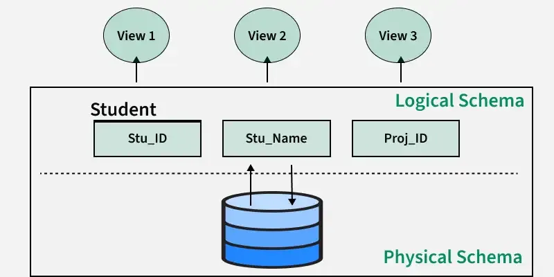
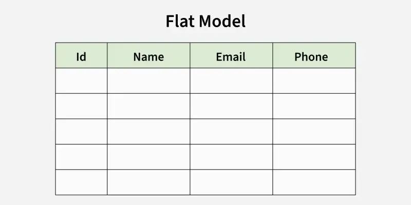
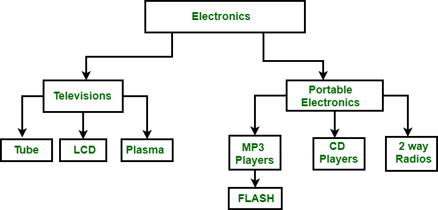
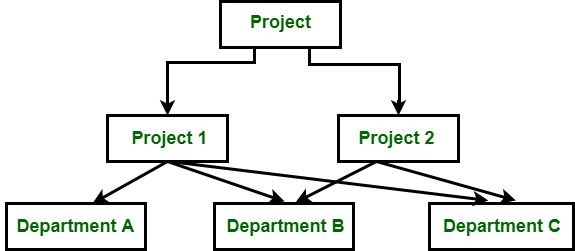
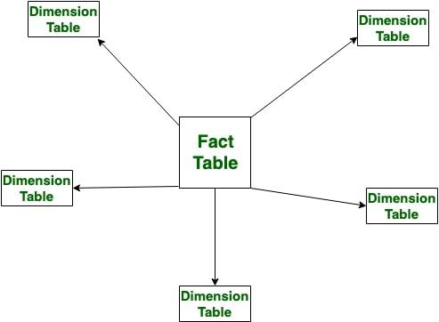

# Bài giảng: Database Schemas

**Cập nhật lần cuối:** 08/12/2025

**Nguồn tham khảo:** GeeksforGeeks - [Difference between Schema and Instance in DBMS](https://www.geeksforgeeks.org/dbms/difference-between-schema-and-instance-in-dbms/)

---

## 1. Mục tiêu bài giảng

Sau khi hoàn thành bài học này, người học có thể:

1. Giải thích được khái niệm **database schema** và vai trò của schema trong cơ sở dữ liệu.
2. Phân biệt được **schema** và **database instance**.
3. Mô tả được các loại schema phổ biến:
   - Conceptual Database Schema.
   - Logical Database Schema.
   - Physical Database Schema.
   - View Database Schema.
4. Trình bày được một số mô hình thiết kế schema như flat model, hierarchical model, network model, relational model, star schema và snowflake schema.
5. So sánh được logical schema và physical schema.
6. Phân tích được lợi ích của database schema đối với tính nhất quán, hiệu năng, bảo trì, bảo mật và khả năng mở rộng.
7. Vận dụng kiến thức để lựa chọn kiểu schema phù hợp trong một số hệ thống thực tế.

---

## 2. Database Schema là gì?

**Database schema** là cấu trúc hoặc bản thiết kế của cơ sở dữ liệu. Schema mô tả cách dữ liệu được tổ chức, lưu trữ logic và liên kết với nhau trong hệ thống.

Schema có thể mô tả:

- Các bảng trong cơ sở dữ liệu.
- Các trường dữ liệu hoặc cột.
- Kiểu dữ liệu.
- Khóa chính.
- Khóa ngoại.
- Quan hệ giữa các bảng.
- View.
- Index.
- Ràng buộc toàn vẹn dữ liệu.
- Các đối tượng cơ sở dữ liệu khác.

Nói đơn giản, database schema giống như **bản thiết kế kiến trúc** của một tòa nhà. Dữ liệu thực tế là những gì được đặt vào bên trong tòa nhà đó.

---

<p align="center">
  
</p>

<p align="center">
  <em>Hình 1. Minh họa khái niệm database schema.</em>
</p>

<!-- Ảnh gốc đã lưu tại: images/schema_3.jpg -->

---

## 3. Schema trong DBMS

Trong DBMS, **schema** định nghĩa khung tổ chức dữ liệu. Nó cho biết dữ liệu được lưu theo cấu trúc nào và những quy tắc nào chi phối dữ liệu đó.

Schema giúp:

- Dữ liệu có cấu trúc rõ ràng.
- Người thiết kế hiểu được quan hệ giữa các thực thể.
- DBMS kiểm soát ràng buộc dữ liệu.
- Truy vấn và cập nhật dữ liệu chính xác hơn.
- Hạn chế dữ liệu dư thừa và thiếu nhất quán.
- Tăng khả năng bảo trì và mở rộng hệ thống.

Ví dụ trong hệ thống quản lý sinh viên, schema có thể gồm:

```text
Students(student_id, full_name, date_of_birth, major_id)
Majors(major_id, major_name)
Courses(course_id, course_name, credits)
Enrollments(student_id, course_id, semester, grade)
```

Trong ví dụ này:

- `Students` lưu thông tin sinh viên.
- `Majors` lưu thông tin ngành học.
- `Courses` lưu thông tin học phần.
- `Enrollments` lưu thông tin đăng ký học phần và điểm.
- `major_id` liên kết sinh viên với ngành học.
- `student_id` và `course_id` liên kết sinh viên với học phần.

---

### Quiz: Khái niệm Database Schema

**Câu 1.** Database schema là gì?

A. Dữ liệu thực tế trong database tại một thời điểm  
B. Bản thiết kế mô tả cấu trúc và tổ chức dữ liệu trong database  
C. Một phần mềm chỉnh sửa ảnh  
D. Một loại ngôn ngữ lập trình thay thế SQL  

**Câu 2.** Schema thường mô tả thành phần nào?

A. Bảng, cột, khóa, quan hệ và ràng buộc  
B. Màu nền của giao diện  
C. Tốc độ quạt CPU  
D. Độ sáng màn hình  

**Câu 3.** Vai trò quan trọng của schema là gì?

A. Giúp dữ liệu được tổ chức nhất quán và dễ quản lý  
B. Xóa dữ liệu sau mỗi lần truy vấn  
C. Làm cho database không thể mở rộng  
D. Thay thế hoàn toàn DBMS  

---

## 4. Database Schema

Một **database schema** là thiết kế tổng thể của cơ sở dữ liệu, định nghĩa cách dữ liệu được tổ chức và cách các thành phần dữ liệu liên hệ với nhau.

Database schema có thể xem như một framework giúp người dùng, lập trình viên và quản trị viên hiểu:

- Dữ liệu nào được lưu.
- Dữ liệu được chia thành những bảng hoặc đối tượng nào.
- Các bảng liên hệ với nhau như thế nào.
- Những ràng buộc nào cần được đảm bảo.
- Cách truy cập và duy trì dữ liệu.

Các điểm chính về database schema:

1. **Tổ chức dữ liệu logic**

   Schema định nghĩa các bảng, trường và quan hệ giữa dữ liệu.

2. **Biểu diễn quan hệ giữa thực thể**

   Schema mô tả primary key, foreign key và các quan hệ giữa entity.

3. **Giải quyết vấn đề dữ liệu phi cấu trúc**

   Schema giúp tổ chức dữ liệu rõ ràng và dễ kiểm soát hơn.

4. **Hướng dẫn truy cập và cập nhật dữ liệu**

   Schema là nền tảng để truy vấn, sửa đổi và duy trì dữ liệu.

---

<p align="center">
  
</p>

<p align="center">
  <em>Hình 2. Các loại database schema.</em>
</p>

<!-- Ảnh gốc đã lưu tại: images/schema_2.webp -->

---

## 5. Các loại Database Schema

Database schema có thể được chia thành nhiều loại tùy theo mức trừu tượng và mục đích sử dụng.

Các loại chính gồm:

1. **Conceptual Database Schema**.
2. **Logical Database Schema**.
3. **Physical Database Schema**.
4. **View Database Schema**.

---

## 6. Conceptual Database Schema

### 6.1. Khái niệm

**Conceptual Database Schema** mô tả cấu trúc tổng thể của toàn bộ cơ sở dữ liệu ở mức cao.

Nó tập trung vào:

- Ý nghĩa của dữ liệu.
- Các thực thể chính.
- Thuộc tính của thực thể.
- Quan hệ giữa các thực thể.
- Yêu cầu nghiệp vụ của tổ chức.

Conceptual schema không quan tâm dữ liệu được lưu vật lý như thế nào, dùng DBMS nào, phần cứng nào hay câu lệnh SQL cụ thể ra sao.

### 6.2. Đặc điểm chính

Conceptual schema có các đặc điểm:

- Đại diện cho toàn bộ database ở cấp độ tổ chức.
- Mô tả entity, attribute và relationship.
- Độc lập với công nghệ.
- Thường được thiết kế bằng ER diagram.
- Là cầu nối giữa yêu cầu người dùng và logical schema.

### 6.3. Ví dụ

Trong hệ thống trường học, conceptual schema có thể gồm các entity:

- Students.
- Courses.
- Teachers.
- Departments.

Các quan hệ có thể gồm:

- Student enrolls in Course.
- Teacher teaches Course.
- Department manages Course.
- Student belongs to Department.

---

## 7. Logical Database Schema

### 7.1. Khái niệm

**Logical Database Schema** mô tả cấu trúc logic của dữ liệu như cách nó xuất hiện với người thiết kế cơ sở dữ liệu và lập trình viên.

Nó định nghĩa:

- Bảng.
- Cột.
- Khóa chính.
- Khóa ngoại.
- Quan hệ.
- Ràng buộc toàn vẹn.
- Kiểu dữ liệu ở mức logic.

Logical schema được xây dựng từ conceptual schema và tập trung vào cách dữ liệu được tổ chức logic, không quan tâm cách dữ liệu được lưu trên đĩa.

### 7.2. Ví dụ

Từ conceptual schema của hệ thống trường học, logical schema có thể được chuyển thành:

```sql
CREATE TABLE Students (
    student_id VARCHAR(10) PRIMARY KEY,
    full_name VARCHAR(100),
    department_id VARCHAR(10)
);

CREATE TABLE Departments (
    department_id VARCHAR(10) PRIMARY KEY,
    department_name VARCHAR(100)
);

CREATE TABLE Courses (
    course_id VARCHAR(10) PRIMARY KEY,
    course_name VARCHAR(100),
    credits INT
);

CREATE TABLE Enrollments (
    student_id VARCHAR(10),
    course_id VARCHAR(10),
    semester VARCHAR(20),
    grade DECIMAL(4,2),
    PRIMARY KEY (student_id, course_id, semester),
    FOREIGN KEY (student_id) REFERENCES Students(student_id),
    FOREIGN KEY (course_id) REFERENCES Courses(course_id)
);
```

---

## 8. Physical Database Schema

### 8.1. Khái niệm

**Physical Database Schema** mô tả cách dữ liệu thực sự được lưu trữ trên thiết bị lưu trữ.

Nó liên quan đến:

- File lưu trữ.
- Index.
- Partition.
- Storage block.
- Access path.
- Cách phân bổ dữ liệu trên đĩa.
- Tối ưu hóa hiệu năng lưu trữ và truy xuất.

Physical schema là mức thấp nhất của trừu tượng hóa, phụ thuộc vào DBMS cụ thể như MySQL, PostgreSQL, Oracle hoặc SQL Server.

### 8.2. Ai thiết kế Physical Schema?

Physical schema thường do:

- Database Administrator.
- Kỹ sư hệ thống.
- Chuyên gia tối ưu hiệu năng.
- Người quản trị hạ tầng dữ liệu.

thiết kế và quản lý.

### 8.3. Ví dụ

Trong MySQL, DBA có thể tạo index để tăng tốc tìm kiếm:

```sql
CREATE INDEX idx_students_department
ON Students(department_id);
```

Hoặc partition bảng lớn để tối ưu truy vấn:

```sql
PARTITION BY RANGE (YEAR(created_at));
```

---

## 9. View Database Schema

### 9.1. Khái niệm

**View Database Schema** là mức cao nhất của trừu tượng hóa, mô tả cách từng người dùng hoặc ứng dụng nhìn thấy dữ liệu.

Một database có thể có nhiều view schema khác nhau. Mỗi view schema chỉ hiển thị một phần dữ liệu phù hợp với nhu cầu của một nhóm người dùng.

### 9.2. Ví dụ

Trong hệ thống trường học:

- Sinh viên chỉ xem điểm và môn học của chính mình.
- Giảng viên xem danh sách lớp và điểm của lớp mình dạy.
- Phòng đào tạo xem toàn bộ dữ liệu học vụ.
- Quản trị viên xem và quản lý toàn bộ hệ thống.

Một view SQL có thể được định nghĩa như sau:

```sql
CREATE VIEW StudentGradeView AS
SELECT student_id, course_id, semester, grade
FROM Enrollments;
```

### 9.3. Vai trò

View schema giúp:

- Tăng bảo mật.
- Đơn giản hóa dữ liệu cho từng nhóm người dùng.
- Che giấu chi tiết logic và vật lý phức tạp.
- Cho phép nhiều cách nhìn khác nhau trên cùng một database.

---

### Quiz: Các loại Database Schema

**Câu 1.** Conceptual schema thường mô tả điều gì?

A. Entity, attribute và relationship ở mức cao  
B. Block vật lý trên đĩa  
C. Màu giao diện ứng dụng  
D. Tốc độ mạng  

**Câu 2.** Logical schema thường định nghĩa điều gì?

A. Bảng, cột, khóa chính, khóa ngoại và ràng buộc  
B. Sector vật lý trên ổ cứng  
C. Hình nền máy tính  
D. Thiết bị chuột và bàn phím  

**Câu 3.** Physical schema tập trung vào điều gì?

A. Cách dữ liệu thực sự được lưu trữ và truy xuất  
B. Cách người dùng chọn màu chữ  
C. Cách tạo slide trình chiếu  
D. Cách viết email  

**Câu 4.** View schema dùng để làm gì?

A. Hiển thị dữ liệu phù hợp với từng người dùng hoặc ứng dụng  
B. Xóa dữ liệu vật lý  
C. Thay thế toàn bộ DBMS  
D. Tắt máy chủ database  

---

## 10. Tạo Database Schema

Trong SQL, câu lệnh `CREATE SCHEMA` có thể được dùng để tạo schema. Tuy nhiên, ý nghĩa của câu lệnh này có thể khác nhau giữa các hệ quản trị cơ sở dữ liệu.

### 10.1. MySQL

Trong MySQL, `CREATE SCHEMA` và `CREATE DATABASE` gần như tương đương.

Ví dụ:

```sql
CREATE SCHEMA school_db;
```

hoặc:

```sql
CREATE DATABASE school_db;
```

### 10.2. SQL Server

Trong SQL Server, `CREATE SCHEMA` dùng để tạo một schema mới trong database.

Ví dụ:

```sql
CREATE SCHEMA sales;
```

Sau đó có thể tạo bảng thuộc schema đó:

```sql
CREATE TABLE sales.Orders (
    order_id INT PRIMARY KEY,
    order_date DATE
);
```

### 10.3. Oracle Database

Trong Oracle, schema thường gắn với user. Khi tạo user, một schema tương ứng được tạo.

Ví dụ:

```sql
CREATE USER school_user IDENTIFIED BY password;
```

Trong Oracle, `CREATE SCHEMA` không đơn giản là tạo schema mới như trong SQL Server. Nó có thể được dùng để tạo nhiều đối tượng như table và view trong một giao dịch.

---

## 11. Database Schema Designs

Có nhiều cách thiết kế schema tùy thuộc vào yêu cầu ứng dụng.

Các mô hình phổ biến gồm:

1. Flat Model.
2. Hierarchical Model.
3. Network Model.
4. Relational Model.
5. Star Schema.
6. Snowflake Schema.

---

## 12. Flat Model

### 12.1. Khái niệm

**Flat Model** là mô hình dữ liệu dạng bảng hai chiều. Mỗi cột chứa cùng một loại dữ liệu và mỗi hàng biểu diễn một bản ghi.

Flat model giống như spreadsheet hoặc bảng đơn giản.

### 12.2. Phù hợp với

Flat model phù hợp với:

- Ứng dụng nhỏ.
- Dữ liệu ít quan hệ phức tạp.
- Danh sách đơn giản.
- Bảng dữ liệu dạng spreadsheet.

### 12.3. Ví dụ

```text
StudentID | FullName      | Major
S001      | Nguyen Van A  | Data Science
S002      | Tran Thi B    | AI
S003      | Le Van C      | Information Systems
```

---

<p align="center">
  
</p>

<p align="center">
  <em>Hình 3. Flat Model.</em>
</p>

<!-- Ảnh gốc đã lưu tại: images/flat_model.webp -->

---

## 13. Hierarchical Model

### 13.1. Khái niệm

**Hierarchical Model** tổ chức dữ liệu theo quan hệ cha - con, tạo thành cấu trúc cây.

Mỗi record có thể có nhiều record con, nhưng thường chỉ có một record cha.

Mô hình này phù hợp để biểu diễn quan hệ **one-to-many**.

### 13.2. Ví dụ

Trong tổ chức doanh nghiệp:

```text
Company
├── Department A
│   ├── Employee 1
│   └── Employee 2
└── Department B
    ├── Employee 3
    └── Employee 4
```

### 13.3. Phù hợp với

- Dữ liệu dạng cây.
- Cấu trúc tổ chức.
- Danh mục phân cấp.
- Dữ liệu nested.

---

<p align="center">
  
</p>

<p align="center">
  <em>Hình 4. Hierarchical Model.</em>
</p>

<!-- Ảnh gốc đã lưu tại: images/hierarchical.png -->

---

## 14. Network Model

### 14.1. Khái niệm

**Network Model** tương tự hierarchical model ở chỗ dữ liệu được biểu diễn bằng node và relationship. Tuy nhiên, network model linh hoạt hơn vì cho phép quan hệ **many-to-many**.

Trong network model:

- Một node có thể có nhiều node cha.
- Một node có thể có nhiều node con.
- Có thể tồn tại chu trình.
- Dữ liệu có tính liên kết cao hơn.

### 14.2. Ví dụ

Một sinh viên có thể đăng ký nhiều môn học và một môn học có thể có nhiều sinh viên.

```text
Student A ── Course 1
Student A ── Course 2
Student B ── Course 1
Student B ── Course 3
```

---

<p align="center">
  
</p>

<p align="center">
  <em>Hình 5. Network Model.</em>
</p>

<!-- Ảnh gốc đã lưu tại: images/network.png -->

---

## 15. Relational Model

### 15.1. Khái niệm

**Relational Model** là mô hình phổ biến nhất trong các cơ sở dữ liệu quan hệ. Dữ liệu được lưu dưới dạng các bảng, còn gọi là relations.

Mỗi bảng gồm:

- Hàng.
- Cột.
- Khóa chính.
- Khóa ngoại.
- Ràng buộc dữ liệu.

### 15.2. Ví dụ

```text
Students(student_id, full_name, major_id)
Majors(major_id, major_name)
```

Quan hệ giữa hai bảng được biểu diễn bằng khóa ngoại `major_id`.

### 15.3. Phù hợp với

- Hệ thống quản lý nghiệp vụ.
- Ứng dụng web.
- Hệ thống tài chính.
- Hệ thống giáo dục.
- Ứng dụng cần dữ liệu có cấu trúc rõ ràng.

---

<p align="center">
  
</p>

<p align="center">
  <em>Hình 6. Relational Model.</em>
</p>

<!-- Ảnh gốc đã lưu tại: images/relational.jpg -->

---

## 16. Star Schema

### 16.1. Khái niệm

**Star Schema** thường dùng trong data warehouse và phân tích dữ liệu lớn.

Mô hình này có:

- Một **fact table** ở trung tâm.
- Nhiều **dimension table** kết nối xung quanh.

Fact table chứa dữ liệu số đo hoặc sự kiện nghiệp vụ, ví dụ:

- Doanh thu.
- Số lượng bán.
- Chi phí.
- Lợi nhuận.

Dimension table chứa thông tin mô tả, ví dụ:

- Product.
- Time.
- Customer.
- Store.
- Region.

### 16.2. Ví dụ

```text
            Dim_Product
                 |
Dim_Time --- Fact_Sales --- Dim_Customer
                 |
             Dim_Store
```

### 16.3. Phù hợp với

- Data warehouse.
- Business intelligence.
- Báo cáo doanh thu.
- Phân tích dữ liệu lớn.
- OLAP.

---

<p align="center">
  
</p>

<p align="center">
  <em>Hình 7. Star Schema.</em>
</p>

<!-- Ảnh gốc đã lưu tại: images/star_schema.jpg -->

---

## 17. Snowflake Schema

### 17.1. Khái niệm

**Snowflake Schema** giống star schema ở chỗ có fact table ở trung tâm và nhiều dimension table kết nối xung quanh.

Điểm khác biệt chính là trong snowflake schema, các dimension table được chuẩn hóa tiếp thành nhiều bảng liên quan.

### 17.2. Ví dụ

Thay vì bảng `Dim_Product` chứa tất cả thông tin sản phẩm, nó có thể được tách thành:

```text
Dim_Product
Dim_Category
Dim_Brand
Dim_Supplier
```

### 17.3. Phù hợp với

- Phân tích dữ liệu lớn.
- Data warehouse cần giảm dư thừa dữ liệu.
- Hệ thống cần dimension được chuẩn hóa.
- Môi trường cần kiểm soát tính nhất quán của dữ liệu mô tả.

---

<p align="center">
  
</p>

<p align="center">
  <em>Hình 8. Snowflake Schema.</em>
</p>

<!-- Ảnh gốc đã lưu tại: images/snowflake_schema.jpg -->

---

## 18. So sánh Logical Schema và Physical Schema

| Tiêu chí | Logical Schema | Physical Schema |
|---|---|---|
| Mục tiêu | Mô tả cấu trúc logic và quan hệ giữa dữ liệu | Mô tả cách dữ liệu được lưu trên đĩa |
| Mức trừu tượng | Cao hơn | Thấp hơn |
| Phụ thuộc DBMS | Ít phụ thuộc hơn | Phụ thuộc vào DBMS và hạ tầng |
| Thành phần | Bảng, thuộc tính, khóa, quan hệ | File, index, storage structure, access path |
| Người thiết kế | Database designer, developer | DBA, system administrator |
| Ví dụ | ER diagram, table design, class diagram | DDL, index, storage structure |
| Mối quan tâm | Tính đúng đắn và ý nghĩa dữ liệu | Hiệu năng, lưu trữ và truy xuất |

---

## 19. Lợi ích của Database Schema

### 19.1. Đảm bảo tính nhất quán dữ liệu

Schema giúp định nghĩa ràng buộc, khóa chính, khóa ngoại và kiểu dữ liệu. Nhờ đó, dữ liệu được lưu trữ nhất quán hơn và hạn chế trùng lặp.

### 19.2. Hỗ trợ khả năng mở rộng

Một schema được thiết kế tốt giúp dễ thêm bảng mới, mở rộng quan hệ và xử lý khối lượng dữ liệu ngày càng tăng.

### 19.3. Cải thiện hiệu năng

Schema hợp lý giúp truy vấn dữ liệu nhanh hơn thông qua:

- Thiết kế bảng hợp lý.
- Index phù hợp.
- Quan hệ rõ ràng.
- Giảm dư thừa dữ liệu.
- Tối ưu mô hình lưu trữ.

### 19.4. Dễ bảo trì

Schema rõ ràng giúp developer, DBA và nhà phân tích hiểu cấu trúc dữ liệu, từ đó dễ bảo trì và phát triển hệ thống.

### 19.5. Tăng bảo mật dữ liệu

Schema có thể kết hợp với view, quyền truy cập và phân quyền để bảo vệ dữ liệu nhạy cảm, chỉ cho phép người dùng được ủy quyền truy cập phần dữ liệu phù hợp.

---

### Quiz: Schema Design và lợi ích

**Câu 1.** Star schema thường phù hợp nhất với hệ thống nào?

A. Data warehouse và phân tích dữ liệu  
B. Ứng dụng không lưu dữ liệu  
C. Trình phát nhạc  
D. Trình chỉnh sửa ảnh  

**Câu 2.** Snowflake schema khác star schema ở điểm nào?

A. Dimension table được chuẩn hóa thành nhiều bảng liên quan  
B. Không có fact table  
C. Không dùng cho phân tích dữ liệu  
D. Chỉ dùng cho file text  

**Câu 3.** Một lợi ích của database schema là gì?

A. Đảm bảo tính nhất quán và dễ bảo trì dữ liệu  
B. Xóa toàn bộ database sau mỗi truy vấn  
C. Làm hệ thống không thể mở rộng  
D. Không cho phép tạo bảng mới  

---

## 20. Database Instance

### 20.1. Khái niệm

**Database instance** là trạng thái hoặc ảnh chụp của cơ sở dữ liệu tại một thời điểm cụ thể.

Nếu database schema là bản thiết kế, thì database instance là dữ liệu thực tế đang có trong database tại một thời điểm.

Ví dụ, schema định nghĩa bảng `Students` gồm các cột:

```text
student_id, full_name, major
```

Còn instance là các dòng dữ liệu hiện tại:

```text
S001, Nguyen Van A, Data Science
S002, Tran Thi B, Artificial Intelligence
S003, Le Van C, Information Systems
```

---

<p align="center">
  
</p>

<p align="center">
  <em>Hình 9. Database Instance.</em>
</p>

<!-- Ảnh gốc đã lưu tại: images/database_instance.webp -->

---

## 21. So sánh Database Schema và Database Instance

| Tiêu chí | Database Schema | Database Instance |
|---|---|---|
| Định nghĩa | Bản thiết kế cấu trúc database | Dữ liệu thực tế tại một thời điểm |
| Bản chất | Tương đối tĩnh | Thay đổi thường xuyên |
| Đại diện cho | Cấu trúc: bảng, cột, kiểu dữ liệu, quan hệ | Trạng thái dữ liệu hiện tại |
| Ví dụ | Định nghĩa bảng, constraint, data type | Các dòng dữ liệu trong bảng |
| Tần suất thay đổi | Ít thay đổi | Thay đổi liên tục khi có insert, update, delete |
| Người quan tâm | Designer, developer, DBA | Người dùng, ứng dụng, nhà phân tích |

---

### Quiz: Schema và Instance

**Câu 1.** Database instance là gì?

A. Dữ liệu thực tế trong database tại một thời điểm  
B. Bản thiết kế cấu trúc database  
C. Một loại index  
D. Một loại hệ điều hành  

**Câu 2.** Database schema thường có tính chất nào?

A. Tương đối tĩnh, ít thay đổi  
B. Thay đổi sau mỗi truy vấn SELECT  
C. Không liên quan đến cấu trúc dữ liệu  
D. Chỉ tồn tại trong file ảnh  

**Câu 3.** Database instance thay đổi khi nào?

A. Khi có insert, update hoặc delete dữ liệu  
B. Khi đổi màu màn hình  
C. Khi mở trình duyệt  
D. Khi tắt loa máy tính  

---

## 22. Câu hỏi ôn tập

### 22.1. Câu hỏi trắc nghiệm

**Câu 1.** Database schema là gì?

A. Bản thiết kế cấu trúc và tổ chức dữ liệu trong database  
B. Dữ liệu thực tế tại một thời điểm  
C. Một trình duyệt web  
D. Một phần mềm chỉnh sửa video  

---

**Câu 2.** Conceptual schema thường được thiết kế bằng công cụ nào?

A. ER diagram  
B. Paint  
C. Trình phát nhạc  
D. File âm thanh  

---

**Câu 3.** Physical schema liên quan đến yếu tố nào?

A. File, index, partition, storage block  
B. Chỉ giao diện người dùng  
C. Chỉ tên sinh viên  
D. Chỉ nội dung email  

---

**Câu 4.** View schema giúp gì?

A. Hiển thị phần dữ liệu phù hợp cho từng nhóm người dùng  
B. Xóa toàn bộ database  
C. Tắt DBMS  
D. Thay thế mọi bảng bằng ảnh  

---

**Câu 5.** Mô hình nào dùng parent-child relationship?

A. Hierarchical Model  
B. Flat Model  
C. Star Schema  
D. Snowflake Schema  

---

**Câu 6.** Mô hình nào cho phép quan hệ many-to-many linh hoạt hơn hierarchical model?

A. Network Model  
B. Flat Model  
C. Spreadsheet  
D. Single table model  

---

**Câu 7.** Relational model lưu dữ liệu chủ yếu dưới dạng nào?

A. Bảng  
B. Ảnh  
C. Âm thanh  
D. Video  

---

**Câu 8.** Star schema thường có gì ở trung tâm?

A. Fact table  
B. User interface  
C. Operating system  
D. Email server  

---

**Câu 9.** Database instance là gì?

A. Dữ liệu thực tế tại một thời điểm  
B. Bản thiết kế database  
C. Lược đồ logic  
D. Chỉ mục vật lý  

---

**Câu 10.** Schema và instance khác nhau ở điểm nào?

A. Schema là cấu trúc, instance là dữ liệu thực tế  
B. Schema thay đổi từng giây, instance không bao giờ thay đổi  
C. Schema là dữ liệu, instance là giao diện  
D. Hai khái niệm hoàn toàn giống nhau  

---

### 22.2. Câu hỏi tự luận ngắn

**Câu 1.** Giải thích khái niệm database schema bằng ví dụ.

---

**Câu 2.** Phân biệt conceptual schema, logical schema, physical schema và view schema.

---

**Câu 3.** Vì sao database schema giúp đảm bảo tính nhất quán dữ liệu?

---

**Câu 4.** So sánh star schema và snowflake schema.

---

**Câu 5.** Phân biệt database schema và database instance.

---

## 23. Bài tập vận dụng

### Bài tập 1

Một trường đại học cần xây dựng database quản lý sinh viên, ngành học, môn học, giảng viên và điểm.

**Yêu cầu:**  
Hãy đề xuất conceptual schema ở mức entity và relationship.

---

### Bài tập 2

Từ bài tập 1, hãy đề xuất logical schema gồm các bảng, khóa chính và khóa ngoại.

---

### Bài tập 3

Một hệ thống bán lẻ muốn phân tích doanh thu theo thời gian, sản phẩm, khách hàng và chi nhánh.

**Yêu cầu:**  
Hãy đề xuất star schema cho hệ thống này.

---

### Bài tập 4

Một bệnh viện muốn mỗi nhóm người dùng chỉ xem phần dữ liệu phù hợp:

- Bác sĩ xem hồ sơ bệnh nhân.
- Kế toán xem thanh toán.
- Bệnh nhân xem kết quả của chính mình.
- Quản trị viên xem toàn bộ.

**Yêu cầu:**  
Hãy đề xuất view schema cho từng nhóm.

---

### Bài tập 5

Cho bảng `Students(student_id, full_name, major_id)`. Hãy nêu:

1. Schema của bảng.
2. Một instance gồm ba dòng dữ liệu.
3. Một view chỉ hiển thị `student_id` và `full_name`.

---

## 24. Tóm tắt bài học

- Database schema là bản thiết kế mô tả cấu trúc, tổ chức và quan hệ dữ liệu trong database.
- Schema giúp dữ liệu nhất quán, dễ truy cập, dễ bảo trì và dễ mở rộng.
- Conceptual schema mô tả database ở mức nghiệp vụ và thường dùng ER diagram.
- Logical schema mô tả bảng, cột, khóa, quan hệ và ràng buộc.
- Physical schema mô tả cách dữ liệu được lưu trữ vật lý.
- View schema mô tả cách từng người dùng hoặc ứng dụng nhìn thấy dữ liệu.
- Các mô hình schema phổ biến gồm flat model, hierarchical model, network model, relational model, star schema và snowflake schema.
- Database schema là cấu trúc tương đối tĩnh, còn database instance là dữ liệu thực tế tại một thời điểm và thay đổi thường xuyên.

---

## 25. Từ khóa chính

- Database Schema
- Schema
- Database Instance
- Conceptual Schema
- Logical Schema
- Physical Schema
- View Schema
- ER Diagram
- Entity
- Attribute
- Relationship
- Primary Key
- Foreign Key
- Constraint
- Flat Model
- Hierarchical Model
- Network Model
- Relational Model
- Star Schema
- Snowflake Schema
- Fact Table
- Dimension Table
- Data Warehouse

---

## 26. Đáp án và gợi ý trả lời

### Quiz: Khái niệm Database Schema

- **Câu 1.** B
- **Câu 2.** A
- **Câu 3.** A

### Quiz: Các loại Database Schema

- **Câu 1.** A
- **Câu 2.** A
- **Câu 3.** A
- **Câu 4.** A

### Quiz: Schema Design và lợi ích

- **Câu 1.** A
- **Câu 2.** A
- **Câu 3.** A

### Quiz: Schema và Instance

- **Câu 1.** A
- **Câu 2.** A
- **Câu 3.** A

### Câu hỏi ôn tập - Trắc nghiệm

- **Câu 1.** A
- **Câu 2.** A
- **Câu 3.** A
- **Câu 4.** A
- **Câu 5.** A
- **Câu 6.** A
- **Câu 7.** A
- **Câu 8.** A
- **Câu 9.** A
- **Câu 10.** A

### Câu hỏi ôn tập - Tự luận ngắn

#### Câu 1

**Gợi ý trả lời:**

Database schema là bản thiết kế mô tả cấu trúc database, gồm bảng, cột, khóa, quan hệ và ràng buộc. Ví dụ, schema của hệ thống sinh viên có thể gồm bảng `Students`, `Majors`, `Courses` và `Enrollments`.

#### Câu 2

**Gợi ý trả lời:**

Conceptual schema mô tả entity và relationship ở mức nghiệp vụ. Logical schema chuyển các entity thành bảng, cột, khóa và ràng buộc. Physical schema mô tả cách dữ liệu được lưu trên đĩa, index và storage structure. View schema mô tả cách từng nhóm người dùng nhìn thấy dữ liệu.

#### Câu 3

**Gợi ý trả lời:**

Schema giúp đảm bảo tính nhất quán bằng cách định nghĩa kiểu dữ liệu, khóa chính, khóa ngoại, ràng buộc toàn vẹn và quan hệ giữa bảng. Nhờ đó, dữ liệu nhập vào phải tuân theo quy tắc đã định nghĩa.

#### Câu 4

**Gợi ý trả lời:**

Star schema có fact table ở trung tâm và các dimension table kết nối trực tiếp. Snowflake schema cũng có fact table, nhưng các dimension table được chuẩn hóa tiếp thành nhiều bảng nhỏ hơn để giảm dư thừa dữ liệu.

#### Câu 5

**Gợi ý trả lời:**

Database schema là cấu trúc hoặc bản thiết kế database, thường ít thay đổi. Database instance là dữ liệu thực tế trong database tại một thời điểm, thay đổi thường xuyên khi có thao tác insert, update hoặc delete.

### Bài tập vận dụng

#### Bài tập 1

**Gợi ý trả lời:**

Conceptual schema có thể gồm các entity: `Student`, `Major`, `Course`, `Teacher`, `Enrollment`. Quan hệ: Student belongs to Major; Student enrolls in Course; Teacher teaches Course; Enrollment stores grade.

#### Bài tập 2

**Gợi ý trả lời:**

Logical schema có thể gồm:

```text
Students(student_id PK, full_name, major_id FK)
Majors(major_id PK, major_name)
Teachers(teacher_id PK, full_name)
Courses(course_id PK, course_name, teacher_id FK)
Enrollments(student_id FK, course_id FK, semester, grade)
```

#### Bài tập 3

**Gợi ý trả lời:**

Star schema có thể gồm fact table `FactSales(sales_id, time_id, product_id, customer_id, branch_id, quantity, revenue)` và dimension tables `DimTime`, `DimProduct`, `DimCustomer`, `DimBranch`.

#### Bài tập 4

**Gợi ý trả lời:**

Bác sĩ có view xem hồ sơ và kết quả điều trị bệnh nhân phụ trách. Kế toán có view xem hóa đơn và thanh toán. Bệnh nhân có view xem kết quả cá nhân. Quản trị viên có view toàn bộ dữ liệu và quyền quản lý.

#### Bài tập 5

**Gợi ý trả lời:**

Schema: `Students(student_id, full_name, major_id)`. Instance gồm ba dòng như `S001, Nguyen Van A, DS`; `S002, Tran Thi B, AI`; `S003, Le Van C, IS`. View:

```sql
CREATE VIEW StudentBasicView AS
SELECT student_id, full_name
FROM Students;
```
