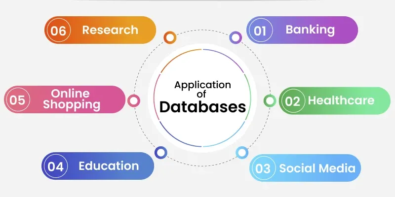
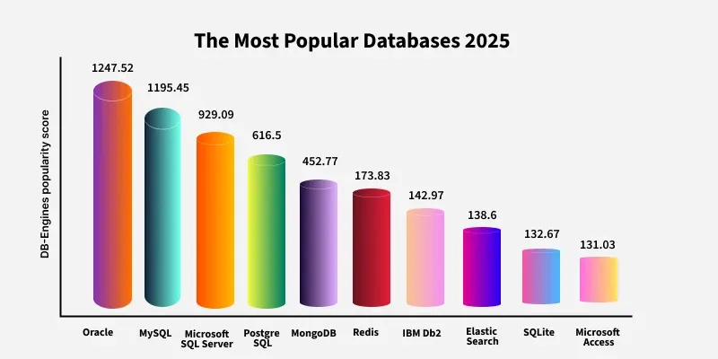
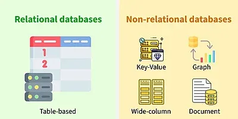
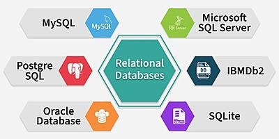
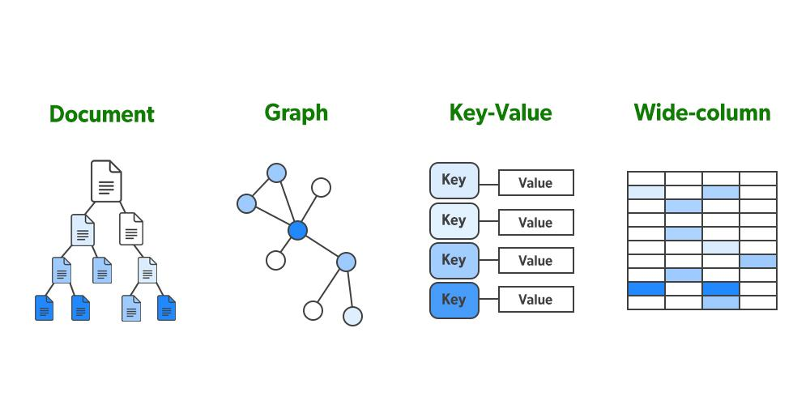

# Giới thiệu về Cơ sở dữ liệu

**Cập nhật lần cuối:** 28/04/2026

**Nguồn tham khảo:** GeeksforGeeks - [Getting started with Databases: Essential Guide for Beginners](https://www.geeksforgeeks.org/getting-started-with-database-management-system/)

---

## 1. Mục tiêu bài giảng

Sau khi hoàn thành bài học này, người học có thể:

1. Giải thích được khái niệm **dữ liệu** và **cơ sở dữ liệu**.
2. Trình bày được vai trò của **hệ quản trị cơ sở dữ liệu** trong việc lưu trữ, truy xuất và quản lý dữ liệu.
3. Mô tả được các thành phần chính của một cơ sở dữ liệu.
4. Phân biệt được hai nhóm cơ sở dữ liệu phổ biến: **Relational Database** và **NoSQL Database**.
5. Giải thích được ý nghĩa của các tính chất **ACID** trong giao dịch cơ sở dữ liệu.
6. Nhận diện được các ứng dụng thực tế của cơ sở dữ liệu trong nhiều lĩnh vực.
7. Lựa chọn được loại cơ sở dữ liệu phù hợp với một số miền công nghệ như Web, Mobile, DevOps, Data Engineering, Data Science, AI, Cloud và Blockchain/Web3.

---

## 2. Khái niệm dữ liệu và cơ sở dữ liệu

**Dữ liệu** (*data*) là các sự kiện, con số hoặc thông tin thô, chưa được tổ chức và chưa có nhiều ý nghĩa nếu đứng riêng lẻ.

Ví dụ:

- Tên khách hàng.
- Số điện thoại.
- Mã sinh viên.
- Điểm thi.
- Ngày giao dịch.
- Ảnh, video, âm thanh.
- Dữ liệu cảm biến.

Khi dữ liệu được xử lý, sắp xếp và phân tích, nó có thể tạo ra **thông tin có ý nghĩa** phục vụ cho việc ra quyết định.

**Cơ sở dữ liệu** (*database*) là một hệ thống có cấu trúc dùng để **lưu trữ**, **quản lý**, **truy xuất** và **cập nhật** dữ liệu một cách hiệu quả cho nhiều người dùng và nhiều ứng dụng khác nhau.

Cơ sở dữ liệu quan trọng vì các đặc điểm sau:

1. **Khả năng mở rộng**

   Cơ sở dữ liệu có thể xử lý khối lượng dữ liệu lớn một cách hiệu quả.

2. **Tính toàn vẹn dữ liệu**

   Cơ sở dữ liệu duy trì độ chính xác của dữ liệu thông qua các quy tắc, ràng buộc và kiểm soát hợp lệ.

3. **Bảo mật**

   Cơ sở dữ liệu bảo vệ dữ liệu thông qua quyền truy cập, phân quyền người dùng và các cơ chế kiểm soát bảo mật.

4. **Phân tích dữ liệu**

   Cơ sở dữ liệu giúp lưu trữ và tổ chức dữ liệu để phục vụ phân tích, từ đó hỗ trợ ra quyết định tốt hơn.



---

### Quiz nhanh: Khái niệm dữ liệu và cơ sở dữ liệu

**Câu 1.** Dữ liệu là gì?

A. Thông tin đã được phân tích hoàn chỉnh  
B. Các sự kiện, con số hoặc thông tin thô chưa được xử lý  
C. Một phần mềm quản lý dữ liệu  
D. Một dạng ngôn ngữ lập trình  

**Câu 2.** Cơ sở dữ liệu được dùng chủ yếu để làm gì?

A. Thiết kế giao diện người dùng  
B. Lưu trữ, quản lý và truy xuất dữ liệu  
C. Chỉ để viết chương trình Python  
D. Chỉ để lưu ảnh  

**Câu 3.** Đặc điểm nào giúp cơ sở dữ liệu xử lý khối lượng dữ liệu lớn?

A. Security  
B. Scalability  
C. Isolation  
D. Durability  

---

## 3. Cách cơ sở dữ liệu hoạt động

Cơ sở dữ liệu hoạt động bằng cách tổ chức và lưu trữ thông tin theo một định dạng có cấu trúc hoặc phi cấu trúc, cho phép người dùng dễ dàng:

- Truy cập dữ liệu.
- Tìm kiếm dữ liệu.
- Truy xuất dữ liệu.
- Cập nhật dữ liệu.
- Xóa dữ liệu.
- Quản lý quyền truy cập.

Ở trung tâm của hầu hết các hệ thống cơ sở dữ liệu là **hệ quản trị cơ sở dữ liệu** (*Database Management System - DBMS*).

DBMS là lớp phần mềm trung gian giữa người dùng và dữ liệu thô. Người dùng không cần biết chi tiết vật lý về nơi dữ liệu được lưu trữ trên ổ đĩa, cách hệ thống tổ chức tệp hay cách truy xuất từng khối dữ liệu. Thay vào đó, họ tương tác với DBMS thông qua câu lệnh truy vấn hoặc ứng dụng.

Quy trình hoạt động cơ bản như sau:

1. Người dùng hoặc ứng dụng gửi một yêu cầu đến DBMS.

   Ví dụ: tìm kiếm khách hàng, cập nhật điểm sinh viên, thêm đơn hàng mới.

2. DBMS tiếp nhận và xử lý yêu cầu.

   DBMS kiểm tra cú pháp truy vấn, kiểm tra quyền truy cập, tối ưu hóa truy vấn và xác định dữ liệu cần lấy hoặc thay đổi.

3. DBMS truy cập dữ liệu liên quan.

   Dữ liệu có thể được lấy từ bảng, chỉ mục, tệp lưu trữ hoặc các cấu trúc dữ liệu nội bộ khác.

4. DBMS trả kết quả về cho người dùng hoặc ứng dụng.

   Kết quả thường được trả về dưới dạng bảng, bản ghi, tài liệu hoặc đối tượng tùy loại cơ sở dữ liệu.

Ngoài các thao tác truy vấn và cập nhật, DBMS còn cung cấp nhiều chức năng quan trọng:

- Sao lưu dữ liệu.
- Khôi phục dữ liệu khi có lỗi.
- Tối ưu hiệu năng.
- Quản lý giao dịch.
- Kiểm soát truy cập.
- Đảm bảo an toàn dữ liệu.
- Quản lý đồng thời khi nhiều người dùng cùng truy cập.



---

### Quiz nhanh: Cách cơ sở dữ liệu hoạt động

**Câu 1.** DBMS đóng vai trò gì trong hệ thống cơ sở dữ liệu?

A. Là lớp trung gian giữa người dùng và dữ liệu  
B. Là thiết bị phần cứng dùng để lưu trữ dữ liệu  
C. Là ngôn ngữ lập trình thay thế SQL  
D. Là phần mềm chỉ dùng để vẽ biểu đồ  

**Câu 2.** Khi người dùng gửi truy vấn, DBMS thường làm gì?

A. Bỏ qua truy vấn  
B. Xử lý truy vấn, tìm dữ liệu phù hợp và trả kết quả  
C. Luôn xóa dữ liệu trước khi trả kết quả  
D. Chỉ lưu truy vấn vào tệp văn bản  

**Câu 3.** Chức năng nào sau đây là chức năng quan trọng của DBMS?

A. Sao lưu và khôi phục dữ liệu  
B. Chỉ phát nhạc  
C. Chỉ chỉnh sửa ảnh  
D. Chỉ biên dịch chương trình C++  

---

## 4. Các thành phần của một cơ sở dữ liệu

Một cơ sở dữ liệu bao gồm nhiều thành phần phối hợp với nhau để lưu trữ, tổ chức, quản lý và truy xuất dữ liệu hiệu quả.

### 4.1. Dữ liệu

**Dữ liệu** là thông tin thực tế được lưu trong cơ sở dữ liệu.

Dữ liệu có thể là:

- Văn bản.
- Số.
- Ngày tháng.
- Hình ảnh.
- Tệp tin.
- Âm thanh.
- Video.
- Dữ liệu cảm biến.

Ví dụ, trong hệ thống quản lý sinh viên, dữ liệu có thể gồm mã sinh viên, họ tên, ngày sinh, lớp, điểm thi và trạng thái học tập.

### 4.2. Lược đồ cơ sở dữ liệu

**Schema** hay **lược đồ cơ sở dữ liệu** là bản thiết kế mô tả cách dữ liệu được tổ chức.

Lược đồ có thể mô tả:

- Các bảng.
- Các trường dữ liệu.
- Kiểu dữ liệu.
- Khóa chính.
- Khóa ngoại.
- Quan hệ giữa các bảng.
- Ràng buộc dữ liệu.

Ví dụ, trong cơ sở dữ liệu quản lý bán hàng, lược đồ có thể gồm các bảng `Customers`, `Orders`, `Products` và `OrderDetails`.

### 4.3. Hệ quản trị cơ sở dữ liệu

**DBMS** là phần mềm quản lý các hoạt động của cơ sở dữ liệu như:

- Lưu trữ dữ liệu.
- Truy xuất dữ liệu.
- Cập nhật dữ liệu.
- Xóa dữ liệu.
- Quản lý bảo mật.
- Quản lý người dùng.
- Quản lý giao dịch.
- Sao lưu và khôi phục dữ liệu.

Ví dụ về DBMS:

- MySQL.
- PostgreSQL.
- Oracle.
- Microsoft SQL Server.
- MongoDB.

### 4.4. Truy vấn

**Query** hay **truy vấn** là chỉ dẫn dùng để lấy, thêm, cập nhật hoặc xóa dữ liệu trong cơ sở dữ liệu.

Trong cơ sở dữ liệu quan hệ, truy vấn thường được viết bằng **SQL**.

Ví dụ:

```sql
SELECT * FROM Students
WHERE major = 'Data Science';
```

Truy vấn trên dùng để lấy danh sách sinh viên thuộc ngành Data Science.

### 4.5. Người dùng

Người dùng là những cá nhân hoặc hệ thống tương tác với cơ sở dữ liệu.

Một số nhóm người dùng phổ biến gồm:

- Quản trị viên cơ sở dữ liệu.
- Lập trình viên.
- Nhà phân tích dữ liệu.
- Người dùng cuối.
- Ứng dụng phần mềm.
- Hệ thống tự động.

Mỗi nhóm người dùng có thể có quyền truy cập khác nhau tùy theo vai trò.

---

### Quiz nhanh: Thành phần của cơ sở dữ liệu

**Câu 1.** Thành phần nào mô tả cấu trúc của cơ sở dữ liệu?

A. Data  
B. Schema  
C. User  
D. Query  

**Câu 2.** SQL thường được dùng để làm gì?

A. Thiết kế phần cứng  
B. Viết truy vấn thao tác với dữ liệu trong cơ sở dữ liệu quan hệ  
C. Tạo ảnh động  
D. Nén video  

**Câu 3.** Người dùng trong hệ thống cơ sở dữ liệu có thể là ai?

A. Chỉ quản trị viên cơ sở dữ liệu  
B. Chỉ lập trình viên  
C. Quản trị viên, lập trình viên, người dùng cuối hoặc hệ thống phần mềm  
D. Chỉ máy chủ vật lý  

---

## 5. Các loại cơ sở dữ liệu

Cơ sở dữ liệu có thể được phân loại thành hai nhóm chính:

1. **Cơ sở dữ liệu quan hệ** (*Relational Databases / RDBMS*).
2. **Cơ sở dữ liệu NoSQL** (*NoSQL Databases*).

NoSQL có thể được chia tiếp thành nhiều loại như:

- Document-oriented databases.
- Key-value stores.
- Wide-column databases.
- Graph databases.

---

## 6. Cơ sở dữ liệu quan hệ

### 6.1. Khái niệm

**Cơ sở dữ liệu quan hệ** (*Relational Database*) tổ chức dữ liệu thành các bảng. Mỗi bảng gồm:

- Các hàng (*rows* hoặc *records*).
- Các cột (*columns* hoặc *fields*).

Mỗi hàng thường biểu diễn một bản ghi cụ thể, còn mỗi cột biểu diễn một thuộc tính của bản ghi.

Ví dụ bảng `Students`:

| StudentID | FullName | Major | GPA |
|---|---|---|---|
| S001 | Nguyễn An | Data Science | 3.4 |
| S002 | Trần Bình | AI | 3.7 |
| S003 | Lê Chi | Information Systems | 3.2 |

### 6.2. Đặc điểm chính

Cơ sở dữ liệu quan hệ có một số đặc điểm quan trọng:

1. **Cấu trúc dựa trên lược đồ chặt chẽ**

   Dữ liệu được tổ chức theo bảng, cột, kiểu dữ liệu và ràng buộc đã được định nghĩa trước.

2. **Khóa chính**

   **Primary key** là thuộc tính hoặc nhóm thuộc tính dùng để định danh duy nhất mỗi bản ghi trong bảng.

3. **Khóa ngoại**

   **Foreign key** dùng để biểu diễn quan hệ giữa các bảng.

4. **Tuân thủ ACID**

   Cơ sở dữ liệu quan hệ thường hỗ trợ các tính chất ACID để đảm bảo giao dịch đáng tin cậy.

5. **Phù hợp với dữ liệu có cấu trúc**

   RDBMS rất phù hợp với dữ liệu có cấu trúc rõ ràng, chẳng hạn dữ liệu kế toán, ngân hàng, quản lý sinh viên, quản lý bán hàng.

### 6.3. Ví dụ

Một số hệ quản trị cơ sở dữ liệu quan hệ phổ biến:

- MySQL.
- PostgreSQL.
- Oracle.
- Microsoft SQL Server.



---

### Quiz nhanh: Cơ sở dữ liệu quan hệ

**Câu 1.** Cơ sở dữ liệu quan hệ tổ chức dữ liệu chủ yếu dưới dạng nào?

A. Đồ thị  
B. Bảng gồm hàng và cột  
C. Tệp âm thanh  
D. Chuỗi khối  

**Câu 2.** Primary key dùng để làm gì?

A. Định danh duy nhất mỗi bản ghi trong bảng  
B. Xóa toàn bộ cơ sở dữ liệu  
C. Mã hóa hình ảnh  
D. Tạo giao diện người dùng  

**Câu 3.** Ví dụ nào sau đây là RDBMS?

A. PostgreSQL  
B. Redis  
C. Neo4j  
D. IPFS  

---

## 7. Cơ sở dữ liệu NoSQL

### 7.1. Khái niệm

**NoSQL** là viết tắt của **Not Only SQL**, nghĩa là không chỉ SQL.

Cơ sở dữ liệu NoSQL được thiết kế để xử lý dữ liệu phi cấu trúc hoặc bán cấu trúc, chẳng hạn:

- Văn bản.
- Hình ảnh.
- Video.
- Dữ liệu cảm biến.
- Log hệ thống.
- Dữ liệu mạng xã hội.
- Dữ liệu thời gian thực.

Khác với cơ sở dữ liệu quan hệ, NoSQL không nhất thiết phải lưu dữ liệu dưới dạng bảng cố định.

### 7.2. Đặc điểm chính

Một số đặc điểm phổ biến của NoSQL:

1. **Mô hình dữ liệu linh hoạt**

   NoSQL thường không yêu cầu lược đồ cố định, vì vậy dễ thích nghi với dữ liệu thay đổi nhanh.

2. **Mở rộng ngang**

   NoSQL thường được thiết kế để mở rộng bằng cách thêm nhiều máy chủ, phù hợp với dữ liệu lớn.

3. **Tối ưu cho từng trường hợp sử dụng**

   Một số NoSQL tối ưu cho tài liệu, một số tối ưu cho truy xuất key-value, một số tối ưu cho đồ thị hoặc dữ liệu phân tán.

### 7.3. Các loại NoSQL chính

#### 7.3.1. Document Databases

Document databases lưu dữ liệu dưới dạng tài liệu giống JSON.

Ví dụ:

- MongoDB.

Phù hợp với:

- Hồ sơ người dùng.
- Nội dung bài viết.
- Dữ liệu có cấu trúc linh hoạt.

#### 7.3.2. Key-Value Stores

Key-value stores lưu dữ liệu dưới dạng cặp khóa - giá trị.

Ví dụ:

- Redis.

Phù hợp với:

- Cache.
- Session.
- Tra cứu nhanh.

#### 7.3.3. Wide-Column Databases

Wide-column databases lưu dữ liệu theo cột, phù hợp với dữ liệu lớn và phân tích.

Ví dụ:

- Apache Cassandra.

Phù hợp với:

- Big data.
- Logging.
- Dữ liệu phân tán quy mô lớn.

#### 7.3.4. Graph Databases

Graph databases lưu dữ liệu dưới dạng các nút và quan hệ giữa các nút.

Ví dụ:

- Neo4j.

Phù hợp với:

- Mạng xã hội.
- Hệ thống gợi ý.
- Phân tích quan hệ.
- Đồ thị tri thức.



---

### Quiz nhanh: Cơ sở dữ liệu NoSQL

**Câu 1.** NoSQL là viết tắt của cụm từ nào?

A. No Software Query Language  
B. Not Only SQL  
C. New Online SQL  
D. Normal SQL  

**Câu 2.** Loại NoSQL nào lưu dữ liệu dưới dạng cặp khóa - giá trị?

A. Document database  
B. Key-value store  
C. Graph database  
D. Relational database  

**Câu 3.** Neo4j là ví dụ của loại cơ sở dữ liệu nào?

A. Graph database  
B. Key-value store  
C. RDBMS  
D. File system  

---

## 8. Tính chất ACID

**ACID** là viết tắt của bốn tính chất quan trọng trong giao dịch cơ sở dữ liệu:

1. **Atomicity** - Tính nguyên tử.
2. **Consistency** - Tính nhất quán.
3. **Isolation** - Tính cô lập.
4. **Durability** - Tính bền vững.

Các tính chất này giúp đảm bảo giao dịch trong cơ sở dữ liệu đáng tin cậy, chính xác và an toàn.

### 8.1. Atomicity - Tính nguyên tử

Atomicity đảm bảo rằng một giao dịch phải được thực hiện **toàn bộ hoặc không thực hiện gì cả**.

Ví dụ, khi chuyển tiền từ tài khoản A sang tài khoản B:

1. Trừ tiền tài khoản A.
2. Cộng tiền vào tài khoản B.

Nếu bước thứ hai thất bại, bước thứ nhất phải được hủy bỏ. Không thể để tình huống tiền đã bị trừ ở tài khoản A nhưng chưa được cộng vào tài khoản B.

### 8.2. Consistency - Tính nhất quán

Consistency đảm bảo rằng sau khi giao dịch hoàn tất, cơ sở dữ liệu chuyển từ một trạng thái hợp lệ sang một trạng thái hợp lệ khác.

Ví dụ, nếu hệ thống quy định số dư tài khoản không được âm, thì mọi giao dịch sau khi hoàn thành vẫn phải đảm bảo ràng buộc này.

### 8.3. Isolation - Tính cô lập

Isolation đảm bảo rằng nhiều giao dịch có thể diễn ra đồng thời mà không gây ảnh hưởng sai lệch cho nhau.

Ví dụ, nếu hai người cùng đặt mua sản phẩm cuối cùng trong kho, hệ thống phải xử lý sao cho không bán vượt quá số lượng tồn kho.

### 8.4. Durability - Tính bền vững

Durability đảm bảo rằng sau khi giao dịch đã được xác nhận hoàn tất, các thay đổi sẽ được lưu vĩnh viễn, kể cả khi hệ thống gặp sự cố sau đó.

Ví dụ, sau khi ngân hàng xác nhận giao dịch chuyển tiền thành công, kết quả giao dịch phải được lưu lại bền vững.

---

### Quiz nhanh: Tính chất ACID

**Câu 1.** ACID gồm những tính chất nào?

A. Accuracy, Control, Integrity, Design  
B. Atomicity, Consistency, Isolation, Durability  
C. Access, Cache, Index, Data  
D. Application, Cloud, Internet, Database  

**Câu 2.** Tính chất nào đảm bảo giao dịch được thực hiện toàn bộ hoặc không thực hiện gì cả?

A. Atomicity  
B. Consistency  
C. Isolation  
D. Durability  

**Câu 3.** Tính chất nào đảm bảo dữ liệu vẫn được lưu sau khi giao dịch đã hoàn tất?

A. Atomicity  
B. Consistency  
C. Isolation  
D. Durability  

---

## 9. Ứng dụng thực tế của cơ sở dữ liệu

Cơ sở dữ liệu là một phần thiết yếu trong đời sống hiện đại. Nhiều hoạt động hằng ngày của chúng ta đều liên quan đến cơ sở dữ liệu.

Một số ứng dụng phổ biến gồm:

1. **Ngân hàng**

   Lưu trữ giao dịch, tài khoản, lịch sử chuyển tiền, khoản vay và thông tin khách hàng.

2. **Giao thông vận tải**

   Quản lý đặt vé, lịch trình, tuyến đường, phương tiện và thông tin hành khách.

3. **Giáo dục**

   Theo dõi hồ sơ sinh viên, điểm số, lịch học, học phí và kết quả học tập.

4. **Bán lẻ**

   Quản lý tồn kho, đơn hàng, khách hàng, chương trình khuyến mãi và doanh thu.

5. **Mạng xã hội**

   Lưu trữ hồ sơ người dùng, bài đăng, tin nhắn, hình ảnh, video và tương tác.

6. **Đa phương tiện**

   Quản lý ảnh, âm thanh, video và các tệp media khác.

7. **Kinh doanh và khoa học dữ liệu**

   Phân tích xu hướng, dự báo, hỗ trợ ra quyết định và xây dựng mô hình dữ liệu.

---

### Quiz nhanh: Ứng dụng cơ sở dữ liệu

**Câu 1.** Trong ngân hàng, cơ sở dữ liệu thường dùng để lưu gì?

A. Giao dịch và tài khoản  
B. Chỉ hình nền máy tính  
C. Chỉ mã nguồn chương trình  
D. Chỉ tệp âm thanh  

**Câu 2.** Trong giáo dục, cơ sở dữ liệu có thể dùng để quản lý gì?

A. Hồ sơ sinh viên và điểm số  
B. Tốc độ quạt máy tính  
C. Tín hiệu điều khiển tivi  
D. Màu sắc giao diện  

**Câu 3.** Trong bán lẻ, cơ sở dữ liệu có thể hỗ trợ quản lý gì?

A. Tồn kho và đơn hàng  
B. Chỉ video cá nhân  
C. Chỉ địa chỉ IP router  
D. Chỉ trình phát nhạc  

---

## 10. Vai trò của cơ sở dữ liệu trong các lĩnh vực công nghệ

Cơ sở dữ liệu là nền tảng của hầu hết các trải nghiệm số hiện đại. Dù xây dựng ứng dụng web, phát triển ứng dụng di động, vận hành hạ tầng, xử lý dữ liệu lớn hay huấn luyện mô hình AI, ta đều cần cơ sở dữ liệu phù hợp.

### 10.1. Cơ sở dữ liệu cho Web Development

Các ứng dụng web cần cơ sở dữ liệu để lưu trữ và quản lý:

- Dữ liệu người dùng.
- Nội dung website.
- Giao dịch.
- Sản phẩm.
- Bình luận.
- Phiên đăng nhập.

Một số cơ sở dữ liệu phổ biến:

- MySQL.
- PostgreSQL.
- MongoDB.
- Firebase.

Trường hợp sử dụng:

- Nội dung động.
- Xác thực người dùng.
- Danh mục sản phẩm.
- Đơn hàng trực tuyến.

### 10.2. Cơ sở dữ liệu cho Mobile Development

Ứng dụng di động cần cơ sở dữ liệu nhanh, nhẹ và phù hợp với tài nguyên hạn chế của thiết bị.

Một số cơ sở dữ liệu phổ biến:

- SQLite.
- Realm.
- Firebase Realtime Database.

Trường hợp sử dụng:

- Lưu trữ cục bộ.
- Đồng bộ tùy chọn người dùng.
- Ứng dụng offline-first.
- Lưu trạng thái ứng dụng.

### 10.3. Cơ sở dữ liệu cho DevOps

DevOps cần cơ sở dữ liệu để hỗ trợ:

- Tự động hóa.
- Theo dõi hệ thống.
- Lưu log.
- Quản lý cấu hình.
- Giám sát hiệu năng.

Một số cơ sở dữ liệu phổ biến:

- PostgreSQL.
- Redis.
- InfluxDB.
- Cassandra.

Trường hợp sử dụng:

- Logging.
- Monitoring metrics.
- Configuration storage.
- CI/CD pipeline metadata.

### 10.4. Cơ sở dữ liệu cho Data Engineering

Data Engineering xử lý khối lượng dữ liệu lớn và các luồng dữ liệu thời gian thực. Vì vậy, cơ sở dữ liệu cần có khả năng mở rộng và hiệu năng cao.

Một số công nghệ phổ biến:

- Apache Hadoop/HDFS.
- Apache Cassandra.
- Amazon Redshift.
- Google BigQuery.

Trường hợp sử dụng:

- Quy trình ETL.
- Big data pipeline.
- Data warehouse.
- Real-time data streaming.

### 10.5. Cơ sở dữ liệu cho Data Science

Data Science cần cơ sở dữ liệu hỗ trợ truy vấn linh hoạt, tổng hợp dữ liệu và tích hợp tốt với các công cụ như Python hoặc R.

Một số cơ sở dữ liệu phổ biến:

- PostgreSQL.
- MongoDB.
- Apache Hive.
- Snowflake.

Trường hợp sử dụng:

- Trích xuất đặc trưng.
- Phân tích khám phá dữ liệu.
- Chuẩn bị tập dữ liệu mô hình hóa.
- Lưu kết quả thí nghiệm.

### 10.6. Cơ sở dữ liệu cho Artificial Intelligence

Hệ thống AI phụ thuộc vào dữ liệu có cấu trúc, phi cấu trúc và dữ liệu luồng để huấn luyện mô hình và tạo dự đoán.

Một số công nghệ phổ biến:

- MongoDB.
- Apache Cassandra.
- Google BigQuery.
- AWS S3 dưới dạng data lake.

Trường hợp sử dụng:

- Lưu tập dữ liệu huấn luyện.
- Suy luận thời gian thực.
- Lưu phản hồi của mô hình.
- Quản lý dữ liệu đa phương thức.

### 10.7. Cơ sở dữ liệu cho Cloud Computing

Trong môi trường cloud-native, cơ sở dữ liệu cần hỗ trợ:

- Tự động mở rộng.
- Tính sẵn sàng cao.
- Tích hợp dịch vụ.
- Phân tán dữ liệu.
- Sao lưu và phục hồi tự động.

Một số cơ sở dữ liệu phổ biến:

- Amazon Aurora.
- Google Cloud Spanner.
- Microsoft Azure Cosmos DB.

Trường hợp sử dụng:

- Nền tảng SaaS.
- Ứng dụng phân tán.
- Serverless environment.
- Hệ thống có nhiều vùng triển khai.

### 10.8. Cơ sở dữ liệu cho Blockchain/Web3

Các hệ thống Blockchain/Web3 cần cơ sở dữ liệu có khả năng chống sửa đổi, phân tán và minh bạch.

Một số công nghệ phổ biến:

- BigchainDB.
- IPFS.
- Ethereum dưới dạng sổ cái dữ liệu.
- Chainlink.

Trường hợp sử dụng:

- Sổ cái bất biến.
- Định danh phi tập trung.
- Dữ liệu hợp đồng thông minh.
- Giao dịch không cần bên trung gian tin cậy.

---

### Quiz nhanh: Cơ sở dữ liệu theo lĩnh vực công nghệ

**Câu 1.** Cơ sở dữ liệu nào thường được dùng trong ứng dụng di động vì nhẹ và phù hợp lưu trữ cục bộ?

A. SQLite  
B. Oracle RAC  
C. HDFS  
D. Ethereum  

**Câu 2.** Google BigQuery thường phù hợp với lĩnh vực nào?

A. Data Engineering và phân tích dữ liệu lớn  
B. Chỉ chỉnh sửa ảnh  
C. Lập trình game offline nhỏ  
D. Điều khiển bàn phím  

**Câu 3.** IPFS thường liên quan đến lĩnh vực nào?

A. Blockchain/Web3  
B. Quản lý lớp học truyền thống  
C. Chỉ ứng dụng desktop cá nhân  
D. Hệ điều hành Windows  

---

## 11. Bảng so sánh Relational Database và NoSQL Database

| Tiêu chí | Relational Database | NoSQL Database |
|---|---|---|
| Cấu trúc dữ liệu | Bảng, hàng, cột | Tài liệu, key-value, cột rộng, đồ thị |
| Lược đồ | Thường cố định và chặt chẽ | Linh hoạt hơn |
| Ngôn ngữ truy vấn phổ biến | SQL | Tùy hệ quản trị |
| Quan hệ dữ liệu | Khóa chính, khóa ngoại, join | Tùy mô hình dữ liệu |
| Khả năng mở rộng | Thường mạnh về mở rộng dọc | Thường mạnh về mở rộng ngang |
| Phù hợp với | Dữ liệu có cấu trúc | Dữ liệu phi cấu trúc hoặc bán cấu trúc |
| Ví dụ | MySQL, PostgreSQL, Oracle | MongoDB, Redis, Cassandra, Neo4j |

---

## 12. Câu hỏi ôn tập

### 12.1. Câu hỏi trắc nghiệm

**Câu 1.** Cơ sở dữ liệu là gì?

A. Một hệ thống dùng để lưu trữ, quản lý và truy xuất dữ liệu  
B. Một trình duyệt web  
C. Một hệ điều hành  
D. Một thiết bị nhập liệu  

---

**Câu 2.** DBMS là gì?

A. Phần mềm quản lý cơ sở dữ liệu  
B. Một loại màn hình  
C. Một giao thức mạng xã hội  
D. Một phần mềm chỉ dùng để vẽ ảnh  

---

**Câu 3.** Thành phần nào trong cơ sở dữ liệu mô tả cấu trúc bảng, trường và quan hệ?

A. Schema  
B. User  
C. Query  
D. File ảnh  

---

**Câu 4.** Cơ sở dữ liệu quan hệ tổ chức dữ liệu thành gì?

A. Bảng  
B. Video  
C. Tin nhắn thoại  
D. Chuỗi bit ngẫu nhiên không có cấu trúc  

---

**Câu 5.** NoSQL phù hợp với loại dữ liệu nào?

A. Phi cấu trúc hoặc bán cấu trúc  
B. Chỉ dữ liệu dạng bảng cứng nhắc  
C. Chỉ số nguyên nhỏ  
D. Chỉ dữ liệu in trên giấy  

---

**Câu 6.** Tính chất Isolation trong ACID có ý nghĩa gì?

A. Giao dịch đồng thời không làm sai lệch lẫn nhau  
B. Dữ liệu không bao giờ được lưu  
C. Mỗi bảng phải có ảnh minh họa  
D. Truy vấn phải viết bằng tiếng Việt  

---

**Câu 7.** MongoDB là ví dụ của loại cơ sở dữ liệu nào?

A. Document database  
B. Graph database  
C. Key-value store  
D. Relational database truyền thống  

---

**Câu 8.** Redis thường được dùng trong trường hợp nào?

A. Cache hoặc tra cứu nhanh key-value  
B. Thiết kế slide trình chiếu  
C. Vẽ mô hình 3D  
D. Chỉ lưu video dài  

---

**Câu 9.** Neo4j phù hợp với bài toán nào?

A. Phân tích quan hệ và đồ thị  
B. Tính toán bảng lương bằng giấy  
C. Lưu file nhạc cục bộ đơn giản  
D. Chỉ chỉnh sửa văn bản  

---

**Câu 10.** Trong AI, cơ sở dữ liệu có thể được dùng để làm gì?

A. Lưu tập dữ liệu huấn luyện và phản hồi mô hình  
B. Chỉ tạo màu nền cho ứng dụng  
C. Thay thế hoàn toàn thuật toán học máy  
D. Chỉ quản lý chuột và bàn phím  

---

### 12.2. Câu hỏi tự luận ngắn

**Câu 1.** Phân biệt dữ liệu và thông tin.

---

**Câu 2.** Giải thích vai trò của DBMS trong hệ thống cơ sở dữ liệu.

---

**Câu 3.** Vì sao cơ sở dữ liệu quan hệ phù hợp với dữ liệu có cấu trúc?

---

**Câu 4.** Vì sao NoSQL phù hợp với dữ liệu lớn, dữ liệu phi cấu trúc hoặc dữ liệu thay đổi nhanh?

---

**Câu 5.** Trình bày ý nghĩa của bốn tính chất ACID bằng một ví dụ thực tế.

---

## 13. Bài tập vận dụng

### Bài tập 1

Một trường đại học muốn xây dựng hệ thống quản lý sinh viên, bao gồm thông tin sinh viên, lớp học, môn học, điểm số và học phí.

**Yêu cầu:**  
Hãy đề xuất loại cơ sở dữ liệu phù hợp và giải thích lý do.

---

### Bài tập 2

Một mạng xã hội cần lưu hồ sơ người dùng, bài viết, bình luận, hình ảnh, video và mối quan hệ bạn bè giữa người dùng.

**Yêu cầu:**  
Hãy đề xuất một hoặc nhiều loại cơ sở dữ liệu phù hợp và giải thích lý do.

---

### Bài tập 3

Một ứng dụng thương mại điện tử cần lưu thông tin sản phẩm, đơn hàng, khách hàng, thanh toán và lịch sử mua hàng.

**Yêu cầu:**  
Hãy đề xuất loại cơ sở dữ liệu phù hợp. Có nên dùng kết hợp Relational Database và NoSQL không? Vì sao?

---

### Bài tập 4

Một hệ thống AI cần lưu tập dữ liệu huấn luyện gồm văn bản, hình ảnh và phản hồi của người dùng theo thời gian thực.

**Yêu cầu:**  
Hãy đề xuất loại cơ sở dữ liệu hoặc kiến trúc lưu trữ dữ liệu phù hợp.

---

## 14. Tóm tắt bài học

- Dữ liệu là các sự kiện, con số hoặc thông tin thô; cơ sở dữ liệu giúp tổ chức và quản lý dữ liệu hiệu quả.
- DBMS là phần mềm trung gian giúp người dùng và ứng dụng tương tác với dữ liệu mà không cần biết chi tiết lưu trữ vật lý.
- Một cơ sở dữ liệu thường gồm dữ liệu, lược đồ, DBMS, truy vấn và người dùng.
- Cơ sở dữ liệu quan hệ tổ chức dữ liệu dưới dạng bảng và phù hợp với dữ liệu có cấu trúc.
- NoSQL phù hợp với dữ liệu phi cấu trúc, bán cấu trúc, dữ liệu lớn và các hệ thống cần mở rộng ngang.
- ACID giúp đảm bảo giao dịch cơ sở dữ liệu đáng tin cậy, chính xác và an toàn.
- Cơ sở dữ liệu được ứng dụng rộng rãi trong ngân hàng, giáo dục, bán lẻ, mạng xã hội, AI, cloud, data science và nhiều lĩnh vực khác.

---

## 15. Từ khóa chính

- Data
- Information
- Database
- Database Management System
- DBMS
- Schema
- Query
- SQL
- Relational Database
- RDBMS
- NoSQL
- Document Database
- Key-Value Store
- Wide-Column Database
- Graph Database
- ACID
- Atomicity
- Consistency
- Isolation
- Durability
- Data Engineering
- Data Science
- Artificial Intelligence
- Cloud Computing
- Blockchain
- Web3

---

## 16. Đáp án và gợi ý trả lời

### Quiz nhanh: Khái niệm dữ liệu và cơ sở dữ liệu

- **Câu 1.** B
- **Câu 2.** B
- **Câu 3.** B

### Quiz nhanh: Cách cơ sở dữ liệu hoạt động

- **Câu 1.** A
- **Câu 2.** B
- **Câu 3.** A

### Quiz nhanh: Thành phần của cơ sở dữ liệu

- **Câu 1.** B
- **Câu 2.** B
- **Câu 3.** C

### Quiz nhanh: Cơ sở dữ liệu quan hệ

- **Câu 1.** B
- **Câu 2.** A
- **Câu 3.** A

### Quiz nhanh: Cơ sở dữ liệu NoSQL

- **Câu 1.** B
- **Câu 2.** B
- **Câu 3.** A

### Quiz nhanh: Tính chất ACID

- **Câu 1.** B
- **Câu 2.** A
- **Câu 3.** D

### Quiz nhanh: Ứng dụng cơ sở dữ liệu

- **Câu 1.** A
- **Câu 2.** A
- **Câu 3.** A

### Quiz nhanh: Cơ sở dữ liệu theo lĩnh vực công nghệ

- **Câu 1.** A
- **Câu 2.** A
- **Câu 3.** A

### Câu hỏi ôn tập - Trắc nghiệm

- **Câu 1.** A
- **Câu 2.** A
- **Câu 3.** A
- **Câu 4.** A
- **Câu 5.** A
- **Câu 6.** A
- **Câu 7.** A
- **Câu 8.** A
- **Câu 9.** A
- **Câu 10.** A

### Câu hỏi ôn tập - Tự luận ngắn

#### Câu 1

**Gợi ý trả lời:**

Dữ liệu là các sự kiện, con số hoặc thông tin thô chưa được xử lý. Thông tin là dữ liệu đã được xử lý, tổ chức và diễn giải để có ý nghĩa phục vụ ra quyết định.

#### Câu 2

**Gợi ý trả lời:**

DBMS là phần mềm trung gian giữa người dùng hoặc ứng dụng và dữ liệu. DBMS xử lý truy vấn, quản lý lưu trữ, kiểm soát quyền truy cập, đảm bảo an toàn dữ liệu, hỗ trợ giao dịch, sao lưu và phục hồi dữ liệu.

#### Câu 3

**Gợi ý trả lời:**

Cơ sở dữ liệu quan hệ phù hợp với dữ liệu có cấu trúc vì dữ liệu được tổ chức thành bảng, hàng, cột, có lược đồ rõ ràng, có khóa chính, khóa ngoại và các ràng buộc để đảm bảo tính nhất quán.

#### Câu 4

**Gợi ý trả lời:**

NoSQL phù hợp với dữ liệu lớn và dữ liệu thay đổi nhanh vì mô hình dữ liệu linh hoạt, không yêu cầu lược đồ cố định, hỗ trợ mở rộng ngang và thường được tối ưu cho các trường hợp sử dụng cụ thể như tài liệu, key-value, cột rộng hoặc đồ thị.

#### Câu 5

**Gợi ý trả lời:**

Ví dụ chuyển tiền ngân hàng: Atomicity đảm bảo giao dịch trừ tiền và cộng tiền xảy ra toàn bộ hoặc không xảy ra; Consistency đảm bảo số dư sau giao dịch vẫn hợp lệ; Isolation đảm bảo các giao dịch đồng thời không làm sai lệch dữ liệu; Durability đảm bảo giao dịch đã xác nhận thì được lưu bền vững.

### Bài tập vận dụng

#### Bài tập 1

**Gợi ý trả lời:**

Nên dùng cơ sở dữ liệu quan hệ như PostgreSQL, MySQL hoặc SQL Server vì dữ liệu sinh viên, lớp học, môn học, điểm số và học phí có cấu trúc rõ ràng, có nhiều quan hệ giữa các bảng và cần đảm bảo tính toàn vẹn dữ liệu.

#### Bài tập 2

**Gợi ý trả lời:**

Có thể dùng kết hợp nhiều loại cơ sở dữ liệu. MongoDB phù hợp lưu bài viết, hồ sơ và nội dung linh hoạt. Graph database như Neo4j phù hợp lưu và phân tích quan hệ bạn bè. Object storage hoặc data lake có thể dùng cho ảnh và video.

#### Bài tập 3

**Gợi ý trả lời:**

Nên dùng cơ sở dữ liệu quan hệ cho đơn hàng, khách hàng, thanh toán vì cần giao dịch đáng tin cậy và tính nhất quán cao. Có thể kết hợp NoSQL hoặc search engine cho danh mục sản phẩm, log hành vi, gợi ý sản phẩm và dữ liệu phi cấu trúc.

#### Bài tập 4

**Gợi ý trả lời:**

Có thể dùng data lake như AWS S3 để lưu dữ liệu lớn gồm văn bản và hình ảnh; dùng MongoDB cho dữ liệu phi cấu trúc; dùng BigQuery hoặc Snowflake cho phân tích; dùng hệ thống streaming hoặc NoSQL phân tán cho phản hồi thời gian thực.

---


