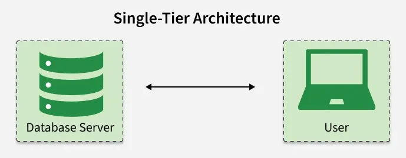
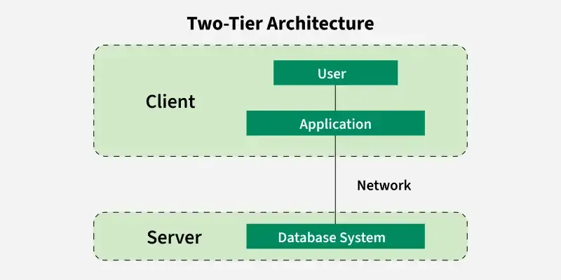
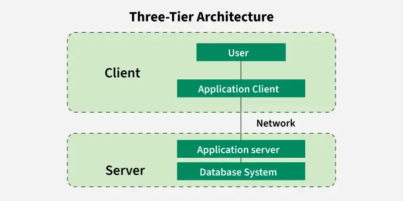

# Các loại kiến trúc DBMS

**Cập nhật lần cuối:** 24/04/2026

**Nguồn tham khảo:** GeeksforGeeks - [DBMS Architecture 1-level, 2-Level, 3-Level](https://www.geeksforgeeks.org/dbms-architecture-2-level-3-level/)

---

## 1. Mục tiêu bài giảng

Sau khi hoàn thành bài học này, người học có thể:

1. Trình bày được khái niệm **kiến trúc DBMS**.
2. Phân biệt được các mô hình kiến trúc **1 tầng**, **2 tầng** và **3 tầng**.
3. Giải thích được vai trò của từng tầng trong hệ thống cơ sở dữ liệu.
4. Phân tích được ưu điểm và nhược điểm của từng loại kiến trúc DBMS.
5. Lựa chọn được kiến trúc DBMS phù hợp cho một số tình huống ứng dụng thực tế.

---

## 2. Khái niệm kiến trúc DBMS

Kiến trúc của một hệ quản trị cơ sở dữ liệu (**DBMS architecture**) mô tả cách người dùng tương tác với cơ sở dữ liệu để **đọc**, **ghi**, **cập nhật** hoặc **truy vấn** thông tin.

Một kiến trúc DBMS được thiết kế tốt, kết hợp với **lược đồ cơ sở dữ liệu** hợp lý, giúp hệ thống:

- Đảm bảo tính nhất quán của dữ liệu.
- Cải thiện hiệu năng xử lý.
- Tăng cường bảo mật dữ liệu.
- Hỗ trợ nhiều người dùng và nhiều ứng dụng cùng truy cập dữ liệu.
- Dễ bảo trì và mở rộng hệ thống.

Trong cơ sở dữ liệu, **schema** hay **lược đồ cơ sở dữ liệu** là bản thiết kế mô tả:

- Các bảng dữ liệu.
- Các trường dữ liệu.
- Kiểu dữ liệu.
- Khóa chính, khóa ngoại.
- Quan hệ giữa các bảng.

---

## 3. Kiến trúc 1 tầng

### 3.1. Khái niệm

Trong kiến trúc **1 tầng** (*1-Tier Architecture*), người dùng làm việc trực tiếp với cơ sở dữ liệu trên cùng một hệ thống. Điều này có nghĩa là:

- Giao diện người dùng,
- Logic xử lý,
- Và dữ liệu

đều nằm trong cùng một ứng dụng hoặc cùng một máy tính.

Người dùng có thể mở ứng dụng, nhập dữ liệu, xử lý dữ liệu và lưu trữ dữ liệu trực tiếp mà không cần máy chủ riêng hoặc kết nối mạng.

### 3.2. Ví dụ

Một ví dụ phổ biến của kiến trúc 1 tầng là **Microsoft Access**.

Trong MS Access:

- Người dùng nhập dữ liệu trực tiếp.
- Ứng dụng xử lý các thao tác tính toán hoặc truy vấn.
- Dữ liệu được lưu trực tiếp trên máy tính cá nhân.
- Không cần máy chủ cơ sở dữ liệu riêng.

Kiến trúc này phù hợp với các ứng dụng cá nhân, ứng dụng độc lập hoặc hệ thống nhỏ.

### 3.3. Ưu điểm

1. **Kiến trúc đơn giản**

   Chỉ cần một máy tính để cài đặt, vận hành và bảo trì hệ thống.

2. **Chi phí thấp**

   Không cần đầu tư thêm máy chủ, hạ tầng mạng hoặc phần cứng phức tạp.

3. **Dễ triển khai**

   Phù hợp với các dự án nhỏ, bài thực hành cá nhân hoặc ứng dụng nội bộ đơn giản.

4. **Không phụ thuộc vào mạng**

   Người dùng có thể làm việc trực tiếp trên máy tính cá nhân mà không cần kết nối đến máy chủ.

### 3.4. Nhược điểm

1. **Chỉ phù hợp với một người dùng**

   Kiến trúc này không được thiết kế tốt cho môi trường nhiều người dùng hoặc làm việc nhóm.

2. **Bảo mật kém**

   Vì ứng dụng và dữ liệu đều nằm trên cùng một máy, nếu người khác truy cập được vào máy tính thì họ có thể truy cập cả chương trình và dữ liệu.

3. **Không có kiểm soát tập trung**

   Dữ liệu được lưu cục bộ, không có cơ sở dữ liệu trung tâm. Điều này gây khó khăn cho việc quản lý, sao lưu và đồng bộ dữ liệu.

4. **Khó chia sẻ dữ liệu**

   Vì dữ liệu nằm trên một máy tính, việc chia sẻ dữ liệu với người khác hoặc thiết bị khác không thuận tiện.

---

### Quiz nhanh: Kiến trúc 1 tầng

**Câu 1.** Trong kiến trúc 1 tầng, các thành phần nào thường nằm trên cùng một máy?

A. Chỉ cơ sở dữ liệu  
B. Chỉ giao diện người dùng  
C. Giao diện, logic xử lý và dữ liệu  
D. Chỉ máy chủ ứng dụng  

**Câu 2.** Ví dụ nào sau đây phù hợp nhất với kiến trúc 1 tầng?

A. Hệ thống thương mại điện tử lớn  
B. Ứng dụng MS Access chạy trên máy cá nhân  
C. Hệ thống ngân hàng trực tuyến  
D. Hệ thống mạng xã hội  

**Câu 3.** Nhược điểm lớn của kiến trúc 1 tầng là gì?

A. Quá phức tạp  
B. Không thể lưu dữ liệu  
C. Khó hỗ trợ nhiều người dùng  
D. Không thể chạy trên máy cá nhân  

---

## 4. Kiến trúc 2 tầng

### 4.1. Khái niệm

Kiến trúc **2 tầng** (*2-Tier Architecture*) tương tự mô hình **client-server** cơ bản.

Trong mô hình này:

- Tầng thứ nhất là **client**, nơi chạy giao diện người dùng và chương trình ứng dụng.
- Tầng thứ hai là **database server**, nơi lưu trữ và xử lý dữ liệu.

Ứng dụng phía client giao tiếp trực tiếp với cơ sở dữ liệu ở phía server. Các API như **ODBC** và **JDBC** thường được sử dụng để hỗ trợ quá trình kết nối này.

Phía server chịu trách nhiệm:

- Xử lý truy vấn.
- Quản lý giao dịch.
- Lưu trữ dữ liệu.
- Trả kết quả về cho client.

### 4.2. Ví dụ

Một ví dụ điển hình của kiến trúc 2 tầng là **hệ thống quản lý thư viện** trong trường học hoặc tổ chức nhỏ.

#### Tầng client

Đây là giao diện mà nhân viên thư viện hoặc người dùng tương tác. Ví dụ, họ có thể dùng một ứng dụng desktop để:

- Tìm kiếm sách.
- Mượn sách.
- Trả sách.
- Kiểm tra hạn trả sách.

#### Tầng cơ sở dữ liệu

Máy chủ cơ sở dữ liệu lưu trữ:

- Thông tin sách.
- Thông tin người dùng.
- Lịch sử mượn trả.
- Nhật ký giao dịch.

Khi người dùng tìm kiếm một cuốn sách, tầng client gửi yêu cầu đến tầng cơ sở dữ liệu. Máy chủ xử lý yêu cầu và gửi kết quả trở lại cho client.

### 4.3. Ưu điểm

1. **Truy cập dữ liệu nhanh**

   Client có thể gửi truy vấn trực tiếp đến server, giúp việc lấy dữ liệu tương đối nhanh trong các hệ thống nhỏ hoặc vừa.

2. **Chi phí thấp hơn kiến trúc 3 tầng**

   Kiến trúc 2 tầng không cần thêm tầng ứng dụng trung gian, do đó chi phí triển khai thấp hơn.

3. **Dễ triển khai**

   Mô hình chỉ gồm client và server nên dễ cài đặt hơn kiến trúc nhiều tầng.

4. **Đơn giản**

   Hệ thống chỉ gồm hai thành phần chính: ứng dụng phía client và cơ sở dữ liệu phía server.

### 4.4. Nhược điểm

1. **Khả năng mở rộng hạn chế**

   Khi số lượng người dùng tăng, server có thể bị quá tải do phải xử lý quá nhiều kết nối trực tiếp từ client.

2. **Vấn đề bảo mật**

   Client kết nối trực tiếp đến cơ sở dữ liệu, do đó hệ thống dễ gặp rủi ro về tấn công hoặc rò rỉ dữ liệu nếu kiểm soát truy cập không tốt.

3. **Liên kết chặt giữa client và database**

   Nếu cấu trúc cơ sở dữ liệu thay đổi, ứng dụng phía client thường cũng cần được cập nhật.

4. **Khó bảo trì**

   Việc cập nhật phần mềm, sửa lỗi hoặc bổ sung tính năng trở nên phức tạp hơn khi số lượng client tăng.

---

### Quiz nhanh: Kiến trúc 2 tầng

**Câu 1.** Kiến trúc 2 tầng gồm hai tầng chính nào?

A. Client và database server  
B. Client và trình duyệt web  
C. Database và hệ điều hành  
D. Ứng dụng và tệp văn bản  

**Câu 2.** Trong kiến trúc 2 tầng, client thường giao tiếp với cơ sở dữ liệu thông qua công nghệ nào?

A. HTML và CSS  
B. ODBC hoặc JDBC  
C. Bluetooth  
D. FTP  

**Câu 3.** Nhược điểm bảo mật của kiến trúc 2 tầng là gì?

A. Không lưu được dữ liệu  
B. Client kết nối trực tiếp với cơ sở dữ liệu  
C. Không có giao diện người dùng  
D. Không thể xử lý truy vấn  

---

## 5. Kiến trúc 3 tầng

### 5.1. Khái niệm

Trong kiến trúc **3 tầng** (*3-Tier Architecture*), có thêm một tầng trung gian giữa client và database server.

Ba tầng chính gồm:

1. **Tầng trình bày** (*Presentation Layer*)
2. **Tầng ứng dụng hoặc tầng xử lý nghiệp vụ** (*Application / Business Logic Layer*)
3. **Tầng cơ sở dữ liệu** (*Database Layer*)

Trong mô hình này, client không giao tiếp trực tiếp với cơ sở dữ liệu. Thay vào đó:

1. Client gửi yêu cầu đến application server.
2. Application server xử lý logic nghiệp vụ.
3. Application server gửi truy vấn đến database server khi cần.
4. Database server trả dữ liệu về application server.
5. Application server xử lý kết quả và gửi phản hồi về client.

Tầng trung gian đóng vai trò là cầu nối giữa người dùng và cơ sở dữ liệu.

Kiến trúc này thường được sử dụng trong các ứng dụng web lớn, hệ thống doanh nghiệp, thương mại điện tử, ngân hàng trực tuyến và các hệ thống cần nhiều người dùng truy cập đồng thời.

### 5.2. Ví dụ: Cửa hàng thương mại điện tử

Giả sử người dùng truy cập một cửa hàng trực tuyến.

#### Người dùng

Người dùng truy cập website, tìm kiếm sản phẩm và thêm sản phẩm vào giỏ hàng.

#### Tầng xử lý

Hệ thống xử lý các công việc như:

- Kiểm tra sản phẩm còn hàng hay không.
- Tính tổng giá trị đơn hàng.
- Áp dụng mã giảm giá.
- Tính phí vận chuyển.
- Xác thực tài khoản người dùng.

#### Tầng cơ sở dữ liệu

Cơ sở dữ liệu lưu trữ:

- Thông tin sản phẩm.
- Thông tin khách hàng.
- Giỏ hàng.
- Lịch sử đơn hàng.
- Trạng thái thanh toán.

### 5.3. Ưu điểm

1. **Khả năng mở rộng tốt hơn**

   Vì tầng ứng dụng có thể được triển khai phân tán trên nhiều máy chủ, hệ thống dễ mở rộng khi số lượng người dùng tăng.

2. **Tăng tính toàn vẹn dữ liệu**

   Tầng trung gian kiểm soát dữ liệu trước khi gửi đến database, giúp giảm nguy cơ dữ liệu sai hoặc dữ liệu không hợp lệ.

3. **Bảo mật tốt hơn**

   Client không truy cập trực tiếp vào cơ sở dữ liệu. Điều này giúp giảm nguy cơ truy cập trái phép vào dữ liệu quan trọng.

4. **Dễ bảo trì hơn**

   Logic nghiệp vụ được đặt ở tầng ứng dụng, nên khi cần thay đổi quy trình xử lý, lập trình viên có thể cập nhật tầng ứng dụng mà không nhất thiết phải thay đổi client hoặc database.

5. **Phù hợp với ứng dụng lớn**

   Kiến trúc 3 tầng phù hợp với hệ thống có nhiều người dùng, nhiều chức năng và yêu cầu bảo mật cao.

### 5.4. Nhược điểm

1. **Phức tạp hơn**

   So với kiến trúc 2 tầng, kiến trúc 3 tầng có thêm một tầng trung gian nên thiết kế, triển khai và vận hành phức tạp hơn.

2. **Khó tương tác hơn**

   Dữ liệu phải đi qua nhiều tầng, do đó việc thiết kế giao tiếp giữa các tầng cần được thực hiện cẩn thận.

3. **Thời gian phản hồi có thể chậm hơn**

   Vì yêu cầu phải đi qua application server trước khi đến database server, thời gian phản hồi có thể lâu hơn so với kiến trúc 2 tầng trong một số trường hợp.

4. **Chi phí cao hơn**

   Cần thêm phần cứng, phần mềm và nhân lực có chuyên môn để thiết lập, vận hành và bảo trì hệ thống.

---

### Quiz nhanh: Kiến trúc 3 tầng

**Câu 1.** Ba tầng chính trong kiến trúc 3 tầng là gì?

A. File, folder, disk  
B. Client, application server, database server  
C. RAM, CPU, hard disk  
D. User, password, table  

**Câu 2.** Trong kiến trúc 3 tầng, client có kết nối trực tiếp với database không?

A. Có  
B. Không  
C. Chỉ khi database nhỏ  
D. Chỉ khi dùng MS Access  

**Câu 3.** Lợi ích bảo mật chính của kiến trúc 3 tầng là gì?

A. Không cần mật khẩu  
B. Client không truy cập trực tiếp vào cơ sở dữ liệu  
C. Không cần máy chủ  
D. Dữ liệu được lưu trên giấy  

---

## 6. Bảng so sánh các loại kiến trúc DBMS

| Tiêu chí | Kiến trúc 1 tầng | Kiến trúc 2 tầng | Kiến trúc 3 tầng |
|---|---|---|---|
| Số tầng chính | 1 | 2 | 3 |
| Thành phần | Ứng dụng và dữ liệu cùng một máy | Client và database server | Client, application server và database server |
| Cách client truy cập dữ liệu | Trực tiếp trên máy cục bộ | Trực tiếp đến database server | Thông qua application server |
| Ví dụ | MS Access cá nhân | Hệ thống quản lý thư viện nhỏ | Website thương mại điện tử |
| Khả năng mở rộng | Thấp | Trung bình | Cao |
| Bảo mật | Thấp | Trung bình | Tốt hơn |
| Chi phí | Thấp | Trung bình | Cao hơn |
| Độ phức tạp | Thấp | Trung bình | Cao |
| Phù hợp với | Cá nhân, ứng dụng nhỏ | Tổ chức nhỏ hoặc vừa | Hệ thống lớn, ứng dụng web, doanh nghiệp |

---

## 7. Câu hỏi ôn tập

### 7.1. Câu hỏi trắc nghiệm

**Câu 1.** Kiến trúc DBMS mô tả điều gì?

A. Cách thiết kế giao diện đồ họa  
B. Cách người dùng và ứng dụng tương tác với cơ sở dữ liệu  
C. Cách lắp ráp phần cứng máy tính  
D. Cách định dạng văn bản  

---

**Câu 2.** Kiến trúc nào phù hợp nhất với ứng dụng cá nhân, không cần mạng?

A. 1 tầng  
B. 2 tầng  
C. 3 tầng  
D. Nhiều tầng  

---

**Câu 3.** Trong kiến trúc 2 tầng, tầng client thường chứa thành phần nào?

A. Giao diện người dùng và chương trình ứng dụng  
B. Chỉ dữ liệu thô  
C. Chỉ ổ cứng  
D. Chỉ hệ điều hành  

---

**Câu 4.** Trong kiến trúc 3 tầng, tầng nào thường xử lý logic nghiệp vụ?

A. Tầng trình bày  
B. Tầng ứng dụng  
C. Tầng cơ sở dữ liệu  
D. Tầng lưu trữ vật lý  

---

**Câu 5.** Nhược điểm chính của kiến trúc 1 tầng là gì?

A. Không có khả năng lưu trữ dữ liệu  
B. Khó hỗ trợ nhiều người dùng và bảo mật thấp  
C. Luôn cần nhiều máy chủ  
D. Không thể dùng cho ứng dụng nhỏ  

---

**Câu 6.** Lý do kiến trúc 3 tầng có khả năng bảo mật tốt hơn là gì?

A. Vì không cần database  
B. Vì client không truy cập trực tiếp vào database  
C. Vì dữ liệu không được lưu trữ  
D. Vì không có tầng ứng dụng  

---

**Câu 7.** Ví dụ nào phù hợp nhất với kiến trúc 3 tầng?

A. File Excel lưu trên máy cá nhân  
B. MS Access dùng cho một người  
C. Website thương mại điện tử  
D. Tệp văn bản lưu trong USB  

---

**Câu 8.** Trong kiến trúc 2 tầng, khi số lượng người dùng tăng mạnh, vấn đề nào có thể xảy ra?

A. Server bị quá tải do nhiều kết nối trực tiếp  
B. Client không còn giao diện  
C. Database tự động biến mất  
D. Không thể tạo bảng  

---

**Câu 9.** ODBC và JDBC thường được dùng trong kiến trúc nào?

A. 1 tầng  
B. 2 tầng  
C. 3 tầng  
D. Không liên quan đến DBMS  

---

**Câu 10.** Kiến trúc nào thường phù hợp nhất cho hệ thống doanh nghiệp lớn?

A. 1 tầng  
B. 2 tầng  
C. 3 tầng  
D. File-based system  

---

### 7.2. Câu hỏi tự luận ngắn

**Câu 1.** Giải thích vì sao kiến trúc 1 tầng không phù hợp với hệ thống có nhiều người dùng.

---

**Câu 2.** Phân biệt kiến trúc 2 tầng và 3 tầng về cách client truy cập cơ sở dữ liệu.

---

**Câu 3.** Vì sao kiến trúc 3 tầng thường được dùng cho ứng dụng web lớn?

---

**Câu 4.** Nêu một ví dụ thực tế cho từng loại kiến trúc DBMS.

---

## 8. Bài tập vận dụng

### Bài tập 1

Một cửa hàng nhỏ muốn quản lý danh sách sản phẩm và doanh thu bán hàng trên một máy tính cá nhân. Cửa hàng chỉ có một người dùng hệ thống.

**Yêu cầu:**  
Hãy đề xuất kiến trúc DBMS phù hợp và giải thích lý do.

---

### Bài tập 2

Một thư viện trường học muốn xây dựng phần mềm desktop để nhiều nhân viên có thể tra cứu sách và cập nhật thông tin mượn trả. Dữ liệu được lưu trên một máy chủ trong mạng nội bộ.

**Yêu cầu:**  
Hãy đề xuất kiến trúc DBMS phù hợp và giải thích lý do.

---

### Bài tập 3

Một công ty muốn xây dựng website thương mại điện tử phục vụ hàng nghìn người dùng truy cập cùng lúc. Hệ thống cần bảo mật, xử lý đơn hàng, kiểm tra tồn kho và lưu lịch sử mua hàng.

**Yêu cầu:**  
Hãy đề xuất kiến trúc DBMS phù hợp và giải thích lý do.

---

## 9. Tóm tắt bài học

- Kiến trúc DBMS mô tả cách người dùng, ứng dụng và cơ sở dữ liệu tương tác với nhau.
- Kiến trúc 1 tầng đơn giản, chi phí thấp nhưng khó mở rộng và bảo mật thấp.
- Kiến trúc 2 tầng gồm client và database server, phù hợp với hệ thống nhỏ hoặc vừa.
- Kiến trúc 3 tầng bổ sung application server, giúp tăng bảo mật, khả năng mở rộng và dễ bảo trì hơn.
- Việc lựa chọn kiến trúc phụ thuộc vào quy mô hệ thống, số lượng người dùng, yêu cầu bảo mật, chi phí và khả năng mở rộng.

---

## 10. Từ khóa chính

- DBMS Architecture
- 1-Tier Architecture
- 2-Tier Architecture
- 3-Tier Architecture
- Client
- Server
- Database Server
- Application Server
- Presentation Layer
- Business Logic Layer
- Database Layer
- ODBC
- JDBC
- Scalability
- Security
- Data Integrity
---

## 11. Đáp án và gợi ý trả lời

### Quiz nhanh: Kiến trúc 1 tầng

- **Câu 1.** C
- **Câu 2.** B
- **Câu 3.** C
### Quiz nhanh: Kiến trúc 2 tầng

- **Câu 1.** A
- **Câu 2.** B
- **Câu 3.** B
### Quiz nhanh: Kiến trúc 3 tầng

- **Câu 1.** B
- **Câu 2.** B
- **Câu 3.** B
### Câu hỏi ôn tập - Trắc nghiệm

- **Câu 1.** B
- **Câu 2.** A
- **Câu 3.** A
- **Câu 4.** B
- **Câu 5.** B
- **Câu 6.** B
- **Câu 7.** C
- **Câu 8.** A
- **Câu 9.** B
- **Câu 10.** C
### Câu hỏi ôn tập - Tự luận ngắn

#### Câu 1.

**Gợi ý trả lời:**

Vì dữ liệu và ứng dụng nằm trên cùng một máy, không có cơ chế quản lý truy cập tập trung, khó chia sẻ dữ liệu, khó đồng bộ và bảo mật thấp.

#### Câu 2.

**Gợi ý trả lời:**

Trong kiến trúc 2 tầng, client kết nối trực tiếp đến database server. Trong kiến trúc 3 tầng, client gửi yêu cầu đến application server, sau đó application server mới làm việc với database server.

#### Câu 3.

**Gợi ý trả lời:**

Vì kiến trúc 3 tầng có khả năng mở rộng tốt, bảo mật cao hơn, dễ tách biệt giao diện, logic nghiệp vụ và dữ liệu, đồng thời phù hợp với nhiều người dùng truy cập đồng thời.

#### Câu 4.

**Gợi ý trả lời:**

- 1 tầng: MS Access chạy trên máy cá nhân.
- 2 tầng: Hệ thống quản lý thư viện nhỏ dùng ứng dụng desktop kết nối database server.
- 3 tầng: Website thương mại điện tử với trình duyệt, server ứng dụng và database server.

### Bài tập 1

#### Bài tập 1

**Gợi ý:**

Kiến trúc 1 tầng có thể phù hợp vì hệ thống nhỏ, chỉ một người dùng, chi phí thấp và dễ triển khai.

### Bài tập 2

#### Bài tập 2

**Gợi ý:**

Kiến trúc 2 tầng phù hợp vì ứng dụng desktop có thể kết nối trực tiếp đến database server trong mạng nội bộ.

### Bài tập 3

#### Bài tập 3

**Gợi ý:**

Kiến trúc 3 tầng phù hợp vì có tầng ứng dụng xử lý nghiệp vụ, tăng bảo mật, dễ mở rộng và phù hợp với hệ thống web lớn.
