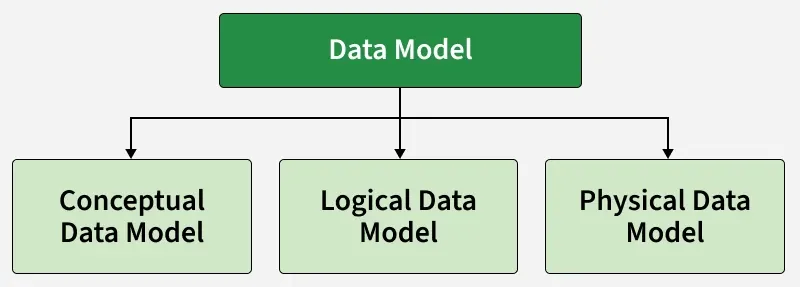
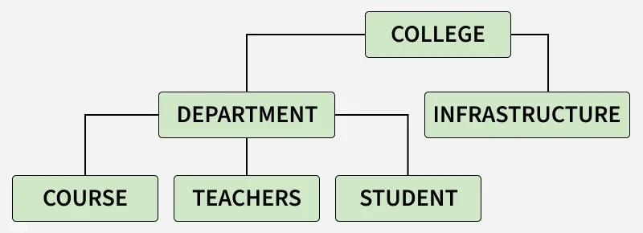

# Mô hình hóa dữ liệu trong DBMS

**Cập nhật lần cuối:** 31/05/2026  
**Nguồn tham khảo:** GeeksforGeeks - [Data Modeling: A Comprehensive Guide for Analysts](https://www.geeksforgeeks.org/data-analysis/data-modeling-a-comprehensive-guide-for-analysts/)

---

## 1. Mục tiêu bài giảng

Sau khi hoàn thành bài học này, người học có thể:

1. Giải thích được khái niệm **mô hình dữ liệu** trong hệ quản trị cơ sở dữ liệu.
2. Trình bày được vai trò của mô hình dữ liệu trong thiết kế và triển khai cơ sở dữ liệu.
3. Phân biệt được ba mức mô hình dữ liệu chính:
   - **Conceptual Data Model**
   - **Representational Data Model**
   - **Physical Data Model**
4. Mô tả được các thành phần chính của **Entity-Relationship Model**.
5. Nhận diện được một số mô hình dữ liệu khác như hierarchical, network, object-oriented, context và semi-structured data model.
6. Phân tích được ưu điểm và hạn chế của mô hình dữ liệu.
7. Vận dụng kiến thức để xây dựng mô hình dữ liệu đơn giản cho một bài toán thực tế.

---

## 2. Giới thiệu tổng quan

Trong hệ quản trị cơ sở dữ liệu, **mô hình dữ liệu** (*data model*) là tập hợp các khái niệm, công cụ và quy tắc dùng để mô tả cách dữ liệu được tổ chức, liên kết, lưu trữ và triển khai.

Mô hình dữ liệu giúp người thiết kế cơ sở dữ liệu trả lời các câu hỏi:

- Hệ thống cần quản lý những dữ liệu gì?
- Dữ liệu gồm những đối tượng nào?
- Các đối tượng có thuộc tính gì?
- Các đối tượng liên hệ với nhau như thế nào?
- Dữ liệu được biểu diễn logic ra sao?
- Dữ liệu cuối cùng được lưu trữ vật lý như thế nào?

Mô hình dữ liệu là cầu nối giữa:

1. **Nhu cầu nghiệp vụ** của người dùng.
2. **Thiết kế logic** của cơ sở dữ liệu.
3. **Triển khai vật lý** trên một hệ quản trị cơ sở dữ liệu cụ thể.



<p align="center">
  <em>Hình 1. Tổng quan quy trình mô hình hóa dữ liệu.</em>
</p>

---

### Quiz nhanh: Giới thiệu mô hình dữ liệu

**Câu 1.** Mô hình dữ liệu trong DBMS dùng để làm gì?

A. Chỉ để trang trí sơ đồ cơ sở dữ liệu  
B. Mô tả cách dữ liệu được tổ chức, liên kết và triển khai  
C. Thay thế hoàn toàn hệ quản trị cơ sở dữ liệu  
D. Chỉ để viết mã HTML  

**Câu 2.** Mô hình dữ liệu giúp người thiết kế cơ sở dữ liệu hiểu rõ điều gì?

A. Cách tăng độ phân giải màn hình  
B. Cách thiết kế logo cho ứng dụng  
C. Cách cài đặt hệ điều hành  
D. Cách dữ liệu được tổ chức và quan hệ giữa các đối tượng dữ liệu  

---

## 3. Vì sao cần mô hình dữ liệu?

Mô hình dữ liệu giúp tạo ra một bức tranh rõ ràng về dữ liệu trước khi xây dựng cơ sở dữ liệu thật.

Nếu không có mô hình dữ liệu, hệ thống có thể gặp các vấn đề:

- Dữ liệu bị trùng lặp nhiều.
- Thiếu dữ liệu quan trọng.
- Quan hệ giữa các bảng không rõ ràng.
- Khó xác định khóa chính và khóa ngoại.
- Khó triển khai cơ sở dữ liệu vật lý.
- Khó bảo trì khi hệ thống thay đổi.

Một mô hình dữ liệu tốt giúp:

1. **Biểu diễn dữ liệu chính xác hơn**  
   Người thiết kế xác định rõ đối tượng dữ liệu, thuộc tính và quan hệ giữa chúng.

2. **Giảm dư thừa dữ liệu**  
   Cấu trúc dữ liệu rõ ràng giúp hạn chế lưu lặp cùng một thông tin ở nhiều nơi.

3. **Hỗ trợ bảo mật dữ liệu**  
   Mô hình dữ liệu giúp xác định dữ liệu quan trọng và quyền truy cập phù hợp.

4. **Làm nền tảng cho thiết kế vật lý**  
   Mô hình dữ liệu đủ chi tiết có thể được dùng để xây dựng cơ sở dữ liệu vật lý.

5. **Xác định quan hệ giữa các bảng**  
   Mô hình dữ liệu hỗ trợ định nghĩa khóa chính, khóa ngoại, quan hệ và stored procedures.

---

## 4. Phân loại mô hình dữ liệu trong DBMS

Các mô hình dữ liệu trong DBMS thường được chia thành ba nhóm chính:

1. **Conceptual Data Model**  
   Mô hình dữ liệu khái niệm.

2. **Representational Data Model**  
   Mô hình dữ liệu biểu diễn hoặc mô hình dữ liệu logic.

3. **Physical Data Model**  
   Mô hình dữ liệu vật lý.

| Mức mô hình | Câu hỏi chính | Đối tượng sử dụng |
|---|---|---|
| Conceptual Data Model | Doanh nghiệp cần quản lý những dữ liệu gì? | Người dùng nghiệp vụ, stakeholder, nhà phân tích |
| Representational Data Model | Dữ liệu được biểu diễn logic như thế nào? | Nhà thiết kế CSDL, nhà phân tích hệ thống |
| Physical Data Model | Dữ liệu được triển khai trên DBMS cụ thể như thế nào? | DBA, lập trình viên, kỹ sư dữ liệu |

---

## 5. Conceptual Data Model

### 5.1. Khái niệm

**Conceptual Data Model** là mô hình dữ liệu mô tả cơ sở dữ liệu ở mức rất cao. Mục tiêu là giúp các bên liên quan hiểu được:

- Hệ thống cần quản lý những đối tượng nào.
- Các đối tượng có quan hệ gì với nhau.
- Các yêu cầu nghiệp vụ chính là gì.
- Phạm vi dữ liệu của hệ thống nằm ở đâu.

Mô hình dữ liệu khái niệm thường được sử dụng trong giai đoạn **thu thập yêu cầu**, trước khi người thiết kế xây dựng database cụ thể.

### 5.2. Vai trò

Conceptual Data Model giúp:

- Trao đổi với người dùng không chuyên kỹ thuật.
- Xác định phạm vi dữ liệu.
- Tạo ngôn ngữ chung cho stakeholder.
- Làm nền tảng cho thiết kế logic.

### 5.3. Đặc điểm

Một mô hình dữ liệu khái niệm thường:

- Bao phủ các khái niệm nghiệp vụ trên phạm vi toàn tổ chức hoặc toàn hệ thống.
- Được thiết kế cho người dùng nghiệp vụ.
- Không phụ thuộc vào phần cứng, vị trí lưu trữ hoặc nhà cung cấp DBMS.
- Không phụ thuộc vào công nghệ triển khai cụ thể.
- Tập trung vào cách người dùng nhìn thấy dữ liệu trong thế giới thực.
- Tạo ra vốn từ vựng chung cho các bên liên quan.

---

## 6. Entity-Relationship Model

### 6.1. ER Model là gì?

Một mô hình khái niệm phổ biến là **Entity-Relationship Model**, thường gọi là **ER Model**.

**ER Model** là mô hình dữ liệu mức cao dùng để xác định:

- Các thực thể dữ liệu.
- Thuộc tính của thực thể.
- Quan hệ giữa các thực thể.

ER Model thường được biểu diễn bằng **ER Diagram**.

### 6.2. Thành phần của ER Model

ER Model gồm ba thành phần cơ bản:

1. **Entity**
2. **Attribute**
3. **Relationship**

### 6.3. Entity

**Entity** là một đối tượng trong thế giới thực mà hệ thống cần lưu trữ thông tin.

Ví dụ trong hệ thống quản lý trường đại học:

- `Student`
- `Course`
- `Class`
- `Lecturer`
- `Department`

Trong ER Diagram, entity thường được biểu diễn bằng **hình chữ nhật**.

### 6.4. Attribute

**Attribute** là thuộc tính mô tả entity.

Ví dụ entity `Student` có thể có các attribute:

- `student_id`
- `full_name`
- `date_of_birth`
- `email`
- `major`
- `gpa`

Trong ER Diagram, attribute thường được biểu diễn bằng **hình ellipse**.

### 6.5. Relationship

**Relationship** mô tả mối quan hệ giữa các entity.

Ví dụ:

- Một sinh viên **đăng ký** nhiều môn học.
- Một giảng viên **giảng dạy** nhiều lớp học.
- Một khoa **quản lý** nhiều chương trình đào tạo.
- Một khách hàng **đặt** nhiều đơn hàng.

Trong ER Diagram, relationship thường được biểu diễn bằng **hình thoi**.

### 6.6. Ví dụ ER Model đơn giản

Xét hệ thống quản lý sinh viên và môn học.

Các entity:

- `Student`
- `Course`

Relationship:

- `Enrolls`

Một số attribute:

- `Student(student_id, full_name, email, major)`
- `Course(course_id, course_name, credits)`
- `Enrolls(student_id, course_id, semester, grade)`

Diễn giải:

- Một sinh viên có thể đăng ký nhiều môn học.
- Một môn học có thể có nhiều sinh viên đăng ký.
- Quan hệ giữa `Student` và `Course` là quan hệ nhiều-nhiều.
- Quan hệ `Enrolls` có thể có thuộc tính riêng như `semester` và `grade`.

---

### Quiz nhanh: ER Model

**Câu 1.** ER Model thường được dùng ở mức mô hình nào?

A. Conceptual Data Model  
B. Physical Data Model  
C. Operating System Model  
D. Network Cable Model  

**Câu 2.** Entity trong ER Model là gì?

A. Một kiểu màu trong giao diện  
B. Một lệnh SQL để xóa dữ liệu  
C. Đối tượng trong thế giới thực cần lưu trữ thông tin  
D. Một loại phần cứng  

**Câu 3.** Attribute dùng để làm gì?

A. Xóa entity khỏi hệ thống  
B. Thay thế quan hệ giữa các bảng  
C. Mã hóa toàn bộ database  
D. Mô tả đặc điểm của entity  

**Câu 4.** Relationship biểu diễn điều gì?

A. Tốc độ CPU  
B. Mối quan hệ giữa các entity  
C. Màu nền của ứng dụng  
D. Dung lượng RAM  

---

## 7. Representational Data Model

### 7.1. Khái niệm

**Representational Data Model** là mô hình dùng để biểu diễn phần logic của cơ sở dữ liệu.

Mô hình này không mô tả chi tiết cách dữ liệu được lưu vật lý trên đĩa, mà tập trung vào:

- Dữ liệu được biểu diễn dưới dạng nào.
- Các cấu trúc logic của dữ liệu.
- Quan hệ giữa các cấu trúc dữ liệu.
- Cách chuẩn bị thiết kế để có thể triển khai vật lý sau này.

Một ví dụ phổ biến của representational data model là **Relational Model**.

### 7.2. Relational Model

Trong **Relational Model**, dữ liệu được biểu diễn dưới dạng các bảng.

Mỗi bảng gồm:

- Các hàng (*tuples* hoặc *records*).
- Các cột (*attributes* hoặc *fields*).
- Khóa chính.
- Khóa ngoại.
- Ràng buộc dữ liệu.

Ví dụ bảng `Students`:

| student_id | full_name | major |
|---|---|---|
| 1 | Nguyễn An | Data Science |
| 2 | Trần Bình | Logistics |
| 3 | Lê Chi | Information Systems |

Relational Model có nền tảng lý thuyết từ:

- **Relational Algebra**
- **Relational Calculus**

Trong thực tế, Relational Model thường được triển khai bằng các hệ quản trị cơ sở dữ liệu quan hệ như MySQL, PostgreSQL, SQL Server hoặc Oracle.

### 7.3. Đặc điểm

Representational Data Model có các đặc điểm:

1. Biểu diễn cấu trúc logic của cơ sở dữ liệu.
2. Thường sử dụng mô hình quan hệ.
3. Dùng bảng để biểu diễn dữ liệu và quan hệ.
4. Làm nền tảng cho mô hình vật lý.

### 7.4. Ví dụ chuyển từ ER Model sang Relational Model

Giả sử ta có ER Model gồm:

- Entity `Student`
- Entity `Course`
- Relationship `Enrolls`

Khi chuyển sang Relational Model, có thể tạo các bảng:

```sql
Students(student_id, full_name, email, major)

Courses(course_id, course_name, credits)

Enrollments(student_id, course_id, semester, grade)
```

Trong đó:

- `student_id` là khóa chính của bảng `Students`.
- `course_id` là khóa chính của bảng `Courses`.
- `(student_id, course_id, semester)` có thể là khóa chính của bảng `Enrollments`.
- `student_id` và `course_id` trong `Enrollments` là khóa ngoại.

---

## 8. Physical Data Model

### 8.1. Khái niệm

**Physical Data Model** là mô hình dữ liệu dùng để triển khai thực tế mô hình logic trên một hệ quản trị cơ sở dữ liệu cụ thể.

Nếu Conceptual Data Model trả lời câu hỏi:

> Hệ thống cần quản lý dữ liệu gì?

Representational Data Model trả lời câu hỏi:

> Dữ liệu được biểu diễn logic như thế nào?

Thì Physical Data Model trả lời câu hỏi:

> Dữ liệu sẽ được lưu trữ và triển khai cụ thể như thế nào?

### 8.2. Nội dung của Physical Data Model

Physical Data Model mô tả:

- Cấu trúc bảng cụ thể.
- Tên cột.
- Kiểu dữ liệu.
- Độ dài dữ liệu.
- Giá trị mặc định.
- Khóa chính.
- Khóa ngoại.
- Chỉ mục.
- View.
- Quyền truy cập.
- Authorization.
- Cấu trúc lưu trữ vật lý.
- Thiết lập riêng của DBMS.

### 8.3. SQL và Physical Data Model

SQL thường được dùng để triển khai mô hình quan hệ vào cơ sở dữ liệu vật lý.

Ví dụ:

```sql
CREATE TABLE Students (
    student_id INT PRIMARY KEY,
    full_name VARCHAR(100) NOT NULL,
    email VARCHAR(100) UNIQUE,
    major VARCHAR(100),
    gpa DECIMAL(3,2)
);
```

Câu lệnh trên xác định:

- Tên bảng: `Students`
- Các cột: `student_id`, `full_name`, `email`, `major`, `gpa`
- Kiểu dữ liệu của từng cột
- Khóa chính
- Ràng buộc `NOT NULL`
- Ràng buộc `UNIQUE`

### 8.4. Đặc điểm

Physical Data Model có các đặc điểm:

- Gắn với một dự án hoặc ứng dụng cụ thể.
- Có thể tích hợp với các mô hình vật lý khác.
- Mô tả quan hệ giữa các bảng, bao gồm cardinality và nullability.
- Phụ thuộc vào DBMS cụ thể.
- Xác định chi tiết cột, kiểu dữ liệu, độ dài, giá trị mặc định.
- Định nghĩa primary key, foreign key, view, index, access profile và authorization.

---

## 9. So sánh ba mức mô hình dữ liệu

| Tiêu chí | Conceptual Data Model | Representational Data Model | Physical Data Model |
|---|---|---|---|
| Mức trừu tượng | Cao nhất | Trung gian | Thấp nhất, gần triển khai |
| Mục tiêu | Hiểu nghiệp vụ và yêu cầu dữ liệu | Biểu diễn cấu trúc logic | Triển khai trên DBMS cụ thể |
| Người dùng chính | Stakeholder, người dùng nghiệp vụ | Nhà thiết kế CSDL, phân tích hệ thống | DBA, developer |
| Phụ thuộc DBMS | Không | Ít hoặc chưa cụ thể | Có |
| Ví dụ | ER Model | Relational Model | SQL DDL, index, datatype |
| Câu hỏi chính | Cần quản lý dữ liệu gì? | Dữ liệu được biểu diễn logic như thế nào? | Dữ liệu được lưu và tối ưu ra sao? |

---

## 10. Một số mô hình dữ liệu khác

Ngoài ba mức mô hình dữ liệu chính, DBMS còn có nhiều kiểu mô hình dữ liệu khác.

---

## 11. Hierarchical Model

**Hierarchical Model** là một trong những mô hình dữ liệu lâu đời nhất, được IBM phát triển vào những năm 1950.

Trong mô hình này, dữ liệu được tổ chức theo dạng **cây**.

Mỗi bản ghi thường có:

- Một bản ghi cha.
- Nhiều bản ghi con.

Ví dụ:

```text
University
├── Faculty of Data Science and AI
│   ├── Department of Data Science
│   └── Department of AI
└── Faculty of Business
    ├── Department of Accounting
    └── Department of Marketing
```

Mô hình này phù hợp với dữ liệu có quan hệ cha-con rõ ràng.

---

## 12. Network Model

**Network Model** được formalize bởi Database Task Group vào những năm 1960.

Mô hình này là sự tổng quát hóa của Hierarchical Model.

Khác với mô hình phân cấp, Network Model cho phép:

- Một bản ghi có nhiều cha.
- Một bản ghi có nhiều con.
- Tồn tại quan hệ nhiều-nhiều giữa các segment.

Ví dụ:

- Một sinh viên có thể học nhiều môn.
- Một môn học có thể có nhiều sinh viên.
- Một giảng viên có thể dạy nhiều môn.
- Một môn học có thể do nhiều giảng viên phụ trách.

---

## 13. Object-Oriented Data Model

Trong **Object-Oriented Data Model**, dữ liệu và quan hệ của dữ liệu được chứa trong một cấu trúc gọi là **object**.

Mô hình này kết hợp giữa:

- Tư duy lập trình hướng đối tượng.
- Mô hình cơ sở dữ liệu.

Ví dụ:

```text
Object: Student
Attributes:
  - student_id
  - full_name
  - major

Methods:
  - enroll(course)
  - calculate_gpa()
```

Object-Oriented Data Model phù hợp khi bài toán có cấu trúc gần với lập trình hướng đối tượng.

---

## 14. Float Data Model

**Float Data Model** gồm một mảng dữ liệu hai chiều không chứa phần tử trùng lặp.

Hạn chế chính:

- Không lưu trữ tốt các bảng kích thước lớn.
- Tính linh hoạt thấp.
- Ít phổ biến hơn so với relational, hierarchical hoặc network model.

---

## 15. Context Data Model

**Context Data Model** là mô hình dữ liệu bao gồm nhiều mô hình dữ liệu khác nhau.

Ví dụ, một Context Data Model có thể kết hợp:

- ER Model.
- Object-Oriented Data Model.
- Relational Model.
- Semi-Structured Data Model.

Mô hình này cho phép người dùng tận dụng khả năng của nhiều mô hình dữ liệu khác nhau trong cùng một bối cảnh.

---

## 16. Semi-Structured Data Model

**Semi-Structured Data Model** xử lý dữ liệu theo cách linh hoạt.

Trong mô hình này:

- Một số entity có thể có thêm thuộc tính.
- Một số entity có thể thiếu thuộc tính.
- Cấu trúc dữ liệu không nhất thiết phải cố định hoàn toàn.

Ví dụ dữ liệu JSON:

```json
{
  "student_id": 1,
  "name": "Nguyen An",
  "skills": ["Python", "SQL"]
}
```

Một bản ghi khác có thể có thêm thuộc tính:

```json
{
  "student_id": 2,
  "name": "Tran Binh",
  "email": "binh@example.com",
  "skills": ["Java", "Database"],
  "certificates": ["AWS Cloud Practitioner"]
}
```

---

## 17. Ưu điểm của mô hình dữ liệu

Mô hình dữ liệu có nhiều ưu điểm quan trọng:

1. **Biểu diễn dữ liệu chính xác**

   Mô hình dữ liệu giúp xác định rõ các thành phần dữ liệu, thuộc tính và quan hệ.

2. **Phát hiện dữ liệu bị thiếu**

   Trong quá trình mô hình hóa, người thiết kế có thể phát hiện những thông tin cần lưu nhưng chưa được xác định.

3. **Giảm dư thừa dữ liệu**

   Mô hình dữ liệu giúp tổ chức dữ liệu hợp lý hơn, từ đó giảm trùng lặp không cần thiết.

4. **Hỗ trợ bảo mật dữ liệu**

   Khi cấu trúc dữ liệu rõ ràng, việc xác định quyền truy cập và mức độ bảo vệ dữ liệu sẽ dễ hơn.

5. **Hỗ trợ xây dựng cơ sở dữ liệu vật lý**

   Một mô hình dữ liệu đủ chi tiết có thể được dùng để xây dựng bảng, khóa, quan hệ, stored procedure và các thành phần vật lý khác.

---

## 18. Hạn chế của mô hình dữ liệu

Mô hình dữ liệu cũng có một số hạn chế:

1. **Khó hiểu với cơ sở dữ liệu lớn**

   Với cơ sở dữ liệu rất lớn, mô hình dữ liệu có thể trở nên phức tạp và khó nắm bắt.

2. **Cần kiến thức SQL và DBMS**

   Để sử dụng Physical Data Model hiệu quả, người thiết kế cần hiểu SQL và đặc điểm của hệ quản trị cơ sở dữ liệu.

3. **Thay đổi nhỏ có thể ảnh hưởng lớn**

   Một thay đổi nhỏ trong cấu trúc dữ liệu có thể yêu cầu chỉnh sửa nhiều phần của ứng dụng.

4. **Không phải mô hình nào cũng có ngôn ngữ thao tác dữ liệu chuẩn**

   Một số mô hình dữ liệu không có ngôn ngữ thao tác dữ liệu rõ ràng hoặc thống nhất như SQL.

5. **Cần hiểu đặc điểm lưu trữ vật lý**

   Khi phát triển Physical Data Model, người thiết kế cần hiểu cách dữ liệu được lưu trữ vật lý.

---

## 19. Quy trình xây dựng mô hình dữ liệu

Có thể xây dựng mô hình dữ liệu theo quy trình sau:

### Bước 1: Thu thập yêu cầu nghiệp vụ

Xác định:

- Người dùng cần quản lý dữ liệu gì?
- Quy trình nghiệp vụ chính là gì?
- Các đối tượng nghiệp vụ là gì?
- Các quy tắc nghiệp vụ quan trọng là gì?

### Bước 2: Xây dựng Conceptual Data Model

Xác định:

- Entity.
- Attribute.
- Relationship.
- Phạm vi hệ thống.
- Thuật ngữ nghiệp vụ thống nhất.

### Bước 3: Chuyển sang Representational Data Model

Xác định:

- Các bảng logic.
- Các cột.
- Khóa chính.
- Khóa ngoại.
- Quan hệ giữa các bảng.

### Bước 4: Xây dựng Physical Data Model

Xác định:

- Kiểu dữ liệu cụ thể.
- Độ dài dữ liệu.
- Index.
- View.
- Constraint.
- Quyền truy cập.
- Các thiết lập phụ thuộc DBMS.

### Bước 5: Kiểm tra và tinh chỉnh

Kiểm tra:

- Dữ liệu có bị trùng lặp không?
- Có thiếu dữ liệu quan trọng không?
- Quan hệ đã đúng chưa?
- Mô hình có đáp ứng nghiệp vụ không?
- Mô hình có triển khai được trên DBMS không?

---

## 20. Ví dụ tổng hợp: Hệ thống quản lý thư viện

Giả sử cần thiết kế cơ sở dữ liệu cho hệ thống quản lý thư viện.

### 20.1. Conceptual Data Model

Các entity chính:

- `Book`
- `Author`
- `Reader`
- `Loan`
- `Librarian`

Các relationship:

- Một tác giả viết nhiều sách.
- Một sách có thể có nhiều tác giả.
- Một độc giả có thể mượn nhiều sách.
- Một thủ thư xử lý nhiều lượt mượn/trả.

### 20.2. Representational Data Model

Có thể chuyển thành các bảng:

```text
Books(book_id, title, published_year, category)

Authors(author_id, full_name)

BookAuthors(book_id, author_id)

Readers(reader_id, full_name, email)

Loans(loan_id, reader_id, book_id, loan_date, return_date)

Librarians(librarian_id, full_name)
```

### 20.3. Physical Data Model

Ví dụ triển khai bảng `Books` bằng SQL:

```sql
CREATE TABLE Books (
    book_id INT PRIMARY KEY,
    title VARCHAR(200) NOT NULL,
    published_year INT,
    category VARCHAR(100)
);
```

Ví dụ triển khai bảng `Loans`:

```sql
CREATE TABLE Loans (
    loan_id INT PRIMARY KEY,
    reader_id INT NOT NULL,
    book_id INT NOT NULL,
    loan_date DATE NOT NULL,
    return_date DATE,
    FOREIGN KEY (reader_id) REFERENCES Readers(reader_id),
    FOREIGN KEY (book_id) REFERENCES Books(book_id)
);
```

---

## 21. Câu hỏi ôn tập

### 21.1. Câu hỏi tự luận ngắn

**Câu 1.** Mô hình dữ liệu trong DBMS là gì?

---

**Câu 2.** Vì sao cần mô hình dữ liệu trước khi triển khai cơ sở dữ liệu?

---

**Câu 3.** Phân biệt Conceptual Data Model, Representational Data Model và Physical Data Model.

---

**Câu 4.** ER Model gồm những thành phần nào? Hãy giải thích từng thành phần.

---

**Câu 5.** Vì sao Physical Data Model thường phụ thuộc vào DBMS cụ thể?

---

**Câu 6.** Hãy nêu ưu điểm của mô hình dữ liệu trong việc giảm dư thừa dữ liệu.

---

**Câu 7.** Semi-Structured Data Model phù hợp với loại dữ liệu nào? Cho ví dụ.

---

### 21.2. Câu hỏi trắc nghiệm

**Câu 1.** Conceptual Data Model thường được sử dụng trong giai đoạn nào?

A. Thu thập yêu cầu  
B. Tối ưu CPU  
C. Thiết kế màu giao diện  
D. Cài đặt hệ điều hành  

---

**Câu 2.** ER Model là ví dụ của loại mô hình nào?

A. Physical Data Model  
B. Hardware Model  
C. Conceptual Data Model  
D. File Compression Model  

---

**Câu 3.** Relational Model biểu diễn dữ liệu chủ yếu bằng gì?

A. Ảnh  
B. Âm thanh  
C. Video  
D. Bảng  

---

**Câu 4.** Physical Data Model thường bao gồm thành phần nào?

A. Màu nền giao diện  
B. Kiểu dữ liệu, khóa chính, khóa ngoại, index  
C. Phông chữ trình duyệt  
D. Hình nền máy tính  

---

**Câu 5.** Hierarchical Model tổ chức dữ liệu theo cấu trúc nào?

A. Đường thẳng không quan hệ  
B. Âm thanh  
C. Cây  
D. Mã màu  

---

**Câu 6.** Network Model cho phép loại quan hệ nào phổ biến?

A. Không có quan hệ  
B. Chỉ một bảng duy nhất  
C. Chỉ quan hệ màu sắc  
D. Nhiều-nhiều  

---

**Câu 7.** Object-Oriented Data Model kết hợp cơ sở dữ liệu với gì?

A. Thiết kế âm thanh  
B. Lập trình hướng đối tượng  
C. Chỉnh sửa ảnh  
D. Điều khiển màn hình  

---

**Câu 8.** Một hạn chế của mô hình dữ liệu là gì?

A. Với cơ sở dữ liệu lớn, mô hình có thể khó hiểu  
B. Nó làm mất toàn bộ dữ liệu  
C. Nó không thể biểu diễn quan hệ  
D. Nó chỉ dùng cho trò chơi điện tử  

---

## 22. Bài tập vận dụng

### Bài tập 1

Một trường đại học cần xây dựng hệ thống quản lý sinh viên, môn học, giảng viên và điểm số.



<p align="center">
  <em>Hình 2. Ví dụ miền dữ liệu trường đại học dùng để luyện tập xác định entity, attribute và relationship.</em>
</p>

**Yêu cầu:**

1. Xác định các entity chính.
2. Liệt kê một số attribute cho từng entity.
3. Xác định các relationship chính.
4. Đề xuất các bảng ở mức Representational Data Model.

---

### Bài tập 2

Một cửa hàng online cần quản lý khách hàng, sản phẩm, đơn hàng và thanh toán.

**Yêu cầu:**

1. Xây dựng Conceptual Data Model đơn giản.
2. Chuyển sang Relational Model.
3. Viết một số bảng chính và khóa chính/khóa ngoại tương ứng.

---

### Bài tập 3

Một hệ thống IoT lưu dữ liệu cảm biến nhiệt độ, độ ẩm và vị trí thiết bị theo thời gian.

**Yêu cầu:**

1. Dữ liệu này có phù hợp với Semi-Structured Data Model không? Vì sao?
2. Cần những entity hoặc bảng nào?
3. Nếu triển khai vật lý, cần chú ý gì về kiểu dữ liệu, index và thời gian?

---

### Bài tập 4

So sánh Hierarchical Model và Network Model thông qua ví dụ quản lý trường đại học.

**Yêu cầu:**

1. Cho ví dụ dữ liệu phù hợp với Hierarchical Model.
2. Cho ví dụ dữ liệu phù hợp với Network Model.
3. Giải thích vì sao Network Model linh hoạt hơn Hierarchical Model trong một số trường hợp.

---

## 23. Tóm tắt bài học

- Mô hình dữ liệu là công cụ giúp mô tả cách dữ liệu được tổ chức, liên kết và triển khai trong DBMS.
- Có ba mức mô hình dữ liệu chính: Conceptual, Representational và Physical.
- Conceptual Data Model mô tả dữ liệu ở mức nghiệp vụ cao, phù hợp để trao đổi với stakeholder.
- ER Model là một mô hình khái niệm phổ biến, gồm entity, attribute và relationship.
- Representational Data Model mô tả cấu trúc logic của cơ sở dữ liệu; Relational Model là ví dụ phổ biến.
- Physical Data Model mô tả cách triển khai dữ liệu trên một DBMS cụ thể.
- Ngoài ra còn có các mô hình như hierarchical, network, object-oriented, flat, context và semi-structured.
- Mô hình dữ liệu giúp biểu diễn dữ liệu chính xác, giảm dư thừa, hỗ trợ bảo mật và làm nền tảng triển khai cơ sở dữ liệu.
- Mô hình dữ liệu cũng có hạn chế, đặc biệt khi cơ sở dữ liệu quá lớn hoặc khi thay đổi cấu trúc ảnh hưởng đến nhiều phần của ứng dụng.

---

## 24. Từ khóa chính

- Data Model
- Database Management System
- DBMS
- Conceptual Data Model
- Representational Data Model
- Physical Data Model
- Entity-Relationship Model
- ER Model
- Entity
- Attribute
- Relationship
- Relational Model
- Relational Algebra
- Relational Calculus
- SQL
- Primary Key
- Foreign Key
- Index
- View
- Flat Data Model
- Hierarchical Model
- Network Model
- Object-Oriented Data Model
- Context Data Model
- Semi-Structured Data Model

---

## 25. Đáp án và gợi ý trả lời

### Quiz nhanh: Giới thiệu mô hình dữ liệu

- **Câu 1.** B
- **Câu 2.** D

### Quiz nhanh: ER Model

- **Câu 1.** A
- **Câu 2.** C
- **Câu 3.** D
- **Câu 4.** B

### Câu hỏi trắc nghiệm

- **Câu 1.** A
- **Câu 2.** C
- **Câu 3.** D
- **Câu 4.** B
- **Câu 5.** C
- **Câu 6.** D
- **Câu 7.** B
- **Câu 8.** A

### Gợi ý trả lời câu hỏi tự luận

#### Câu 1

Mô hình dữ liệu trong DBMS là tập hợp các khái niệm và công cụ dùng để mô tả cách dữ liệu được tổ chức, liên kết, lưu trữ và triển khai trong cơ sở dữ liệu.

#### Câu 2

Cần mô hình dữ liệu trước khi triển khai cơ sở dữ liệu vì nó giúp hiểu rõ yêu cầu nghiệp vụ, xác định entity, attribute, relationship, giảm dư thừa dữ liệu, tránh thiếu dữ liệu và làm nền tảng cho thiết kế vật lý.

#### Câu 3

Conceptual Data Model mô tả dữ liệu ở mức nghiệp vụ cao. Representational Data Model mô tả dữ liệu ở mức logic, ví dụ relational model. Physical Data Model mô tả cách triển khai cụ thể trên DBMS, bao gồm kiểu dữ liệu, khóa, index và quyền truy cập.

#### Câu 4

ER Model gồm entity, attribute và relationship. Entity là đối tượng cần lưu trữ thông tin; attribute là thuộc tính mô tả entity; relationship là quan hệ giữa các entity.

#### Câu 5

Physical Data Model phụ thuộc vào DBMS cụ thể vì mỗi hệ quản trị có kiểu dữ liệu, cách tạo index, constraint, storage engine, quyền truy cập và cơ chế tối ưu khác nhau.

#### Câu 6

Mô hình dữ liệu giúp giảm dư thừa bằng cách xác định rõ dữ liệu nào thuộc entity nào, quan hệ nào cần tách thành bảng riêng, từ đó tránh lưu lặp lại cùng một thông tin ở nhiều nơi.

#### Câu 7

Semi-Structured Data Model phù hợp với dữ liệu linh hoạt, không phải bản ghi nào cũng có cùng thuộc tính, ví dụ dữ liệu JSON trong hồ sơ người dùng, log hệ thống hoặc dữ liệu từ API.

### Gợi ý bài tập vận dụng

#### Bài tập 1

Có thể xác định các entity như `Student`, `Course`, `Lecturer`, `Grade`, `Class`. Các relationship gồm sinh viên đăng ký môn học, giảng viên dạy lớp, sinh viên nhận điểm trong môn học. Mức Representational có thể gồm các bảng `Students`, `Courses`, `Lecturers`, `Classes`, `Enrollments`, `Grades`.

#### Bài tập 2

Có thể dùng các entity `Customer`, `Product`, `Order`, `Payment`. Khi chuyển sang relational model, tạo các bảng `Customers`, `Products`, `Orders`, `OrderDetails`, `Payments`. `Orders` có khóa ngoại đến `Customers`; `OrderDetails` có khóa ngoại đến `Orders` và `Products`.

#### Bài tập 3

Dữ liệu IoT có thể phù hợp với semi-structured data nếu mỗi thiết bị gửi dữ liệu khác nhau hoặc có trường thay đổi linh hoạt. Khi triển khai vật lý, cần chú ý kiểu dữ liệu timestamp, device_id, index theo thời gian và thiết bị, cũng như khả năng lưu trữ dữ liệu lớn.

#### Bài tập 4

Hierarchical Model phù hợp với cấu trúc như trường đại học → khoa → bộ môn. Network Model phù hợp với quan hệ sinh viên - môn học - giảng viên vì một sinh viên học nhiều môn và một môn có nhiều sinh viên. Network Model linh hoạt hơn vì hỗ trợ quan hệ nhiều-nhiều tốt hơn.
