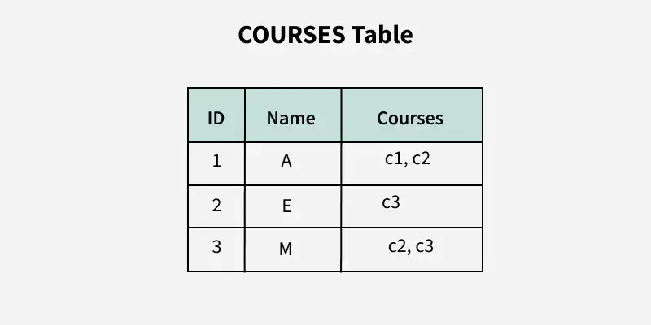
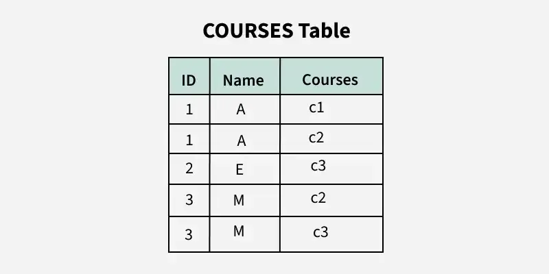

# First Normal Form (1NF) trong DBMS

**Cập nhật lần cuối:** 05/01/2026

**Nguồn tham khảo:**  
- GeeksforGeeks: [First Normal Form (1NF)](https://www.geeksforgeeks.org/dbms/first-normal-form-1nf/)
---

## 1. Mục tiêu bài giảng

Sau khi hoàn thành bài học này, người học có thể:

1. Trình bày được khái niệm **First Normal Form (1NF)** trong DBMS.
2. Giải thích được vì sao 1NF là bước đầu tiên trong quá trình chuẩn hóa cơ sở dữ liệu.
3. Nhận biết được bảng vi phạm 1NF do có thuộc tính đa trị, thuộc tính phức hợp hoặc nhóm lặp.
4. Phân biệt được giá trị **atomic** và giá trị **non-atomic**.
5. Chuyển đổi được một bảng chưa đạt 1NF thành bảng đạt 1NF.
6. Hiểu được vai trò của 1NF trong việc giảm dư thừa dữ liệu và hạn chế bất thường dữ liệu.
7. Làm được các câu hỏi trắc nghiệm và bài tập vận dụng về 1NF.

---

## 2. Giới thiệu tổng quan

**First Normal Form (1NF)** là dạng chuẩn đầu tiên và cơ bản nhất trong quá trình chuẩn hóa cơ sở dữ liệu quan hệ.

Một bảng đạt 1NF khi cấu trúc của bảng được tổ chức sao cho dữ liệu dễ quản lý, dễ truy vấn và không chứa các giá trị lặp hoặc giá trị nhiều phần trong cùng một ô.

Nói cách khác, 1NF yêu cầu mỗi ô trong bảng chỉ chứa **một giá trị đơn**, không chứa danh sách, mảng hoặc nhiều giá trị cùng lúc.

Ví dụ, một cột lưu nhiều số điện thoại như:

```text
0901, 0902, 0903
```

trong cùng một ô sẽ vi phạm 1NF.

---

## 3. Vì sao cần 1NF?

1NF là bước đầu tiên trong chuẩn hóa cơ sở dữ liệu. Nếu một bảng chưa đạt 1NF, các dạng chuẩn cao hơn như 2NF, 3NF, BCNF sẽ không được xét một cách đúng đắn.

1NF giúp:

- Giảm dữ liệu không có cấu trúc.
- Làm bảng dễ truy vấn bằng SQL.
- Tránh lưu nhiều giá trị trong cùng một ô.
- Giảm lỗi khi thêm, sửa, xóa dữ liệu.
- Tạo nền tảng cho các bước chuẩn hóa tiếp theo.
- Cải thiện tính toàn vẹn dữ liệu trong cơ sở dữ liệu quan hệ.

**Ví dụ bảng chưa đạt 1NF:**



**Ví dụ bảng sau khi chuyển về 1NF:**



---

### Quiz nhanh: Giới thiệu 1NF

**Câu 1.** 1NF là dạng chuẩn thứ mấy trong quá trình chuẩn hóa?

A. Dạng chuẩn đầu tiên  
B. Dạng chuẩn thứ hai  
C. Dạng chuẩn thứ ba  
D. Dạng chuẩn cuối cùng  

**Câu 2.** Mục tiêu chính của 1NF là gì?

A. Cho phép lưu nhiều giá trị trong một ô  
B. Đảm bảo mỗi ô chứa giá trị nguyên tử  
C. Xóa toàn bộ khóa chính  
D. Gộp tất cả bảng thành một bảng lớn  

**Câu 3.** Nếu một bảng chưa đạt 1NF, ta có nên xét 2NF ngay không?

A. Có, vì 2NF không liên quan 1NF  
B. Không, vì 2NF yêu cầu bảng phải đạt 1NF trước  
C. Có, nếu bảng có nhiều dòng  
D. Không, vì 2NF chỉ dùng cho NoSQL  

---

## 4. Khái niệm First Normal Form (1NF)

### 4.1. Định nghĩa

Một quan hệ hoặc bảng được gọi là đạt **First Normal Form (1NF)** nếu mọi thuộc tính trong quan hệ đều là thuộc tính đơn trị.

Điều này có nghĩa là:

- Mỗi cột chỉ chứa một giá trị trong mỗi dòng.
- Không có thuộc tính đa trị.
- Không có thuộc tính phức hợp.
- Không có nhóm lặp hoặc mảng trong một dòng.

---

### 4.2. Định nghĩa theo bảng dữ liệu

Một bảng đạt 1NF nếu thỏa mãn các điều kiện sau:

1. Tất cả các cột chứa giá trị **atomic**, tức là không thể chia nhỏ thêm trong ngữ cảnh quản lý dữ liệu.
2. Mỗi cột chứa các giá trị cùng một kiểu dữ liệu.
3. Mỗi dòng là duy nhất và có thể được xác định bằng khóa chính.
4. Không có nhóm lặp hoặc mảng trong bất kỳ dòng nào.
5. Mỗi cột có tên duy nhất.
6. Thứ tự lưu trữ dòng hoặc cột không ảnh hưởng đến ý nghĩa của bảng.

---

### 4.3. Atomic value là gì?

**Atomic value** là giá trị đơn, không chứa nhiều giá trị con trong cùng một ô.

Ví dụ giá trị atomic:

| StudentID | StudentName | Phone |
|---|---|---|
| 101 | An | 0901 |

Trong bảng trên, ô `Phone = 0901` là atomic vì chỉ chứa một số điện thoại.

Ví dụ giá trị không atomic:

| StudentID | StudentName | Phones |
|---|---|---|
| 101 | An | 0901, 0902 |

Ô `Phones = 0901, 0902` không atomic vì chứa nhiều số điện thoại trong cùng một ô.

---

## 5. Các quy tắc của First Normal Form

Để một bảng đạt 1NF, cần tuân thủ các quy tắc sau.

---

### 5.1. Mỗi cột chỉ chứa giá trị đơn

Mỗi ô trong bảng chỉ được chứa một giá trị. Không được lưu danh sách, mảng hoặc nhiều giá trị trong một ô.

#### Ví dụ vi phạm

| BookID | BookName | Writers |
|---|---|---|
| B01 | Database Basics | An, Bình, Chi |

Cột `Writers` chứa nhiều tác giả trong một ô, nên bảng vi phạm 1NF.

#### Cách sửa

Tách mỗi tác giả thành một dòng riêng:

| BookID | BookName | Writer |
|---|---|---|
| B01 | Database Basics | An |
| B01 | Database Basics | Bình |
| B01 | Database Basics | Chi |

---

### 5.2. Không có nhóm lặp

Bảng không nên có nhiều cột biểu diễn cùng một loại thông tin lặp lại.

#### Ví dụ vi phạm

| BookID | BookName | Writer1 | Writer2 | Writer3 |
|---|---|---|---|---|
| B01 | Database Basics | An | Bình | Chi |
| B02 | SQL Intro | Dũng |  |  |

Các cột `Writer1`, `Writer2`, `Writer3` là nhóm lặp vì đều biểu diễn cùng một loại thông tin là tác giả.

#### Cách sửa

Chuyển các tác giả thành nhiều dòng:

| BookID | BookName | Writer |
|---|---|---|
| B01 | Database Basics | An |
| B01 | Database Basics | Bình |
| B01 | Database Basics | Chi |
| B02 | SQL Intro | Dũng |

---

### 5.3. Mỗi cột chỉ chứa một kiểu dữ liệu

Các giá trị trong cùng một cột phải cùng kiểu dữ liệu hoặc cùng ý nghĩa nghiệp vụ.

#### Ví dụ vi phạm

| StudentID | Info |
|---|---|
| 101 | An |
| 102 | 20 |
| 103 | 0901 |

Cột `Info` đang trộn nhiều loại thông tin: tên, tuổi và số điện thoại.

#### Cách sửa

Tách thành các cột riêng:

| StudentID | StudentName | Age | Phone |
|---|---|---|---|
| 101 | An |  |  |
| 102 |  | 20 |  |
| 103 |  |  | 0901 |

Trong thực tế, nên thiết kế bảng sao cho mỗi cột có ý nghĩa rõ ràng ngay từ đầu.

---

### 5.4. Mỗi cột phải có tên duy nhất

Mỗi cột trong bảng cần có tên riêng, tránh trùng tên gây nhầm lẫn khi truy vấn hoặc cập nhật dữ liệu.

#### Ví dụ không tốt

| ID | Name | Name |
|---|---|---|
| 101 | An | Nguyễn |

Hai cột cùng tên `Name` gây khó hiểu.

#### Cách sửa

Đặt tên cột rõ ràng:

| StudentID | FirstName | LastName |
|---|---|---|
| 101 | An | Nguyễn |

---

### 5.5. Thứ tự dòng và cột không quan trọng

Trong mô hình quan hệ, ý nghĩa của bảng không phụ thuộc vào thứ tự lưu trữ dòng hoặc cột.

Ví dụ, hai bảng sau có cùng ý nghĩa về mặt dữ liệu nếu chứa cùng các dòng:

| StudentID | StudentName |
|---|---|
| 101 | An |
| 102 | Bình |

và:

| StudentID | StudentName |
|---|---|
| 102 | Bình |
| 101 | An |

Thứ tự dòng khác nhau không làm thay đổi ý nghĩa của quan hệ.

---

### Quiz nhanh: Quy tắc 1NF

**Câu 1.** Quy tắc nào sau đây đúng với 1NF?

A. Một ô có thể chứa danh sách giá trị  
B. Mỗi ô chỉ chứa một giá trị  
C. Mỗi bảng phải có đúng 5 cột  
D. Tên cột có thể trùng nhau  

**Câu 2.** Các cột `Writer1`, `Writer2`, `Writer3` trong cùng một bảng thường biểu hiện vấn đề gì?

A. Nhóm lặp  
B. Khóa chính  
C. Khóa ngoại  
D. Phụ thuộc bắc cầu  

**Câu 3.** Trong 1NF, thứ tự các dòng trong bảng có ảnh hưởng đến ý nghĩa dữ liệu không?

A. Có  
B. Không  
C. Chỉ ảnh hưởng khi có khóa chính  
D. Chỉ ảnh hưởng khi có khóa ngoại  

---

## 6. Thuộc tính đơn trị, đa trị và phức hợp

### 6.1. Thuộc tính đơn trị

**Thuộc tính đơn trị** là thuộc tính chỉ có một giá trị cho mỗi dòng dữ liệu.

Ví dụ:

| StudentID | StudentName |
|---|---|
| 101 | An |

`StudentName` là thuộc tính đơn trị nếu mỗi sinh viên chỉ có một tên được lưu trong ô đó.

---

### 6.2. Thuộc tính đa trị

**Thuộc tính đa trị** là thuộc tính có thể chứa nhiều giá trị cho một dòng dữ liệu.

Ví dụ:

| StudentID | StudentName | Phones |
|---|---|---|
| 101 | An | 0901, 0902 |

`Phones` là thuộc tính đa trị vì một sinh viên có nhiều số điện thoại.

Bảng chứa thuộc tính đa trị trong một ô sẽ vi phạm 1NF.

---

### 6.3. Thuộc tính phức hợp

**Thuộc tính phức hợp** là thuộc tính có thể chia thành nhiều phần nhỏ hơn.

Ví dụ:

| StudentID | FullName |
|---|---|
| 101 | Nguyễn Văn An |

Trong một số ngữ cảnh, `FullName` có thể chia thành:

- LastName
- MiddleName
- FirstName

Tuy nhiên, việc có cần tách hay không phụ thuộc vào yêu cầu quản lý. Nếu hệ thống cần tìm kiếm theo họ hoặc tên riêng, nên tách thành các cột riêng.

---

### 6.4. So sánh

| Loại thuộc tính | Mô tả | Ví dụ | Liên quan đến 1NF |
|---|---|---|---|
| Đơn trị | Mỗi dòng có một giá trị | `Age = 20` | Phù hợp 1NF |
| Đa trị | Một dòng có nhiều giá trị | `Phones = 0901, 0902` | Vi phạm 1NF |
| Phức hợp | Có thể chia thành nhiều phần | `FullName = Nguyễn Văn An` | Có thể cần tách tùy yêu cầu |

---

## 7. Ví dụ chính: Bảng COURSES

### 7.1. Bảng chưa đạt 1NF

Xét quan hệ `COURSES`:

| CourseID | CourseName | Faculty |
|---|---|---|
| C01 | Database Systems | Dr. An, Dr. Bình |
| C02 | Programming Basics | Dr. Chi |
| C03 | Computer Networks | Dr. Dũng, Dr. Hà |

Bảng trên chưa đạt 1NF vì cột `Faculty` chứa nhiều giảng viên trong cùng một ô.

Nói cách khác, `Faculty` là thuộc tính đa trị.

---

### 7.2. Chuyển bảng về 1NF

Để đưa bảng về 1NF, ta tách mỗi giảng viên thành một dòng riêng:

| CourseID | CourseName | Faculty |
|---|---|---|
| C01 | Database Systems | Dr. An |
| C01 | Database Systems | Dr. Bình |
| C02 | Programming Basics | Dr. Chi |
| C03 | Computer Networks | Dr. Dũng |
| C03 | Computer Networks | Dr. Hà |

Bảng sau khi tách đã đạt 1NF vì:

- Mỗi ô chỉ chứa một giá trị.
- Không có danh sách giảng viên trong một ô.
- Không còn thuộc tính đa trị trong cùng một dòng.

---

### 7.3. Nhận xét

Mặc dù bảng đã đạt 1NF, nó vẫn có thể còn dữ liệu lặp.

Ví dụ:

- `CourseID = C01` lặp lại hai lần.
- `CourseName = Database Systems` lặp lại hai lần.

Điều này không nhất thiết vi phạm 1NF. Các vấn đề dữ liệu lặp này sẽ được xử lý tiếp ở các dạng chuẩn cao hơn như 2NF và 3NF.

---

### Quiz nhanh: Ví dụ COURSES

**Câu 1.** Bảng `COURSES` ban đầu vi phạm 1NF vì lý do nào?

A. Không có tên bảng  
B. Cột `Faculty` chứa nhiều giá trị trong một ô  
C. CourseID là kiểu chữ  
D. CourseName quá dài  

**Câu 2.** Cách đưa bảng `COURSES` về 1NF là gì?

A. Xóa toàn bộ cột Faculty  
B. Tách mỗi giảng viên thành một dòng riêng  
C. Gộp tất cả CourseID thành một ô  
D. Đổi CourseName thành số  

**Câu 3.** Sau khi đạt 1NF, bảng có thể vẫn còn dữ liệu lặp không?

A. Có  
B. Không  
C. Chỉ khi không có khóa chính  
D. Chỉ khi không có tên cột  

---

## 8. Ví dụ khác: Bảng sinh viên có nhiều số điện thoại

### 8.1. Bảng chưa đạt 1NF

| StudentID | StudentName | PhoneNumbers |
|---|---|---|
| 101 | An | 0901, 0902 |
| 102 | Bình | 0911 |
| 103 | Chi | 0921, 0922 |

Bảng này vi phạm 1NF vì `PhoneNumbers` chứa nhiều số điện thoại trong một ô.

---

### 8.2. Cách 1: Tách thành nhiều dòng

| StudentID | StudentName | PhoneNumber |
|---|---|---|
| 101 | An | 0901 |
| 101 | An | 0902 |
| 102 | Bình | 0911 |
| 103 | Chi | 0921 |
| 103 | Chi | 0922 |

Cách này giúp mỗi ô chỉ chứa một số điện thoại.

---

### 8.3. Cách 2: Tách thành bảng riêng

Thiết kế tốt hơn có thể là tách số điện thoại ra bảng riêng.

**Students**

| StudentID | StudentName |
|---|---|
| 101 | An |
| 102 | Bình |
| 103 | Chi |

**StudentPhones**

| StudentID | PhoneNumber |
|---|---|
| 101 | 0901 |
| 101 | 0902 |
| 102 | 0911 |
| 103 | 0921 |
| 103 | 0922 |

Cách này phù hợp hơn nếu một sinh viên có thể có nhiều số điện thoại.

---

## 9. Các lỗi thường gặp khi kiểm tra 1NF

### 9.1. Nhầm giữa dữ liệu lặp và vi phạm 1NF

Một bảng có thể có dữ liệu lặp nhưng vẫn đạt 1NF.

Ví dụ:

| CourseID | CourseName | Faculty |
|---|---|---|
| C01 | Database | Dr. An |
| C01 | Database | Dr. Bình |

`CourseID` và `CourseName` bị lặp, nhưng mỗi ô vẫn chỉ chứa một giá trị. Vì vậy, bảng có thể vẫn đạt 1NF.

Dữ liệu lặp kiểu này có thể được xử lý ở 2NF hoặc 3NF.

---

### 9.2. Tưởng rằng tách thành Writer1, Writer2 là đạt 1NF

Bảng có các cột `Writer1`, `Writer2`, `Writer3` vẫn không tốt vì đây là nhóm lặp.

Thiết kế tốt hơn là tạo nhiều dòng hoặc tạo bảng liên kết.

---

### 9.3. Không xác định khóa chính

1NF yêu cầu mỗi dòng phải có thể được xác định duy nhất. Vì vậy, bảng nên có khóa chính hoặc ít nhất có một tập thuộc tính giúp phân biệt các dòng.

Ví dụ bảng sau không tốt:

| StudentName | PhoneNumber |
|---|---|
| An | 0901 |
| An | 0901 |

Hai dòng hoàn toàn giống nhau, gây khó xác định bản ghi.

---

## 10. 1NF và khóa chính

### 10.1. Vì sao cần khóa chính?

Trong 1NF, mỗi dòng cần được xác định duy nhất. Khóa chính giúp phân biệt các dòng trong bảng.

Ví dụ:

| StudentID | StudentName | PhoneNumber |
|---|---|---|
| 101 | An | 0901 |
| 101 | An | 0902 |

Nếu mỗi sinh viên có nhiều số điện thoại, `StudentID` một mình không đủ để xác định duy nhất từng dòng. Khi đó có thể dùng khóa ghép:

```text
(StudentID, PhoneNumber)
```

---

### 10.2. Ví dụ khóa ghép

Bảng `StudentPhones`:

| StudentID | PhoneNumber |
|---|---|
| 101 | 0901 |
| 101 | 0902 |
| 102 | 0911 |

Khóa chính có thể là:

```text
(StudentID, PhoneNumber)
```

Mỗi cặp `(StudentID, PhoneNumber)` là duy nhất.

---

## 11. 1NF trong quy trình chuẩn hóa

1NF là nền tảng cho các dạng chuẩn tiếp theo.

| Dạng chuẩn | Yêu cầu chính |
|---|---|
| 1NF | Loại bỏ giá trị không nguyên tử và nhóm lặp |
| 2NF | Loại bỏ phụ thuộc bộ phận |
| 3NF | Loại bỏ phụ thuộc bắc cầu |
| BCNF | Mọi determinant là super key |
| 4NF | Loại bỏ phụ thuộc đa trị |
| 5NF | Loại bỏ phụ thuộc nối |

Một bảng cần đạt 1NF trước khi có thể xét các dạng chuẩn cao hơn.

---

## 12. Ứng dụng thực tế của 1NF

### 12.1. Thiết kế bảng khách hàng

Thay vì lưu nhiều email trong một cột:

| CustomerID | CustomerName | Emails |
|---|---|---|
| C01 | Lan | lan@gmail.com, lan.work@gmail.com |

Nên tách thành:

| CustomerID | Email |
|---|---|
| C01 | lan@gmail.com |
| C01 | lan.work@gmail.com |

---

### 12.2. Thiết kế bảng sản phẩm

Không nên lưu nhiều màu trong một ô:

| ProductID | ProductName | Colors |
|---|---|---|
| P01 | T-shirt | Red, Blue, Black |

Nên tách thành:

| ProductID | Color |
|---|---|
| P01 | Red |
| P01 | Blue |
| P01 | Black |

---

### 12.3. Thiết kế bảng đơn hàng

Không nên lưu nhiều sản phẩm trong một ô của bảng đơn hàng:

| OrderID | CustomerID | Products |
|---|---|---|
| O01 | C01 | P01, P02, P03 |

Nên dùng bảng chi tiết đơn hàng:

| OrderID | ProductID |
|---|---|
| O01 | P01 |
| O01 | P02 |
| O01 | P03 |

---

## 13. Ưu điểm và hạn chế của 1NF

### 13.1. Ưu điểm

1NF giúp:

- Dữ liệu có cấu trúc rõ ràng hơn.
- Truy vấn SQL đơn giản hơn.
- Hạn chế việc phân tách chuỗi thủ công.
- Giảm lỗi khi thêm, sửa, xóa dữ liệu.
- Tạo nền tảng cho 2NF, 3NF và các dạng chuẩn cao hơn.

---

### 13.2. Hạn chế

1NF chỉ xử lý mức cơ bản của dữ liệu.

Một bảng đạt 1NF vẫn có thể:

- Có dữ liệu dư thừa.
- Có phụ thuộc bộ phận.
- Có phụ thuộc bắc cầu.
- Có bất thường khi cập nhật dữ liệu.

Do đó, sau 1NF thường cần tiếp tục kiểm tra các dạng chuẩn cao hơn.

---

## 14. Bảng so sánh: Bảng chưa đạt 1NF và bảng đạt 1NF

| Tiêu chí | Chưa đạt 1NF | Đạt 1NF |
|---|---|---|
| Giá trị trong ô | Có thể chứa nhiều giá trị | Chỉ chứa một giá trị |
| Nhóm lặp | Có thể có Writer1, Writer2, Writer3 | Không có nhóm lặp |
| Kiểu dữ liệu trong cột | Có thể bị trộn nhiều loại thông tin | Cùng kiểu hoặc cùng ý nghĩa |
| Truy vấn SQL | Khó truy vấn, phải xử lý chuỗi | Dễ truy vấn hơn |
| Khả năng chuẩn hóa tiếp | Chưa phù hợp | Có thể xét 2NF, 3NF |

---

## 15. Quy trình kiểm tra một bảng có đạt 1NF không

Có thể kiểm tra theo các bước sau:

1. **Kiểm tra từng ô dữ liệu**

   Mỗi ô có chứa đúng một giá trị không?

2. **Kiểm tra nhóm lặp**

   Có các cột như `Phone1`, `Phone2`, `Phone3` hoặc `Writer1`, `Writer2`, `Writer3` không?

3. **Kiểm tra kiểu dữ liệu trong mỗi cột**

   Một cột có đang chứa nhiều loại thông tin khác nhau không?

4. **Kiểm tra tên cột**

   Có cột nào trùng tên hoặc gây mơ hồ không?

5. **Kiểm tra tính duy nhất của dòng**

   Có thể xác định duy nhất từng dòng không?

6. **Đề xuất cách sửa**

   Nếu có thuộc tính đa trị hoặc nhóm lặp, tách thành nhiều dòng hoặc bảng riêng.

---

## 16. Câu hỏi ôn tập

### 16.1. Câu hỏi trắc nghiệm

**Câu 1.** Một bảng đạt 1NF khi nào?

A. Mỗi ô chứa một giá trị nguyên tử  
B. Mỗi ô chứa nhiều giá trị  
C. Không có khóa chính  
D. Có ít nhất một cột chứa danh sách  

---

**Câu 2.** Cột nào sau đây vi phạm 1NF?

A. Age = 20  
B. PhoneNumbers = 0901, 0902  
C. StudentID = 101  
D. Gender = Nam  

---

**Câu 3.** Các cột `Phone1`, `Phone2`, `Phone3` trong một bảng thường là ví dụ của:

A. Nhóm lặp  
B. Khóa ngoại  
C. Thuộc tính khóa  
D. Dạng chuẩn 3NF  

---

**Câu 4.** Trong 1NF, mỗi cột nên chứa:

A. Các giá trị cùng kiểu hoặc cùng ý nghĩa  
B. Nhiều loại thông tin khác nhau  
C. Danh sách giá trị  
D. Dữ liệu không xác định  

---

**Câu 5.** Nếu một bảng có cột `Hobbies = Football, Music`, bảng đó:

A. Có thể vi phạm 1NF  
B. Chắc chắn đạt 3NF  
C. Không cần khóa chính  
D. Không thể lưu trong DBMS  

---

**Câu 6.** Để xử lý thuộc tính đa trị, ta thường:

A. Tách thành nhiều dòng hoặc bảng riêng  
B. Gộp thêm nhiều giá trị vào một ô  
C. Xóa khóa chính  
D. Đổi bảng thành ảnh  

---

**Câu 7.** Bảng đạt 1NF có chắc chắn đạt 2NF không?

A. Có  
B. Không  
C. Luôn đạt BCNF  
D. Luôn đạt 5NF  

---

**Câu 8.** Điều nào sau đây không phải quy tắc của 1NF?

A. Mỗi ô chứa giá trị atomic  
B. Không có nhóm lặp  
C. Mỗi cột có tên duy nhất  
D. Mỗi thuộc tính không khóa phải phụ thuộc vào toàn bộ khóa ghép  

---

**Câu 9.** Quy tắc “mỗi thuộc tính không khóa phải phụ thuộc vào toàn bộ khóa ghép” thuộc dạng chuẩn nào?

A. 1NF  
B. 2NF  
C. 4NF  
D. 5NF  

---

**Câu 10.** Vì sao 1NF quan trọng?

A. Vì nó là nền tảng để xét các dạng chuẩn cao hơn  
B. Vì nó cho phép lưu mảng trong một ô  
C. Vì nó loại bỏ mọi phụ thuộc bắc cầu  
D. Vì nó không cần khóa chính  

---

### 16.2. Câu hỏi tự luận ngắn

**Câu 1.** Trình bày khái niệm First Normal Form.

---

**Câu 2.** Giá trị atomic là gì? Cho ví dụ.

---

**Câu 3.** Vì sao bảng có cột `PhoneNumbers = 0901, 0902` vi phạm 1NF?

---

**Câu 4.** Phân biệt thuộc tính đơn trị và thuộc tính đa trị.

---

**Câu 5.** Một bảng đạt 1NF có còn dữ liệu dư thừa không? Giải thích.

---

## 17. Bài tập vận dụng

### Bài tập 1

Cho bảng:

| StudentID | StudentName | Phones |
|---|---|---|
| 101 | An | 0901, 0902 |
| 102 | Bình | 0911 |
| 103 | Chi | 0921, 0922 |

**Yêu cầu:**  
Bảng trên có đạt 1NF không? Nếu chưa, hãy chuyển về 1NF.

---

### Bài tập 2

Cho bảng:

| BookID | BookName | Writer1 | Writer2 | Writer3 |
|---|---|---|---|---|
| B01 | Database Basics | An | Bình | Chi |
| B02 | SQL Intro | Dũng |  |  |

**Yêu cầu:**  
Chỉ ra vấn đề của bảng và thiết kế lại bảng đạt 1NF.

---

### Bài tập 3

Cho bảng:

| CustomerID | CustomerName | Emails |
|---|---|---|
| C01 | Lan | lan@gmail.com, lan.work@gmail.com |
| C02 | Minh | minh@gmail.com |

**Yêu cầu:**  
Hãy chuyển bảng về 1NF theo hai cách:

1. Tách thành nhiều dòng trong cùng bảng.
2. Tách thành bảng riêng cho email.

---

### Bài tập 4

Cho bảng:

| OrderID | CustomerID | Products |
|---|---|---|
| O01 | C01 | P01, P02 |
| O02 | C02 | P03 |

**Yêu cầu:**  
Bảng trên vi phạm 1NF ở đâu? Hãy đề xuất thiết kế lại phù hợp.

---

### Bài tập 5

Cho bảng:

| CourseID | CourseName | Faculty |
|---|---|---|
| C01 | Database Systems | Dr. An, Dr. Bình |
| C02 | Programming Basics | Dr. Chi |
| C03 | Computer Networks | Dr. Dũng, Dr. Hà |

**Yêu cầu:**  
Chuyển bảng `COURSES` về 1NF.

---

## 18. Tóm tắt bài học

- First Normal Form là dạng chuẩn đầu tiên trong chuẩn hóa cơ sở dữ liệu.
- Một bảng đạt 1NF nếu mỗi ô chỉ chứa một giá trị atomic.
- Bảng không được chứa thuộc tính đa trị, thuộc tính phức hợp chưa xử lý hoặc nhóm lặp.
- Mỗi cột nên chứa dữ liệu cùng kiểu hoặc cùng ý nghĩa.
- Mỗi cột cần có tên duy nhất.
- Thứ tự dòng và cột không ảnh hưởng đến ý nghĩa của bảng.
- Bảng có cột chứa danh sách như `0901, 0902` thường vi phạm 1NF.
- Để chuyển về 1NF, có thể tách dữ liệu thành nhiều dòng hoặc bảng riêng.
- 1NF là nền tảng để tiếp tục xét 2NF, 3NF, BCNF và các dạng chuẩn cao hơn.
- Một bảng đạt 1NF vẫn có thể còn dư thừa dữ liệu, nên cần tiếp tục chuẩn hóa nếu cần.

---

## 19. Từ khóa chính

- First Normal Form
- 1NF
- Normalization
- Atomic Value
- Single-valued Attribute
- Multivalued Attribute
- Composite Attribute
- Repeating Group
- Primary Key
- Relation
- Table
- Redundancy
- Data Integrity
- Insert Anomaly
- Update Anomaly
- Delete Anomaly

---

## 20. Đáp án và gợi ý trả lời

### Quiz nhanh: Giới thiệu 1NF

- **Câu 1.** A
- **Câu 2.** B
- **Câu 3.** B

### Quiz nhanh: Quy tắc 1NF

- **Câu 1.** B
- **Câu 2.** A
- **Câu 3.** B

### Quiz nhanh: Ví dụ COURSES

- **Câu 1.** B
- **Câu 2.** B
- **Câu 3.** A

---

### Câu hỏi ôn tập - Trắc nghiệm

- **Câu 1.** A
- **Câu 2.** B
- **Câu 3.** A
- **Câu 4.** A
- **Câu 5.** A
- **Câu 6.** A
- **Câu 7.** B
- **Câu 8.** D
- **Câu 9.** B
- **Câu 10.** A

---

### Câu hỏi ôn tập - Tự luận ngắn

#### Câu 1

**Gợi ý trả lời:**  
First Normal Form là dạng chuẩn yêu cầu mỗi ô trong bảng chứa một giá trị nguyên tử, không có thuộc tính đa trị, không có nhóm lặp và mỗi dòng có thể được xác định duy nhất.

#### Câu 2

**Gợi ý trả lời:**  
Giá trị atomic là giá trị đơn, không chứa nhiều giá trị con trong cùng một ô. Ví dụ `Phone = 0901` là atomic, còn `Phone = 0901, 0902` không atomic.

#### Câu 3

**Gợi ý trả lời:**  
Vì ô `PhoneNumbers = 0901, 0902` chứa hai số điện thoại trong cùng một ô. Điều này vi phạm quy tắc mỗi ô chỉ chứa một giá trị của 1NF.

#### Câu 4

**Gợi ý trả lời:**  
Thuộc tính đơn trị chỉ có một giá trị cho mỗi dòng, ví dụ `Age = 20`. Thuộc tính đa trị có nhiều giá trị cho một dòng, ví dụ `Phones = 0901, 0902`.

#### Câu 5

**Gợi ý trả lời:**  
Có. 1NF chỉ đảm bảo dữ liệu nguyên tử và không có nhóm lặp. Bảng đạt 1NF vẫn có thể còn dữ liệu dư thừa, phụ thuộc bộ phận hoặc phụ thuộc bắc cầu, cần xét tiếp 2NF và 3NF.

---

### Bài tập vận dụng

#### Bài tập 1

**Gợi ý trả lời:**

Bảng chưa đạt 1NF vì cột `Phones` chứa nhiều số điện thoại trong một ô.

Chuyển về 1NF:

| StudentID | StudentName | Phone |
|---|---|---|
| 101 | An | 0901 |
| 101 | An | 0902 |
| 102 | Bình | 0911 |
| 103 | Chi | 0921 |
| 103 | Chi | 0922 |

---

#### Bài tập 2

**Gợi ý trả lời:**

Bảng có nhóm lặp `Writer1`, `Writer2`, `Writer3`.

Thiết kế lại:

| BookID | BookName | Writer |
|---|---|---|
| B01 | Database Basics | An |
| B01 | Database Basics | Bình |
| B01 | Database Basics | Chi |
| B02 | SQL Intro | Dũng |

---

#### Bài tập 3

**Gợi ý trả lời:**

Cách 1: Tách thành nhiều dòng:

| CustomerID | CustomerName | Email |
|---|---|---|
| C01 | Lan | lan@gmail.com |
| C01 | Lan | lan.work@gmail.com |
| C02 | Minh | minh@gmail.com |

Cách 2: Tách bảng riêng:

**Customers**

| CustomerID | CustomerName |
|---|---|
| C01 | Lan |
| C02 | Minh |

**CustomerEmails**

| CustomerID | Email |
|---|---|
| C01 | lan@gmail.com |
| C01 | lan.work@gmail.com |
| C02 | minh@gmail.com |

---

#### Bài tập 4

**Gợi ý trả lời:**

Bảng vi phạm 1NF vì cột `Products` chứa nhiều sản phẩm trong một ô.

Thiết kế lại:

**Orders**

| OrderID | CustomerID |
|---|---|
| O01 | C01 |
| O02 | C02 |

**OrderDetails**

| OrderID | ProductID |
|---|---|
| O01 | P01 |
| O01 | P02 |
| O02 | P03 |

---

#### Bài tập 5

**Gợi ý trả lời:**

Bảng `COURSES` chưa đạt 1NF vì cột `Faculty` chứa nhiều giảng viên trong một ô.

Chuyển về 1NF:

| CourseID | CourseName | Faculty |
|---|---|---|
| C01 | Database Systems | Dr. An |
| C01 | Database Systems | Dr. Bình |
| C02 | Programming Basics | Dr. Chi |
| C03 | Computer Networks | Dr. Dũng |
| C03 | Computer Networks | Dr. Hà |

---
