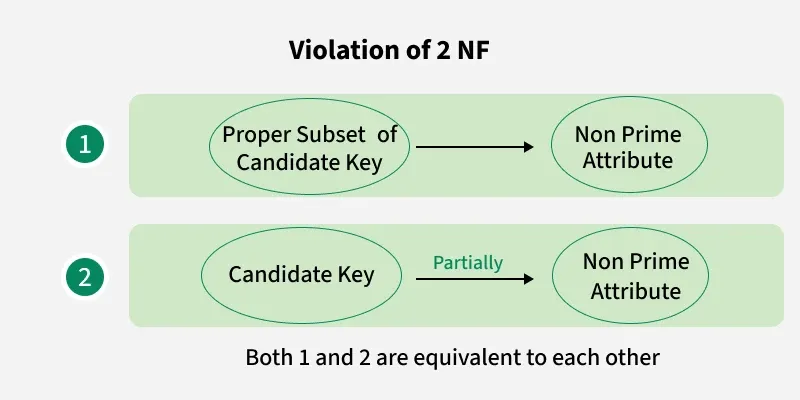
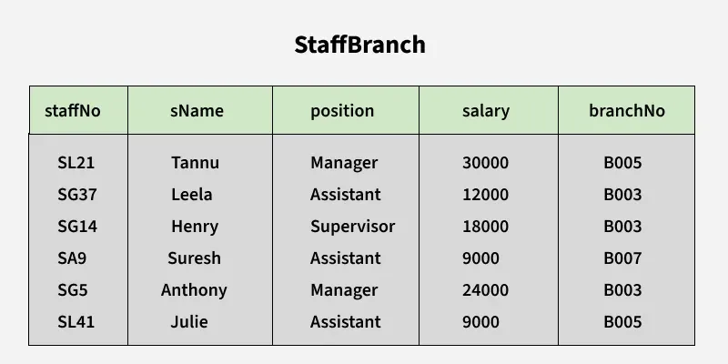
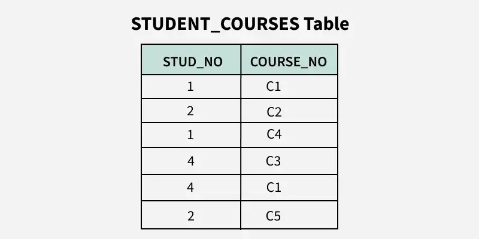
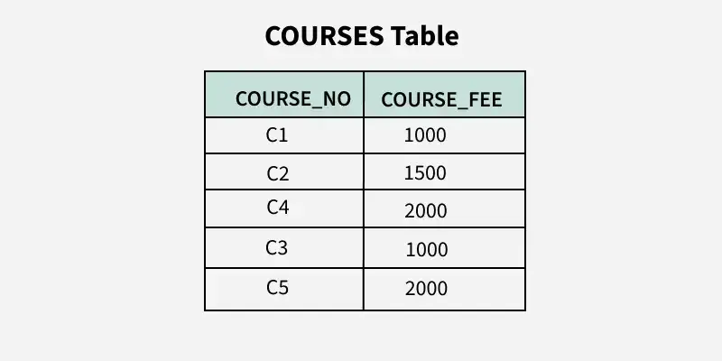

# Second Normal Form (2NF) trong DBMS

**Cập nhật lần cuối:** 12/07/2025

**Nguồn tham khảo:**  
- GeeksforGeeks: [Second Normal Form (2NF)](https://www.geeksforgeeks.org/dbms/second-normal-form-2nf/)

---

## 1. Mục tiêu bài giảng

Sau khi hoàn thành bài học này, người học có thể:

1. Trình bày được khái niệm **Second Normal Form (2NF)** trong DBMS.
2. Giải thích được mối quan hệ giữa 1NF, 2NF và phụ thuộc hàm đầy đủ.
3. Nhận biết được **partial dependency** trong một bảng có khóa ghép.
4. Phân biệt được **full functional dependency** và **partial dependency**.
5. Xác định được thuộc tính khóa, thuộc tính không khóa, prime attribute và non-prime attribute.
6. Phân tích được một bảng có vi phạm 2NF hay không.
7. Chuyển đổi được một bảng chưa đạt 2NF thành các bảng đạt 2NF.
8. Hiểu được các hạn chế của 2NF và lý do cần học tiếp 3NF.

---

## 2. Giới thiệu tổng quan

**Second Normal Form (2NF)** là dạng chuẩn thứ hai trong quá trình chuẩn hóa cơ sở dữ liệu quan hệ.

2NF dựa trên khái niệm **fully functional dependency**, tức là phụ thuộc hàm đầy đủ. Một thuộc tính không khóa phải phụ thuộc vào **toàn bộ khóa chính**, không được chỉ phụ thuộc vào một phần của khóa chính.

Nói cách khác, 2NF nhằm loại bỏ **partial dependency**, tức là phụ thuộc bộ phận.

Một bảng đạt 2NF nếu:

1. Bảng đã đạt **First Normal Form (1NF)**.
2. Không có thuộc tính không khóa nào phụ thuộc vào một phần của khóa ghép.

---

## 3. Vì sao cần 2NF?

Một bảng chỉ đạt 1NF vẫn có thể còn dữ liệu dư thừa.

Ví dụ, nếu bảng lưu thông tin sinh viên đăng ký môn học, bảng có thể chứa:

- Mã sinh viên.
- Mã môn học.
- Tên sinh viên.
- Tên môn học.
- Học phí.
- Điểm.

Nếu khóa của bảng là `(StudentID, CourseID)`, thì:

- `StudentName` chỉ phụ thuộc vào `StudentID`.
- `CourseName` chỉ phụ thuộc vào `CourseID`.
- `CourseFee` chỉ phụ thuộc vào `CourseID`.
- `Grade` phụ thuộc vào cả `StudentID` và `CourseID`.

Các thuộc tính như `StudentName`, `CourseName`, `CourseFee` bị lặp lại nhiều lần. Đây là dấu hiệu của phụ thuộc bộ phận.

2NF giúp:

- Giảm dữ liệu lặp.
- Hạn chế lỗi khi cập nhật dữ liệu.
- Giúp bảng có cấu trúc rõ ràng hơn.
- Tách dữ liệu thành các bảng hợp lý hơn.
- Tạo nền tảng để tiếp tục chuẩn hóa lên 3NF.

**Ví dụ bảng chưa đạt 2NF do có phụ thuộc bộ phận:**



---

### Quiz nhanh: Giới thiệu 2NF

**Câu 1.** 2NF yêu cầu bảng phải đạt dạng chuẩn nào trước?

A. 1NF  
B. 3NF  
C. BCNF  
D. 4NF  

**Câu 2.** 2NF chủ yếu loại bỏ vấn đề nào?

A. Phụ thuộc bộ phận  
B. Phụ thuộc đa trị  
C. Phụ thuộc nối  
D. Giá trị không nguyên tử  

**Câu 3.** 2NF thường quan trọng nhất khi bảng có loại khóa nào?

A. Khóa ghép  
B. Khóa ngoại đơn  
C. Không có khóa  
D. Khóa chỉ gồm một ký tự  

---

## 4. Điều kiện để bảng đạt 2NF

Một bảng đạt **Second Normal Form** nếu thỏa mãn hai điều kiện sau:

### 4.1. Bảng phải đạt 1NF

Bảng phải thỏa mãn các yêu cầu của 1NF:

- Mỗi ô chứa giá trị nguyên tử.
- Không có nhóm lặp.
- Mỗi cột có tên duy nhất.
- Mỗi dòng có thể được xác định duy nhất.

Nếu bảng chưa đạt 1NF thì chưa thể xét 2NF.

---

### 4.2. Không có partial dependency

Bảng không được có thuộc tính không khóa phụ thuộc vào một phần của khóa ghép.

Nói cách khác:

- Nếu khóa là một thuộc tính đơn, thường không có partial dependency theo nghĩa khóa ghép.
- Nếu khóa là khóa ghép, cần kiểm tra từng thuộc tính không khóa.
- Mỗi thuộc tính không khóa phải phụ thuộc vào toàn bộ khóa ghép.

---

### Quiz nhanh: Điều kiện đạt 2NF

**Câu 1.** Điều kiện đầu tiên để một bảng đạt 2NF là gì?

A. Bảng đã đạt 1NF  
B. Bảng đã đạt 4NF  
C. Bảng không có khóa chính  
D. Bảng chỉ có một cột  

**Câu 2.** Nếu khóa chính chỉ có một thuộc tính, partial dependency theo nghĩa khóa ghép thường như thế nào?

A. Thường không xảy ra  
B. Luôn xảy ra  
C. Luôn là phụ thuộc đa trị  
D. Luôn vi phạm 5NF  

**Câu 3.** Trong 2NF, thuộc tính không khóa phải phụ thuộc vào đâu?

A. Một phần bất kỳ của khóa ghép  
B. Toàn bộ khóa chính hoặc khóa ứng viên  
C. Một thuộc tính không khóa khác  
D. Một giá trị không nguyên tử  

---

## 5. Một số khái niệm cần nhớ

### 5.1. Candidate Key

**Candidate key** là tập thuộc tính có thể xác định duy nhất mỗi dòng trong bảng và không thể bỏ bớt thuộc tính nào mà vẫn giữ được tính duy nhất.

Ví dụ, trong bảng đăng ký học:

```text
(StudentID, CourseID)
```

có thể là candidate key vì một sinh viên có thể học nhiều môn, và một môn có thể có nhiều sinh viên.

Cặp `(StudentID, CourseID)` xác định duy nhất một bản ghi đăng ký.

---

### 5.2. Composite Key

**Composite key** hay **khóa ghép** là khóa gồm từ hai thuộc tính trở lên.

Ví dụ:

```text
(StudentID, CourseID)
```

là khóa ghép.

2NF chủ yếu xử lý vấn đề xuất hiện khi bảng có khóa ghép.

---

### 5.3. Prime Attribute

**Prime attribute** là thuộc tính thuộc ít nhất một candidate key.

Ví dụ, nếu candidate key là:

```text
(StudentID, CourseID)
```

thì:

- `StudentID` là prime attribute.
- `CourseID` là prime attribute.

---

### 5.4. Non-prime Attribute

**Non-prime attribute** là thuộc tính không thuộc bất kỳ candidate key nào.

Ví dụ, trong bảng:

```text
(StudentID, CourseID, StudentName, CourseName, Grade)
```

nếu candidate key là `(StudentID, CourseID)`, thì:

- `StudentName` là non-prime attribute.
- `CourseName` là non-prime attribute.
- `Grade` là non-prime attribute.

---

### 5.5. Fully Functional Dependency

Một thuộc tính `Y` được gọi là phụ thuộc hàm đầy đủ vào tập thuộc tính `X` nếu `Y` phụ thuộc vào toàn bộ `X`, và không phụ thuộc vào bất kỳ tập con thực sự nào của `X`.

Ví dụ:

```text
StudentID, CourseID → Grade
```

Nếu cần cả `StudentID` và `CourseID` mới xác định được `Grade`, thì đây là phụ thuộc hàm đầy đủ.

---

### 5.6. Partial Dependency

**Partial dependency** xảy ra khi một thuộc tính không khóa phụ thuộc vào một phần của khóa ghép, thay vì phụ thuộc vào toàn bộ khóa ghép.

Ví dụ:

```text
StudentID, CourseID → StudentName
StudentID → StudentName
```

Ở đây, `StudentName` chỉ cần `StudentID` để xác định, không cần cả `CourseID`.

Do đó, `StudentName` phụ thuộc bộ phận vào khóa ghép `(StudentID, CourseID)`.

---

## 6. Partial Dependency là gì?

### 6.1. Định nghĩa

Một phụ thuộc hàm `A → B` được gọi là **partial dependency** nếu:

- `A` là một tập thuộc tính có nhiều hơn một thuộc tính.
- `B` là thuộc tính không khóa.
- `B` phụ thuộc vào một tập con thực sự của `A`.

Nói đơn giản:

> Nếu một bảng có khóa ghép, nhưng một thuộc tính không khóa chỉ phụ thuộc vào một phần của khóa ghép, thì đó là partial dependency.

---

### 6.2. Dạng tổng quát

Giả sử khóa ghép là:

```text
(A, B)
```

Nếu có:

```text
A → C
```

trong đó `C` là thuộc tính không khóa, thì `C` phụ thuộc vào một phần của khóa ghép.

Do đó, bảng có partial dependency và chưa đạt 2NF.

---

### 6.3. Ví dụ đơn giản

Xét bảng:

| StudentID | CourseID | StudentName | Grade |
|---|---|---|---|
| 101 | C01 | An | A |
| 101 | C02 | An | B |
| 102 | C01 | Bình | A |

Khóa ghép:

```text
(StudentID, CourseID)
```

Phụ thuộc:

```text
StudentID → StudentName
```

`StudentName` chỉ phụ thuộc vào `StudentID`, không phụ thuộc vào toàn bộ khóa ghép.

Vì vậy, đây là partial dependency.

---

### Quiz nhanh: Partial Dependency

**Câu 1.** Partial dependency thường xuất hiện khi bảng có gì?

A. Khóa ghép  
B. Một cột duy nhất  
C. Không có thuộc tính không khóa  
D. Không có dữ liệu  

**Câu 2.** Nếu khóa là `(A, B)` và có `A → C`, với `C` là thuộc tính không khóa, đây là gì?

A. Phụ thuộc bộ phận  
B. Phụ thuộc đa trị  
C. Phụ thuộc nối  
D. Phụ thuộc tầm thường  

**Câu 3.** 2NF yêu cầu thuộc tính không khóa phải phụ thuộc vào đâu?

A. Một phần của khóa ghép  
B. Toàn bộ khóa chính hoặc khóa ứng viên  
C. Một thuộc tính không khóa khác  
D. Bất kỳ thuộc tính nào trong bảng  

---

## 7. Ví dụ StaffBranch

### 7.1. Bảng StaffBranch

Xét quan hệ `StaffBranch`:



| staffNo | sName | branchNo |
|---|---|---|
| S01 | An | B01 |
| S02 | Bình | B02 |
| S03 | Chi | B01 |

Giả sử có phụ thuộc hàm:

```text
staffNo, sName → branchNo
```

Điều này có nghĩa là tổ hợp `(staffNo, sName)` xác định `branchNo`.

Tuy nhiên, ta cũng có:

```text
staffNo → branchNo
```

Nghĩa là chỉ cần `staffNo` đã xác định được `branchNo`.

---

### 7.2. Phân tích partial dependency

Nếu xem `(staffNo, sName)` là khóa ghép, thì `branchNo` phụ thuộc vào một phần của khóa ghép là `staffNo`.

Do đó:

```text
staffNo → branchNo
```

là partial dependency đối với khóa ghép `(staffNo, sName)`.

Bảng này chưa đạt 2NF nếu `branchNo` là thuộc tính không khóa.

---

### 7.3. Nhận xét

Ví dụ này cho thấy: khi một thuộc tính không khóa có thể được xác định bởi một phần của khóa ghép, ta cần xem lại thiết kế bảng.

Trong thực tế, nếu `staffNo` đã là định danh duy nhất cho nhân viên, thì có thể `staffNo` mới là khóa phù hợp hơn thay vì `(staffNo, sName)`.

---

## 8. Ví dụ chính: Student - Course - Fee

### 8.1. Bảng ban đầu

Xét bảng lưu thông tin sinh viên học các khóa học:


| STUD_NO | COURSE_NO | COURSE_FEE |
|---|---|---|
| S01 | C01 | 500 |
| S01 | C02 | 700 |
| S02 | C01 | 500 |
| S03 | C03 | 600 |
| S04 | C02 | 700 |

Trong bảng này:

- Một sinh viên có thể học nhiều khóa.
- Một khóa có thể có nhiều sinh viên.
- Mỗi khóa có một học phí cố định.

---

### 8.2. Xác định khóa

Candidate key của bảng là:

```text
(STUD_NO, COURSE_NO)
```

Vì:

- `STUD_NO` một mình không xác định duy nhất dòng, vì một sinh viên có thể học nhiều khóa.
- `COURSE_NO` một mình không xác định duy nhất dòng, vì một khóa có thể có nhiều sinh viên.
- Tổ hợp `(STUD_NO, COURSE_NO)` xác định duy nhất mỗi dòng.

---

### 8.3. Xác định thuộc tính không khóa

Trong bảng:

```text
STUD_NO, COURSE_NO, COURSE_FEE
```

candidate key là:

```text
(STUD_NO, COURSE_NO)
```

Do đó:

- `STUD_NO` là prime attribute.
- `COURSE_NO` là prime attribute.
- `COURSE_FEE` là non-prime attribute.

---

### 8.4. Xác định phụ thuộc hàm

Ta có:

```text
COURSE_NO → COURSE_FEE
```

Vì học phí phụ thuộc vào mã khóa học.

Nhưng `COURSE_NO` chỉ là một phần của khóa ghép `(STUD_NO, COURSE_NO)`.

Do đó:

```text
COURSE_NO → COURSE_FEE
```

là partial dependency.

---

### 8.5. Kết luận

Bảng ban đầu chưa đạt 2NF vì thuộc tính không khóa `COURSE_FEE` phụ thuộc vào một phần của candidate key.

Cụ thể:

```text
COURSE_NO → COURSE_FEE
```

trong khi candidate key là:

```text
(STUD_NO, COURSE_NO)
```

---

## 9. Chuyển bảng về 2NF

### 9.1. Nguyên tắc tách bảng

Để loại bỏ partial dependency, ta tách bảng sao cho:

- Thuộc tính phụ thuộc vào một phần khóa ghép được đưa sang bảng riêng.
- Bảng chính chỉ giữ các thuộc tính phụ thuộc vào toàn bộ khóa ghép.
- Mỗi bảng mới thể hiện một quan hệ rõ ràng hơn.

---

### 9.2. Tách bảng Student-Course-Fee

Bảng ban đầu:

| STUD_NO | COURSE_NO | COURSE_FEE |
|---|---|---|
| S01 | C01 | 500 |
| S01 | C02 | 700 |
| S02 | C01 | 500 |
| S03 | C03 | 600 |
| S04 | C02 | 700 |

Tách thành hai bảng:

**StudentCourse**



| STUD_NO | COURSE_NO |
|---|---|
| S01 | C01 |
| S01 | C02 |
| S02 | C01 |
| S03 | C03 |
| S04 | C02 |

**Course**



| COURSE_NO | COURSE_FEE |
|---|---|
| C01 | 500 |
| C02 | 700 |
| C03 | 600 |

---

### 9.3. Vì sao sau khi tách đạt 2NF?

Trong bảng `Course`:

```text
COURSE_NO → COURSE_FEE
```

`COURSE_NO` là khóa của bảng `Course`, nên không có partial dependency.

Trong bảng `StudentCourse`:

```text
(STUD_NO, COURSE_NO)
```

là khóa ghép, nhưng bảng không có thuộc tính không khóa nào khác. Vì vậy, không có partial dependency.

---

### 9.4. Lợi ích sau khi tách

Sau khi chuyển về 2NF:

- `COURSE_FEE` không bị lặp lại trong nhiều dòng đăng ký học.
- Khi thay đổi học phí của một khóa, chỉ cần sửa một dòng trong bảng `Course`.
- Dữ liệu dễ bảo trì hơn.
- Giảm khả năng sai lệch dữ liệu khi cập nhật.
- Bảng có cấu trúc rõ ràng hơn.

---

### Quiz nhanh: Ví dụ Student-Course-Fee

**Câu 1.** Trong bảng ban đầu, candidate key là gì?

A. `STUD_NO`  
B. `COURSE_NO`  
C. `(STUD_NO, COURSE_NO)`  
D. `COURSE_FEE`  

**Câu 2.** Phụ thuộc nào gây vi phạm 2NF?

A. `COURSE_NO → COURSE_FEE`  
B. `COURSE_FEE → STUD_NO`  
C. `STUD_NO → COURSE_NO`  
D. `COURSE_FEE → COURSE_NO`  

**Câu 3.** Sau khi tách, bảng `Course` nên chứa thuộc tính nào?

A. `COURSE_NO, COURSE_FEE`  
B. `STUD_NO, COURSE_NO`  
C. `STUD_NO, COURSE_FEE`  
D. `STUD_NO, COURSE_NO, COURSE_FEE`  

---

## 10. Ví dụ mở rộng: Enrollment

### 10.1. Bảng chưa đạt 2NF

| StudentID | CourseID | StudentName | CourseName | Grade |
|---|---|---|---|---|
| 101 | C01 | An | Database | A |
| 101 | C02 | An | Programming | B |
| 102 | C01 | Bình | Database | A |
| 103 | C02 | Chi | Programming | C |

Khóa ghép:

```text
(StudentID, CourseID)
```

Phụ thuộc hàm:

```text
StudentID → StudentName
CourseID → CourseName
StudentID, CourseID → Grade
```

---

### 10.2. Phân tích

- `StudentName` phụ thuộc vào `StudentID`, một phần của khóa ghép.
- `CourseName` phụ thuộc vào `CourseID`, một phần của khóa ghép.
- `Grade` phụ thuộc vào toàn bộ khóa ghép `(StudentID, CourseID)`.

Do đó:

```text
StudentID → StudentName
CourseID → CourseName
```

là partial dependencies.

Bảng chưa đạt 2NF.

---

### 10.3. Tách bảng về 2NF

**Students**

| StudentID | StudentName |
|---|---|
| 101 | An |
| 102 | Bình |
| 103 | Chi |

**Courses**

| CourseID | CourseName |
|---|---|
| C01 | Database |
| C02 | Programming |

**Enrollments**

| StudentID | CourseID | Grade |
|---|---|---|
| 101 | C01 | A |
| 101 | C02 | B |
| 102 | C01 | A |
| 103 | C02 | C |

---

### 10.4. Nhận xét

Sau khi tách:

- Tên sinh viên chỉ lưu trong bảng `Students`.
- Tên khóa học chỉ lưu trong bảng `Courses`.
- Điểm số nằm trong bảng `Enrollments`, vì điểm phụ thuộc vào cả sinh viên và khóa học.

---

### Quiz nhanh: Ví dụ Enrollment

**Câu 1.** Trong bảng `Enrollment`, phụ thuộc nào là phụ thuộc đầy đủ?

A. `StudentID → StudentName`  
B. `CourseID → CourseName`  
C. `StudentID, CourseID → Grade`  
D. `CourseName → StudentName`  

**Câu 2.** Vì sao `StudentID → StudentName` là partial dependency?

A. Vì `StudentID` là một phần của khóa ghép `(StudentID, CourseID)`  
B. Vì `StudentName` là khóa chính  
C. Vì `Grade` phụ thuộc vào `StudentName`  
D. Vì bảng không đạt 1NF  

**Câu 3.** Sau khi tách về 2NF, `CourseName` nên nằm trong bảng nào?

A. `Students`  
B. `Courses`  
C. `Enrollments`  
D. `Grades`  

---

## 11. Bất thường dữ liệu do vi phạm 2NF

### 11.1. Update Anomaly

Nếu `COURSE_FEE` bị lặp ở nhiều dòng, khi thay đổi học phí của một khóa học, ta phải cập nhật nhiều dòng.

Nếu cập nhật thiếu, dữ liệu sẽ không nhất quán.

---

### 11.2. Insert Anomaly

Nếu muốn thêm một khóa học mới nhưng chưa có sinh viên nào đăng ký, bảng ban đầu có thể không cho phép lưu thông tin `COURSE_NO` và `COURSE_FEE` một cách hợp lý.

---

### 11.3. Delete Anomaly

Nếu xóa sinh viên cuối cùng đăng ký một khóa học, thông tin về học phí của khóa đó cũng có thể bị mất.

---

### Quiz nhanh: Bất thường dữ liệu

**Câu 1.** Update anomaly xảy ra khi nào trong bảng chưa đạt 2NF?

A. Một thông tin lặp lại ở nhiều dòng và phải sửa nhiều nơi  
B. Mỗi ô chỉ chứa một giá trị  
C. Bảng không có dữ liệu  
D. Khóa ghép đã được tách đúng  

**Câu 2.** Insert anomaly trong ví dụ khóa học có thể xảy ra khi nào?

A. Muốn thêm khóa học mới nhưng chưa có sinh viên đăng ký  
B. Muốn đọc danh sách sinh viên  
C. Muốn đổi tên cột `COURSE_NO`  
D. Muốn thêm khóa chính đơn  

**Câu 3.** Delete anomaly có thể làm mất thông tin gì?

A. Thông tin khóa học hoặc học phí khi xóa dòng đăng ký cuối cùng  
B. Toàn bộ phần mềm DBMS  
C. Tên bảng trong hệ điều hành  
D. Mọi dạng chuẩn cao hơn  

---

## 12. Hạn chế của Second Normal Form

2NF giúp loại bỏ partial dependency, nhưng chưa giải quyết hết mọi vấn đề thiết kế.

### 12.1. Không xử lý transitive dependency

2NF không loại bỏ phụ thuộc bắc cầu.

Nếu có:

```text
A → B
B → C
```

thì `C` phụ thuộc gián tiếp vào `A` thông qua `B`.

Vấn đề này cần được xử lý ở **Third Normal Form (3NF)**.

---

### 12.2. Không đảm bảo tối ưu hoàn toàn

Một bảng đạt 2NF vẫn có thể còn dư thừa dữ liệu, đặc biệt trong các lược đồ lớn hoặc phức tạp.

2NF chỉ đảm bảo không có partial dependency, chứ chưa đảm bảo thiết kế là tối ưu nhất.

---

### 12.3. Phức tạp khi có nhiều khóa ghép

Khi bảng có nhiều candidate key hoặc nhiều khóa ghép, việc kiểm tra mọi partial dependency có thể trở nên khó hơn.

---

### 12.4. Không đủ cho một số ứng dụng thực tế

Trong các hệ thống cần tính toàn vẹn cao, 2NF thường chưa đủ. Cần tiếp tục chuẩn hóa lên 3NF, BCNF hoặc cao hơn.

---

## 13. 2NF trong quy trình chuẩn hóa

| Dạng chuẩn | Mục tiêu chính |
|---|---|
| 1NF | Loại bỏ giá trị không nguyên tử và nhóm lặp |
| 2NF | Loại bỏ phụ thuộc bộ phận |
| 3NF | Loại bỏ phụ thuộc bắc cầu |
| BCNF | Mọi determinant là super key |
| 4NF | Loại bỏ phụ thuộc đa trị |
| 5NF | Loại bỏ phụ thuộc nối |

2NF là bước trung gian quan trọng sau 1NF và trước 3NF.

---

### Quiz nhanh: Hạn chế và vị trí của 2NF

**Câu 1.** 2NF chưa xử lý loại phụ thuộc nào?

A. Partial dependency  
B. Transitive dependency  
C. Giá trị không nguyên tử  
D. Phụ thuộc vào một phần khóa ghép  

**Câu 2.** Sau 2NF, dạng chuẩn thường được học tiếp là gì?

A. 1NF  
B. 3NF  
C. 5NF  
D. Dạng chuẩn ảnh  

**Câu 3.** 2NF nằm ở đâu trong quy trình chuẩn hóa?

A. Sau 1NF và trước 3NF  
B. Trước 1NF  
C. Sau 5NF  
D. Không liên quan đến chuẩn hóa  

---

## 14. Quy trình kiểm tra bảng có đạt 2NF không

Để kiểm tra một bảng có đạt 2NF hay không, có thể làm theo các bước sau:

1. **Kiểm tra 1NF**

   Bảng đã có giá trị nguyên tử và không có nhóm lặp chưa?

2. **Xác định candidate key**

   Tìm khóa ứng viên hoặc khóa chính của bảng.

3. **Xem khóa có phải khóa ghép không**

   Nếu khóa chỉ có một thuộc tính, thường không có partial dependency theo nghĩa khóa ghép.

4. **Xác định thuộc tính không khóa**

   Liệt kê các non-prime attributes.

5. **Kiểm tra từng thuộc tính không khóa**

   Thuộc tính đó phụ thuộc vào toàn bộ khóa ghép hay chỉ một phần?

6. **Kết luận**

   Nếu có thuộc tính không khóa phụ thuộc vào một phần khóa ghép, bảng chưa đạt 2NF.

7. **Tách bảng nếu cần**

   Đưa các phụ thuộc bộ phận sang bảng riêng.

---

### Quiz nhanh: Quy trình kiểm tra 2NF

**Câu 1.** Sau khi kiểm tra 1NF, bước quan trọng tiếp theo là gì?

A. Xác định candidate key  
B. Xóa mọi thuộc tính không khóa  
C. Tạo phụ thuộc đa trị  
D. Bỏ qua khóa ghép  

**Câu 2.** Khi kiểm tra 2NF, cần tập trung vào loại thuộc tính nào?

A. Thuộc tính không khóa  
B. Tên bảng  
C. Thứ tự dòng  
D. Kiểu giao diện  

**Câu 3.** Nếu phát hiện partial dependency, cách xử lý thường là gì?

A. Tách bảng phù hợp  
B. Gộp tất cả cột thành một ô  
C. Xóa mọi khóa chính  
D. Lưu nhiều giá trị trong một ô  

---

## 15. Bảng so sánh: 1NF và 2NF

| Tiêu chí | 1NF | 2NF |
|---|---|---|
| Điều kiện trước | Không yêu cầu dạng chuẩn trước | Phải đạt 1NF |
| Mục tiêu | Loại bỏ giá trị không nguyên tử và nhóm lặp | Loại bỏ phụ thuộc bộ phận |
| Liên quan đến khóa ghép | Chưa tập trung | Rất quan trọng |
| Vấn đề xử lý | Ô chứa nhiều giá trị, nhóm lặp | Thuộc tính không khóa phụ thuộc vào một phần khóa ghép |
| Ví dụ vi phạm | `Phones = 0901, 0902` | `CourseID → CourseFee` trong khóa `(StudentID, CourseID)` |

---

## 16. Bảng so sánh: Full Dependency và Partial Dependency

| Tiêu chí | Fully Functional Dependency | Partial Dependency |
|---|---|---|
| Phụ thuộc vào | Toàn bộ khóa ghép | Một phần của khóa ghép |
| Có phù hợp 2NF không? | Có | Không |
| Thường áp dụng với | Thuộc tính như điểm, số lượng, kết quả | Tên sinh viên, tên môn, học phí |
| Ví dụ | `(StudentID, CourseID) → Grade` | `CourseID → CourseFee` |
| Cách xử lý | Giữ trong bảng quan hệ chính | Tách sang bảng riêng |

---

### Quiz nhanh: So sánh khái niệm

**Câu 1.** 1NF tập trung chủ yếu vào vấn đề nào?

A. Giá trị không nguyên tử và nhóm lặp  
B. Phụ thuộc đa trị  
C. Phụ thuộc nối  
D. Mọi determinant là super key  

**Câu 2.** 2NF tập trung chủ yếu vào vấn đề nào?

A. Phụ thuộc bộ phận  
B. Phụ thuộc nối  
C. Thuộc tính đa trị độc lập  
D. Thứ tự lưu trữ dòng  

**Câu 3.** `(StudentID, CourseID) → Grade` là ví dụ của loại phụ thuộc nào nếu cần cả hai thuộc tính?

A. Fully functional dependency  
B. Partial dependency  
C. Multivalued dependency  
D. Join dependency  

---

## 17. Câu hỏi ôn tập

### 17.1. Câu hỏi trắc nghiệm

**Câu 1.** Một bảng đạt 2NF khi nào?

A. Đạt 1NF và không có partial dependency  
B. Chỉ cần có khóa chính  
C. Không có phụ thuộc bắc cầu  
D. Không có phụ thuộc đa trị  

---

**Câu 2.** Partial dependency xảy ra khi nào?

A. Thuộc tính không khóa phụ thuộc vào một phần khóa ghép  
B. Thuộc tính không khóa phụ thuộc vào toàn bộ khóa ghép  
C. Mỗi ô chứa một giá trị  
D. Bảng không có khóa chính  

---

**Câu 3.** Nếu khóa là `(A, B)` và có `A → C`, với `C` là thuộc tính không khóa, bảng có thể vi phạm dạng chuẩn nào?

A. 1NF  
B. 2NF  
C. 4NF  
D. 5NF  

---

**Câu 4.** Trong bảng `STUDENT_COURSE(STUD_NO, COURSE_NO, COURSE_FEE)`, nếu khóa là `(STUD_NO, COURSE_NO)`, phụ thuộc nào gây vi phạm 2NF?

A. `COURSE_NO → COURSE_FEE`  
B. `STUD_NO, COURSE_NO → COURSE_FEE`  
C. `COURSE_FEE → COURSE_NO`  
D. `STUD_NO → COURSE_NO`  

---

**Câu 5.** Thuộc tính nào là non-prime attribute nếu candidate key là `(STUD_NO, COURSE_NO)`?

A. `STUD_NO`  
B. `COURSE_NO`  
C. `COURSE_FEE`  
D. Cả `STUD_NO` và `COURSE_NO`  

---

**Câu 6.** Phụ thuộc đầy đủ là gì?

A. Thuộc tính phụ thuộc vào toàn bộ khóa ghép  
B. Thuộc tính phụ thuộc vào một phần khóa ghép  
C. Thuộc tính không phụ thuộc vào khóa nào  
D. Thuộc tính luôn nằm ở vế trái  

---

**Câu 7.** 2NF không xử lý loại phụ thuộc nào?

A. Partial dependency  
B. Transitive dependency  
C. Phụ thuộc vào một phần khóa ghép  
D. Phụ thuộc bộ phận  

---

**Câu 8.** Để xử lý vi phạm 2NF, ta thường làm gì?

A. Tách bảng để loại bỏ partial dependency  
B. Gộp tất cả dữ liệu vào một cột  
C. Xóa khóa chính  
D. Lưu nhiều giá trị trong một ô  

---

**Câu 9.** Nếu bảng có khóa chính chỉ gồm một thuộc tính, partial dependency theo nghĩa 2NF thường có xảy ra không?

A. Thường không  
B. Luôn xảy ra  
C. Luôn vi phạm 4NF  
D. Không thể đạt 1NF  

---

**Câu 10.** Sau 2NF, dạng chuẩn tiếp theo thường được học là gì?

A. 1NF  
B. 3NF  
C. 5NF  
D. Dạng chuẩn ảnh  

---

### 17.2. Câu hỏi tự luận ngắn

**Câu 1.** Trình bày khái niệm Second Normal Form.

---

**Câu 2.** Partial dependency là gì? Cho ví dụ.

---

**Câu 3.** Vì sao bảng `STUDENT_COURSE(STUD_NO, COURSE_NO, COURSE_FEE)` chưa đạt 2NF nếu có `COURSE_NO → COURSE_FEE`?

---

**Câu 4.** Phân biệt full functional dependency và partial dependency.

---

**Câu 5.** Nêu các hạn chế của 2NF.

---

## 18. Bài tập vận dụng

### Bài tập 1

Cho bảng:

| StudentID | CourseID | CourseFee |
|---|---|---|
| S01 | C01 | 500 |
| S01 | C02 | 700 |
| S02 | C01 | 500 |
| S03 | C03 | 600 |

Biết khóa ghép là:

```text
(StudentID, CourseID)
```

và:

```text
CourseID → CourseFee
```

**Yêu cầu:**  
Bảng có đạt 2NF không? Nếu chưa, hãy tách bảng.

---

### Bài tập 2

Cho bảng:

| StudentID | CourseID | StudentName | CourseName | Grade |
|---|---|---|---|---|
| 101 | C01 | An | Database | A |
| 101 | C02 | An | Programming | B |
| 102 | C01 | Bình | Database | A |

Biết:

```text
StudentID → StudentName
CourseID → CourseName
StudentID, CourseID → Grade
```

**Yêu cầu:**  

1. Xác định khóa ghép.
2. Xác định các partial dependencies.
3. Tách bảng về 2NF.

---

### Bài tập 3

Cho quan hệ:

```text
R(A, B, C, D)
```

Khóa ghép:

```text
(A, B)
```

Phụ thuộc hàm:

```text
A, B → C
A → D
```

**Yêu cầu:**  
Quan hệ có đạt 2NF không? Giải thích.

---

### Bài tập 4

Cho quan hệ:

```text
R(OrderID, ProductID, ProductName, Quantity)
```

Khóa ghép:

```text
(OrderID, ProductID)
```

Phụ thuộc hàm:

```text
ProductID → ProductName
OrderID, ProductID → Quantity
```

**Yêu cầu:**  
Xác định phụ thuộc đầy đủ, phụ thuộc bộ phận và tách bảng về 2NF.

---

### Bài tập 5

Cho quan hệ:

```text
R(EmpID, ProjectID, EmpName, ProjectName, Hours)
```

Khóa ghép:

```text
(EmpID, ProjectID)
```

Phụ thuộc hàm:

```text
EmpID → EmpName
ProjectID → ProjectName
EmpID, ProjectID → Hours
```

**Yêu cầu:**  
Chỉ ra vì sao bảng chưa đạt 2NF và đề xuất thiết kế lại.

---

## 19. Tóm tắt bài học

- Second Normal Form là dạng chuẩn thứ hai trong chuẩn hóa cơ sở dữ liệu.
- Một bảng đạt 2NF nếu đã đạt 1NF và không có partial dependency.
- Partial dependency xảy ra khi thuộc tính không khóa phụ thuộc vào một phần của khóa ghép.
- 2NF đặc biệt quan trọng với các bảng có composite key.
- Fully functional dependency nghĩa là thuộc tính phụ thuộc vào toàn bộ khóa ghép.
- Nếu `COURSE_NO → COURSE_FEE` trong bảng có khóa `(STUD_NO, COURSE_NO)`, thì bảng vi phạm 2NF.
- Cách xử lý vi phạm 2NF là tách bảng để mỗi thuộc tính phụ thuộc đúng vào khóa của bảng tương ứng.
- 2NF giúp giảm dư thừa dữ liệu và hạn chế insert, update, delete anomalies.
- 2NF chưa xử lý transitive dependency, vì vậy cần tiếp tục học 3NF.

---

## 20. Từ khóa chính

- Second Normal Form
- 2NF
- Normalization
- First Normal Form
- 1NF
- Partial Dependency
- Fully Functional Dependency
- Functional Dependency
- Composite Key
- Candidate Key
- Primary Key
- Prime Attribute
- Non-prime Attribute
- Super Key
- Course Fee
- Redundancy
- Data Anomaly
- Update Anomaly
- Insert Anomaly
- Delete Anomaly
- Third Normal Form
- 3NF

---

## 21. Đáp án và gợi ý trả lời

### Quiz nhanh: Giới thiệu 2NF

- **Câu 1.** A
- **Câu 2.** A
- **Câu 3.** A

### Quiz nhanh: Partial Dependency

- **Câu 1.** A
- **Câu 2.** A
- **Câu 3.** B

### Quiz nhanh: Điều kiện đạt 2NF

- **Câu 1.** A
- **Câu 2.** A
- **Câu 3.** B

### Quiz nhanh: Ví dụ Student-Course-Fee

- **Câu 1.** C
- **Câu 2.** A
- **Câu 3.** A

### Quiz nhanh: Ví dụ Enrollment

- **Câu 1.** C
- **Câu 2.** A
- **Câu 3.** B

### Quiz nhanh: Bất thường dữ liệu

- **Câu 1.** A
- **Câu 2.** A
- **Câu 3.** A

### Quiz nhanh: Hạn chế và vị trí của 2NF

- **Câu 1.** B
- **Câu 2.** B
- **Câu 3.** A

### Quiz nhanh: Quy trình kiểm tra 2NF

- **Câu 1.** A
- **Câu 2.** A
- **Câu 3.** A

### Quiz nhanh: So sánh khái niệm

- **Câu 1.** A
- **Câu 2.** A
- **Câu 3.** A

---

### Câu hỏi ôn tập - Trắc nghiệm

- **Câu 1.** A
- **Câu 2.** A
- **Câu 3.** B
- **Câu 4.** A
- **Câu 5.** C
- **Câu 6.** A
- **Câu 7.** B
- **Câu 8.** A
- **Câu 9.** A
- **Câu 10.** B

---

### Câu hỏi ôn tập - Tự luận ngắn

#### Câu 1

**Gợi ý trả lời:**  
Second Normal Form là dạng chuẩn yêu cầu bảng đã đạt 1NF và không có thuộc tính không khóa nào phụ thuộc vào một phần của khóa ghép.

#### Câu 2

**Gợi ý trả lời:**  
Partial dependency xảy ra khi một thuộc tính không khóa phụ thuộc vào một phần của khóa ghép. Ví dụ, nếu khóa là `(StudentID, CourseID)` nhưng có `StudentID → StudentName`, thì `StudentName` phụ thuộc bộ phận.

#### Câu 3

**Gợi ý trả lời:**  
Vì khóa của bảng là `(STUD_NO, COURSE_NO)`, nhưng `COURSE_FEE` chỉ phụ thuộc vào `COURSE_NO`, là một phần của khóa ghép. Do đó, đây là partial dependency và bảng chưa đạt 2NF.

#### Câu 4

**Gợi ý trả lời:**  
Full functional dependency nghĩa là thuộc tính phụ thuộc vào toàn bộ khóa ghép. Partial dependency nghĩa là thuộc tính chỉ phụ thuộc vào một phần của khóa ghép.

#### Câu 5

**Gợi ý trả lời:**  
2NF chưa xử lý phụ thuộc bắc cầu, chưa đảm bảo cấu trúc tối ưu hoàn toàn, có thể phức tạp khi có nhiều khóa ghép và chưa đủ cho các ứng dụng cần tính toàn vẹn cao.

---

### Bài tập vận dụng

#### Bài tập 1

**Gợi ý trả lời:**

Bảng chưa đạt 2NF vì:

```text
CourseID → CourseFee
```

trong khi khóa ghép là:

```text
(StudentID, CourseID)
```

Tách thành:

**StudentCourse**

| StudentID | CourseID |
|---|---|
| S01 | C01 |
| S01 | C02 |
| S02 | C01 |
| S03 | C03 |

**Course**

| CourseID | CourseFee |
|---|---|
| C01 | 500 |
| C02 | 700 |
| C03 | 600 |

---

#### Bài tập 2

**Gợi ý trả lời:**

Khóa ghép:

```text
(StudentID, CourseID)
```

Partial dependencies:

```text
StudentID → StudentName
CourseID → CourseName
```

Full dependency:

```text
StudentID, CourseID → Grade
```

Tách thành:

**Students**

| StudentID | StudentName |
|---|---|
| 101 | An |
| 102 | Bình |

**Courses**

| CourseID | CourseName |
|---|---|
| C01 | Database |
| C02 | Programming |

**Enrollments**

| StudentID | CourseID | Grade |
|---|---|---|
| 101 | C01 | A |
| 101 | C02 | B |
| 102 | C01 | A |

---

#### Bài tập 3

**Gợi ý trả lời:**

Quan hệ chưa đạt 2NF vì khóa ghép là `(A, B)`, nhưng có:

```text
A → D
```

`D` phụ thuộc vào một phần của khóa ghép. Đây là partial dependency.

---

#### Bài tập 4

**Gợi ý trả lời:**

Phụ thuộc đầy đủ:

```text
OrderID, ProductID → Quantity
```

Phụ thuộc bộ phận:

```text
ProductID → ProductName
```

Tách thành:

**Products**

| ProductID | ProductName |
|---|---|
| P01 | Ví dụ sản phẩm 1 |
| P02 | Ví dụ sản phẩm 2 |

**OrderDetails**

| OrderID | ProductID | Quantity |
|---|---|---|
| O01 | P01 | 2 |
| O01 | P02 | 1 |

---

#### Bài tập 5

**Gợi ý trả lời:**

Bảng chưa đạt 2NF vì có các partial dependencies:

```text
EmpID → EmpName
ProjectID → ProjectName
```

trong khi khóa ghép là:

```text
(EmpID, ProjectID)
```

Phụ thuộc đầy đủ:

```text
EmpID, ProjectID → Hours
```

Tách thành:

**Employees**

| EmpID | EmpName |
|---|---|
| E01 | Ví dụ nhân viên 1 |
| E02 | Ví dụ nhân viên 2 |

**Projects**

| ProjectID | ProjectName |
|---|---|
| P01 | Ví dụ dự án 1 |
| P02 | Ví dụ dự án 2 |

**EmployeeProjects**

| EmpID | ProjectID | Hours |
|---|---|---|
| E01 | P01 | 10 |
| E01 | P02 | 15 |

---
