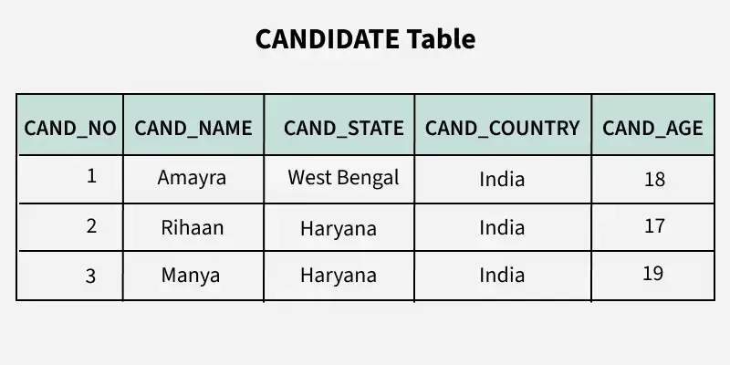
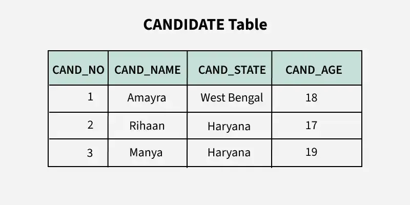
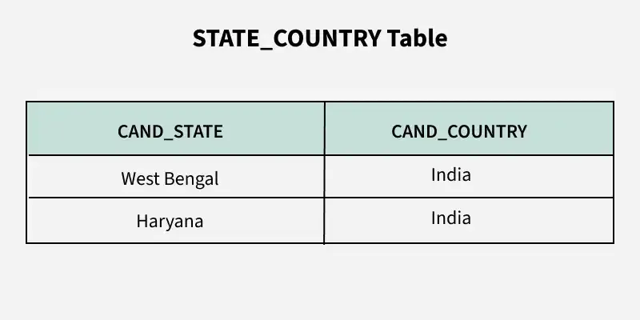

# Third Normal Form (3NF) trong DBMS

**Cập nhật lần cuối:** 25/07/2025

**Nguồn tham khảo:**  
- GeeksforGeeks: [Third Normal Form (3NF)](https://www.geeksforgeeks.org/dbms/third-normal-form-3nf/)
---

## 1. Mục tiêu bài giảng

Sau khi hoàn thành bài học này, người học có thể:

1. Trình bày được khái niệm **Third Normal Form (3NF)** trong DBMS.
2. Giải thích được mối quan hệ giữa **1NF**, **2NF** và **3NF**.
3. Nhận biết được **transitive dependency** trong một quan hệ.
4. Phân biệt được thuộc tính khóa, thuộc tính không khóa, prime attribute và non-prime attribute.
5. Kiểm tra được một phụ thuộc hàm có thỏa mãn điều kiện 3NF hay không.
6. Phân tích được một bảng có vi phạm 3NF hay không.
7. Biết cách phân rã một quan hệ để loại bỏ phụ thuộc bắc cầu.
8. Hiểu được lợi ích của 3NF trong việc giảm dư thừa dữ liệu và hạn chế bất thường dữ liệu.

---

## 2. Giới thiệu tổng quan

**Third Normal Form (3NF)** là dạng chuẩn thứ ba trong quá trình chuẩn hóa cơ sở dữ liệu quan hệ.

3NF được xây dựng dựa trên:

- **First Normal Form (1NF):** loại bỏ giá trị không nguyên tử và nhóm lặp.
- **Second Normal Form (2NF):** loại bỏ phụ thuộc bộ phận.
- **Third Normal Form (3NF):** loại bỏ phụ thuộc bắc cầu giữa các thuộc tính không khóa.

Một bảng đạt 3NF sẽ giảm được nhiều vấn đề dư thừa dữ liệu hơn so với bảng chỉ đạt 2NF.

Ngay cả khi một bảng đã đạt 2NF, nó vẫn có thể gặp các vấn đề như:

- Dữ liệu bị lặp.
- Khó cập nhật dữ liệu nhất quán.
- Mất dữ liệu không mong muốn khi xóa bản ghi.
- Không thể thêm một số thông tin nếu thiếu thông tin khác.

Nguyên nhân thường gặp là **transitive dependency**, tức phụ thuộc bắc cầu.

**Ví dụ quan hệ chưa đạt 3NF do phụ thuộc bắc cầu:**



---

### Quiz nhanh: Giới thiệu 3NF

**Câu 1.** 3NF được xây dựng dựa trên dạng chuẩn nào?

A. 1NF và 2NF  
B. Chỉ 5NF  
C. Chỉ BCNF  
D. Không cần dạng chuẩn trước đó  

**Câu 2.** 3NF chủ yếu loại bỏ loại phụ thuộc nào?

A. Phụ thuộc bộ phận  
B. Phụ thuộc bắc cầu  
C. Phụ thuộc đa trị  
D. Phụ thuộc nối  

**Câu 3.** Một bảng đạt 2NF có chắc chắn đạt 3NF không?

A. Có  
B. Không  
C. Luôn đạt BCNF  
D. Luôn đạt 5NF  

---

## 3. Điều kiện để bảng đạt Third Normal Form

Một quan hệ đạt **Third Normal Form (3NF)** nếu thỏa mãn hai điều kiện chính:

### 3.1. Bảng phải đạt 2NF

Điều này có nghĩa là bảng:

- Đã đạt 1NF.
- Không có phụ thuộc bộ phận.
- Mọi thuộc tính không khóa phụ thuộc vào toàn bộ khóa ứng viên, không phụ thuộc vào một phần của khóa ghép.

---

### 3.2. Không có phụ thuộc bắc cầu với thuộc tính không khóa

Bảng không được có trường hợp thuộc tính không khóa phụ thuộc vào một thuộc tính không khóa khác.

Nói đơn giản:

> Các thuộc tính không khóa phải phụ thuộc trực tiếp vào khóa, không nên phụ thuộc gián tiếp thông qua một thuộc tính không khóa khác.

Ví dụ không tốt:

```text
StudentID → DeptID
DeptID → DeptName
```

Suy ra:

```text
StudentID → DeptName
```

Ở đây, `DeptName` phụ thuộc vào `StudentID` thông qua `DeptID`. Đây là phụ thuộc bắc cầu.

---

### Quiz nhanh: Điều kiện đạt 3NF

**Câu 1.** Điều kiện nền tảng để xét 3NF là gì?

A. Bảng đã đạt 2NF  
B. Bảng đã đạt 5NF  
C. Bảng không có khóa  
D. Bảng chỉ có một thuộc tính  

**Câu 2.** Trong 3NF, thuộc tính không khóa không nên phụ thuộc vào đâu?

A. Thuộc tính không khóa khác  
B. Khóa chính  
C. Candidate key  
D. Super key  

**Câu 3.** `StudentID → DeptID` và `DeptID → DeptName` cho thấy vấn đề gì?

A. Phụ thuộc bắc cầu  
B. Phụ thuộc đa trị  
C. Phụ thuộc nối  
D. Giá trị không nguyên tử  

---

## 4. Transitive Dependency là gì?

### 4.1. Khái niệm

**Transitive dependency** hay **phụ thuộc bắc cầu** xảy ra khi một thuộc tính phụ thuộc gián tiếp vào khóa thông qua một thuộc tính khác.

Nếu có:

```text
A → B
B → C
```

thì ta có thể suy ra:

```text
A → C
```

Khi đó, `C` phụ thuộc bắc cầu vào `A` thông qua `B`.

---

### 4.2. Ý nghĩa trong cơ sở dữ liệu

Trong thiết kế cơ sở dữ liệu, nếu:

- `A` là khóa chính hoặc khóa ứng viên.
- `B` là thuộc tính không khóa.
- `C` là thuộc tính không khóa.
- `A → B` và `B → C`.

thì `C` đang phụ thuộc gián tiếp vào khóa thông qua một thuộc tính không khóa.

Điều này vi phạm 3NF vì thuộc tính không khóa không nên phụ thuộc vào thuộc tính không khóa khác.

---

### 4.3. Ví dụ trực quan

Xét bảng:

| StudentID | StudentName | DeptID | DeptName |
|---|---|---|---|
| 101 | An | D01 | Computer Science |
| 102 | Bình | D02 | Information Systems |
| 103 | Chi | D01 | Computer Science |

Các phụ thuộc hàm:

```text
StudentID → StudentName, DeptID
DeptID → DeptName
```

Từ đó suy ra:

```text
StudentID → DeptName
```

`DeptName` phụ thuộc vào `StudentID` thông qua `DeptID`, nên đây là phụ thuộc bắc cầu.

---

### 4.4. Vấn đề gây ra

Phụ thuộc bắc cầu có thể gây ra:

1. **Dữ liệu dư thừa**

   Tên khoa `Computer Science` bị lặp lại nhiều lần nếu nhiều sinh viên thuộc cùng khoa.

2. **Update anomaly**

   Nếu đổi tên khoa, phải cập nhật nhiều dòng.

3. **Insert anomaly**

   Không thể thêm một khoa mới nếu chưa có sinh viên thuộc khoa đó.

4. **Delete anomaly**

   Nếu xóa sinh viên cuối cùng của một khoa, có thể mất luôn thông tin về khoa đó.

---

### Quiz nhanh: Transitive Dependency

**Câu 1.** Phụ thuộc bắc cầu có dạng nào?

A. `A → B`, `B → C`, suy ra `A → C`  
B. `A → A`  
C. `A, B → A`  
D. `A → B` nhưng `B` không xác định gì khác  

**Câu 2.** Trong `StudentID → DeptID` và `DeptID → DeptName`, phụ thuộc bắc cầu là gì?

A. `DeptName → StudentID`  
B. `StudentID → DeptName`  
C. `DeptID → StudentID`  
D. `DeptName → DeptID`  

**Câu 3.** 3NF yêu cầu thuộc tính không khóa phải phụ thuộc như thế nào?

A. Phụ thuộc trực tiếp vào khóa, không phụ thuộc qua thuộc tính không khóa khác  
B. Phụ thuộc vào bất kỳ thuộc tính nào  
C. Chỉ phụ thuộc vào thuộc tính không khóa  
D. Không được phụ thuộc vào khóa  

---

## 5. Điều kiện 3NF theo phụ thuộc hàm

Một quan hệ `R` đạt **3NF** nếu với mọi phụ thuộc hàm không tầm thường:

```text
X → Y
```

ít nhất một trong hai điều kiện sau đúng:

1. `X` là **super key** của quan hệ.
2. Mỗi thuộc tính trong `Y` là **prime attribute**.

---

### 5.1. Super Key là gì?

**Super key** là một tập thuộc tính có thể xác định duy nhất mỗi dòng trong quan hệ.

Nếu:

```text
X+ = toàn bộ thuộc tính của R
```

thì `X` là super key.

---

### 5.2. Prime Attribute là gì?

**Prime attribute** là thuộc tính thuộc ít nhất một candidate key.

Ví dụ, nếu các candidate key là:

```text
A, E, CD, BC
```

thì các thuộc tính `A, B, C, D, E` đều là prime attributes vì mỗi thuộc tính xuất hiện trong ít nhất một candidate key.

---

### 5.3. Cách hiểu điều kiện 3NF

Với mỗi phụ thuộc hàm `X → Y`:

- Nếu `X` là super key, phụ thuộc này chấp nhận được trong 3NF.
- Nếu `X` không phải super key, nhưng `Y` là prime attribute, phụ thuộc này vẫn có thể chấp nhận được trong 3NF.
- Nếu `X` không phải super key và `Y` là non-prime attribute, quan hệ vi phạm 3NF.

---

### 5.4. So sánh điều kiện 3NF và BCNF

| Tiêu chí | 3NF | BCNF |
|---|---|---|
| Điều kiện với `X → Y` | `X` là super key hoặc `Y` là prime attribute | `X` bắt buộc phải là super key |
| Mức độ chặt chẽ | Ít chặt hơn | Chặt hơn |
| Bảo toàn phụ thuộc hàm | Thường tốt hơn | Không phải lúc nào |
| Dư thừa dữ liệu | Có thể còn một số dư thừa nhỏ | Ít hơn |

BCNF là dạng chuẩn mạnh hơn 3NF.

---

### Quiz nhanh: Điều kiện phụ thuộc hàm

**Câu 1.** Với phụ thuộc không tầm thường `X → Y`, 3NF chấp nhận nếu điều kiện nào đúng?

A. `X` là super key hoặc `Y` là prime attribute  
B. `X` luôn là non-prime attribute  
C. `Y` luôn là thuộc tính không khóa  
D. Không cần kiểm tra `X` và `Y`  

**Câu 2.** Prime attribute là gì?

A. Thuộc tính thuộc ít nhất một candidate key  
B. Thuộc tính không thuộc bất kỳ khóa nào  
C. Thuộc tính luôn nằm ngoài bảng  
D. Thuộc tính chỉ dùng trong 1NF  

**Câu 3.** BCNF khác 3NF ở điểm nào?

A. BCNF yêu cầu vế trái của mọi phụ thuộc không tầm thường phải là super key  
B. BCNF cho phép mọi phụ thuộc bắc cầu  
C. BCNF không dùng phụ thuộc hàm  
D. BCNF yếu hơn 3NF  

---

## 6. Ví dụ 1: Quan hệ CANDIDATE

### 6.1. Bảng CANDIDATE

Xét quan hệ `CANDIDATE` có các thuộc tính:

```text
CANDIDATE(CAND_NO, CAND_NAME, CAND_STATE, CAND_COUNTRY, CAND_AGE)
```

Ví dụ dữ liệu:

| CAND_NO | CAND_NAME | CAND_STATE | CAND_COUNTRY | CAND_AGE |
|---|---|---|---|---|
| C01 | An | California | USA | 25 |
| C02 | Bình | Texas | USA | 27 |
| C03 | Chi | Ontario | Canada | 24 |
| C04 | Dũng | London | UK | 29 |

---

### 6.2. Tập phụ thuộc hàm

Giả sử có các phụ thuộc hàm:

```text
CAND_NO → CAND_NAME
CAND_NO → CAND_STATE
CAND_STATE → CAND_COUNTRY
CAND_NO → CAND_AGE
```

Có thể viết gọn:

```text
CAND_NO → CAND_NAME, CAND_STATE, CAND_AGE
CAND_STATE → CAND_COUNTRY
```

---

### 6.3. Xác định candidate key

Ta tính bao đóng của `CAND_NO`:

```text
(CAND_NO)+ = {CAND_NO}
```

Áp dụng:

```text
CAND_NO → CAND_NAME, CAND_STATE, CAND_AGE
```

ta có:

```text
(CAND_NO)+ = {CAND_NO, CAND_NAME, CAND_STATE, CAND_AGE}
```

Vì đã có `CAND_STATE`, áp dụng:

```text
CAND_STATE → CAND_COUNTRY
```

ta được:

```text
(CAND_NO)+ = {CAND_NO, CAND_NAME, CAND_STATE, CAND_COUNTRY, CAND_AGE}
```

Bao đóng chứa toàn bộ thuộc tính của quan hệ.

Do đó:

```text
CAND_NO
```

là candidate key.

---

### 6.4. Xác định phụ thuộc bắc cầu

Ta có:

```text
CAND_NO → CAND_STATE
CAND_STATE → CAND_COUNTRY
```

Suy ra:

```text
CAND_NO → CAND_COUNTRY
```

`CAND_COUNTRY` phụ thuộc gián tiếp vào `CAND_NO` thông qua `CAND_STATE`.

Vì:

- `CAND_NO` là khóa.
- `CAND_STATE` là thuộc tính không khóa.
- `CAND_COUNTRY` là thuộc tính không khóa.

Nên đây là phụ thuộc bắc cầu và quan hệ chưa đạt 3NF.

---

## 7. Phân rã CANDIDATE về 3NF

### 7.1. Nguyên tắc phân rã

Để loại bỏ phụ thuộc bắc cầu:

- Giữ thuộc tính khóa và các thuộc tính phụ thuộc trực tiếp vào khóa trong bảng chính.
- Tách phụ thuộc giữa các thuộc tính không khóa sang bảng riêng.

---

### 7.2. Phân rã

Quan hệ ban đầu:

```text
CANDIDATE(CAND_NO, CAND_NAME, CAND_STATE, CAND_COUNTRY, CAND_AGE)
```

Tách thành hai quan hệ:

```text
CANDIDATE(CAND_NO, CAND_NAME, CAND_STATE, CAND_AGE)
STATE_COUNTRY(CAND_STATE, CAND_COUNTRY)
```

---

### 7.3. Bảng sau phân rã

**CANDIDATE**



| CAND_NO | CAND_NAME | CAND_STATE | CAND_AGE |
|---|---|---|---|
| C01 | An | California | 25 |
| C02 | Bình | Texas | 27 |
| C03 | Chi | Ontario | 24 |
| C04 | Dũng | London | 29 |

**STATE_COUNTRY**



| CAND_STATE | CAND_COUNTRY |
|---|---|
| California | USA |
| Texas | USA |
| Ontario | Canada |
| London | UK |

---

### 7.4. Vì sao phân rã này đạt 3NF?

Trong bảng `CANDIDATE`:

```text
CAND_NO → CAND_NAME, CAND_STATE, CAND_AGE
```

`CAND_NO` là khóa, nên các thuộc tính phụ thuộc trực tiếp vào khóa.

Trong bảng `STATE_COUNTRY`:

```text
CAND_STATE → CAND_COUNTRY
```

`CAND_STATE` là khóa của bảng `STATE_COUNTRY`.

Không còn phụ thuộc bắc cầu trong cùng một bảng.

---

### 7.5. Lợi ích sau phân rã

Sau khi phân rã:

- `CAND_COUNTRY` không bị lặp lại quá nhiều trong bảng ứng viên.
- Nếu cần sửa quốc gia ứng với một bang/tỉnh, chỉ cần sửa trong bảng `STATE_COUNTRY`.
- Giảm rủi ro dữ liệu không nhất quán.
- Thiết kế rõ ràng hơn.

---

### Quiz nhanh: Ví dụ CANDIDATE

**Câu 1.** Candidate key của quan hệ `CANDIDATE` là gì?

A. `CAND_NO`  
B. `CAND_NAME`  
C. `CAND_COUNTRY`  
D. `CAND_AGE`  

**Câu 2.** Phụ thuộc nào tạo ra phụ thuộc bắc cầu?

A. `CAND_NO → CAND_NAME` và `CAND_NAME → CAND_AGE`  
B. `CAND_NO → CAND_STATE` và `CAND_STATE → CAND_COUNTRY`  
C. `CAND_AGE → CAND_NO`  
D. `CAND_COUNTRY → CAND_NO`  

**Câu 3.** Quan hệ nào được tách ra để xử lý `CAND_STATE → CAND_COUNTRY`?

A. `STATE_COUNTRY(CAND_STATE, CAND_COUNTRY)`  
B. `AGE_COUNTRY(CAND_AGE, CAND_COUNTRY)`  
C. `NAME_STATE(CAND_NAME, CAND_STATE)`  
D. `COUNTRY_NO(CAND_COUNTRY, CAND_NO)`  

---

## 8. Ví dụ 2: Quan hệ R(A, B, C, D, E)

### 8.1. Đề bài

Xét quan hệ:

```text
R(A, B, C, D, E)
```

với tập phụ thuộc hàm:

```text
A → BC
CD → E
B → D
E → A
```

Cần kiểm tra quan hệ này có đạt 3NF hay không.

---

### 8.2. Candidate keys

Các candidate key của quan hệ là:

```text
A
E
CD
BC
```

Giải thích ngắn:

- `A+ = {A, B, C, D, E}` nên `A` là candidate key.
- `E+ = {E, A, B, C, D}` nên `E` là candidate key.
- `(CD)+ = {C, D, E, A, B}` nên `CD` là candidate key.
- `(BC)+ = {B, C, D, E, A}` nên `BC` là candidate key.

---

### 8.3. Prime attributes

Vì các candidate key là:

```text
A, E, CD, BC
```

nên các thuộc tính thuộc ít nhất một candidate key là:

```text
A, B, C, D, E
```

Tất cả các thuộc tính đều là prime attributes.

---

### 8.4. Kiểm tra từng phụ thuộc hàm

Xét các phụ thuộc:

```text
A → BC
CD → E
B → D
E → A
```

- `A → BC`: `A` là candidate key, nên thỏa 3NF.
- `CD → E`: `CD` là candidate key, nên thỏa 3NF.
- `B → D`: `B` không phải super key, nhưng `D` là prime attribute, nên vẫn thỏa 3NF.
- `E → A`: `E` là candidate key, nên thỏa 3NF.

---

### 8.5. Kết luận

Quan hệ:

```text
R(A, B, C, D, E)
```

đạt 3NF vì với mọi phụ thuộc hàm `X → Y`, hoặc `X` là super key, hoặc `Y` là prime attribute.

Quan hệ này không vi phạm 3NF.

---

### Quiz nhanh: Quan hệ R(A, B, C, D, E)

**Câu 1.** Trong ví dụ quan hệ `R`, các thuộc tính nào là prime attributes?

A. Tất cả `A, B, C, D, E`  
B. Chỉ `A`  
C. Chỉ `D`  
D. Không có thuộc tính nào  

**Câu 2.** Vì sao phụ thuộc `B → D` vẫn thỏa 3NF trong ví dụ này?

A. Vì `D` là prime attribute  
B. Vì `B` không xuất hiện trong quan hệ  
C. Vì `D` là non-prime attribute  
D. Vì mọi phụ thuộc đều bị cấm trong 3NF  

**Câu 3.** Quan hệ `R(A, B, C, D, E)` trong ví dụ được kết luận như thế nào?

A. Đạt 3NF  
B. Vi phạm 1NF  
C. Vi phạm do không có thuộc tính prime  
D. Luôn vi phạm 5NF  

---

## 9. Vì sao 3NF quan trọng?

### 9.1. Loại bỏ dư thừa dữ liệu

3NF giúp loại bỏ các dữ liệu bị lặp do phụ thuộc bắc cầu.

Ví dụ, nếu `DeptID → DeptName`, thì không cần lưu `DeptName` lặp lại trong bảng sinh viên.

---

### 9.2. Hạn chế bất thường dữ liệu

Bảng đạt 3NF giúp giảm:

1. **Insertion anomaly**

   Có thể thêm dữ liệu về khoa mà không cần có sinh viên thuộc khoa đó.

2. **Update anomaly**

   Khi sửa tên khoa, chỉ cần sửa một dòng trong bảng khoa.

3. **Deletion anomaly**

   Xóa sinh viên không làm mất thông tin về khoa.

---

### 9.3. Bảo toàn phụ thuộc hàm

Khi phân rã về 3NF, ta thường cố gắng bảo toàn các phụ thuộc hàm quan trọng để vẫn có thể kiểm tra ràng buộc dữ liệu dễ dàng.

---

### 9.4. Phân rã không mất thông tin

Phân rã về 3NF cần đảm bảo **lossless decomposition**, tức là khi nối các bảng con lại, ta khôi phục được dữ liệu ban đầu mà không mất thông tin và không sinh ra dữ liệu sai.

---

## 10. 3NF và các bất thường dữ liệu

### 10.1. Insert Anomaly

Trong bảng chưa đạt 3NF, nếu thông tin khoa chỉ nằm trong bảng sinh viên, ta không thể thêm một khoa mới nếu chưa có sinh viên nào thuộc khoa đó.

Sau khi tách bảng khoa riêng, ta có thể thêm khoa mới dễ dàng.

---

### 10.2. Update Anomaly

Nếu tên quốc gia hoặc tên khoa bị lặp ở nhiều dòng, khi cập nhật phải sửa nhiều nơi.

Sau khi đạt 3NF, thông tin đó chỉ nằm ở một bảng riêng.

---

### 10.3. Delete Anomaly

Nếu xóa bản ghi cuối cùng liên quan đến một giá trị trung gian, ta có thể mất luôn thông tin phụ thuộc.

Ví dụ, xóa ứng viên cuối cùng ở `California` có thể làm mất thông tin rằng `California` thuộc `USA` nếu không có bảng `STATE_COUNTRY`.

---

### Quiz nhanh: Lợi ích và bất thường dữ liệu

**Câu 1.** 3NF giúp giảm dư thừa do loại phụ thuộc nào?

A. Phụ thuộc bắc cầu  
B. Phụ thuộc đa trị  
C. Phụ thuộc nối  
D. Giá trị không nguyên tử  

**Câu 2.** Update anomaly xảy ra khi nào?

A. Một thông tin lặp lại ở nhiều dòng và phải sửa nhiều nơi  
B. Mỗi bảng có khóa chính  
C. Mỗi ô chứa một giá trị  
D. Bảng đã tách đúng về 3NF  

**Câu 3.** Phân rã không mất thông tin nghĩa là gì?

A. Nối các bảng con lại khôi phục được dữ liệu ban đầu đúng đắn  
B. Xóa hết mọi khóa ngoại  
C. Không cần phụ thuộc hàm  
D. Chỉ giữ lại một bảng duy nhất  

---

## 11. Hạn chế và lưu ý khi dùng 3NF

### 11.1. 3NF không phải dạng chuẩn cao nhất

Một bảng đạt 3NF vẫn có thể chưa đạt BCNF.

BCNF có điều kiện chặt hơn: với mọi phụ thuộc hàm không tầm thường `X → Y`, `X` phải là super key.

---

### 11.2. Phân rã quá nhiều có thể làm truy vấn phức tạp

Chuẩn hóa giúp giảm dư thừa, nhưng nếu tách quá nhiều bảng, truy vấn có thể cần nhiều phép `JOIN`.

Vì vậy, trong thực tế cần cân bằng giữa:

- Tính toàn vẹn dữ liệu.
- Hiệu năng truy vấn.
- Độ phức tạp của hệ thống.

---

### 11.3. 3NF thường phù hợp với hệ thống giao dịch

Các hệ thống như quản lý sinh viên, ngân hàng, bán hàng, ERP thường cần dữ liệu nhất quán, nên 3NF là mục tiêu thiết kế phổ biến.

---

## 12. 3NF trong quy trình chuẩn hóa

| Dạng chuẩn | Mục tiêu chính |
|---|---|
| 1NF | Loại bỏ giá trị không nguyên tử và nhóm lặp |
| 2NF | Loại bỏ phụ thuộc bộ phận |
| 3NF | Loại bỏ phụ thuộc bắc cầu |
| BCNF | Mọi determinant là super key |
| 4NF | Loại bỏ phụ thuộc đa trị |
| 5NF | Loại bỏ phụ thuộc nối |

3NF là một trong những dạng chuẩn quan trọng nhất trong thiết kế cơ sở dữ liệu quan hệ.

---

### Quiz nhanh: Hạn chế và vị trí của 3NF

**Câu 1.** Một bảng đạt 3NF vẫn có thể chưa đạt dạng chuẩn nào?

A. BCNF  
B. 1NF  
C. 2NF  
D. Không dạng chuẩn nào  

**Câu 2.** Tách quá nhiều bảng có thể gây vấn đề gì?

A. Truy vấn cần nhiều phép `JOIN` hơn  
B. Không thể dùng khóa chính  
C. Mọi dữ liệu đều tự động sai  
D. Không thể đạt 1NF  

**Câu 3.** 3NF thường phù hợp với loại hệ thống nào?

A. Hệ thống giao dịch cần dữ liệu nhất quán  
B. Hệ thống không lưu dữ liệu  
C. Hệ thống chỉ xử lý ảnh  
D. Hệ thống không có bảng  

---

## 13. Quy trình kiểm tra bảng có đạt 3NF không

Để kiểm tra một bảng có đạt 3NF hay không, có thể làm theo các bước sau:

1. **Kiểm tra 2NF**

   Bảng đã đạt 1NF và không có phụ thuộc bộ phận chưa?

2. **Xác định candidate key**

   Tìm các khóa ứng viên của quan hệ.

3. **Xác định prime và non-prime attributes**

   Thuộc tính thuộc candidate key là prime attribute. Thuộc tính không thuộc candidate key là non-prime attribute.

4. **Liệt kê các phụ thuộc hàm**

   Viết rõ các phụ thuộc hàm có trong quan hệ.

5. **Kiểm tra từng phụ thuộc `X → Y`**

   Với mỗi phụ thuộc không tầm thường, kiểm tra:
   - `X` có phải super key không?
   - Nếu không, `Y` có phải prime attribute không?

6. **Tìm phụ thuộc bắc cầu**

   Đặc biệt chú ý các dạng:
   
   ```text
   Key → Non-prime attribute
   Non-prime attribute → Non-prime attribute
   ```

7. **Kết luận**

   Nếu có phụ thuộc làm `X` không là super key và `Y` không là prime attribute, quan hệ chưa đạt 3NF.

8. **Phân rã nếu cần**

   Tách các phụ thuộc bắc cầu sang bảng riêng.

---

### Quiz nhanh: Quy trình kiểm tra 3NF

**Câu 1.** Bước đầu tiên khi kiểm tra 3NF là gì?

A. Kiểm tra bảng đã đạt 2NF chưa  
B. Xóa toàn bộ phụ thuộc hàm  
C. Gộp tất cả bảng thành một bảng  
D. Bỏ qua candidate key  

**Câu 2.** Khi kiểm tra `X → Y`, nếu `X` không là super key thì cần xét điều gì?

A. `Y` có phải prime attribute không  
B. `Y` có phải tên bảng không  
C. `X` có phải giá trị số không  
D. `X` có nằm cuối bảng không  

**Câu 3.** Dạng phụ thuộc nào cần chú ý đặc biệt khi kiểm tra 3NF?

A. `Key → Non-prime`, `Non-prime → Non-prime`  
B. `A → A`  
C. Giá trị nguyên tử  
D. Nhóm lặp trong một ô  

---

## 14. So sánh 2NF, 3NF và BCNF

| Tiêu chí | 2NF | 3NF | BCNF |
|---|---|---|---|
| Điều kiện trước | Đạt 1NF | Đạt 2NF | Thường xét sau 3NF |
| Vấn đề xử lý | Partial dependency | Transitive dependency | Determinant không phải super key |
| Điều kiện chính | Non-prime attribute phụ thuộc toàn bộ khóa ghép | `X` là super key hoặc `Y` là prime attribute | `X` phải là super key |
| Mức độ chặt chẽ | Thấp hơn 3NF | Thấp hơn BCNF | Chặt hơn 3NF |
| Ví dụ vi phạm | `CourseID → CourseFee` | `DeptID → DeptName` trong bảng sinh viên | `CourseID → Instructor` khi CourseID không là super key |

---

### Quiz nhanh: So sánh 2NF, 3NF và BCNF

**Câu 1.** 2NF xử lý vấn đề chính nào?

A. Partial dependency  
B. Transitive dependency  
C. Multivalued dependency  
D. Join dependency  

**Câu 2.** 3NF xử lý vấn đề chính nào?

A. Transitive dependency  
B. Giá trị không nguyên tử  
C. Phụ thuộc đa trị  
D. Phụ thuộc nối  

**Câu 3.** BCNF chặt hơn 3NF vì yêu cầu gì?

A. Mọi determinant trong phụ thuộc không tầm thường phải là super key  
B. Mọi bảng chỉ có một dòng  
C. Mọi thuộc tính đều là non-prime  
D. Mọi ô chứa nhiều giá trị  

---

## 15. Câu hỏi ôn tập

### 15.1. Câu hỏi trắc nghiệm

**Câu 1.** Một bảng đạt 3NF khi nào?

A. Đạt 2NF và không có phụ thuộc bắc cầu với thuộc tính không khóa  
B. Chỉ cần đạt 1NF  
C. Chỉ cần có khóa chính  
D. Không có phụ thuộc đa trị  

---

**Câu 2.** Phụ thuộc bắc cầu có dạng nào?

A. `A → B`, `B → C`, suy ra `A → C`  
B. `A → A`  
C. `A, B → A`  
D. `A → B` và `C → D` không liên quan  

---

**Câu 3.** Với phụ thuộc không tầm thường `X → Y`, điều kiện 3NF yêu cầu gì?

A. `X` là super key hoặc `Y` là prime attribute  
B. `X` luôn là thuộc tính không khóa  
C. `Y` luôn là non-prime attribute  
D. Không cần kiểm tra gì  

---

**Câu 4.** Trong ví dụ `CAND_NO → CAND_STATE` và `CAND_STATE → CAND_COUNTRY`, phụ thuộc bắc cầu là gì?

A. `CAND_NO → CAND_COUNTRY`  
B. `CAND_COUNTRY → CAND_NO`  
C. `CAND_NAME → CAND_AGE`  
D. `CAND_AGE → CAND_STATE`  

---

**Câu 5.** Quan hệ `CANDIDATE` nên được tách thành những bảng nào để đạt 3NF?

A. `CANDIDATE` và `STATE_COUNTRY`  
B. `AGE_NAME` và `COUNTRY_NO`  
C. `STATE_AGE` và `NAME_COUNTRY`  
D. Không cần bảng nào  

---

**Câu 6.** 3NF giúp hạn chế vấn đề nào?

A. Insert, update, delete anomalies  
B. Lỗi cú pháp Python  
C. Lỗi mạng máy tính  
D. Lỗi giao diện người dùng  

---

**Câu 7.** BCNF khác 3NF ở điểm nào?

A. BCNF yêu cầu vế trái của mọi phụ thuộc không tầm thường phải là super key  
B. BCNF không dùng phụ thuộc hàm  
C. BCNF chỉ xử lý giá trị không nguyên tử  
D. BCNF yếu hơn 3NF  

---

**Câu 8.** Nếu tất cả thuộc tính đều là prime attributes, một số phụ thuộc có vế trái không phải super key vẫn có thể thỏa dạng chuẩn nào?

A. 3NF  
B. 1NF  
C. Không dạng chuẩn nào  
D. 5NF  

---

**Câu 9.** Phân rã không mất thông tin nghĩa là gì?

A. Nối các bảng con lại khôi phục được dữ liệu ban đầu đúng đắn  
B. Xóa hết dữ liệu trùng  
C. Không cần khóa chính  
D. Không cần phụ thuộc hàm  

---

**Câu 10.** 3NF thường được dùng nhiều trong loại hệ thống nào?

A. Hệ thống giao dịch cần dữ liệu nhất quán  
B. Hệ thống không cần lưu dữ liệu  
C. Hệ thống chỉ xử lý ảnh  
D. Hệ thống không có bảng  

---

### 15.2. Câu hỏi tự luận ngắn

**Câu 1.** Trình bày khái niệm Third Normal Form.

---

**Câu 2.** Phụ thuộc bắc cầu là gì? Cho ví dụ.

---

**Câu 3.** Vì sao quan hệ `CANDIDATE(CAND_NO, CAND_NAME, CAND_STATE, CAND_COUNTRY, CAND_AGE)` chưa đạt 3NF nếu có `CAND_STATE → CAND_COUNTRY`?

---

**Câu 4.** Trình bày điều kiện 3NF theo phụ thuộc hàm `X → Y`.

---

**Câu 5.** So sánh 3NF và BCNF.

---

## 16. Bài tập vận dụng

### Bài tập 1

Cho quan hệ:

```text
STUDENT(StudentID, StudentName, DeptID, DeptName)
```

và các phụ thuộc hàm:

```text
StudentID → StudentName, DeptID
DeptID → DeptName
```

**Yêu cầu:**  

1. Xác định candidate key.
2. Xác định phụ thuộc bắc cầu.
3. Tách bảng về 3NF.

---

### Bài tập 2

Cho quan hệ:

```text
CANDIDATE(CAND_NO, CAND_NAME, CAND_STATE, CAND_COUNTRY, CAND_AGE)
```

với phụ thuộc hàm:

```text
CAND_NO → CAND_NAME, CAND_STATE, CAND_AGE
CAND_STATE → CAND_COUNTRY
```

**Yêu cầu:**  
Phân tích vì sao quan hệ chưa đạt 3NF và phân rã về 3NF.

---

### Bài tập 3

Cho quan hệ:

```text
R(A, B, C, D, E)
```

với phụ thuộc hàm:

```text
A → BC
CD → E
B → D
E → A
```

Biết candidate keys là:

```text
A, E, CD, BC
```

**Yêu cầu:**  
Kiểm tra quan hệ có đạt 3NF không.

---

### Bài tập 4

Cho quan hệ:

```text
EMPLOYEE(EmpID, EmpName, DeptID, DeptName, DeptLocation)
```

với phụ thuộc hàm:

```text
EmpID → EmpName, DeptID
DeptID → DeptName, DeptLocation
```

**Yêu cầu:**  

1. Xác định phụ thuộc bắc cầu.
2. Cho biết quan hệ có đạt 3NF không.
3. Tách bảng về 3NF.

---

### Bài tập 5

Cho quan hệ:

```text
ORDER(OrderID, CustomerID, CustomerName, CustomerPhone)
```

với phụ thuộc hàm:

```text
OrderID → CustomerID
CustomerID → CustomerName, CustomerPhone
```

**Yêu cầu:**  
Xác định phụ thuộc bắc cầu và đề xuất thiết kế đạt 3NF.

---

## 17. Tóm tắt bài học

- Third Normal Form là dạng chuẩn thứ ba trong chuẩn hóa cơ sở dữ liệu.
- Một bảng đạt 3NF nếu đã đạt 2NF và không có phụ thuộc bắc cầu với thuộc tính không khóa.
- Phụ thuộc bắc cầu xảy ra khi `A → B`, `B → C`, từ đó suy ra `A → C`.
- Theo điều kiện phụ thuộc hàm, với mọi `X → Y`, quan hệ đạt 3NF nếu `X` là super key hoặc `Y` là prime attribute.
- 3NF giúp loại bỏ dư thừa dữ liệu do thuộc tính không khóa phụ thuộc vào thuộc tính không khóa khác.
- Ví dụ `CAND_NO → CAND_STATE` và `CAND_STATE → CAND_COUNTRY` tạo ra phụ thuộc bắc cầu `CAND_NO → CAND_COUNTRY`.
- Để chuyển về 3NF, ta thường tách phụ thuộc giữa các thuộc tính không khóa sang bảng riêng.
- Phân rã về 3NF nên đảm bảo không mất thông tin và cố gắng bảo toàn phụ thuộc hàm.
- 3NF giúp hạn chế insert, update và delete anomalies.
- BCNF là dạng chuẩn chặt hơn 3NF.

---

## 18. Từ khóa chính

- Third Normal Form
- 3NF
- Normalization
- First Normal Form
- 1NF
- Second Normal Form
- 2NF
- Functional Dependency
- Transitive Dependency
- Super Key
- Candidate Key
- Prime Attribute
- Non-prime Attribute
- Lossless Decomposition
- Dependency Preservation
- Insert Anomaly
- Update Anomaly
- Delete Anomaly
- BCNF

---

## 19. Đáp án và gợi ý trả lời

### Quiz nhanh: Giới thiệu 3NF

- **Câu 1.** A
- **Câu 2.** B
- **Câu 3.** B

### Quiz nhanh: Điều kiện đạt 3NF

- **Câu 1.** A
- **Câu 2.** A
- **Câu 3.** A

### Quiz nhanh: Transitive Dependency

- **Câu 1.** A
- **Câu 2.** B
- **Câu 3.** A

### Quiz nhanh: Điều kiện phụ thuộc hàm

- **Câu 1.** A
- **Câu 2.** A
- **Câu 3.** A

### Quiz nhanh: Ví dụ CANDIDATE

- **Câu 1.** A
- **Câu 2.** B
- **Câu 3.** A

### Quiz nhanh: Quan hệ R(A, B, C, D, E)

- **Câu 1.** A
- **Câu 2.** A
- **Câu 3.** A

### Quiz nhanh: Lợi ích và bất thường dữ liệu

- **Câu 1.** A
- **Câu 2.** A
- **Câu 3.** A

### Quiz nhanh: Hạn chế và vị trí của 3NF

- **Câu 1.** A
- **Câu 2.** A
- **Câu 3.** A

### Quiz nhanh: Quy trình kiểm tra 3NF

- **Câu 1.** A
- **Câu 2.** A
- **Câu 3.** A

### Quiz nhanh: So sánh 2NF, 3NF và BCNF

- **Câu 1.** A
- **Câu 2.** A
- **Câu 3.** A

---

### Câu hỏi ôn tập - Trắc nghiệm

- **Câu 1.** A
- **Câu 2.** A
- **Câu 3.** A
- **Câu 4.** A
- **Câu 5.** A
- **Câu 6.** A
- **Câu 7.** A
- **Câu 8.** A
- **Câu 9.** A
- **Câu 10.** A

---

### Câu hỏi ôn tập - Tự luận ngắn

#### Câu 1

**Gợi ý trả lời:**  
Third Normal Form là dạng chuẩn yêu cầu quan hệ đã đạt 2NF và không có phụ thuộc bắc cầu giữa các thuộc tính không khóa. Mọi thuộc tính không khóa nên phụ thuộc trực tiếp vào khóa.

#### Câu 2

**Gợi ý trả lời:**  
Phụ thuộc bắc cầu xảy ra khi `A → B` và `B → C`, suy ra `A → C`. Ví dụ: `StudentID → DeptID`, `DeptID → DeptName`, suy ra `StudentID → DeptName`.

#### Câu 3

**Gợi ý trả lời:**  
Vì `CAND_NO → CAND_STATE` và `CAND_STATE → CAND_COUNTRY`, nên `CAND_COUNTRY` phụ thuộc gián tiếp vào khóa `CAND_NO` thông qua `CAND_STATE`. Đây là phụ thuộc bắc cầu.

#### Câu 4

**Gợi ý trả lời:**  
Với mọi phụ thuộc hàm không tầm thường `X → Y`, quan hệ đạt 3NF nếu `X` là super key hoặc mọi thuộc tính trong `Y` là prime attribute.

#### Câu 5

**Gợi ý trả lời:**  
BCNF chặt hơn 3NF. Trong 3NF, phụ thuộc `X → Y` vẫn có thể được chấp nhận nếu `Y` là prime attribute dù `X` không phải super key. Trong BCNF, `X` bắt buộc phải là super key.

---

### Bài tập vận dụng

#### Bài tập 1

**Gợi ý trả lời:**

Candidate key:

```text
StudentID
```

Phụ thuộc bắc cầu:

```text
StudentID → DeptID
DeptID → DeptName
```

suy ra:

```text
StudentID → DeptName
```

Tách thành:

**STUDENT**

| StudentID | StudentName | DeptID |
|---|---|---|
| Ví dụ | Ví dụ | Ví dụ |

**DEPARTMENT**

| DeptID | DeptName |
|---|---|
| Ví dụ | Ví dụ |

---

#### Bài tập 2

**Gợi ý trả lời:**

Candidate key:

```text
CAND_NO
```

Phụ thuộc bắc cầu:

```text
CAND_NO → CAND_STATE
CAND_STATE → CAND_COUNTRY
```

suy ra:

```text
CAND_NO → CAND_COUNTRY
```

Phân rã:

```text
CANDIDATE(CAND_NO, CAND_NAME, CAND_STATE, CAND_AGE)
STATE_COUNTRY(CAND_STATE, CAND_COUNTRY)
```

---

#### Bài tập 3

**Gợi ý trả lời:**

Candidate keys:

```text
A, E, CD, BC
```

Vì mọi thuộc tính `A, B, C, D, E` đều là prime attributes, nên các phụ thuộc:

```text
A → BC
CD → E
B → D
E → A
```

đều thỏa điều kiện 3NF.

Quan hệ đạt 3NF.

---

#### Bài tập 4

**Gợi ý trả lời:**

Candidate key:

```text
EmpID
```

Phụ thuộc bắc cầu:

```text
EmpID → DeptID
DeptID → DeptName, DeptLocation
```

suy ra:

```text
EmpID → DeptName, DeptLocation
```

Quan hệ chưa đạt 3NF.

Tách thành:

**EMPLOYEE**

| EmpID | EmpName | DeptID |
|---|---|---|
| Ví dụ | Ví dụ | Ví dụ |

**DEPARTMENT**

| DeptID | DeptName | DeptLocation |
|---|---|---|
| Ví dụ | Ví dụ | Ví dụ |

---

#### Bài tập 5

**Gợi ý trả lời:**

Phụ thuộc bắc cầu:

```text
OrderID → CustomerID
CustomerID → CustomerName, CustomerPhone
```

suy ra:

```text
OrderID → CustomerName, CustomerPhone
```

Tách thành:

**ORDERS**

| OrderID | CustomerID |
|---|---|
| Ví dụ | Ví dụ |

**CUSTOMERS**

| CustomerID | CustomerName | CustomerPhone |
|---|---|---|
| Ví dụ | Ví dụ | Ví dụ |

---
