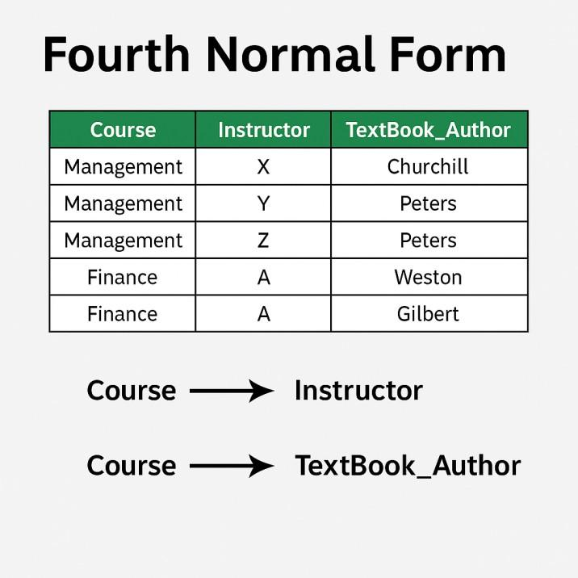

# Fourth Normal Form (4NF) trong DBMS

**Cập nhật lần cuối:** 25/07/2025

**Nguồn tham khảo:**  
- GeeksforGeeks: [4th Normal Form in DBMS](https://www.geeksforgeeks.org/dbms/introduction-of-4th-and-5th-normal-form-in-dbms/)
---

## 1. Mục tiêu bài giảng

Sau khi hoàn thành bài học này, người học có thể:

1. Trình bày được khái niệm **Fourth Normal Form (4NF)** trong DBMS.
2. Giải thích được **multivalued dependency** và ký hiệu `X →→ Y`.
3. Phân biệt được **functional dependency** và **multivalued dependency**.
4. Nhận biết được bảng có nhiều quan hệ một-nhiều độc lập.
5. Phân tích được vì sao một bảng vi phạm 4NF.
6. Tách được bảng vi phạm 4NF thành các bảng nhỏ hơn.
7. Hiểu được lợi ích của phân rã 4NF trong việc giảm dư thừa dữ liệu và hạn chế bất thường dữ liệu.

---

## 2. Giới thiệu tổng quan

Khi cơ sở dữ liệu ngày càng phức tạp, việc chuẩn hóa dữ liệu trở nên rất quan trọng. Các dạng chuẩn như 1NF, 2NF, 3NF và BCNF giúp xử lý nhiều vấn đề về dư thừa dữ liệu và phụ thuộc hàm.

Tuy nhiên, có những bảng không vi phạm phụ thuộc hàm thông thường nhưng vẫn bị dư thừa dữ liệu do tồn tại **phụ thuộc đa trị**.

**Fourth Normal Form (4NF)** là dạng chuẩn dùng để xử lý các vấn đề do **multivalued dependency** gây ra.

4NF giúp loại bỏ trường hợp một bảng chứa nhiều quan hệ một-nhiều độc lập trong cùng một bảng.

Ví dụ:

- Một khóa học có nhiều giảng viên.
- Một khóa học có nhiều tác giả sách giáo trình.
- Giảng viên và tác giả sách giáo trình không phụ thuộc vào nhau.

Nếu lưu cả giảng viên và tác giả sách trong cùng một bảng, ta có thể tạo ra nhiều tổ hợp dư thừa.

**Minh họa phụ thuộc đa trị trong 4NF:**



---

## 3. Ôn lại các dạng chuẩn trước 4NF

Trước khi học 4NF, cần nhớ các dạng chuẩn sau:

| Dạng chuẩn | Mục tiêu chính |
|---|---|
| 1NF | Loại bỏ giá trị không nguyên tử và nhóm lặp |
| 2NF | Loại bỏ phụ thuộc bộ phận |
| 3NF | Loại bỏ phụ thuộc bắc cầu |
| BCNF | Mọi determinant trong phụ thuộc hàm không tầm thường phải là super key |
| 4NF | Loại bỏ phụ thuộc đa trị không hợp lý |

4NF thường được xét sau khi bảng đã đạt **BCNF**.

---

### Quiz nhanh: Tổng quan

**Câu 1.** 4NF chủ yếu xử lý loại phụ thuộc nào?

A. Phụ thuộc bộ phận  
B. Phụ thuộc bắc cầu  
C. Phụ thuộc đa trị  
D. Phụ thuộc nối  

**Câu 2.** Trước khi xét 4NF, bảng thường cần đạt dạng chuẩn nào?

A. 1NF  
B. 2NF  
C. BCNF  
D. 5NF  

**Câu 3.** 4NF giúp loại bỏ vấn đề gì?

A. Dữ liệu dư thừa do nhiều quan hệ một-nhiều độc lập trong cùng bảng  
B. Lỗi cú pháp SQL  
C. Thiếu khóa ngoại trong mọi bảng  
D. Không thể tạo bảng mới  

---

## 4. Multivalued Dependency là gì?

### 4.1. Khái niệm

**Multivalued dependency** hay **phụ thuộc đa trị** xảy ra khi một giá trị của thuộc tính `X` xác định một tập nhiều giá trị của thuộc tính `Y`, và tập giá trị này độc lập với các thuộc tính khác trong quan hệ.

Ký hiệu:

```text
X →→ Y
```

Đọc là:

```text
X xác định đa trị Y
```

Hoặc:

```text
Y phụ thuộc đa trị vào X
```

---

### 4.2. Điều kiện trực quan

Một phụ thuộc đa trị thường xuất hiện khi:

1. Bảng có ít nhất ba thuộc tính.
2. Một thuộc tính `X` liên quan đến nhiều giá trị của `Y`.
3. Cùng thuộc tính `X` cũng liên quan đến nhiều giá trị của `Z`.
4. `Y` và `Z` độc lập với nhau.

Ví dụ:

```text
Course →→ Instructor
Course →→ TextBook_Author
```

Trong đó:

- Một khóa học có nhiều giảng viên.
- Một khóa học có nhiều tác giả sách.
- Giảng viên và tác giả sách là hai nhóm thông tin độc lập.

---

### 4.3. Ví dụ đơn giản

Giả sử khóa học `Management` có:

- Giảng viên: `X`, `Y`, `Z`
- Tác giả sách: `Churchill`, `Peters`

Nếu lưu trong một bảng có ba cột:

```text
Course, Instructor, TextBook_Author
```

ta có thể phải lưu mọi tổ hợp:

| Course | Instructor | TextBook_Author |
|---|---|---|
| Management | X | Churchill |
| Management | X | Peters |
| Management | Y | Churchill |
| Management | Y | Peters |
| Management | Z | Churchill |
| Management | Z | Peters |

Có `3 × 2 = 6` dòng, mặc dù giảng viên và tác giả sách không liên quan trực tiếp với nhau.

---

## 5. Functional Dependency và Multivalued Dependency

### 5.1. Functional Dependency

Phụ thuộc hàm có dạng:

```text
X → Y
```

Nghĩa là mỗi giá trị của `X` xác định duy nhất một giá trị của `Y`.

Ví dụ:

```text
CourseID → CourseName
```

Một mã khóa học xác định duy nhất tên khóa học.

---

### 5.2. Multivalued Dependency

Phụ thuộc đa trị có dạng:

```text
X →→ Y
```

Nghĩa là một giá trị của `X` xác định một tập nhiều giá trị của `Y`.

Ví dụ:

```text
Course →→ Instructor
```

Một khóa học có thể có nhiều giảng viên.

---

### 5.3. So sánh

| Tiêu chí | Functional Dependency | Multivalued Dependency |
|---|---|---|
| Ký hiệu | `X → Y` | `X →→ Y` |
| Ý nghĩa | `X` xác định duy nhất `Y` | `X` xác định một tập giá trị của `Y` |
| Số giá trị của `Y` với mỗi `X` | Một | Nhiều |
| Ví dụ | `CourseID → CourseName` | `Course →→ Instructor` |
| Dạng chuẩn liên quan | 2NF, 3NF, BCNF | 4NF |

---

### Quiz nhanh: Functional Dependency và Multivalued Dependency

**Câu 1.** Phụ thuộc hàm `X → Y` có ý nghĩa gì?

A. Mỗi `X` xác định duy nhất một `Y`  
B. Mỗi `X` xác định nhiều giá trị độc lập của `Y`  
C. `Y` luôn là khóa chính  
D. `X` và `Y` luôn không liên quan  

**Câu 2.** Điểm khác biệt chính của `X →→ Y` so với `X → Y` là gì?

A. `X →→ Y` luôn sai  
B. `X →→ Y` chỉ dùng cho 1NF  
C. `X →→ Y` không liên quan chuẩn hóa  
D. `X →→ Y` mô tả một tập nhiều giá trị của `Y`  

**Câu 3.** Dạng chuẩn nào xử lý phụ thuộc đa trị?

A. 1NF  
B. 4NF  
C. 2NF  
D. 3NF  

---

### Quiz nhanh: Multivalued Dependency

**Câu 1.** Ký hiệu của phụ thuộc đa trị là gì?

A. `X → Y`  
B. `X →→ Y`  
C. `X = Y`  
D. `X ⊆ Y`  

**Câu 2.** Phụ thuộc đa trị thường cần ít nhất bao nhiêu thuộc tính?

A. 1  
B. 2  
C. 3  
D. 10  

**Câu 3.** Ví dụ nào sau đây là phụ thuộc đa trị?

A. `StudentID → StudentName`  
B. `Course →→ Instructor`  
C. `CourseID → CourseName`  
D. `EmpID → EmpName`  

---

## 6. Fourth Normal Form (4NF)

### 6.1. Định nghĩa

Một quan hệ `R` đạt **Fourth Normal Form (4NF)** nếu:

1. Quan hệ đã đạt **Boyce-Codd Normal Form (BCNF)**.
2. Quan hệ không có phụ thuộc đa trị không tầm thường, trừ trường hợp vế trái là candidate key hoặc super key.

Có thể phát biểu ngắn gọn:

> Một bảng đạt 4NF nếu mọi phụ thuộc đa trị không tầm thường `X →→ Y` đều có `X` là super key.

---

### 6.2. Ý tưởng chính

4NF loại bỏ dư thừa dữ liệu do phụ thuộc đa trị bằng cách tách các quan hệ một-nhiều độc lập thành các bảng riêng.


Nếu một bảng chứa:

```text
Course →→ Instructor
Course →→ TextBook_Author
```

và `Instructor` độc lập với `TextBook_Author`, thì nên tách thành:

```text
CourseInstructor(Course, Instructor)
CourseTextBookAuthor(Course, TextBook_Author)
```

---

### 6.3. Vì sao 4NF cần thiết?

Nếu không tách bảng, ta phải lưu các tổ hợp giữa hai tập giá trị độc lập. Điều này gây ra:

- Dữ liệu lặp.
- Tốn bộ nhớ.
- Khó thêm dữ liệu mới.
- Khó xóa dữ liệu mà không làm mất thông tin khác.
- Dễ gây sai lệch khi cập nhật.

---

## 7. Điều kiện để quan hệ đạt 4NF

Một quan hệ `R` đạt 4NF khi thỏa mãn:

1. `R` đã đạt BCNF.
2. Với mọi phụ thuộc đa trị không tầm thường:

```text
X →→ Y
```

thì `X` phải là super key.

---

### 7.1. Phụ thuộc đa trị tầm thường

Phụ thuộc đa trị `X →→ Y` được xem là tầm thường nếu:

```text
Y ⊆ X
```

hoặc:

```text
X ∪ Y = R
```

Các phụ thuộc tầm thường thường không gây vấn đề lớn trong thiết kế.

---

### 7.2. Phụ thuộc đa trị không tầm thường

Phụ thuộc đa trị không tầm thường là phụ thuộc có thể gây dư thừa dữ liệu và cần được xử lý trong 4NF.

Ví dụ:

```text
Course →→ Instructor
Course →→ TextBook_Author
```

trong quan hệ:

```text
R(Course, Instructor, TextBook_Author)
```

là các phụ thuộc đa trị không tầm thường nếu `Instructor` và `TextBook_Author` độc lập với nhau.

---

### Quiz nhanh: Điều kiện đạt 4NF

**Câu 1.** Một quan hệ đạt 4NF khi mọi MVD không tầm thường `X →→ Y` có điều kiện gì?

A. `X` là super key  
B. `Y` là khóa ngoại  
C. `X` là thuộc tính không khóa  
D. `Y` luôn rỗng  

**Câu 2.** Phụ thuộc đa trị tầm thường có thể xảy ra khi nào?

A. `X` không xuất hiện trong quan hệ  
B. Bảng không có thuộc tính nào  
C. `Y ⊆ X` hoặc `X ∪ Y = R`  
D. Mọi ô chứa danh sách  

**Câu 3.** Trước khi xét 4NF, quan hệ thường cần đạt dạng chuẩn nào?

A. Chưa cần 1NF  
B. 5NF  
C. Chỉ cần có một dòng  
D. BCNF  

---

## 8. Ví dụ chính: Course - Instructor - TextBook Author

### 8.1. Bảng ban đầu

Xét bảng `CourseInfo`:

| Course | Instructor | TextBook_Author |
|---|---|---|
| Management | X | Churchill |
| Management | Y | Peters |
| Management | Z | Peters |
| Finance | A | Weston |
| Finance | A | Gilbert |

Bảng này mô tả:

- Mỗi khóa học có thể có nhiều giảng viên.
- Mỗi khóa học có thể có nhiều tác giả sách giáo trình.
- Giảng viên và tác giả sách không phụ thuộc vào nhau.

---

### 8.2. Các phụ thuộc đa trị

Ta có:

```text
Course →→ Instructor
Course →→ TextBook_Author
```

Điều này nghĩa là:

- Với mỗi `Course`, có một tập `Instructor`.
- Với mỗi `Course`, có một tập `TextBook_Author`.
- Hai tập này độc lập với nhau.

---

### 8.3. Vấn đề trong bảng ban đầu

Bảng ban đầu vi phạm 4NF vì chứa hai phụ thuộc đa trị độc lập trong cùng một bảng.

Vấn đề:

1. Một khóa học có nhiều giảng viên.
2. Một khóa học có nhiều tác giả sách.
3. Giảng viên và tác giả sách không có quan hệ trực tiếp.
4. Bảng phải lưu các tổ hợp không cần thiết.

Nếu khóa học có 3 giảng viên và 2 tác giả sách, ta có thể phải lưu:

```text
3 × 2 = 6 dòng
```

Đây là hiệu ứng giống tích Descartes.

---

### 8.4. Dư thừa dữ liệu

Ví dụ với `Management`:

- Giảng viên: `X`, `Y`, `Z`
- Tác giả: `Churchill`, `Peters`

Nếu lưu đủ tổ hợp, bảng có thể cần 6 dòng:

| Course | Instructor | TextBook_Author |
|---|---|---|
| Management | X | Churchill |
| Management | X | Peters |
| Management | Y | Churchill |
| Management | Y | Peters |
| Management | Z | Churchill |
| Management | Z | Peters |

Trong khi thực tế chỉ cần biết:

- `Management` có giảng viên `X`, `Y`, `Z`.
- `Management` có tác giả sách `Churchill`, `Peters`.

---

## 9. Phân rã bảng về 4NF

### 9.1. Nguyên tắc phân rã

Khi bảng có nhiều phụ thuộc đa trị độc lập, ta tách mỗi phụ thuộc đa trị thành một bảng riêng.

Với:

```text
Course →→ Instructor
Course →→ TextBook_Author
```

ta tách thành:

```text
CourseInstructor(Course, Instructor)
CourseTextBookAuthor(Course, TextBook_Author)
```

---

### 9.2. Bảng CourseInstructor

| Course | Instructor |
|---|---|
| Management | X |
| Management | Y |
| Management | Z |
| Finance | A |

Bảng này chỉ lưu thông tin khóa học nào có giảng viên nào.

---

### 9.3. Bảng CourseTextBookAuthor

| Course | TextBook_Author |
|---|---|
| Management | Churchill |
| Management | Peters |
| Finance | Weston |
| Finance | Gilbert |

Bảng này chỉ lưu thông tin khóa học nào dùng sách của tác giả nào.

---

### 9.4. Kết quả sau phân rã

Sau khi phân rã:

- Mỗi bảng chỉ chứa một quan hệ đa trị.
- Không còn lưu tổ hợp không cần thiết giữa `Instructor` và `TextBook_Author`.
- Dữ liệu rõ ràng và ít dư thừa hơn.
- Các bảng đạt BCNF và 4NF trong ngữ cảnh bài toán.

---

### Quiz nhanh: Ví dụ Course

**Câu 1.** Trong ví dụ CourseInfo, phụ thuộc đa trị nào tồn tại?

A. `TextBook_Author → Instructor`  
B. `Instructor → Course`  
C. `Course →→ Instructor` và `Course →→ TextBook_Author`  
D. `Instructor →→ TextBook_Author`  

**Câu 2.** Vì sao bảng CourseInfo vi phạm 4NF?

A. Vì Course là kiểu chuỗi  
B. Vì không có dữ liệu số  
C. Vì không có câu lệnh SQL  
D. Vì chứa hai quan hệ một-nhiều độc lập trong cùng một bảng  

**Câu 3.** Cách xử lý đúng là gì?

A. Tách thành bảng CourseInstructor và CourseTextBookAuthor  
B. Gộp tất cả giá trị vào một ô  
C. Xóa cột Course  
D. Đổi tên Instructor thành Teacher  

---

## 10. Lợi ích của phân rã 4NF

### 10.1. Không lặp lại tổ hợp thuộc tính không liên quan

Trong bảng chưa đạt 4NF, nếu hai thuộc tính độc lập cùng liên quan đến một thuộc tính thứ ba, các tổ hợp giữa chúng có thể bị lặp không cần thiết.

Ví dụ:

- Một khóa học có 3 giảng viên.
- Một khóa học có 2 tác giả sách.

Nếu lưu chung một bảng, có thể cần 6 dòng.

Sau khi phân rã:

- Bảng giảng viên có 3 dòng.
- Bảng tác giả sách có 2 dòng.

Tổng cộng chỉ 5 dòng và không có cặp dư thừa.

---

### 10.2. Mỗi bảng có một mục đích rõ ràng

Sau khi phân rã:

- `CourseInstructor` chỉ nói về khóa học và giảng viên.
- `CourseTextBookAuthor` chỉ nói về khóa học và tác giả sách.

Điều này giúp thiết kế dễ hiểu và dễ bảo trì hơn.

---

### 10.3. Giảm độ phức tạp logic

Mỗi bảng thể hiện một loại sự kiện hoặc một loại quan hệ. Đây là nguyên tắc:

```text
Một bảng, một mục đích
```

Nhờ đó, việc đọc, truy vấn và cập nhật dữ liệu đơn giản hơn.

---

### 10.4. Đạt BCNF và 4NF

Sau khi tách đúng cách:

- Không còn phụ thuộc bộ phận.
- Không còn phụ thuộc bắc cầu.
- Không còn phụ thuộc đa trị không hợp lý.
- Mỗi bảng con có cấu trúc rõ ràng hơn.

---

### 10.5. Thiết kế sạch hơn, lưu trữ hiệu quả hơn

Phân rã 4NF giúp:

- Giảm số dòng dư thừa.
- Tiết kiệm dung lượng lưu trữ.
- Giảm rủi ro dữ liệu không nhất quán.
- Tăng khả năng bảo trì.

---

## 11. Bất thường dữ liệu do vi phạm 4NF

### 11.1. Insert Anomaly

Nếu muốn thêm một giảng viên mới cho khóa học nhưng chưa có thông tin tác giả sách tương ứng, bảng chung có thể gây khó khăn.

Sau khi tách, ta có thể thêm giảng viên mới vào bảng `CourseInstructor` mà không cần thêm tác giả sách.

---

### 11.2. Delete Anomaly

Nếu xóa một dòng chứa một tác giả sách, ta có thể vô tình xóa luôn thông tin về một giảng viên trong cùng dòng.

Sau khi tách, xóa tác giả sách không ảnh hưởng đến thông tin giảng viên.

---

### 11.3. Update Anomaly

Nếu tên giảng viên hoặc tác giả bị lặp trong nhiều tổ hợp, khi cập nhật phải sửa nhiều dòng.

Sau khi tách, thông tin cần sửa xuất hiện ít hơn và có ngữ cảnh rõ ràng hơn.

---

### Quiz nhanh: Lợi ích và bất thường dữ liệu

**Câu 1.** Lợi ích chính của phân rã 4NF là gì?

A. Gộp mọi dữ liệu vào một ô  
B. Loại bỏ tổ hợp dư thừa giữa các nhóm giá trị độc lập  
C. Xóa khóa chính khỏi bảng  
D. Làm tăng số dòng dư thừa  

**Câu 2.** Insert anomaly trong bảng chưa đạt 4NF có thể xảy ra khi nào?

A. Muốn thêm giảng viên nhưng chưa có tác giả sách tương ứng  
B. Bảng đã tách đúng  
C. Mỗi bảng chỉ có một quan hệ đa trị  
D. Không có dữ liệu lặp  

**Câu 3.** Nguyên tắc thiết kế sau phân rã 4NF là gì?

A. Một ô chứa nhiều danh sách  
B. Không dùng khóa  
C. Một bảng chứa mọi quan hệ độc lập  
D. Một bảng, một mục đích  

---

## 12. Khi nào cần kiểm tra 4NF?

Cần nghĩ đến 4NF khi bảng có các đặc điểm sau:

1. Bảng có ít nhất ba thuộc tính.
2. Một thực thể có nhiều giá trị thuộc loại thứ nhất.
3. Cùng thực thể đó có nhiều giá trị thuộc loại thứ hai.
4. Hai loại giá trị này độc lập với nhau.
5. Bảng có nhiều tổ hợp lặp giữa hai nhóm giá trị.

Ví dụ phổ biến:

- Sinh viên - Ngôn ngữ - Sở thích.
- Khóa học - Giảng viên - Tác giả sách.
- Nhân viên - Kỹ năng - Chứng chỉ.
- Sản phẩm - Màu sắc - Phụ kiện.
- Nhà cung cấp - Sản phẩm - Khu vực phục vụ.

---

## 13. Ví dụ bổ sung: Student - Language - Hobby

### 13.1. Bảng chưa đạt 4NF

| StudentID | Language | Hobby |
|---|---|---|
| 101 | English | Football |
| 101 | English | Music |
| 101 | French | Football |
| 101 | French | Music |

Sinh viên `101` biết hai ngôn ngữ và có hai sở thích:

- Ngôn ngữ: `English`, `French`
- Sở thích: `Football`, `Music`

Ngôn ngữ và sở thích độc lập với nhau.

---

### 13.2. Phụ thuộc đa trị

Ta có:

```text
StudentID →→ Language
StudentID →→ Hobby
```

Bảng chứa hai phụ thuộc đa trị độc lập nên vi phạm 4NF.

---

### 13.3. Tách về 4NF

**StudentLanguages**

| StudentID | Language |
|---|---|
| 101 | English |
| 101 | French |

**StudentHobbies**

| StudentID | Hobby |
|---|---|
| 101 | Football |
| 101 | Music |

---

### Quiz nhanh: Ví dụ Student - Language - Hobby

**Câu 1.** Trong ví dụ sinh viên, phụ thuộc đa trị nào tồn tại?

A. `Language → StudentID`  
B. `Language → Hobby`  
C. `Hobby → StudentID`  
D. `StudentID →→ Language` và `StudentID →→ Hobby`  

**Câu 2.** Vì sao bảng ban đầu vi phạm 4NF?

A. Vì `StudentID` là số  
B. Vì `Language` và `Hobby` là hai nhóm giá trị độc lập cùng phụ thuộc vào `StudentID`  
C. Vì bảng có đúng ba cột  
D. Vì không có cột tên `Course`  

**Câu 3.** Cách tách đúng là gì?

A. `StudentLanguages` và `StudentHobbies`  
B. Xóa `StudentID`  
C. `LanguagesHobbies` duy nhất  
D. Gộp `Language` và `Hobby` vào một ô  

---

## 14. Quy trình kiểm tra bảng có đạt 4NF không

Có thể kiểm tra theo các bước sau:

1. **Kiểm tra BCNF**

   Bảng đã đạt BCNF chưa?

2. **Tìm các nhóm giá trị đa trị**

   Có thuộc tính nào xác định nhiều giá trị của thuộc tính khác không?

3. **Kiểm tra tính độc lập**

   Các nhóm giá trị đó có độc lập với nhau không?

4. **Xác định phụ thuộc đa trị**

   Viết các phụ thuộc dạng:

   ```text
   X →→ Y
   ```

5. **Kiểm tra vế trái**

   Với mỗi phụ thuộc đa trị không tầm thường, `X` có phải super key không?

6. **Kết luận**

   Nếu có phụ thuộc đa trị không tầm thường mà vế trái không phải super key, bảng chưa đạt 4NF.

7. **Phân rã**

   Tách mỗi phụ thuộc đa trị độc lập thành một bảng riêng.

---

### Quiz nhanh: Quy trình kiểm tra 4NF

**Câu 1.** Bước đầu tiên khi kiểm tra 4NF là gì?

A. Xóa mọi phụ thuộc đa trị  
B. Gộp mọi bảng thành một bảng  
C. Kiểm tra bảng đã đạt BCNF chưa  
D. Bỏ qua super key  

**Câu 2.** Khi phát hiện MVD không tầm thường, cần kiểm tra điều gì?

A. Bảng có đúng một dòng không  
B. Tên bảng có viết hoa không  
C. Vế phải có phải kiểu số không  
D. Vế trái có phải super key không  

**Câu 3.** Nếu có nhiều MVD độc lập, cách xử lý thường là gì?

A. Tách mỗi MVD độc lập thành bảng riêng  
B. Lưu mọi tổ hợp trong một ô  
C. Xóa thuộc tính khóa  
D. Không cần làm gì  

---

## 15. So sánh BCNF và 4NF

| Tiêu chí | BCNF | 4NF |
|---|---|---|
| Loại phụ thuộc xử lý | Functional dependency | Multivalued dependency |
| Ký hiệu liên quan | `X → Y` | `X →→ Y` |
| Điều kiện chính | Với mọi `X → Y`, `X` phải là super key | Với mọi `X →→ Y`, `X` phải là super key |
| Mục tiêu | Loại bỏ determinant không phải khóa | Loại bỏ quan hệ đa trị độc lập |
| Ví dụ vi phạm | `CourseID → Instructor` khi CourseID không là super key | `Course →→ Instructor` và `Course →→ TextBook_Author` trong cùng bảng |

---

### Quiz nhanh: So sánh BCNF và 4NF

**Câu 1.** BCNF xử lý chủ yếu loại phụ thuộc nào?

A. Multivalued dependency  
B. Functional dependency  
C. Join dependency  
D. Giá trị không nguyên tử  

**Câu 2.** 4NF xử lý chủ yếu loại phụ thuộc nào?

A. Multivalued dependency  
B. Transitive dependency  
C. Partial dependency  
D. Thuộc tính phức hợp  

**Câu 3.** Điều kiện 4NF với `X →→ Y` tương tự điều kiện nào của BCNF với `X → Y`?

A. `Y` phải là tên bảng  
B. `Y` phải là kiểu chuỗi  
C. `X` phải rỗng  
D. `X` phải là super key  

---

## 16. Bảng tổng hợp 4NF

| Nội dung | Ý chính |
|---|---|
| Dạng chuẩn | Fourth Normal Form |
| Viết tắt | 4NF |
| Xử lý vấn đề | Multivalued dependency |
| Ký hiệu phụ thuộc | `X →→ Y` |
| Điều kiện | Bảng đạt BCNF và không có MVD không tầm thường với vế trái không phải super key |
| Cách xử lý | Tách các MVD độc lập thành bảng riêng |
| Lợi ích | Giảm dư thừa, tránh anomalies, thiết kế rõ ràng hơn |

---

## 17. Câu hỏi ôn tập

### 17.1. Câu hỏi trắc nghiệm

**Câu 1.** 4NF xử lý loại phụ thuộc nào?

A. Partial dependency  
B. Transitive dependency  
C. Multivalued dependency  
D. Join dependency  

---

**Câu 2.** Ký hiệu của multivalued dependency là gì?

A. `X → Y`  
B. `X →→ Y`  
C. `X = Y`  
D. `X ⊆ Y`  

---

**Câu 3.** Một quan hệ đạt 4NF nếu:

A. Đạt BCNF và không có MVD không tầm thường với vế trái không phải super key  
B. Chỉ cần đạt 1NF  
C. Không có khóa chính  
D. Có nhiều nhóm lặp trong một ô  

---

**Câu 4.** Trong ví dụ CourseInfo, hai phụ thuộc đa trị là gì?

A. `Author → Instructor`  
B. `Instructor →→ Course` và `Author →→ Course`  
C. `Course → Instructor` và `Instructor → Author`  
D. `Course →→ Instructor` và `Course →→ TextBook_Author`  

---

**Câu 5.** Vì sao bảng CourseInfo vi phạm 4NF?

A. Vì bảng không có số nguyên  
B. Vì Course là khóa chính  
C. Vì Instructor và TextBook_Author là hai nhóm giá trị độc lập cùng phụ thuộc vào Course  
D. Vì TextBook_Author là tên dài  

---

**Câu 6.** Cách đưa CourseInfo về 4NF là gì?

A. Gộp Instructor và TextBook_Author vào một ô  
B. Tách thành CourseInstructor và CourseTextBookAuthor  
C. Xóa Course  
D. Đổi tên bảng  

---

**Câu 7.** Trong ví dụ một khóa học có 3 giảng viên và 2 tác giả, bảng chưa đạt 4NF có thể sinh bao nhiêu tổ hợp?

A. 2  
B. 3  
C. 5  
D. 6  

---

**Câu 8.** Sau khi phân rã 4NF, lợi ích nào đạt được?

A. Không thể truy vấn bằng SQL  
B. Bắt buộc mọi bảng chỉ có một cột  
C. Không cần khóa chính  
D. Không lặp lại tổ hợp không liên quan  

---

**Câu 9.** Ví dụ nào sau đây có thể liên quan đến 4NF?

A. StudentID → StudentName  
B. StudentID →→ Language và StudentID →→ Hobby  
C. CourseID → CourseName  
D. EmpID → EmpName  

---

**Câu 10.** 4NF là mở rộng của dạng chuẩn nào?

A. 2NF  
B. 1NF  
C. BCNF  
D. Không liên quan dạng chuẩn nào  

---

### 17.2. Câu hỏi tự luận ngắn

**Câu 1.** Trình bày khái niệm Fourth Normal Form.

---

**Câu 2.** Multivalued dependency là gì? Cho ví dụ.

---

**Câu 3.** Vì sao bảng `Course(Course, Instructor, TextBook_Author)` có thể vi phạm 4NF?

---

**Câu 4.** Phân biệt functional dependency và multivalued dependency.

---

**Câu 5.** Nêu lợi ích của việc phân rã bảng về 4NF.

---

## 18. Bài tập vận dụng

### Bài tập 1

Cho bảng:

| Course | Instructor | TextBook_Author |
|---|---|---|
| Management | X | Churchill |
| Management | Y | Peters |
| Management | Z | Peters |
| Finance | A | Weston |
| Finance | A | Gilbert |

**Yêu cầu:**  

1. Xác định các phụ thuộc đa trị.
2. Giải thích vì sao bảng có thể vi phạm 4NF.
3. Tách bảng về 4NF.

---

### Bài tập 2

Cho bảng:

| StudentID | Language | Hobby |
|---|---|---|
| 101 | English | Football |
| 101 | English | Music |
| 101 | French | Football |
| 101 | French | Music |

**Yêu cầu:**  

1. Xác định các MVD.
2. Giải thích vì sao `Language` và `Hobby` độc lập.
3. Tách bảng về 4NF.

---

### Bài tập 3

Cho bảng:

| ProductID | Color | Accessory |
|---|---|---|
| P01 | Red | Case |
| P01 | Red | Charger |
| P01 | Blue | Case |
| P01 | Blue | Charger |

**Yêu cầu:**  
Phân tích bảng có phụ thuộc đa trị nào và đề xuất thiết kế 4NF.

---

### Bài tập 4

Cho bảng:

| EmployeeID | Skill | Certificate |
|---|---|---|
| E01 | SQL | AWS |
| E01 | SQL | Azure |
| E01 | Python | AWS |
| E01 | Python | Azure |

**Yêu cầu:**  

1. Xác định các quan hệ đa trị độc lập.
2. Chỉ ra vì sao bảng dư thừa.
3. Tách bảng về 4NF.

---

### Bài tập 5

Giả sử một nhà cung cấp có thể cung cấp nhiều sản phẩm và hoạt động ở nhiều khu vực. Sản phẩm và khu vực là hai nhóm thông tin độc lập.

**Yêu cầu:**  

1. Đề xuất bảng ban đầu có thể vi phạm 4NF.
2. Chỉ ra các MVD.
3. Tách thành các bảng đạt 4NF.

---

## 19. Tóm tắt bài học

- Fourth Normal Form là dạng chuẩn xử lý phụ thuộc đa trị.
- Phụ thuộc đa trị được ký hiệu là `X →→ Y`.
- MVD xảy ra khi một thuộc tính xác định nhiều giá trị độc lập của thuộc tính khác.
- 4NF thường được xét sau BCNF.
- Một quan hệ đạt 4NF nếu với mọi MVD không tầm thường `X →→ Y`, `X` là super key.
- Bảng có nhiều quan hệ một-nhiều độc lập trong cùng một bảng thường vi phạm 4NF.
- Ví dụ: `Course →→ Instructor` và `Course →→ TextBook_Author`.
- Để đưa bảng về 4NF, tách mỗi quan hệ đa trị độc lập thành một bảng riêng.
- Phân rã 4NF giúp giảm tổ hợp dư thừa, tiết kiệm lưu trữ và hạn chế insert, update, delete anomalies.
- 4NF giúp thiết kế bảng rõ ràng hơn theo nguyên tắc “một bảng, một mục đích”.

---

## 20. Từ khóa chính

- Fourth Normal Form
- 4NF
- Normalization
- Boyce-Codd Normal Form
- BCNF
- Multivalued Dependency
- MVD
- Functional Dependency
- Candidate Key
- Super Key
- Non-trivial MVD
- Trivial MVD
- Redundancy
- Cartesian Product
- Data Anomaly
- Insert Anomaly
- Update Anomaly
- Delete Anomaly
- Decomposition
- Lossless Decomposition

---

## 21. Đáp án và gợi ý trả lời

### Quiz nhanh: Tổng quan

- **Câu 1.** C
- **Câu 2.** C
- **Câu 3.** A

### Quiz nhanh: Functional Dependency và Multivalued Dependency

- **Câu 1.** A
- **Câu 2.** D
- **Câu 3.** B

### Quiz nhanh: Multivalued Dependency

- **Câu 1.** B
- **Câu 2.** C
- **Câu 3.** B

### Quiz nhanh: Điều kiện đạt 4NF

- **Câu 1.** A
- **Câu 2.** C
- **Câu 3.** D

### Quiz nhanh: Ví dụ Course

- **Câu 1.** C
- **Câu 2.** D
- **Câu 3.** A

### Quiz nhanh: Lợi ích và bất thường dữ liệu

- **Câu 1.** B
- **Câu 2.** A
- **Câu 3.** D

### Quiz nhanh: Ví dụ Student - Language - Hobby

- **Câu 1.** D
- **Câu 2.** B
- **Câu 3.** A

### Quiz nhanh: Quy trình kiểm tra 4NF

- **Câu 1.** C
- **Câu 2.** D
- **Câu 3.** A

### Quiz nhanh: So sánh BCNF và 4NF

- **Câu 1.** B
- **Câu 2.** A
- **Câu 3.** D

---

### Câu hỏi ôn tập - Trắc nghiệm

- **Câu 1.** C
- **Câu 2.** B
- **Câu 3.** A
- **Câu 4.** D
- **Câu 5.** C
- **Câu 6.** B
- **Câu 7.** D
- **Câu 8.** D
- **Câu 9.** B
- **Câu 10.** C

---

### Câu hỏi ôn tập - Tự luận ngắn

#### Câu 1

**Gợi ý trả lời:**  
Fourth Normal Form là dạng chuẩn yêu cầu quan hệ đạt BCNF và không có phụ thuộc đa trị không tầm thường mà vế trái không phải là super key.

#### Câu 2

**Gợi ý trả lời:**  
Multivalued dependency xảy ra khi một thuộc tính xác định một tập nhiều giá trị độc lập của thuộc tính khác. Ví dụ: `Course →→ Instructor`, vì một khóa học có thể có nhiều giảng viên.

#### Câu 3

**Gợi ý trả lời:**  
Vì một `Course` có thể có nhiều `Instructor` và nhiều `TextBook_Author`, trong khi `Instructor` và `TextBook_Author` độc lập với nhau. Lưu chung một bảng tạo ra nhiều tổ hợp dư thừa.

#### Câu 4

**Gợi ý trả lời:**  
Functional dependency `X → Y` nghĩa là mỗi `X` xác định duy nhất một `Y`. Multivalued dependency `X →→ Y` nghĩa là mỗi `X` xác định một tập nhiều giá trị `Y`.

#### Câu 5

**Gợi ý trả lời:**  
Phân rã về 4NF giúp loại bỏ tổ hợp dư thừa, giảm dung lượng lưu trữ, tránh insert/update/delete anomalies và làm thiết kế bảng rõ ràng hơn.

---

### Bài tập vận dụng

#### Bài tập 1

**Gợi ý trả lời:**

Các phụ thuộc đa trị:

```text
Course →→ Instructor
Course →→ TextBook_Author
```

Bảng có thể vi phạm 4NF vì `Instructor` và `TextBook_Author` là hai nhóm giá trị độc lập cùng phụ thuộc vào `Course`.

Tách thành:

**CourseInstructor**

| Course | Instructor |
|---|---|
| Management | X |
| Management | Y |
| Management | Z |
| Finance | A |

**CourseTextBookAuthor**

| Course | TextBook_Author |
|---|---|
| Management | Churchill |
| Management | Peters |
| Finance | Weston |
| Finance | Gilbert |

---

#### Bài tập 2

**Gợi ý trả lời:**

Các MVD:

```text
StudentID →→ Language
StudentID →→ Hobby
```

`Language` và `Hobby` độc lập vì việc sinh viên biết ngôn ngữ nào không quyết định sở thích nào, và ngược lại.

Tách thành:

**StudentLanguages**

| StudentID | Language |
|---|---|
| 101 | English |
| 101 | French |

**StudentHobbies**

| StudentID | Hobby |
|---|---|
| 101 | Football |
| 101 | Music |

---

#### Bài tập 3

**Gợi ý trả lời:**

Các MVD:

```text
ProductID →→ Color
ProductID →→ Accessory
```

Tách thành:

**ProductColors**

| ProductID | Color |
|---|---|
| P01 | Red |
| P01 | Blue |

**ProductAccessories**

| ProductID | Accessory |
|---|---|
| P01 | Case |
| P01 | Charger |

---

#### Bài tập 4

**Gợi ý trả lời:**

Các MVD:

```text
EmployeeID →→ Skill
EmployeeID →→ Certificate
```

Bảng dư thừa vì mọi kỹ năng bị kết hợp với mọi chứng chỉ dù hai nhóm này độc lập.

Tách thành:

**EmployeeSkills**

| EmployeeID | Skill |
|---|---|
| E01 | SQL |
| E01 | Python |

**EmployeeCertificates**

| EmployeeID | Certificate |
|---|---|
| E01 | AWS |
| E01 | Azure |

---

#### Bài tập 5

**Gợi ý trả lời:**

Bảng ban đầu có thể là:

| SupplierID | ProductID | Region |
|---|---|---|
| S01 | P01 | North |
| S01 | P01 | South |
| S01 | P02 | North |
| S01 | P02 | South |

Các MVD:

```text
SupplierID →→ ProductID
SupplierID →→ Region
```

Tách thành:

**SupplierProducts**

| SupplierID | ProductID |
|---|---|
| S01 | P01 |
| S01 | P02 |

**SupplierRegions**

| SupplierID | Region |
|---|---|
| S01 | North |
| S01 | South |

---
