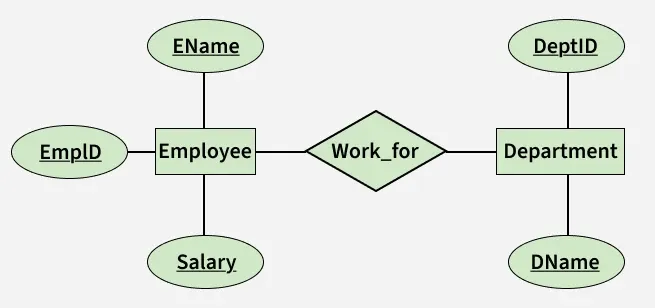
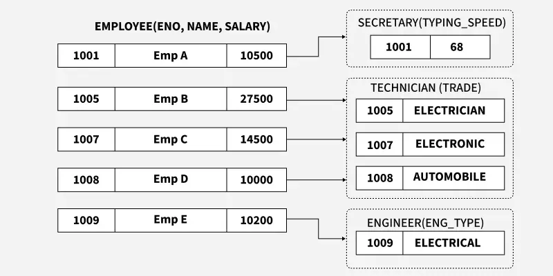
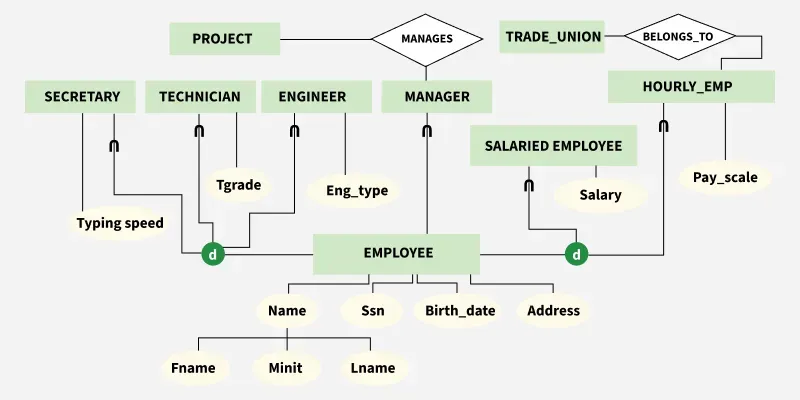
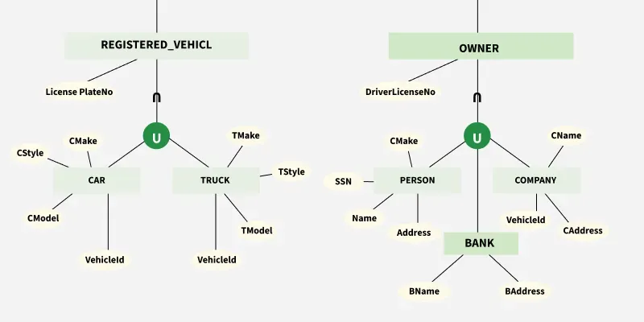

# Bài giảng: Mô hình Enhanced ER

**Cập nhật lần cuối:** 16/06/2026

**Nguồn tham khảo:**  
- Nguồn 1: GeeksforGeeks - [Enhanced ER Model](https://www.geeksforgeeks.org/dbms/enhanced-er-model/)

---

## 1. Mục tiêu bài giảng

Sau khi hoàn thành bài học này, người học có thể:

1. Giải thích được Enhanced ER Model là gì.
2. Trình bày được hạn chế của ER Model truyền thống.
3. Phân biệt superclass và subclass.
4. Giải thích được generalization và specialization.
5. Hiểu cơ chế kế thừa thuộc tính và quan hệ trong EER.
6. Phân biệt total subclassing và partial subclassing.
7. Phân biệt disjoint subclassing và overlapping subclassing.
8. Nhận biết category hoặc union type trong mô hình dữ liệu.
9. Chuyển một mô hình EER đơn giản sang mô hình quan hệ.
10. Lựa chọn cách triển khai superclass, subclass, category và aggregation thành các bảng trong CSDL quan hệ.

---

## 2. Giới thiệu tổng quan

Mô hình ER truyền thống giúp biểu diễn thực thể, thuộc tính và quan hệ trong cơ sở dữ liệu. Tuy nhiên, khi hệ thống dữ liệu trở nên phức tạp hơn, ER Model cơ bản có thể chưa đủ để mô tả các khái niệm như kế thừa, phân cấp, phân loại thực thể hoặc gom nhóm quan hệ ở mức trừu tượng cao hơn.

**Enhanced ER Model** hay **EER Model** là mô hình ER mở rộng, bổ sung các khái niệm nâng cao để biểu diễn yêu cầu dữ liệu phức tạp hơn.

Ví dụ, trong hệ thống nhân sự, ER Model cơ bản có thể mô tả entity `Employee` với các thuộc tính chung như `eno`, `name`, `salary`. Tuy nhiên, nếu cần phân biệt `Engineer` có `trade`, `Technician` có `skill`, hoặc `Secretary` có `typing_speed`, EER Model giúp biểu diễn rõ quan hệ kế thừa giữa `Employee` và các nhóm nhân viên chuyên biệt này.

Các khái niệm chính trong EER:

- Superclass và subclass.
- Generalization.
- Specialization.
- Inheritance.
- Aggregation.
- Category hoặc union type.
- Ràng buộc total/partial và disjoint/overlapping.



---

### Quiz nhanh: Giới thiệu tổng quan

**Câu 1.** EER Model được dùng chủ yếu để làm gì?

A. Biểu diễn các yêu cầu dữ liệu phức tạp hơn ER Model cơ bản  
B. Thay thế hoàn toàn SQL  
C. Tối ưu tốc độ truy vấn vật lý  
D. Sao lưu dữ liệu tự động  

**Câu 2.** Khái niệm nào sau đây thuộc EER Model?

A. File system  
B. Packet switching  
C. Superclass và subclass  
D. Deadlock detection  

**Câu 3.** Vì sao ER Model cơ bản có thể chưa đủ trong một số hệ thống?

A. Vì không có cách biểu diễn bảng  
B. Vì không dùng được khóa chính  
C. Vì không hỗ trợ thuộc tính  
D. Vì khó thể hiện trực tiếp phân cấp, kế thừa và phân loại thực thể phức tạp  

---

## 3. Khái niệm cơ bản

### 3.1. Superclass

**Superclass** là entity set tổng quát, chứa các thuộc tính chung của nhiều nhóm thực thể con.

Ví dụ:

```text
Employee(eno, name, salary)
```

`Employee` là superclass vì mọi loại nhân viên đều có mã nhân viên, tên và lương.

Một ví dụ khác là `Science` đóng vai trò superclass của `Physics`, `Chemistry` và `Biology`. Các lĩnh vực con cùng thuộc nhóm khoa học nhưng mỗi lĩnh vực vẫn có nội dung và thuộc tính chuyên biệt riêng.

### 3.2. Subclass

**Subclass** là entity set chuyên biệt hơn, kế thừa thuộc tính và quan hệ từ superclass, đồng thời có thêm thuộc tính riêng.

Ví dụ:

```text
Secretary(typing_speed)
Technician(skill)
Engineer(trade)
```

Các subclass trên đều là các loại cụ thể của `Employee`.

Quan hệ giữa subclass và superclass được đọc theo dạng **IS-A**:

- `Secretary IS-A Employee`.
- `Technician IS-A Employee`.
- `Engineer IS-A Employee`.
- Tương tự, `Laptop IS-A Computer`.

Vì vậy, mọi thực thể thuộc `Secretary`, `Technician` hoặc `Engineer` trước hết đều phải là một `Employee` hợp lệ.



### 3.3. Inheritance

**Inheritance** nghĩa là subclass kế thừa thuộc tính và quan hệ của superclass. Nếu `Engineer` là subclass của `Employee`, thì `Engineer` tự động có các thuộc tính chung như `eno`, `name`, `salary`, đồng thời có thể có thuộc tính riêng như `trade`.

Ví dụ với dữ liệu cụ thể:

| eno | Subclass | Thuộc tính kế thừa | Thuộc tính riêng |
|---|---|---|---|
| 1001 | `Secretary` | `name`, `salary` | `typing_speed = 68` |
| 1009 | `Engineer` | `name`, `salary` | `trade = Electrical` |

Nhân viên `1001` không cần khai báo lại `eno`, `name` và `salary` trong `Secretary`; các thuộc tính này được kế thừa từ `Employee`. Tương tự, nhân viên `1009` nhận các thuộc tính chung từ `Employee` và chỉ bổ sung chuyên môn `trade`.

Kế thừa cũng áp dụng cho relationship. Chẳng hạn, nếu `Employee` tham gia quan hệ `WORKS_FOR` với `Department`, thì một `Engineer` cũng tham gia quan hệ đó với tư cách là một `Employee`.

---

### Quiz nhanh: Khái niệm cơ bản

**Câu 1.** Superclass là gì?

A. Một bảng chỉ chứa khóa ngoại  
B. Entity set tổng quát chứa các thuộc tính chung  
C. Một thuộc tính đa trị  
D. Một quan hệ không có cardinality  

**Câu 2.** Subclass có đặc điểm nào?

A. Không liên quan đến superclass  
B. Chỉ dùng trong mô hình vật lý  
C. Kế thừa thuộc tính và quan hệ từ superclass  
D. Không thể có thuộc tính riêng  

**Câu 3.** Trong ví dụ `Employee -> Engineer`, `Engineer` là gì?

A. Superclass  
B. Relationship  
C. Attribute  
D. Subclass  

---

## 4. Cách hệ thống hoạt động

EER Model hoạt động bằng cách bổ sung các cơ chế trừu tượng hóa vào ER Model cơ bản. Thay vì chỉ mô tả entity và relationship độc lập, EER cho phép biểu diễn quan hệ "là một loại của", kế thừa thuộc tính và các ràng buộc phân loại.

Quy trình mô hình hóa cơ bản:

1. **Xác định entity tổng quát:** Tìm các thực thể có thuộc tính chung.
2. **Xác định entity chuyên biệt:** Tìm các nhóm con có thuộc tính hoặc quan hệ riêng.
3. **Xác định ràng buộc:** Chọn total/partial và disjoint/overlapping.
4. **Chuyển sang mô hình quan hệ:** Chọn chiến lược mapping phù hợp.

Ví dụ:

```text
Employee -> Secretary, Technician, Engineer
```

Trong ví dụ này, bước đầu tiên là nhận ra `Secretary`, `Technician` và `Engineer` đều có các thông tin chung của nhân viên, nên `Employee` được chọn làm entity tổng quát. Sau đó, mỗi nhóm nhân viên được mô hình hóa thành subclass vì có thuộc tính riêng cần quản lý. Cuối cùng, người thiết kế cần quyết định các subclass này có bao phủ toàn bộ `Employee` hay không và một nhân viên có thể thuộc nhiều subclass cùng lúc hay không.

---

### Quiz nhanh: Cách hoạt động

**Câu 1.** Bước đầu tiên khi mô hình hóa EER thường là gì?

A. Xác định entity tổng quát và các thuộc tính chung  
B. Xóa toàn bộ relationship  
C. Viết truy vấn `SELECT`  
D. Tạo index vật lý  

**Câu 2.** Vì sao cần xác định ràng buộc subclass?

A. Để bỏ qua khóa chính  
B. Để mô hình phản ánh đúng quy tắc nghiệp vụ  
C. Để không cần dùng entity  
D. Để thay thế database server  

**Câu 3.** EER hỗ trợ biểu diễn quan hệ nào rõ hơn ER cơ bản?

A. "Không có dữ liệu"  
B. "Không có thuộc tính"  
C. "Là một loại của"  
D. "Không cần khóa"  

---

## 5. Các thành phần chính

### 5.1. Generalization

**Generalization** là quá trình gom nhiều entity set chuyên biệt thành một entity set tổng quát hơn.

Ví dụ:

```text
Car, Truck, Motorbike -> Vehicle
```

Generalization thường đi từ dưới lên, tập trung vào thuộc tính chung và giúp giảm trùng lặp trong mô hình.

Ví dụ chi tiết: nếu `Car`, `Truck` và `Motorbike` đều có `vehicle_id`, `brand` và `model`, ta đưa các thuộc tính chung này lên `Vehicle`. Các thuộc tính riêng như `load_capacity` của `Truck` vẫn nằm tại subclass tương ứng.

### 5.2. Specialization

**Specialization** là quá trình chia một entity set tổng quát thành các entity set chuyên biệt hơn.

Ví dụ:

```text
Employee -> Secretary, Technician, Engineer
```



Specialization thường đi từ trên xuống, tập trung vào đặc điểm riêng của từng subclass.

Trong ví dụ nhân viên, `Employee(eno, name, salary)` được chuyên biệt hóa theo loại công việc:

- `Secretary` bổ sung `typing_speed`.
- `Technician` bổ sung `skill`.
- `Engineer` bổ sung `trade`.

Một nhân viên chỉ xuất hiện trong subclass khi có đặc điểm chuyên biệt cần quản lý. Cách tổ chức này tránh lặp lại `eno`, `name` và `salary` ở cả ba loại nhân viên.

### 5.3. Aggregation

**Aggregation** là cơ chế xem một relationship cùng các entity liên quan như một thực thể cấp cao hơn. Aggregation hữu ích khi một relationship cần tham gia vào relationship khác.

Ví dụ:

```text
Employee -- WORKS_ON -- Project
(Employee WORKS_ON Project) -- MONITORED_BY -- Manager
```

Ở đây, `WORKS_ON` không chỉ là một quan hệ đơn giản giữa `Employee` và `Project`; toàn bộ việc "nhân viên làm trên dự án" lại cần được `Manager` giám sát. Vì vậy, ta có thể gom quan hệ `WORKS_ON` cùng hai entity liên quan thành một đối tượng cấp cao hơn, rồi cho đối tượng đó tham gia quan hệ `MONITORED_BY`.

### 5.4. Category hoặc union type

**Category** hay **union type** là một subclass được hình thành từ nhiều superclass khác nhau.

Ví dụ:

- `LibraryMember` có thể là `Student`, `Faculty` hoặc `Staff`.
- `VehicleOwner` có thể là `Person` hoặc `Company`.
- `RTORegisteredVehicle` có thể là `Car` hoặc `Truck`.

Với `VehicleOwner`, `Person` và `Company` là hai entity độc lập, không cần có chung một superclass. Category chỉ diễn tả rằng chủ sở hữu phương tiện phải đến từ một trong hai tập thực thể đó.

Tương tự, `RTORegisteredVehicle` lấy thành viên từ hợp của `Car` và `Truck`. Đây là union type, không có nghĩa `Car` và `Truck` kế thừa thuộc tính từ chính category này.



---

### Quiz nhanh: Các thành phần chính

**Câu 1.** Generalization thường đi theo hướng nào?

A. Từ trên xuống  
B. Từ trái sang phải  
C. Không có hướng phân tích  
D. Từ dưới lên  

**Câu 2.** Specialization thường dùng để làm gì?

A. Chia một entity tổng quát thành các entity chuyên biệt  
B. Xóa tất cả subclass  
C. Gộp các bảng vật lý  
D. Tạo chỉ mục trong SQL  

**Câu 3.** Category hoặc union type dùng để biểu diễn điều gì?

A. Một thuộc tính không có kiểu dữ liệu  
B. Một subclass được hình thành từ nhiều superclass khác nhau  
C. Một bảng tạm trong bộ nhớ  
D. Một truy vấn không có điều kiện  

---

## 6. Phân loại hoặc các nhóm chính

Các ràng buộc trong specialization giúp xác định cách một thực thể của superclass tham gia vào các subclass.

### 6.1. Total subclassing

Total subclassing nghĩa là mọi thực thể trong superclass bắt buộc phải thuộc ít nhất một subclass.

Ví dụ: mọi `Account` phải là `SavingsAccount` hoặc `CurrentAccount`.

Theo ví dụ nhân viên trong bài nguồn, nếu doanh nghiệp quy định mọi `Employee` đều phải là `SalariedEmployee` hoặc `HourlyEmployee`, đây là total subclassing vì hai subclass bao phủ toàn bộ tập `Employee`.

### 6.2. Partial subclassing

Partial subclassing nghĩa là một số thực thể trong superclass có thể không thuộc subclass nào.

Ví dụ: không phải mọi `Employee` đều là `Secretary`, `Technician` hoặc `Engineer`.

Chẳng hạn, một nhân viên hành chính thông thường vẫn tồn tại trong `Employee` dù không thuộc ba subclass kể trên. Vì vậy, phân loại theo loại công việc này không bao phủ toàn bộ superclass.

### 6.3. Disjoint subclassing

Disjoint subclassing nghĩa là một thực thể chỉ được thuộc tối đa một subclass.

Ví dụ: nếu quy tắc nghiệp vụ quy định một nhân viên chỉ có đúng một loại công việc chính, nhân viên `1001` thuộc `Secretary` thì không thể đồng thời thuộc `Engineer` hoặc `Technician`.

### 6.4. Overlapping subclassing

Overlapping subclassing nghĩa là một thực thể có thể thuộc nhiều subclass.

Ví dụ: một nhân viên có thể vừa là `Teacher`, vừa là `Researcher`.

Trong trường hợp này, cùng một mã nhân viên xuất hiện ở cả hai subclass và kế thừa các thuộc tính chung từ một bản ghi `Employee` duy nhất.

---

## 7. Nhóm/loại thứ nhất: Generalization và specialization

### 7.1. Khái niệm

Generalization và specialization là hai cách nhìn của cùng một cấu trúc phân cấp.

- Generalization: gom các entity chuyên biệt thành entity tổng quát.
- Specialization: chia entity tổng quát thành các entity chuyên biệt.

### 7.2. Đặc điểm chính

1. **Generalization giảm trùng lặp**

   Các thuộc tính chung được đưa lên superclass.

2. **Specialization làm rõ nghiệp vụ**

   Các thuộc tính riêng được đặt trong subclass tương ứng.

3. **Cả hai đều hỗ trợ kế thừa**

   Subclass kế thừa thuộc tính và quan hệ từ superclass.

### 7.3. Ví dụ

```text
Vehicle -> Car, Truck, Motorbike
Employee -> Secretary, Technician, Engineer
```

---

### Quiz nhanh: Nhóm/loại thứ nhất

**Câu 1.** `Car`, `Truck`, `Motorbike` được gom thành `Vehicle` là ví dụ của gì?

A. Aggregation  
B. Deadlock  
C. Generalization  
D. Fragmentation  

**Câu 2.** `Employee` được chia thành `Secretary`, `Technician`, `Engineer` là ví dụ của gì?

A. Backup  
B. Indexing  
C. Transaction logging  
D. Specialization  

**Câu 3.** Mục tiêu chung của hai khái niệm này là gì?

A. Biểu diễn phân cấp và kế thừa trong mô hình dữ liệu  
B. Tạo file ảnh  
C. Tăng dung lượng ổ cứng  
D. Xóa dữ liệu thừa  

---

## 8. Nhóm/loại thứ hai: Category và aggregation

### 8.1. Category

Category dùng khi một entity chuyên biệt được tạo từ nhiều superclass khác nhau.

Ví dụ:

```text
Student ----\
Faculty ----- LibraryMember
Staff   ----/
```

Trong mô hình này, `LibraryMember` không yêu cầu `Student`, `Faculty` và `Staff` phải có chung một superclass. Một thành viên thư viện có thể đến từ bất kỳ tập thực thể nào trong ba tập trên. Điều quan trọng là vai trò "thành viên thư viện" được hình thành từ hợp của nhiều loại đối tượng khác nhau.

### 8.2. Aggregation

Aggregation dùng khi một relationship cần được xem như một đối tượng cấp cao hơn để tham gia vào một relationship khác.

Ví dụ:

```text
Doctor -- TREATS -- Patient
(Doctor TREATS Patient) -- BILLED_BY -- InsuranceCompany
```

Quan hệ `TREATS` mô tả việc bác sĩ điều trị cho bệnh nhân. Nếu công ty bảo hiểm không chỉ liên quan đến riêng bác sĩ hay riêng bệnh nhân, mà liên quan đến chính ca điều trị đó, ta dùng aggregation để xem `Doctor TREATS Patient` như một đối tượng có thể tham gia quan hệ `BILLED_BY`.

### 8.3. Trường hợp sử dụng

- Dùng category khi một vai trò nghiệp vụ có thể đến từ nhiều loại entity khác nhau.
- Dùng aggregation khi cần mô hình hóa relationship của relationship.

---

### Quiz nhanh: Nhóm/loại thứ hai

**Câu 1.** `LibraryMember` là union của `Student`, `Faculty`, `Staff` là ví dụ của gì?

A. Weak entity  
B. Category  
C. Derived attribute  
D. Index  

**Câu 2.** Aggregation hữu ích khi nào?

A. Khi không có entity nào  
B. Khi chỉ có một thuộc tính  
C. Khi cần xem một relationship như một đối tượng cấp cao hơn  
D. Khi muốn bỏ qua nghiệp vụ  

**Câu 3.** Category còn được gọi là gì?

A. Hash key  
B. Query plan  
C. Log file  
D. Union type  

---

## 9. Nguyên lý, tính chất hoặc tiêu chuẩn quan trọng

### 9.1. Kế thừa phải có ý nghĩa nghiệp vụ

Không nên tạo subclass nếu subclass không có thuộc tính riêng, relationship riêng hoặc quy tắc nghiệp vụ riêng.

Ví dụ, tạo subclass `MaleEmployee` và `FemaleEmployee` thường không cần thiết nếu hệ thống chỉ lưu giới tính như một thuộc tính thông thường và không có quy trình riêng cho từng nhóm. Ngược lại, tạo subclass `ContractEmployee` và `PermanentEmployee` có ý nghĩa nếu mỗi nhóm có cách tính lương, thời hạn hợp đồng hoặc chế độ phúc lợi khác nhau.

### 9.2. Ràng buộc phải rõ ràng

Cần xác định rõ specialization là total hay partial, disjoint hay overlapping.

Ví dụ, với `Account -> SavingsAccount, CurrentAccount`, ngân hàng có thể quy định mọi tài khoản phải thuộc ít nhất một loại tài khoản, nên đây là total subclassing. Nếu cùng một tài khoản không thể vừa là tài khoản tiết kiệm vừa là tài khoản thanh toán, ràng buộc đi kèm là disjoint.

### 9.3. Mapping phải phù hợp

Khi chuyển sang mô hình quan hệ, có thể chọn:

- Một bảng cho superclass và mỗi subclass.
- Một bảng duy nhất cho toàn bộ phân cấp.
- Chỉ tạo bảng cho subclass trong một số trường hợp phù hợp.

Ví dụ, với `Employee -> Engineer, Technician`, cách phổ biến là tạo bảng `Employee(eno, name, salary)`, bảng `Engineer(eno, trade)` và bảng `Technician(eno, skill)`. Cột `eno` trong các bảng subclass vừa là khóa chính, vừa là khóa ngoại tham chiếu đến `Employee`, nhờ đó dữ liệu chung không bị lặp lại.

### 9.4. Thiết kế cần tránh dư thừa

Các thuộc tính chung nên đặt ở superclass để tránh lặp lại ở nhiều subclass.

Ví dụ, nếu `Car`, `Truck` và `Motorbike` đều có `license_plate`, `brand`, `model`, các thuộc tính này nên nằm ở `Vehicle`. Nếu đặt lại cùng các thuộc tính đó trong từng subclass, mô hình sẽ khó bảo trì hơn và dễ phát sinh sai lệch khi cùng một quy tắc thay đổi.

---

### Quiz nhanh: Nguyên lý quan trọng

**Câu 1.** Khi nào nên tạo subclass?

A. Khi nhóm thực thể có thuộc tính, relationship hoặc quy tắc riêng  
B. Khi muốn mô hình dài hơn  
C. Khi không có sự khác biệt nào  
D. Khi không cần superclass  

**Câu 2.** Điều gì cần xác định khi specialization?

A. Màu sắc của sơ đồ  
B. Total/partial và disjoint/overlapping  
C. Kích thước file ảnh  
D. Tên hệ điều hành  

**Câu 3.** Vì sao thuộc tính chung nên đặt ở superclass?

A. Để bỏ khóa chính  
B. Để không cần bảng  
C. Để tránh trùng lặp dữ liệu trong mô hình  
D. Để xóa subclass  

---

## 10. Triển khai EER thành các bảng trong CSDL quan hệ

EER Model là mô hình khái niệm, còn CSDL quan hệ lưu dữ liệu dưới dạng bảng. Vì vậy, khi thiết kế database, cần chuyển các thành phần như superclass, subclass, category và aggregation thành bảng, khóa chính, khóa ngoại và ràng buộc dữ liệu.

Không có một cách mapping duy nhất phù hợp cho mọi bài toán. Cách triển khai phụ thuộc vào:

- Subclass có nhiều thuộc tính riêng hay không.
- Một thực thể có thể thuộc một hay nhiều subclass.
- Specialization là total hay partial.
- Truy vấn thường đọc dữ liệu ở cấp superclass hay subclass.
- Mức độ chấp nhận `NULL`, trùng lặp dữ liệu và độ phức tạp khi `JOIN`.

### 10.1. Cách 1: Một bảng cho superclass và mỗi subclass

Đây là cách triển khai phổ biến khi muốn giữ mô hình gần với EER nhất.

Ví dụ EER:

```text
Employee(eno, name, salary)
Employee -> Secretary(typing_speed), Technician(skill), Engineer(trade)
```

Có thể chuyển thành các bảng:

```sql
CREATE TABLE Employee (
    eno INT PRIMARY KEY,
    name VARCHAR(100) NOT NULL,
    salary DECIMAL(12, 2) NOT NULL
);

CREATE TABLE Secretary (
    eno INT PRIMARY KEY,
    typing_speed INT NOT NULL,
    FOREIGN KEY (eno) REFERENCES Employee(eno)
);

CREATE TABLE Technician (
    eno INT PRIMARY KEY,
    skill VARCHAR(100) NOT NULL,
    FOREIGN KEY (eno) REFERENCES Employee(eno)
);

CREATE TABLE Engineer (
    eno INT PRIMARY KEY,
    trade VARCHAR(100) NOT NULL,
    FOREIGN KEY (eno) REFERENCES Employee(eno)
);
```

Trong cách này, mỗi nhân viên có một dòng trong `Employee`. Nếu nhân viên đó là kỹ sư, sẽ có thêm một dòng trong `Engineer` với cùng `eno`. Cột `eno` ở bảng subclass vừa là khóa chính, vừa là khóa ngoại về bảng superclass.

Ưu điểm:

- Tránh lặp lại thuộc tính chung như `name`, `salary`.
- Phù hợp với partial subclassing vì có thể tồn tại nhân viên chỉ nằm trong `Employee`.
- Phù hợp với overlapping subclassing vì cùng một `eno` có thể xuất hiện ở nhiều bảng subclass.

Nhược điểm:

- Khi cần lấy đầy đủ thông tin subclass, thường phải `JOIN`.
- Ràng buộc disjoint hoặc total có thể cần thêm logic bằng trigger, constraint hoặc kiểm tra ở tầng ứng dụng.

Ví dụ truy vấn lấy kỹ sư:

```sql
SELECT
    e.eno,
    e.name,
    e.salary,
    en.trade
FROM Employee e
JOIN Engineer en
    ON e.eno = en.eno;
```

### 10.2. Cách 2: Một bảng duy nhất cho toàn bộ phân cấp

Cách này gộp superclass và tất cả subclass vào một bảng, thường dùng thêm cột phân loại.

Ví dụ:

```sql
CREATE TABLE Employee (
    eno INT PRIMARY KEY,
    name VARCHAR(100) NOT NULL,
    salary DECIMAL(12, 2) NOT NULL,
    employee_type VARCHAR(20) NOT NULL,
    typing_speed INT NULL,
    skill VARCHAR(100) NULL,
    trade VARCHAR(100) NULL,
    CHECK (employee_type IN ('Secretary', 'Technician', 'Engineer', 'Other'))
);
```

Nếu dòng dữ liệu là `Engineer`, cột `trade` có giá trị, còn `typing_speed` và `skill` thường để `NULL`.

Ví dụ dữ liệu:

| eno | name | salary | employee_type | typing_speed | skill | trade |
|---|---|---:|---|---:|---|---|
| 1001 | An | 1200.00 | Secretary | 68 | NULL | NULL |
| 1009 | Binh | 1800.00 | Engineer | NULL | NULL | Electrical |
| 1015 | Chi | 1100.00 | Other | NULL | NULL | NULL |

Ưu điểm:

- Truy vấn đơn giản vì không cần `JOIN`.
- Phù hợp khi các subclass ít thuộc tính riêng.
- Phù hợp với disjoint subclassing vì mỗi dòng có một `employee_type`.

Nhược điểm:

- Có thể sinh nhiều giá trị `NULL`.
- Khó biểu diễn overlapping subclassing vì một dòng chỉ có một loại chính.
- Ràng buộc như "Engineer phải có trade" thường cần `CHECK` phức tạp hoặc logic ứng dụng.

Ví dụ ràng buộc có thể dùng:

```sql
CHECK (
    (employee_type = 'Engineer' AND trade IS NOT NULL)
    OR (employee_type <> 'Engineer')
)
```

### 10.3. Cách 3: Chỉ tạo bảng cho các subclass

Cách này đưa thuộc tính chung của superclass xuống từng bảng subclass, thường chỉ phù hợp khi specialization là total và disjoint.

Ví dụ:

```sql
CREATE TABLE Secretary (
    eno INT PRIMARY KEY,
    name VARCHAR(100) NOT NULL,
    salary DECIMAL(12, 2) NOT NULL,
    typing_speed INT NOT NULL
);

CREATE TABLE Engineer (
    eno INT PRIMARY KEY,
    name VARCHAR(100) NOT NULL,
    salary DECIMAL(12, 2) NOT NULL,
    trade VARCHAR(100) NOT NULL
);
```

Nếu mọi nhân viên bắt buộc phải thuộc đúng một subclass, cách này có thể dùng được. Tuy nhiên, thuộc tính chung như `name`, `salary` bị lặp lại ở nhiều bảng, nên khi quy tắc chung thay đổi, thiết kế khó bảo trì hơn.

Ưu điểm:

- Không cần bảng superclass.
- Truy vấn từng loại subclass đơn giản.
- Phù hợp khi hệ thống gần như chỉ làm việc với từng loại cụ thể.

Nhược điểm:

- Khó truy vấn toàn bộ `Employee` vì phải dùng `UNION`.
- Không phù hợp với partial subclassing.
- Dễ lặp thuộc tính chung ở nhiều bảng.

Ví dụ truy vấn toàn bộ nhân viên:

```sql
SELECT eno, name, salary, 'Secretary' AS employee_type
FROM Secretary
UNION ALL
SELECT eno, name, salary, 'Engineer' AS employee_type
FROM Engineer;
```

### 10.4. Triển khai total, partial, disjoint và overlapping

Các ràng buộc EER không phải lúc nào cũng biểu diễn trực tiếp bằng khóa chính và khóa ngoại. Khi chuyển sang bảng quan hệ, cần xác định ràng buộc nào database tự kiểm soát được và ràng buộc nào cần trigger hoặc logic ứng dụng.

| Ràng buộc | Ý nghĩa | Cách triển khai thường gặp |
|---|---|---|
| Total | Mỗi dòng superclass phải thuộc ít nhất một subclass | Trigger, kiểm tra ở ứng dụng, hoặc dùng bảng duy nhất với `employee_type NOT NULL` |
| Partial | Một số dòng superclass có thể không thuộc subclass nào | Bảng superclass riêng và bảng subclass tùy chọn |
| Disjoint | Một dòng superclass thuộc tối đa một subclass | Cột loại trong superclass, trigger, hoặc bảng phân loại riêng |
| Overlapping | Một dòng superclass có thể thuộc nhiều subclass | Bảng superclass riêng và nhiều bảng subclass cùng dùng khóa chính của superclass |

Ví dụ disjoint với cột phân loại:

```sql
CREATE TABLE Employee (
    eno INT PRIMARY KEY,
    name VARCHAR(100) NOT NULL,
    salary DECIMAL(12, 2) NOT NULL,
    employee_type VARCHAR(20) NOT NULL,
    CHECK (employee_type IN ('Secretary', 'Technician', 'Engineer'))
);
```

Ví dụ overlapping:

```text
Employee -> Teacher, Researcher
```

Có thể triển khai:

```sql
CREATE TABLE Employee (
    eno INT PRIMARY KEY,
    name VARCHAR(100) NOT NULL
);

CREATE TABLE Teacher (
    eno INT PRIMARY KEY,
    teaching_area VARCHAR(100) NOT NULL,
    FOREIGN KEY (eno) REFERENCES Employee(eno)
);

CREATE TABLE Researcher (
    eno INT PRIMARY KEY,
    research_area VARCHAR(100) NOT NULL,
    FOREIGN KEY (eno) REFERENCES Employee(eno)
);
```

Cùng một `eno` có thể xuất hiện trong cả `Teacher` và `Researcher`, nên mô hình này biểu diễn được overlapping subclassing.

### 10.5. Triển khai category hoặc union type

Với category, một entity có thể đến từ nhiều superclass khác nhau. Ví dụ:

```text
VehicleOwner = Person union Company
```

Cách đơn giản là dùng bảng category có cột chỉ loại nguồn:

```sql
CREATE TABLE Person (
    person_id INT PRIMARY KEY,
    full_name VARCHAR(100) NOT NULL
);

CREATE TABLE Company (
    company_id INT PRIMARY KEY,
    company_name VARCHAR(100) NOT NULL
);

CREATE TABLE VehicleOwner (
    owner_id INT PRIMARY KEY,
    owner_type VARCHAR(20) NOT NULL,
    person_id INT NULL,
    company_id INT NULL,
    CHECK (owner_type IN ('Person', 'Company')),
    FOREIGN KEY (person_id) REFERENCES Person(person_id),
    FOREIGN KEY (company_id) REFERENCES Company(company_id)
);
```

Với thiết kế này, nếu `owner_type = 'Person'` thì `person_id` có giá trị và `company_id` để `NULL`; nếu `owner_type = 'Company'` thì ngược lại. Ràng buộc "chỉ một trong hai khóa ngoại được có giá trị" thường cần `CHECK` hoặc trigger:

```sql
CHECK (
    (owner_type = 'Person' AND person_id IS NOT NULL AND company_id IS NULL)
    OR
    (owner_type = 'Company' AND company_id IS NOT NULL AND person_id IS NULL)
)
```

Một cách khác là tạo hai bảng liên kết riêng:

```sql
CREATE TABLE PersonVehicleOwner (
    owner_id INT PRIMARY KEY,
    person_id INT NOT NULL,
    FOREIGN KEY (person_id) REFERENCES Person(person_id)
);

CREATE TABLE CompanyVehicleOwner (
    owner_id INT PRIMARY KEY,
    company_id INT NOT NULL,
    FOREIGN KEY (company_id) REFERENCES Company(company_id)
);
```

Cách này rõ ràng hơn về khóa ngoại, nhưng khi truy vấn tất cả chủ sở hữu, thường phải dùng `UNION`.

### 10.6. Triển khai aggregation

Aggregation thường được triển khai bằng cách biến relationship được gom nhóm thành một bảng quan hệ trung gian.

Ví dụ EER:

```text
Employee -- WORKS_ON -- Project
(Employee WORKS_ON Project) -- MONITORED_BY -- Manager
```

Có thể triển khai:

```sql
CREATE TABLE Employee (
    eno INT PRIMARY KEY,
    name VARCHAR(100) NOT NULL
);

CREATE TABLE Project (
    project_id INT PRIMARY KEY,
    project_name VARCHAR(100) NOT NULL
);

CREATE TABLE Manager (
    manager_id INT PRIMARY KEY,
    manager_name VARCHAR(100) NOT NULL
);

CREATE TABLE WorksOn (
    eno INT NOT NULL,
    project_id INT NOT NULL,
    hours_per_week DECIMAL(5, 2),
    PRIMARY KEY (eno, project_id),
    FOREIGN KEY (eno) REFERENCES Employee(eno),
    FOREIGN KEY (project_id) REFERENCES Project(project_id)
);

CREATE TABLE Monitors (
    eno INT NOT NULL,
    project_id INT NOT NULL,
    manager_id INT NOT NULL,
    PRIMARY KEY (eno, project_id, manager_id),
    FOREIGN KEY (eno, project_id) REFERENCES WorksOn(eno, project_id),
    FOREIGN KEY (manager_id) REFERENCES Manager(manager_id)
);
```

Ở đây, `WorksOn` biểu diễn relationship `Employee WORKS_ON Project`. Vì `Monitors` tham chiếu đến khóa chính của `WorksOn`, database hiểu rằng người quản lý đang giám sát chính việc một nhân viên làm trên một dự án cụ thể, không chỉ giám sát riêng nhân viên hoặc riêng dự án.

### 10.7. Gợi ý chọn chiến lược mapping

| Tình huống | Cách triển khai nên cân nhắc |
|---|---|
| Subclass có nhiều thuộc tính riêng | Một bảng cho superclass và mỗi subclass |
| Cần hỗ trợ overlapping subclassing | Một bảng cho superclass và mỗi subclass |
| Subclass ít thuộc tính riêng, truy vấn cần đơn giản | Một bảng duy nhất cho toàn bộ phân cấp |
| Specialization total và disjoint | Một bảng duy nhất hoặc chỉ tạo bảng cho subclass |
| Cần tránh `NULL` và tránh lặp thuộc tính chung | Superclass riêng, subclass riêng |
| Category từ nhiều superclass | Bảng category có cột loại nguồn hoặc nhiều bảng liên kết riêng |
| Aggregation | Bảng quan hệ trung gian và bảng tham chiếu đến quan hệ trung gian đó |

Nguyên tắc thực tế là ưu tiên thiết kế dễ đảm bảo toàn vẹn dữ liệu và dễ hiểu cho người bảo trì. Nếu một ràng buộc EER không thể biểu diễn đầy đủ bằng khóa chính, khóa ngoại và `CHECK`, cần ghi rõ ràng buộc đó sẽ được kiểm soát bằng trigger, stored procedure hoặc logic ứng dụng.

---

### Quiz nhanh: Triển khai EER thành bảng quan hệ

**Câu 1.** Trong cách "một bảng cho superclass và mỗi subclass", khóa chính của bảng subclass thường đồng thời là gì?

A. Một thuộc tính mô tả không liên quan  
B. Khóa ngoại tham chiếu đến bảng superclass  
C. Một bảng tạm  
D. Một chỉ mục không duy nhất  

**Câu 2.** Cách "một bảng duy nhất cho toàn bộ phân cấp" thường cần thêm cột nào?

A. Cột phân loại subclass, ví dụ `employee_type`  
B. Cột chứa toàn bộ câu SQL  
C. Cột lưu tên database server  
D. Cột không có kiểu dữ liệu  

**Câu 3.** Aggregation thường được triển khai trong CSDL quan hệ bằng cách nào?

A. Xóa relationship khỏi mô hình  
B. Biến relationship cần gom nhóm thành bảng trung gian  
C. Chỉ lưu dữ liệu trong file văn bản  
D. Bỏ toàn bộ khóa ngoại  

---

## 11. Ứng dụng thực tế

EER Model thường được dùng trong các hệ thống có cấu trúc dữ liệu phân cấp hoặc nhiều loại đối tượng liên quan.

Một số ứng dụng phổ biến:

1. **Quản lý nhân sự**

   Mô hình hóa `Employee` và các loại nhân viên như `Engineer`, `Technician`, `Secretary`.

2. **Ngân hàng**

   Mô hình hóa `Account` và các loại tài khoản như `SavingsAccount`, `CurrentAccount`.

3. **Giao thông**

   Mô hình hóa `Vehicle` và các loại phương tiện như `Car`, `Truck`, `Motorbike`.

4. **Thư viện**

   Mô hình hóa `LibraryMember` là union của `Student`, `Faculty`, `Staff`.

5. **Giáo dục**

   Mô hình hóa người dùng có thể là `Teacher`, `Researcher` hoặc đồng thời thuộc nhiều vai trò.

---

### Quiz nhanh: Ứng dụng thực tế

**Câu 1.** Hệ thống nào thường cần EER Model?

A. Hệ thống chỉ có một biến số  
B. Hệ thống không có dữ liệu  
C. Hệ thống không cần mô hình hóa  
D. Hệ thống có nhiều loại thực thể phân cấp  

**Câu 2.** Ví dụ `Account -> SavingsAccount, CurrentAccount` thuộc lĩnh vực nào?

A. Ngân hàng  
B. Đồ họa máy tính  
C. Mạng máy tính  
D. Hệ điều hành  

**Câu 3.** `Vehicle -> Car, Truck, Motorbike` minh họa điều gì?

A. Sao lưu dữ liệu  
B. Specialization trong mô hình dữ liệu  
C. Xóa bảng  
D. Tạo trigger  

---

## 12. Vai trò trong các lĩnh vực công nghệ hoặc nghiệp vụ

### 12.1. Phân tích nghiệp vụ

- Giúp phân loại rõ các nhóm đối tượng.
- Giúp mô hình phản ánh quy tắc nghiệp vụ thực tế.
- Giúp trao đổi dễ hơn giữa analyst, developer và stakeholder.

### 12.2. Thiết kế cơ sở dữ liệu

- Hỗ trợ chuyển mô hình khái niệm sang mô hình quan hệ.
- Giúp chọn chiến lược mapping phù hợp.
- Giảm trùng lặp thuộc tính.

### 12.3. Phát triển phần mềm

- Hỗ trợ thiết kế class/domain model.
- Giúp hiểu quan hệ kế thừa trong nghiệp vụ.
- Tạo nền tảng cho API và schema dữ liệu nhất quán.

### 12.4. Quản trị dữ liệu

- Giúp chuẩn hóa cách phân loại dữ liệu.
- Giúp kiểm soát ràng buộc và chất lượng dữ liệu.
- Hỗ trợ tài liệu hóa mô hình dữ liệu doanh nghiệp.

---

### Quiz nhanh: Vai trò theo lĩnh vực

**Câu 1.** EER hỗ trợ phân tích nghiệp vụ như thế nào?

A. Tự động viết toàn bộ ứng dụng  
B. Thay thế người dùng cuối  
C. Làm rõ các nhóm đối tượng và quy tắc phân loại  
D. Xóa dữ liệu cũ  

**Câu 2.** Trong thiết kế database, EER giúp gì?

A. Tăng tốc CPU  
B. Tạo giao diện web  
C. Cài đặt hệ điều hành  
D. Chọn chiến lược mapping superclass/subclass  

**Câu 3.** Trong phát triển phần mềm, EER gần với khái niệm nào?

A. Domain model và kế thừa nghiệp vụ  
B. Driver máy in  
C. Packet routing  
D. File compression  

---

## 13. Bảng so sánh

| Tiêu chí | ER Model | Enhanced ER Model |
|---|---|---|
| Mức độ biểu diễn | Cơ bản | Nâng cao |
| Thành phần chính | Entity, attribute, relationship | Thêm superclass, subclass, inheritance, category, aggregation |
| Khả năng mô tả phân cấp | Hạn chế | Tốt |
| Kế thừa | Không biểu diễn trực tiếp | Có |
| Phù hợp với | Bài toán đơn giản | Bài toán phức tạp, nhiều loại thực thể |

---

## 14. Câu hỏi ôn tập

### 14.1. Câu hỏi trắc nghiệm

**Câu 1.** EER Model là gì?

A. Một hệ quản trị cơ sở dữ liệu  
B. Mô hình ER mở rộng để biểu diễn yêu cầu dữ liệu phức tạp hơn  
C. Một ngôn ngữ lập trình  
D. Một dạng file sao lưu  

---

**Câu 2.** Superclass trong EER Model có vai trò gì?

A. Chỉ chứa dữ liệu tạm thời  
B. Chỉ dùng để biểu diễn khóa ngoại  
C. Chứa các thuộc tính chung của nhiều subclass  
D. Không liên quan đến subclass  

---

**Câu 3.** Subclass kế thừa gì từ superclass?

A. Chỉ tên bảng  
B. Chỉ dữ liệu mẫu  
C. Chỉ câu lệnh SQL  
D. Thuộc tính và quan hệ  

---

**Câu 4.** Generalization là quá trình nào?

A. Gom các entity chuyên biệt thành entity tổng quát  
B. Chia entity tổng quát thành các entity chuyên biệt  
C. Xóa toàn bộ relationship  
D. Tạo chỉ mục cho bảng  

---

**Câu 5.** Specialization là quá trình nào?

A. Gộp nhiều database thành một database  
B. Chia entity tổng quát thành các entity chuyên biệt  
C. Sao lưu dữ liệu  
D. Xóa subclass khỏi mô hình  

---

**Câu 6.** Total subclassing nghĩa là gì?

A. Không entity nào được thuộc subclass  
B. Một entity chỉ có đúng một thuộc tính  
C. Mọi entity trong superclass phải thuộc ít nhất một subclass  
D. Mọi subclass đều không có thuộc tính riêng  

---

**Câu 7.** Partial subclassing nghĩa là gì?

A. Mọi entity bắt buộc thuộc mọi subclass  
B. Không tồn tại superclass  
C. Subclass không được kế thừa thuộc tính  
D. Một số entity trong superclass có thể không thuộc subclass nào  

---

**Câu 8.** Disjoint subclassing mô tả trường hợp nào?

A. Một entity chỉ được thuộc tối đa một subclass  
B. Một entity bắt buộc thuộc nhiều subclass  
C. Một subclass không có khóa chính  
D. Một relationship không có cardinality  

---

**Câu 9.** Category hoặc union type phù hợp với ví dụ nào?

A. `Employee` có thuộc tính `salary`  
B. `LibraryMember` là union của `Student`, `Faculty`, `Staff`  
C. `Product` có thuộc tính `price`  
D. `Order` liên kết với `Customer`  

---

**Câu 10.** Khi chuyển EER sang mô hình quan hệ, cách nào có thể dùng cho superclass/subclass?

A. Chỉ dùng file văn bản  
B. Không cần bảng  
C. Tạo một bảng cho superclass và mỗi subclass  
D. Chỉ tạo một thuộc tính duy nhất  

---

### 14.2. Câu hỏi tự luận ngắn

**Câu 1.** Trình bày khái niệm Enhanced ER Model.

---

**Câu 2.** Giải thích vai trò của superclass và subclass trong EER Model.

---

**Câu 3.** Phân biệt generalization và specialization.

---

**Câu 4.** Phân biệt total subclassing và partial subclassing.

---

**Câu 5.** Phân biệt disjoint subclassing và overlapping subclassing.

---

## 15. Bài tập vận dụng

### Bài tập 1

Một hệ thống nhân sự có entity `Employee`. Nhân viên có thể được phân thành `Secretary`, `Technician` và `Engineer`.

**Yêu cầu:**  
Hãy xác định superclass, subclass và các thuộc tính riêng phù hợp cho từng subclass.

---

### Bài tập 2

Một hệ thống quản lý phương tiện có các entity `Car`, `Truck` và `Motorbike`.

**Yêu cầu:**  
Hãy áp dụng generalization để đề xuất superclass phù hợp và nêu các thuộc tính chung.

---

### Bài tập 3

Một trường đại học có nhân sự vừa có thể là `Teacher`, vừa có thể là `Researcher`.

**Yêu cầu:**  
Hãy xác định đây là disjoint hay overlapping subclassing và giải thích lý do.

---

### Bài tập 4

Một thư viện có thành viên là `Student`, `Faculty` hoặc `Staff`.

**Yêu cầu:**  
Hãy thiết kế mô hình EER đơn giản trong đó `LibraryMember` là category hoặc union type.

---

### Bài tập 5

Một hệ thống nhân sự có superclass `Employee` và hai subclass `Teacher`, `Researcher`. Một nhân sự có thể vừa giảng dạy vừa nghiên cứu.

**Yêu cầu:**  
Hãy đề xuất các bảng quan hệ phù hợp để triển khai mô hình trên và giải thích vì sao cách này hỗ trợ overlapping subclassing.

---

## 16. Tóm tắt bài học

- Enhanced ER Model là phần mở rộng của ER Model truyền thống.
- EER giúp biểu diễn các yêu cầu dữ liệu phức tạp như phân cấp, kế thừa và phân loại thực thể.
- Superclass chứa các thuộc tính chung của nhiều subclass.
- Subclass kế thừa thuộc tính và quan hệ từ superclass, đồng thời có thể có thuộc tính riêng.
- Generalization gom các entity chuyên biệt thành entity tổng quát.
- Specialization chia entity tổng quát thành các entity chuyên biệt.
- Total/partial mô tả mức độ bao phủ của subclass đối với superclass.
- Disjoint/overlapping mô tả một entity có thể thuộc một hay nhiều subclass.
- Category hoặc union type biểu diễn một subclass được hình thành từ nhiều superclass.
- Khi chuyển sang mô hình quan hệ, cần chọn chiến lược mapping phù hợp.
- Superclass/subclass có thể triển khai bằng bảng riêng cho superclass và subclass, một bảng duy nhất cho toàn bộ phân cấp, hoặc chỉ các bảng subclass trong trường hợp phù hợp.
- Category thường cần cột loại nguồn hoặc các bảng liên kết riêng để tham chiếu nhiều superclass.
- Aggregation thường được triển khai bằng bảng quan hệ trung gian và bảng khác tham chiếu đến quan hệ trung gian đó.

---

## 17. Từ khóa chính

- Enhanced ER Model
- EER Model
- ER Model
- Superclass
- Subclass
- Inheritance
- Generalization
- Specialization
- Total subclassing
- Partial subclassing
- Disjoint subclassing
- Overlapping subclassing
- Category
- Union type
- Aggregation
- Relational mapping
- Superclass table
- Subclass table
- Type discriminator

---

## 18. Đáp án và gợi ý trả lời

### Quiz nhanh: Giới thiệu tổng quan

- **Câu 1.** A
- **Câu 2.** C
- **Câu 3.** D

### Quiz nhanh: Khái niệm cơ bản

- **Câu 1.** B
- **Câu 2.** C
- **Câu 3.** D

### Quiz nhanh: Cách hoạt động

- **Câu 1.** A
- **Câu 2.** B
- **Câu 3.** C

### Quiz nhanh: Các thành phần chính

- **Câu 1.** D
- **Câu 2.** A
- **Câu 3.** B

### Quiz nhanh: Nhóm/loại thứ nhất

- **Câu 1.** C
- **Câu 2.** D
- **Câu 3.** A

### Quiz nhanh: Nhóm/loại thứ hai

- **Câu 1.** B
- **Câu 2.** C
- **Câu 3.** D

### Quiz nhanh: Nguyên lý quan trọng

- **Câu 1.** A
- **Câu 2.** B
- **Câu 3.** C

### Quiz nhanh: Triển khai EER thành bảng quan hệ

- **Câu 1.** B
- **Câu 2.** A
- **Câu 3.** B

### Quiz nhanh: Ứng dụng thực tế

- **Câu 1.** D
- **Câu 2.** A
- **Câu 3.** B

### Quiz nhanh: Vai trò theo lĩnh vực

- **Câu 1.** C
- **Câu 2.** D
- **Câu 3.** A

### Câu hỏi ôn tập - Trắc nghiệm

- **Câu 1.** B
- **Câu 2.** C
- **Câu 3.** D
- **Câu 4.** A
- **Câu 5.** B
- **Câu 6.** C
- **Câu 7.** D
- **Câu 8.** A
- **Câu 9.** B
- **Câu 10.** C

### Câu hỏi ôn tập - Tự luận ngắn

#### Câu 1

**Gợi ý trả lời:**

Enhanced ER Model là mô hình ER mở rộng, bổ sung các khái niệm như superclass, subclass, inheritance, generalization, specialization, aggregation và category để biểu diễn dữ liệu phức tạp hơn.

#### Câu 2

**Gợi ý trả lời:**

Superclass biểu diễn entity tổng quát chứa thuộc tính chung. Subclass biểu diễn entity chuyên biệt, kế thừa thuộc tính và quan hệ từ superclass, đồng thời có thể có thuộc tính riêng.

#### Câu 3

**Gợi ý trả lời:**

Generalization đi từ dưới lên, gom các entity chuyên biệt thành entity tổng quát. Specialization đi từ trên xuống, chia entity tổng quát thành các entity chuyên biệt.

#### Câu 4

**Gợi ý trả lời:**

Total subclassing yêu cầu mọi entity trong superclass phải thuộc ít nhất một subclass. Partial subclassing cho phép một số entity trong superclass không thuộc subclass nào.

#### Câu 5

**Gợi ý trả lời:**

Disjoint subclassing cho phép một entity thuộc tối đa một subclass. Overlapping subclassing cho phép một entity thuộc nhiều subclass cùng lúc.

### Bài tập vận dụng

#### Bài tập 1

**Gợi ý trả lời:**

Superclass là `Employee`. Các subclass có thể là `Secretary`, `Technician`, `Engineer`. Thuộc tính chung đặt ở `Employee`, ví dụ `eno`, `name`, `salary`. Thuộc tính riêng có thể là `typing_speed`, `skill`, `trade`.

#### Bài tập 2

**Gợi ý trả lời:**

Superclass phù hợp là `Vehicle`. Các thuộc tính chung có thể gồm `vehicle_id`, `brand`, `model`, `year`, `license_plate`.

#### Bài tập 3

**Gợi ý trả lời:**

Đây là overlapping subclassing, vì một nhân sự có thể đồng thời thuộc cả subclass `Teacher` và subclass `Researcher`.

#### Bài tập 4

**Gợi ý trả lời:**

Có thể mô hình hóa:

```text
Student ----\
Faculty ----- LibraryMember
Staff   ----/
```

`LibraryMember` là category hoặc union type được hình thành từ `Student`, `Faculty` và `Staff`.

#### Bài tập 5

**Gợi ý trả lời:**

Có thể tạo bảng `Employee(eno, name, ...)`, bảng `Teacher(eno, teaching_area, ...)` và bảng `Researcher(eno, research_area, ...)`. Cột `eno` trong `Teacher` và `Researcher` vừa là khóa chính, vừa là khóa ngoại tham chiếu `Employee(eno)`. Cách này hỗ trợ overlapping subclassing vì cùng một `eno` có thể xuất hiện đồng thời trong cả `Teacher` và `Researcher`.
