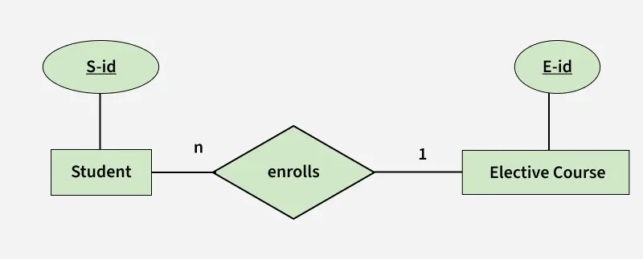
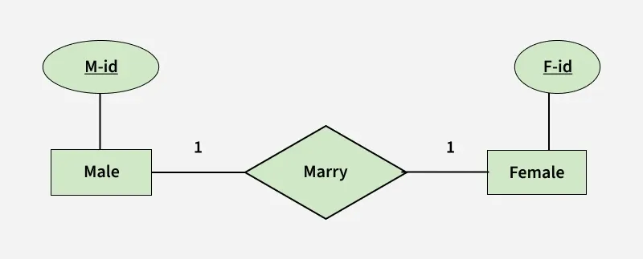
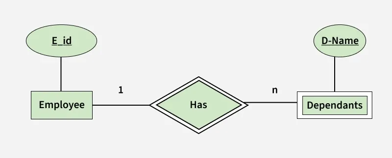
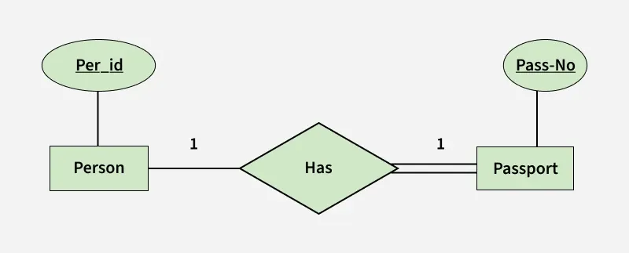
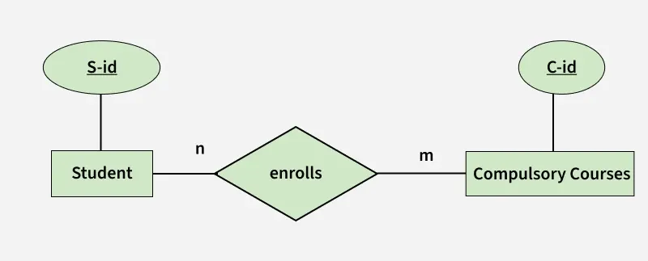

# Bài giảng: Mapping từ ER Model sang Relational Model

**Cập nhật lần cuối:** 24/04/2026

**Nguồn tham khảo:**  
- Nguồn 1: GeeksforGeeks - [Mapping from ER Model to Relational Model](https://www.geeksforgeeks.org/dbms/mapping-from-er-model-to-relational-model/)

---

## 1. Mục tiêu bài giảng

Sau khi hoàn thành bài học này, người học có thể:

1. Trình bày được ý nghĩa của việc chuyển đổi từ ER Model sang Relational Model.
2. Phân biệt được mô hình khái niệm ER và mô hình quan hệ.
3. Chuyển đổi entity mạnh thành bảng quan hệ.
4. Chuyển đổi relationship nhị phân với cardinality `1:1`, `1:N` và `M:N`.
5. Xử lý các trường hợp total participation và partial participation khi mapping.
6. Chuyển đổi weak entity sang mô hình quan hệ.
7. Xác định khóa chính và khóa ngoại sau khi chuyển đổi.
8. Giải thích được vì sao một số bảng có thể gộp, còn một số bảng không nên gộp.
9. Vận dụng quy tắc mapping để thiết kế lược đồ quan hệ đơn giản từ sơ đồ ER.

---

## 2. Giới thiệu tổng quan

Trong thiết kế cơ sở dữ liệu, **Entity-Relationship Model** hay **ER Model** thường được dùng ở mức khái niệm để mô tả các thực thể, thuộc tính và mối quan hệ giữa các thực thể.

Tuy nhiên, để triển khai cơ sở dữ liệu trong các hệ quản trị cơ sở dữ liệu quan hệ như MySQL, PostgreSQL, SQL Server hoặc Oracle, ta cần chuyển ER Model sang **Relational Model**.

Nói cách khác:

```text
ER Model  ->  Relational Model  ->  SQL Tables
```

ER Model giúp trả lời câu hỏi:

- Hệ thống có những thực thể nào?
- Mỗi thực thể có thuộc tính gì?
- Các thực thể liên hệ với nhau như thế nào?
- Cardinality và participation của relationship là gì?

Relational Model giúp trả lời câu hỏi:

- Cần tạo những bảng nào?
- Mỗi bảng có những cột nào?
- Khóa chính là gì?
- Khóa ngoại nằm ở bảng nào?
- Relationship có cần tạo thành bảng riêng không?



---

### Quiz nhanh: Giới thiệu tổng quan

**Câu 1.** Mục tiêu chính của việc mapping từ ER Model sang Relational Model là gì?

A. Chuyển mô hình khái niệm thành cấu trúc bảng có thể cài đặt trong RDBMS  
B. Xóa toàn bộ relationship trong cơ sở dữ liệu  
C. Thay thế SQL bằng sơ đồ ER  
D. Tăng tốc CPU của máy chủ  

**Câu 2.** ER Model thường được dùng ở mức nào?

A. Mức vật lý lưu trữ block trên đĩa  
B. Mức khái niệm để mô tả thực thể và quan hệ  
C. Mức giao diện người dùng  
D. Mức mạng máy tính  

**Câu 3.** Relational Model chủ yếu biểu diễn dữ liệu dưới dạng nào?

A. Cây thư mục  
B. Đồ thị vô hướng  
C. Bảng, hàng và cột  
D. File ảnh  

---

## 3. Khái niệm cơ bản

### 3.1. ER Model

**ER Model** là mô hình dùng để biểu diễn dữ liệu ở mức khái niệm. Nó gồm các thành phần chính:

- **Entity:** thực thể, ví dụ `Student`, `Course`, `Employee`.
- **Attribute:** thuộc tính, ví dụ `StudentID`, `Name`, `Age`.
- **Relationship:** mối quan hệ giữa các entity, ví dụ `Student enrolls Course`.
- **Cardinality:** số lượng thực thể tham gia quan hệ, ví dụ `1:1`, `1:N`, `M:N`.
- **Participation:** mức độ tham gia của entity vào relationship, ví dụ total hoặc partial.

### 3.2. Relational Model

**Relational Model** biểu diễn dữ liệu dưới dạng các relation, thường được cài đặt thành các bảng trong cơ sở dữ liệu quan hệ.

Một relation có dạng:

```text
TableName(attribute1, attribute2, ..., attributeN)
```

Ví dụ:

```text
Student(S_Id, Name, Age, DeptNo)
Course(C_Id, CourseName, Credits)
```

### 3.3. Mapping

**Mapping** là quá trình chuyển các thành phần của ER Model thành các bảng, cột, khóa chính và khóa ngoại trong Relational Model.

Ví dụ:

```text
Entity Student
    S_Id
    Name
    Age

Mapping thành:

Student(S_Id, Name, Age)
```

---

### Quiz nhanh: Khái niệm cơ bản

**Câu 1.** Trong ER Model, entity thường được chuyển thành gì trong Relational Model?

A. Một câu lệnh `SELECT`  
B. Một file ảnh  
C. Một chỉ mục duy nhất  
D. Một bảng  

**Câu 2.** Cardinality `1:N` thể hiện điều gì?

A. Một thực thể bên này liên hệ với nhiều thực thể bên kia  
B. Không có thực thể nào tham gia relationship  
C. Mỗi bảng có đúng một cột  
D. Một thuộc tính có nhiều kiểu dữ liệu  

**Câu 3.** Khóa ngoại dùng để làm gì?

A. Tạo màu cho sơ đồ ER  
B. Liên kết một bảng với bảng khác thông qua khóa chính được tham chiếu  
C. Xóa dữ liệu tự động  
D. Mã hóa toàn bộ database  

---

## 4. Cách hệ thống/quy trình hoạt động

Quy trình mapping từ ER Model sang Relational Model thường gồm các bước sau:

1. **Chuyển entity mạnh thành bảng**

   Mỗi strong entity thường trở thành một bảng riêng.

2. **Chuyển thuộc tính thành cột**

   Các simple attributes được đưa thành các cột trong bảng tương ứng.

3. **Xác định khóa chính**

   Thuộc tính định danh của entity trở thành primary key của bảng.

4. **Xử lý relationship**

   Tùy vào cardinality và participation, relationship có thể:
   - được gộp vào một bảng bằng khóa ngoại;
   - hoặc được chuyển thành bảng riêng.

5. **Xử lý weak entity**

   Weak entity thường có khóa chính gồm khóa của owner entity và partial key của chính nó.

6. **Kiểm tra ràng buộc toàn vẹn**

   Cần xác định primary key, foreign key, `NOT NULL`, `UNIQUE` và các constraint liên quan.



---

### Quiz nhanh: Cách hoạt động

**Câu 1.** Khi mapping strong entity, ta thường làm gì?

A. Xóa khóa chính  
B. Chỉ lưu entity dưới dạng hình ảnh  
C. Chuyển entity thành bảng riêng  
D. Không tạo thuộc tính nào  

**Câu 2.** Relationship `M:N` thường được xử lý như thế nào?

A. Luôn xóa relationship  
B. Chỉ lưu ở một phía bất kỳ  
C. Không cần khóa chính  
D. Tạo một bảng quan hệ riêng chứa khóa ngoại của hai entity  

**Câu 3.** Mục đích của bước kiểm tra ràng buộc là gì?

A. Đảm bảo lược đồ quan hệ phản ánh đúng ER Model và toàn vẹn dữ liệu  
B. Tăng kích thước database  
C. Thay đổi ngôn ngữ lập trình  
D. Tạo giao diện web  

---

## 5. Các thành phần chính



### 5.1. Entity

Entity trong ER Model thường được chuyển thành bảng.

Ví dụ:

```text
Person(Per_Id, Name, Address)
Passport(Pass_No, IssueDate, ExpiryDate)
```

### 5.2. Attribute

Attribute của entity được chuyển thành cột của bảng.

Ví dụ:

```text
Student(S_Id, Name, Age, Major)
```

Ở đây `S_Id`, `Name`, `Age`, `Major` là các cột của bảng `Student`.

### 5.3. Relationship

Relationship có thể được biểu diễn bằng:

- Một khóa ngoại đặt trong một bảng.
- Một bảng riêng nếu relationship là `M:N`.
- Một bảng riêng nếu relationship có nhiều thuộc tính hoặc không thể gộp an toàn.

### 5.4. Key

Các loại key quan trọng khi mapping:

- **Primary Key:** định danh duy nhất mỗi dòng trong bảng.
- **Foreign Key:** tham chiếu đến primary key của bảng khác.
- **Composite Key:** khóa gồm nhiều thuộc tính.
- **Partial Key:** khóa bộ phận của weak entity.

---

### Quiz nhanh: Các thành phần chính

**Câu 1.** Trong quá trình mapping, attribute thường trở thành gì?

A. Tên database server  
B. Cột trong bảng  
C. Một loại file ảnh  
D. Một câu lệnh backup  

**Câu 2.** Relationship có thể được biểu diễn bằng cách nào?

A. Chỉ bằng màu sắc sơ đồ  
B. Chỉ bằng tên file  
C. Khóa ngoại hoặc bảng riêng  
D. Không thể biểu diễn trong Relational Model  

**Câu 3.** Composite key là gì?

A. Khóa không có giá trị  
B. Khóa chỉ dùng cho ảnh  
C. Khóa luôn là `NULL`  
D. Khóa gồm nhiều thuộc tính  

---

## 6. Phân loại hoặc các nhóm chính

Khi chuyển relationship từ ER Model sang Relational Model, cần xem xét các trường hợp chính sau:

1. **Binary relationship `1:1` với total participation của ít nhất một entity**

   Có thể gộp thành một bảng hoặc đặt khóa ngoại ở phía tham gia toàn phần.

2. **Binary relationship `1:1` với partial participation của cả hai entity**

   Thường không nên gộp tất cả thành một bảng vì có thể phát sinh nhiều giá trị `NULL`.

3. **Binary relationship `N:1` hoặc `1:N`**

   Đặt khóa ngoại ở phía `N`.

4. **Binary relationship `M:N`**

   Cần tạo bảng relationship riêng.

5. **Binary relationship với weak entity**

   Weak entity được chuyển thành bảng có khóa chính kết hợp giữa khóa của owner entity và partial key.

---

## 7. Nhóm/loại thứ nhất: Relationship 1:1

### 7.1. Khái niệm

Relationship `1:1` nghĩa là một thực thể ở bên A liên hệ với tối đa một thực thể ở bên B, và ngược lại.

Ví dụ:

```text
Person -- has -- Passport
```

Một người có thể có 0 hoặc 1 hộ chiếu. Một hộ chiếu luôn thuộc về đúng 1 người.

### 7.2. Case 1: `1:1` với total participation của một entity

Giả sử:

```text
Person(Per_Id, ...)
Passport(Pass_No, ...)
Has(Per_Id, Pass_No)
```

Nếu `Passport` tham gia toàn phần vào relationship `Has`, tức là mỗi passport luôn thuộc về một person, ta có thể gộp thông tin passport vào bảng person hoặc đặt khóa ngoại ở phía phù hợp.

Một cách biểu diễn sau khi gộp:

```text
Person(Per_Id, OtherPersonAttribute, Pass_No, OtherPassportAttribute)
```

Trong đó:

- `Per_Id` là primary key.
- `Pass_No` có thể là `NULL` nếu một person chưa có passport.
- Nếu cần đảm bảo mỗi passport chỉ thuộc một person, `Pass_No` nên có ràng buộc `UNIQUE`.



### 7.3. Case 2: `1:1` với partial participation của cả hai entity

Ví dụ:

```text
Male -- marries -- Female
```

Một male có thể kết hôn với 0 hoặc 1 female. Một female cũng có thể kết hôn với 0 hoặc 1 male.

Nếu gộp tất cả vào một bảng, nhiều dòng có thể chứa `NULL` ở phía còn lại. Vì cả hai phía đều partial, không có phía nào luôn bắt buộc tham gia.

Có thể biểu diễn bằng hai bảng:

```text
Male(M_Id, OtherMaleAttribute, F_Id)
Female(F_Id, OtherFemaleAttribute)
```

Trong đó:

- `M_Id` là primary key của `Male`.
- `F_Id` trong `Male` là foreign key tham chiếu `Female(F_Id)`.
- `F_Id` nên có ràng buộc `UNIQUE` nếu cần đảm bảo mỗi female chỉ kết hôn với tối đa một male.

Một lựa chọn khác là giữ bảng relationship riêng:

```text
Male(M_Id, ...)
Female(F_Id, ...)
Marry(M_Id, F_Id)
```

Bảng `Marry` nên có ràng buộc `UNIQUE` trên cả `M_Id` và `F_Id`.

### 7.4. Ghi nhớ

Với relationship `1:1`:

- Nếu có ít nhất một phía tham gia toàn phần, có thể đặt khóa ngoại ở phía tham gia toàn phần để giảm `NULL`.
- Nếu cả hai phía đều partial, có thể giữ bảng relationship riêng hoặc đặt khóa ngoại ở một phía nhưng cần kiểm soát `NULL` và `UNIQUE`.
- Không nên gộp tùy tiện nếu làm phát sinh nhiều giá trị `NULL` hoặc làm mất ý nghĩa nghiệp vụ.

---

### Quiz nhanh: Relationship 1:1

**Câu 1.** Trong quan hệ `Person -- has -- Passport`, nếu mỗi passport luôn thuộc về một person, phía nào có total participation?

A. Passport  
B. Person  
C. Cả hai đều không tham gia  
D. Không xác định được từ relationship  

**Câu 2.** Với relationship `1:1` và cả hai phía partial, vì sao không nên gộp tất cả thành một bảng?

A. Vì sẽ không còn cột nào  
B. Vì có thể phát sinh nhiều giá trị `NULL` và khó chọn phía bắt buộc  
C. Vì SQL không hỗ trợ bảng  
D. Vì không có entity nào  

**Câu 3.** Nếu đặt khóa ngoại cho relationship `1:1`, ràng buộc nào thường cần thêm để đảm bảo tính 1:1?

A. `DROP`  
B. `ORDER BY`  
C. `UNIQUE`  
D. `GROUP BY`  

---

## 8. Nhóm/loại thứ hai: Relationship 1:N và M:N

### 8.1. Case 3: Binary relationship `N:1`

Ví dụ:

```text
Student -- enrolls -- Elective_Course
```

Giả sử mỗi student chỉ được đăng ký một elective course, nhưng một elective course có thể có nhiều student.

Khi đó:

```text
Student(S_Id, OtherStudentAttribute, E_Id)
Elective_Course(E_Id, OtherElectiveCourseAttribute)
```

Trong đó:

- `S_Id` là primary key của `Student`.
- `E_Id` trong `Student` là foreign key tham chiếu `Elective_Course(E_Id)`.
- Khóa ngoại được đặt ở phía `N`, tức phía `Student`.

### 8.2. Giải thích vì sao đặt foreign key ở phía N

Trong quan hệ `Student -> Elective_Course`:

- Một student chỉ có một elective course.
- Một elective course có thể có nhiều student.

Nếu đặt `E_Id` trong bảng `Student`, mỗi dòng student chỉ cần lưu một khóa ngoại.

Nếu đặt danh sách nhiều student trong bảng `Elective_Course`, ta sẽ vi phạm nguyên tắc dữ liệu nguyên tử và gây khó truy vấn.

### 8.3. Case 4: Binary relationship `M:N`

Ví dụ:

```text
Student -- enrolls -- Compulsory_Course
```

Một student có thể học nhiều compulsory courses. Một compulsory course cũng có nhiều student.

Không thể chỉ đặt khóa ngoại ở một phía, vì cả hai phía đều có nhiều giá trị.

Cần tạo bảng relationship riêng:

```text
Student(S_Id, OtherStudentAttribute)
Compulsory_Course(C_Id, OtherCompulsoryCourseAttribute)
Enrolls(S_Id, C_Id)
```

Trong đó:

- `S_Id` là foreign key tham chiếu `Student(S_Id)`.
- `C_Id` là foreign key tham chiếu `Compulsory_Course(C_Id)`.
- Khóa chính của `Enrolls` thường là composite key `(S_Id, C_Id)`.



### 8.4. Relationship có thuộc tính riêng

Nếu relationship có thuộc tính riêng, thuộc tính đó được đưa vào bảng relationship.

Ví dụ:

```text
Enrolls(S_Id, C_Id, Semester, Year, Grade)
```

Ở đây `Semester`, `Year`, `Grade` là thuộc tính của việc ghi danh, không phải thuộc tính riêng của `Student` hay `Course`.

---

### Quiz nhanh: Relationship 1:N và M:N

**Câu 1.** Trong relationship `1:N`, foreign key thường đặt ở đâu?

A. Phía `1`  
B. Trong một file ngoài database  
C. Không cần foreign key  
D. Phía `N`  

**Câu 2.** Relationship `M:N` thường được chuyển thành gì?

A. Một bảng relationship riêng  
B. Một cột duy nhất trong một bảng bất kỳ  
C. Một câu lệnh `DELETE`  
D. Một index không có cột  

**Câu 3.** Khóa chính phổ biến của bảng relationship trong `M:N` là gì?

A. Không có khóa chính  
B. Composite key gồm khóa của hai entity tham gia  
C. Một giá trị ngẫu nhiên luôn `NULL`  
D. Tên của database  

---

## 9. Nguyên lý, tính chất hoặc tiêu chuẩn quan trọng

### 9.1. Khóa chính phải xác định duy nhất mỗi tuple

Mỗi bảng sau khi mapping cần có primary key rõ ràng.

Ví dụ:

```text
Student(S_Id, Name, Age)
```

`S_Id` định danh duy nhất mỗi sinh viên.

### 9.2. Khóa ngoại phải tham chiếu hợp lệ

Foreign key phải tham chiếu đến primary key hoặc unique key của bảng khác.

Ví dụ:

```text
Student(S_Id, Name, E_Id)
Elective_Course(E_Id, CourseName)
```

`Student.E_Id` tham chiếu `Elective_Course.E_Id`.

### 9.3. Tránh dư thừa và tránh nhiều giá trị NULL

Khi gộp bảng, cần kiểm tra:

- Có làm lặp lại dữ liệu không?
- Có sinh ra nhiều giá trị `NULL` không?
- Có làm mất khả năng biểu diễn relationship không?

### 9.4. Không gộp bảng M:N vào một phía

Relationship `M:N` cần bảng riêng, vì mỗi phía đều có thể liên hệ với nhiều thực thể ở phía còn lại.

Ví dụ không nên:

```text
Student(S_Id, Name, C_Id1, C_Id2, C_Id3)
```

Cách đúng hơn:

```text
Enrolls(S_Id, C_Id)
```

---

### Quiz nhanh: Nguyên lý quan trọng

**Câu 1.** Vì sao relationship `M:N` cần bảng riêng?

A. Vì SQL không hỗ trợ khóa ngoại  
B. Vì không có entity nào  
C. Vì cả hai phía đều có thể có nhiều bản ghi liên quan  
D. Vì chỉ có một thuộc tính  

**Câu 2.** Foreign key phải tham chiếu đến gì?

A. Một màu trong sơ đồ  
B. Một file ảnh  
C. Một câu lệnh `DROP TABLE`  
D. Một primary key hoặc unique key hợp lệ  

**Câu 3.** Khi gộp bảng, cần tránh điều gì?

A. Dư thừa dữ liệu và nhiều giá trị `NULL` không cần thiết  
B. Có primary key  
C. Có tên bảng  
D. Có thuộc tính rõ ràng  

---

## 10. Ứng dụng thực tế

Mapping từ ER Model sang Relational Model xuất hiện trong hầu hết các bài toán thiết kế cơ sở dữ liệu.

Một số ứng dụng phổ biến:

1. **Hệ thống quản lý sinh viên**

   Chuyển các entity như `Student`, `Course`, `Professor`, `Department` thành các bảng quan hệ.

2. **Hệ thống nhân sự**

   Chuyển `Employee`, `Dependent`, `Department`, `Project` thành các bảng có khóa chính và khóa ngoại.

3. **Hệ thống thương mại điện tử**

   Chuyển `Customer`, `Order`, `Product`, `OrderDetail` thành lược đồ quan hệ.

4. **Hệ thống thư viện**

   Chuyển `Book`, `Reader`, `Borrowing`, `Author` thành bảng.

5. **Hệ thống bệnh viện**

   Chuyển `Patient`, `Doctor`, `Appointment`, `Prescription` thành các bảng có relationship rõ ràng.

---

### Quiz nhanh: Ứng dụng thực tế

**Câu 1.** Trong hệ thống quản lý sinh viên, relationship `Student` học nhiều `Course` thường là loại nào?

A. `1:1` bắt buộc  
B. `M:N`  
C. Không có relationship  
D. Chỉ là thuộc tính đơn  

**Câu 2.** Bảng `OrderDetail(OrderID, ProductID, Quantity)` thường biểu diễn điều gì?

A. Một entity không có khóa  
B. Một file cấu hình  
C. Relationship `M:N` giữa `Order` và `Product` có thuộc tính riêng  
D. Một chỉ mục vật lý  

**Câu 3.** Trong hệ thống nhân sự, `Dependent` phụ thuộc vào `Employee` thường là ví dụ của gì?

A. Strong entity độc lập hoàn toàn  
B. Một câu lệnh `SELECT`  
C. Một loại index  
D. Weak entity  

---

## 11. Vai trò trong các lĩnh vực công nghệ hoặc nghiệp vụ

### 11.1. Phân tích nghiệp vụ

- Giúp chuyển yêu cầu nghiệp vụ thành cấu trúc dữ liệu có thể kiểm tra.
- Giúp phát hiện relationship còn thiếu hoặc cardinality chưa rõ.
- Giúp trao đổi giữa analyst, developer và người dùng nghiệp vụ.

### 11.2. Thiết kế cơ sở dữ liệu

- Là bước trung gian quan trọng trước khi viết SQL `CREATE TABLE`.
- Giúp xác định primary key, foreign key và constraints.
- Hỗ trợ chuẩn hóa dữ liệu và giảm dư thừa.

### 11.3. Phát triển phần mềm

- Lược đồ quan hệ là nền tảng để xây dựng model, repository, API và truy vấn.
- Giúp developer hiểu dữ liệu được liên kết như thế nào.
- Giảm lỗi khi triển khai nghiệp vụ trên database.

### 11.4. Quản trị dữ liệu

- Giúp kiểm soát tính toàn vẹn tham chiếu.
- Giúp tài liệu hóa cấu trúc dữ liệu.
- Giúp mở rộng hệ thống dễ hơn khi phát sinh entity hoặc relationship mới.

---

### Quiz nhanh: Vai trò theo lĩnh vực

**Câu 1.** Trong thiết kế cơ sở dữ liệu, mapping ER sang relational giúp gì?

A. Xác định bảng, cột, khóa chính và khóa ngoại  
B. Thay đổi tốc độ mạng  
C. Thiết kế logo hệ thống  
D. Xóa toàn bộ dữ liệu  

**Câu 2.** Với developer, lược đồ quan hệ giúp gì?

A. Tự động viết mọi giao diện  
B. Hiểu cấu trúc dữ liệu để viết truy vấn và API đúng hơn  
C. Thay thế toàn bộ kiểm thử  
D. Không cần kiểm tra khóa ngoại  

**Câu 3.** Với quản trị dữ liệu, mapping tốt giúp gì?

A. Tăng kích thước ảnh  
B. Xóa primary key  
C. Kiểm soát toàn vẹn tham chiếu và tài liệu hóa dữ liệu  
D. Không cần backup  

---

## 12. Bảng so sánh

| Trường hợp | Cách mapping phổ biến | Số bảng thường tạo | Lưu ý |
|---|---|---:|---|
| Strong entity | Entity thành bảng | 1 bảng/entity | Khóa của entity thành primary key |
| `1:1`, có total participation | Đặt foreign key ở phía total hoặc gộp phù hợp | Thường 1--2 bảng | Tránh `NULL`, thêm `UNIQUE` nếu cần |
| `1:1`, cả hai partial | Giữ bảng riêng hoặc đặt FK ở một phía | Thường 2--3 bảng | Cẩn thận `NULL` và `UNIQUE` |
| `1:N` | Đặt FK ở phía `N` | 2 bảng | Không đặt danh sách nhiều giá trị vào phía `1` |
| `M:N` | Tạo bảng relationship riêng | 3 bảng | PK thường là composite key |
| Weak entity | Bảng weak entity chứa khóa owner + partial key | 2 bảng | PK của weak entity là khóa ghép |

---

## 13. Câu hỏi ôn tập

### 13.1. Câu hỏi trắc nghiệm

**Câu 1.** Mapping từ ER Model sang Relational Model là gì?

A. Chuyển SQL thành ảnh  
B. Xóa toàn bộ khóa ngoại  
C. Tạo dữ liệu ngẫu nhiên  
D. Chuyển sơ đồ ER thành lược đồ bảng quan hệ  

---

**Câu 2.** Strong entity thường được chuyển thành gì?

A. Một bảng riêng  
B. Một dòng trong file text  
C. Một biểu tượng duy nhất  
D. Một câu lệnh `DROP`  

---

**Câu 3.** Trong relationship `1:N`, foreign key thường đặt ở phía nào?

A. Phía `1`  
B. Phía `N`  
C. Không đặt ở đâu  
D. Trong tên database  

---

**Câu 4.** Relationship `M:N` được chuyển thành gì?

A. Một cột lặp trong entity thứ nhất  
B. Một cột lặp trong entity thứ hai  
C. Bảng relationship riêng  
D. Không thể biểu diễn  

---

**Câu 5.** Khóa chính của bảng relationship `M:N` thường là gì?

A. Một cột luôn `NULL`  
B. Tên relationship  
C. Một thuộc tính không liên quan  
D. Composite key gồm khóa chính của hai entity tham gia  

---

**Câu 6.** Weak entity có đặc điểm nào?

A. Không có tồn tại độc lập nếu thiếu owner entity  
B. Luôn có khóa chính đơn hoàn toàn độc lập  
C. Không cần relationship  
D. Không có thuộc tính nào  

---

**Câu 7.** Khóa của weak entity thường gồm gì?

A. Chỉ tên bảng  
B. Khóa của owner entity và partial key của weak entity  
C. Chỉ một cột `NULL`  
D. Chỉ khóa ngoại của bảng bất kỳ  

---

**Câu 8.** Với relationship `1:1`, ràng buộc nào giúp đảm bảo một khóa ngoại không bị dùng lặp lại?

A. `ORDER BY`  
B. `SELECT`  
C. `UNIQUE`  
D. `LIMIT`  

---

**Câu 9.** Vì sao không nên lưu nhiều course trong các cột `C_Id1`, `C_Id2`, `C_Id3` của bảng `Student`?

A. Vì SQL không có bảng  
B. Vì khóa chính không được dùng  
C. Vì tên cột quá ngắn  
D. Vì vi phạm nguyên tắc dữ liệu nguyên tử và khó mở rộng  

---

**Câu 10.** Khi relationship có thuộc tính riêng, thuộc tính đó nên đặt ở đâu?

A. Trong bảng relationship  
B. Trong tên database  
C. Trong file ảnh  
D. Trong câu lệnh `DROP TABLE`  

---

### 13.2. Câu hỏi tự luận ngắn

**Câu 1.** Trình bày ý nghĩa của việc mapping từ ER Model sang Relational Model.

---

**Câu 2.** Giải thích cách mapping một strong entity sang bảng quan hệ.

---

**Câu 3.** Phân biệt cách mapping relationship `1:N` và `M:N`.

---

**Câu 4.** Vì sao relationship `1:1` với partial participation của cả hai phía có thể không nên gộp tất cả thành một bảng?

---

**Câu 5.** Trình bày cách mapping weak entity sang Relational Model.

---

## 14. Bài tập vận dụng

### Bài tập 1

Cho entity `Student` có các thuộc tính `S_Id`, `Name`, `Age`, `Email`.

**Yêu cầu:**  
Hãy chuyển entity này sang lược đồ quan hệ và xác định khóa chính.

---

### Bài tập 2

Một `Department` có nhiều `Student`, nhưng mỗi `Student` chỉ thuộc một `Department`.

**Yêu cầu:**  
Hãy xác định cardinality và chuyển sang lược đồ quan hệ.

---

### Bài tập 3

Một `Student` có thể đăng ký nhiều `Course`, và một `Course` có thể có nhiều `Student`. Relationship `Enrolls` có thuộc tính `Semester`, `Year`, `Grade`.

**Yêu cầu:**  
Hãy chuyển mô hình trên sang lược đồ quan hệ.

---

### Bài tập 4

Một `Employee` có nhiều `Dependent`. `Dependent` là weak entity, có partial key là `D_Name`.

**Yêu cầu:**  
Hãy chuyển mô hình trên sang lược đồ quan hệ và xác định khóa chính của bảng `Dependent`.

---

## 15. Tóm tắt bài học

- Mapping từ ER Model sang Relational Model là bước quan trọng trong thiết kế cơ sở dữ liệu.
- Entity mạnh thường được chuyển thành bảng riêng.
- Thuộc tính của entity được chuyển thành cột của bảng.
- Primary key của entity trở thành primary key của bảng.
- Relationship `1:1` có thể được xử lý bằng cách gộp hoặc đặt khóa ngoại ở phía phù hợp.
- Relationship `1:N` thường đặt foreign key ở phía `N`.
- Relationship `M:N` cần bảng relationship riêng.
- Weak entity cần khóa ghép gồm khóa của owner entity và partial key.
- Khi mapping cần tránh dư thừa dữ liệu, tránh nhiều `NULL` và đảm bảo toàn vẹn tham chiếu.
- Mapping tốt giúp việc viết SQL `CREATE TABLE` chính xác và dễ bảo trì hơn.

---

## 16. Từ khóa chính

- ER Model
- Relational Model
- Mapping
- Entity
- Attribute
- Relationship
- Cardinality
- Participation
- Primary Key
- Foreign Key
- Composite Key
- Weak Entity
- Partial Key
- Total Participation
- Partial Participation
- One-to-One Relationship
- One-to-Many Relationship
- Many-to-Many Relationship
- Referential Integrity
- Relational Schema

---

## 17. Đáp án và gợi ý trả lời

### Quiz nhanh: Giới thiệu tổng quan

- **Câu 1.** A
- **Câu 2.** B
- **Câu 3.** C

### Quiz nhanh: Khái niệm cơ bản

- **Câu 1.** D
- **Câu 2.** A
- **Câu 3.** B

### Quiz nhanh: Cách hoạt động

- **Câu 1.** C
- **Câu 2.** D
- **Câu 3.** A

### Quiz nhanh: Các thành phần chính

- **Câu 1.** B
- **Câu 2.** C
- **Câu 3.** D

### Quiz nhanh: Relationship 1:1

- **Câu 1.** A
- **Câu 2.** B
- **Câu 3.** C

### Quiz nhanh: Relationship 1:N và M:N

- **Câu 1.** D
- **Câu 2.** A
- **Câu 3.** B

### Quiz nhanh: Nguyên lý quan trọng

- **Câu 1.** C
- **Câu 2.** D
- **Câu 3.** A

### Quiz nhanh: Ứng dụng thực tế

- **Câu 1.** B
- **Câu 2.** C
- **Câu 3.** D

### Quiz nhanh: Vai trò theo lĩnh vực

- **Câu 1.** A
- **Câu 2.** B
- **Câu 3.** C

### Câu hỏi ôn tập - Trắc nghiệm

- **Câu 1.** D
- **Câu 2.** A
- **Câu 3.** B
- **Câu 4.** C
- **Câu 5.** D
- **Câu 6.** A
- **Câu 7.** B
- **Câu 8.** C
- **Câu 9.** D
- **Câu 10.** A

### Câu hỏi ôn tập - Tự luận ngắn

#### Câu 1

**Gợi ý trả lời:**

Mapping từ ER Model sang Relational Model là quá trình chuyển mô hình khái niệm gồm entity, attribute và relationship thành lược đồ bảng quan hệ gồm bảng, cột, khóa chính, khóa ngoại và các ràng buộc có thể triển khai trong RDBMS.

#### Câu 2

**Gợi ý trả lời:**

Mỗi strong entity thường được chuyển thành một bảng riêng. Các thuộc tính đơn của entity trở thành các cột. Thuộc tính định danh của entity trở thành primary key của bảng.

#### Câu 3

**Gợi ý trả lời:**

Với relationship `1:N`, khóa ngoại thường được đặt ở phía `N`. Với relationship `M:N`, cần tạo bảng relationship riêng chứa khóa ngoại của cả hai entity và thường dùng khóa ghép làm primary key.

#### Câu 4

**Gợi ý trả lời:**

Vì cả hai phía đều không bắt buộc tham gia relationship, nếu gộp tất cả vào một bảng sẽ có thể xuất hiện nhiều giá trị `NULL`, khó chọn phía đặt khóa ngoại bắt buộc và có thể làm thiết kế kém rõ ràng.

#### Câu 5

**Gợi ý trả lời:**

Weak entity được chuyển thành bảng riêng. Khóa chính của bảng weak entity thường là khóa ghép gồm khóa chính của owner entity và partial key của weak entity. Khóa của owner entity đồng thời là foreign key tham chiếu bảng owner.

### Bài tập vận dụng

#### Bài tập 1

**Gợi ý trả lời:**

Lược đồ quan hệ:

```text
Student(S_Id, Name, Age, Email)
```

Khóa chính là `S_Id`.

#### Bài tập 2

**Gợi ý trả lời:**

Cardinality là `Department 1:N Student`. Lược đồ quan hệ:

```text
Department(Dept_Id, DeptName)
Student(S_Id, Name, Age, Dept_Id)
```

Trong đó `Student.Dept_Id` là foreign key tham chiếu `Department(Dept_Id)`.

#### Bài tập 3

**Gợi ý trả lời:**

Đây là relationship `M:N` có thuộc tính riêng. Lược đồ quan hệ:

```text
Student(S_Id, Name)
Course(C_Id, CourseName)
Enrolls(S_Id, C_Id, Semester, Year, Grade)
```

Khóa chính của `Enrolls` có thể là `(S_Id, C_Id, Semester, Year)` tùy quy tắc nghiệp vụ. `S_Id` và `C_Id` là foreign key.

#### Bài tập 4

**Gợi ý trả lời:**

Lược đồ quan hệ:

```text
Employee(E_Id, Name, Department)
Dependent(E_Id, D_Name, Relationship, Age)
```

Khóa chính của `Dependent` là `(E_Id, D_Name)`. `E_Id` trong `Dependent` là foreign key tham chiếu `Employee(E_Id)`.


