# Giới thiệu ER Model trong DBMS

**Cập nhật lần cuối:** 02/04/2026  
**Nguồn tham khảo:** GeeksforGeeks - [Introduction of ER Model](https://www.geeksforgeeks.org/dbms/introduction-of-er-model/)

---

## 1. Mục tiêu bài giảng

Sau khi hoàn thành bài học này, người học có thể:

1. Giải thích được khái niệm **Entity-Relationship Model** trong thiết kế cơ sở dữ liệu.
2. Trình bày được vai trò của **ER Model** và **ER Diagram** trong quá trình thiết kế cơ sở dữ liệu.
3. Phân biệt được các thành phần chính của ER Model: **entity**, **attribute** và **relationship**.
4. Nhận biết được **strong entity** và **weak entity**.
5. Phân biệt được các loại attribute: **key**, **composite**, **multivalued** và **derived attribute**.
6. Giải thích được **degree**, **cardinality** và **participation constraint**.
7. Vận dụng được quy trình cơ bản để vẽ ER Diagram cho một bài toán thực tế.

---

## 2. Giới thiệu tổng quan về ER Model

**Entity-Relationship Model**, hay **ER Model**, là mô hình khái niệm dùng để thiết kế cơ sở dữ liệu. Mô hình này biểu diễn cấu trúc logic của cơ sở dữ liệu thông qua các **thực thể**, **thuộc tính** và **mối quan hệ** giữa các thực thể.

ER Model giúp trả lời các câu hỏi:

- Hệ thống cần lưu trữ những đối tượng nào?
- Mỗi đối tượng có những thông tin gì?
- Các đối tượng liên hệ với nhau như thế nào?
- Những ràng buộc nào cần được thể hiện trong mô hình dữ liệu?

Biểu diễn đồ họa của ER Model được gọi là **Entity-Relationship Diagram**, viết tắt là **ERD**.

<p align="center">
  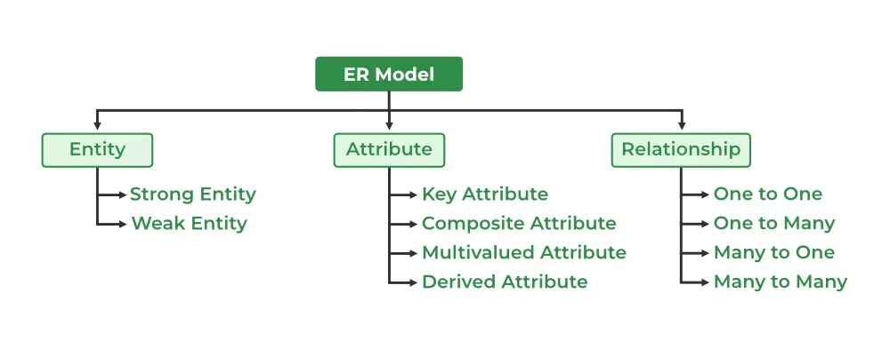
</p>

<p align="center"><em>Hình 1. Tổng quan về ER Model.</em></p>

---

## 3. Vai trò của ER Model trong thiết kế cơ sở dữ liệu

Quá trình thiết kế cơ sở dữ liệu thường gồm ba giai đoạn chính:

1. **Thu thập yêu cầu**

   Người thiết kế hỏi người dùng, khách hàng hoặc các bên liên quan về chức năng hệ thống và dữ liệu cần quản lý.

2. **Thiết kế khái niệm hoặc logic**

   ER Model thường được sử dụng ở bước này để mô tả các entity, attribute và relationship.

3. **Thiết kế vật lý**

   Sau khi có mô hình logic, người thiết kế xác định bảng, khóa, chỉ mục, view và các chi tiết triển khai trên DBMS cụ thể.

ER Diagram hữu ích vì:

- Biểu diễn dữ liệu và quan hệ dữ liệu bằng hình ảnh.
- Dễ chuyển đổi sang các bảng quan hệ.
- Có thể mô hình hóa đối tượng trong thế giới thực.
- Không yêu cầu người xem phải hiểu sâu về DBMS cụ thể.
- Giúp hệ thống phức tạp trở nên dễ hiểu hơn.

---

### Quiz nhanh 1: Tổng quan ER Model

**Câu 1.** ER Model chủ yếu được dùng để làm gì?

A. Thiết kế mô hình khái niệm của cơ sở dữ liệu  
B. Tăng tốc CPU của máy chủ  
C. Thiết kế giao diện người dùng  
D. Nén dữ liệu ảnh  

**Câu 2.** ER Diagram là gì?

A. Một công cụ sao lưu dữ liệu  
B. Biểu diễn đồ họa của ER Model  
C. Một hệ điều hành cơ sở dữ liệu  
D. Một ngôn ngữ lập trình web  

**Câu 3.** ER Model thường được dùng nhiều nhất ở bước nào trong thiết kế cơ sở dữ liệu?

A. Cấu hình card mạng  
B. Biên dịch mã nguồn  
C. Thiết kế khái niệm hoặc logic  
D. Xóa dữ liệu cũ  

---

## 4. Các thành phần chính của ER Model

ER Model gồm ba thành phần cốt lõi:

| Thành phần | Ý nghĩa | Ký hiệu thường dùng trong ERD |
|---|---|---|
| Entity | Đối tượng hoặc khái niệm cần lưu trữ dữ liệu | Hình chữ nhật |
| Attribute | Thuộc tính mô tả entity | Hình oval |
| Relationship | Mối liên kết giữa các entity | Hình thoi |

<p align="center">
  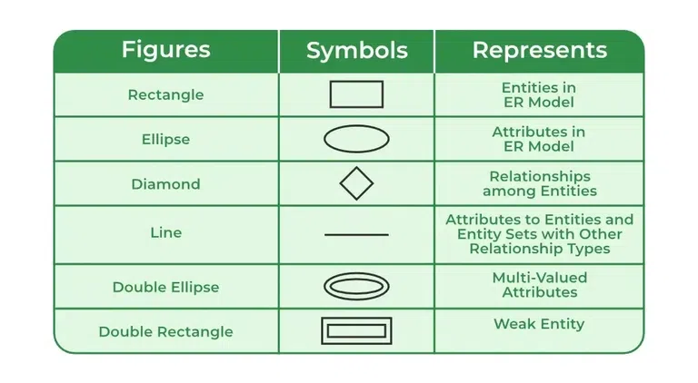
</p>

<p align="center"><em>Hình 2. Các thành phần cơ bản trong ER Diagram.</em></p>

---

## 5. Entity trong ER Model

### 5.1. Entity là gì?

**Entity** là một đối tượng, sự vật, khái niệm hoặc sự kiện trong thế giới thực mà hệ thống cần lưu trữ thông tin.

Ví dụ:

- `Student`
- `Course`
- `Employee`
- `Company`
- `Product`
- `Reservation`
- `Device`
- `Document`

Trong cơ sở dữ liệu quan hệ, entity thường được chuyển thành **bảng**.

Ví dụ: entity `Student` có thể được chuyển thành bảng `Students`.

---

### 5.2. Entity Type, Entity Instance và Entity Set

**Entity type** mô tả cấu trúc chung của một loại entity.

```text
Student(student_id, full_name, date_of_birth, email)
```

**Entity instance** là một đối tượng cụ thể thuộc entity type.

```text
S001, Nguyen An, 2005-01-15, an@example.com
```

**Entity set** là tập hợp tất cả các entity cùng một entity type.

Ví dụ: tập hợp tất cả sinh viên trong trường tạo thành entity set `Student`.

ER Diagram thường biểu diễn **entity type/entity set**, không biểu diễn từng dòng dữ liệu cụ thể.

<p align="center">
  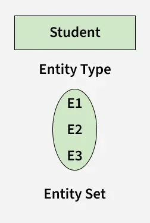
</p>

<p align="center"><em>Hình 3. Entity type, entity instance và entity set.</em></p>

---

## 6. Strong Entity và Weak Entity

### 6.1. Strong Entity

**Strong Entity** là loại entity có thể được định danh duy nhất bằng chính thuộc tính của nó.

Đặc điểm:

- Có **key attribute** hoặc **primary key**.
- Không phụ thuộc vào entity khác để xác định danh tính.
- Thường được biểu diễn bằng **hình chữ nhật đơn** trong ER Diagram.

Ví dụ:

- `Student` có `student_id`.
- `Employee` có `employee_id`.
- `Product` có `product_id`.

---

### 6.2. Weak Entity

**Weak Entity** là loại entity không thể được định danh duy nhất chỉ bằng thuộc tính của chính nó. Weak Entity cần phụ thuộc vào một **Strong Entity** để được xác định.

Đặc điểm:

- Không có khóa riêng đủ mạnh để định danh duy nhất.
- Phụ thuộc vào một identifying strong entity.
- Thường có **total participation** trong quan hệ với strong entity.
- Được biểu diễn bằng **hình chữ nhật kép**.
- Quan hệ định danh thường được biểu diễn bằng **hình thoi kép**.

Ví dụ:

Một công ty lưu thông tin người phụ thuộc của nhân viên. `Employee` là strong entity, còn `Dependent` là weak entity vì người phụ thuộc không thể tồn tại độc lập nếu không gắn với một nhân viên cụ thể.

<p align="center">
  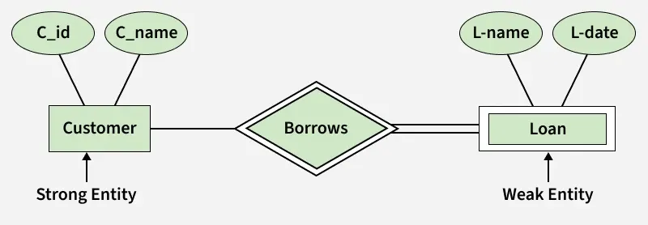
</p>

<p align="center"><em>Hình 4. Strong Entity và Weak Entity.</em></p>

---

### Quiz nhanh 2: Entity

**Câu 4.** Entity trong ER Model là gì?

A. Một kiểu dữ liệu số  
B. Một loại chỉ mục  
C. Một câu lệnh SQL  
D. Một đối tượng hoặc khái niệm trong thế giới thực cần lưu trữ thông tin  

**Câu 5.** Entity nào sau đây thường là ví dụ của strong entity?

A. Một số điện thoại phụ không có chủ sở hữu  
B. Một dòng log tạm thời không có định danh  
C. `Student` có `student_id` định danh duy nhất  
D. Một thuộc tính được suy ra từ ngày sinh  

**Câu 6.** Weak Entity có đặc điểm nào?

A. Luôn là một thuộc tính đa trị  
B. Phụ thuộc vào strong entity để được định danh  
C. Không thể xuất hiện trong ER Diagram  
D. Luôn được biểu diễn bằng hình oval đơn  

---

## 7. Attribute trong ER Model

**Attribute** là thuộc tính dùng để mô tả entity.

Ví dụ với entity `Student`, các attribute có thể gồm:

- `Roll_No`
- `Name`
- `DOB`
- `Age`
- `Address`
- `Mobile_No`

Trong ER Diagram, attribute thường được biểu diễn bằng **hình oval**.

<p align="center">
  
</p>

---

## 8. Các loại Attribute

### 8.0. Simple Attribute

**Simple Attribute** là thuộc tính không thể chia nhỏ hơn thành các thuộc tính có ý nghĩa độc lập.

Ví dụ:

- `Age`
- `Gender`
- `Roll_No`

<p align="center">
  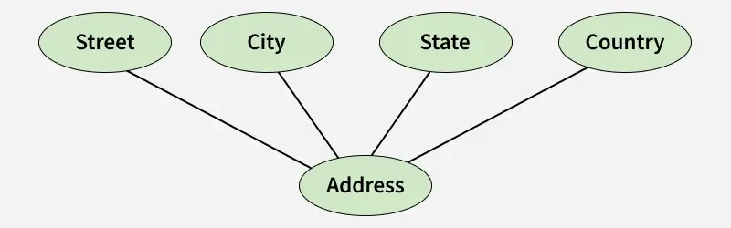
</p>

---

### 8.1. Key Attribute

**Key Attribute** là thuộc tính dùng để định danh duy nhất mỗi entity trong entity set.

Ví dụ:

- `Roll_No` định danh duy nhất mỗi sinh viên.
- `Employee_ID` định danh duy nhất mỗi nhân viên.
- `Product_ID` định danh duy nhất mỗi sản phẩm.

Trong ER Diagram, key attribute được biểu diễn bằng oval có **gạch chân**.

<p align="center">
  
</p>

---

### 8.2. Composite Attribute

**Composite Attribute** là thuộc tính có thể được chia thành nhiều thuộc tính nhỏ hơn.

Ví dụ, `Address` có thể gồm:

- `Street`
- `City`
- `State`
- `Country`

<p align="center">
  
</p>

---

### 8.3. Multivalued Attribute

**Multivalued Attribute** là thuộc tính có thể có nhiều giá trị đối với một entity.

Ví dụ:

- Một sinh viên có thể có nhiều số điện thoại.
- Một nhân viên có thể có nhiều kỹ năng.
- Một sản phẩm có thể có nhiều màu sắc.

Trong ER Diagram, multivalued attribute được biểu diễn bằng **oval kép**.

<p align="center">
  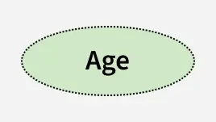
</p>

---

### 8.4. Derived Attribute

**Derived Attribute** là thuộc tính có thể được suy ra từ thuộc tính khác.

Ví dụ:

- `Age` có thể được suy ra từ `DOB`.
- `Total_Amount` có thể được tính từ số lượng và đơn giá.
- `Years_of_Service` có thể được tính từ ngày bắt đầu làm việc.

Trong ER Diagram, derived attribute được biểu diễn bằng **oval nét đứt**.

<p align="center">
  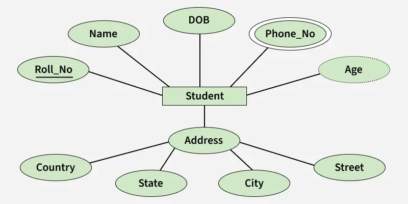
</p>

---

### Quiz nhanh 3: Attribute

**Câu 7.** Attribute trong ER Model dùng để làm gì?

A. Xóa toàn bộ cơ sở dữ liệu  
B. Tăng kích thước ổ cứng  
C. Mô tả thuộc tính của entity  
D. Thay thế hệ điều hành  

**Câu 8.** `Roll_No` dùng để định danh duy nhất sinh viên là loại attribute nào?

A. Composite Attribute  
B. Multivalued Attribute  
C. Derived Attribute  
D. Key Attribute  

**Câu 9.** `Address` gồm `Street`, `City`, `State`, `Country` là ví dụ của loại attribute nào?

A. Composite Attribute  
B. Derived Attribute  
C. Multivalued Attribute  
D. Weak Attribute  

**Câu 10.** `Age` được tính từ `DOB` là ví dụ của loại attribute nào?

A. Key Attribute  
B. Derived Attribute  
C. Composite Attribute  
D. Multivalued Attribute  

---

## 9. Relationship trong ER Model

**Relationship** mô tả mối liên kết giữa các entity.

Ví dụ:

- `Student` **enrolls in** `Course`.
- `Employee` **works for** `Department`.
- `Customer` **places** `Order`.
- `Doctor` **performs** `Surgery`.

Trong ER Diagram, relationship thường được biểu diễn bằng **hình thoi** và được nối với entity bằng các đường liên kết.

---

## 10. Relationship Type và Relationship Set

**Relationship Type** mô tả loại quan hệ giữa các entity type.

Ví dụ:

```text
Student -- Enrolled in -- Course
```

Ở đây, `Enrolled in` là relationship type.

**Relationship Set** là tập hợp các relationship cùng loại.

Ví dụ:

- Sinh viên S1 đăng ký Course C2.
- Sinh viên S2 đăng ký Course C1.
- Sinh viên S3 đăng ký Course C3.

Tất cả các quan hệ đăng ký này tạo thành một relationship set của loại `Enrolled in`.

<p align="center">
  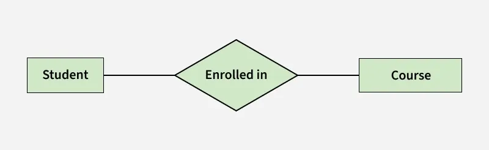
</p>

<p align="center"><em>Hình 5. Relationship type và relationship set.</em></p>

---

## 11. Degree of Relationship Set

**Degree** của relationship set là số lượng entity set khác nhau tham gia vào relationship set.

Có bốn dạng phổ biến:

1. **Unary / Recursive Relationship**: chỉ có một entity set tham gia.
2. **Binary Relationship**: có hai entity set tham gia.
3. **Ternary Relationship**: có ba entity set tham gia.
4. **N-ary Relationship**: có n entity set tham gia.

Ví dụ:

| Loại degree | Ví dụ |
|---|---|
| Unary / Recursive | Một nhân viên quản lý một nhân viên khác |
| Binary | Sinh viên đăng ký môn học |
| Ternary | Nhà cung cấp cung cấp linh kiện cho dự án |
| N-ary | Quan hệ có nhiều hơn ba entity set tham gia |

<p align="center">
  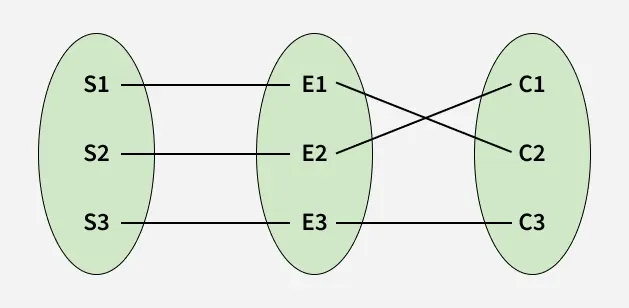
</p>

<p align="center"><em>Hình 6. Unary/Recursive Relationship.</em></p>

<p align="center">
  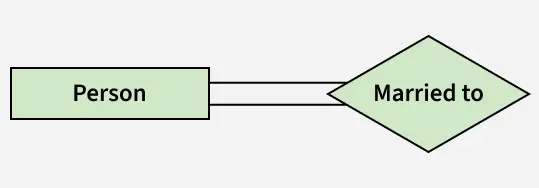
</p>

<p align="center"><em>Hình 7. Binary Relationship.</em></p>

<p align="center">
  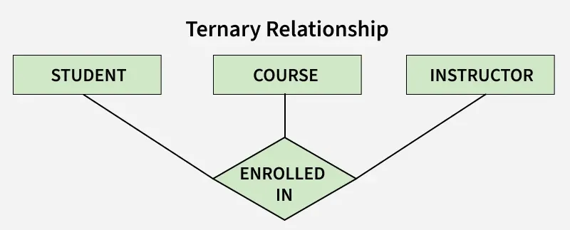
</p>

<p align="center"><em>Hình 8. Ternary Relationship.</em></p>

<p align="center">
  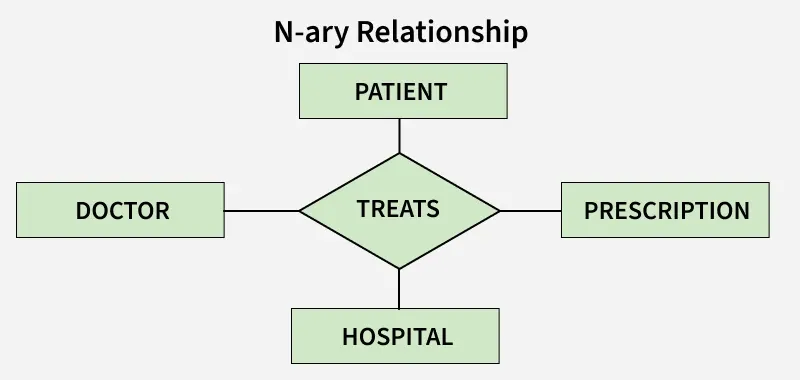
</p>

<p align="center"><em>Hình 9. N-ary Relationship.</em></p>

---

### Quiz nhanh 4: Relationship và Degree

**Câu 11.** Relationship trong ER Model biểu diễn điều gì?

A. Một loại font chữ  
B. Mối liên kết giữa các entity  
C. Một chỉ số hiệu năng CPU  
D. Một kiểu dữ liệu hình ảnh  

**Câu 12.** Relationship có hai entity set tham gia được gọi là gì?

A. Unary Relationship  
B. Ternary Relationship  
C. Binary Relationship  
D. N-ary Relationship  

**Câu 13.** Quan hệ một nhân viên quản lý một nhân viên khác là ví dụ của loại degree nào?

A. Ternary Relationship  
B. Binary Relationship  
C. N-ary Relationship  
D. Unary / Recursive Relationship  

**Câu 14.** Degree của relationship set cho biết điều gì?

A. Số lượng entity set tham gia vào relationship set  
B. Số lượng bản ghi trong database  
C. Số lượng cột trong một bảng  
D. Số lượng index được tạo ra  

---

## 12. Cardinality trong ER Model

**Cardinality** cho biết số lần tối đa mà một entity trong một entity set có thể tham gia vào một relationship set.

Cardinality giúp trả lời các câu hỏi:

- Một entity có thể liên kết với bao nhiêu entity khác?
- Quan hệ giữa hai entity là một-một, một-nhiều hay nhiều-nhiều?
- Khi chuyển sang bảng quan hệ, cần đặt khóa ngoại hoặc bảng trung gian như thế nào?

---

### 12.1. One-to-One Relationship

Quan hệ **one-to-one** xảy ra khi mỗi entity trong mỗi entity set chỉ tham gia tối đa một lần trong relationship.

Ví dụ:

- Một người chỉ có một hộ chiếu.
- Một hộ chiếu chỉ thuộc về một người.

```text
Person 1 -- 1 Passport
```

<p align="center">
  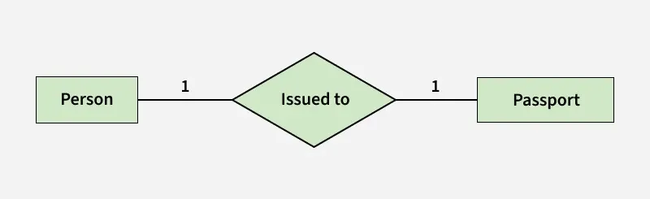
</p>

<p align="center">
  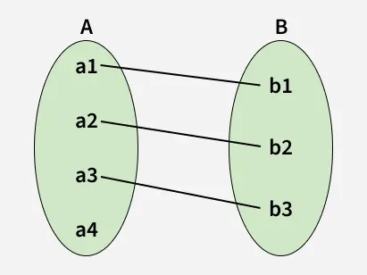
</p>

<p align="center"><em>Set representation của One-to-One Relationship.</em></p>

---

### 12.2. One-to-Many Relationship

Quan hệ **one-to-many** xảy ra khi một entity ở bên thứ nhất có thể liên kết với nhiều entity ở bên thứ hai.

Ví dụ:

- Một khoa có nhiều giảng viên.
- Một khách hàng có nhiều đơn hàng.
- Một lớp học có nhiều sinh viên.

```text
Department 1 -- M Doctor
```

<p align="center">
  
</p>

<p align="center">
  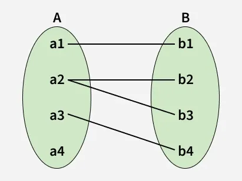
</p>

<p align="center"><em>Set representation của One-to-Many Relationship.</em></p>

---

### 12.3. Many-to-One Relationship

Quan hệ **many-to-one** là chiều ngược lại của one-to-many.

Ví dụ:

- Nhiều ca phẫu thuật có thể do một bác sĩ thực hiện.
- Nhiều đơn hàng thuộc về một khách hàng.
- Nhiều nhân viên thuộc về một phòng ban.

```text
Surgery M -- 1 Surgeon
```

<p align="center">
  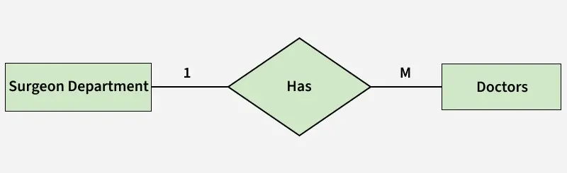
</p>

<p align="center">
  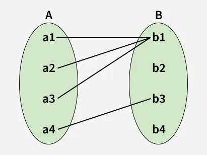
</p>

<p align="center"><em>Set representation của Many-to-One Relationship.</em></p>

---

### 12.4. Many-to-Many Relationship

Quan hệ **many-to-many** xảy ra khi entity ở cả hai bên đều có thể tham gia nhiều lần trong relationship.

Ví dụ:

- Một sinh viên học nhiều môn học.
- Một môn học có nhiều sinh viên.
- Một nhân viên làm nhiều dự án.
- Một dự án có nhiều nhân viên.

```text
Employee M -- N Project
```

Khi chuyển sang mô hình quan hệ, many-to-many thường cần một bảng trung gian.

Ví dụ:

```text
Students(student_id, full_name)
Courses(course_id, course_name)
Enrollments(student_id, course_id, semester, grade)
```

<p align="center">
  
</p>

<p align="center">
  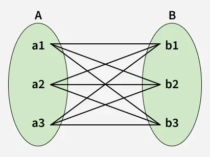
</p>

<p align="center"><em>Set representation của Many-to-Many Relationship.</em></p>

---

### Quiz nhanh 5: Cardinality

**Câu 15.** Cardinality trong ER Model cho biết điều gì?

A. Số lần tối đa một entity có thể tham gia vào relationship set  
B. Màu sắc của hình chữ nhật trong ERD  
C. Số lượng file backup  
D. Tốc độ truy vấn SQL  

**Câu 16.** Một người có một hộ chiếu và một hộ chiếu thuộc về một người là quan hệ gì?

A. One-to-Many  
B. Many-to-One  
C. One-to-One  
D. Many-to-Many  

**Câu 17.** Một khách hàng có nhiều đơn hàng là ví dụ của quan hệ gì?

A. One-to-One  
B. Many-to-Many  
C. Many-to-One  
D. One-to-Many  

**Câu 18.** Quan hệ sinh viên và môn học thường là quan hệ gì nếu một sinh viên học nhiều môn và một môn có nhiều sinh viên?

A. One-to-One  
B. Many-to-Many  
C. One-to-Many  
D. Recursive  

---

## 13. Participation Constraint

**Participation Constraint** là ràng buộc mô tả việc entity trong một entity set có bắt buộc phải tham gia vào relationship hay không.

Có hai loại chính:

1. **Total Participation**
2. **Partial Participation**

---

### 13.1. Total Participation

**Total Participation** nghĩa là mọi entity trong entity set đều phải tham gia vào relationship.

Ví dụ:

Nếu hệ thống quy định mỗi sinh viên bắt buộc phải đăng ký ít nhất một môn học, thì entity set `Student` có total participation trong relationship `Enrolled in`.

Trong ER Diagram, total participation thường được biểu diễn bằng **đường đôi**.

<p align="center">
  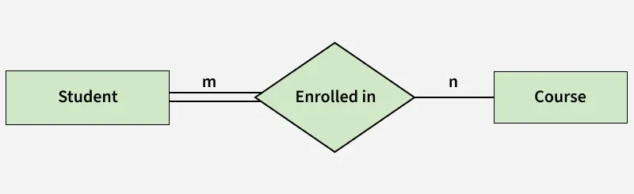
</p>

---

### 13.2. Partial Participation

**Partial Participation** nghĩa là entity trong entity set có thể tham gia hoặc không tham gia vào relationship.

Ví dụ:

Một số môn học có thể chưa có sinh viên nào đăng ký. Khi đó entity set `Course` có partial participation trong relationship `Enrolled in`.

Trong ER Diagram, partial participation thường được biểu diễn bằng **đường đơn**.

<p align="center">
  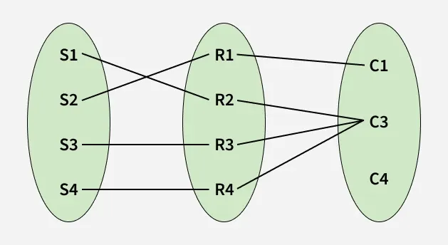
</p>

<p align="center"><em>Set representation minh họa Total Participation và Partial Participation.</em></p>

---

### Quiz nhanh 6: Participation Constraint

**Câu 19.** Total Participation có nghĩa là gì?

A. Entity không bao giờ tham gia relationship  
B. Chỉ một entity được tham gia relationship  
C. Tất cả entity trong entity set bắt buộc tham gia relationship  
D. Relationship bị xóa khỏi ERD  

**Câu 20.** Partial Participation có nghĩa là gì?

A. Entity có thể tham gia hoặc không tham gia relationship  
B. Entity bắt buộc phải tham gia relationship  
C. Entity luôn là weak entity  
D. Entity luôn có nhiều khóa chính  

---

## 14. Cách vẽ ER Diagram

Có thể vẽ ER Diagram theo các bước sau:

### Bước 1: Xác định Entity

Xác định tất cả các entity quan trọng trong hệ thống.

Ví dụ với hệ thống quản lý sinh viên:

- `Student`
- `Course`
- `Lecturer`
- `Class`
- `Department`

Biểu diễn entity bằng **hình chữ nhật**.

---

### Bước 2: Xác định Relationship

Xác định quan hệ giữa các entity.

Ví dụ:

- `Student` đăng ký `Course`.
- `Lecturer` dạy `Class`.
- `Department` quản lý `Lecturer`.

Biểu diễn relationship bằng **hình thoi**.

---

### Bước 3: Thêm Attribute

Gắn các attribute vào entity bằng các hình oval.

Ví dụ entity `Student` có thể có:

- `student_id`
- `full_name`
- `date_of_birth`
- `email`
- `phone_number`

---

### Bước 4: Xác định Primary Key

Với mỗi entity, xác định thuộc tính dùng để định danh duy nhất.

Ví dụ:

- `Student`: `student_id`
- `Course`: `course_id`
- `Lecturer`: `lecturer_id`

Trong ER Diagram, key attribute thường được gạch chân.


---

### Bước 5: Loại bỏ dư thừa

Xem lại sơ đồ để loại bỏ:

- Entity không cần thiết.
- Relationship trùng lặp.
- Attribute bị lặp.
- Mối quan hệ không có ý nghĩa nghiệp vụ.

---

### Bước 6: Kiểm tra độ rõ ràng

Cuối cùng, kiểm tra ER Diagram:

- Có dễ hiểu không?
- Có thể chuyển sang bảng quan hệ không?
- Có thể giải thích cho người dùng nghiệp vụ không?
- Có phản ánh đúng yêu cầu hệ thống không?

---

## 15. Ví dụ tổng hợp: Hệ thống đăng ký học phần

Xét hệ thống đăng ký học phần của trường đại học.

### 15.1. Entity

Các entity chính:

- `Student`
- `Course`
- `Lecturer`
- `Department`

### 15.2. Attribute

Entity `Student`:

- `student_id`
- `full_name`
- `email`
- `date_of_birth`

Entity `Course`:

- `course_id`
- `course_name`
- `credits`

Entity `Lecturer`:

- `lecturer_id`
- `full_name`
- `email`

Entity `Department`:

- `department_id`
- `department_name`

### 15.3. Relationship

Các relationship chính:

- `Student` **enrolls in** `Course`.
- `Lecturer` **teaches** `Course`.
- `Department` **offers** `Course`.
- `Department` **manages** `Lecturer`.

### 15.4. Cardinality

Một số cardinality:

- Một sinh viên có thể đăng ký nhiều học phần.
- Một học phần có thể có nhiều sinh viên đăng ký.
- Một giảng viên có thể dạy nhiều học phần.
- Một học phần có thể do một hoặc nhiều giảng viên phụ trách tùy quy định.
- Một khoa có thể quản lý nhiều giảng viên.

### 15.5. Chuyển sang bảng quan hệ

Có thể chuyển thành các bảng:

```text
Students(student_id, full_name, email, date_of_birth)
Courses(course_id, course_name, credits)
Lecturers(lecturer_id, full_name, email)
Departments(department_id, department_name)
Enrollments(student_id, course_id, semester, grade)
Teaches(lecturer_id, course_id, semester)
```

Trong đó:

- `student_id` là khóa chính của `Students`.
- `course_id` là khóa chính của `Courses`.
- `lecturer_id` là khóa chính của `Lecturers`.
- `department_id` là khóa chính của `Departments`.
- `Enrollments` là bảng trung gian cho quan hệ nhiều-nhiều giữa `Student` và `Course`.
- `Teaches` là bảng liên kết giữa `Lecturer` và `Course`.

---

### Quiz nhanh 7: Quy trình vẽ ERD

**Câu 21.** Khi vẽ ER Diagram, bước đầu tiên thường là gì?

A. Chọn màu nền cho sơ đồ  
B. Tạo index cho bảng  
C. Xóa toàn bộ relationship  
D. Xác định các entity quan trọng  

**Câu 22.** Trong ER Diagram, relationship thường được biểu diễn bằng ký hiệu nào?

A. Hình oval  
B. Hình chữ nhật  
C. Đường nét đứt  
D. Hình thoi  

---

## 16. Câu hỏi ôn tập

### 16.1. Câu hỏi tự luận ngắn

**Câu 1.** ER Model là gì? Vì sao ER Model được xem là mô hình khái niệm trong thiết kế cơ sở dữ liệu?

---

**Câu 2.** Phân biệt entity, attribute và relationship.

---

**Câu 3.** Phân biệt strong entity và weak entity. Cho ví dụ.

---

**Câu 4.** Trình bày bốn loại attribute thường gặp trong ER Model.

---

**Câu 5.** Degree của relationship set là gì? Cho ví dụ unary, binary và ternary relationship.

---

**Câu 6.** Cardinality là gì? Vì sao cardinality quan trọng khi chuyển ER Model sang mô hình quan hệ?

---

**Câu 7.** Phân biệt total participation và partial participation.

---

## 17. Bài tập vận dụng

### Bài tập 1

Một trường đại học cần xây dựng hệ thống quản lý sinh viên, học phần, giảng viên và khoa.

**Yêu cầu:**

1. Xác định các entity chính.
2. Liệt kê một số attribute cho từng entity.
3. Xác định relationship giữa các entity.
4. Xác định cardinality cho từng relationship.
5. Chuyển mô hình ER sang danh sách bảng quan hệ.

---

### Bài tập 2

Một cửa hàng online cần quản lý khách hàng, sản phẩm, đơn hàng và thanh toán.

**Yêu cầu:**

1. Xác định entity và attribute chính.
2. Xác định relationship giữa `Customer`, `Order`, `Product` và `Payment`.
3. Xác định relationship nào là one-to-many, relationship nào là many-to-many.
4. Đề xuất bảng trung gian nếu cần.

---

### Bài tập 3

Một công ty muốn lưu thông tin nhân viên và người phụ thuộc của nhân viên.

**Yêu cầu:**

1. Xác định strong entity và weak entity.
2. Giải thích vì sao một entity là weak entity.
3. Xác định identifying relationship.
4. Gợi ý cách chuyển sang bảng quan hệ.

---

### Bài tập 4

Một bệnh viện cần quản lý bệnh nhân, bác sĩ, khoa, ca phẫu thuật và thuốc.

**Yêu cầu:**

1. Xác định ít nhất 5 entity.
2. Xác định ít nhất 5 relationship.
3. Phân loại một số relationship theo degree và cardinality.
4. Chỉ ra relationship nào có thể cần bảng trung gian.

---

## 18. Tóm tắt bài học

- ER Model là mô hình khái niệm dùng để thiết kế cơ sở dữ liệu.
- ER Diagram là biểu diễn đồ họa của ER Model.
- Ba thành phần chính của ER Model là entity, attribute và relationship.
- Entity là đối tượng hoặc khái niệm cần lưu trữ dữ liệu.
- Strong entity có khóa định danh riêng; weak entity phụ thuộc vào strong entity.
- Attribute mô tả entity và có nhiều loại như key, composite, multivalued và derived attribute.
- Relationship biểu diễn mối liên kết giữa các entity.
- Degree cho biết số entity set tham gia vào relationship.
- Cardinality cho biết số lần tối đa entity có thể tham gia vào relationship.
- Participation constraint cho biết entity tham gia bắt buộc hay tùy chọn vào relationship.
- Quy trình vẽ ER Diagram gồm xác định entity, relationship, attribute, khóa chính, loại bỏ dư thừa và kiểm tra độ rõ ràng.

---

## 19. Từ khóa chính

- Entity-Relationship Model
- ER Model
- Entity-Relationship Diagram
- ERD
- Entity
- Entity Type
- Entity Set
- Entity Instance
- Strong Entity
- Weak Entity
- Attribute
- Simple Attribute
- Key Attribute
- Composite Attribute
- Multivalued Attribute
- Derived Attribute
- Relationship
- Relationship Type
- Relationship Set
- Degree
- Unary Relationship
- Binary Relationship
- Ternary Relationship
- N-ary Relationship
- Cardinality
- One-to-One
- One-to-Many
- Many-to-One
- Many-to-Many
- Participation Constraint
- Total Participation
- Partial Participation

---

## 20. Đáp án và gợi ý trả lời

### 20.1. Đáp án quiz nhanh

| Câu | Đáp án |
|---|---|
| 1 | A |
| 2 | B |
| 3 | C |
| 4 | D |
| 5 | C |
| 6 | B |
| 7 | C |
| 8 | D |
| 9 | A |
| 10 | B |
| 11 | B |
| 12 | C |
| 13 | D |
| 14 | A |
| 15 | A |
| 16 | C |
| 17 | D |
| 18 | B |
| 19 | C |
| 20 | A |
| 21 | D |
| 22 | D |

**Thống kê phân bố đáp án đúng:**

| Đáp án | Số câu |
|---|---:|
| A | 5 |
| B | 5 |
| C | 6 |
| D | 6 |

Số lượng đáp án đúng giữa các lựa chọn lệch nhau tối đa 1.

---

### 20.2. Gợi ý trả lời tự luận

#### Câu 1

ER Model là mô hình khái niệm dùng để thiết kế cơ sở dữ liệu thông qua entity, attribute và relationship. Nó được xem là mô hình khái niệm vì tập trung vào cách biểu diễn dữ liệu ở mức nghiệp vụ, chưa phụ thuộc vào DBMS cụ thể.

#### Câu 2

Entity là đối tượng hoặc khái niệm cần lưu trữ dữ liệu. Attribute là thuộc tính mô tả entity. Relationship là mối liên kết giữa các entity.

#### Câu 3

Strong entity có khóa định danh riêng và không phụ thuộc entity khác, ví dụ `Employee`. Weak entity không thể được định danh duy nhất bằng thuộc tính của chính nó và cần phụ thuộc vào strong entity, ví dụ `Dependent` phụ thuộc vào `Employee`.

#### Câu 4

Key attribute định danh duy nhất entity. Composite attribute có thể tách thành nhiều thuộc tính nhỏ hơn. Multivalued attribute có nhiều giá trị cho một entity. Derived attribute có thể được suy ra từ thuộc tính khác.

#### Câu 5

Degree là số lượng entity set tham gia vào relationship set. Unary có một entity set, ví dụ nhân viên quản lý nhân viên. Binary có hai entity set, ví dụ sinh viên đăng ký môn học. Ternary có ba entity set, ví dụ supplier cung cấp part cho project.

#### Câu 6

Cardinality cho biết số lần tối đa một entity có thể tham gia vào relationship. Nó quan trọng khi chuyển sang mô hình quan hệ vì giúp xác định khóa ngoại, bảng trung gian và cách tổ chức quan hệ giữa các bảng.

#### Câu 7

Total participation nghĩa là mọi entity trong entity set bắt buộc tham gia relationship. Partial participation nghĩa là entity có thể tham gia hoặc không tham gia relationship.

---

### 20.3. Gợi ý bài tập vận dụng

#### Bài tập 1

Có thể xác định entity `Student`, `Course`, `Lecturer`, `Department`. Relationship gồm `Student enrolls in Course`, `Lecturer teaches Course`, `Department offers Course`, `Department manages Lecturer`. Quan hệ `Student-Course` thường là many-to-many và cần bảng trung gian `Enrollments`.

#### Bài tập 2

Entity chính gồm `Customer`, `Product`, `Order`, `Payment`. Một customer có nhiều order; một order có một payment; một order có nhiều product và một product xuất hiện trong nhiều order, nên cần bảng trung gian `OrderDetails`.

#### Bài tập 3

`Employee` là strong entity vì có `employee_id`. `Dependent` là weak entity vì phụ thuộc vào `Employee` để được định danh. Identifying relationship có thể là `Employee has Dependent`. Khi chuyển sang bảng quan hệ, `Dependents` có thể dùng khóa chính ghép gồm `employee_id` và `dependent_name`.

#### Bài tập 4

Entity có thể gồm `Patient`, `Doctor`, `Department`, `Surgery`, `Medicine`. Relationship gồm `Doctor treats Patient`, `Doctor performs Surgery`, `Patient undergoes Surgery`, `Department manages Doctor`, `Medicine prescribed to Patient`. Quan hệ bác sĩ - bệnh nhân hoặc thuốc - bệnh nhân có thể là many-to-many và cần bảng trung gian.
