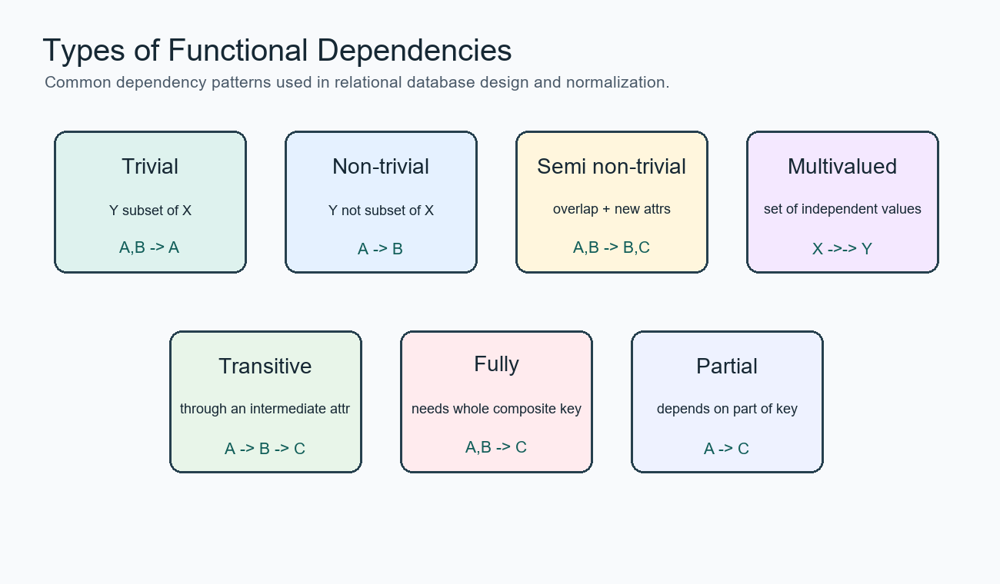
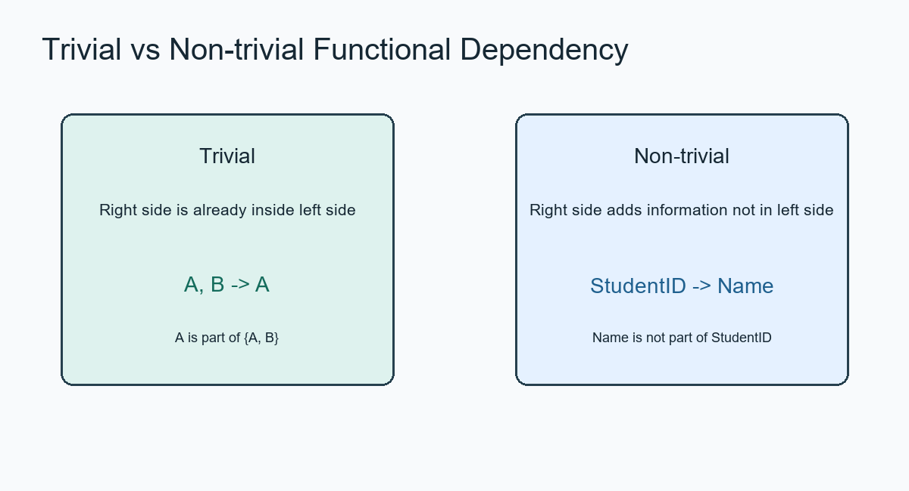
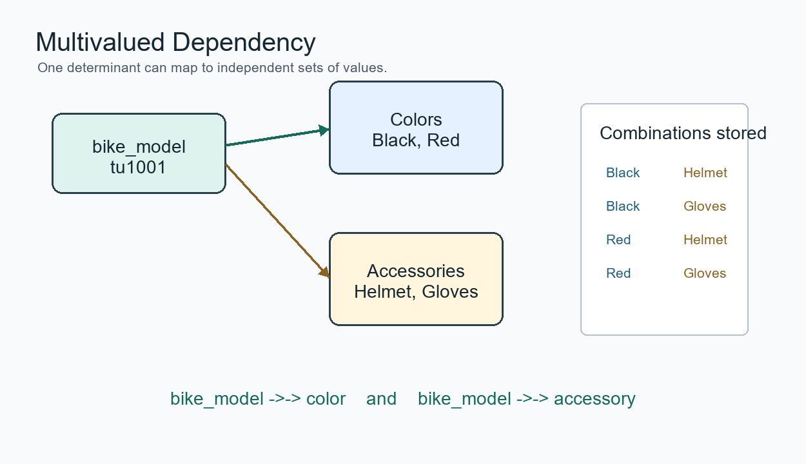
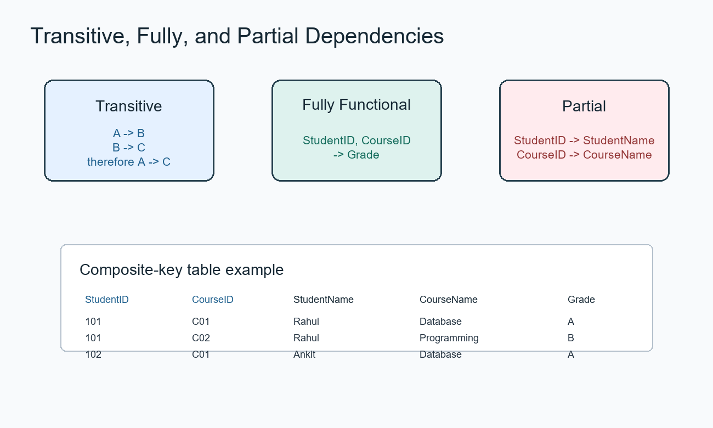
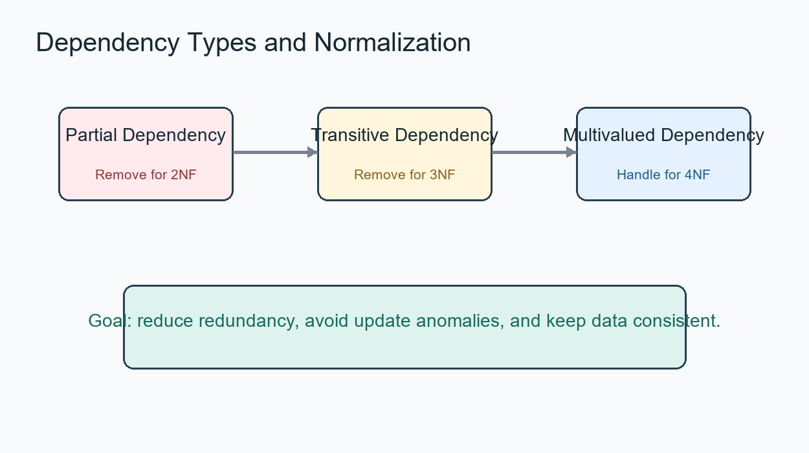
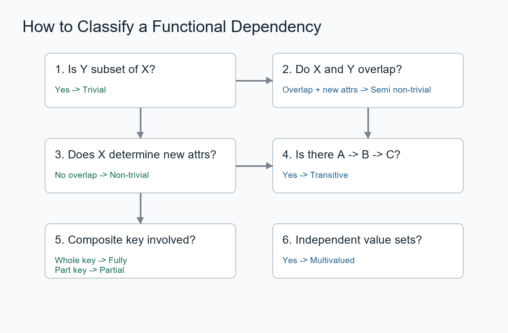

# Types of Functional Dependencies trong DBMS

**Cập nhật lần cuối:** 05/03/2026

**Nhóm bài học:** Data-Modeling

**Nguồn tham khảo:**

- [GeeksforGeeks - Types of Functional Dependencies in DBMS](https://www.geeksforgeeks.org/dbms/types-of-functional-dependencies-in-dbms/)
- [GeeksforGeeks - Functional Dependency in DBMS](https://www.geeksforgeeks.org/dbms/what-is-functional-dependency-in-dbms/)

---

## 1. Mục tiêu bài giảng

Sau khi hoàn thành bài học này, người học có thể:

1. Nhắc lại được khái niệm **functional dependency** trong DBMS.
2. Phân biệt được các loại phụ thuộc hàm phổ biến.
3. Xác định được phụ thuộc hàm **tầm thường**, **không tầm thường** và **bán không tầm thường**.
4. Nhận biết được phụ thuộc hàm **đầy đủ**, **bộ phận** và **bắc cầu**.
5. Giải thích được ý nghĩa của **multivalued dependency** trong thiết kế cơ sở dữ liệu.
6. Vận dụng kiến thức để phân tích bảng dữ liệu và phát hiện vấn đề dư thừa dữ liệu.
7. Làm được các câu hỏi trắc nghiệm và bài tập vận dụng về phụ thuộc hàm.

---

## 2. Giới thiệu tổng quan

Trong mô hình cơ sở dữ liệu quan hệ, dữ liệu được tổ chức thành các bảng. Mỗi bảng gồm nhiều thuộc tính. Giữa các thuộc tính này có thể tồn tại những mối quan hệ logic.

Một **phụ thuộc hàm** xảy ra khi một thuộc tính hoặc một tập thuộc tính xác định duy nhất giá trị của một thuộc tính khác.

Ký hiệu tổng quát:

```text
X → Y
```

Trong đó:

- `X` là **determinant**, tức vế trái của phụ thuộc hàm.
- `Y` là **dependent attribute**, tức vế phải của phụ thuộc hàm.
- `X → Y` nghĩa là: nếu biết giá trị của `X`, ta xác định được duy nhất giá trị của `Y`.

Ví dụ:

```text
StudentID → StudentName
```

Nghĩa là nếu biết `StudentID`, ta xác định được tên sinh viên tương ứng.

---

## 3. Vì sao cần phân loại phụ thuộc hàm?

Không phải mọi phụ thuộc hàm đều có cùng ý nghĩa trong thiết kế cơ sở dữ liệu.

Một số phụ thuộc hàm luôn đúng một cách hiển nhiên, ví dụ:

```text
A, B → A
```

Một số phụ thuộc hàm lại rất quan trọng vì giúp phát hiện dữ liệu dư thừa, ví dụ:

```text
StudentID → StudentName
CourseID → CourseName
```

Việc phân loại phụ thuộc hàm giúp ta:

- Phân tích quan hệ giữa các thuộc tính.
- Tìm khóa chính và khóa ứng viên.
- Phát hiện dữ liệu trùng lặp.
- Phát hiện phụ thuộc bộ phận và phụ thuộc bắc cầu.
- Chuẩn hóa bảng dữ liệu.
- Thiết kế cơ sở dữ liệu hợp lý hơn.

**Hình minh họa tổng quan:**



---

### Quiz nhanh: Tổng quan

**Câu 1.** Phụ thuộc hàm được ký hiệu bằng dạng nào?

A. `X + Y`  
B. `X → Y`  
C. `X = Y`  
D. `X / Y`  

**Câu 2.** Trong `X → Y`, `X` được gọi là gì?

A. Dependent attribute  
B. Determinant  
C. Foreign key  
D. Relation  

**Câu 3.** Việc phân loại phụ thuộc hàm giúp ích chủ yếu cho quá trình nào?

A. Chuẩn hóa cơ sở dữ liệu  
B. Thiết kế giao diện  
C. Lập lịch CPU  
D. Nén hình ảnh  

---

## 4. Các loại phụ thuộc hàm trong DBMS

Các loại phụ thuộc hàm thường gặp gồm:

1. **Trivial Functional Dependency**  
   Phụ thuộc hàm tầm thường.

2. **Non-trivial Functional Dependency**  
   Phụ thuộc hàm không tầm thường.

3. **Semi Non-trivial Functional Dependency**  
   Phụ thuộc hàm bán không tầm thường.

4. **Multivalued Dependency**  
   Phụ thuộc đa trị.

5. **Transitive Functional Dependency**  
   Phụ thuộc hàm bắc cầu.

6. **Fully Functional Dependency**  
   Phụ thuộc hàm đầy đủ.

7. **Partial Functional Dependency**  
   Phụ thuộc hàm bộ phận.

---

## 5. Trivial Functional Dependency

### 5.1. Khái niệm

Một phụ thuộc hàm `X → Y` được gọi là **trivial functional dependency** nếu `Y` là tập con của `X`.

Nói cách khác, vế phải đã nằm trong vế trái.

Ký hiệu:

```text
X → Y là tầm thường nếu Y ⊆ X
```

Ví dụ:

```text
A, B → A
A, B → B
A, B → A, B
```

Các phụ thuộc trên là tầm thường vì thuộc tính ở vế phải đã xuất hiện trong vế trái.

---

### 5.2. Ví dụ 1

Các phụ thuộc sau đều là phụ thuộc hàm tầm thường:

```text
ABC → AB
ABC → A
ABC → ABC
A → A
B → B
```

Giải thích:

- Trong `ABC → AB`, tập `AB` là tập con của `ABC`.
- Trong `ABC → A`, thuộc tính `A` nằm trong `ABC`.
- Trong `ABC → ABC`, vế phải giống vế trái.
- Trong `A → A`, thuộc tính `A` xác định chính nó.

---

### 5.3. Ví dụ 2

Xét bảng sau:

| roll_no | name | age |
|---|---|---|
| 42 | abc | 17 |
| 43 | pqr | 18 |
| 44 | xyz | 18 |

Phụ thuộc:

```text
roll_no, name → name
```

là phụ thuộc hàm tầm thường vì `name` là một phần của tập `{roll_no, name}`.

Tương tự:

```text
roll_no → roll_no
```

cũng là phụ thuộc hàm tầm thường.

---

### 5.4. Nhận xét

Phụ thuộc hàm tầm thường thường ít có giá trị trong việc phát hiện vấn đề thiết kế cơ sở dữ liệu, vì nó đúng một cách hiển nhiên.

Tuy nhiên, nó vẫn quan trọng trong lý thuyết phụ thuộc hàm và các luật suy diễn như **Armstrong's Axioms**.

---

## 6. Non-trivial Functional Dependency

### 6.1. Khái niệm

Một phụ thuộc hàm `X → Y` được gọi là **non-trivial functional dependency** nếu `Y` không phải là tập con của `X`.

Ký hiệu:

```text
X → Y là không tầm thường nếu Y ⊄ X
```

Nói cách khác, vế phải chứa thuộc tính mới, không nằm hoàn toàn trong vế trái.

---

### 6.2. Ví dụ 1

```text
Id → Name
Name → DOB
```

Nếu mỗi `Id` xác định duy nhất một `Name`, thì `Id → Name` là phụ thuộc hàm không tầm thường.

Nếu mỗi `Name` xác định duy nhất một `DOB` trong một ngữ cảnh cụ thể, thì `Name → DOB` cũng là phụ thuộc hàm không tầm thường.

---

### 6.3. Ví dụ 2

Xét bảng sau:

| roll_no | name | age |
|---|---|---|
| 42 | abc | 17 |
| 43 | pqr | 18 |
| 44 | xyz | 18 |

Phụ thuộc:

```text
roll_no → name
```

là phụ thuộc hàm không tầm thường vì `name` không nằm trong `roll_no`.

Phụ thuộc:

```text
roll_no, name → age
```

cũng là phụ thuộc hàm không tầm thường vì `age` không nằm trong `{roll_no, name}`.

---

### 6.4. Ý nghĩa

Phụ thuộc hàm không tầm thường có ý nghĩa quan trọng trong thiết kế cơ sở dữ liệu vì nó cho biết một thuộc tính hoặc một tập thuộc tính có thể xác định thêm thông tin khác.

Ví dụ:

```text
StudentID → StudentName
```

Phụ thuộc này cho biết `StudentID` có thể được dùng để xác định tên sinh viên.

**Hình minh họa trivial và non-trivial dependency:**



---

### Quiz nhanh: Trivial và Non-trivial

**Câu 1.** Phụ thuộc nào sau đây là tầm thường?

A. `A → B`  
B. `A, B → A`  
C. `StudentID → StudentName`  
D. `CourseID → CourseName`  

**Câu 2.** Phụ thuộc nào sau đây là không tầm thường?

A. `A, B → A`  
B. `A → A`  
C. `A, B → B`  
D. `A → B`  

**Câu 3.** Điều kiện để `X → Y` là tầm thường là gì?

A. `X` là tập con của `Y`  
B. `Y` là tập con của `X`  
C. `X` và `Y` không giao nhau  
D. `X` và `Y` luôn bằng nhau  

---

## 7. Semi Non-trivial Functional Dependency

### 7.1. Khái niệm

Một phụ thuộc hàm `X → Y` được gọi là **semi non-trivial functional dependency** nếu vế phải có một phần nằm trong vế trái và một phần không nằm trong vế trái.

Điều kiện thường dùng:

```text
X ∩ Y ≠ ∅
và
Y ⊄ X
```

Nói cách khác:

- `X` và `Y` có giao nhau.
- Nhưng `Y` không hoàn toàn là tập con của `X`.

Đây là trường hợp nằm giữa phụ thuộc hàm tầm thường và phụ thuộc hàm không tầm thường hoàn toàn.

---

### 7.2. Ví dụ đúng

Xét phụ thuộc:

```text
StudentID, CourseID → CourseID, CourseName
```

Ở đây:

- Vế trái: `{StudentID, CourseID}`
- Vế phải: `{CourseID, CourseName}`
- Giao giữa hai vế là `{CourseID}`
- Nhưng `CourseName` không nằm trong vế trái

Vì vậy, đây là phụ thuộc hàm bán không tầm thường.

---

### 7.3. Ví dụ với bảng dữ liệu

Xét bảng:

| StudentID | CourseID | CourseName |
|---|---|---|
| 101 | CSE101 | Computer Science |
| 102 | CSE102 | Data Structures |
| 103 | CSE101 | Computer Science |

Phụ thuộc:

```text
StudentID, CourseID → CourseID, CourseName
```

là bán không tầm thường vì:

- `CourseID` đã xuất hiện trong vế trái.
- `CourseName` chưa xuất hiện trong vế trái.
- Vế phải vừa có phần tầm thường, vừa có phần không tầm thường.

---

### 7.4. Lưu ý quan trọng

Phụ thuộc sau:

```text
StudentID, CourseID → CourseID
```

là phụ thuộc hàm **tầm thường**, không phải bán không tầm thường.

Lý do: vế phải `{CourseID}` là tập con của vế trái `{StudentID, CourseID}`.

Muốn là bán không tầm thường, vế phải cần có ít nhất một thuộc tính đã nằm trong vế trái và ít nhất một thuộc tính chưa nằm trong vế trái.

---

## 8. Multivalued Dependency

### 8.1. Khái niệm

**Multivalued Dependency** là phụ thuộc đa trị. Đây là một loại phụ thuộc thường được học cùng với phụ thuộc hàm, nhưng nó không hoàn toàn giống phụ thuộc hàm thông thường.

Ký hiệu:

```text
X →→ Y
```

Đọc là: `Y` phụ thuộc đa trị vào `X`.

Phụ thuộc đa trị xảy ra khi một giá trị của `X` xác định một tập giá trị của `Y`, và tập giá trị này độc lập với một tập thuộc tính khác.

---

### 8.2. Ý tưởng đơn giản

Giả sử một loại xe có nhiều màu và nhiều phụ kiện. Màu xe và phụ kiện là hai nhóm thông tin độc lập.

Ví dụ:

- Xe `tu1001` có màu: Black, Red.
- Xe `tu1001` có phụ kiện: Helmet, Gloves.

Màu xe không phụ thuộc vào phụ kiện.  
Phụ kiện cũng không phụ thuộc vào màu xe.  
Cả hai chỉ liên quan đến `bike_model`.

---

### 8.3. Ví dụ

Xét bảng sau:

| bike_model | color | accessory |
|---|---|---|
| tu1001 | Black | Helmet |
| tu1001 | Black | Gloves |
| tu1001 | Red | Helmet |
| tu1001 | Red | Gloves |

Trong bảng này:

- `X = bike_model`
- `Y = color`
- `Z = accessory`

Với mỗi `bike_model`, có một tập màu và một tập phụ kiện.

Ta có thể biểu diễn:

```text
bike_model →→ color
bike_model →→ accessory
```

---

### 8.4. Vì sao đây là phụ thuộc đa trị?

Với `bike_model = tu1001`:

- Tập màu là `{Black, Red}`
- Tập phụ kiện là `{Helmet, Gloves}`

Mỗi màu có thể kết hợp với mỗi phụ kiện. Vì vậy bảng có nhiều dòng kết hợp.

Điểm quan trọng là:

- `color` không xác định `accessory`.
- `accessory` không xác định `color`.
- Cả hai tập giá trị đều phụ thuộc vào `bike_model`.

---

### 8.5. Ý nghĩa trong thiết kế CSDL

Phụ thuộc đa trị có thể gây ra dữ liệu dư thừa.

Bảng trên có thể được tách thành:

**BikeColors**

| bike_model | color |
|---|---|
| tu1001 | Black |
| tu1001 | Red |

**BikeAccessories**

| bike_model | accessory |
|---|---|
| tu1001 | Helmet |
| tu1001 | Gloves |

Cách tách này giúp tránh việc phải lưu mọi tổ hợp giữa màu và phụ kiện.

**Hình minh họa multivalued dependency:**



---

### Quiz nhanh: Semi non-trivial và Multivalued

**Câu 1.** Điều kiện nào phù hợp với phụ thuộc hàm bán không tầm thường?

A. `Y ⊆ X`  
B. `X ∩ Y = ∅` và `Y ⊄ X`  
C. `X ∩ Y ≠ ∅` và `Y ⊄ X`  
D. `X = Y`  

**Câu 2.** Phụ thuộc nào sau đây là bán không tầm thường?

A. `A, B → A`  
B. `A, B → A, C`  
C. `A → A`  
D. `A → B`  

**Câu 3.** Ký hiệu của phụ thuộc đa trị là gì?

A. `X → Y`  
B. `X →→ Y`  
C. `X = Y`  
D. `X ⊆ Y`  

---

## 9. Transitive Functional Dependency

### 9.1. Khái niệm

Phụ thuộc hàm bắc cầu xảy ra khi một thuộc tính phụ thuộc gián tiếp vào một thuộc tính khác thông qua thuộc tính trung gian.

Nếu có:

```text
A → B
B → C
```

thì theo tính chất bắc cầu, ta suy ra:

```text
A → C
```

Khi đó, `A → C` là phụ thuộc hàm bắc cầu.

---

### 9.2. Ví dụ

Xét bảng sau:

| enrol_no | name | dept | building_no |
|---|---|---|---|
| 42 | abc | CO | 4 |
| 43 | pqr | EC | 2 |
| 44 | xyz | IT | 1 |
| 45 | abc | EC | 2 |

Ta có:

```text
enrol_no → dept
dept → building_no
```

Do đó, suy ra:

```text
enrol_no → building_no
```

Đây là phụ thuộc hàm bắc cầu vì `building_no` phụ thuộc gián tiếp vào `enrol_no` thông qua `dept`.

---

### 9.3. Vấn đề gây ra

Phụ thuộc bắc cầu có thể gây dư thừa dữ liệu.

Ví dụ, nếu nhiều sinh viên thuộc cùng khoa `EC`, thì `building_no = 2` sẽ bị lặp lại nhiều lần.

Nếu muốn thay đổi tòa nhà của khoa `EC`, ta phải cập nhật nhiều dòng. Nếu cập nhật thiếu dòng, dữ liệu sẽ bị không nhất quán.

---

### 9.4. Cách xử lý

Có thể tách bảng thành hai bảng:

**Students**

| enrol_no | name | dept |
|---|---|---|
| 42 | abc | CO |
| 43 | pqr | EC |
| 44 | xyz | IT |
| 45 | abc | EC |

**Departments**

| dept | building_no |
|---|---|
| CO | 4 |
| EC | 2 |
| IT | 1 |

Khi đó:

- Thông tin sinh viên nằm trong bảng `Students`.
- Thông tin khoa và tòa nhà nằm trong bảng `Departments`.
- Dữ liệu ít trùng lặp hơn.

---

## 10. Fully Functional Dependency

### 10.1. Khái niệm

Một phụ thuộc hàm `X → Y` được gọi là **fully functional dependency** nếu `Y` phụ thuộc vào toàn bộ tập thuộc tính `X`, và không phụ thuộc vào bất kỳ tập con thực sự nào của `X`.

Nói cách khác, nếu bỏ đi một thuộc tính nào đó khỏi `X`, ta không còn xác định được `Y`.

---

### 10.2. Ví dụ

Xét bảng điểm sinh viên:

| StudentID | CourseID | Grade |
|---|---|---|
| 101 | C01 | A |
| 101 | C02 | B |
| 102 | C01 | A |

Giả sử khóa ghép là:

```text
StudentID, CourseID
```

Phụ thuộc:

```text
StudentID, CourseID → Grade
```

là phụ thuộc hàm đầy đủ nếu:

- Chỉ biết `StudentID` thì chưa biết điểm của sinh viên ở môn nào.
- Chỉ biết `CourseID` thì chưa biết điểm của sinh viên nào.
- Cần biết cả `StudentID` và `CourseID` mới xác định được `Grade`.

---

### 10.3. Ý nghĩa

Phụ thuộc hàm đầy đủ rất quan trọng trong chuẩn hóa đến **dạng chuẩn 2NF**.

Một bảng đạt 2NF khi:

- Bảng đã ở 1NF.
- Không có thuộc tính không khóa phụ thuộc bộ phận vào một phần của khóa ghép.

---

## 11. Partial Functional Dependency

### 11.1. Khái niệm

Phụ thuộc hàm bộ phận xảy ra khi một thuộc tính không khóa phụ thuộc vào một phần của khóa ghép, thay vì phụ thuộc vào toàn bộ khóa ghép.

Giả sử quan hệ `R` có các thuộc tính `X, Y, Z`.

Nếu:

- `(X, Y)` là khóa ghép.
- `Z` là thuộc tính không khóa.
- `X → Z`

thì `Z` phụ thuộc bộ phận vào khóa ghép `(X, Y)`.

---

### 11.2. Ví dụ

Xét bảng:

| StudentID | CourseID | StudentName | CourseName | Grade |
|---|---|---|---|---|
| 101 | C01 | Rahul | Database | A |
| 101 | C02 | Rahul | Programming | B |
| 102 | C01 | Ankit | Database | A |

Khóa ghép:

```text
StudentID, CourseID
```

Các phụ thuộc:

```text
StudentID → StudentName
CourseID → CourseName
StudentID, CourseID → Grade
```

Trong đó:

- `StudentID → StudentName` là phụ thuộc bộ phận.
- `CourseID → CourseName` là phụ thuộc bộ phận.
- `StudentID, CourseID → Grade` là phụ thuộc đầy đủ.

---

### 11.3. Vì sao phụ thuộc bộ phận gây vấn đề?

Trong bảng trên:

- `StudentName` bị lặp lại nếu sinh viên học nhiều môn.
- `CourseName` bị lặp lại nếu nhiều sinh viên học cùng môn.
- Khi sửa tên môn học, phải sửa nhiều dòng.
- Nếu sửa thiếu dòng, dữ liệu không nhất quán.

---

### 11.4. Cách xử lý phụ thuộc bộ phận

Có thể tách bảng thành ba bảng:

**Students**

| StudentID | StudentName |
|---|---|
| 101 | Rahul |
| 102 | Ankit |

**Courses**

| CourseID | CourseName |
|---|---|
| C01 | Database |
| C02 | Programming |

**Enrollments**

| StudentID | CourseID | Grade |
|---|---|---|
| 101 | C01 | A |
| 101 | C02 | B |
| 102 | C01 | A |

Sau khi tách:

- Thông tin sinh viên chỉ lưu một lần.
- Thông tin môn học chỉ lưu một lần.
- Bảng đăng ký học lưu quan hệ sinh viên - môn học và điểm.

**Hình minh họa transitive, fully và partial dependency:**



---

### Quiz nhanh: Transitive, Fully và Partial

**Câu 1.** Nếu `A → B` và `B → C`, phụ thuộc nào có thể suy ra?

A. `C → A`  
B. `A → C`  
C. `C → B`  
D. `B → A`  

**Câu 2.** Phụ thuộc đầy đủ xảy ra khi nào?

A. Thuộc tính phụ thuộc vào toàn bộ khóa ghép  
B. Thuộc tính phụ thuộc vào một phần khóa ghép  
C. Vế phải là tập con của vế trái  
D. Hai thuộc tính không liên quan  

**Câu 3.** Phụ thuộc bộ phận thường gây ra vấn đề gì?

A. Giảm dữ liệu trùng lặp  
B. Tăng tính nhất quán  
C. Gây dữ liệu dư thừa và bất thường cập nhật  
D. Làm bảng không có khóa chính  

---

## 12. Bảng so sánh các loại phụ thuộc

| Loại phụ thuộc | Điều kiện chính | Ví dụ | Ý nghĩa |
|---|---|---|---|
| Trivial | `Y ⊆ X` | `A, B → A` | Luôn đúng hiển nhiên |
| Non-trivial | `Y ⊄ X` | `A → B` | Có ý nghĩa trong thiết kế |
| Semi non-trivial | `X ∩ Y ≠ ∅` và `Y ⊄ X` | `A, B → B, C` | Vừa có phần tầm thường vừa có phần không tầm thường |
| Multivalued | `X` xác định một tập giá trị độc lập của `Y` | `bike_model →→ color` | Liên quan đến dữ liệu đa trị |
| Transitive | `A → B`, `B → C`, suy ra `A → C` | `enrol_no → building_no` qua `dept` | Gây dư thừa, liên quan 3NF |
| Fully | Phụ thuộc vào toàn bộ khóa ghép | `StudentID, CourseID → Grade` | Cần cho thiết kế đúng 2NF |
| Partial | Phụ thuộc vào một phần khóa ghép | `StudentID → StudentName` | Vi phạm 2NF |

**Hình minh họa bản đồ các loại phụ thuộc và chuẩn hóa:**



---

## 13. Quy trình xác định loại phụ thuộc hàm

Để xác định loại của một phụ thuộc hàm `X → Y`, có thể làm theo các bước sau:

1. **Kiểm tra vế phải có nằm trong vế trái không.**

   Nếu `Y ⊆ X`, đây là phụ thuộc hàm tầm thường.

2. **Kiểm tra vế trái và vế phải có giao nhau không.**

   Nếu `X ∩ Y ≠ ∅` và `Y ⊄ X`, đây là phụ thuộc hàm bán không tầm thường.

3. **Kiểm tra vế phải có hoàn toàn nằm ngoài vế trái không.**

   Nếu `X ∩ Y = ∅`, đây thường là phụ thuộc hàm không tầm thường hoàn toàn.

4. **Kiểm tra có thuộc tính trung gian không.**

   Nếu `A → B` và `B → C`, thì `A → C` là phụ thuộc bắc cầu.

5. **Kiểm tra khóa ghép.**

   Nếu bảng có khóa ghép, cần xét:
   - Thuộc tính phụ thuộc vào toàn bộ khóa ghép: phụ thuộc đầy đủ.
   - Thuộc tính phụ thuộc vào một phần khóa ghép: phụ thuộc bộ phận.

6. **Kiểm tra dữ liệu đa trị độc lập.**

   Nếu một thuộc tính xác định nhiều giá trị độc lập của một thuộc tính khác, có thể tồn tại phụ thuộc đa trị.

**Hình minh họa quy trình phân loại:**



---

## 14. Ứng dụng trong chuẩn hóa dữ liệu

Các loại phụ thuộc hàm có liên quan trực tiếp đến các dạng chuẩn trong cơ sở dữ liệu.

### 14.1. Liên quan đến 2NF

Dạng chuẩn 2NF yêu cầu loại bỏ phụ thuộc bộ phận.

Nếu bảng có khóa ghép và thuộc tính không khóa phụ thuộc vào một phần của khóa ghép, bảng chưa đạt 2NF.

Ví dụ:

```text
StudentID → StudentName
CourseID → CourseName
```

trong bảng có khóa ghép `(StudentID, CourseID)` là các phụ thuộc bộ phận.

---

### 14.2. Liên quan đến 3NF

Dạng chuẩn 3NF yêu cầu loại bỏ phụ thuộc bắc cầu giữa các thuộc tính không khóa.

Ví dụ:

```text
enrol_no → dept
dept → building_no
```

suy ra:

```text
enrol_no → building_no
```

Nếu `building_no` là thuộc tính không khóa phụ thuộc thông qua `dept`, bảng có thể chưa đạt 3NF.

---

### 14.3. Liên quan đến 4NF

Dạng chuẩn 4NF liên quan đến phụ thuộc đa trị.

Nếu bảng có phụ thuộc đa trị không hợp lý, có thể cần tách bảng để tránh lưu trữ các tổ hợp dư thừa.

Ví dụ:

```text
bike_model →→ color
bike_model →→ accessory
```

Nên tách thành bảng màu xe và bảng phụ kiện xe.

---

### Quiz nhanh: Quy trình và chuẩn hóa

**Câu 1.** Khi `Y ⊆ X`, `X → Y` thuộc loại phụ thuộc nào?

A. Tầm thường  
B. Bắc cầu  
C. Đa trị  
D. Bộ phận  

**Câu 2.** Phụ thuộc bộ phận liên quan trực tiếp đến dạng chuẩn nào?

A. 1NF  
B. 2NF  
C. 3NF  
D. 4NF  

**Câu 3.** Phụ thuộc đa trị thường được xử lý trong dạng chuẩn nào?

A. 1NF  
B. 2NF  
C. 3NF  
D. 4NF  

---

## 15. Câu hỏi ôn tập

### 15.1. Câu hỏi trắc nghiệm

**Câu 1.** Phụ thuộc hàm tầm thường có điều kiện nào?

A. `Y ⊆ X`  
B. `X ⊆ Y`  
C. `X ∩ Y = ∅`  
D. `X` và `Y` không liên quan  

---

**Câu 2.** Phụ thuộc nào sau đây là tầm thường?

A. `A → B`  
B. `A, B → A`  
C. `StudentID → StudentName`  
D. `Dept → Building`  

---

**Câu 3.** Phụ thuộc nào sau đây là không tầm thường?

A. `A → A`  
B. `A, B → A`  
C. `A → B`  
D. `A, B → A, B`  

---

**Câu 4.** Phụ thuộc nào sau đây là bán không tầm thường?

A. `A, B → A`  
B. `A, B → A, C`  
C. `A → A`  
D. `A → B`  

---

**Câu 5.** Phụ thuộc đa trị thường được ký hiệu như thế nào?

A. `X → Y`  
B. `X →→ Y`  
C. `X = Y`  
D. `X ⊆ Y`  

---

**Câu 6.** Nếu `A → B` và `B → C`, thì `A → C` là loại phụ thuộc nào?

A. Tầm thường  
B. Bộ phận  
C. Bắc cầu  
D. Đa trị  

---

**Câu 7.** Phụ thuộc đầy đủ xảy ra khi thuộc tính phụ thuộc vào:

A. Một phần khóa ghép  
B. Toàn bộ khóa ghép  
C. Một thuộc tính không khóa  
D. Một bảng khác  

---

**Câu 8.** Phụ thuộc bộ phận thường xuất hiện khi nào?

A. Khi bảng có khóa ghép  
B. Khi bảng chỉ có một cột  
C. Khi không có thuộc tính nào  
D. Khi mọi thuộc tính đều giống nhau  

---

**Câu 9.** Phụ thuộc bộ phận thường vi phạm dạng chuẩn nào?

A. 1NF  
B. 2NF  
C. 4NF  
D. 5NF  

---

**Câu 10.** Phụ thuộc đa trị thường liên quan đến dạng chuẩn nào?

A. 1NF  
B. 2NF  
C. 3NF  
D. 4NF  

---

### 15.2. Câu hỏi tự luận ngắn

**Câu 1.** Trình bày khái niệm phụ thuộc hàm tầm thường và cho ví dụ.

---

**Câu 2.** Phân biệt phụ thuộc hàm tầm thường và không tầm thường.

---

**Câu 3.** Phụ thuộc hàm bán không tầm thường là gì? Cho ví dụ đúng.

---

**Câu 4.** Giải thích phụ thuộc hàm bắc cầu và nêu một ví dụ.

---

**Câu 5.** Phân biệt phụ thuộc hàm đầy đủ và phụ thuộc hàm bộ phận.

---

**Câu 6.** Phụ thuộc đa trị là gì? Vì sao nó có thể gây dư thừa dữ liệu?

---

## 16. Bài tập vận dụng

### Bài tập 1

Cho các phụ thuộc hàm sau:

```text
A, B → A
A → B
A, B → A, C
A, B → A, B
```

**Yêu cầu:**  
Phân loại từng phụ thuộc thành tầm thường, không tầm thường hoặc bán không tầm thường.

---

### Bài tập 2

Cho bảng `Students`:

| roll_no | name | age |
|---|---|---|
| 42 | abc | 17 |
| 43 | pqr | 18 |
| 44 | xyz | 18 |

**Yêu cầu:**  
Xác định loại của các phụ thuộc sau:

```text
roll_no, name → name
roll_no → name
roll_no, name → age
roll_no → roll_no
```

---

### Bài tập 3

Cho bảng:

| enrol_no | name | dept | building_no |
|---|---|---|---|
| 42 | abc | CO | 4 |
| 43 | pqr | EC | 2 |
| 44 | xyz | IT | 1 |
| 45 | abc | EC | 2 |

Biết rằng:

```text
enrol_no → dept
dept → building_no
```

**Yêu cầu:**  
Xác định phụ thuộc bắc cầu và đề xuất cách tách bảng.

---

### Bài tập 4

Cho bảng:

| StudentID | CourseID | StudentName | CourseName | Grade |
|---|---|---|---|---|
| 101 | C01 | Rahul | Database | A |
| 101 | C02 | Rahul | Programming | B |
| 102 | C01 | Ankit | Database | A |

Biết khóa ghép là:

```text
StudentID, CourseID
```

**Yêu cầu:**  

1. Xác định phụ thuộc đầy đủ.
2. Xác định phụ thuộc bộ phận.
3. Đề xuất cách tách bảng để đạt thiết kế tốt hơn.

---

### Bài tập 5

Cho bảng:

| bike_model | color | accessory |
|---|---|---|
| tu1001 | Black | Helmet |
| tu1001 | Black | Gloves |
| tu1001 | Red | Helmet |
| tu1001 | Red | Gloves |

**Yêu cầu:**  

1. Xác định phụ thuộc đa trị.
2. Giải thích vì sao `color` và `accessory` độc lập với nhau.
3. Đề xuất cách tách bảng để giảm dư thừa.

---

## 17. Tóm tắt bài học

- Phụ thuộc hàm mô tả quan hệ trong đó một thuộc tính hoặc tập thuộc tính xác định thuộc tính khác.
- Phụ thuộc hàm tầm thường xảy ra khi vế phải là tập con của vế trái.
- Phụ thuộc hàm không tầm thường xảy ra khi vế phải không phải là tập con của vế trái.
- Phụ thuộc hàm bán không tầm thường xảy ra khi hai vế có giao nhau, nhưng vế phải không nằm hoàn toàn trong vế trái.
- Phụ thuộc đa trị dùng ký hiệu `X →→ Y` và mô tả trường hợp một thuộc tính xác định nhiều giá trị độc lập.
- Phụ thuộc bắc cầu xảy ra khi một thuộc tính phụ thuộc gián tiếp thông qua thuộc tính trung gian.
- Phụ thuộc đầy đủ yêu cầu thuộc tính phụ thuộc vào toàn bộ khóa ghép.
- Phụ thuộc bộ phận xảy ra khi thuộc tính không khóa phụ thuộc vào một phần của khóa ghép.
- Phụ thuộc bộ phận liên quan đến 2NF, phụ thuộc bắc cầu liên quan đến 3NF, phụ thuộc đa trị liên quan đến 4NF.

---

## 18. Từ khóa chính

- Functional Dependency
- Trivial Functional Dependency
- Non-trivial Functional Dependency
- Semi Non-trivial Functional Dependency
- Multivalued Dependency
- Transitive Functional Dependency
- Fully Functional Dependency
- Partial Functional Dependency
- Determinant
- Dependent attribute
- Composite key
- Non-key attribute
- Normalization
- 2NF
- 3NF
- 4NF

---

## 19. Đáp án và gợi ý trả lời

### Quiz nhanh: Tổng quan

- **Câu 1.** B
- **Câu 2.** B
- **Câu 3.** A

### Quiz nhanh: Trivial và Non-trivial

- **Câu 1.** B
- **Câu 2.** D
- **Câu 3.** B

### Quiz nhanh: Semi non-trivial và Multivalued

- **Câu 1.** C
- **Câu 2.** B
- **Câu 3.** B

### Quiz nhanh: Transitive, Fully và Partial

- **Câu 1.** B
- **Câu 2.** A
- **Câu 3.** C

### Quiz nhanh: Quy trình và chuẩn hóa

- **Câu 1.** A
- **Câu 2.** B
- **Câu 3.** D

---

### Câu hỏi ôn tập - Trắc nghiệm

- **Câu 1.** A
- **Câu 2.** B
- **Câu 3.** C
- **Câu 4.** B
- **Câu 5.** B
- **Câu 6.** C
- **Câu 7.** B
- **Câu 8.** A
- **Câu 9.** B
- **Câu 10.** D

---

### Câu hỏi ôn tập - Tự luận ngắn

#### Câu 1

**Gợi ý trả lời:**  
Phụ thuộc hàm tầm thường là phụ thuộc `X → Y` trong đó `Y` là tập con của `X`. Ví dụ: `A, B → A`.

#### Câu 2

**Gợi ý trả lời:**  
Phụ thuộc tầm thường có vế phải nằm trong vế trái. Phụ thuộc không tầm thường có vế phải không phải là tập con của vế trái. Ví dụ: `A, B → A` là tầm thường, còn `A → B` là không tầm thường.

#### Câu 3

**Gợi ý trả lời:**  
Phụ thuộc bán không tầm thường là phụ thuộc `X → Y` trong đó `X` và `Y` có giao nhau, nhưng `Y` không hoàn toàn nằm trong `X`. Ví dụ: `A, B → B, C`.

#### Câu 4

**Gợi ý trả lời:**  
Phụ thuộc bắc cầu xảy ra khi `A → B` và `B → C`, từ đó suy ra `A → C`. Ví dụ: `enrol_no → dept`, `dept → building_no`, nên `enrol_no → building_no`.

#### Câu 5

**Gợi ý trả lời:**  
Phụ thuộc đầy đủ xảy ra khi thuộc tính phụ thuộc vào toàn bộ khóa ghép. Phụ thuộc bộ phận xảy ra khi thuộc tính không khóa chỉ phụ thuộc vào một phần của khóa ghép.

#### Câu 6

**Gợi ý trả lời:**  
Phụ thuộc đa trị xảy ra khi một thuộc tính xác định một tập giá trị độc lập của thuộc tính khác. Nó có thể gây dư thừa vì bảng phải lưu nhiều tổ hợp giữa các giá trị độc lập.

---

### Bài tập vận dụng

#### Bài tập 1

**Gợi ý trả lời:**

| Phụ thuộc | Loại |
|---|---|
| `A, B → A` | Tầm thường |
| `A → B` | Không tầm thường |
| `A, B → A, C` | Bán không tầm thường |
| `A, B → A, B` | Tầm thường |

---

#### Bài tập 2

**Gợi ý trả lời:**

| Phụ thuộc | Loại |
|---|---|
| `roll_no, name → name` | Tầm thường |
| `roll_no → name` | Không tầm thường |
| `roll_no, name → age` | Không tầm thường |
| `roll_no → roll_no` | Tầm thường |

---

#### Bài tập 3

**Gợi ý trả lời:**

Từ:

```text
enrol_no → dept
dept → building_no
```

suy ra:

```text
enrol_no → building_no
```

Đây là phụ thuộc bắc cầu.

Có thể tách thành:

**Students**

| enrol_no | name | dept |
|---|---|---|
| 42 | abc | CO |
| 43 | pqr | EC |
| 44 | xyz | IT |
| 45 | abc | EC |

**Departments**

| dept | building_no |
|---|---|
| CO | 4 |
| EC | 2 |
| IT | 1 |

---

#### Bài tập 4

**Gợi ý trả lời:**

Phụ thuộc đầy đủ:

```text
StudentID, CourseID → Grade
```

Phụ thuộc bộ phận:

```text
StudentID → StudentName
CourseID → CourseName
```

Có thể tách thành:

**Students**

| StudentID | StudentName |
|---|---|
| 101 | Rahul |
| 102 | Ankit |

**Courses**

| CourseID | CourseName |
|---|---|
| C01 | Database |
| C02 | Programming |

**Enrollments**

| StudentID | CourseID | Grade |
|---|---|---|
| 101 | C01 | A |
| 101 | C02 | B |
| 102 | C01 | A |

---

#### Bài tập 5

**Gợi ý trả lời:**

Phụ thuộc đa trị:

```text
bike_model →→ color
bike_model →→ accessory
```

`color` và `accessory` độc lập vì một màu bất kỳ có thể kết hợp với nhiều phụ kiện và một phụ kiện bất kỳ có thể xuất hiện với nhiều màu.

Có thể tách thành:

**BikeColors**

| bike_model | color |
|---|---|
| tu1001 | Black |
| tu1001 | Red |

**BikeAccessories**

| bike_model | accessory |
|---|---|
| tu1001 | Helmet |
| tu1001 | Gloves |

---
