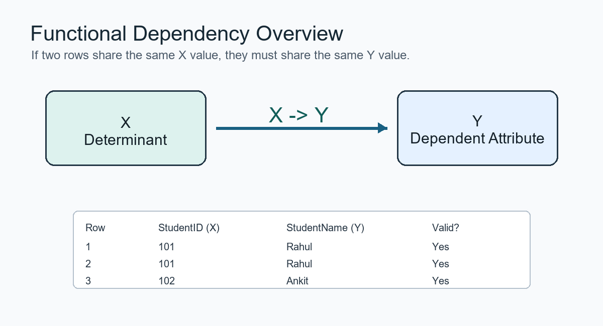
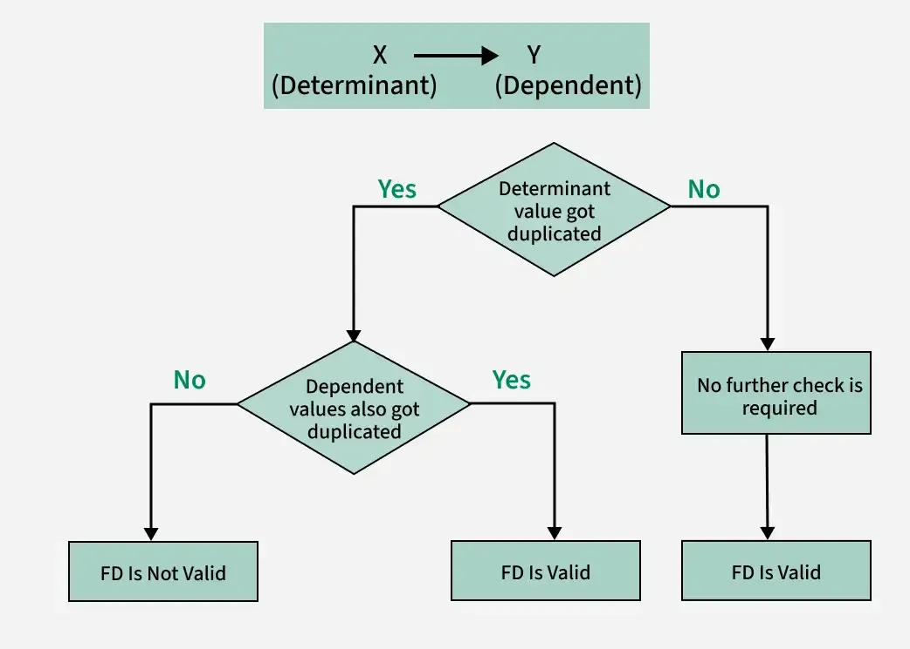
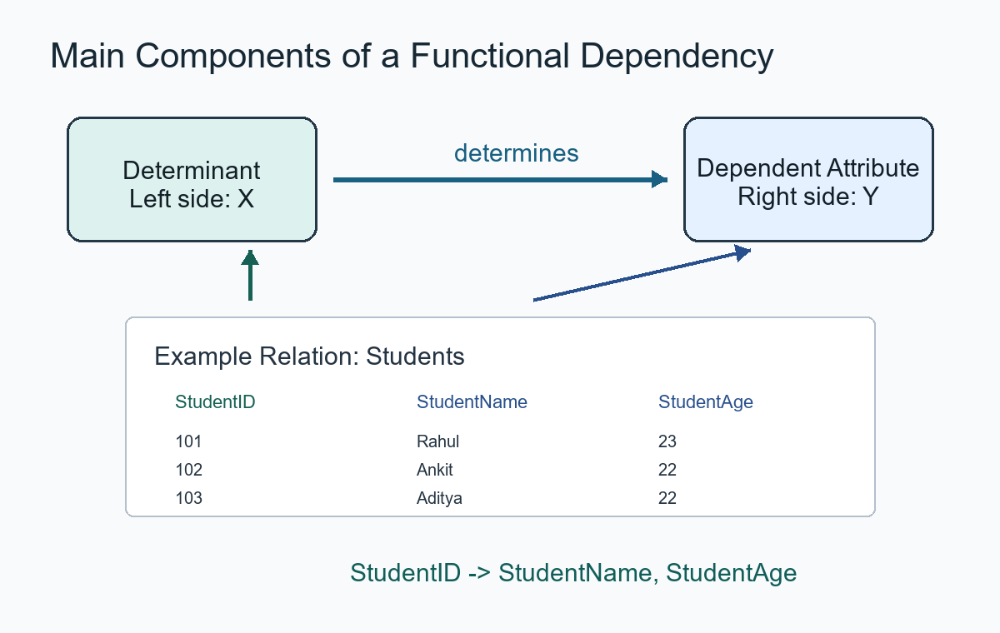

# Functional Dependency trong DBMS

**Cập nhật lần cuối:** 24/04/2026

**Nguồn tham khảo:**  
- GeeksforGeeks: Functional Dependency in DBMS
---

## 1. Mục tiêu bài giảng

Sau khi hoàn thành bài học này, người học có thể:

1. Trình bày được khái niệm **phụ thuộc hàm** trong cơ sở dữ liệu.
2. Giải thích được ý nghĩa của ký hiệu `X → Y`.
3. Xác định được **determinant** và **dependent attribute** trong một phụ thuộc hàm.
4. Kiểm tra được một phụ thuộc hàm có đúng hay không trên một bảng dữ liệu cụ thể.
5. Phân biệt được các phụ thuộc hàm đúng và không đúng.
6. Hiểu được vai trò của phụ thuộc hàm trong thiết kế cơ sở dữ liệu và chuẩn hóa dữ liệu.

---

## 2. Giới thiệu tổng quan

Trong hệ quản trị cơ sở dữ liệu, dữ liệu thường được lưu trong các bảng gồm nhiều thuộc tính khác nhau. Giữa các thuộc tính này có thể tồn tại những mối quan hệ logic.

Ví dụ, trong bảng sinh viên, nếu biết **StudentID**, ta có thể xác định được tên và tuổi của sinh viên đó. Khi một thuộc tính hoặc một tập thuộc tính có thể xác định duy nhất giá trị của thuộc tính khác, ta gọi đó là **phụ thuộc hàm**.

Phụ thuộc hàm là nền tảng quan trọng trong:

- Thiết kế cơ sở dữ liệu quan hệ.
- Phân tích quan hệ giữa các thuộc tính.
- Chuẩn hóa dữ liệu.
- Giảm trùng lặp dữ liệu.
- Hạn chế lỗi khi thêm, sửa, xóa dữ liệu.

**Hình minh họa tổng quan:**



---

### Quiz nhanh: Giới thiệu tổng quan

**Câu 1.** Phụ thuộc hàm thường được dùng trong lĩnh vực nào?

A. Thiết kế giao diện người dùng  
B. Thiết kế cơ sở dữ liệu quan hệ  
C. Thiết kế mạng máy tính  
D. Thiết kế phần cứng  

**Câu 2.** Mục đích chính của việc sử dụng phụ thuộc hàm là gì?

A. Tăng kích thước bảng dữ liệu  
B. Tạo nhiều bản sao dữ liệu  
C. Phân tích quan hệ giữa các thuộc tính  
D. Xóa toàn bộ dữ liệu trùng lặp mà không cần kiểm tra  

**Câu 3.** Phụ thuộc hàm có vai trò quan trọng trong quá trình nào?

A. Chuẩn hóa dữ liệu  
B. Mã hóa hình ảnh  
C. Biên dịch chương trình  
D. Thiết kế giao thức mạng  

---

## 3. Khái niệm cơ bản

### 3.1. Phụ thuộc hàm là gì?

Một **phụ thuộc hàm** xảy ra khi giá trị của một thuộc tính hoặc một tập thuộc tính xác định duy nhất giá trị của một thuộc tính khác.

Phụ thuộc hàm được ký hiệu như sau:

```text
X → Y
```

Trong đó:

- `X` là vế trái của phụ thuộc hàm.
- `Y` là vế phải của phụ thuộc hàm.
- `X` xác định duy nhất `Y`.

Nói cách khác, nếu hai dòng trong bảng có cùng giá trị của `X`, thì chúng bắt buộc phải có cùng giá trị của `Y`.

**Hình minh họa determinant và dependent attribute:**



---

### 3.2. Determinant là gì?

Trong phụ thuộc hàm:

```text
X → Y
```

`X` được gọi là **determinant**, tức là thuộc tính hoặc tập thuộc tính quyết định giá trị của thuộc tính khác.

Ví dụ:

```text
StudentID → StudentName
```

Ở đây, `StudentID` là determinant vì từ mã sinh viên có thể xác định được tên sinh viên.

---

### 3.3. Dependent attribute là gì?

Trong phụ thuộc hàm:

```text
X → Y
```

`Y` được gọi là **dependent attribute**, tức là thuộc tính phụ thuộc vào `X`.

Ví dụ:

```text
StudentID → StudentAge
```

Ở đây, `StudentAge` là thuộc tính phụ thuộc vì tuổi sinh viên được xác định bởi `StudentID`.

---

## 4. Ví dụ minh họa

Xét bảng `Students` gồm các thuộc tính sau:

| StudentID | StudentName | StudentAge |
|---|---|---|
| 101 | Rahul | 23 |
| 102 | Ankit | 22 |
| 103 | Aditya | 22 |
| 104 | Sahil | 24 |
| 105 | Ankit | 23 |

Từ bảng trên, ta có các phụ thuộc hàm sau:

```text
StudentID → StudentName
StudentID → StudentAge
```

Lý do:

- Mỗi `StudentID` là duy nhất.
- Khi biết `StudentID`, ta xác định được chính xác `StudentName`.
- Khi biết `StudentID`, ta xác định được chính xác `StudentAge`.

Ví dụ:

```text
StudentID = 101 → StudentName = Rahul
StudentID = 101 → StudentAge = 23
```

---

### 4.1. Phụ thuộc hàm không đúng

Trong bảng trên, phụ thuộc sau không đúng:

```text
StudentName → StudentAge
```

Lý do là tên `Ankit` xuất hiện ở hai dòng khác nhau:

| StudentID | StudentName | StudentAge |
|---|---|---|
| 102 | Ankit | 22 |
| 105 | Ankit | 23 |

Cùng một `StudentName = Ankit` nhưng có hai giá trị `StudentAge` khác nhau là `22` và `23`.

Vì vậy:

```text
StudentName → StudentAge
```

không phải là phụ thuộc hàm đúng.

Tương tự:

```text
StudentAge → StudentName
```

cũng không đúng, vì nhiều sinh viên có thể có cùng tuổi nhưng khác tên.

---

### Quiz nhanh: Khái niệm cơ bản

**Câu 1.** Trong phụ thuộc hàm `X → Y`, `X` được gọi là gì?

A. Dependent attribute  
B. Determinant  
C. Primary output  
D. Foreign value  

**Câu 2.** Ý nghĩa của `X → Y` là gì?

A. Y xác định X  
B. X và Y không liên quan  
C. X xác định duy nhất Y  
D. X luôn nhỏ hơn Y  

**Câu 3.** Phụ thuộc hàm nào đúng với bảng `Students` ở trên?

A. StudentName → StudentAge  
B. StudentAge → StudentName  
C. StudentID → StudentName  
D. StudentAge → StudentID  

---

## 5. Cách biểu diễn phụ thuộc hàm trong DBMS

Phụ thuộc hàm thường được biểu diễn dưới dạng:

```text
Vế trái → Vế phải
```

Ví dụ, xét bảng nhân viên có các thuộc tính:

- EmployeeID
- FirstName
- LastName

Nếu mỗi `EmployeeID` xác định duy nhất họ và tên của nhân viên, ta có thể viết:

```text
EmployeeID → FirstName, LastName
```

Điều này có nghĩa là:

- Biết `EmployeeID` thì biết được `FirstName`.
- Biết `EmployeeID` thì biết được `LastName`.

---

### 5.1. Vế trái của phụ thuộc hàm

Vế trái là thuộc tính hoặc tập thuộc tính dùng để xác định giá trị thuộc tính khác.

Ví dụ:

```text
X → Y, Z
```

Ở đây, `X` là vế trái.

---

### 5.2. Vế phải của phụ thuộc hàm

Vế phải là thuộc tính hoặc tập thuộc tính được xác định bởi vế trái.

Ví dụ:

```text
X → Y, Z
```

Ở đây, `Y` và `Z` là vế phải.

---

### 5.3. Phụ thuộc hàm có nhiều thuộc tính ở vế phải

Một phụ thuộc hàm có thể có nhiều thuộc tính ở vế phải.

Ví dụ:

```text
StudentID → StudentName, StudentAge
```

Phụ thuộc này có thể tách thành:

```text
StudentID → StudentName
StudentID → StudentAge
```

---

### Quiz nhanh: Cách biểu diễn

**Câu 1.** Phụ thuộc hàm thường được biểu diễn bằng ký hiệu nào?

A. `X + Y`  
B. `X → Y`  
C. `X = Y`  
D. `X / Y`  

**Câu 2.** Trong `EmployeeID → FirstName, LastName`, vế trái là gì?

A. FirstName  
B. LastName  
C. EmployeeID  
D. FirstName và LastName  

**Câu 3.** Phụ thuộc `X → Y, Z` có nghĩa là gì?

A. X xác định Y và Z  
B. Y xác định X và Z  
C. Z xác định X và Y  
D. X, Y, Z không liên quan  

---

## 6. Cách kiểm tra một phụ thuộc hàm

Để kiểm tra một phụ thuộc hàm `X → Y` có đúng hay không trên một bảng dữ liệu, ta thực hiện các bước sau:

1. Tìm các dòng có cùng giá trị của `X`.
2. Kiểm tra giá trị tương ứng của `Y`.
3. Nếu mọi dòng có cùng `X` đều có cùng `Y`, thì `X → Y` đúng.
4. Nếu tồn tại hai dòng có cùng `X` nhưng khác `Y`, thì `X → Y` sai.

---

### Ví dụ kiểm tra

Kiểm tra phụ thuộc:

```text
StudentName → StudentAge
```

Bảng dữ liệu có hai dòng:

| StudentID | StudentName | StudentAge |
|---|---|---|
| 102 | Ankit | 22 |
| 105 | Ankit | 23 |

Hai dòng có cùng `StudentName = Ankit` nhưng khác `StudentAge`.

Do đó:

```text
StudentName → StudentAge
```

là phụ thuộc hàm sai.

---

### Quiz nhanh: Cách kiểm tra phụ thuộc hàm

**Câu 1.** Khi kiểm tra `X → Y`, bước đầu tiên cần làm là gì?

A. Xóa các dòng trùng nhau  
B. Tìm các dòng có cùng giá trị của `X`  
C. Sắp xếp bảng theo `Y`  
D. Đổi tên các thuộc tính  

**Câu 2.** Nếu hai dòng có cùng `X` nhưng khác `Y`, phụ thuộc `X → Y` được kết luận như thế nào?

A. Đúng  
B. Sai  
C. Tầm thường  
D. Không thể kiểm tra  

**Câu 3.** Trong ví dụ `StudentName → StudentAge`, vì sao phụ thuộc này sai?

A. Vì `StudentName` không phải là số  
B. Vì `StudentAge` không phải là khóa chính  
C. Vì cùng tên `Ankit` nhưng có hai tuổi khác nhau  
D. Vì bảng có quá ít cột  

---

## 7. Các thành phần chính của phụ thuộc hàm

**Hình minh họa các thành phần chính:**



### 7.1. Thuộc tính

Thuộc tính là cột trong bảng dữ liệu.

Ví dụ trong bảng `Students`:

- `StudentID`
- `StudentName`
- `StudentAge`

---

### 7.2. Determinant

Determinant là thuộc tính hoặc tập thuộc tính nằm ở vế trái của phụ thuộc hàm.

Ví dụ:

```text
StudentID → StudentName
```

`StudentID` là determinant.

---

### 7.3. Dependent attribute

Dependent attribute là thuộc tính nằm ở vế phải và phụ thuộc vào determinant.

Ví dụ:

```text
StudentID → StudentAge
```

`StudentAge` là dependent attribute.

---

### 7.4. Bảng dữ liệu

Bảng dữ liệu là nơi ta kiểm tra phụ thuộc hàm có đúng hay không.

Một phụ thuộc hàm không chỉ được viết theo suy luận, mà cần phù hợp với ý nghĩa nghiệp vụ và dữ liệu thực tế.

---

### Quiz nhanh: Các thành phần chính

**Câu 1.** Thành phần nào nằm ở vế trái của phụ thuộc hàm?

A. Dependent attribute  
B. Determinant  
C. Tuple  
D. Record  

**Câu 2.** Trong `StudentID → StudentAge`, thuộc tính phụ thuộc là gì?

A. StudentID  
B. StudentAge  
C. Students  
D. ID  

**Câu 3.** Một bảng dữ liệu gồm các hàng và cột. Cột trong bảng còn được gọi là gì?

A. Thuộc tính  
B. Bản ghi  
C. Câu lệnh  
D. Khóa ngoại  

---

## 8. Phân loại phụ thuộc hàm

Trong DBMS, phụ thuộc hàm có thể được phân loại thành một số nhóm phổ biến sau:

1. **Phụ thuộc hàm tầm thường**
2. **Phụ thuộc hàm không tầm thường**
3. **Phụ thuộc hàm đầy đủ**
4. **Phụ thuộc hàm bộ phận**
5. **Phụ thuộc hàm bắc cầu**

---

## 9. Phụ thuộc hàm tầm thường và không tầm thường

### 9.1. Phụ thuộc hàm tầm thường

Một phụ thuộc hàm `X → Y` được gọi là **tầm thường** nếu `Y` là tập con của `X`.

Ví dụ:

```text
StudentID, StudentName → StudentName
```

Phụ thuộc này luôn đúng vì `StudentName` đã nằm trong vế trái.

---

### 9.2. Phụ thuộc hàm không tầm thường

Một phụ thuộc hàm `X → Y` được gọi là **không tầm thường** nếu `Y` không phải là tập con của `X`.

Ví dụ:

```text
StudentID → StudentName
```

Ở đây, `StudentName` không nằm trong `StudentID`, nên đây là phụ thuộc hàm không tầm thường.

---

### 9.3. So sánh

| Tiêu chí | Phụ thuộc hàm tầm thường | Phụ thuộc hàm không tầm thường |
|---|---|---|
| Điều kiện | Vế phải là tập con của vế trái | Vế phải không phải tập con của vế trái |
| Ý nghĩa | Thường hiển nhiên đúng | Có ý nghĩa trong thiết kế CSDL |
| Ví dụ | `A, B → A` | `A → B` |
| Vai trò | Ít dùng trong phân tích thiết kế | Quan trọng trong chuẩn hóa |

---

### Quiz nhanh: Phân loại cơ bản

**Câu 1.** Phụ thuộc nào sau đây là tầm thường?

A. `A → B`  
B. `A, B → A`  
C. `StudentID → StudentName`  
D. `Name → Age`  

**Câu 2.** Phụ thuộc nào sau đây là không tầm thường?

A. `A, B → A`  
B. `A, B → B`  
C. `StudentID → StudentName`  
D. `A → A`  

**Câu 3.** Phụ thuộc hàm không tầm thường thường quan trọng vì lý do nào?

A. Giúp phân tích quan hệ giữa các thuộc tính  
B. Luôn không đúng  
C. Không liên quan đến chuẩn hóa  
D. Chỉ dùng trong lập trình giao diện  

---

## 10. Phụ thuộc hàm đầy đủ và phụ thuộc hàm bộ phận

### 10.1. Phụ thuộc hàm đầy đủ

Một thuộc tính `Y` phụ thuộc hàm đầy đủ vào tập thuộc tính `X` nếu `Y` phụ thuộc vào toàn bộ `X`, không phụ thuộc vào một phần nhỏ hơn của `X`.

Ví dụ:

```text
StudentID, CourseID → Grade
```

Nếu điểm số `Grade` chỉ xác định được khi biết cả `StudentID` và `CourseID`, thì đây là phụ thuộc hàm đầy đủ.

---

### 10.2. Phụ thuộc hàm bộ phận

Phụ thuộc hàm bộ phận xảy ra khi một thuộc tính không khóa phụ thuộc vào một phần của khóa ghép.

Ví dụ:

| StudentID | CourseID | StudentName | Grade |
|---|---|---|---|
| 101 | C01 | Rahul | A |
| 101 | C02 | Rahul | B |
| 102 | C01 | Ankit | A |

Khóa ghép có thể là:

```text
StudentID, CourseID
```

Ta có:

```text
StudentID → StudentName
```

`StudentName` chỉ phụ thuộc vào `StudentID`, không phụ thuộc vào toàn bộ khóa ghép `(StudentID, CourseID)`.

Đây là phụ thuộc hàm bộ phận.

---

## 11. Phụ thuộc hàm bắc cầu

Phụ thuộc hàm bắc cầu xảy ra khi một thuộc tính phụ thuộc vào một thuộc tính khác thông qua một thuộc tính trung gian.

Nếu có:

```text
A → B
B → C
```

thì ta có thể suy ra:

```text
A → C
```

Ví dụ:

| StudentID | DepartmentID | DepartmentName |
|---|---|---|
| 101 | D01 | Computer Science |
| 102 | D02 | Information Systems |
| 103 | D01 | Computer Science |

Ta có:

```text
StudentID → DepartmentID
DepartmentID → DepartmentName
```

Suy ra:

```text
StudentID → DepartmentName
```

Đây là phụ thuộc bắc cầu.

---

### Quiz nhanh: Phụ thuộc đầy đủ, bộ phận và bắc cầu

**Câu 1.** Phụ thuộc bộ phận thường xuất hiện khi nào?

A. Khi bảng không có thuộc tính nào  
B. Khi có khóa ghép và thuộc tính không khóa phụ thuộc vào một phần của khóa ghép  
C. Khi mọi thuộc tính đều là khóa chính  
D. Khi bảng chỉ có một cột  

**Câu 2.** Nếu `A → B` và `B → C`, ta có thể suy ra gì?

A. `C → A`  
B. `A → C`  
C. `B → A`  
D. `C → B`  

**Câu 3.** Trong `StudentID, CourseID → Grade`, nếu cần cả hai thuộc tính để xác định `Grade`, đây là loại phụ thuộc nào?

A. Phụ thuộc hàm đầy đủ  
B. Phụ thuộc hàm tầm thường  
C. Phụ thuộc hàm bắc cầu  
D. Phụ thuộc hàm sai  

---

## 12. Vai trò của phụ thuộc hàm trong chuẩn hóa dữ liệu

Phụ thuộc hàm là nền tảng của quá trình **chuẩn hóa cơ sở dữ liệu**.

Chuẩn hóa là quá trình tổ chức lại các bảng dữ liệu nhằm:

- Giảm dữ liệu trùng lặp.
- Hạn chế lỗi khi cập nhật dữ liệu.
- Tăng tính nhất quán của dữ liệu.
- Tách bảng lớn thành các bảng nhỏ hợp lý hơn.
- Cải thiện thiết kế cơ sở dữ liệu.

---

### 12.1. Ví dụ về vấn đề trùng lặp dữ liệu

Xét bảng sau:

| StudentID | StudentName | CourseID | CourseName |
|---|---|---|---|
| 101 | Rahul | C01 | Database |
| 101 | Rahul | C02 | Programming |
| 102 | Ankit | C01 | Database |

Ta thấy `StudentName` bị lặp lại nhiều lần nếu một sinh viên học nhiều môn.

Phụ thuộc hàm:

```text
StudentID → StudentName
CourseID → CourseName
```

Từ đó, ta có thể tách thành các bảng:

**Students**

| StudentID | StudentName |
|---|---|
| 101 | Rahul |
| 102 | Ankit |

**Courses**

| CourseID | CourseName |
|---|---|
| C01 | Database |
| C02 | Programming |

**Enrollments**

| StudentID | CourseID |
|---|---|
| 101 | C01 |
| 101 | C02 |
| 102 | C01 |

Cách thiết kế này giúp giảm trùng lặp và dễ bảo trì dữ liệu hơn.

---

### Quiz nhanh: Vai trò trong chuẩn hóa

**Câu 1.** Phụ thuộc hàm là nền tảng của quá trình nào?

A. Chuẩn hóa dữ liệu  
B. Nén ảnh  
C. Mã hóa âm thanh  
D. Thiết kế CPU  

**Câu 2.** Một lợi ích của chuẩn hóa là gì?

A. Làm tăng trùng lặp dữ liệu  
B. Làm dữ liệu khó cập nhật hơn  
C. Giảm trùng lặp dữ liệu  
D. Xóa khóa chính khỏi bảng  

**Câu 3.** Nếu `CourseID → CourseName`, điều đó có nghĩa là gì?

A. CourseName xác định CourseID  
B. CourseID xác định CourseName  
C. CourseID và CourseName không liên quan  
D. CourseID luôn là số nguyên  

---

## 13. Ứng dụng thực tế

Phụ thuộc hàm được sử dụng trong nhiều tình huống thực tế liên quan đến cơ sở dữ liệu.

### 13.1. Thiết kế bảng dữ liệu

Khi thiết kế bảng, ta dùng phụ thuộc hàm để xác định thuộc tính nào nên nằm cùng bảng và thuộc tính nào nên tách ra bảng riêng.

Ví dụ:

```text
CustomerID → CustomerName, CustomerPhone
```

---

### 13.2. Xác định khóa

Phụ thuộc hàm giúp xác định khóa chính hoặc khóa ứng viên.

Ví dụ:

```text
StudentID → StudentName, StudentAge
```

Nếu `StudentID` xác định được toàn bộ thông tin sinh viên, `StudentID` có thể là khóa chính.

---

### 13.3. Chuẩn hóa cơ sở dữ liệu

Phụ thuộc hàm giúp phát hiện các vấn đề như:

- Phụ thuộc bộ phận.
- Phụ thuộc bắc cầu.
- Dữ liệu dư thừa.
- Bất thường khi cập nhật dữ liệu.

---

### 13.4. Kiểm tra tính nhất quán dữ liệu

Nếu trong hệ thống có quy tắc:

```text
ProductID → ProductName
```

thì cùng một `ProductID` không được có nhiều `ProductName` khác nhau.

---

## 14. Bảng so sánh các loại phụ thuộc hàm

| Loại phụ thuộc hàm | Mô tả | Ví dụ |
|---|---|---|
| Tầm thường | Vế phải là tập con của vế trái | `A, B → A` |
| Không tầm thường | Vế phải không phải tập con của vế trái | `A → B` |
| Đầy đủ | Phụ thuộc vào toàn bộ khóa ghép | `StudentID, CourseID → Grade` |
| Bộ phận | Phụ thuộc vào một phần của khóa ghép | `StudentID → StudentName` |
| Bắc cầu | Phụ thuộc thông qua thuộc tính trung gian | `A → B`, `B → C`, suy ra `A → C` |

---

### Quiz nhanh: Ứng dụng và so sánh

**Câu 1.** Phụ thuộc hàm giúp xác định khóa chính bằng cách nào?

A. Kiểm tra thuộc tính nào xác định được các thuộc tính còn lại  
B. Chọn cột có tên ngắn nhất  
C. Chọn cột có nhiều giá trị trùng nhất  
D. Chọn cột nằm cuối bảng  

**Câu 2.** Phụ thuộc hàm bộ phận thường là dấu hiệu cần xem xét trong quá trình nào?

A. Chuẩn hóa dữ liệu  
B. Nén dữ liệu hình ảnh  
C. Thiết kế màu giao diện  
D. Chạy truy vấn `SELECT *`  

**Câu 3.** Phụ thuộc bắc cầu có dạng tổng quát nào?

A. `A → A`  
B. `A → B`, `B → C`, suy ra `A → C`  
C. `A, B → A`  
D. `A` không liên quan đến `B`  

---

## 15. Câu hỏi ôn tập

### 15.1. Câu hỏi trắc nghiệm

**Câu 1.** Phụ thuộc hàm được ký hiệu như thế nào?

A. `X + Y`  
B. `X → Y`  
C. `X = Y`  
D. `X < Y`  

---

**Câu 2.** Trong `X → Y`, `X` được gọi là gì?

A. Dependent attribute  
B. Determinant  
C. Foreign key  
D. Relation  

---

**Câu 3.** Trong `X → Y`, `Y` được gọi là gì?

A. Determinant  
B. Primary key  
C. Dependent attribute  
D. Candidate key  

---

**Câu 4.** Phụ thuộc `StudentID → StudentName` có nghĩa là gì?

A. StudentName xác định StudentID  
B. StudentID xác định StudentName  
C. StudentID không liên quan StudentName  
D. StudentName luôn là số  

---

**Câu 5.** Phụ thuộc nào sau đây là tầm thường?

A. `A → B`  
B. `A, B → A`  
C. `StudentID → StudentName`  
D. `CourseID → CourseName`  

---

**Câu 6.** Nếu hai dòng có cùng giá trị `X` nhưng khác giá trị `Y`, thì `X → Y` như thế nào?

A. Đúng  
B. Sai  
C. Luôn tầm thường  
D. Luôn là khóa chính  

---

**Câu 7.** Phụ thuộc bộ phận thường liên quan đến loại khóa nào?

A. Khóa ghép  
B. Khóa ngoại đơn  
C. Không có khóa  
D. Khóa tự tăng  

---

**Câu 8.** Nếu `A → B` và `B → C`, ta có thể suy ra gì?

A. `A → C`  
B. `C → A`  
C. `C → B`  
D. `B → A`  

---

**Câu 9.** Phụ thuộc hàm giúp ích nhiều nhất cho quá trình nào?

A. Chuẩn hóa cơ sở dữ liệu  
B. Thiết kế màu giao diện  
C. Nén video  
D. Lập lịch CPU  

---

**Câu 10.** Lợi ích của việc dùng phụ thuộc hàm trong thiết kế CSDL là gì?

A. Tăng lỗi dữ liệu  
B. Tăng dữ liệu dư thừa  
C. Giảm trùng lặp và cải thiện chất lượng dữ liệu  
D. Xóa tất cả quan hệ giữa các bảng  

---

### 15.2. Câu hỏi tự luận ngắn

**Câu 1.** Trình bày khái niệm phụ thuộc hàm trong DBMS.

---

**Câu 2.** Giải thích ý nghĩa của ký hiệu `X → Y`.

---

**Câu 3.** Phân biệt determinant và dependent attribute.

---

**Câu 4.** Cho ví dụ một phụ thuộc hàm đúng và một phụ thuộc hàm sai.

---

**Câu 5.** Giải thích vai trò của phụ thuộc hàm trong chuẩn hóa dữ liệu.

---

## 16. Bài tập vận dụng

### Bài tập 1

Cho bảng `Employees`:

| EmployeeID | EmployeeName | Department |
|---|---|---|
| E01 | Nam | IT |
| E02 | Hoa | HR |
| E03 | Bình | IT |

**Yêu cầu:**  
Xác định phụ thuộc hàm đúng trong bảng trên.

---

### Bài tập 2

Cho bảng `Products`:

| ProductID | ProductName | Price |
|---|---|---|
| P01 | Mouse | 100 |
| P02 | Keyboard | 250 |
| P03 | Mouse | 120 |

**Yêu cầu:**  
Kiểm tra phụ thuộc `ProductName → Price` có đúng không. Giải thích.

---

### Bài tập 3

Cho các phụ thuộc hàm:

```text
StudentID → DepartmentID
DepartmentID → DepartmentName
```

**Yêu cầu:**  
Xác định phụ thuộc hàm bắc cầu có thể suy ra.

---

### Bài tập 4

Cho bảng:

| StudentID | StudentName | CourseID | CourseName |
|---|---|---|---|
| 101 | Rahul | C01 | Database |
| 101 | Rahul | C02 | Programming |
| 102 | Ankit | C01 | Database |

**Yêu cầu:**  
Dựa vào phụ thuộc hàm, hãy đề xuất cách tách bảng để giảm trùng lặp dữ liệu.

---

## 17. Tóm tắt bài học

- Phụ thuộc hàm mô tả mối quan hệ xác định giữa các thuộc tính trong bảng.
- Ký hiệu phụ thuộc hàm là `X → Y`.
- `X` là determinant, tức thuộc tính quyết định.
- `Y` là dependent attribute, tức thuộc tính bị phụ thuộc.
- Nếu hai dòng có cùng `X` thì phải có cùng `Y`, khi đó `X → Y` đúng.
- Phụ thuộc hàm là nền tảng quan trọng của chuẩn hóa cơ sở dữ liệu.
- Việc phân tích phụ thuộc hàm giúp giảm dữ liệu trùng lặp và cải thiện thiết kế cơ sở dữ liệu.

---

## 18. Từ khóa chính

- Functional Dependency
- Phụ thuộc hàm
- Determinant
- Dependent attribute
- Vế trái
- Vế phải
- `X → Y`
- Chuẩn hóa dữ liệu
- Khóa chính
- Khóa ghép
- Phụ thuộc bộ phận
- Phụ thuộc bắc cầu
- Dữ liệu trùng lặp
- Thiết kế cơ sở dữ liệu

---

## 19. Đáp án và gợi ý trả lời

### Quiz nhanh: Giới thiệu tổng quan

- **Câu 1.** B
- **Câu 2.** C
- **Câu 3.** A

### Quiz nhanh: Khái niệm cơ bản

- **Câu 1.** B
- **Câu 2.** C
- **Câu 3.** C

### Quiz nhanh: Cách biểu diễn

- **Câu 1.** B
- **Câu 2.** C
- **Câu 3.** A

### Quiz nhanh: Cách kiểm tra phụ thuộc hàm

- **Câu 1.** B
- **Câu 2.** B
- **Câu 3.** C

### Quiz nhanh: Các thành phần chính

- **Câu 1.** B
- **Câu 2.** B
- **Câu 3.** A

### Quiz nhanh: Phân loại cơ bản

- **Câu 1.** B
- **Câu 2.** C
- **Câu 3.** A

### Quiz nhanh: Phụ thuộc đầy đủ, bộ phận và bắc cầu

- **Câu 1.** B
- **Câu 2.** B
- **Câu 3.** A

### Quiz nhanh: Vai trò trong chuẩn hóa

- **Câu 1.** A
- **Câu 2.** C
- **Câu 3.** B

### Quiz nhanh: Ứng dụng và so sánh

- **Câu 1.** A
- **Câu 2.** A
- **Câu 3.** B

### Câu hỏi ôn tập - Trắc nghiệm

- **Câu 1.** B
- **Câu 2.** B
- **Câu 3.** C
- **Câu 4.** B
- **Câu 5.** B
- **Câu 6.** B
- **Câu 7.** A
- **Câu 8.** A
- **Câu 9.** A
- **Câu 10.** C

### Câu hỏi ôn tập - Tự luận ngắn

#### Câu 1

**Gợi ý trả lời:**  
Phụ thuộc hàm là mối quan hệ trong đó giá trị của một thuộc tính hoặc tập thuộc tính xác định duy nhất giá trị của một thuộc tính khác.

#### Câu 2

**Gợi ý trả lời:**  
`X → Y` nghĩa là nếu biết giá trị của `X`, ta có thể xác định duy nhất giá trị của `Y`.

#### Câu 3

**Gợi ý trả lời:**  
Determinant là thuộc tính nằm ở vế trái và dùng để xác định thuộc tính khác. Dependent attribute là thuộc tính nằm ở vế phải và bị phụ thuộc vào determinant.

#### Câu 4

**Gợi ý trả lời:**  
Ví dụ đúng: `StudentID → StudentName`.  
Ví dụ sai: `StudentName → StudentAge`, nếu có nhiều sinh viên cùng tên nhưng khác tuổi.

#### Câu 5

**Gợi ý trả lời:**  
Phụ thuộc hàm giúp phát hiện dữ liệu dư thừa, phụ thuộc bộ phận, phụ thuộc bắc cầu và hỗ trợ tách bảng trong quá trình chuẩn hóa.

### Bài tập vận dụng

#### Bài tập 1

**Gợi ý trả lời:**  
Có thể xác định:

```text
EmployeeID → EmployeeName
EmployeeID → Department
```

Vì mỗi `EmployeeID` xác định duy nhất tên nhân viên và phòng ban.

#### Bài tập 2

**Gợi ý trả lời:**  
Phụ thuộc `ProductName → Price` không đúng vì `Mouse` xuất hiện hai lần với hai giá khác nhau: `100` và `120`.

#### Bài tập 3

**Gợi ý trả lời:**  
Từ:

```text
StudentID → DepartmentID
DepartmentID → DepartmentName
```

Suy ra:

```text
StudentID → DepartmentName
```

Đây là phụ thuộc bắc cầu.

#### Bài tập 4

**Gợi ý trả lời:**  
Có thể tách thành ba bảng:

**Students**

| StudentID | StudentName |
|---|---|
| 101 | Rahul |
| 102 | Ankit |

**Courses**

| CourseID | CourseName |
|---|---|
| C01 | Database |
| C02 | Programming |

**Enrollments**

| StudentID | CourseID |
|---|---|
| 101 | C01 |
| 101 | C02 |
| 102 | C01 |

Cách tách này giúp giảm trùng lặp `StudentName` và `CourseName`.

---
