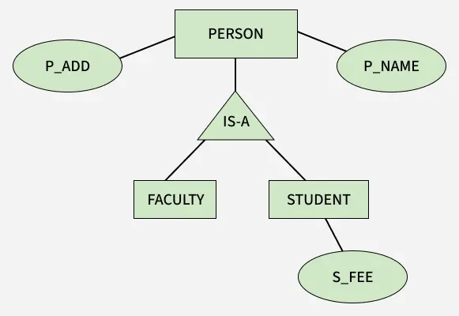
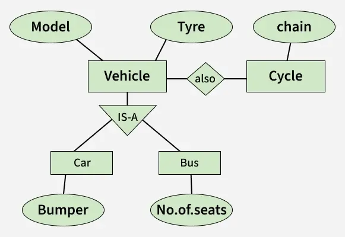
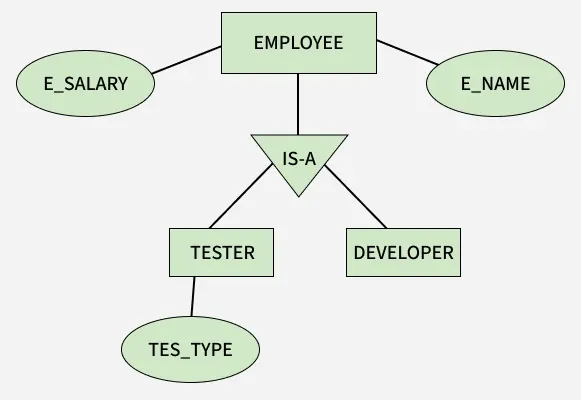
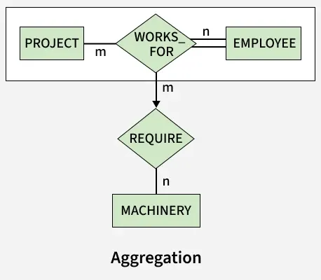

# Bài giảng: Generalization, Specialization và Aggregation trong ER Model

**Cập nhật lần cuối:** 15/06/2026

**Nguồn tham khảo:**  
- Nguồn 1: GeeksforGeeks - [Generalization, Specialization and Aggregation in ER Model](https://www.geeksforgeeks.org/dbms/generalization-specialization-and-aggregation-in-er-model/)
- Nguồn 2: GeeksforGeeks - [Enhanced ER Model](https://www.geeksforgeeks.org/dbms/enhanced-er-model/)

---

## 1. Mục tiêu bài giảng

Sau khi hoàn thành bài học này, người học có thể:

1. Giải thích được lý do cần mở rộng mô hình ER khi thiết kế cơ sở dữ liệu phức tạp.
2. Trình bày được khái niệm generalization, specialization và aggregation.
3. Phân biệt được superclass, subclass và quan hệ IS-A.
4. Giải thích được cơ chế kế thừa thuộc tính và relationship.
5. Phân biệt được cách tiếp cận bottom-up và top-down.
6. Nhận biết được tình huống cần dùng aggregation.
7. Chuyển được một mô hình aggregation đơn giản sang lược đồ quan hệ.
8. Vận dụng các khái niệm trên vào một bài toán thiết kế cơ sở dữ liệu.

---

## 2. Giới thiệu tổng quan

Mô hình ER cơ bản biểu diễn entity, attribute và relationship. Khi hệ thống lớn hơn, nhiều entity có thể chia sẻ thuộc tính, tạo thành phân cấp hoặc cần mô tả relationship giữa một entity và một relationship khác. Nếu chỉ dùng ER cơ bản, sơ đồ dễ lặp thuộc tính và khó phản ánh đúng quy tắc nghiệp vụ.

Ba cơ chế abstraction thường được dùng để giải quyết vấn đề này là:

- **Generalization:** gom nhiều entity chuyên biệt thành một entity tổng quát.
- **Specialization:** chia một entity tổng quát thành nhiều entity chuyên biệt.
- **Aggregation:** xem một relationship cùng các entity tham gia như một đối tượng cấp cao hơn.

Ví dụ trong hệ thống đại học, `Student` và `Faculty` đều có tên, địa chỉ và ngày sinh. Có thể đưa các thuộc tính chung lên `Person`. Trong hệ thống dự án, chính việc một nhân viên làm trên một dự án có thể yêu cầu máy móc; khi đó relationship `Works_For` cần được aggregate.



---

### Quiz nhanh: Giới thiệu tổng quan

**Câu 1.** Vì sao cần các cơ chế mở rộng của ER Model?

A. Để thay thế hoàn toàn SQL  
B. Để biểu diễn phân cấp và relationship phức tạp rõ hơn  
C. Để tăng dung lượng ổ đĩa  
D. Để xóa mọi khóa ngoại  

**Câu 2.** Cơ chế nào gom nhiều entity chuyên biệt thành một entity tổng quát?

A. Specialization  
B. Aggregation  
C. Generalization  
D. Normalization  

**Câu 3.** Cơ chế nào phù hợp khi một relationship cần tham gia relationship khác?

A. Aggregation  
B. Generalization  
C. Indexing  
D. Projection  

---

## 3. Khái niệm cơ bản

### 3.1. Superclass và subclass

**Superclass** là entity set tổng quát chứa các thuộc tính hoặc relationship chung. **Subclass** là entity set chuyên biệt, là tập con của superclass và có thể bổ sung thuộc tính hoặc relationship riêng.

Ví dụ:

```text
Person(person_id, name, address)
Student(tuition_fee)
Faculty(salary)
```

`Person` là superclass; `Student` và `Faculty` là subclass. Mỗi `Student` hoặc `Faculty` cũng là một `Person`.

### 3.2. Quan hệ IS-A

Quan hệ giữa subclass và superclass được đọc theo dạng **IS-A**:

- `Student IS-A Person`.
- `Faculty IS-A Person`.
- `Tester IS-A Employee`.
- `Laptop IS-A Computer`.

IS-A khác relationship nghiệp vụ thông thường. Nó diễn tả quan hệ phân loại và kế thừa, không phải một hành động như `Employee WORKS_FOR Department`.

### 3.3. Inheritance

Subclass kế thừa các thuộc tính và relationship của superclass. Nếu `Employee(eno, name, salary)` là superclass của `Engineer(trade)`, một engineer có đầy đủ `eno`, `name`, `salary` và thêm `trade`.

Ví dụ:

| eno | Subclass | Thuộc tính kế thừa | Thuộc tính riêng |
|---|---|---|---|
| 1001 | `Secretary` | `name`, `salary` | `typing_speed = 68` |
| 1009 | `Engineer` | `name`, `salary` | `trade = Electrical` |



---

### Quiz nhanh: Khái niệm cơ bản

**Câu 1.** Entity set chứa các thuộc tính chung được gọi là gì?

A. Subclass  
B. Superclass  
C. Weak attribute  
D. Transaction  

**Câu 2.** Phát biểu nào mô tả đúng quan hệ IS-A?

A. `Customer PLACES Order`  
B. `Employee WORKS_FOR Department`  
C. `Student ENROLLS Course`  
D. `Engineer IS-A Employee`  

**Câu 3.** Thuộc tính `trade` trong ví dụ `Engineer` nên đặt ở đâu?

A. `Employee`  
B. Mọi subclass  
C. `Engineer`  
D. `Department`  

---

## 4. Cách quy trình mô hình hóa hoạt động

Quy trình áp dụng generalization, specialization và aggregation gồm các bước:

1. **Xác định entity và relationship:** liệt kê các đối tượng, thuộc tính và liên kết nghiệp vụ.
2. **Tìm phần chung và phần riêng:** nhận diện thuộc tính lặp lại, vai trò chuyên biệt và relationship cần được tham chiếu.
3. **Chọn cơ chế abstraction:** dùng generalization, specialization hoặc aggregation theo hướng phân tích.
4. **Đặt ràng buộc:** xác định total/partial, disjoint/overlapping nếu có phân cấp superclass-subclass.
5. **Kiểm tra ý nghĩa nghiệp vụ:** bảo đảm mỗi quan hệ IS-A và mỗi aggregation đều phản ánh đúng thực tế.
6. **Chuyển sang lược đồ quan hệ:** tạo bảng, khóa chính và khóa ngoại phù hợp.

Ví dụ, bắt đầu với `Car`, `Truck` và `Motorbike`, ta nhận ra các thuộc tính chung `vehicle_id`, `brand`, `model`, sau đó generalize thành `Vehicle`. Ngược lại, nếu bắt đầu từ `Employee` và quy tắc nghiệp vụ yêu cầu quản lý riêng secretary, technician và engineer, ta specialize `Employee` thành ba subclass.

---

### Quiz nhanh: Cách hoạt động

**Câu 1.** Bước nào giúp phát hiện cơ hội generalization?

A. Tìm các thuộc tính chung bị lặp giữa nhiều entity  
B. Xóa toàn bộ entity  
C. Tạo index trước khi phân tích  
D. Đổi tên database server  

**Câu 2.** Sau khi tạo phân cấp superclass-subclass, cần xác định gì?

A. Màu của sơ đồ  
B. Total/partial và disjoint/overlapping  
C. Kích thước màn hình  
D. Cổng mạng  

**Câu 3.** Bước cuối của quy trình là gì?

A. Chỉ lưu sơ đồ dưới dạng ảnh  
B. Bỏ qua khóa chính  
C. Chuyển mô hình khái niệm sang lược đồ quan hệ  
D. Xóa relationship  

---

## 5. Các thành phần chính

### 5.1. Generalization

Generalization là quá trình bottom-up, gom nhiều entity set có thuộc tính chung thành một superclass.

```text
Student + Faculty -> Person
Car + Truck + Motorbike -> Vehicle
```

### 5.2. Specialization

Specialization là quá trình top-down, chia một superclass thành các subclass dựa trên đặc điểm hoặc quy tắc riêng.

```text
Employee -> Secretary + Technician + Engineer
Account -> SavingsAccount + CurrentAccount
```



### 5.3. Inheritance

Inheritance cho phép subclass dùng lại thuộc tính và relationship của superclass. Nhờ đó, thuộc tính chung chỉ cần định nghĩa một lần.

### 5.4. Aggregation

Aggregation đóng gói một relationship và các entity tham gia thành một đối tượng khái niệm cấp cao hơn. Đối tượng này có thể tham gia một relationship mới.

```text
(Employee -- Works_For -- Project) -- Requires -- Machinery
```



---

### Quiz nhanh: Các thành phần chính

**Câu 1.** `Student + Faculty -> Person` là ví dụ của gì?

A. Decomposition  
B. Specialization  
C. Generalization  
D. Aggregation  

**Câu 2.** `Employee -> Secretary + Technician + Engineer` là ví dụ của gì?

A. Generalization  
B. Specialization  
C. Aggregation  
D. Join  

**Câu 3.** Thành phần nào giúp subclass dùng lại thuộc tính của superclass?

A. Inheritance  
B. Cardinality  
C. Index  
D. Trigger  

---

## 6. Phân loại hoặc các nhóm chính

Có thể tổ chức nội dung thành hai nhóm chính:

1. **Abstraction theo phân cấp:** gồm generalization, specialization và inheritance. Nhóm này biểu diễn quan hệ IS-A giữa superclass và subclass.
2. **Abstraction theo relationship:** gồm aggregation. Nhóm này nâng một relationship thành đối tượng cấp cao hơn để tham gia relationship khác.

Trong nhóm phân cấp, các ràng buộc thường gặp là:

- **Total hoặc partial:** mức độ các subclass bao phủ superclass.
- **Disjoint hoặc overlapping:** một entity được phép thuộc một hay nhiều subclass.

---

## 7. Generalization và Specialization

### 7.1. Khái niệm

Generalization và specialization là hai hướng phân tích của cùng một cấu trúc phân cấp. Kết quả đều có superclass, subclass và inheritance; điểm khác nhau là xuất phát điểm của quá trình thiết kế.

### 7.2. Đặc điểm chính

1. **Generalization đi từ dưới lên**

   Nhà thiết kế bắt đầu từ các entity cụ thể, tìm thuộc tính chung rồi tạo superclass.

2. **Specialization đi từ trên xuống**

   Nhà thiết kế bắt đầu từ entity tổng quát, sau đó chia thành các nhóm có thuộc tính hoặc quy tắc riêng.

3. **Cả hai đều giảm trùng lặp**

   Thuộc tính chung nằm ở superclass; thuộc tính riêng nằm ở subclass.

### 7.3. Ví dụ

Generalization:

```text
Student(student_id, name, address, tuition_fee)
Faculty(faculty_id, name, address, salary)

=> Person(person_id, name, address)
   Student(tuition_fee)
   Faculty(salary)
```

Specialization:

```text
Employee(eno, name, salary)
    -> Secretary(typing_speed)
    -> Technician(skill)
    -> Engineer(trade)
```

---

### Quiz nhanh: Generalization và Specialization

**Câu 1.** Generalization sử dụng hướng tiếp cận nào?

A. Top-down  
B. Bottom-up  
C. Không có hướng  
D. Chỉ ở mức vật lý  

**Câu 2.** Khi bắt đầu từ `Vehicle` rồi chia thành `Car` và `Truck`, ta đang dùng gì?

A. Specialization  
B. Aggregation  
C. Generalization  
D. Normalization  

**Câu 3.** Thuộc tính chung của nhiều subclass nên đặt ở đâu?

A. Lặp lại trong mọi subclass  
B. Không cần lưu  
C. Relationship bất kỳ  
D. Superclass  

---

## 8. Aggregation và biểu diễn quan hệ

### 8.1. Khái niệm

Aggregation được dùng khi một relationship có ý nghĩa như một sự kiện hoặc đối tượng nghiệp vụ và cần tham gia relationship khác.

Ví dụ:

```text
Employee -- Works_For -- Project
```

Việc một nhân viên làm trên một dự án có thể yêu cầu máy móc. `Requires` không gắn riêng với mọi employee hoặc mọi project, mà gắn với một lần phân công cụ thể.

```text
(Employee -- Works_For -- Project) -- Requires -- Machinery
```

### 8.2. Đặc điểm chính

1. Relationship cơ sở được xem như một entity set cấp cao hơn.
2. Khóa của aggregation thường gồm khóa của các entity tham gia relationship cơ sở.
3. Relationship cấp cao hơn tham chiếu đến toàn bộ lần liên kết, không tham chiếu rời rạc từng entity.

### 8.3. Các bước chuyển sang lược đồ quan hệ

#### 8.3.1. Tạo bảng cho relationship cơ sở

```sql
CREATE TABLE Works_For (
    employee_id INT,
    project_id INT,
    role VARCHAR(100),
    start_date DATE,
    PRIMARY KEY (employee_id, project_id),
    FOREIGN KEY (employee_id) REFERENCES Employee(employee_id),
    FOREIGN KEY (project_id) REFERENCES Project(project_id)
);
```

#### 8.3.2. Tạo bảng cho relationship cấp cao hơn

```sql
CREATE TABLE Requires (
    employee_id INT,
    project_id INT,
    machinery_id INT,
    quantity INT,
    PRIMARY KEY (employee_id, project_id, machinery_id),
    FOREIGN KEY (employee_id, project_id)
        REFERENCES Works_For(employee_id, project_id),
    FOREIGN KEY (machinery_id)
        REFERENCES Machinery(machinery_id)
);
```

#### 8.3.3. Dùng khóa định danh riêng khi cần

Nếu một lần phân công được tham chiếu nhiều lần, có thể thêm `work_assignment_id` vào `Works_For`, rồi để `Requires` tham chiếu khóa này. Cách đó làm khóa ngoại ngắn hơn và thuận tiện khi relationship cơ sở có nhiều thuộc tính.

---

### Quiz nhanh: Aggregation

**Câu 1.** Trong ví dụ dự án, điều gì thực sự yêu cầu machinery?

A. Mọi employee  
B. Mọi project  
C. Một lần employee làm việc trên project  
D. Tên của machinery  

**Câu 2.** Bảng nào biểu diễn relationship được aggregate?

A. `Machinery`  
B. `Employee`  
C. `Project`  
D. `Works_For`  

**Câu 3.** Vì sao `Requires` tham chiếu cặp `(employee_id, project_id)`?

A. Để xác định một lần phân công cụ thể  
B. Để bỏ khóa chính  
C. Để thay thế mọi entity  
D. Để lưu tên database  

---

## 9. Nguyên lý và ràng buộc quan trọng

### 9.1. Attribute inheritance

Subclass kế thừa thuộc tính của superclass theo chiều từ trên xuống. `Car` kế thừa `vehicle_id`, `brand`, `model` từ `Vehicle`; `Vehicle` không kế thừa `number_of_doors` từ `Car`.

### 9.2. Relationship inheritance

Nếu `Employee` tham gia relationship `WORKS_FOR Department`, một `Engineer` cũng tham gia relationship đó với tư cách là một `Employee`.

### 9.3. Total và partial specialization

- **Total:** mọi entity của superclass phải thuộc ít nhất một subclass. Ví dụ, mọi `Employee` phải là `SalariedEmployee` hoặc `HourlyEmployee`.
- **Partial:** một số entity của superclass có thể không thuộc subclass nào. Ví dụ, không phải mọi `Employee` đều là `Secretary`, `Technician` hoặc `Engineer`.

### 9.4. Disjoint và overlapping specialization

- **Disjoint:** một entity chỉ thuộc tối đa một subclass trong cùng một specialization.
- **Overlapping:** một entity có thể thuộc nhiều subclass, chẳng hạn một nhân viên vừa là `Teacher` vừa là `Researcher`.

Thiết kế phải ghi rõ các ràng buộc này vì chúng quyết định dữ liệu nào được xem là hợp lệ.

---

### Quiz nhanh: Nguyên lý và ràng buộc

**Câu 1.** Ràng buộc nào yêu cầu mọi entity của superclass thuộc ít nhất một subclass?

A. Partial  
B. Total  
C. Disjoint  
D. Overlapping  

**Câu 2.** Một nhân viên vừa là `Teacher` vừa là `Researcher` minh họa điều gì?

A. Disjoint specialization  
B. Partial key  
C. Overlapping specialization  
D. Aggregation  

**Câu 3.** Phát biểu nào đúng về inheritance?

A. Superclass kế thừa mọi thuộc tính riêng của subclass  
B. Inheritance chỉ tồn tại trong SQL  
C. Inheritance xóa relationship  
D. Subclass kế thừa thuộc tính chung từ superclass  

---

## 10. Ứng dụng thực tế

1. **Quản lý nhân sự**

   Specialize `Employee` thành `Engineer`, `Technician`, `Secretary` hoặc các loại hợp đồng khác nhau.

2. **Quản lý phương tiện**

   Generalize `Car`, `Truck`, `Motorbike` thành `Vehicle` để dùng chung mã phương tiện, hãng và mẫu xe.

3. **Ngân hàng**

   Specialize `Account` thành `SavingsAccount`, `CurrentAccount` và `LoanAccount` theo quy tắc nghiệp vụ.

4. **Giáo dục**

   Generalize `Student` và `Faculty` thành `Person`; aggregate việc đăng ký học phần để liên kết với advisor phê duyệt.

5. **Quản lý dự án và sản xuất**

   Aggregate lần phân công giữa employee và project để quản lý machinery, vật tư hoặc hợp đồng liên quan.

---

### Quiz nhanh: Ứng dụng thực tế

**Câu 1.** `Account -> SavingsAccount + CurrentAccount` thường xuất hiện trong lĩnh vực nào?

A. Hệ điều hành  
B. Định tuyến mạng  
C. Nén ảnh  
D. Ngân hàng  

**Câu 2.** `Car + Truck + Motorbike -> Vehicle` giúp ích gì?

A. Bỏ tất cả relationship  
B. Xóa mọi thuộc tính riêng  
C. Gom thuộc tính chung và giảm lặp  
D. Thay thế khóa chính  

**Câu 3.** Trường hợp nào phù hợp với aggregation?

A. Lần đăng ký môn học được advisor phê duyệt  
B. Student có thuộc tính name  
C. Course có course_id  
D. Department có location  

---

## 11. Vai trò trong công nghệ và nghiệp vụ

### 11.1. Phân tích nghiệp vụ

- Làm rõ quy tắc phân loại đối tượng.
- Xác định thuộc tính chung, thuộc tính riêng và mức độ bao phủ của subclass.
- Biểu diễn chính xác sự kiện nghiệp vụ cần tham gia relationship khác.

### 11.2. Thiết kế cơ sở dữ liệu

- Giảm trùng lặp trong mô hình khái niệm.
- Hỗ trợ chuyển phân cấp sang các bảng quan hệ nhất quán.
- Xác định đúng khóa ghép và khóa ngoại khi mapping aggregation.

### 11.3. Phát triển phần mềm

- Tạo nền tảng cho domain model và cấu trúc class.
- Giúp API và database dùng cùng cách phân loại đối tượng.
- Hạn chế việc đặt thuộc tính không phù hợp vào entity tổng quát.

### 11.4. Quản trị và chất lượng dữ liệu

- Kiểm soát ràng buộc total/partial và disjoint/overlapping.
- Tránh dữ liệu subclass không có bản ghi superclass tương ứng.
- Tài liệu hóa nguồn gốc và ý nghĩa của các relationship phức tạp.

---

### Quiz nhanh: Vai trò theo lĩnh vực

**Câu 1.** Trong phân tích nghiệp vụ, specialization giúp làm rõ điều gì?

A. Tốc độ CPU  
B. Quy tắc phân loại đối tượng  
C. Dung lượng RAM  
D. Cấu hình mạng  

**Câu 2.** Trong thiết kế database, aggregation thường dẫn đến điều gì?

A. Xóa các entity tham gia  
B. Không cần khóa ngoại  
C. Chỉ cần một cột duy nhất  
D. Một bảng cho relationship cơ sở và bảng relationship cấp cao hơn  

**Câu 3.** Kiểm tra subclass luôn có superclass tương ứng thuộc hoạt động nào?

A. Quản trị chất lượng dữ liệu  
B. Thiết kế giao diện  
C. Quản lý tiến trình  
D. Nén tệp  

---

## 12. Bảng so sánh

| Tiêu chí | Generalization | Specialization | Aggregation |
|---|---|---|---|
| Hướng tiếp cận | Bottom-up | Top-down | Nâng relationship lên mức cao hơn |
| Điểm xuất phát | Nhiều entity chuyên biệt | Một entity tổng quát | Một relationship và các entity tham gia |
| Kết quả | Tạo superclass | Tạo các subclass | Tạo đối tượng aggregation |
| Mục đích | Gom thuộc tính chung | Biểu diễn đặc điểm riêng | Cho relationship tham gia relationship khác |
| Cơ chế kế thừa | Có | Có | Không phải quan hệ IS-A |
| Ví dụ | `Car + Truck -> Vehicle` | `Employee -> Engineer + Tester` | `(Employee Works_For Project) Requires Machinery` |
| Lỗi thường gặp | Đưa thuộc tính riêng lên superclass | Tạo subclass không có khác biệt nghiệp vụ | Dùng aggregation khi relationship không cần liên kết thêm |

---

## 13. Câu hỏi ôn tập

### 13.1. Câu hỏi trắc nghiệm

**Câu 1.** Generalization là cách tiếp cận nào?

A. Bottom-up  
B. Top-down  
C. Random  
D. Physical-only  

---

**Câu 2.** Specialization là cách tiếp cận nào?

A. Bottom-up  
B. Top-down  
C. Không có hướng  
D. Chỉ dùng trong SQL  

---

**Câu 3.** Entity cấp cao hơn trong phân cấp được gọi là gì?

A. Tuple  
B. Subclass  
C. Superclass  
D. Foreign key  

---

**Câu 4.** Entity cấp thấp hơn, chuyên biệt hơn được gọi là gì?

A. Superclass  
B. Transaction log  
C. Database engine  
D. Subclass  

---

**Câu 5.** Aggregation giải quyết tình huống nào?

A. Relationship cần tham gia relationship khác  
B. Entity chỉ có một attribute  
C. Database chưa có index  
D. Bảng cần đổi tên  

---

**Câu 6.** Thuộc tính chung của `Student` và `Faculty` nên đặt ở đâu?

A. Chỉ `Student`  
B. `Person`  
C. Chỉ `Faculty`  
D. Lặp ở cả hai subclass  

---

**Câu 7.** Total specialization có ý nghĩa gì?

A. Mỗi entity thuộc mọi subclass  
B. Không entity nào thuộc subclass  
C. Mọi superclass entity thuộc ít nhất một subclass  
D. Subclass không có thuộc tính  

---

**Câu 8.** Disjoint specialization có ý nghĩa gì?

A. Một entity có thể thuộc mọi subclass  
B. Relationship không có cardinality  
C. Không tồn tại superclass  
D. Một entity thuộc tối đa một subclass trong nhóm  

---

**Câu 9.** Trong aggregation, khóa của relationship cơ sở thường gồm gì?

A. Khóa của các entity tham gia  
B. Tên của database  
C. Địa chỉ máy chủ  
D. Màu của ERD  

---

**Câu 10.** Ví dụ nào thể hiện relationship inheritance?

A. `Engineer` xóa relationship của `Employee`  
B. `Engineer` tham gia `WORKS_FOR` vì là một `Employee`  
C. `Employee` kế thừa `trade` từ `Engineer`  
D. `Project` trở thành subclass của `Employee`  

---

### 13.2. Câu hỏi tự luận ngắn

**Câu 1.** Trình bày khái niệm generalization và cho một ví dụ.

---

**Câu 2.** Trình bày khái niệm specialization và cho một ví dụ.

---

**Câu 3.** Phân biệt generalization và specialization.

---

**Câu 4.** Giải thích vì sao inheritance giúp giảm trùng lặp trong mô hình EER.

---

**Câu 5.** Aggregation giải quyết hạn chế nào của ER Model cơ bản?

---

## 14. Bài tập vận dụng

### Bài tập 1: Quản lý phương tiện

Một hệ thống có `Car`, `Truck` và `Motorbike`. Tất cả đều có `vehicle_id`, `brand`, `model`, `manufacture_year`; mỗi loại có thêm thuộc tính riêng.

**Yêu cầu:**  
Xác định superclass, subclass, thuộc tính chung, thuộc tính riêng và vẽ mô hình generalization dạng text.

---

### Bài tập 2: Quản lý nhân sự

Một công ty có `Employee(employee_id, name, salary)`. Nhân viên có thể là `Developer(programming_language)`, `Tester(testing_type)` hoặc `Manager(management_level)`.

**Yêu cầu:**  
Biểu diễn specialization, giải thích inheritance và đề xuất ràng buộc total/partial, disjoint/overlapping phù hợp.

---

### Bài tập 3: Dự án và máy móc

`Employee` làm việc trên `Project` thông qua `Works_For`. Mỗi lần phân công có thể yêu cầu một hoặc nhiều `Machinery`.

**Yêu cầu:**  
Giải thích vì sao cần aggregation, vẽ mô hình dạng text và đề xuất các bảng quan hệ tương ứng.

---

### Bài tập 4: Đăng ký học phần

`Student` đăng ký `Course` thông qua `Enrolls`. Một lần đăng ký có thể được một `Advisor` phê duyệt.

**Yêu cầu:**  
Xác định phần cần aggregate và thiết kế lược đồ quan hệ có khóa chính, khóa ngoại phù hợp.

---

## 15. Tóm tắt bài học

- Generalization gom nhiều entity chuyên biệt thành superclass theo hướng bottom-up.
- Specialization chia một superclass thành các subclass theo hướng top-down.
- Superclass chứa thuộc tính và relationship chung; subclass chứa đặc điểm riêng.
- Quan hệ IS-A cho phép subclass kế thừa từ superclass.
- Total/partial mô tả mức độ bao phủ; disjoint/overlapping mô tả khả năng đồng thời thuộc nhiều subclass.
- Aggregation xem một relationship như đối tượng cấp cao hơn.
- Aggregation phù hợp khi một relationship cần tham gia relationship khác.
- Khi mapping aggregation, relationship cơ sở thường trở thành một bảng riêng.

---

## 16. Từ khóa chính

- ER Model
- Enhanced ER Model
- Generalization
- Specialization
- Aggregation
- Superclass
- Subclass
- IS-A
- Inheritance
- Attribute inheritance
- Relationship inheritance
- Total specialization
- Partial specialization
- Disjoint specialization
- Overlapping specialization
- Relational schema
- Primary key
- Foreign key

---

## 17. Đáp án và gợi ý trả lời

### Quiz nhanh: Giới thiệu tổng quan

- **Câu 1.** B
- **Câu 2.** C
- **Câu 3.** A

### Quiz nhanh: Khái niệm cơ bản

- **Câu 1.** B
- **Câu 2.** D
- **Câu 3.** C

### Quiz nhanh: Cách hoạt động

- **Câu 1.** A
- **Câu 2.** B
- **Câu 3.** C

### Quiz nhanh: Các thành phần chính

- **Câu 1.** C
- **Câu 2.** B
- **Câu 3.** A

### Quiz nhanh: Generalization và Specialization

- **Câu 1.** B
- **Câu 2.** A
- **Câu 3.** D

### Quiz nhanh: Aggregation

- **Câu 1.** C
- **Câu 2.** D
- **Câu 3.** A

### Quiz nhanh: Nguyên lý và ràng buộc

- **Câu 1.** B
- **Câu 2.** C
- **Câu 3.** D

### Quiz nhanh: Ứng dụng thực tế

- **Câu 1.** D
- **Câu 2.** C
- **Câu 3.** A

### Quiz nhanh: Vai trò theo lĩnh vực

- **Câu 1.** B
- **Câu 2.** D
- **Câu 3.** A

### Câu hỏi ôn tập - Trắc nghiệm

- **Câu 1.** A
- **Câu 2.** B
- **Câu 3.** C
- **Câu 4.** D
- **Câu 5.** A
- **Câu 6.** B
- **Câu 7.** C
- **Câu 8.** D
- **Câu 9.** A
- **Câu 10.** B

### Câu hỏi ôn tập - Tự luận ngắn

#### Câu 1

**Gợi ý trả lời:**

Generalization là quá trình bottom-up, gom nhiều entity cụ thể có thuộc tính chung thành một superclass. Ví dụ, generalize `Car`, `Truck`, `Motorbike` thành `Vehicle`.

#### Câu 2

**Gợi ý trả lời:**

Specialization là quá trình top-down, chia một superclass thành các subclass theo đặc điểm riêng. Ví dụ, specialize `Employee` thành `Secretary`, `Technician` và `Engineer`.

#### Câu 3

**Gợi ý trả lời:**

Generalization bắt đầu từ nhiều entity cụ thể và tạo entity tổng quát; specialization bắt đầu từ một entity tổng quát và tạo các entity chuyên biệt. Cả hai đều tạo phân cấp superclass-subclass và hỗ trợ inheritance.

#### Câu 4

**Gợi ý trả lời:**

Inheritance cho phép đặt thuộc tính và relationship chung tại superclass một lần. Các subclass tự động sử dụng chúng và chỉ khai báo đặc điểm riêng, nhờ đó mô hình ít lặp và nhất quán hơn.

#### Câu 5

**Gợi ý trả lời:**

ER Model cơ bản khó biểu diễn relationship giữa một entity và một relationship. Aggregation xem relationship cơ sở như một đối tượng cấp cao hơn để nó có thể tham gia relationship mới.

### Bài tập vận dụng

#### Bài tập 1

**Gợi ý trả lời:**

Tạo superclass `Vehicle(vehicle_id, brand, model, manufacture_year)`. Các subclass là `Car`, `Truck`, `Motorbike`; chỉ đặt thuộc tính riêng như `number_of_doors`, `load_capacity`, `engine_type` tại subclass tương ứng.

#### Bài tập 2

**Gợi ý trả lời:**

Tạo specialization `Employee -> Developer + Tester + Manager`. Các subclass kế thừa `employee_id`, `name`, `salary`. Chọn total nếu mọi employee bắt buộc thuộc một loại; chọn partial nếu có nhân viên ngoài ba loại. Chọn disjoint nếu một người chỉ có một vai trò chính, overlapping nếu được phép kiêm nhiệm.

#### Bài tập 3

**Gợi ý trả lời:**

Aggregate `(Employee -- Works_For -- Project)` vì machinery gắn với một lần phân công cụ thể. Tạo `Works_For(employee_id, project_id, ...)` và `Requires(employee_id, project_id, machinery_id, quantity)` với khóa ngoại ghép tham chiếu `Works_For`.

#### Bài tập 4

**Gợi ý trả lời:**

Aggregate `(Student -- Enrolls -- Course)`, sau đó liên kết aggregation này với `Advisor` qua `Approved_By`. Có thể tạo `Enrolls(student_id, course_id, ...)` và `Approved_By(student_id, course_id, advisor_id, approved_at)`.
