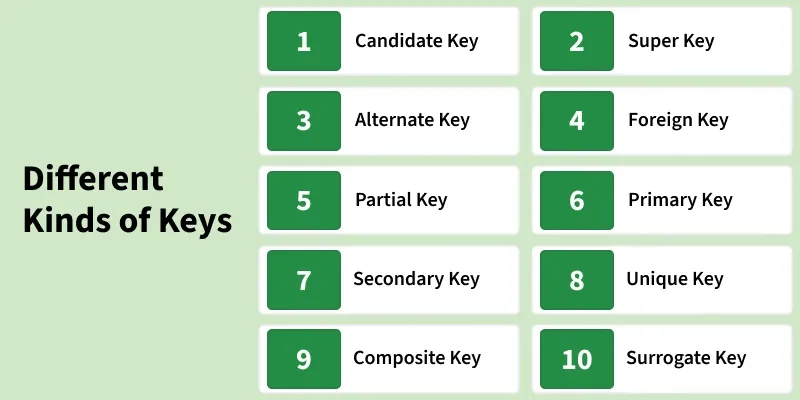
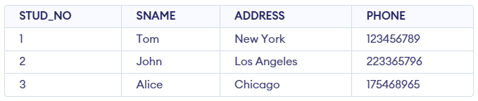
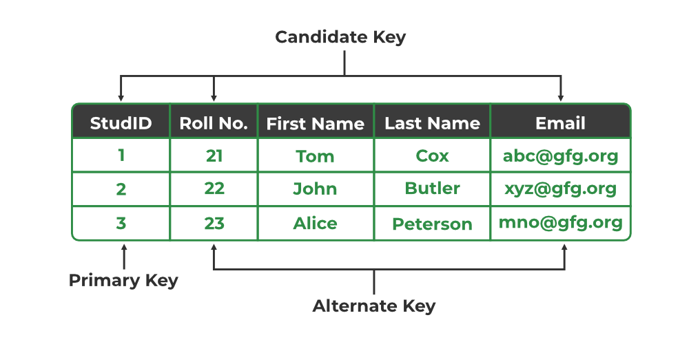
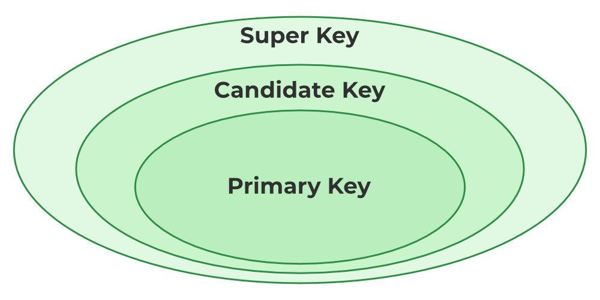
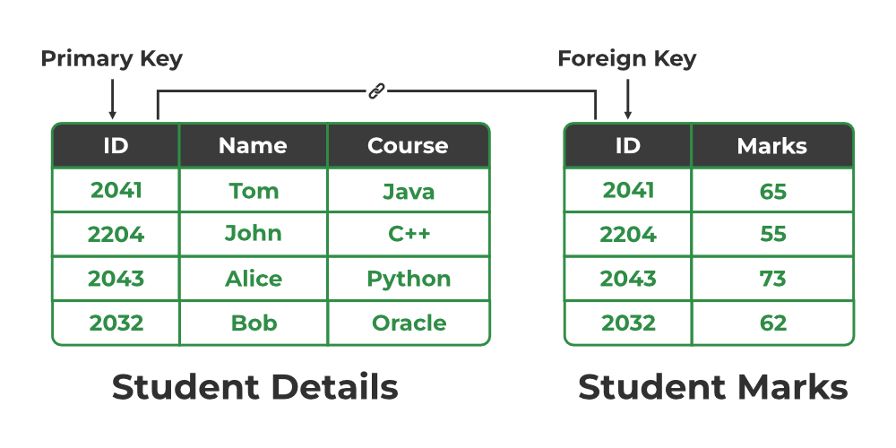
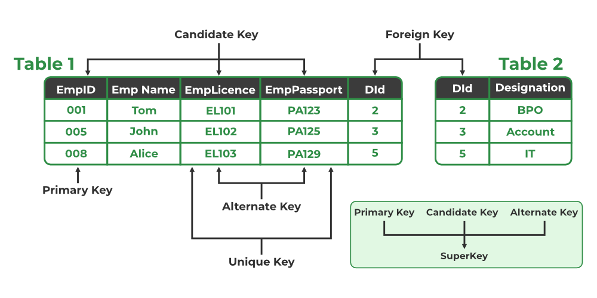

# Bài giảng: Các loại khóa trong mô hình quan hệ

**Cập nhật lần cuối:** 15/06/2026

**Nguồn tham khảo:**  
- Nguồn 1: GeeksforGeeks - [Types of Keys in Relational Model](https://www.geeksforgeeks.org/dbms/types-of-keys-in-relational-model-candidate-super-primary-alternate-and-foreign/)
- Nguồn 2: MySQL 8.4 Reference Manual - [CREATE TABLE Statement](https://dev.mysql.com/doc/refman/8.4/en/create-table.html)

---

## 1. Mục tiêu bài giảng

Sau khi hoàn thành bài học này, người học có thể:

1. Giải thích được vai trò của **key** trong mô hình quan hệ.
2. Phân biệt được các loại khóa quan trọng: **super key**, **candidate key**, **primary key**, **alternate key**, **foreign key**, **partial key**, **secondary key**, **unique key**, **composite key**, **surrogate key**.
3. Xác định được khóa phù hợp trong một bảng quan hệ cụ thể.
4. Hiểu mối quan hệ giữa **super key**, **candidate key**, **primary key** và **alternate key**.
5. Biết cách dùng khóa để đảm bảo **tính duy nhất**, **toàn vẹn dữ liệu** và **liên kết giữa các bảng**.

---

## 2. Key trong mô hình quan hệ là gì?

Trong **relational model**, dữ liệu được tổ chức thành các bảng. Mỗi bảng gồm nhiều hàng, mỗi hàng biểu diễn một bản ghi.

**Key** là một thuộc tính hoặc một tập thuộc tính được dùng để nhận diện bản ghi trong bảng.

Nói cách khác, key giúp trả lời câu hỏi:

> Làm thế nào để phân biệt một hàng với tất cả các hàng còn lại trong cùng một bảng?

Ví dụ, trong bảng `STUDENT`, thuộc tính `STUD_NO` có thể dùng để nhận diện duy nhất từng sinh viên.

```text
STUDENT(STUD_NO, STUD_NAME, STUD_AGE, STUD_ADDRESS, PHONE)
```

Nếu mỗi sinh viên có một `STUD_NO` khác nhau, thì `STUD_NO` có thể được dùng làm khóa.



---

## 3. Vì sao key quan trọng?

Key có vai trò rất quan trọng trong thiết kế cơ sở dữ liệu.

### 3.1. Đảm bảo tính duy nhất

Key giúp mỗi bản ghi trong bảng có thể được nhận diện một cách riêng biệt.

Ví dụ, hai sinh viên có thể cùng tên là `John`, nhưng không được có cùng mã sinh viên nếu `STUD_NO` là khóa chính.

---

### 3.2. Đảm bảo toàn vẹn dữ liệu

Key giúp tránh trùng lặp dữ liệu không mong muốn và duy trì tính nhất quán.

Ví dụ, nếu một bảng cho phép hai sinh viên có cùng `STUD_NO`, hệ thống sẽ không biết bản ghi nào là đúng khi cần cập nhật điểm hoặc thông tin cá nhân.

---

### 3.3. Tạo quan hệ giữa các bảng

Key cho phép liên kết dữ liệu giữa các bảng.

Ví dụ:

- Bảng `STUDENT` lưu thông tin sinh viên.
- Bảng `STUDENT_COURSE` lưu thông tin sinh viên đăng ký môn học.

Hai bảng có thể liên kết với nhau thông qua `STUD_NO`.

---

### 3.4. Hỗ trợ truy vấn hiệu quả

Các DBMS thường tạo chỉ mục trên key để hỗ trợ truy vấn nhanh hơn.

Ví dụ, tìm sinh viên theo `STUD_NO` thường nhanh hơn tìm theo `STUD_NAME`, vì `STUD_NO` thường là khóa chính hoặc có chỉ mục.

---

## 4. Ví dụ dữ liệu dùng trong bài

Xét hai bảng sau.

### 4.1. Bảng STUDENT

| STUD_NO | STUD_NAME | STUD_AGE | STUD_ADDRESS | PHONE |
|---:|---|---:|---|---|
| 101 | John | 21 | 123 Oak St | 0901000001 |
| 102 | Emily | 22 | 456 Pine St | 0901000002 |
| 103 | John | 23 | 789 Maple St | 0901000003 |
| 104 | Michael | 20 | 321 Birch St | 0901000004 |
| 105 | Emily | 22 | 654 Cedar St | 0901000005 |



---

### 4.2. Bảng STUDENT_COURSE

| STUD_NO | COURSE_NO | COURSE_NAME | SEMESTER |
|---:|---|---|---|
| 101 | C01 | Database Systems | 2026-Spring |
| 101 | C02 | Programming | 2026-Spring |
| 102 | C01 | Database Systems | 2026-Spring |
| 103 | C03 | Data Structures | 2026-Spring |
| 104 | C02 | Programming | 2026-Spring |


Trong bảng `STUDENT_COURSE`, một sinh viên có thể học nhiều môn. Vì vậy, chỉ dùng `STUD_NO` chưa đủ để nhận diện duy nhất một dòng đăng ký học.

---

## 5. Super Key

### 5.1. Khái niệm

**Super key** là một thuộc tính hoặc tập thuộc tính có thể nhận diện duy nhất một bản ghi trong bảng.

Một super key có thể chứa các thuộc tính dư thừa.

Ví dụ trong bảng `STUDENT`:

```text
{STUD_NO}
{STUD_NO, STUD_NAME}
{STUD_NO, PHONE}
{STUD_NO, STUD_NAME, STUD_ADDRESS}
```

Nếu `STUD_NO` đã đủ để nhận diện duy nhất sinh viên, thì thêm `STUD_NAME` vào vẫn tạo ra một super key, nhưng thuộc tính `STUD_NAME` là dư thừa.

---

### 5.2. Đặc điểm của Super Key

- Có thể gồm một hoặc nhiều thuộc tính.
- Có thể chứa thuộc tính không cần thiết.
- Mục tiêu chính là đảm bảo nhận diện duy nhất bản ghi.
- Mọi candidate key đều là super key, nhưng không phải mọi super key đều là candidate key.

---

### 5.3. Ví dụ

Trong bảng `STUDENT`, giả sử `STUD_NO` là duy nhất.

Khi đó:

```text
{STUD_NO}
```

là super key.

Các tập sau cũng là super key:

```text
{STUD_NO, STUD_NAME}
{STUD_NO, PHONE}
```

Nhưng chúng không tối giản vì `STUD_NO` đã đủ.

---

### Quiz nhanh: Super key

**Câu 1.** Super key là gì?

A. Tập thuộc tính chỉ dùng để lưu mật khẩu  
B. Tập thuộc tính có thể nhận diện duy nhất một bản ghi  
C. Tập thuộc tính không bao giờ chứa thuộc tính dư thừa  
D. Tập thuộc tính luôn chỉ gồm một cột  

**Câu 2.** Nếu `{STUD_NO}` đã nhận diện duy nhất sinh viên, thì `{STUD_NO, STUD_NAME}` là gì?

A. Không phải key  
B. Partial key  
C. Foreign key  
D. Super key có thuộc tính dư thừa  

---

## 6. Candidate Key

### 6.1. Khái niệm

**Candidate key** là super key tối giản, tức là tập thuộc tính có thể nhận diện duy nhất một bản ghi và không chứa thuộc tính dư thừa.

Nói cách khác:

> Candidate key = Minimal super key

---

### 6.2. Đặc điểm của Candidate Key

- Có thể nhận diện duy nhất từng bản ghi.
- Không có thuộc tính dư thừa.
- Một bảng phải có ít nhất một candidate key.
- Một bảng có thể có nhiều candidate key.
- Từ các candidate key, ta chọn một khóa làm primary key.

---

### 6.3. Ví dụ

Trong bảng `STUDENT`, giả sử:

- `STUD_NO` là duy nhất.
- `PHONE` cũng là duy nhất.

Khi đó hai candidate key có thể là:

```text
{STUD_NO}
{PHONE}
```

Cả hai đều có thể nhận diện duy nhất sinh viên.

---

### 6.4. Ví dụ Candidate Key tổng hợp

Trong bảng `STUDENT_COURSE`, một sinh viên có thể học nhiều môn và một môn có nhiều sinh viên.

Do đó:

```text
{STUD_NO}
```

không đủ để nhận diện duy nhất một dòng.

```text
{COURSE_NO}
```

cũng không đủ.

Nhưng tổ hợp sau có thể là candidate key:

```text
{STUD_NO, COURSE_NO}
```

Tổ hợp này nhận diện duy nhất việc một sinh viên đăng ký một môn học.

---

## 7. Primary Key

### 7.1. Khái niệm

**Primary key** là một candidate key được chọn để nhận diện chính thức từng bản ghi trong bảng.

Ví dụ:

```text
STUDENT(STUD_NO, STUD_NAME, STUD_AGE, STUD_ADDRESS, PHONE)
```

Nếu cả `STUD_NO` và `PHONE` đều là candidate key, ta có thể chọn `STUD_NO` làm primary key.

---

### 7.2. Đặc điểm của Primary Key

- Phải duy nhất.
- Không được NULL.
- Mỗi bảng chỉ có một primary key.
- Có thể gồm một cột hoặc nhiều cột.
- Thường được dùng để liên kết với bảng khác thông qua foreign key.

---

### 7.3. Ví dụ SQL

```sql
CREATE TABLE Student (
    stud_no INT PRIMARY KEY,
    stud_name VARCHAR(100),
    stud_age INT,
    stud_address VARCHAR(200),
    phone VARCHAR(20)
);
```

Trong ví dụ trên, `stud_no` là primary key.

---

### 7.4. Primary Key tổng hợp

Nếu một primary key gồm nhiều thuộc tính, nó cũng là một composite key.

Ví dụ:

```sql
CREATE TABLE StudentCourse (
    stud_no INT,
    course_no VARCHAR(20),
    semester VARCHAR(20),
    PRIMARY KEY (stud_no, course_no)
);
```

Ở đây, `{stud_no, course_no}` cùng nhau tạo thành primary key.



---

### Quiz nhanh: Candidate key và primary key

**Câu 1.** Candidate key khác super key ở điểm nào?

A. Candidate key luôn cho phép NULL  
B. Candidate key luôn có nhiều cột hơn super key  
C. Candidate key là super key tối giản  
D. Candidate key không thể dùng làm primary key  

**Câu 2.** Primary key được chọn từ tập nào?

A. Tập candidate keys  
B. Tập secondary keys  
C. Tập foreign keys  
D. Tập non-key attributes  

**Câu 3.** Primary key có được NULL không?

A. Có  
B. Chỉ được NULL trong bảng lớn  
C. Tùy giao diện người dùng  
D. Không  

---

## 8. Alternate Key

### 8.1. Khái niệm

**Alternate key** là candidate key không được chọn làm primary key.

Nếu một bảng có nhiều candidate key, ta chọn một khóa làm primary key. Các candidate key còn lại là alternate key.

---

### 8.2. Ví dụ

Trong bảng `STUDENT`, giả sử:

```text
Candidate keys: {STUD_NO}, {PHONE}
```

Nếu chọn:

```text
Primary key: {STUD_NO}
```

thì:

```text
Alternate key: {PHONE}
```

---

### 8.3. Ý nghĩa

Alternate key vẫn có khả năng nhận diện duy nhất bản ghi, nhưng không được chọn làm khóa chính.

Trong thiết kế thực tế, alternate key thường được cài đặt bằng ràng buộc `UNIQUE`.

Ví dụ:

```sql
CREATE TABLE Student (
    stud_no INT PRIMARY KEY,
    phone VARCHAR(20) UNIQUE,
    stud_name VARCHAR(100)
);
```

---

## 9. Mối quan hệ giữa Super Key, Candidate Key, Primary Key và Alternate Key

Có thể hiểu theo quan hệ tập hợp như sau:

```text
Super Keys
└── Candidate Keys
    ├── Primary Key
    └── Alternate Keys
```

Giải thích:

- Super key là tập rộng nhất.
- Candidate key là super key tối giản.
- Primary key là một candidate key được chọn làm khóa chính.
- Alternate key là candidate key không được chọn làm khóa chính.



---

## 10. Foreign Key

### 10.1. Khái niệm

**Foreign key** là thuộc tính hoặc tập thuộc tính trong một bảng dùng để tham chiếu đến khóa của bảng khác.

Bảng chứa foreign key được gọi là **referencing table** hoặc bảng tham chiếu.

Bảng được tham chiếu được gọi là **referenced table** hoặc bảng được tham chiếu.

---

### 10.2. Ví dụ

Xét hai bảng:

```text
STUDENT(STUD_NO, STUD_NAME, PHONE)
STUDENT_COURSE(STUD_NO, COURSE_NO, SEMESTER)
```

Trong đó:

- `STUDENT.STUD_NO` là primary key.
- `STUDENT_COURSE.STUD_NO` là foreign key tham chiếu đến `STUDENT.STUD_NO`.

---

### 10.3. Ví dụ SQL

```sql
CREATE TABLE Student (
    stud_no INT PRIMARY KEY,
    stud_name VARCHAR(100),
    phone VARCHAR(20)
);

CREATE TABLE StudentCourse (
    stud_no INT,
    course_no VARCHAR(20),
    semester VARCHAR(20),
    PRIMARY KEY (stud_no, course_no),
    FOREIGN KEY (stud_no) REFERENCES Student(stud_no)
);
```

---

### 10.4. Đặc điểm của Foreign Key

- Dùng để tạo quan hệ giữa các bảng.
- Giá trị foreign key thường phải tồn tại trong bảng được tham chiếu.
- Có thể bị lặp lại.
- Có thể cho phép NULL nếu quan hệ là tùy chọn và DBMS/schema cho phép.
- Giúp duy trì toàn vẹn tham chiếu.

---

### 10.5. Ví dụ về giá trị lặp

Trong bảng `STUDENT_COURSE`, `STUD_NO = 101` có thể xuất hiện nhiều lần vì một sinh viên có thể học nhiều môn.

```text
101 - C01
101 - C02
```

Điều này hợp lệ vì `STUD_NO` trong `STUDENT_COURSE` là foreign key, không phải primary key đơn.



---

### Quiz nhanh: Alternate key và foreign key

**Câu 1.** Alternate key là gì?

A. Super key có thuộc tính dư thừa  
B. Candidate key không được chọn làm primary key  
C. Foreign key bị lỗi  
D. Khóa chỉ dùng trong NoSQL  

**Câu 2.** Foreign key dùng để làm gì?

A. Xóa bảng tự động  
B. Mã hóa dữ liệu  
C. Tạo quan hệ giữa các bảng  
D. Thay thế tất cả primary key  

**Câu 3.** Foreign key có thể có giá trị lặp lại không?

A. Chỉ khi nó cũng là primary key  
B. Không bao giờ  
C. Chỉ khi bảng không có dữ liệu  
D. Có, trong nhiều trường hợp  

---

## 11. Partial Key

### 11.1. Khái niệm

**Partial key** là thuộc tính hoặc tập thuộc tính được dùng để phân biệt các bản ghi trong một **weak entity**, nhưng bản thân nó không đủ để nhận diện duy nhất bản ghi nếu đứng một mình.

Partial key cần kết hợp với khóa của **strong entity** liên quan để nhận diện đầy đủ.

---

### 11.2. Weak Entity là gì?

**Weak entity** là thực thể không thể được nhận diện duy nhất chỉ bằng thuộc tính của chính nó.

Nó phải phụ thuộc vào một thực thể mạnh hơn gọi là **owner entity** hoặc **strong entity**.

---

### 11.3. Ví dụ đúng về Partial Key

Giả sử có hai thực thể:

```text
EMPLOYEE(EmpID, EmpName)
DEPENDENT(DependentName, BirthDate, Relationship)
```

Một nhân viên có thể có nhiều người phụ thuộc. Tên người phụ thuộc có thể không duy nhất trong toàn bộ công ty.

Ví dụ:

| EmpID | DependentName | Relationship |
|---:|---|---|
| 1 | Anna | Daughter |
| 2 | Anna | Daughter |
| 3 | Ben | Son |

`DependentName` không đủ để nhận diện duy nhất người phụ thuộc trong toàn công ty. Nhưng trong phạm vi một nhân viên, nó có thể giúp phân biệt các dependent.

Khi đó:

```text
Partial key: DependentName
Full identification: {EmpID, DependentName}
```

---

### 11.4. Lưu ý quan trọng

Không nên nhầm partial key với composite key.

- **Composite key** là khóa gồm nhiều thuộc tính, có thể nhận diện duy nhất bản ghi trong một bảng.
- **Partial key** chỉ nhận diện tương đối trong weak entity và cần kết hợp với khóa của strong entity.

Ví dụ `{STUD_NO, COURSE_NO}` trong `STUDENT_COURSE` thường được xem là composite key, không phải partial key nếu `STUDENT_COURSE` được thiết kế như bảng quan hệ đăng ký học bình thường.


---

## 12. Secondary Key

### 12.1. Khái niệm

**Secondary key** là thuộc tính hoặc tập thuộc tính được dùng để tìm kiếm, lọc hoặc truy vấn bản ghi, nhưng không đảm bảo tính duy nhất.

---

### 12.2. Ví dụ

Trong bảng `STUDENT`, `STUD_NAME` có thể được dùng làm secondary key để tìm sinh viên theo tên.

| STUD_NO | STUD_NAME | STUD_AGE | STUD_ADDRESS |
|---:|---|---:|---|
| 101 | John | 21 | 123 Oak St |
| 102 | Emily | 22 | 456 Pine St |
| 103 | John | 23 | 789 Maple St |
| 104 | Michael | 20 | 321 Birch St |
| 105 | Emily | 22 | 654 Cedar St |

Ở đây, `STUD_NAME` không duy nhất vì nhiều sinh viên có thể cùng tên.

---

### 12.3. Vai trò của Secondary Key

Secondary key thường dùng để:

- Tăng tốc tìm kiếm.
- Tạo chỉ mục phụ.
- Hỗ trợ truy vấn theo thuộc tính thường được dùng.

Ví dụ:

```sql
CREATE INDEX idx_student_name
ON Student(stud_name);
```

---

### Quiz nhanh: Partial key và secondary key

**Câu 1.** Partial key thường xuất hiện trong loại thực thể nào?

A. Weak entity  
B. Strong entity duy nhất  
C. Bảng không có cột  
D. View không có dữ liệu  

**Câu 2.** Secondary key có đảm bảo nhận diện duy nhất từng bản ghi không?

A. Có  
B. Không  
C. Luôn giống primary key  
D. Chỉ trong bảng có một dòng  

**Câu 3.** `STUD_NAME` có thể là secondary key vì sao?

A. Luôn là foreign key  
B. Luôn duy nhất trong mọi bảng  
C. Có thể dùng để tìm kiếm, dù không duy nhất  
D. Không thể tạo index  

---

## 13. Unique Key

### 13.1. Khái niệm

**Unique key** là ràng buộc đảm bảo rằng giá trị trong một cột hoặc một tổ hợp cột không bị trùng lặp giữa các dòng trong bảng.

---

### 13.2. Đặc điểm

- Đảm bảo tính duy nhất.
- Có thể áp dụng cho một cột hoặc nhiều cột.
- Có thể dùng để cài đặt alternate key.
- Có thể cho phép `NULL`, nhưng cách xử lý `NULL` phụ thuộc vào từng DBMS.

Lưu ý về `NULL`:

- Một số DBMS cho phép nhiều giá trị `NULL` trong cột có ràng buộc unique.
- Một số DBMS giới hạn số lượng `NULL`.
- Khi thiết kế thực tế, cần kiểm tra quy tắc của hệ quản trị đang sử dụng.

---

### 13.3. Ví dụ SQL

```sql
CREATE TABLE Student (
    stud_no INT PRIMARY KEY,
    stud_email VARCHAR(100) UNIQUE,
    stud_name VARCHAR(100)
);
```

Trong ví dụ này:

- `stud_no` là primary key.
- `stud_email` là unique key.

---

### 13.4. Unique Key nhiều cột

```sql
CREATE TABLE StudentProfile (
    stud_no INT PRIMARY KEY,
    stud_email VARCHAR(100),
    stud_name VARCHAR(100),
    UNIQUE (stud_email, stud_name)
);
```

Ràng buộc trên đảm bảo không có hai dòng có cùng cặp giá trị `(stud_email, stud_name)`.

---

## 14. Composite Key

### 14.1. Khái niệm

**Composite key** là khóa được tạo thành từ hai hoặc nhiều thuộc tính.

Composite key được dùng khi một thuộc tính đơn lẻ không đủ để nhận diện duy nhất bản ghi.

---

### 14.2. Ví dụ

Trong bảng `STUDENT_COURSE`:

| STUD_NO | COURSE_NO | SEMESTER |
|---:|---|---|
| 101 | C01 | 2026-Spring |
| 101 | C02 | 2026-Spring |
| 102 | C01 | 2026-Spring |

Nếu mỗi sinh viên chỉ được đăng ký một môn một lần trong một học kỳ, composite key có thể là:

```text
{STUD_NO, COURSE_NO, SEMESTER}
```

Nếu không xét học kỳ, composite key có thể là:

```text
{STUD_NO, COURSE_NO}
```

Tùy quy tắc nghiệp vụ, ta chọn tổ hợp phù hợp.

---

### 14.3. Ví dụ SQL

```sql
CREATE TABLE StudentCourse (
    stud_no INT,
    course_no VARCHAR(20),
    semester VARCHAR(20),
    PRIMARY KEY (stud_no, course_no, semester)
);
```

---

## 15. Surrogate Key

### 15.1. Khái niệm

**Surrogate key** là khóa nhân tạo do hệ thống tạo ra để nhận diện duy nhất bản ghi.

Nó thường không có ý nghĩa nghiệp vụ trong thế giới thực.

---

### 15.2. Ví dụ

Thay vì dùng email hoặc số điện thoại làm khóa, ta tạo một mã tự tăng:

```sql
CREATE TABLE Student (
    student_id INT GENERATED ALWAYS AS IDENTITY PRIMARY KEY,
    stud_no VARCHAR(20) UNIQUE,
    stud_email VARCHAR(100) UNIQUE,
    stud_name VARCHAR(100)
);
```

Ở đây:

- `student_id` là surrogate key.
- `stud_no` có thể là natural key hoặc alternate key.
- `stud_email` có thể là unique key.

---

### 15.3. Khi nào nên dùng Surrogate Key?

Nên cân nhắc surrogate key khi:

- Không có natural key tốt.
- Natural key quá dài hoặc gồm nhiều cột.
- Natural key có thể thay đổi theo thời gian.
- Cần khóa đơn giản để liên kết nhiều bảng.

---

### 15.4. Ưu điểm và hạn chế

| Khía cạnh | Ưu điểm | Hạn chế |
|---|---|---|
| Đơn giản | Dễ dùng làm khóa chính | Không có ý nghĩa nghiệp vụ |
| Ổn định | Ít thay đổi | Vẫn cần unique constraint cho dữ liệu nghiệp vụ |
| Hiệu năng | Thường ngắn, dễ index | Có thể che giấu dữ liệu trùng nếu không ràng buộc thêm |


---

### Quiz nhanh: Unique, composite và surrogate key

**Câu 1.** Unique key dùng để làm gì?

A. Chỉ dùng để sắp xếp dữ liệu  
B. Cho phép mọi dòng giống hệt nhau  
C. Thay thế mọi foreign key  
D. Đảm bảo giá trị không bị trùng lặp  

**Câu 2.** Composite key là gì?

A. Khóa luôn do hệ thống tự sinh  
B. Khóa gồm hai hoặc nhiều thuộc tính  
C. Khóa không bao giờ dùng làm primary key  
D. Khóa chỉ dùng trong graph database  

**Câu 3.** Surrogate key có đặc điểm nào?

A. Không thể dùng làm primary key  
B. Luôn là tên sinh viên  
C. Là khóa nhân tạo, thường không có ý nghĩa nghiệp vụ  
D. Luôn là số điện thoại  

---

## 16. Natural Key và Surrogate Key

Mặc dù nội dung chính của bài tập trung vào các loại key phổ biến, trong thiết kế thực tế ta thường gặp thêm khái niệm **natural key**.

### 16.1. Natural Key

**Natural key** là khóa lấy từ dữ liệu nghiệp vụ có sẵn trong thực tế.

Ví dụ:

- Mã sinh viên.
- Số căn cước công dân.
- Email.
- Mã sản phẩm.

---

### 16.2. So sánh Natural Key và Surrogate Key

| Tiêu chí | Natural Key | Surrogate Key |
|---|---|---|
| Nguồn gốc | Có sẵn trong nghiệp vụ | Do hệ thống sinh ra |
| Ý nghĩa | Có ý nghĩa thực tế | Không có ý nghĩa nghiệp vụ |
| Khả năng thay đổi | Có thể thay đổi | Thường ổn định |
| Độ dài | Có thể dài hoặc phức tạp | Thường ngắn |
| Ví dụ | `student_code`, `email` | `student_id` tự tăng |

---

## 17. Bảng tổng hợp các loại key



| Loại key | Có duy nhất không? | Có tối giản không? | Có thể NULL không? | Vai trò chính |
|---|---|---|---|---|
| Super Key | Có | Không nhất thiết | Thường không nếu dùng để định danh | Nhận diện duy nhất bản ghi |
| Candidate Key | Có | Có | Không | Ứng viên làm primary key |
| Primary Key | Có | Có | Không | Định danh chính thức bản ghi |
| Alternate Key | Có | Có | Không hoặc tùy ràng buộc | Candidate key không được chọn làm primary key |
| Foreign Key | Không nhất thiết | Không nhất thiết | Có thể, tùy thiết kế | Liên kết bảng và duy trì tham chiếu |
| Partial Key | Chỉ duy nhất trong phạm vi owner | Có tính tương đối | Không nên NULL | Nhận diện weak entity khi kết hợp owner key |
| Secondary Key | Không nhất thiết | Không nhất thiết | Có thể | Hỗ trợ tìm kiếm/truy vấn |
| Unique Key | Có | Không nhất thiết | Tùy DBMS | Ngăn trùng lặp giá trị |
| Composite Key | Có nếu được chọn đúng | Có thể | Không nếu là primary key | Định danh bằng nhiều thuộc tính |
| Surrogate Key | Có | Có | Không nếu là primary key | Định danh nhân tạo do hệ thống sinh |

---

## 18. Quy trình xác định key trong một bảng

Khi thiết kế database, có thể xác định key theo các bước sau.

### Bước 1: Liệt kê các thuộc tính

Ví dụ:

```text
Student(stud_no, stud_name, email, phone, address)
```

---

### Bước 2: Xác định thuộc tính có thể duy nhất

Các thuộc tính có thể duy nhất:

```text
stud_no
email
phone
```

---

### Bước 3: Kiểm tra tính ổn định

Một khóa tốt nên ít thay đổi.

Ví dụ:

- `email` có thể thay đổi.
- `phone` có thể thay đổi.
- `stud_no` thường ổn định hơn.

---

### Bước 4: Xác định candidate keys

```text
{stud_no}
{email}
{phone}
```

---

### Bước 5: Chọn primary key

Có thể chọn:

```text
Primary key: {stud_no}
```

---

### Bước 6: Xác định alternate keys và unique constraints

```text
Alternate keys: {email}, {phone}
```

Có thể cài đặt bằng:

```sql
UNIQUE (email),
UNIQUE (phone)
```

---

## 19. Ví dụ tổng hợp

Xét hệ thống quản lý đăng ký học phần.

### 19.1. Bảng Student

```sql
CREATE TABLE Student (
    student_id INT GENERATED ALWAYS AS IDENTITY PRIMARY KEY,
    stud_no VARCHAR(20) UNIQUE NOT NULL,
    email VARCHAR(100) UNIQUE,
    full_name VARCHAR(100) NOT NULL
);
```

Phân tích:

| Thành phần | Loại key |
|---|---|
| `student_id` | Surrogate key, primary key |
| `stud_no` | Natural key, unique key, alternate key |
| `email` | Unique key, có thể là alternate key nếu bắt buộc NOT NULL |
| `full_name` | Có thể dùng làm secondary key |

---

### 19.2. Bảng Course

```sql
CREATE TABLE Course (
    course_no VARCHAR(20) PRIMARY KEY,
    course_name VARCHAR(100) NOT NULL
);
```

Phân tích:

| Thành phần | Loại key |
|---|---|
| `course_no` | Primary key, natural key |

---

### 19.3. Bảng Enrollment

```sql
CREATE TABLE Enrollment (
    student_id INT,
    course_no VARCHAR(20),
    semester VARCHAR(20),
    grade DECIMAL(4,2),
    PRIMARY KEY (student_id, course_no, semester),
    FOREIGN KEY (student_id) REFERENCES Student(student_id),
    FOREIGN KEY (course_no) REFERENCES Course(course_no)
);
```

Phân tích:

| Thành phần | Loại key |
|---|---|
| `{student_id, course_no, semester}` | Composite primary key |
| `student_id` | Foreign key |
| `course_no` | Foreign key |
| `grade` | Non-key attribute |

---

## 20. Những lỗi thường gặp khi học về key

### 20.1. Nhầm Super Key và Candidate Key

Sai lầm phổ biến:

> Mọi super key đều là candidate key.

Cách hiểu đúng:

> Candidate key là super key tối giản. Super key có thể chứa thuộc tính dư thừa.

---

### 20.2. Nhầm Candidate Key và Primary Key

Sai lầm phổ biến:

> Bảng chỉ có một candidate key.

Cách hiểu đúng:

> Bảng có thể có nhiều candidate key, nhưng chỉ chọn một làm primary key.

---

### 20.3. Nghĩ Foreign Key luôn duy nhất

Sai lầm phổ biến:

> Foreign key phải duy nhất như primary key.

Cách hiểu đúng:

> Foreign key có thể lặp lại. Ví dụ một sinh viên có nhiều dòng trong bảng đăng ký học phần.

---

### 20.4. Nghĩ Surrogate Key là đủ để chống trùng dữ liệu

Sai lầm phổ biến:

> Có `id` tự tăng rồi thì không cần unique constraint khác.

Cách hiểu đúng:

> Surrogate key chỉ giúp định danh dòng. Nếu muốn email, mã sinh viên hoặc số điện thoại không trùng, vẫn cần unique constraint riêng.

---

## 21. Câu hỏi ôn tập

### 21.1. Trắc nghiệm

**Câu 1.** Key trong relational model chủ yếu dùng để làm gì?

A. Nhận diện bản ghi và duy trì tính toàn vẹn dữ liệu  
B. Trang trí bảng dữ liệu  
C. Thay thế toàn bộ SQL  
D. Xóa dữ liệu tự động  

**Câu 2.** Candidate key là gì?

A. Super key có nhiều thuộc tính dư thừa nhất  
B. Super key tối giản  
C. Foreign key tham chiếu đến bảng khác  
D. Thuộc tính không bao giờ được dùng để truy vấn  

**Câu 3.** Một bảng có thể có bao nhiêu primary key?

A. Không giới hạn  
B. Hai  
C. Một  
D. Ba  

**Câu 4.** Nếu bảng có nhiều candidate key, những candidate key không được chọn làm primary key gọi là gì?

A. Partial key  
B. Secondary key  
C. Foreign key  
D. Alternate key  

**Câu 5.** Foreign key tham chiếu đến gì?

A. Khóa của bảng khác  
B. Màu nền giao diện  
C. File ảnh  
D. Câu lệnh SELECT  

**Câu 6.** `{STUD_NO, COURSE_NO}` là ví dụ phổ biến của loại key nào trong bảng đăng ký học?

A. Secondary key  
B. Composite key  
C. Partial key trong mọi trường hợp  
D. Non-key attribute  

**Câu 7.** Secondary key thường dùng để làm gì?

A. Hỗ trợ tìm kiếm, truy vấn  
B. Đảm bảo duy nhất tuyệt đối  
C. Thay thế primary key  
D. Xóa dữ liệu dư thừa  

**Câu 8.** Surrogate key thường có đặc điểm nào?

A. Do hệ thống sinh ra và không có ý nghĩa nghiệp vụ  
B. Luôn là tên người dùng  
C. Luôn thay đổi mỗi ngày  
D. Không thể dùng để liên kết bảng  

---

### 21.2. Tự luận ngắn

**Câu 1.** Phân biệt super key và candidate key.

**Câu 2.** Vì sao primary key không được NULL?

**Câu 3.** Foreign key giúp duy trì toàn vẹn tham chiếu như thế nào?

**Câu 4.** Cho ví dụ về composite key trong hệ thống quản lý sinh viên.

**Câu 5.** Khi nào nên dùng surrogate key thay cho natural key?

---

## 22. Bài tập vận dụng

### Bài tập 1

Cho bảng:

```text
Employee(emp_id, national_id, email, full_name, department_id)
```

Giả sử:

- `emp_id` là mã nhân viên do công ty cấp.
- `national_id` là duy nhất.
- `email` là duy nhất.
- `full_name` có thể trùng.

Yêu cầu:

1. Liệt kê các candidate key có thể có.
2. Chọn một primary key hợp lý.
3. Xác định alternate keys.
4. Xác định secondary key nếu cần tìm kiếm theo tên.

---

### Bài tập 2

Cho hai bảng:

```text
Department(department_id, department_name)
Employee(emp_id, full_name, department_id)
```

Yêu cầu:

1. Xác định primary key của mỗi bảng.
2. Xác định foreign key.
3. Giải thích vì sao `department_id` trong bảng `Employee` có thể bị lặp.

---

### Bài tập 3

Cho bảng đăng ký học phần:

```text
Enrollment(student_id, course_id, semester, grade)
```

Yêu cầu:

1. Đề xuất composite primary key.
2. Giải thích vì sao chỉ dùng `student_id` chưa đủ.
3. Giải thích vì sao chỉ dùng `course_id` chưa đủ.

---

### Bài tập 4

Một hệ thống thương mại điện tử có bảng:

```text
Product(product_id, sku, product_name, price)
```

Trong đó:

- `product_id` là số tự tăng do hệ thống sinh.
- `sku` là mã sản phẩm trong nghiệp vụ.

Yêu cầu:

1. Xác định surrogate key.
2. Xác định natural key.
3. Nên đặt unique constraint cho thuộc tính nào? Vì sao?

---

## 23. Tóm tắt bài học

- Key là thành phần nền tảng trong relational model.
- Key giúp nhận diện bản ghi, đảm bảo tính duy nhất và duy trì toàn vẹn dữ liệu.
- Super key có thể chứa thuộc tính dư thừa.
- Candidate key là super key tối giản.
- Primary key là candidate key được chọn làm khóa chính.
- Alternate key là candidate key không được chọn làm primary key.
- Foreign key dùng để liên kết bảng và duy trì toàn vẹn tham chiếu.
- Partial key dùng cho weak entity và cần kết hợp với owner key.
- Secondary key hỗ trợ tìm kiếm nhưng không đảm bảo duy nhất.
- Unique key đảm bảo không trùng giá trị theo ràng buộc được khai báo.
- Composite key gồm nhiều thuộc tính.
- Surrogate key là khóa nhân tạo do hệ thống sinh ra.

---

## 24. Từ khóa chính

- Relational Model
- Key
- Super Key
- Candidate Key
- Primary Key
- Alternate Key
- Foreign Key
- Partial Key
- Secondary Key
- Unique Key
- Composite Key
- Surrogate Key
- Natural Key
- Weak Entity
- Strong Entity
- Referential Integrity
- Data Integrity
- Uniqueness
- NULL
- SQL Constraint

---

## 25. Đáp án và gợi ý trả lời

### Quiz nhanh: Super key

- **Câu 1.** B
- **Câu 2.** D

### Quiz nhanh: Candidate key và primary key

- **Câu 1.** C
- **Câu 2.** A
- **Câu 3.** D

### Quiz nhanh: Alternate key và foreign key

- **Câu 1.** B
- **Câu 2.** C
- **Câu 3.** D

### Quiz nhanh: Partial key và secondary key

- **Câu 1.** A
- **Câu 2.** B
- **Câu 3.** C

### Quiz nhanh: Unique, composite và surrogate key

- **Câu 1.** D
- **Câu 2.** B
- **Câu 3.** C

### Câu hỏi ôn tập - Trắc nghiệm

- **Câu 1.** A
- **Câu 2.** B
- **Câu 3.** C
- **Câu 4.** D
- **Câu 5.** A
- **Câu 6.** B
- **Câu 7.** A
- **Câu 8.** A

### Câu hỏi ôn tập - Tự luận ngắn

#### Câu 1

**Gợi ý trả lời:** Super key nhận diện duy nhất bản ghi nhưng có thể chứa thuộc tính dư thừa. Candidate key là super key tối giản.

#### Câu 2

**Gợi ý trả lời:** Primary key là định danh chính thức của bản ghi nên không thể `NULL`; nếu thiếu giá trị, DBMS không thể bảo đảm định danh duy nhất.

#### Câu 3

**Gợi ý trả lời:** Foreign key buộc giá trị tham chiếu phải tồn tại ở bảng được tham chiếu, nhờ đó tránh dữ liệu mồ côi.

#### Câu 4

**Gợi ý trả lời:** Trong `Enrollment(student_id, course_id, semester, grade)`, khóa ghép có thể là `{student_id, course_id, semester}`.

#### Câu 5

**Gợi ý trả lời:** Nên dùng surrogate key khi natural key dài, dễ thay đổi, nhạy cảm hoặc không ổn định; vẫn cần `UNIQUE` cho dữ liệu nghiệp vụ cần chống trùng.

### Bài tập vận dụng

#### Bài tập 1

**Gợi ý trả lời:** Candidate keys có thể là `{emp_id}`, `{national_id}`, `{email}` nếu đều duy nhất và không `NULL`. Chọn `{emp_id}` làm primary key; hai khóa còn lại là alternate keys; `full_name` có thể là secondary key.

#### Bài tập 2

**Gợi ý trả lời:** `Department.department_id` và `Employee.emp_id` là primary key. `Employee.department_id` là foreign key và có thể lặp vì nhiều nhân viên cùng thuộc một phòng ban.

#### Bài tập 3

**Gợi ý trả lời:** Dùng `{student_id, course_id, semester}` làm composite primary key. Từng thuộc tính riêng lẻ không đủ vì quan hệ đăng ký là nhiều-nhiều và lặp theo học kỳ.

#### Bài tập 4

**Gợi ý trả lời:** `product_id` là surrogate key; `sku` là natural key. Cần đặt `UNIQUE` cho `sku` để ngăn hai sản phẩm dùng cùng mã nghiệp vụ.
