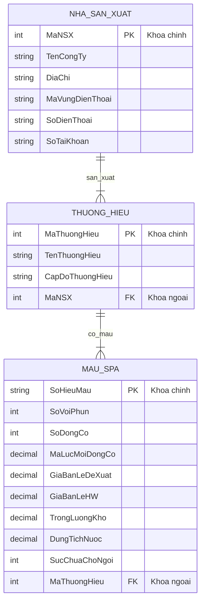

# Solution: Thiết kế ERD cho công ty Hot Water

## 1. Tóm tắt bài toán

Công ty **Hot Water (HW)** bán bồn tắm thủy lực spa. HW không lưu kho để bán trực tiếp; sản phẩm được đặt hàng tại thời điểm bán. Trong phạm vi bài tập này, mô hình dữ liệu tập trung vào các thông tin:

- Nhà sản xuất spa.
- Thương hiệu spa do nhà sản xuất tạo ra.
- Mẫu spa thuộc từng thương hiệu.

Các quy tắc nghiệp vụ chính:

- HW có thể lấy spa từ nhiều nhà sản xuất.
- Một nhà sản xuất sản xuất một hoặc nhiều thương hiệu.
- Một thương hiệu bắt buộc thuộc về đúng một nhà sản xuất.
- Một thương hiệu có một hoặc nhiều mẫu spa.
- Một mẫu spa bắt buộc thuộc về đúng một thương hiệu.

---

## 2. Các thực thể

### 2.1. Nhà sản xuất

Thực thể `NHA_SAN_XUAT` lưu thông tin các nhà sản xuất spa mà HW có thể đặt hàng.

| Thuộc tính | Tên cột đề xuất | Ý nghĩa | Ghi chú |
|---|---|---|---|
| Mã nhà sản xuất | `MaNSX` | Định danh duy nhất nhà sản xuất | Khóa chính |
| Tên công ty | `TenCongTy` | Tên nhà sản xuất | Bắt buộc |
| Địa chỉ | `DiaChi` | Địa chỉ nhà sản xuất | Bắt buộc |
| Mã vùng điện thoại | `MaVungDienThoai` | Mã vùng điện thoại | Có thể để trống |
| Số điện thoại | `SoDienThoai` | Số điện thoại liên hệ | Bắt buộc |
| Số tài khoản | `SoTaiKhoan` | Số tài khoản của nhà sản xuất | Có thể để trống |

Khóa chính:

```text
MaNSX
```

---

### 2.2. Thương hiệu

Thực thể `THUONG_HIEU` lưu các thương hiệu spa. Mỗi thương hiệu được sản xuất bởi đúng một nhà sản xuất.

| Thuộc tính | Tên cột đề xuất | Ý nghĩa | Ghi chú |
|---|---|---|---|
| Mã thương hiệu | `MaThuongHieu` | Định danh duy nhất thương hiệu | Khóa chính |
| Tên thương hiệu | `TenThuongHieu` | Tên thương hiệu spa | Bắt buộc |
| Cấp độ thương hiệu | `CapDoThuongHieu` | Cao cấp, trung cấp, phổ thông | Bắt buộc |
| Mã nhà sản xuất | `MaNSX` | Nhà sản xuất của thương hiệu | Khóa ngoại |

Khóa chính:

```text
MaThuongHieu
```

Khóa ngoại:

```text
MaNSX tham chiếu NHA_SAN_XUAT(MaNSX)
```

Ghi chú: Đề bài chỉ nêu "tên thương hiệu", nhưng khi triển khai cơ sở dữ liệu nên thêm `MaThuongHieu` để định danh ổn định. Tên thương hiệu vẫn có thể đặt ràng buộc duy nhất nếu nghiệp vụ yêu cầu.

---

### 2.3. Mẫu spa

Thực thể `MAU_SPA` lưu các mẫu spa cụ thể thuộc từng thương hiệu.

| Thuộc tính | Tên cột đề xuất | Ý nghĩa | Ghi chú |
|---|---|---|---|
| Số hiệu mẫu | `SoHieuMau` | Định danh mẫu spa | Khóa chính |
| Số vòi phun | `SoVoiPhun` | Số lượng vòi phun | Bắt buộc |
| Số động cơ | `SoDongCo` | Số lượng động cơ | Bắt buộc |
| Số mã lực trên mỗi động cơ | `MaLucMoiDongCo` | Công suất mỗi động cơ | Bắt buộc |
| Giá bán lẻ đề xuất | `GiaBanLeDeXuat` | Giá bán lẻ do nhà sản xuất đề xuất | Bắt buộc |
| Giá bán lẻ của HW | `GiaBanLeHW` | Giá bán lẻ của Hot Water | Bắt buộc |
| Trọng lượng khô | `TrongLuongKho` | Trọng lượng khi chưa có nước | Bắt buộc |
| Dung tích nước | `DungTichNuoc` | Sức chứa nước | Bắt buộc |
| Sức chứa chỗ ngồi | `SucChuaChoNgoi` | Số chỗ ngồi | Bắt buộc |
| Mã thương hiệu | `MaThuongHieu` | Thương hiệu của mẫu spa | Khóa ngoại |

Khóa chính:

```text
SoHieuMau
```

Khóa ngoại:

```text
MaThuongHieu tham chiếu THUONG_HIEU(MaThuongHieu)
```

---

## 3. Các quan hệ

### 3.1. Quan hệ Nhà sản xuất - Thương hiệu

Tên quan hệ đề xuất:

```text
SAN_XUAT
```

Diễn giải:

- Một nhà sản xuất sản xuất một hoặc nhiều thương hiệu.
- Một thương hiệu bắt buộc được sản xuất bởi đúng một nhà sản xuất.

Cardinality:

| Phía tham gia | Sự tham gia | Bội số |
|---|---|---|
| `NHA_SAN_XUAT` | Bắt buộc | 1 hoặc nhiều thương hiệu |
| `THUONG_HIEU` | Bắt buộc | Đúng 1 nhà sản xuất |

Ký hiệu Crow's Foot:

```text
NHA_SAN_XUAT ||--|{ THUONG_HIEU : san_xuat
```

Khi chuyển sang mô hình quan hệ, đặt khóa ngoại `MaNSX` trong bảng `THUONG_HIEU`.

---

### 3.2. Quan hệ Thương hiệu - Mẫu spa

Tên quan hệ đề xuất:

```text
CO_MAU
```

Diễn giải:

- Một thương hiệu có một hoặc nhiều mẫu spa.
- Một mẫu spa bắt buộc thuộc về đúng một thương hiệu.

Cardinality:

| Phía tham gia | Sự tham gia | Bội số |
|---|---|---|
| `THUONG_HIEU` | Bắt buộc | 1 hoặc nhiều mẫu spa |
| `MAU_SPA` | Bắt buộc | Đúng 1 thương hiệu |

Ký hiệu Crow's Foot:

```text
THUONG_HIEU ||--|{ MAU_SPA : co_mau
```

Khi chuyển sang mô hình quan hệ, đặt khóa ngoại `MaThuongHieu` trong bảng `MAU_SPA`.

---

## 4. ERD bằng Mermaid



---

## 5. Mô hình quan hệ

```text
NHA_SAN_XUAT(MaNSX, TenCongTy, DiaChi, MaVungDienThoai, SoDienThoai, SoTaiKhoan)
```

```text
THUONG_HIEU(MaThuongHieu, TenThuongHieu, CapDoThuongHieu, MaNSX)
```

```text
MAU_SPA(SoHieuMau, SoVoiPhun, SoDongCo, MaLucMoiDongCo, GiaBanLeDeXuat, GiaBanLeHW, TrongLuongKho, DungTichNuoc, SucChuaChoNgoi, MaThuongHieu)
```

Ràng buộc khóa:

| Bảng | Khóa chính | Khóa ngoại |
|---|---|---|
| `NHA_SAN_XUAT` | `MaNSX` | Không có |
| `THUONG_HIEU` | `MaThuongHieu` | `MaNSX` tham chiếu `NHA_SAN_XUAT(MaNSX)` |
| `MAU_SPA` | `SoHieuMau` | `MaThuongHieu` tham chiếu `THUONG_HIEU(MaThuongHieu)` |

---

## 6. SQL tạo bảng

Ví dụ dưới đây dùng cú pháp MySQL.

```sql
CREATE DATABASE IF NOT EXISTS hot_water;
USE hot_water;
```

### 6.1. Bảng `NHA_SAN_XUAT`

```sql
CREATE TABLE NHA_SAN_XUAT (
    MaNSX INT AUTO_INCREMENT PRIMARY KEY,
    TenCongTy VARCHAR(150) NOT NULL,
    DiaChi VARCHAR(255) NOT NULL,
    MaVungDienThoai VARCHAR(10),
    SoDienThoai VARCHAR(30) NOT NULL,
    SoTaiKhoan VARCHAR(50),
    CONSTRAINT uq_nha_san_xuat_so_tai_khoan
        UNIQUE (SoTaiKhoan)
);
```

### 6.2. Bảng `THUONG_HIEU`

```sql
CREATE TABLE THUONG_HIEU (
    MaThuongHieu INT AUTO_INCREMENT PRIMARY KEY,
    TenThuongHieu VARCHAR(150) NOT NULL,
    CapDoThuongHieu ENUM('Cao cap', 'Trung cap', 'Pho thong') NOT NULL,
    MaNSX INT NOT NULL,
    CONSTRAINT uq_thuong_hieu_ten
        UNIQUE (TenThuongHieu),
    CONSTRAINT fk_thuong_hieu_nha_san_xuat
        FOREIGN KEY (MaNSX)
        REFERENCES NHA_SAN_XUAT(MaNSX)
        ON UPDATE CASCADE
        ON DELETE RESTRICT
);
```

### 6.3. Bảng `MAU_SPA`

```sql
CREATE TABLE MAU_SPA (
    SoHieuMau VARCHAR(30) PRIMARY KEY,
    SoVoiPhun INT NOT NULL,
    SoDongCo INT NOT NULL,
    MaLucMoiDongCo DECIMAL(5, 2) NOT NULL,
    GiaBanLeDeXuat DECIMAL(12, 2) NOT NULL,
    GiaBanLeHW DECIMAL(12, 2) NOT NULL,
    TrongLuongKho DECIMAL(10, 2) NOT NULL,
    DungTichNuoc DECIMAL(10, 2) NOT NULL,
    SucChuaChoNgoi INT NOT NULL,
    MaThuongHieu INT NOT NULL,
    CONSTRAINT fk_mau_spa_thuong_hieu
        FOREIGN KEY (MaThuongHieu)
        REFERENCES THUONG_HIEU(MaThuongHieu)
        ON UPDATE CASCADE
        ON DELETE RESTRICT,
    CONSTRAINT ck_mau_spa_so_voi_phun
        CHECK (SoVoiPhun >= 0),
    CONSTRAINT ck_mau_spa_so_dong_co
        CHECK (SoDongCo > 0),
    CONSTRAINT ck_mau_spa_ma_luc
        CHECK (MaLucMoiDongCo > 0),
    CONSTRAINT ck_mau_spa_gia_de_xuat
        CHECK (GiaBanLeDeXuat >= 0),
    CONSTRAINT ck_mau_spa_gia_hw
        CHECK (GiaBanLeHW >= 0),
    CONSTRAINT ck_mau_spa_trong_luong
        CHECK (TrongLuongKho > 0),
    CONSTRAINT ck_mau_spa_dung_tich
        CHECK (DungTichNuoc > 0),
    CONSTRAINT ck_mau_spa_suc_chua
        CHECK (SucChuaChoNgoi > 0)
);
```

---

## 7. Dữ liệu minh họa

```sql
INSERT INTO NHA_SAN_XUAT
    (TenCongTy, DiaChi, MaVungDienThoai, SoDienThoai, SoTaiKhoan)
VALUES
    ('Iguana Bay Spas', '100 Spa Industrial Road', '555', '555-0100', 'IBS-001');
```

```sql
INSERT INTO THUONG_HIEU
    (TenThuongHieu, CapDoThuongHieu, MaNSX)
VALUES
    ('Big Blue Iguana', 'Cao cap', 1),
    ('Lazy Lizard', 'Pho thong', 1);
```

```sql
INSERT INTO MAU_SPA
    (SoHieuMau, SoVoiPhun, SoDongCo, MaLucMoiDongCo, GiaBanLeDeXuat, GiaBanLeHW, TrongLuongKho, DungTichNuoc, SucChuaChoNgoi, MaThuongHieu)
VALUES
    ('BBI-6', 81, 2, 6.00, 12999.00, 11999.00, 350.00, 1200.00, 6, 1),
    ('BBI-10', 102, 3, 6.00, 16999.00, 15499.00, 450.00, 1500.00, 10, 1);
```

---

## 8. Ghi chú triển khai

1. `ON DELETE RESTRICT` được dùng để tránh xóa nhà sản xuất khi còn thương hiệu, hoặc xóa thương hiệu khi còn mẫu spa.
2. `MaThuongHieu` được thêm vào vì đề bài chỉ nêu tên thương hiệu, nhưng khóa thay thế dạng số giúp mô hình ổn định hơn.
3. Nếu muốn cho phép hai nhà sản xuất có thương hiệu trùng tên, thay ràng buộc `UNIQUE (TenThuongHieu)` bằng `UNIQUE (MaNSX, TenThuongHieu)`.
4. Các ràng buộc `CHECK` giúp đảm bảo số vòi phun, số động cơ, giá bán, trọng lượng, dung tích và số chỗ ngồi hợp lệ.
