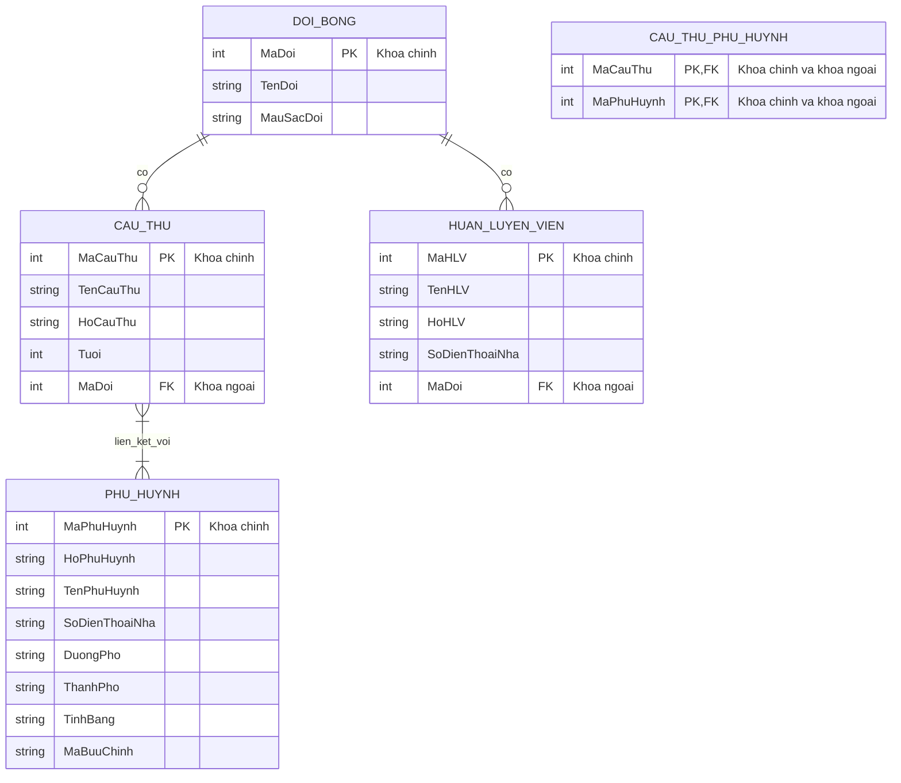

# Tài liệu hướng dẫn: Thiết kế mô hình ER cho hệ thống quản lý đội bóng thiếu nhi

## 1. Bối cảnh bài toán

Liên đoàn bóng đá thiếu nhi của thành phố cần xây dựng một hệ thống cơ sở dữ liệu để quản lý:

- Các đội bóng.
- Các cầu thủ đăng ký thi đấu.
- Phụ huynh của cầu thủ.
- Huấn luyện viên của từng đội.

Mục tiêu của tài liệu này là hướng dẫn từng bước cách xác định **thực thể**, **thuộc tính**, **khóa chính**, **mối quan hệ**, **bội số quan hệ** và cách chuyển từ mô hình ER sang mô hình quan hệ.

---

## 2. Mục tiêu học tập

Sau khi học xong tài liệu này, người học có thể:

1. Xác định các thực thể chính từ mô tả bài toán.
2. Xác định thuộc tính và khóa chính cho từng thực thể.
3. Phân tích mối quan hệ giữa các thực thể.
4. Xác định đúng quan hệ một-nhiều và nhiều-nhiều.
5. Chuyển mô hình ER sang mô hình quan hệ.
6. Biểu diễn mô hình ER bằng sơ đồ Mermaid.

---

## 3. Tóm tắt yêu cầu bài toán

Hệ thống cần lưu dữ liệu về bốn nhóm đối tượng chính:

- Đội bóng.
- Cầu thủ.
- Huấn luyện viên.
- Phụ huynh.

Các mối quan hệ cần biểu diễn:

- Đội bóng liên quan đến cầu thủ.
- Đội bóng liên quan đến huấn luyện viên.
- Cầu thủ liên quan đến phụ huynh.

Các ràng buộc chính:

- Một đội bóng có thể chưa có cầu thủ hoặc có nhiều cầu thủ.
- Một cầu thủ bắt buộc thuộc về đúng một đội bóng.
- Một đội bóng có thể chưa có huấn luyện viên hoặc có nhiều huấn luyện viên.
- Một huấn luyện viên bắt buộc thuộc về đúng một đội bóng.
- Một cầu thủ phải có ít nhất một phụ huynh.
- Một phụ huynh phải gắn với ít nhất một cầu thủ.
- Một cầu thủ có thể có nhiều phụ huynh.
- Một phụ huynh có thể có nhiều cầu thủ.

---


## 4. Câu hỏi dẫn dắt khi thiết kế mô hình ER

### Câu hỏi 1: Bài toán có những thực thể nào?

Thực thể thường là các danh từ quan trọng trong đề bài, đại diện cho những đối tượng cần lưu trữ dữ liệu lâu dài.

<details markdown="1">
<summary>Bấm để xem hướng dẫn xác định thực thể</summary>

Trong bài này, các thực thể là:

| Thực thể | Ý nghĩa |
|---|---|
| Đội bóng | Đội tham gia giải bóng đá thiếu nhi |
| Cầu thủ | Trẻ em đăng ký thi đấu |
| Huấn luyện viên | Người huấn luyện hoặc quản lý đội |
| Phụ huynh | Cha mẹ hoặc người giám hộ của cầu thủ |

Có thể đặt tên thực thể trong mô hình dữ liệu như sau:

| Tên tiếng Việt | Tên dùng trong cơ sở dữ liệu |
|---|---|
| Đội bóng | `DOI_BONG` |
| Cầu thủ | `CAU_THU` |
| Huấn luyện viên | `HUAN_LUYEN_VIEN` |
| Phụ huynh | `PHU_HUYNH` |

</details>

---

### Câu hỏi 2: Mỗi thực thể có những thuộc tính nào?

<details markdown="1">
<summary>Bấm để xem hướng dẫn xác định thuộc tính</summary>

#### Thực thể Đội bóng

| Thuộc tính | Ý nghĩa |
|---|---|
| `MaDoi` | Mã định danh đội bóng |
| `TenDoi` | Tên đội bóng |
| `MauSacDoi` | Màu sắc đại diện của đội |

#### Thực thể Cầu thủ

| Thuộc tính | Ý nghĩa |
|---|---|
| `MaCauThu` | Mã định danh cầu thủ |
| `TenCauThu` | Tên cầu thủ |
| `HoCauThu` | Họ cầu thủ |
| `Tuoi` | Tuổi cầu thủ |

#### Thực thể Huấn luyện viên

| Thuộc tính | Ý nghĩa |
|---|---|
| `MaHLV` | Mã định danh huấn luyện viên |
| `TenHLV` | Tên huấn luyện viên |
| `HoHLV` | Họ huấn luyện viên |
| `SoDienThoaiNha` | Số điện thoại nhà của huấn luyện viên |

#### Thực thể Phụ huynh

| Thuộc tính | Ý nghĩa |
|---|---|
| `MaPhuHuynh` | Mã định danh phụ huynh |
| `HoPhuHuynh` | Họ phụ huynh |
| `TenPhuHuynh` | Tên phụ huynh |
| `SoDienThoaiNha` | Số điện thoại nhà |
| `DuongPho` | Tên đường hoặc phố |
| `ThanhPho` | Thành phố |
| `TinhBang` | Tỉnh hoặc bang |
| `MaBuuChinh` | Mã bưu chính |

Lưu ý: Địa chỉ nhà là một thuộc tính phức hợp, vì vậy có thể tách thành các thuộc tính nhỏ hơn:

```text
DuongPho, ThanhPho, TinhBang, MaBuuChinh
```

</details>

---

### Câu hỏi 3: Khóa chính của từng thực thể là gì?

<details markdown="1">
<summary>Bấm để xem hướng dẫn xác định khóa chính</summary>

Các thuộc tính mã định danh thường được chọn làm khóa chính vì chúng xác định duy nhất mỗi bản ghi.

| Thực thể | Khóa chính |
|---|---|
| Đội bóng | `MaDoi` |
| Cầu thủ | `MaCauThu` |
| Huấn luyện viên | `MaHLV` |
| Phụ huynh | `MaPhuHuynh` |

</details>

---

## 5. Phân tích các mối quan hệ

### 5.1. Quan hệ giữa Đội bóng và Cầu thủ

<details markdown="1">
<summary>Bấm để xem phân tích quan hệ Đội bóng - Cầu thủ</summary>

#### Dữ kiện từ đề bài

- Một đội bóng có thể có hoặc chưa có cầu thủ.
- Một cầu thủ bắt buộc phải thuộc về một đội bóng.
- Một đội bóng có thể có nhiều cầu thủ.
- Một cầu thủ chỉ thuộc về một đội bóng.

#### Diễn giải

Một đội bóng có thể mới được tạo nên chưa có cầu thủ nào. Tuy nhiên, khi một cầu thủ được lưu trong hệ thống, cầu thủ đó phải thuộc về đúng một đội bóng.

#### Phân tích bội số và sự tham gia

| Phía tham gia | Sự tham gia | Bội số |
|---|---|---|
| Đội bóng | Tùy chọn | 0 hoặc nhiều cầu thủ |
| Cầu thủ | Bắt buộc | Đúng 1 đội bóng |

#### Kết luận

Quan hệ giữa Đội bóng và Cầu thủ là quan hệ **một-nhiều**.

```text
Đội bóng 1 --- N Cầu thủ
```

Khi chuyển sang mô hình quan hệ, khóa ngoại `MaDoi` được đặt trong bảng `CAU_THU`.

</details>

---

### 5.2. Quan hệ giữa Đội bóng và Huấn luyện viên

<details markdown="1">
<summary>Bấm để xem phân tích quan hệ Đội bóng - Huấn luyện viên</summary>

#### Dữ kiện từ đề bài

- Một đội bóng có thể có hoặc chưa có huấn luyện viên.
- Một huấn luyện viên bắt buộc phải thuộc về một đội bóng.
- Một đội bóng có thể có nhiều huấn luyện viên.
- Một huấn luyện viên chỉ thuộc về một đội bóng.

#### Diễn giải

Một đội bóng có thể chưa phân công huấn luyện viên. Tuy nhiên, khi một huấn luyện viên được lưu trong hệ thống, huấn luyện viên đó phải gắn với đúng một đội bóng.

#### Phân tích bội số và sự tham gia

| Phía tham gia | Sự tham gia | Bội số |
|---|---|---|
| Đội bóng | Tùy chọn | 0 hoặc nhiều huấn luyện viên |
| Huấn luyện viên | Bắt buộc | Đúng 1 đội bóng |

#### Kết luận

Quan hệ giữa Đội bóng và Huấn luyện viên là quan hệ **một-nhiều**.

```text
Đội bóng 1 --- N Huấn luyện viên
```

Khi chuyển sang mô hình quan hệ, khóa ngoại `MaDoi` được đặt trong bảng `HUAN_LUYEN_VIEN`.

</details>

---

### 5.3. Quan hệ giữa Cầu thủ và Phụ huynh

<details markdown="1">
<summary>Bấm để xem phân tích quan hệ Cầu thủ - Phụ huynh</summary>

#### Dữ kiện từ đề bài

- Một cầu thủ bắt buộc phải có phụ huynh.
- Một phụ huynh bắt buộc phải gắn với cầu thủ.
- Một cầu thủ có thể có nhiều phụ huynh.
- Một phụ huynh có thể có nhiều cầu thủ.

#### Diễn giải

Một cầu thủ có thể có nhiều phụ huynh hoặc người giám hộ. Một phụ huynh cũng có thể có nhiều con cùng tham gia giải bóng đá.

#### Phân tích bội số và sự tham gia

| Phía tham gia | Sự tham gia | Bội số |
|---|---|---|
| Cầu thủ | Bắt buộc | 1 hoặc nhiều phụ huynh |
| Phụ huynh | Bắt buộc | 1 hoặc nhiều cầu thủ |

#### Kết luận

Quan hệ giữa Cầu thủ và Phụ huynh là quan hệ **nhiều-nhiều**.

```text
Cầu thủ M --- N Phụ huynh
```

Vì đây là quan hệ nhiều-nhiều, khi chuyển sang mô hình quan hệ, cần tạo bảng trung gian:

```text
CAU_THU_PHU_HUYNH(MaCauThu, MaPhuHuynh)
```

Trong đó:

- `MaCauThu` là khóa ngoại tham chiếu đến bảng `CAU_THU`.
- `MaPhuHuynh` là khóa ngoại tham chiếu đến bảng `PHU_HUYNH`.
- Khóa chính của bảng trung gian có thể là cặp `(MaCauThu, MaPhuHuynh)`.

</details>

---

## 6. Mô hình ER dạng văn bản

<details open markdown="1">
<summary>Bấm để ẩn/hiện mô hình ER dạng văn bản</summary>

```text
DOI_BONG
- MaDoi (khóa chính)
- TenDoi
- MauSacDoi

CAU_THU
- MaCauThu (khóa chính)
- TenCauThu
- HoCauThu
- Tuoi
- MaDoi (khóa ngoại)

HUAN_LUYEN_VIEN
- MaHLV (khóa chính)
- TenHLV
- HoHLV
- SoDienThoaiNha
- MaDoi (khóa ngoại)

PHU_HUYNH
- MaPhuHuynh (khóa chính)
- HoPhuHuynh
- TenPhuHuynh
- SoDienThoaiNha
- DuongPho
- ThanhPho
- TinhBang
- MaBuuChinh

CAU_THU_PHU_HUYNH
- MaCauThu (khóa chính, khóa ngoại)
- MaPhuHuynh (khóa chính, khóa ngoại)
```

</details>

---

## 7. Sơ đồ ER bằng Mermaid

<details open markdown="1">
<summary>Bấm để ẩn/hiện mã Mermaid</summary>



</details>

---


## 8. Chuyển mô hình ER sang mô hình quan hệ

<details open markdown="1">
<summary>Bấm để ẩn/hiện mô hình quan hệ</summary>

### 8.1. Bảng DOI_BONG

```text
DOI_BONG(MaDoi, TenDoi, MauSacDoi)
```

Khóa chính:

```text
MaDoi
```

---

### 8.2. Bảng CAU_THU

```text
CAU_THU(MaCauThu, TenCauThu, HoCauThu, Tuoi, MaDoi)
```

Khóa chính:

```text
MaCauThu
```

Khóa ngoại:

```text
MaDoi tham chiếu DOI_BONG(MaDoi)
```

Ràng buộc:

```text
MaDoi không được rỗng
```

Lý do: Một cầu thủ bắt buộc phải thuộc về một đội bóng.

---

### 8.3. Bảng HUAN_LUYEN_VIEN

```text
HUAN_LUYEN_VIEN(MaHLV, TenHLV, HoHLV, SoDienThoaiNha, MaDoi)
```

Khóa chính:

```text
MaHLV
```

Khóa ngoại:

```text
MaDoi tham chiếu DOI_BONG(MaDoi)
```

Ràng buộc:

```text
MaDoi không được rỗng
```

Lý do: Một huấn luyện viên bắt buộc phải thuộc về một đội bóng.

---

### 8.4. Bảng PHU_HUYNH

```text
PHU_HUYNH(MaPhuHuynh, HoPhuHuynh, TenPhuHuynh, SoDienThoaiNha, DuongPho, ThanhPho, TinhBang, MaBuuChinh)
```

Khóa chính:

```text
MaPhuHuynh
```

---

### 8.5. Bảng CAU_THU_PHU_HUYNH

```text
CAU_THU_PHU_HUYNH(MaCauThu, MaPhuHuynh)
```

Khóa chính:

```text
(MaCauThu, MaPhuHuynh)
```

Khóa ngoại:

```text
MaCauThu tham chiếu CAU_THU(MaCauThu)
MaPhuHuynh tham chiếu PHU_HUYNH(MaPhuHuynh)
```

Bảng này dùng để biểu diễn quan hệ nhiều-nhiều giữa cầu thủ và phụ huynh.

</details>

---

## 9. Quy trình thực hiện bài thiết kế ER

### Bước 1: Đọc kỹ đề bài

<details markdown="1">
<summary>Bấm để xem hướng dẫn</summary>

Gạch chân các danh từ chính và các cụm từ thể hiện quan hệ.

Trong bài này, các danh từ chính là:

```text
Đội bóng, Cầu thủ, Huấn luyện viên, Phụ huynh
```

Các cụm quan hệ chính là:

```text
Đội bóng có cầu thủ
Đội bóng có huấn luyện viên
Cầu thủ có phụ huynh
```

</details>

---

### Bước 2: Xác định thực thể

<details markdown="1">
<summary>Bấm để xem hướng dẫn</summary>

Chọn các đối tượng cần lưu trữ dữ liệu lâu dài.

Kết quả:

```text
Đội bóng
Cầu thủ
Huấn luyện viên
Phụ huynh
```

</details>

---

### Bước 3: Xác định thuộc tính

<details markdown="1">
<summary>Bấm để xem hướng dẫn</summary>

Gán các thuộc tính tương ứng cho từng thực thể.

Ví dụ:

```text
CAU_THU(MaCauThu, TenCauThu, HoCauThu, Tuoi)
```

</details>

---

### Bước 4: Chọn khóa chính

<details markdown="1">
<summary>Bấm để xem hướng dẫn</summary>

Chọn thuộc tính định danh duy nhất cho mỗi thực thể.

Ví dụ:

```text
MaCauThu là khóa chính của thực thể Cầu thủ.
```

</details>

---

### Bước 5: Xác định mối quan hệ

<details markdown="1">
<summary>Bấm để xem hướng dẫn</summary>

Dựa vào đề bài, xác định ba mối quan hệ chính:

```text
Đội bóng - Cầu thủ
Đội bóng - Huấn luyện viên
Cầu thủ - Phụ huynh
```

</details>

---

### Bước 6: Xác định bội số quan hệ

<details markdown="1">
<summary>Bấm để xem hướng dẫn</summary>

Trả lời các câu hỏi dạng:

- Một đội bóng có thể có bao nhiêu cầu thủ?
- Một cầu thủ thuộc bao nhiêu đội bóng?
- Một đội bóng có thể có bao nhiêu huấn luyện viên?
- Một huấn luyện viên thuộc bao nhiêu đội bóng?
- Một cầu thủ có thể có bao nhiêu phụ huynh?
- Một phụ huynh có thể có bao nhiêu cầu thủ?

</details>

---

### Bước 7: Xác định sự tham gia bắt buộc hoặc tùy chọn

<details markdown="1">
<summary>Bấm để xem hướng dẫn</summary>

Xác định mỗi phía trong quan hệ là bắt buộc hay tùy chọn.

Ví dụ:

```text
Một đội bóng có thể chưa có cầu thủ.
```

Nghĩa là phía đội bóng tham gia tùy chọn trong quan hệ với cầu thủ.

```text
Một cầu thủ bắt buộc phải thuộc về một đội bóng.
```

Nghĩa là phía cầu thủ tham gia bắt buộc trong quan hệ với đội bóng.

</details>

---

### Bước 8: Xử lý quan hệ nhiều-nhiều

<details markdown="1">
<summary>Bấm để xem hướng dẫn</summary>

Nếu một quan hệ là nhiều-nhiều, cần tạo bảng trung gian.

Trong bài này:

```text
Cầu thủ nhiều-nhiều Phụ huynh
```

Chuyển thành:

```text
CAU_THU_PHU_HUYNH(MaCauThu, MaPhuHuynh)
```

</details>

---

### Bước 9: Kiểm tra lại mô hình

<details markdown="1">
<summary>Bấm để xem bảng kiểm tra</summary>

| Yêu cầu | Cách mô hình đáp ứng |
|---|---|
| Một đội bóng có thể có nhiều cầu thủ | Quan hệ `DOI_BONG ||--o{ CAU_THU` |
| Một cầu thủ chỉ thuộc một đội bóng | `MaDoi` là khóa ngoại bắt buộc trong `CAU_THU` |
| Một đội bóng có thể có nhiều huấn luyện viên | Quan hệ `DOI_BONG ||--o{ HUAN_LUYEN_VIEN` |
| Một huấn luyện viên chỉ thuộc một đội bóng | `MaDoi` là khóa ngoại bắt buộc trong `HUAN_LUYEN_VIEN` |
| Một cầu thủ có thể có nhiều phụ huynh | Quan hệ nhiều-nhiều qua `CAU_THU_PHU_HUYNH` |
| Một phụ huynh có thể có nhiều cầu thủ | Quan hệ nhiều-nhiều qua `CAU_THU_PHU_HUYNH` |
| Một cầu thủ phải có phụ huynh | Biểu diễn bằng sự tham gia bắt buộc trong mô hình ER |
| Một phụ huynh phải gắn với cầu thủ | Biểu diễn bằng sự tham gia bắt buộc trong mô hình ER |

</details>

---

## 10. Ghi chú quan trọng về ràng buộc “ít nhất một”

Trong mô hình ER, ta có thể biểu diễn rằng:

```text
Một cầu thủ phải có ít nhất một phụ huynh.
Một phụ huynh phải gắn với ít nhất một cầu thủ.
```

<details markdown="1">
<summary>Bấm để xem lưu ý khi cài đặt trong cơ sở dữ liệu quan hệ</summary>

Khi chuyển sang cơ sở dữ liệu quan hệ, ràng buộc “ít nhất một” trong quan hệ nhiều-nhiều thường không thể đảm bảo chỉ bằng khóa ngoại đơn giản.

Ví dụ:

- Có thể tạo một cầu thủ trước nhưng chưa có dòng tương ứng trong bảng `CAU_THU_PHU_HUYNH`.
- Có thể tạo một phụ huynh trước nhưng chưa có dòng tương ứng trong bảng `CAU_THU_PHU_HUYNH`.

Để đảm bảo chặt chẽ ràng buộc này, có thể cần:

- Cơ chế kiểm tra tự động trong cơ sở dữ liệu.
- Thủ tục lưu trữ.
- Kiểm tra ở tầng ứng dụng.
- Giao dịch dữ liệu khi thêm đồng thời cầu thủ, phụ huynh và bản ghi liên kết.

</details>

---

## 11. Bài tập thực hành: Thiết kế ERD cho công ty Hot Water

### Yêu cầu

Hãy tạo một **sơ đồ ERD hoàn chỉnh theo ký hiệu Crow’s Foot** sao cho mô hình này có thể chuyển sang và cài đặt được trong **mô hình quan hệ**.

### Mô tả bài toán

Công ty **Hot Water (HW)** là một công ty khởi nghiệp nhỏ chuyên bán bồn tắm thủy lực spa. HW không lưu trữ hàng tồn kho để bán trực tiếp. Một vài mẫu spa được trưng bày trong một nhà kho đơn giản để khách hàng có thể xem các mẫu hiện có. Tuy nhiên, mọi sản phẩm được bán đều phải được đặt hàng tại thời điểm bán.

### Mô tả hoạt động

- HW có thể lấy spa từ nhiều nhà sản xuất khác nhau.
- Mỗi nhà sản xuất sản xuất một hoặc nhiều thương hiệu spa khác nhau.
- Mỗi thương hiệu bắt buộc được sản xuất bởi đúng một nhà sản xuất.
- Mỗi thương hiệu có một hoặc nhiều mẫu spa.
- Mỗi mẫu spa bắt buộc thuộc về một thương hiệu.

Ví dụ: **Iguana Bay Spas** là một nhà sản xuất tạo ra thương hiệu **Big Blue Iguana**, thuộc phân khúc cao cấp, và thương hiệu **Lazy Lizard**, thuộc phân khúc phổ thông. Thương hiệu Big Blue Iguana có nhiều mẫu spa, trong đó có mẫu **BBI-6**, là spa có 81 vòi phun với hai động cơ 6 mã lực, và mẫu **BBI-10**, là spa có 102 vòi phun với ba động cơ 6 mã lực.

### Dữ liệu cần lưu trữ

#### Nhà sản xuất

Mỗi nhà sản xuất được định danh bằng **mã nhà sản xuất**. Hệ thống cần lưu các thông tin sau cho mỗi nhà sản xuất:

- Mã nhà sản xuất.
- Tên công ty.
- Địa chỉ.
- Mã vùng điện thoại.
- Số điện thoại.
- Số tài khoản.

#### Thương hiệu

Với mỗi thương hiệu, hệ thống cần lưu:

- Tên thương hiệu.
- Cấp độ thương hiệu.

Cấp độ thương hiệu có thể là:

- Cao cấp.
- Trung cấp.
- Phổ thông.

#### Mẫu spa

Với mỗi mẫu spa, hệ thống cần lưu:

- Số hiệu mẫu.
- Số vòi phun.
- Số động cơ.
- Số mã lực trên mỗi động cơ.
- Giá bán lẻ đề xuất.
- Giá bán lẻ của HW.
- Trọng lượng khô.
- Dung tích nước.
- Sức chứa chỗ ngồi.

### Gợi ý yêu cầu khi làm bài

<details markdown="1">
<summary>Bấm để xem yêu cầu phân tích</summary>

Khi thiết kế ERD, cần xác định rõ:

- Các thực thể chính.
- Thuộc tính của từng thực thể.
- Khóa chính của từng thực thể.
- Các quan hệ giữa các thực thể.
- Bội số quan hệ theo ký hiệu Crow’s Foot.
- Sự tham gia bắt buộc hoặc tùy chọn của mỗi thực thể trong từng quan hệ.
- Cách chuyển mô hình ER sang các bảng trong mô hình quan hệ.

</details>

---

## 12. Bài tập thực hành: United Helpers

### Yêu cầu

Dựa trên mô tả hoạt động dưới đây, hãy tạo một **sơ đồ ERD đầy đủ bằng ký hiệu Crow’s Foot** và có thể triển khai được trong mô hình quan hệ.

### Mô tả đề bài

United Helpers là một tổ chức phi lợi nhuận chuyên cung cấp hỗ trợ cho người dân sau các thảm họa thiên nhiên. Dựa trên mô tả ngắn gọn sau đây về hoạt động của tổ chức, hãy xây dựng sơ đồ ERD Crow’s Foot được gắn nhãn đầy đủ.

- Các tình nguyện viên thực hiện các nhiệm vụ của tổ chức. Hệ thống cần lưu tên, địa chỉ và số điện thoại của mỗi tình nguyện viên. Mỗi tình nguyện viên có thể được phân công cho nhiều nhiệm vụ, và một số nhiệm vụ cần nhiều tình nguyện viên. Một tình nguyện viên có thể đã có trong hệ thống nhưng chưa được phân công nhiệm vụ nào. Cũng có thể tồn tại các nhiệm vụ chưa có ai được phân công. Khi một tình nguyện viên được phân công cho một nhiệm vụ, hệ thống cần lưu thời gian bắt đầu và thời gian kết thúc của lần phân công đó.

- Mỗi nhiệm vụ có mã nhiệm vụ, mô tả nhiệm vụ, loại nhiệm vụ và trạng thái nhiệm vụ. Ví dụ, có thể có một nhiệm vụ với mã nhiệm vụ là “101”, mô tả là “trả lời điện thoại”, loại là “định kỳ”, và trạng thái là “đang thực hiện”. Một nhiệm vụ khác có thể có mã “102”, mô tả là “chuẩn bị 5.000 gói vật tư y tế cơ bản”, loại là “đóng gói”, và trạng thái là “mở”.

- Đối với tất cả các nhiệm vụ có loại là “đóng gói”, sẽ có một danh sách đóng gói quy định nội dung của các gói hàng. Có nhiều danh sách đóng gói khác nhau để tạo ra các loại gói hàng khác nhau, chẳng hạn như gói y tế cơ bản, gói chăm sóc trẻ em và gói thực phẩm. Mỗi danh sách đóng gói có một mã số định danh, tên danh sách đóng gói và mô tả danh sách đóng gói, trong đó mô tả các mặt hàng nên có trong gói hàng. Mỗi nhiệm vụ đóng gói được gắn với đúng một danh sách đóng gói. Một danh sách đóng gói có thể chưa được gắn với nhiệm vụ nào, hoặc có thể được gắn với nhiều nhiệm vụ. Các nhiệm vụ không thuộc loại “đóng gói” thì không được gắn với danh sách đóng gói nào.

- Các nhiệm vụ đóng gói tạo ra các gói hàng. Mỗi gói vật tư riêng lẻ do tổ chức tạo ra đều được theo dõi, và mỗi gói hàng được gán một mã số định danh. Ngày tạo gói hàng và tổng trọng lượng của gói hàng được lưu lại. Một gói hàng cụ thể chỉ được gắn với đúng một nhiệm vụ. Một số nhiệm vụ, chẳng hạn như “trả lời điện thoại”, sẽ không tạo ra gói hàng nào; trong khi các nhiệm vụ khác, chẳng hạn như “chuẩn bị 5.000 gói vật tư y tế cơ bản”, sẽ được gắn với nhiều gói hàng.

- Danh sách đóng gói mô tả nội dung lý tưởng của mỗi gói hàng, nhưng không phải lúc nào cũng có thể đưa vào đúng số lượng lý tưởng của từng mặt hàng. Vì vậy, hệ thống cần theo dõi các mặt hàng thực tế được đưa vào từng gói hàng. Một gói hàng có thể chứa nhiều mặt hàng khác nhau, và một mặt hàng cụ thể có thể được sử dụng trong nhiều gói hàng khác nhau.

- Mỗi mặt hàng mà tổ chức cung cấp có mã số định danh mặt hàng, mô tả mặt hàng, giá trị mặt hàng và số lượng hiện có trong kho được lưu trong hệ thống. Bên cạnh việc theo dõi các mặt hàng thực tế được đặt vào từng gói hàng, hệ thống cũng phải lưu số lượng của từng mặt hàng được đặt vào gói hàng đó. Ví dụ, một danh sách đóng gói có thể quy định rằng các gói y tế cơ bản cần bao gồm 100 băng gạc, 4 chai iodine và 4 chai hydrogen peroxide. Tuy nhiên, do nguồn cung mặt hàng bị hạn chế, một gói hàng cụ thể có thể chỉ bao gồm 10 băng gạc, 1 chai iodine và không có chai hydrogen peroxide nào. Việc gói hàng đó có chứa băng gạc và iodine cần được ghi lại cùng với số lượng của từng mặt hàng được đưa vào. Tổ chức có thể có các mặt hàng chưa từng được đưa vào bất kỳ gói hàng nào, nhưng mỗi gói hàng bắt buộc phải chứa ít nhất một mặt hàng.

### Gợi ý yêu cầu khi làm bài

<details markdown="1">
<summary>Bấm để xem yêu cầu phân tích</summary>

Khi thiết kế ERD, cần xác định rõ:

- Các thực thể chính.
- Thuộc tính của từng thực thể.
- Khóa chính của từng thực thể.
- Các quan hệ một-nhiều và nhiều-nhiều.
- Các thực thể liên kết cần thiết cho quan hệ nhiều-nhiều.
- Thuộc tính của quan hệ, ví dụ thời gian bắt đầu, thời gian kết thúc, hoặc số lượng thực tế.
- Bội số quan hệ theo ký hiệu Crow’s Foot.
- Sự tham gia bắt buộc hoặc tùy chọn của mỗi thực thể trong từng quan hệ.
- Các trường hợp đặc biệt, ví dụ chỉ nhiệm vụ loại “đóng gói” mới gắn với danh sách đóng gói.
- Cách chuyển ERD sang các bảng trong mô hình quan hệ.

</details>
