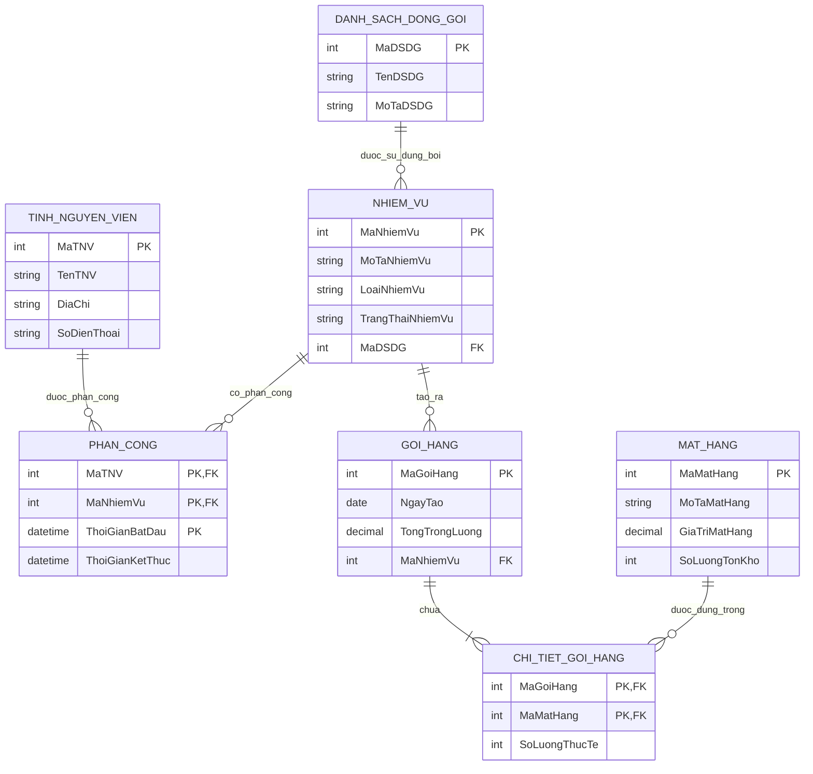

# Tutorial: Xây dựng ERD cho United Helpers

## 1. Mục tiêu học tập

Sau khi hoàn thành tutorial này, người học có thể:

1. Đọc mô tả nghiệp vụ và xác định các thực thể chính.
2. Xác định thuộc tính và khóa chính cho từng thực thể.
3. Phân tích quan hệ một-nhiều và nhiều-nhiều.
4. Tạo thực thể liên kết cho quan hệ nhiều-nhiều có thuộc tính riêng.
5. Xác định bội số và sự tham gia bắt buộc/tùy chọn theo Crow's Foot.
6. Chuyển ERD sang mô hình quan hệ.

---

## 2. Tóm tắt đề bài

United Helpers là một tổ chức phi lợi nhuận hỗ trợ người dân sau thảm họa thiên nhiên. Hệ thống cần quản lý:

- Tình nguyện viên.
- Nhiệm vụ của tổ chức.
- Danh sách đóng gói dùng cho các nhiệm vụ đóng gói.
- Các gói hàng được tạo ra.
- Các mặt hàng thực tế được đưa vào từng gói hàng.

Một số yêu cầu quan trọng:

- Tình nguyện viên có thể được phân công cho nhiều nhiệm vụ.
- Nhiệm vụ có thể cần nhiều tình nguyện viên.
- Khi phân công, cần lưu thời gian bắt đầu và thời gian kết thúc.
- Mỗi nhiệm vụ có mã nhiệm vụ, mô tả, loại và trạng thái.
- Nhiệm vụ loại “đóng gói” được gắn với đúng một danh sách đóng gói.
- Một danh sách đóng gói có thể chưa được dùng hoặc được dùng bởi nhiều nhiệm vụ.
- Một nhiệm vụ có thể tạo ra nhiều gói hàng hoặc không tạo ra gói hàng nào.
- Mỗi gói hàng thuộc đúng một nhiệm vụ.
- Một gói hàng chứa ít nhất một mặt hàng.
- Một mặt hàng có thể xuất hiện trong nhiều gói hàng hoặc chưa từng xuất hiện trong gói nào.
- Cần lưu số lượng thực tế của từng mặt hàng trong từng gói hàng.

---

## 3. Bước 1: Xác định thực thể chính

Khi đọc đề, trước hết tìm các danh từ quan trọng đại diện cho những đối tượng cần lưu trữ dữ liệu lâu dài.

Các thực thể chính là:

| STT | Thực thể | Tên bảng gợi ý | Lý do chọn |
|---:|---|---|---|
| 1 | Tình nguyện viên | `TINH_NGUYEN_VIEN` | Cần lưu tên, địa chỉ, số điện thoại |
| 2 | Nhiệm vụ | `NHIEM_VU` | Cần lưu mã, mô tả, loại, trạng thái |
| 3 | Danh sách đóng gói | `DANH_SACH_DONG_GOI` | Cần lưu mã, tên, mô tả danh sách |
| 4 | Gói hàng | `GOI_HANG` | Mỗi gói hàng được theo dõi riêng |
| 5 | Mặt hàng | `MAT_HANG` | Cần lưu mã, mô tả, giá trị, tồn kho |

---

## 4. Bước 2: Xác định thuộc tính và khóa chính

### 4.1. Tình nguyện viên

Đề bài yêu cầu lưu tên, địa chỉ và số điện thoại của mỗi tình nguyện viên. Ta bổ sung mã tình nguyện viên làm khóa chính.

```text
TINH_NGUYEN_VIEN(MaTNV, TenTNV, DiaChi, SoDienThoai)
```

Khóa chính:

```text
MaTNV
```

---

### 4.2. Nhiệm vụ

Mỗi nhiệm vụ có mã nhiệm vụ, mô tả, loại và trạng thái.

```text
NHIEM_VU(MaNhiemVu, MoTaNhiemVu, LoaiNhiemVu, TrangThaiNhiemVu, MaDSDG)
```

Khóa chính:

```text
MaNhiemVu
```

`MaDSDG` là khóa ngoại tùy chọn, dùng khi nhiệm vụ là nhiệm vụ đóng gói.

---

### 4.3. Danh sách đóng gói

Mỗi danh sách đóng gói có mã định danh, tên và mô tả.

```text
DANH_SACH_DONG_GOI(MaDSDG, TenDSDG, MoTaDSDG)
```

Khóa chính:

```text
MaDSDG
```

---

### 4.4. Gói hàng

Mỗi gói hàng có mã định danh, ngày tạo và tổng trọng lượng. Mỗi gói hàng thuộc đúng một nhiệm vụ, nên cần thêm khóa ngoại `MaNhiemVu`.

```text
GOI_HANG(MaGoiHang, NgayTao, TongTrongLuong, MaNhiemVu)
```

Khóa chính:

```text
MaGoiHang
```

Khóa ngoại:

```text
MaNhiemVu tham chiếu NHIEM_VU(MaNhiemVu)
```

---

### 4.5. Mặt hàng

Mỗi mặt hàng có mã định danh, mô tả, giá trị và số lượng hiện có trong kho.

```text
MAT_HANG(MaMatHang, MoTaMatHang, GiaTriMatHang, SoLuongTonKho)
```

Khóa chính:

```text
MaMatHang
```

---

## 5. Bước 3: Xác định quan hệ nhiều-nhiều

Trong bài có hai quan hệ nhiều-nhiều cần chuyển thành thực thể liên kết.

### 5.1. Tình nguyện viên và nhiệm vụ

Đề bài cho biết:

- Một tình nguyện viên có thể được phân công cho nhiều nhiệm vụ.
- Một nhiệm vụ có thể cần nhiều tình nguyện viên.
- Khi phân công, cần lưu thời gian bắt đầu và thời gian kết thúc.

Vì vậy, quan hệ giữa `TINH_NGUYEN_VIEN` và `NHIEM_VU` là nhiều-nhiều và có thuộc tính riêng. Ta tạo thực thể liên kết:

```text
PHAN_CONG(MaTNV, MaNhiemVu, ThoiGianBatDau, ThoiGianKetThuc)
```

Khóa chính gợi ý:

```text
(MaTNV, MaNhiemVu, ThoiGianBatDau)
```

Lý do thêm `ThoiGianBatDau` vào khóa chính: cùng một tình nguyện viên có thể được phân công lại cho cùng một nhiệm vụ ở thời điểm khác.

---

### 5.2. Gói hàng và mặt hàng

Đề bài cho biết:

- Một gói hàng có thể chứa nhiều mặt hàng.
- Một mặt hàng có thể được dùng trong nhiều gói hàng.
- Cần lưu số lượng thực tế của từng mặt hàng trong từng gói hàng.

Vì vậy, quan hệ giữa `GOI_HANG` và `MAT_HANG` là nhiều-nhiều và có thuộc tính riêng. Ta tạo thực thể liên kết:

```text
CHI_TIET_GOI_HANG(MaGoiHang, MaMatHang, SoLuongThucTe)
```

Khóa chính:

```text
(MaGoiHang, MaMatHang)
```

`SoLuongThucTe` thuộc về cặp `(MaGoiHang, MaMatHang)`, không thuộc riêng về `GOI_HANG` hay `MAT_HANG`.

---

## 6. Bước 4: Xác định các quan hệ và bội số

### 6.1. Tình nguyện viên - Phân công - Nhiệm vụ

| Quan hệ | Bội số | Ý nghĩa |
|---|---|---|
| `TINH_NGUYEN_VIEN` đến `PHAN_CONG` | 0..N | Một tình nguyện viên có thể chưa được phân công hoặc có nhiều lần phân công |
| `NHIEM_VU` đến `PHAN_CONG` | 0..N | Một nhiệm vụ có thể chưa có ai hoặc có nhiều tình nguyện viên |
| `PHAN_CONG` đến `TINH_NGUYEN_VIEN` | 1 | Mỗi lần phân công thuộc đúng một tình nguyện viên |
| `PHAN_CONG` đến `NHIEM_VU` | 1 | Mỗi lần phân công thuộc đúng một nhiệm vụ |

Biểu diễn ngắn gọn:

```text
TINH_NGUYEN_VIEN 1 --- 0..N PHAN_CONG
NHIEM_VU          1 --- 0..N PHAN_CONG
```

---

### 6.2. Danh sách đóng gói - Nhiệm vụ

Đề bài cho biết:

- Mỗi nhiệm vụ đóng gói được gắn với đúng một danh sách đóng gói.
- Một danh sách đóng gói có thể chưa được dùng hoặc được dùng bởi nhiều nhiệm vụ.
- Nhiệm vụ không phải đóng gói thì không gắn với danh sách đóng gói.

Biểu diễn quan hệ tổng quát:

```text
DANH_SACH_DONG_GOI 1 --- 0..N NHIEM_VU
```

Trong lược đồ quan hệ, `NHIEM_VU.MaDSDG` có thể rỗng đối với nhiệm vụ không phải đóng gói.

Ràng buộc cần ghi chú:

```text
Nếu LoaiNhiemVu = 'đóng gói' thì MaDSDG bắt buộc khác NULL.
Nếu LoaiNhiemVu khác 'đóng gói' thì MaDSDG phải NULL.
```

---

### 6.3. Nhiệm vụ - Gói hàng

Đề bài cho biết:

- Một nhiệm vụ có thể không tạo ra gói hàng nào.
- Một nhiệm vụ có thể tạo ra nhiều gói hàng.
- Mỗi gói hàng thuộc đúng một nhiệm vụ.

Biểu diễn:

```text
NHIEM_VU 1 --- 0..N GOI_HANG
```

Trong bảng `GOI_HANG`, `MaNhiemVu` là khóa ngoại bắt buộc.

---

### 6.4. Gói hàng - Chi tiết gói hàng - Mặt hàng

| Quan hệ | Bội số | Ý nghĩa |
|---|---|---|
| `GOI_HANG` đến `CHI_TIET_GOI_HANG` | 1..N | Mỗi gói hàng phải chứa ít nhất một mặt hàng |
| `MAT_HANG` đến `CHI_TIET_GOI_HANG` | 0..N | Một mặt hàng có thể chưa từng được đưa vào gói nào |
| `CHI_TIET_GOI_HANG` đến `GOI_HANG` | 1 | Mỗi dòng chi tiết thuộc đúng một gói hàng |
| `CHI_TIET_GOI_HANG` đến `MAT_HANG` | 1 | Mỗi dòng chi tiết thuộc đúng một mặt hàng |

Biểu diễn ngắn gọn:

```text
GOI_HANG 1 --- 1..N CHI_TIET_GOI_HANG
MAT_HANG 1 --- 0..N CHI_TIET_GOI_HANG
```

---

## 7. Mô hình ER dạng văn bản

```text
TINH_NGUYEN_VIEN
- MaTNV (PK)
- TenTNV
- DiaChi
- SoDienThoai

NHIEM_VU
- MaNhiemVu (PK)
- MoTaNhiemVu
- LoaiNhiemVu
- TrangThaiNhiemVu
- MaDSDG (FK, nullable)

DANH_SACH_DONG_GOI
- MaDSDG (PK)
- TenDSDG
- MoTaDSDG

GOI_HANG
- MaGoiHang (PK)
- NgayTao
- TongTrongLuong
- MaNhiemVu (FK, NOT NULL)

MAT_HANG
- MaMatHang (PK)
- MoTaMatHang
- GiaTriMatHang
- SoLuongTonKho

PHAN_CONG
- MaTNV (PK, FK)
- MaNhiemVu (PK, FK)
- ThoiGianBatDau (PK)
- ThoiGianKetThuc

CHI_TIET_GOI_HANG
- MaGoiHang (PK, FK)
- MaMatHang (PK, FK)
- SoLuongThucTe
```

---

## 8. ERD bằng Mermaid



---

## 9. Chuyển sang mô hình quan hệ

### 9.1. TINH_NGUYEN_VIEN

```text
TINH_NGUYEN_VIEN(MaTNV, TenTNV, DiaChi, SoDienThoai)
```

Khóa chính: `MaTNV`

---

### 9.2. DANH_SACH_DONG_GOI

```text
DANH_SACH_DONG_GOI(MaDSDG, TenDSDG, MoTaDSDG)
```

Khóa chính: `MaDSDG`

---

### 9.3. NHIEM_VU

```text
NHIEM_VU(MaNhiemVu, MoTaNhiemVu, LoaiNhiemVu, TrangThaiNhiemVu, MaDSDG)
```

Khóa chính: `MaNhiemVu`

Khóa ngoại:

```text
MaDSDG tham chiếu DANH_SACH_DONG_GOI(MaDSDG)
```

Ràng buộc:

```text
Nếu LoaiNhiemVu = 'đóng gói' thì MaDSDG khác NULL.
Nếu LoaiNhiemVu khác 'đóng gói' thì MaDSDG phải NULL.
```

---

### 9.4. PHAN_CONG

```text
PHAN_CONG(MaTNV, MaNhiemVu, ThoiGianBatDau, ThoiGianKetThuc)
```

Khóa chính: `(MaTNV, MaNhiemVu, ThoiGianBatDau)`

Khóa ngoại:

```text
MaTNV tham chiếu TINH_NGUYEN_VIEN(MaTNV)
MaNhiemVu tham chiếu NHIEM_VU(MaNhiemVu)
```

---

### 9.5. GOI_HANG

```text
GOI_HANG(MaGoiHang, NgayTao, TongTrongLuong, MaNhiemVu)
```

Khóa chính: `MaGoiHang`

Khóa ngoại:

```text
MaNhiemVu tham chiếu NHIEM_VU(MaNhiemVu)
```

Ràng buộc: `MaNhiemVu NOT NULL`

---

### 9.6. MAT_HANG

```text
MAT_HANG(MaMatHang, MoTaMatHang, GiaTriMatHang, SoLuongTonKho)
```

Khóa chính: `MaMatHang`

---

### 9.7. CHI_TIET_GOI_HANG

```text
CHI_TIET_GOI_HANG(MaGoiHang, MaMatHang, SoLuongThucTe)
```

Khóa chính: `(MaGoiHang, MaMatHang)`

Khóa ngoại:

```text
MaGoiHang tham chiếu GOI_HANG(MaGoiHang)
MaMatHang tham chiếu MAT_HANG(MaMatHang)
```

Ràng buộc: `SoLuongThucTe > 0`

---

## 10. Bảng kiểm tra yêu cầu đề bài

| Yêu cầu trong đề | Cách mô hình đáp ứng |
|---|---|
| Lưu tên, địa chỉ, số điện thoại tình nguyện viên | `TINH_NGUYEN_VIEN` |
| Tình nguyện viên có thể làm nhiều nhiệm vụ | `TINH_NGUYEN_VIEN` 1--N `PHAN_CONG` |
| Nhiệm vụ có thể cần nhiều tình nguyện viên | `NHIEM_VU` 1--N `PHAN_CONG` |
| Có tình nguyện viên chưa được phân công | Bội số 0..N từ `TINH_NGUYEN_VIEN` đến `PHAN_CONG` |
| Có nhiệm vụ chưa có ai được phân công | Bội số 0..N từ `NHIEM_VU` đến `PHAN_CONG` |
| Lưu thời gian bắt đầu/kết thúc phân công | Thuộc tính trong `PHAN_CONG` |
| Lưu mã, mô tả, loại, trạng thái nhiệm vụ | `NHIEM_VU` |
| Nhiệm vụ đóng gói dùng đúng một danh sách đóng gói | `NHIEM_VU.MaDSDG` và ràng buộc theo `LoaiNhiemVu` |
| Danh sách đóng gói có thể chưa dùng hoặc dùng nhiều lần | `DANH_SACH_DONG_GOI` 1--0..N `NHIEM_VU` |
| Nhiệm vụ có thể tạo nhiều gói hàng hoặc không tạo gói nào | `NHIEM_VU` 1--0..N `GOI_HANG` |
| Mỗi gói hàng thuộc đúng một nhiệm vụ | `GOI_HANG.MaNhiemVu NOT NULL` |
| Gói hàng chứa nhiều mặt hàng | `GOI_HANG` 1--N `CHI_TIET_GOI_HANG` |
| Mặt hàng có thể chưa từng được đưa vào gói nào | `MAT_HANG` 1--0..N `CHI_TIET_GOI_HANG` |
| Lưu số lượng thực tế của mặt hàng trong gói | `CHI_TIET_GOI_HANG.SoLuongThucTe` |
| Mỗi gói hàng phải có ít nhất một mặt hàng | Bội số 1..N từ `GOI_HANG` đến `CHI_TIET_GOI_HANG` |

---

## 11. Lỗi thường gặp

### Lỗi 1: Không tạo `PHAN_CONG`

Quan hệ giữa tình nguyện viên và nhiệm vụ là nhiều-nhiều, lại có thuộc tính riêng là thời gian bắt đầu và thời gian kết thúc. Vì vậy cần tạo `PHAN_CONG`.

---

### Lỗi 2: Đưa thời gian phân công vào `NHIEM_VU`

`ThoiGianBatDau` và `ThoiGianKetThuc` thuộc về từng lần phân công, không thuộc về nhiệm vụ nói chung.

---

### Lỗi 3: Đưa `SoLuongThucTe` vào `MAT_HANG`

Cùng một mặt hàng có thể xuất hiện trong nhiều gói với số lượng khác nhau. Vì vậy `SoLuongThucTe` phải nằm trong `CHI_TIET_GOI_HANG`.

---

### Lỗi 4: Bỏ qua ràng buộc về danh sách đóng gói

Không phải mọi nhiệm vụ đều có danh sách đóng gói. Chỉ nhiệm vụ có `LoaiNhiemVu = 'đóng gói'` mới được gắn với một danh sách đóng gói.

---

### Lỗi 5: Bỏ qua ràng buộc mỗi gói hàng có ít nhất một mặt hàng

Trong ERD, cần biểu diễn `GOI_HANG` tham gia bắt buộc vào `CHI_TIET_GOI_HANG` với bội số `1..N`.

---

## 12. Câu hỏi tự kiểm tra

**Câu 1.** Vì sao cần tạo bảng `PHAN_CONG` thay vì đặt `MaNhiemVu` trực tiếp trong bảng `TINH_NGUYEN_VIEN`?

**Câu 2.** Vì sao `SoLuongThucTe` phải nằm trong `CHI_TIET_GOI_HANG` thay vì nằm trong `MAT_HANG`?

**Câu 3.** Nếu một nhiệm vụ không phải loại “đóng gói”, thuộc tính `MaDSDG` trong bảng `NHIEM_VU` nên có giá trị gì?

**Câu 4.** Nếu một mặt hàng chưa từng được đưa vào gói hàng nào, mô hình có cho phép lưu mặt hàng đó không?

**Câu 5.** Vì sao mỗi gói hàng cần có ít nhất một dòng trong `CHI_TIET_GOI_HANG`?

---

## 13. Đáp án gợi ý

### Câu 1

Vì một tình nguyện viên có thể làm nhiều nhiệm vụ và một nhiệm vụ có thể có nhiều tình nguyện viên. Đây là quan hệ nhiều-nhiều, nên cần bảng trung gian `PHAN_CONG`. Ngoài ra, quan hệ này còn có thuộc tính riêng là thời gian bắt đầu và thời gian kết thúc.

### Câu 2

Vì cùng một mặt hàng có thể xuất hiện trong nhiều gói hàng khác nhau với số lượng khác nhau. Do đó, số lượng thực tế phụ thuộc vào cặp `(MaGoiHang, MaMatHang)`.

### Câu 3

`MaDSDG` nên là `NULL`.

### Câu 4

Có. Vì quan hệ từ `MAT_HANG` đến `CHI_TIET_GOI_HANG` có bội số `0..N`.

### Câu 5

Vì đề bài yêu cầu mỗi gói hàng bắt buộc phải chứa ít nhất một mặt hàng. Trong mô hình, điều này được thể hiện bằng bội số `1..N` từ `GOI_HANG` đến `CHI_TIET_GOI_HANG`.

---

## 14. Kết luận

Lời giải gồm năm thực thể chính:

```text
TINH_NGUYEN_VIEN, NHIEM_VU, DANH_SACH_DONG_GOI, GOI_HANG, MAT_HANG
```

và hai thực thể liên kết:

```text
PHAN_CONG, CHI_TIET_GOI_HANG
```

Hai điểm cần chú ý nhất là:

- `ThoiGianBatDau`, `ThoiGianKetThuc` thuộc về `PHAN_CONG`.
- `SoLuongThucTe` thuộc về `CHI_TIET_GOI_HANG`.
