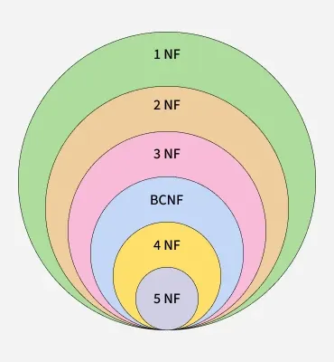

# Normal Forms trong DBMS

**Cập nhật lần cuối:** 24/04/2026

**Nhóm bài học:** Data-Modeling

**Nguồn tham khảo:**

- [GeeksforGeeks - Normal Forms in DBMS](https://www.geeksforgeeks.org/dbms/normal-forms-in-dbms/)

---

## 1. Mục tiêu bài giảng

Sau khi hoàn thành bài học này, người học có thể:

1. Trình bày được khái niệm **normal forms** trong DBMS.
2. Giải thích được vai trò của chuẩn hóa trong thiết kế cơ sở dữ liệu quan hệ.
3. Phân biệt được các dạng chuẩn: **1NF, 2NF, 3NF, BCNF, 4NF và 5NF**.
4. Nhận biết được các lỗi thiết kế như dữ liệu lặp, phụ thuộc bộ phận, phụ thuộc bắc cầu, phụ thuộc đa trị và phụ thuộc nối.
5. Phân tích được một bảng dữ liệu có vi phạm dạng chuẩn hay không.
6. Đề xuất được cách tách bảng để giảm dư thừa dữ liệu và hạn chế bất thường dữ liệu.
7. Phân biệt được khi nào nên dùng **normalization** và khi nào có thể dùng **denormalization**.

---

## 2. Giới thiệu tổng quan

**Normal Forms** là tập hợp các quy tắc hoặc mức kiểm tra thiết kế dùng cho lược đồ quan hệ. Mục tiêu chính của các dạng chuẩn là giảm dư thừa dữ liệu và hạn chế các bất thường khi thêm, sửa hoặc xóa dữ liệu.

Các dạng chuẩn thường gặp gồm:

1. **First Normal Form (1NF)**
2. **Second Normal Form (2NF)**
3. **Third Normal Form (3NF)**
4. **Boyce-Codd Normal Form (BCNF)**
5. **Fourth Normal Form (4NF)**
6. **Fifth Normal Form (5NF)**

Mỗi dạng chuẩn sau thường chặt chẽ hơn dạng chuẩn trước. Nếu một bảng đạt một dạng chuẩn cao hơn, thì nó cũng phải thỏa mãn các dạng chuẩn thấp hơn.

```text
5NF ⊂ 4NF ⊂ BCNF ⊂ 3NF ⊂ 2NF ⊂ 1NF
```

Có thể hình dung các dạng chuẩn như các lớp làm sạch dữ liệu. Càng đi sâu vào các dạng chuẩn cao hơn, bảng càng ít dư thừa và ít lỗi thiết kế hơn.



---

## 3. Lợi ích của Normal Forms

Việc sử dụng các dạng chuẩn đem lại nhiều lợi ích trong thiết kế cơ sở dữ liệu.

### 3.1. Giảm dữ liệu trùng lặp

Chuẩn hóa giúp tránh lưu cùng một thông tin ở nhiều nơi.

Ví dụ, thay vì lưu tên khoa trong nhiều dòng sinh viên, ta có thể tách thông tin khoa sang bảng riêng.

### 3.2. Giảm lãng phí bộ nhớ

Khi dữ liệu lặp ít hơn, dung lượng lưu trữ cũng được sử dụng hiệu quả hơn.

### 3.3. Hạn chế bất thường dữ liệu

Các bất thường thường gặp gồm:

1. **Insert anomaly**: khó thêm dữ liệu mới nếu thiếu một số thông tin liên quan.
2. **Update anomaly**: khi sửa một thông tin, phải sửa nhiều dòng.
3. **Delete anomaly**: khi xóa một dòng, có thể vô tình mất thêm thông tin quan trọng khác.

### 3.4. Tăng tính nhất quán và toàn vẹn dữ liệu

Mỗi thông tin chỉ nên được lưu ở một nơi thích hợp. Điều này giúp giảm nguy cơ xuất hiện các giá trị mâu thuẫn.

### 3.5. Dễ bảo trì và mở rộng

Một cơ sở dữ liệu được chuẩn hóa tốt thường dễ sửa đổi, mở rộng và quản lý hơn.

---

### Quiz nhanh: Tổng quan

**Câu 1.** Mục tiêu chính của các dạng chuẩn là gì?

A. Làm tăng dữ liệu trùng lặp  
B. Giảm dư thừa dữ liệu và hạn chế bất thường dữ liệu  
C. Xóa toàn bộ khóa chính  
D. Gộp tất cả bảng thành một bảng duy nhất  

**Câu 2.** Dạng chuẩn nào là dạng cơ bản nhất?

A. 1NF  
B. 3NF  
C. BCNF  
D. 5NF  

**Câu 3.** Nếu một bảng đạt 3NF, bảng đó cũng phải đạt dạng chuẩn nào trước đó?

A. Chỉ 5NF  
B. 1NF và 2NF  
C. Chỉ BCNF  
D. Không cần dạng chuẩn nào khác  

---


## 4. Phân cấp các dạng chuẩn

Các dạng chuẩn có quan hệ phân cấp. Dạng chuẩn sau xây dựng dựa trên dạng chuẩn trước.

| Dạng chuẩn | Điều kiện chính | Mục tiêu |
|---|---|---|
| 1NF | Giá trị nguyên tử, không có nhóm lặp | Tạo cấu trúc bảng cơ bản |
| 2NF | Đạt 1NF và không có phụ thuộc bộ phận | Loại bỏ phụ thuộc vào một phần khóa ghép |
| 3NF | Đạt 2NF và không có phụ thuộc bắc cầu | Loại bỏ phụ thuộc giữa các thuộc tính không khóa |
| BCNF | Với mọi `X → Y`, `X` phải là super key | Dạng mạnh hơn của 3NF |
| 4NF | Đạt BCNF và không có phụ thuộc đa trị không hợp lý | Loại bỏ dữ liệu đa trị độc lập |
| 5NF | Đạt 4NF và loại bỏ phụ thuộc nối | Tách bảng đến mức không mất thông tin |

---

## 5. First Normal Form (1NF)

### 5.1. Khái niệm

Một bảng đạt **First Normal Form (1NF)** nếu thỏa mãn các điều kiện sau:

1. Mỗi ô dữ liệu chứa giá trị nguyên tử.
2. Không có nhóm lặp trong một cột.
3. Mỗi dòng là duy nhất.
4. Mỗi cột có tên duy nhất.
5. Thứ tự lưu trữ dòng hoặc cột không ảnh hưởng đến ý nghĩa dữ liệu.

**Giá trị nguyên tử** nghĩa là giá trị không thể hoặc không nên chia nhỏ hơn trong ngữ cảnh quản lý dữ liệu.

### 5.2. Ví dụ vi phạm 1NF

Bảng `Students`:

| StudentID | StudentName | PhoneNumbers |
|---|---|---|
| 101 | An | 0901, 0902 |
| 102 | Bình | 0911 |
| 103 | Chi | 0921, 0922 |

Bảng này vi phạm 1NF vì cột `PhoneNumbers` chứa nhiều số điện thoại trong cùng một ô.

### 5.3. Chuyển về 1NF

Ta tách mỗi số điện thoại thành một dòng riêng.

| StudentID | StudentName | PhoneNumber |
|---|---|---|
| 101 | An | 0901 |
| 101 | An | 0902 |
| 102 | Bình | 0911 |
| 103 | Chi | 0921 |
| 103 | Chi | 0922 |

Bảng sau khi tách đã gần với 1NF hơn vì mỗi ô chỉ chứa một giá trị.

### 5.4. Lưu ý

1NF không yêu cầu loại bỏ toàn bộ dữ liệu lặp. Nó chỉ yêu cầu cấu trúc bảng cơ bản phải hợp lệ, đặc biệt là các giá trị trong ô phải nguyên tử.

---

### Quiz nhanh: 1NF

**Câu 1.** Điều kiện quan trọng nhất của 1NF là gì?

A. Mọi ô dữ liệu chứa giá trị nguyên tử  
B. Mọi bảng đều phải có đúng 3 cột  
C. Không được có khóa chính  
D. Mọi bảng đều phải có phụ thuộc bắc cầu  

**Câu 2.** Cột nào sau đây có thể vi phạm 1NF?

A. StudentID  
B. StudentName  
C. PhoneNumbers chứa nhiều số trong một ô  
D. Age chứa một số nguyên  

**Câu 3.** Để xử lý cột chứa nhiều số điện thoại trong một ô, ta nên làm gì?

A. Giữ nguyên vì tiện đọc  
B. Tách thành các dòng hoặc bảng riêng  
C. Xóa toàn bộ cột  
D. Đổi tên cột thành Phone  

---


## 6. Second Normal Form (2NF)

### 6.1. Khái niệm

Một quan hệ đạt **Second Normal Form (2NF)** nếu:

1. Quan hệ đã đạt 1NF.
2. Không tồn tại **partial dependency**.

**Partial dependency** xảy ra khi một thuộc tính không khóa phụ thuộc vào một phần của khóa ghép thay vì phụ thuộc vào toàn bộ khóa ghép.

### 6.2. Khi nào cần quan tâm đến 2NF?

2NF đặc biệt quan trọng khi bảng có **khóa ghép**.

Nếu khóa chính chỉ có một thuộc tính, bảng đạt 1NF thường không có phụ thuộc bộ phận theo nghĩa khóa ghép.

### 6.3. Ví dụ vi phạm 2NF

Xét bảng `Enrollments`:

| StudentID | CourseID | StudentName | CourseName | Grade |
|---|---|---|---|---|
| 101 | C01 | An | Database | A |
| 101 | C02 | An | Programming | B |
| 102 | C01 | Bình | Database | A |

Giả sử khóa ghép là:

```text
(StudentID, CourseID)
```

Các phụ thuộc hàm:

```text
StudentID, CourseID → Grade
StudentID → StudentName
CourseID → CourseName
```

Trong đó:

- `Grade` phụ thuộc vào toàn bộ khóa ghép.
- `StudentName` chỉ phụ thuộc vào `StudentID`.
- `CourseName` chỉ phụ thuộc vào `CourseID`.

Vì `StudentName` và `CourseName` phụ thuộc vào một phần của khóa ghép, bảng vi phạm 2NF.

### 6.4. Chuyển về 2NF

Tách bảng thành ba bảng:

**Students**

| StudentID | StudentName |
|---|---|
| 101 | An |
| 102 | Bình |

**Courses**

| CourseID | CourseName |
|---|---|
| C01 | Database |
| C02 | Programming |

**Enrollments**

| StudentID | CourseID | Grade |
|---|---|---|
| 101 | C01 | A |
| 101 | C02 | B |
| 102 | C01 | A |

Sau khi tách:

- `StudentName` chỉ lưu trong bảng `Students`.
- `CourseName` chỉ lưu trong bảng `Courses`.
- `Grade` nằm trong bảng `Enrollments` vì phụ thuộc vào cả `StudentID` và `CourseID`.

### 6.5. Ý nghĩa của 2NF

2NF giúp:

- Giảm lặp thông tin sinh viên.
- Giảm lặp thông tin môn học.
- Tránh lỗi khi cập nhật tên sinh viên hoặc tên môn học.
- Làm rõ quan hệ giữa sinh viên, môn học và điểm.

---

### Quiz nhanh: 2NF

**Câu 1.** 2NF yêu cầu bảng phải đạt dạng chuẩn nào trước?

A. 1NF  
B. 3NF  
C. BCNF  
D. 5NF  

**Câu 2.** Phụ thuộc bộ phận thường xuất hiện khi bảng có gì?

A. Khóa ghép  
B. Một cột duy nhất  
C. Không có khóa  
D. Chỉ có dữ liệu số  

**Câu 3.** Trong bảng có khóa ghép `(StudentID, CourseID)`, phụ thuộc nào là phụ thuộc bộ phận?

A. `(StudentID, CourseID) → Grade`  
B. `StudentID → StudentName`  
C. `(StudentID, CourseID) → StudentID`  
D. `Grade → CourseID`  

---


## 7. Third Normal Form (3NF)

### 7.1. Khái niệm

Một quan hệ đạt **Third Normal Form (3NF)** nếu:

1. Quan hệ đã đạt 2NF.
2. Không tồn tại phụ thuộc bắc cầu giữa các thuộc tính không khóa.

Nói đơn giản, thuộc tính không khóa không nên phụ thuộc vào một thuộc tính không khóa khác.

### 7.2. Phụ thuộc bắc cầu là gì?

Nếu có:

```text
A → B
B → C
```

thì ta có thể suy ra:

```text
A → C
```

Khi đó, `C` phụ thuộc bắc cầu vào `A` thông qua `B`.

### 7.3. Ví dụ vi phạm 3NF

Xét bảng `Students`:

| StudentID | StudentName | DeptID | DeptName |
|---|---|---|---|
| 101 | An | D01 | Computer Science |
| 102 | Bình | D02 | Information Systems |
| 103 | Chi | D01 | Computer Science |

Phụ thuộc hàm:

```text
StudentID → StudentName, DeptID
DeptID → DeptName
```

Suy ra:

```text
StudentID → DeptName
```

`DeptName` phụ thuộc gián tiếp vào `StudentID` thông qua `DeptID`.

Bảng này vi phạm 3NF vì `DeptName` là thuộc tính không khóa nhưng phụ thuộc vào `DeptID`, một thuộc tính không khóa khác.

### 7.4. Chuyển về 3NF

Tách thành hai bảng:

**Students**

| StudentID | StudentName | DeptID |
|---|---|---|
| 101 | An | D01 |
| 102 | Bình | D02 |
| 103 | Chi | D01 |

**Departments**

| DeptID | DeptName |
|---|---|
| D01 | Computer Science |
| D02 | Information Systems |

### 7.5. Ý nghĩa của 3NF

3NF giúp:

- Loại bỏ phụ thuộc bắc cầu.
- Giảm lặp thông tin mô tả.
- Hạn chế lỗi cập nhật dữ liệu.
- Làm rõ quan hệ giữa thực thể chính và thực thể phụ.

---

### Quiz nhanh: 3NF

**Câu 1.** 3NF yêu cầu bảng phải đạt dạng chuẩn nào trước?

A. 1NF  
B. 2NF  
C. 4NF  
D. 5NF  

**Câu 2.** Phụ thuộc bắc cầu có dạng nào?

A. `A → B` và `B → C`, suy ra `A → C`  
B. `A → A`  
C. `A, B → A`  
D. `A → B` nhưng `B` không liên quan đến `C`  

**Câu 3.** Trong `StudentID → DeptID` và `DeptID → DeptName`, phụ thuộc bắc cầu là gì?

A. `DeptName → StudentID`  
B. `StudentID → DeptName`  
C. `DeptID → StudentID`  
D. `DeptName → DeptID`  

---


## 8. Boyce-Codd Normal Form (BCNF)

### 8.1. Khái niệm

**Boyce-Codd Normal Form (BCNF)** là dạng chuẩn mạnh hơn 3NF.

Một quan hệ đạt BCNF nếu với mọi phụ thuộc hàm không tầm thường:

```text
X → Y
```

thì `X` phải là **super key**.

Nói cách khác, mọi determinant trong các phụ thuộc hàm quan trọng đều phải là super key.

### 8.2. Vì sao cần BCNF?

Có một số trường hợp bảng đã đạt 3NF nhưng vẫn còn dư thừa dữ liệu do determinant không phải là super key.

BCNF xử lý các trường hợp này bằng cách yêu cầu chặt hơn:

```text
Vế trái của mọi phụ thuộc hàm không tầm thường phải là super key.
```

### 8.3. Ví dụ vi phạm BCNF

Xét bảng `Teaching`:

| StudentID | CourseID | Instructor |
|---|---|---|
| 101 | C01 | Dr. Smith |
| 102 | C01 | Dr. Smith |
| 103 | C02 | Dr. Brown |

Giả sử có phụ thuộc:

```text
CourseID → Instructor
```

Nếu `CourseID` không phải là super key của bảng `Teaching`, thì phụ thuộc này vi phạm BCNF.

Lý do:

- Một khóa của bảng có thể là `(StudentID, CourseID)`.
- Nhưng `CourseID` một mình không xác định toàn bộ dòng.
- Tuy nhiên, `CourseID` lại xác định `Instructor`.

### 8.4. Chuyển về BCNF

Tách thành hai bảng:

**CourseInstructors**

| CourseID | Instructor |
|---|---|
| C01 | Dr. Smith |
| C02 | Dr. Brown |

**Enrollments**

| StudentID | CourseID |
|---|---|
| 101 | C01 |
| 102 | C01 |
| 103 | C02 |

Sau khi tách:

- Thông tin giảng viên của từng môn học chỉ lưu một lần.
- Quan hệ sinh viên đăng ký môn học được lưu riêng.
- Determinant `CourseID` trở thành khóa trong bảng `CourseInstructors`.

### 8.5. So sánh 3NF và BCNF

| Tiêu chí | 3NF | BCNF |
|---|---|---|
| Mức độ chặt chẽ | Ít chặt hơn | Chặt hơn |
| Điều kiện chính | Với `X → A`, `X` là super key hoặc `A` là prime attribute | Với mọi `X → Y`, `X` phải là super key |
| Mục tiêu | Loại bỏ phụ thuộc bắc cầu | Đảm bảo mọi determinant là super key |
| Quan hệ | Có thể đạt 3NF nhưng chưa đạt BCNF | Nếu đạt BCNF thì thường đạt 3NF |

---

### Quiz nhanh: BCNF

**Câu 1.** Điều kiện chính của BCNF là gì?

A. Mọi bảng phải có đúng một khóa chính  
B. Với mọi phụ thuộc không tầm thường `X → Y`, `X` phải là super key  
C. Mọi thuộc tính đều phải là số  
D. Không được dùng khóa ngoại  

**Câu 2.** BCNF là dạng chuẩn mạnh hơn dạng nào?

A. 1NF  
B. 2NF  
C. 3NF  
D. 5NF  

**Câu 3.** Nếu `CourseID → Instructor` nhưng `CourseID` không phải super key, bảng có thể vi phạm dạng chuẩn nào?

A. 1NF  
B. BCNF  
C. 5NF  
D. Không vi phạm gì  

---


## 9. Fourth Normal Form (4NF)

### 9.1. Khái niệm

Một bảng đạt **Fourth Normal Form (4NF)** nếu:

1. Bảng đạt BCNF.
2. Bảng không có phụ thuộc đa trị không hợp lý.

**Multivalued dependency** xảy ra khi một thuộc tính xác định nhiều giá trị của một thuộc tính khác, và các giá trị này độc lập với các thuộc tính còn lại trong bảng.

Ký hiệu:

```text
X →→ Y
```

Đọc là: `X` xác định đa trị `Y`.

### 9.2. Ví dụ vi phạm 4NF

Xét bảng `StudentActivities`:

| StudentID | Language | Hobby |
|---|---|---|
| 101 | English | Football |
| 101 | English | Music |
| 101 | French | Football |
| 101 | French | Music |

Giả sử sinh viên `101` biết hai ngôn ngữ và có hai sở thích:

- Languages: English, French
- Hobbies: Football, Music

Ngôn ngữ và sở thích là hai nhóm thông tin độc lập.

Ta có:

```text
StudentID →→ Language
StudentID →→ Hobby
```

Bảng vi phạm 4NF vì phải lưu mọi tổ hợp giữa `Language` và `Hobby`.

### 9.3. Chuyển về 4NF

Tách thành hai bảng:

**StudentLanguages**

| StudentID | Language |
|---|---|
| 101 | English |
| 101 | French |

**StudentHobbies**

| StudentID | Hobby |
|---|---|
| 101 | Football |
| 101 | Music |

Sau khi tách:

- Không cần lưu mọi tổ hợp giữa ngôn ngữ và sở thích.
- Dữ liệu gọn hơn.
- Thêm một sở thích mới không cần nhân với toàn bộ ngôn ngữ hiện có.

### 9.4. Ý nghĩa của 4NF

4NF giúp loại bỏ dư thừa do các tập giá trị độc lập. Dạng chuẩn này thường xuất hiện trong các tình huống một thực thể có nhiều nhóm thuộc tính đa trị độc lập.

---

### Quiz nhanh: 4NF

**Câu 1.** 4NF xử lý loại phụ thuộc nào?

A. Phụ thuộc bộ phận  
B. Phụ thuộc bắc cầu  
C. Phụ thuộc đa trị  
D. Phụ thuộc tầm thường  

**Câu 2.** Ký hiệu của phụ thuộc đa trị là gì?

A. `X → Y`  
B. `X →→ Y`  
C. `X = Y`  
D. `X ⊆ Y`  

**Câu 3.** Trong bảng `(StudentID, Language, Hobby)`, nếu Language và Hobby độc lập, nên xử lý thế nào?

A. Gộp thêm nhiều cột vào bảng  
B. Tách thành bảng ngôn ngữ và bảng sở thích riêng  
C. Xóa StudentID  
D. Đổi Language thành khóa chính duy nhất  

---


## 10. Fifth Normal Form (5NF)

### 10.1. Khái niệm

Một bảng đạt **Fifth Normal Form (5NF)** nếu:

1. Bảng đạt 4NF.
2. Mọi phụ thuộc nối không cần thiết đã được loại bỏ.
3. Bảng chỉ được tách thành các bảng nhỏ hơn khi phép nối lại không gây mất thông tin.

5NF còn liên quan đến khái niệm **join dependency**.

### 10.2. Join Dependency là gì?

**Join dependency** xảy ra khi một bảng có thể được tái tạo chính xác bằng cách nối nhiều bảng nhỏ hơn.

Nếu một quan hệ có thể được tách thành nhiều quan hệ con và khi nối lại cho đúng quan hệ ban đầu mà không sinh thêm dữ liệu sai, thì ta có một phân rã không mất thông tin.

5NF quan tâm đến các trường hợp phức tạp hơn, khi một quan hệ cần được tách thành nhiều hơn hai bảng để loại bỏ dư thừa.

### 10.3. Ví dụ trực quan

Xét bảng:

| StudentID | Course | Instructor |
|---|---|---|
| 101 | Database | Dr. An |
| 101 | Programming | Dr. Bình |
| 102 | Database | Dr. An |

Trong một số ngữ cảnh, quan hệ giữa sinh viên, môn học và giảng viên có thể được tách thành các quan hệ nhỏ hơn:

- Student - Course
- Course - Instructor
- Student - Instructor

Tuy nhiên, việc tách bảng phải được thực hiện cẩn thận. Nếu nối lại tạo ra các tổ hợp không tồn tại ban đầu, phân rã đó không đúng.

### 10.4. Ý nghĩa của 5NF

5NF thường dùng trong các thiết kế dữ liệu phức tạp, nơi quan hệ nhiều chiều có thể gây dư thừa. Trong thực tế giảng dạy cơ sở dữ liệu cơ bản, 5NF ít gặp hơn 1NF, 2NF, 3NF và BCNF.

---

### Quiz nhanh: 5NF

**Câu 1.** 5NF chủ yếu liên quan đến loại phụ thuộc nào?

A. Phụ thuộc bộ phận  
B. Phụ thuộc nối  
C. Phụ thuộc bắc cầu  
D. Phụ thuộc tầm thường  

**Câu 2.** Một phân rã tốt cần đảm bảo điều gì?

A. Nối lại không mất thông tin  
B. Luôn tạo thêm dữ liệu mới  
C. Xóa toàn bộ khóa chính  
D. Không cần khóa ngoại  

**Câu 3.** 5NF thường xuất hiện trong trường hợp nào?

A. Bảng chỉ có một thuộc tính  
B. Quan hệ nhiều chiều phức tạp  
C. Bảng không có dữ liệu  
D. Bảng chỉ chứa số điện thoại  

---


## 11. Bất thường dữ liệu do chưa chuẩn hóa

### 11.1. Insert Anomaly

**Insert anomaly** xảy ra khi không thể thêm một thông tin mới nếu thiếu thông tin khác.

Ví dụ, nếu bảng chỉ lưu thông tin môn học khi có sinh viên đăng ký, ta không thể thêm một môn học mới nếu chưa có sinh viên nào đăng ký môn đó.

### 11.2. Update Anomaly

**Update anomaly** xảy ra khi một thông tin bị lặp ở nhiều dòng và khi cập nhật phải sửa nhiều nơi.

Ví dụ, tên môn `Database` xuất hiện ở nhiều dòng. Nếu đổi thành `Database Systems`, cần sửa toàn bộ các dòng liên quan.

### 11.3. Delete Anomaly

**Delete anomaly** xảy ra khi xóa một dòng làm mất luôn thông tin khác.

Ví dụ, nếu xóa sinh viên cuối cùng đăng ký môn `C01`, ta có thể mất luôn thông tin rằng `C01` là môn `Database`.

---

### Quiz nhanh: Bất thường dữ liệu

**Câu 1.** Update anomaly xảy ra khi nào?

A. Khi phải sửa cùng một thông tin ở nhiều dòng  
B. Khi bảng không có dữ liệu  
C. Khi một ô có giá trị nguyên tử  
D. Khi khóa chính là số  

**Câu 2.** Delete anomaly là gì?

A. Xóa một dòng làm mất thông tin khác ngoài ý muốn  
B. Không thể thêm dữ liệu mới  
C. Dữ liệu được lưu đúng một nơi  
D. Bảng đạt BCNF  

**Câu 3.** Insert anomaly là gì?

A. Không thể thêm một thông tin mới nếu thiếu thông tin khác  
B. Không thể xóa bảng  
C. Không thể đọc dữ liệu  
D. Không thể tạo khóa ngoại  

---

## 12. Over-normalization

### 12.1. Khái niệm

**Over-normalization** xảy ra khi cơ sở dữ liệu bị chuẩn hóa quá mức, dẫn đến việc dữ liệu bị tách thành quá nhiều bảng nhỏ.

Chuẩn hóa giúp giảm dư thừa, nhưng nếu tách quá nhiều, hệ thống có thể gặp khó khăn khi truy vấn.

### 12.2. Vấn đề của over-normalization

Over-normalization có thể gây ra:

1. **Câu truy vấn phức tạp**  
   Khi dữ liệu nằm ở quá nhiều bảng, truy vấn cần nhiều phép `JOIN`.

2. **Chi phí hiệu năng**  
   Nhiều phép nối có thể làm truy vấn chậm hơn, đặc biệt với dữ liệu lớn.

3. **Khó bảo trì truy vấn**  
   Lập trình viên phải viết và hiểu các câu SQL phức tạp hơn.

4. **Không phù hợp với hệ thống đọc nhiều**  
   Một số hệ thống báo cáo cần tốc độ đọc nhanh hơn mức độ chuẩn hóa cao.

---


## 13. Normalization và Denormalization

### 13.1. Normalization là gì?

**Normalization** là quá trình tổ chức lại dữ liệu thành các bảng hợp lý nhằm giảm dư thừa và hạn chế bất thường dữ liệu.

Normalization phù hợp với:

- Hệ thống giao dịch.
- Hệ thống ngân hàng.
- Hệ thống quản lý doanh nghiệp.
- Ứng dụng cần tính nhất quán dữ liệu cao.
- Hệ thống có nhiều thao tác thêm, sửa, xóa.

### 13.2. Denormalization là gì?

**Denormalization** là quá trình cố ý gộp hoặc lặp lại một phần dữ liệu để tăng tốc truy vấn.

Denormalization phù hợp với:

- Hệ thống đọc nhiều.
- Kho dữ liệu.
- Hệ thống báo cáo.
- Dashboard phân tích.
- Ứng dụng cần tốc độ truy vấn nhanh.

### 13.3. So sánh Normalization và Denormalization

| Tiêu chí | Normalization | Denormalization |
|---|---|---|
| Mục tiêu | Giảm dư thừa, tăng nhất quán | Tăng tốc truy vấn |
| Dữ liệu lặp | Ít | Có thể nhiều hơn |
| Phù hợp với | Hệ thống giao dịch | Hệ thống báo cáo, đọc nhiều |
| Truy vấn | Có thể cần nhiều JOIN | Ít JOIN hơn |
| Rủi ro | Truy vấn phức tạp nếu tách quá nhiều | Dữ liệu có thể không nhất quán nếu quản lý kém |
| Ví dụ | Banking, ERP | Data warehouse, dashboard |

---

### Quiz nhanh: Normalization và Denormalization

**Câu 1.** Normalization phù hợp nhất với hệ thống nào?

A. Hệ thống giao dịch cần tính nhất quán cao  
B. Hệ thống chỉ hiển thị hình ảnh  
C. Hệ thống không dùng dữ liệu  
D. Hệ thống không có bảng  

**Câu 2.** Denormalization thường dùng để làm gì?

A. Tăng tốc truy vấn đọc  
B. Xóa toàn bộ dữ liệu  
C. Loại bỏ mọi khóa chính  
D. Bắt buộc đạt 5NF  

**Câu 3.** Một nhược điểm của over-normalization là gì?

A. Có thể làm truy vấn phức tạp do nhiều JOIN  
B. Dữ liệu luôn sai  
C. Không thể tạo bảng  
D. Không thể dùng SQL  

---

## 14. Ứng dụng của Normal Forms

### 14.1. Đảm bảo tính nhất quán dữ liệu

Các dạng chuẩn giúp mỗi thông tin được lưu ở vị trí hợp lý, từ đó hạn chế dữ liệu mâu thuẫn.

### 14.2. Giảm dư thừa dữ liệu

Chuẩn hóa giúp giảm việc lưu lặp lại cùng một thông tin trong nhiều dòng hoặc nhiều bảng.

### 14.3. Cải thiện thiết kế dữ liệu

Cơ sở dữ liệu sau chuẩn hóa thường có cấu trúc rõ ràng hơn, thể hiện đúng quan hệ giữa các thực thể.

### 14.4. Hỗ trợ bảo trì cơ sở dữ liệu

Khi cần sửa một thông tin, ta thường chỉ cần sửa ở một nơi, giảm rủi ro lỗi cập nhật.

### 14.5. Tối ưu lưu trữ

Do giảm dữ liệu trùng lặp, cơ sở dữ liệu có thể sử dụng không gian lưu trữ hiệu quả hơn.

---


## 15. Bảng tổng hợp các dạng chuẩn

| Dạng chuẩn | Điều kiện cần đạt | Loại vấn đề xử lý | Ví dụ vi phạm |
|---|---|---|---|
| 1NF | Giá trị nguyên tử, không nhóm lặp | Dữ liệu nhiều giá trị trong một ô | `PhoneNumbers = 0901, 0902` |
| 2NF | 1NF và không phụ thuộc bộ phận | Thuộc tính phụ thuộc vào một phần khóa ghép | `StudentID → StudentName` trong khóa `(StudentID, CourseID)` |
| 3NF | 2NF và không phụ thuộc bắc cầu | Thuộc tính không khóa phụ thuộc thuộc tính không khóa | `DeptID → DeptName` trong bảng sinh viên |
| BCNF | Mọi determinant là super key | Determinant không phải khóa | `CourseID → Instructor` khi `CourseID` không là super key |
| 4NF | BCNF và không phụ thuộc đa trị | Nhiều tập giá trị độc lập | `StudentID →→ Language`, `StudentID →→ Hobby` |
| 5NF | 4NF và không phụ thuộc nối không cần thiết | Quan hệ nhiều chiều phức tạp | Quan hệ `Student-Course-Instructor` tách chưa đúng |

---

## 16. Quy trình chuẩn hóa cơ bản

Khi chuẩn hóa một bảng, có thể làm theo các bước sau:

1. **Kiểm tra 1NF**  
   Đảm bảo mọi ô chứa giá trị nguyên tử, không có nhóm lặp.

2. **Xác định khóa**  
   Tìm khóa chính, khóa ghép hoặc candidate key.

3. **Kiểm tra 2NF**  
   Nếu có khóa ghép, kiểm tra có thuộc tính không khóa phụ thuộc vào một phần khóa hay không.

4. **Kiểm tra 3NF**  
   Kiểm tra có phụ thuộc bắc cầu giữa các thuộc tính không khóa hay không.

5. **Kiểm tra BCNF**  
   Với mỗi phụ thuộc hàm không tầm thường, xác định vế trái có phải super key không.

6. **Kiểm tra 4NF**  
   Xác định có phụ thuộc đa trị giữa các tập giá trị độc lập hay không.

7. **Kiểm tra 5NF**  
   Xem bảng có phụ thuộc nối phức tạp cần phân rã thêm hay không.

8. **Đánh giá hiệu năng**  
   Không nên chuẩn hóa máy móc. Cần cân nhắc nhu cầu truy vấn, báo cáo và hiệu năng thực tế.

---

### Quiz nhanh: Ứng dụng và quy trình chuẩn hóa

**Câu 1.** Bước nào thường cần làm trước khi kiểm tra 2NF?

A. Xác định khóa của bảng  
B. Xóa toàn bộ khóa ngoại  
C. Gộp mọi bảng thành một bảng lớn  
D. Bỏ qua 1NF  

**Câu 2.** Khi chuẩn hóa, vì sao không nên áp dụng máy móc đến dạng chuẩn cao nhất trong mọi trường hợp?

A. Vì cần cân nhắc nhu cầu truy vấn và hiệu năng thực tế  
B. Vì dạng chuẩn cao luôn làm mất dữ liệu  
C. Vì không thể dùng SQL với bảng chuẩn hóa  
D. Vì bảng đạt 1NF không thể đạt 2NF  

**Câu 3.** Ứng dụng quan trọng của normal forms là gì?

A. Làm tăng dữ liệu lặp  
B. Hỗ trợ thiết kế dữ liệu nhất quán và dễ bảo trì  
C. Xóa mọi quan hệ giữa các bảng  
D. Thay thế hoàn toàn khóa chính  

---


## 17. Câu hỏi ôn tập

### 17.1. Câu hỏi trắc nghiệm

**Câu 1.** Normal forms được dùng chủ yếu để làm gì?

A. Giảm dư thừa và hạn chế bất thường dữ liệu  
B. Tăng số dòng trùng lặp  
C. Xóa toàn bộ ràng buộc  
D. Thay thế SQL  

---

**Câu 2.** Dạng chuẩn nào yêu cầu giá trị trong mỗi ô phải nguyên tử?

A. 1NF  
B. 2NF  
C. BCNF  
D. 5NF  

---

**Câu 3.** 2NF loại bỏ vấn đề nào?

A. Phụ thuộc bộ phận  
B. Phụ thuộc đa trị  
C. Phụ thuộc nối  
D. Giá trị không nguyên tử  

---

**Câu 4.** 3NF loại bỏ vấn đề nào?

A. Phụ thuộc bắc cầu  
B. Phụ thuộc đa trị  
C. Phụ thuộc nối  
D. Tên cột trùng nhau  

---

**Câu 5.** Điều kiện chính của BCNF là gì?

A. Mọi determinant trong phụ thuộc hàm không tầm thường phải là super key  
B. Mọi bảng phải có đúng hai cột  
C. Mọi thuộc tính đều phải là khóa ngoại  
D. Mọi ô được phép chứa danh sách giá trị  

---

**Câu 6.** 4NF xử lý vấn đề nào?

A. Phụ thuộc bộ phận  
B. Phụ thuộc đa trị  
C. Phụ thuộc bắc cầu  
D. Cột không có tên  

---

**Câu 7.** 5NF liên quan đến vấn đề nào?

A. Join dependency  
B. Atomic value  
C. Partial dependency  
D. Transitive dependency  

---

**Câu 8.** Phụ thuộc bộ phận thường xuất hiện khi có:

A. Khóa ghép  
B. Một khóa đơn duy nhất  
C. Không có thuộc tính  
D. Không có dữ liệu  

---

**Câu 9.** Denormalization thường phù hợp với hệ thống nào?

A. Hệ thống đọc nhiều, báo cáo, data warehouse  
B. Hệ thống cần xóa toàn bộ dữ liệu  
C. Hệ thống không có truy vấn  
D. Hệ thống chỉ có một bảng rỗng  

---

**Câu 10.** Over-normalization có thể gây ra vấn đề gì?

A. Truy vấn phức tạp và nhiều JOIN  
B. Không thể tạo khóa chính  
C. Dữ liệu luôn bị mất  
D. Không thể dùng bảng quan hệ  

---

### 17.2. Câu hỏi tự luận ngắn

**Câu 1.** Trình bày khái niệm normal forms trong DBMS.

---

**Câu 2.** Giải thích sự khác nhau giữa 1NF, 2NF và 3NF.

---

**Câu 3.** BCNF khác 3NF ở điểm nào?

---

**Câu 4.** Phụ thuộc đa trị là gì và liên quan đến dạng chuẩn nào?

---

**Câu 5.** Khi nào nên dùng denormalization?

---


## 18. Bài tập vận dụng

### Bài tập 1

Cho bảng:

| StudentID | StudentName | PhoneNumbers |
|---|---|---|
| 101 | An | 0901, 0902 |
| 102 | Bình | 0911 |

**Yêu cầu:**  
Bảng trên vi phạm dạng chuẩn nào? Hãy chuyển bảng về dạng chuẩn phù hợp.

---

### Bài tập 2

Cho bảng:

| StudentID | CourseID | StudentName | CourseName | Grade |
|---|---|---|---|---|
| 101 | C01 | An | Database | A |
| 101 | C02 | An | Programming | B |
| 102 | C01 | Bình | Database | A |

Biết khóa ghép là `(StudentID, CourseID)`.

**Yêu cầu:**  

1. Bảng có vi phạm 2NF không?
2. Chỉ ra các phụ thuộc bộ phận.
3. Đề xuất cách tách bảng.

---

### Bài tập 3

Cho bảng:

| StudentID | StudentName | DeptID | DeptName |
|---|---|---|---|
| 101 | An | D01 | Computer Science |
| 102 | Bình | D02 | Information Systems |
| 103 | Chi | D01 | Computer Science |

Biết:

```text
StudentID → StudentName, DeptID
DeptID → DeptName
```

**Yêu cầu:**  

1. Bảng có phụ thuộc bắc cầu không?
2. Bảng có thể vi phạm dạng chuẩn nào?
3. Hãy tách bảng để khắc phục.

---

### Bài tập 4

Cho bảng:

| StudentID | Language | Hobby |
|---|---|---|
| 101 | English | Football |
| 101 | English | Music |
| 101 | French | Football |
| 101 | French | Music |

**Yêu cầu:**  

1. Xác định phụ thuộc đa trị.
2. Bảng có thể vi phạm dạng chuẩn nào?
3. Đề xuất cách tách bảng.

---

### Bài tập 5

Cho phụ thuộc hàm:

```text
CourseID → Instructor
```

Trong bảng `Teaching(StudentID, CourseID, Instructor)`, khóa của bảng là:

```text
(StudentID, CourseID)
```

**Yêu cầu:**  

1. `CourseID` có phải super key của bảng không?
2. Bảng có thể vi phạm BCNF không?
3. Đề xuất cách tách bảng.

---


## 19. Tóm tắt bài học

- Normal forms là các mức chuẩn hóa dùng để thiết kế bảng quan hệ tốt hơn.
- 1NF yêu cầu dữ liệu nguyên tử, không có nhóm lặp.
- 2NF loại bỏ phụ thuộc bộ phận trên khóa ghép.
- 3NF loại bỏ phụ thuộc bắc cầu giữa các thuộc tính không khóa.
- BCNF yêu cầu mọi determinant trong phụ thuộc hàm không tầm thường phải là super key.
- 4NF loại bỏ phụ thuộc đa trị không hợp lý.
- 5NF xử lý phụ thuộc nối trong các quan hệ phức tạp.
- Chuẩn hóa giúp giảm dư thừa, tăng tính nhất quán và hạn chế insert, update, delete anomalies.
- Chuẩn hóa quá mức có thể làm truy vấn phức tạp và giảm hiệu năng do nhiều phép JOIN.
- Denormalization có thể được dùng trong hệ thống đọc nhiều, báo cáo hoặc kho dữ liệu để tăng tốc truy vấn.

---

## 20. Từ khóa chính

- Normal Forms
- Normalization
- Denormalization
- 1NF
- 2NF
- 3NF
- BCNF
- 4NF
- 5NF
- Atomic Value
- Partial Dependency
- Transitive Dependency
- Multivalued Dependency
- Join Dependency
- Super Key
- Candidate Key
- Prime Attribute
- Non-prime Attribute
- Insert Anomaly
- Update Anomaly
- Delete Anomaly

---

## 21. Đáp án và gợi ý trả lời

### Quiz nhanh: Tổng quan

- **Câu 1.** B
- **Câu 2.** A
- **Câu 3.** B

### Quiz nhanh: 1NF

- **Câu 1.** A
- **Câu 2.** C
- **Câu 3.** B

### Quiz nhanh: 2NF

- **Câu 1.** A
- **Câu 2.** A
- **Câu 3.** B

### Quiz nhanh: 3NF

- **Câu 1.** B
- **Câu 2.** A
- **Câu 3.** B

### Quiz nhanh: BCNF

- **Câu 1.** B
- **Câu 2.** C
- **Câu 3.** B

### Quiz nhanh: 4NF

- **Câu 1.** C
- **Câu 2.** B
- **Câu 3.** B

### Quiz nhanh: 5NF

- **Câu 1.** B
- **Câu 2.** A
- **Câu 3.** B

### Quiz nhanh: Bất thường dữ liệu

- **Câu 1.** A
- **Câu 2.** A
- **Câu 3.** A

### Quiz nhanh: Normalization và Denormalization

- **Câu 1.** A
- **Câu 2.** A
- **Câu 3.** A

### Quiz nhanh: Ứng dụng và quy trình chuẩn hóa

- **Câu 1.** A
- **Câu 2.** A
- **Câu 3.** B

---

### Câu hỏi ôn tập - Trắc nghiệm

- **Câu 1.** A
- **Câu 2.** A
- **Câu 3.** A
- **Câu 4.** A
- **Câu 5.** A
- **Câu 6.** B
- **Câu 7.** A
- **Câu 8.** A
- **Câu 9.** A
- **Câu 10.** A

---

### Câu hỏi ôn tập - Tự luận ngắn

#### Câu 1

**Gợi ý trả lời:**  
Normal forms là các mức quy tắc thiết kế lược đồ quan hệ nhằm giảm dư thừa dữ liệu, hạn chế bất thường khi thêm, sửa, xóa và cải thiện tính nhất quán dữ liệu.

#### Câu 2

**Gợi ý trả lời:**  
1NF yêu cầu mỗi ô chứa giá trị nguyên tử. 2NF yêu cầu đạt 1NF và không có phụ thuộc bộ phận trên khóa ghép. 3NF yêu cầu đạt 2NF và không có phụ thuộc bắc cầu giữa các thuộc tính không khóa.

#### Câu 3

**Gợi ý trả lời:**  
BCNF chặt hơn 3NF. Trong BCNF, với mọi phụ thuộc hàm không tầm thường `X → Y`, `X` phải là super key. Trong 3NF, có một số trường hợp được phép nếu vế phải là prime attribute.

#### Câu 4

**Gợi ý trả lời:**  
Phụ thuộc đa trị xảy ra khi một thuộc tính xác định nhiều giá trị độc lập của thuộc tính khác, ký hiệu `X →→ Y`. Nó liên quan đến 4NF.

#### Câu 5

**Gợi ý trả lời:**  
Denormalization nên dùng khi hệ thống đọc nhiều, cần truy vấn nhanh, ví dụ kho dữ liệu, báo cáo, dashboard. Tuy nhiên cần kiểm soát rủi ro dữ liệu dư thừa và không nhất quán.

---

### Bài tập vận dụng

#### Bài tập 1

**Gợi ý trả lời:**

Bảng vi phạm 1NF vì `PhoneNumbers` chứa nhiều giá trị trong một ô.

Có thể chuyển thành:

| StudentID | StudentName | PhoneNumber |
|---|---|---|
| 101 | An | 0901 |
| 101 | An | 0902 |
| 102 | Bình | 0911 |

---

#### Bài tập 2

**Gợi ý trả lời:**

Bảng vi phạm 2NF vì có phụ thuộc bộ phận:

```text
StudentID → StudentName
CourseID → CourseName
```

Trong khi khóa ghép là:

```text
(StudentID, CourseID)
```

Có thể tách thành:

**Students**

| StudentID | StudentName |
|---|---|
| 101 | An |
| 102 | Bình |

**Courses**

| CourseID | CourseName |
|---|---|
| C01 | Database |
| C02 | Programming |

**Enrollments**

| StudentID | CourseID | Grade |
|---|---|---|
| 101 | C01 | A |
| 101 | C02 | B |
| 102 | C01 | A |

---

#### Bài tập 3

**Gợi ý trả lời:**

Có phụ thuộc bắc cầu:

```text
StudentID → DeptID
DeptID → DeptName
```

suy ra:

```text
StudentID → DeptName
```

Bảng có thể vi phạm 3NF.

Tách thành:

**Students**

| StudentID | StudentName | DeptID |
|---|---|---|
| 101 | An | D01 |
| 102 | Bình | D02 |
| 103 | Chi | D01 |

**Departments**

| DeptID | DeptName |
|---|---|
| D01 | Computer Science |
| D02 | Information Systems |

---

#### Bài tập 4

**Gợi ý trả lời:**

Phụ thuộc đa trị:

```text
StudentID →→ Language
StudentID →→ Hobby
```

Bảng có thể vi phạm 4NF.

Tách thành:

**StudentLanguages**

| StudentID | Language |
|---|---|
| 101 | English |
| 101 | French |

**StudentHobbies**

| StudentID | Hobby |
|---|---|
| 101 | Football |
| 101 | Music |

---

#### Bài tập 5

**Gợi ý trả lời:**

`CourseID` không phải super key của bảng `Teaching` vì `CourseID` không xác định toàn bộ dòng, chẳng hạn không xác định duy nhất `StudentID`.

Phụ thuộc:

```text
CourseID → Instructor
```

có vế trái không phải super key, nên bảng có thể vi phạm BCNF.

Có thể tách thành:

**CourseInstructors**

| CourseID | Instructor |
|---|---|
| C01 | Dr. Smith |
| C02 | Dr. Brown |

**Enrollments**

| StudentID | CourseID |
|---|---|
| 101 | C01 |
| 102 | C01 |
| 103 | C02 |

---
