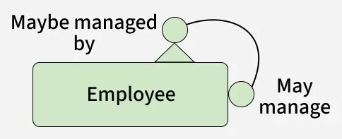
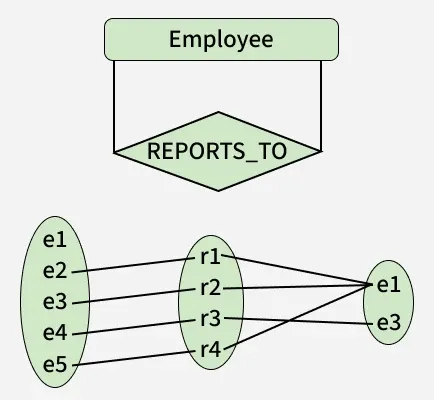

# Bài giảng: Quan hệ đệ quy trong sơ đồ ER

## 1. Tóm tắt bài học

Trong mô hình thực thể - quan hệ (ER Model), một quan hệ thông thường thường liên kết hai hoặc nhiều tập thực thể khác nhau. Tuy nhiên, trong nhiều bài toán thực tế, một thực thể có thể liên hệ với chính các thực thể cùng loại với nó. Trường hợp đó được gọi là **quan hệ đệ quy**.

Ví dụ:

- Một nhân viên có thể quản lý nhiều nhân viên khác.
- Một nhân viên có thể báo cáo cho một nhân viên cấp trên.
- Một người dùng mạng xã hội có thể kết bạn với người dùng khác.
- Một môn học có thể là điều kiện tiên quyết của một môn học khác.
- Một thư mục có thể chứa các thư mục con.

Quan hệ đệ quy giúp mô hình hóa các cấu trúc phân cấp, mạng lưới hoặc quan hệ tự tham chiếu trong cùng một tập thực thể.

---

## 2. Mục tiêu học tập

Sau khi hoàn thành bài học này, người học có thể:

1. Giải thích được khái niệm quan hệ đệ quy trong ER diagram.
2. Nhận biết được khi nào một thực thể tham gia quan hệ với chính nó.
3. Phân biệt được vai trò của cùng một tập thực thể trong quan hệ đệ quy.
4. Hiểu ý nghĩa của role name trong quan hệ đệ quy.
5. Xác định được bội số quan hệ như 1:1, 1:N hoặc M:N trong quan hệ đệ quy.
6. Biểu diễn được ví dụ nhân viên - người quản lý trong ER diagram.
7. Chuyển quan hệ đệ quy sang mô hình quan hệ bằng khóa ngoại tự tham chiếu.
8. Viết được bảng SQL đơn giản có foreign key tham chiếu chính nó.

---

## 3. Khái niệm quan hệ đệ quy

**Quan hệ đệ quy** là quan hệ trong đó cùng một tập thực thể tham gia vào một loại quan hệ nhiều hơn một lần, nhưng với các vai trò khác nhau.

Nói cách khác, một entity set tự liên kết với chính nó.

Ví dụ với entity `Employee`:

- Một `Employee` có thể là người quản lý.
- Một `Employee` khác có thể là nhân viên cấp dưới.
- Cả hai đều thuộc cùng entity set `Employee`.
- Quan hệ giữa hai vai trò này có thể gọi là `REPORTS_TO` hoặc `SUPERVISES`.



Trong ví dụ trên, `Employee` không liên hệ với một entity khác như `Department` hay `Project`, mà liên hệ với chính `Employee`.

---

## 4. Vì sao cần quan hệ đệ quy?

Quan hệ đệ quy xuất hiện khi dữ liệu có cấu trúc tự lặp lại hoặc phân cấp.

Một số tình huống phổ biến:

| Bài toán | Entity | Quan hệ đệ quy |
|---|---|---|
| Quản lý nhân sự | `Employee` | Nhân viên báo cáo cho nhân viên khác |
| Mạng xã hội | `User` | Người dùng kết bạn với người dùng khác |
| Hệ thống thư mục | `Folder` | Thư mục chứa thư mục con |
| Môn học | `Course` | Môn học là điều kiện tiên quyết của môn học khác |
| Cây phân loại sản phẩm | `Category` | Danh mục cha chứa danh mục con |

Nếu không dùng quan hệ đệ quy, mô hình có thể phải tách một thực thể thành nhiều thực thể giả tạo, ví dụ `Manager` và `Employee`. Cách này không linh hoạt vì manager cũng là employee.

---

## 5. Vai trò trong quan hệ đệ quy

Trong quan hệ đệ quy, cùng một entity set xuất hiện nhiều lần trong cùng một quan hệ. Vì vậy, cần đặt tên vai trò để tránh nhầm lẫn.

Ví dụ quan hệ `REPORTS_TO` của entity `Employee`:

- Vai trò thứ nhất: `Supervisor`
- Vai trò thứ hai: `Subordinate`

Hai vai trò này đều là `Employee`, nhưng ý nghĩa trong quan hệ là khác nhau.

| Vai trò | Ý nghĩa |
|---|---|
| `Supervisor` | Nhân viên đóng vai trò người quản lý |
| `Subordinate` | Nhân viên đóng vai trò cấp dưới |

Role name giúp người đọc ER diagram hiểu rõ mỗi lần xuất hiện của entity đang đại diện cho vai trò nào.

---

## 6. Bội số trong quan hệ đệ quy

Bội số quan hệ cho biết một thực thể có thể liên kết với bao nhiêu thực thể khác trong cùng entity set.

Trong ví dụ nhân viên - người quản lý:

- Một người quản lý có thể quản lý nhiều nhân viên.
- Một nhân viên cấp dưới thường chỉ có một người quản lý trực tiếp.
- CEO hoặc người đứng đầu có thể không có người quản lý.
- Nhân viên cấp thấp có thể không quản lý ai.

Quan hệ này thường là **1:N** từ `Supervisor` sang `Subordinate`.



Diễn giải:

| Vai trò | Cardinality tối thiểu | Cardinality tối đa | Ý nghĩa |
|---|---:|---:|---|
| `Supervisor` | 0 | N | Một nhân viên có thể không quản lý ai hoặc quản lý nhiều người |
| `Subordinate` | 0 | 1 | Một nhân viên có thể không có cấp trên hoặc có tối đa một cấp trên trực tiếp |

Trong ví dụ này, cả hai vai trò đều có minimum cardinality là 0, nên không phải mọi nhân viên đều bắt buộc tham gia quan hệ ở cả hai vai trò.

---

## 7. Các dạng quan hệ đệ quy thường gặp

### 7.1. Quan hệ 1:1

Một thực thể liên hệ với tối đa một thực thể khác cùng loại.

Ví dụ:

- Một người có thể kết hôn với một người khác.
- Một nhân viên có thể được ghép cặp với một nhân viên hướng dẫn duy nhất.

Mô hình quan hệ có thể dùng một khóa ngoại tự tham chiếu và thêm ràng buộc `UNIQUE` nếu cần đảm bảo 1:1.

### 7.2. Quan hệ 1:N

Một thực thể có thể liên hệ với nhiều thực thể cùng loại, nhưng mỗi thực thể phía còn lại chỉ liên hệ với một thực thể.

Ví dụ:

- Một quản lý có nhiều nhân viên cấp dưới.
- Một danh mục cha có nhiều danh mục con.
- Một thư mục có nhiều thư mục con.

Đây là dạng phổ biến nhất của quan hệ đệ quy.

### 7.3. Quan hệ M:N

Nhiều thực thể có thể liên hệ với nhiều thực thể cùng loại.

Ví dụ:

- Một người dùng có thể kết bạn với nhiều người dùng khác.
- Một môn học có thể có nhiều môn tiên quyết, và một môn cũng có thể là tiên quyết của nhiều môn khác.

Khi chuyển sang mô hình quan hệ, quan hệ M:N thường cần một bảng trung gian.

---

## 8. Chuyển quan hệ đệ quy sang mô hình quan hệ

Với quan hệ 1:N như `Employee` báo cáo cho `Employee`, ta thường thêm một khóa ngoại tự tham chiếu trong cùng bảng.

Ví dụ bảng `employee`:

```sql
CREATE TABLE employee (
    id INT PRIMARY KEY,
    name VARCHAR(100) NOT NULL,
    manager_id INT,
    CONSTRAINT fk_employee_manager
        FOREIGN KEY (manager_id)
        REFERENCES employee(id)
);
```

Trong bảng này:

- `id` là khóa chính của nhân viên.
- `manager_id` là mã nhân viên quản lý.
- `manager_id` tham chiếu đến chính cột `id` của bảng `employee`.
- Nhân viên không có quản lý, ví dụ CEO, có thể có `manager_id` là `NULL`.

---

## 9. Ví dụ dữ liệu nhân viên

Ví dụ dữ liệu:

| id | name | manager_id |
|---:|---|---:|
| 1 | John Doe | NULL |
| 2 | Jane Smith | 1 |
| 3 | Bob Johnson | 1 |
| 4 | Alice Brown | 2 |

Diễn giải:

- `John Doe` không có manager, có thể là CEO.
- `Jane Smith` báo cáo cho `John Doe`.
- `Bob Johnson` báo cáo cho `John Doe`.
- `Alice Brown` báo cáo cho `Jane Smith`.

Để lấy danh sách nhân viên và tên quản lý, có thể dùng self join:

```sql
SELECT
    e.id,
    e.name AS employee_name,
    m.name AS manager_name
FROM employee AS e
LEFT JOIN employee AS m
    ON e.manager_id = m.id;
```

Trong truy vấn này:

- `e` đại diện cho nhân viên.
- `m` đại diện cho người quản lý.
- Cả `e` và `m` đều là hai alias của cùng bảng `employee`.

---

## 10. Self join và quan hệ đệ quy

Khi triển khai quan hệ đệ quy trong cơ sở dữ liệu quan hệ, ta thường dùng **self join** để truy vấn.

Self join là phép join một bảng với chính nó. Vì cùng một bảng xuất hiện nhiều lần trong truy vấn, cần dùng alias để phân biệt vai trò.

Ví dụ:

```sql
SELECT
    subordinate.name AS subordinate_name,
    supervisor.name AS supervisor_name
FROM employee AS subordinate
JOIN employee AS supervisor
    ON subordinate.manager_id = supervisor.id;
```

Ở đây:

- `subordinate` là alias cho nhân viên cấp dưới.
- `supervisor` là alias cho nhân viên quản lý.
- Cả hai alias đều trỏ đến bảng `employee`.

---

## 11. So sánh quan hệ đệ quy và quan hệ thông thường

| Tiêu chí | Quan hệ thông thường | Quan hệ đệ quy |
|---|---|---|
| Entity tham gia | Thường là hai entity set khác nhau | Cùng một entity set tham gia nhiều vai trò |
| Ví dụ | `Student` đăng ký `Course` | `Employee` quản lý `Employee` |
| Vai trò | Dễ phân biệt bằng tên entity | Cần role name để phân biệt |
| Triển khai 1:N | Khóa ngoại ở bảng phía N | Khóa ngoại tự tham chiếu trong cùng bảng |
| Truy vấn | Join giữa hai bảng khác nhau | Self join trên cùng một bảng |

---

## 12. Lỗi thường gặp khi mô hình hóa

| Lỗi | Giải thích | Cách khắc phục |
|---|---|---|
| Tách sai entity | Tạo `Manager` và `Employee` thành hai entity riêng dù manager cũng là employee | Dùng một entity `Employee` với role name khác nhau |
| Không đặt role name | Không rõ mỗi lần `Employee` tham gia quan hệ với vai trò gì | Đặt tên vai trò như `Supervisor`, `Subordinate` |
| Xác định sai cardinality | Ví dụ cho rằng một nhân viên có nhiều manager trực tiếp trong khi nghiệp vụ chỉ cho phép một | Phân tích quy tắc nghiệp vụ trước khi vẽ |
| Không cho phép `NULL` | CEO hoặc root node không có cấp trên nhưng cột manager bắt buộc có giá trị | Cho phép khóa ngoại tự tham chiếu nhận `NULL` |
| Nhầm 1:N với M:N | Quan hệ bạn bè là M:N nhưng lại mô hình như 1:N | Dùng bảng trung gian cho M:N |

---

## 13. Bài tập thực hành

### Bài tập 1

Hãy giải thích vì sao quan hệ `Employee reports to Employee` là quan hệ đệ quy.

### Bài tập 2

Trong quan hệ nhân viên - người quản lý, hãy xác định hai role name phù hợp.

### Bài tập 3

Hãy xác định cardinality của quan hệ thư mục cha - thư mục con.

### Bài tập 4

Viết câu lệnh SQL tạo bảng `category` có quan hệ danh mục cha - danh mục con bằng khóa ngoại tự tham chiếu.

### Bài tập 5

Quan hệ bạn bè giữa các user trong mạng xã hội là 1:N hay M:N? Giải thích.

---

## 14. Đáp án gợi ý

<details>
<summary>Bấm để xem đáp án</summary>

### Đáp án bài tập 1

Vì cùng entity set `Employee` tham gia vào quan hệ với chính nó. Một nhân viên đóng vai trò người quản lý, nhân viên khác đóng vai trò cấp dưới.

### Đáp án bài tập 2

Hai role name phù hợp:

- `Supervisor`
- `Subordinate`

Hoặc:

- `Manager`
- `Employee`

### Đáp án bài tập 3

Thông thường là quan hệ 1:N:

- Một thư mục cha có thể chứa nhiều thư mục con.
- Một thư mục con thường thuộc về một thư mục cha.
- Thư mục gốc có thể không có thư mục cha.

### Đáp án bài tập 4

```sql
CREATE TABLE category (
    category_id INT PRIMARY KEY,
    category_name VARCHAR(100) NOT NULL,
    parent_category_id INT,
    CONSTRAINT fk_category_parent
        FOREIGN KEY (parent_category_id)
        REFERENCES category(category_id)
);
```

### Đáp án bài tập 5

Quan hệ bạn bè thường là M:N, vì một user có thể kết bạn với nhiều user khác, và mỗi user cũng có thể là bạn của nhiều user khác.

</details>

---

## 15. Tổng kết

Quan hệ đệ quy là quan hệ trong đó một entity set tham gia vào quan hệ với chính nó. Đây là mô hình quan trọng để biểu diễn cấu trúc phân cấp hoặc mạng lưới như nhân viên - quản lý, danh mục cha - danh mục con, thư mục - thư mục con và quan hệ bạn bè.

Các điểm cần nhớ:

- Quan hệ đệ quy cần role name để phân biệt vai trò.
- Ví dụ phổ biến là `Employee` đóng vai trò `Supervisor` và `Subordinate`.
- Quan hệ đệ quy có thể là 1:1, 1:N hoặc M:N.
- Với 1:N, có thể dùng khóa ngoại tự tham chiếu.
- Với M:N, thường cần bảng trung gian.
- Khi truy vấn, self join giúp lấy dữ liệu giữa các bản ghi trong cùng một bảng.

Nguồn tham khảo: [Recursive Relationships in ER diagrams - GeeksforGeeks](https://www.geeksforgeeks.org/dbms/recursive-relationships-in-er-diagrams/)
