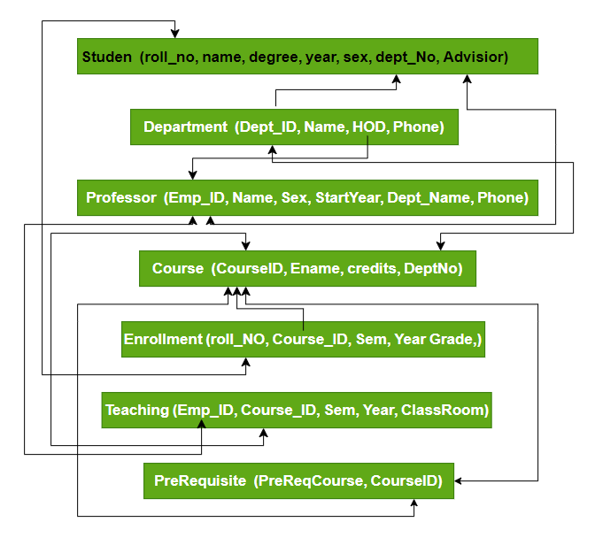

# Relational Schema trong DBMS

**Cập nhật lần cuối:** 09/06/2026

**Nguồn tham khảo:**  
- GeeksforGeeks: [Relation Schema in DBMS](https://www.geeksforgeeks.org/dbms/relation-schema-in-dbms/)

---

## 1. Mục tiêu bài giảng

Sau khi hoàn thành bài học này, người học có thể:

1. Trình bày được khái niệm relational schema trong mô hình quan hệ.
2. Phân biệt được relational schema, relation instance và database schema.
3. Xác định được các thành phần của relational schema: tên quan hệ, thuộc tính, domain, khóa và ràng buộc.
4. Giải thích được vai trò của primary key, foreign key và referential integrity.
5. Vận dụng relational schema để mô tả một hệ thống dữ liệu đơn giản.
6. Nhận biết được các lỗi ràng buộc khi insert, delete hoặc update dữ liệu.
7. Hoàn thành được các câu hỏi ôn tập và bài tập vận dụng.

---

## 2. Giới thiệu tổng quan

Trong mô hình cơ sở dữ liệu quan hệ, dữ liệu được tổ chức thành các quan hệ. Khi triển khai bằng SQL, mỗi quan hệ thường tương ứng với một bảng. Mỗi bảng có tên, tập cột, kiểu dữ liệu, khóa và các ràng buộc toàn vẹn.

**Relational schema** là bản mô tả cấu trúc logic của một quan hệ. Nó cho biết quan hệ có tên gì, gồm những thuộc tính nào, thuộc tính nhận giá trị trong miền nào, khóa nào định danh bản ghi và quan hệ liên kết với quan hệ khác ra sao.

Ví dụ:

```text
Student(rollNo, name, degree, year, sex, deptNo, advisor)
```

Schema này cho biết quan hệ `Student` có các thuộc tính `rollNo`, `name`, `degree`, `year`, `sex`, `deptNo`, `advisor`. Khi thiết kế đầy đủ hơn, ta cần chỉ ra khóa chính, khóa ngoại và ràng buộc dữ liệu.

<p align="center">
  
</p>

<p align="center">
  <em>Hình 1. Ví dụ relational schema và các liên kết khóa.</em>
</p>

---

### Quiz nhanh: Giới thiệu tổng quan

**Câu 1.** Relational schema dùng để mô tả điều gì?

A. Giao diện người dùng của ứng dụng  
B. Cấu trúc logic của một quan hệ trong cơ sở dữ liệu  
C. Tốc độ mạng của máy chủ  
D. Nội dung của một file ảnh  

**Câu 2.** Schema `Student(rollNo, name, deptNo)` cho biết điều gì?

A. Quan hệ `Student` có các thuộc tính `rollNo`, `name`, `deptNo`  
B. Bảng `Student` có đúng ba bản ghi  
C. `Student` là tên hệ điều hành  
D. `rollNo` chắc chắn là khóa ngoại  

**Câu 3.** Vì sao relational schema quan trọng?

A. Vì nó thay thế hoàn toàn SQL  
B. Vì nó giúp mô tả cấu trúc, khóa và ràng buộc dữ liệu  
C. Vì nó chỉ dùng để trang trí bài giảng  
D. Vì nó tự động tạo giao diện nhập liệu  

---

## 3. Khái niệm cơ bản

### 3.1. Relational schema

Relational schema là phần mô tả cấu trúc của một quan hệ. Một schema thường gồm:

- Tên quan hệ.
- Danh sách thuộc tính.
- Domain hoặc kiểu dữ liệu của từng thuộc tính.
- Primary key.
- Foreign key.
- Các ràng buộc toàn vẹn.

Ví dụ:

```text
Department(deptId, name, hod, phone)
```

Ở mức triển khai, có thể mô tả chi tiết hơn:

```text
Department(
    deptId INT PRIMARY KEY,
    name VARCHAR(100) NOT NULL,
    hod INT,
    phone VARCHAR(20)
)
```

### 3.2. Relation instance

Relation instance là tập các tuple thực tế trong một quan hệ tại một thời điểm. Nếu schema là bản thiết kế, instance là dữ liệu hiện đang nằm trong bảng.

Ví dụ, với schema `Student(rollNo, name, deptNo)`, instance có thể là:

| rollNo | name | deptNo |
|---:|---|---:|
| 101 | An | 1 |
| 102 | Binh | 2 |

### 3.3. Database schema

Database schema là tập hợp nhiều relational schema cùng với các liên kết giữa chúng. Ví dụ một database trường học có thể gồm:

```text
Student(rollNo, name, degree, year, sex, deptNo, advisor)
Department(deptId, name, hod, phone)
Course(courseId, name, credits, deptNo)
Professor(empId, name, sex, startYear, deptNo, phone)
Enrollment(rollNo, courseId, sem, year, grade)
Teaching(empId, courseId, sem, year, classroom)
Prerequisite(preReqCourse, courseId)
```

### 3.4. Ý nghĩa của các khái niệm

Phân biệt schema và instance giúp tránh nhầm giữa thiết kế và dữ liệu. Schema thường ổn định hơn, còn instance thay đổi khi dữ liệu được thêm, sửa hoặc xóa.

---

### Quiz nhanh: Khái niệm cơ bản

**Câu 1.** Relation instance là gì?

A. Tên của cơ sở dữ liệu  
B. Danh sách ràng buộc khóa chính  
C. Danh sách file ảnh  
D. Dữ liệu thực tế của một quan hệ tại một thời điểm  

**Câu 2.** Database schema thường gồm gì?

A. Một câu lệnh `SELECT` duy nhất  
B. Nhiều relational schema và mối liên kết giữa chúng  
C. Chỉ một bản ghi duy nhất  
D. Chỉ tên người quản trị  

**Câu 3.** Điểm khác nhau chính giữa schema và instance là gì?

A. Schema là cấu trúc, instance là dữ liệu thực tế  
B. Schema luôn thay đổi sau mỗi truy vấn đọc  
C. Instance là tên của bảng  
D. Schema không liên quan đến cơ sở dữ liệu  

---

## 4. Cách thiết kế relational schema

Quy trình thiết kế relational schema thường gồm các bước:

1. **Xác định đối tượng hoặc quan hệ cần lưu**

   Ví dụ: sinh viên, khoa, khóa học, giảng viên.

2. **Xác định thuộc tính**

   Ví dụ sinh viên có `rollNo`, `name`, `degree`, `year`, `deptNo`.

3. **Xác định domain**

   Ví dụ `rollNo` là số nguyên, `name` là chuỗi, `year` là năm học.

4. **Chọn primary key**

   Primary key định danh duy nhất từng tuple. Ví dụ `rollNo` cho `Student`.

5. **Xác định foreign key**

   Foreign key liên kết quan hệ này với quan hệ khác. Ví dụ `Student.deptNo` tham chiếu `Department.deptId`.

6. **Bổ sung ràng buộc**

   Ví dụ `NOT NULL`, `UNIQUE`, `CHECK`, `DEFAULT`, `FOREIGN KEY`.

Ví dụ rút gọn:

```text
Student(rollNo PK, name, degree, year, sex, deptNo FK, advisor FK)
Department(deptId PK, name, hod FK, phone)
Professor(empId PK, name, sex, startYear, deptNo FK, phone)
```

---

### Quiz nhanh: Cách hoạt động

**Câu 1.** Bước nào nên làm trước khi chọn khóa chính?

A. Xóa toàn bộ database  
B. Tạo chỉ mục cho mọi cột ngay lập tức  
C. Tạo ảnh minh họa  
D. Xác định quan hệ và thuộc tính cần lưu  

**Câu 2.** Foreign key được dùng chủ yếu để làm gì?

A. Đổi màu bảng  
B. Liên kết một quan hệ với quan hệ khác  
C. Tăng kích thước file Markdown  
D. Thay thế mọi ràng buộc  

**Câu 3.** Domain của thuộc tính giúp xác định điều gì?

A. Tên website  
B. Tên người quản trị hệ thống  
C. Mật khẩu người dùng  
D. Tập giá trị hợp lệ hoặc kiểu dữ liệu của thuộc tính  

---

## 5. Các thành phần chính

### 5.1. Relation name

Relation name là tên của quan hệ hoặc bảng. Tên nên rõ nghĩa và phản ánh dữ liệu được lưu.

Ví dụ:

```text
Student
Department
Course
Professor
```

### 5.2. Attribute name

Attribute name là tên các thuộc tính trong quan hệ. Mỗi thuộc tính tương ứng với một cột khi triển khai thành bảng.

Ví dụ:

```text
Student(rollNo, name, degree, year, sex, deptNo, advisor)
```

### 5.3. Domain

Domain là miền giá trị hợp lệ của một thuộc tính.

| Thuộc tính | Domain gợi ý |
|---|---|
| `rollNo` | Số nguyên dương |
| `name` | Chuỗi ký tự |
| `sex` | Tập giá trị hữu hạn |
| `phone` | Chuỗi số điện thoại |
| `credits` | Số nguyên dương |

### 5.4. Primary key

Primary key là thuộc tính hoặc tập thuộc tính định danh duy nhất mỗi tuple. Khóa chính không được trùng và không nên nhận giá trị null.

### 5.5. Foreign key

Foreign key là thuộc tính tham chiếu khóa chính của quan hệ khác. Nó giúp biểu diễn mối quan hệ giữa các bảng.

Ví dụ:

```text
Student.deptNo -> Department.deptId
Student.advisor -> Professor.empId
Course.deptNo -> Department.deptId
```

### 5.6. Constraints

Constraints là các quy tắc đảm bảo dữ liệu hợp lệ.

| Ràng buộc | Ý nghĩa |
|---|---|
| `NOT NULL` | Không cho phép giá trị rỗng |
| `UNIQUE` | Không cho phép trùng lặp |
| `PRIMARY KEY` | Định danh duy nhất tuple |
| `FOREIGN KEY` | Đảm bảo tham chiếu hợp lệ |
| `CHECK` | Kiểm tra điều kiện dữ liệu |
| `DEFAULT` | Gán giá trị mặc định |

---

### Quiz nhanh: Các thành phần chính

**Câu 1.** Thành phần nào định danh duy nhất mỗi tuple?

A. File path  
B. Comment  
C. Theme color  
D. Primary key  

**Câu 2.** Domain của thuộc tính cho biết điều gì?

A. Tên của website  
B. Tập giá trị hợp lệ của thuộc tính  
C. Số lượng ảnh trong thư mục  
D. Tên người quản trị  

**Câu 3.** Foreign key dùng để biểu diễn điều gì?

A. Dữ liệu ảnh  
B. Định dạng file Markdown  
C. Liên kết tham chiếu giữa các quan hệ  
D. Số lượng bản ghi tối đa  

---

## 6. Phân loại hoặc các nhóm chính

Nội dung relational schema có thể chia thành các nhóm:

1. **Cấu trúc quan hệ:** relation name, attributes, domains.
2. **Ràng buộc khóa:** primary key, foreign key, candidate key nếu cần.
3. **Ràng buộc toàn vẹn:** not null, unique, check, referential integrity.
4. **Liên kết giữa các schema:** các quan hệ được nối với nhau qua khóa ngoại.
5. **Thao tác trên relation:** insert, delete, modify, retrieve.

---

## 7. Ví dụ relational schema cho hệ thống trường học

### 7.1. Khái niệm

Một hệ thống trường học cần lưu sinh viên, khoa, giảng viên, khóa học, ghi danh và hoạt động giảng dạy. Mỗi nhóm dữ liệu có thể được mô tả bằng một schema riêng.

### 7.2. Các schema chính

```text
Student(rollNo, name, degree, year, sex, deptNo, advisor)
Department(deptId, name, hod, phone)
Course(courseId, name, credits, deptNo)
Professor(empId, name, sex, startYear, deptNo, phone)
Enrollment(rollNo, courseId, sem, year, grade)
Teaching(empId, courseId, sem, year, classroom)
Prerequisite(preReqCourse, courseId)
```

### 7.3. Ý nghĩa từng schema

| Schema | Ý nghĩa |
|---|---|
| `Student` | Lưu thông tin sinh viên |
| `Department` | Lưu thông tin khoa/phòng ban |
| `Course` | Lưu thông tin học phần |
| `Professor` | Lưu thông tin giảng viên |
| `Enrollment` | Lưu thông tin sinh viên đăng ký học phần |
| `Teaching` | Lưu thông tin giảng viên dạy học phần |
| `Prerequisite` | Lưu quan hệ học phần tiên quyết |

### 7.4. Các liên kết khóa ngoại

```text
Student.deptNo -> Department.deptId
Student.advisor -> Professor.empId
Department.hod -> Professor.empId
Course.deptNo -> Department.deptId
Enrollment.rollNo -> Student.rollNo
Enrollment.courseId -> Course.courseId
Teaching.empId -> Professor.empId
Teaching.courseId -> Course.courseId
Prerequisite.preReqCourse -> Course.courseId
Prerequisite.courseId -> Course.courseId
```

---

### Quiz nhanh: Ví dụ relational schema

**Câu 1.** Schema nào phù hợp để lưu thông tin sinh viên đăng ký học phần?

A. `Department`  
B. `Enrollment`  
C. `Professor`  
D. `Prerequisite`  

**Câu 2.** Liên kết `Student.deptNo -> Department.deptId` có ý nghĩa gì?

A. Khoa tham chiếu đến điểm số của sinh viên  
B. `deptNo` là khóa chính của bảng `Course`  
C. Sinh viên tham chiếu đến khoa/phòng ban mà sinh viên thuộc về  
D. `Student` không cần khóa ngoại  

**Câu 3.** Schema `Prerequisite(preReqCourse, courseId)` thường dùng để mô tả điều gì?

A. Số điện thoại của giảng viên  
B. Danh sách sinh viên theo khoa  
C. Quan hệ học phần tiên quyết  
D. Lương của nhân viên  

---

## 8. Thao tác và vi phạm ràng buộc

### 8.1. Insert

Insert thêm tuple mới vào quan hệ. Thao tác này có thể vi phạm primary key, foreign key, unique, not null hoặc check.

Ví dụ: thêm `Enrollment` với `rollNo` không tồn tại trong `Student` sẽ vi phạm khóa ngoại.

### 8.2. Delete

Delete xóa tuple khỏi quan hệ. Nếu tuple đang được quan hệ khác tham chiếu, thao tác xóa có thể vi phạm referential integrity.

Ví dụ: xóa một `Department` trong khi nhiều `Student` vẫn tham chiếu đến `deptId` đó.

### 8.3. Modify

Modify hoặc update thay đổi giá trị trong tuple. Nếu sửa khóa chính, khóa ngoại hoặc giá trị có ràng buộc, dữ liệu mới phải vẫn hợp lệ.

Ví dụ: đổi `Student.deptNo` sang một mã khoa không tồn tại sẽ vi phạm khóa ngoại.

### 8.4. Retrieve

Retrieve là thao tác đọc dữ liệu. Truy vấn đọc thường không gây vi phạm toàn vẹn vì không thay đổi dữ liệu.

---

### Quiz nhanh: Thao tác và vi phạm ràng buộc

**Câu 1.** Insert có thể vi phạm ràng buộc nào?

A. Chỉ ràng buộc giao diện  
B. Primary key, foreign key, unique, not null hoặc check  
C. Chỉ màu nền của trang  
D. Không bao giờ vi phạm ràng buộc  

**Câu 2.** Delete thường có nguy cơ vi phạm ràng buộc nào?

A. Font size  
B. Markdown heading  
C. Tên file ảnh  
D. Referential integrity  

**Câu 3.** Retrieve thường có đặc điểm nào?

A. Luôn xóa dữ liệu cha  
B. Luôn thêm tuple mới  
C. Luôn đổi khóa chính  
D. Là thao tác đọc dữ liệu và thường không làm thay đổi dữ liệu  

---

## 9. Nguyên lý, tính chất hoặc tiêu chuẩn quan trọng

### 9.1. Tính rõ nghĩa

Tên quan hệ và thuộc tính nên mô tả đúng dữ liệu. `Student`, `Course`, `Enrollment` rõ nghĩa hơn các tên như `T1`, `A`, `B`.

### 9.2. Tính duy nhất

Mỗi relation nên có primary key rõ ràng để định danh tuple.

### 9.3. Tính toàn vẹn tham chiếu

Foreign key phải tham chiếu đến bản ghi hợp lệ trong bảng cha. Điều này giúp tránh dữ liệu mồ côi.

### 9.4. Tính phù hợp của domain

Mỗi thuộc tính cần domain phù hợp. Số điện thoại nên là chuỗi, điểm số nên có miền hợp lệ, số tín chỉ nên là số nguyên dương.

---

### Quiz nhanh: Nguyên lý hoặc tính chất quan trọng

**Câu 1.** Vì sao nên đặt tên quan hệ rõ nghĩa?

A. Để tăng kích thước database  
B. Để bỏ qua khóa chính  
C. Để không cần kiểm tra dữ liệu  
D. Để schema dễ đọc, dễ bảo trì và ít gây nhầm lẫn  

**Câu 2.** Tính toàn vẹn tham chiếu liên quan trực tiếp đến thành phần nào?

A. Màu chữ  
B. Foreign key  
C. File ảnh  
D. Trình duyệt web  

**Câu 3.** Domain phù hợp giúp ích gì?

A. Giúp xóa toàn bộ bảng tự động  
B. Giúp đổi tên mọi khóa chính  
C. Giúp giới hạn và kiểm soát giá trị hợp lệ của thuộc tính  
D. Giúp bỏ qua mọi ràng buộc  

---

## 10. Ứng dụng thực tế

Relational schema được dùng trong nhiều hệ thống:

1. **Quản lý sinh viên:** sinh viên, khoa, môn học, đăng ký môn và điểm.
2. **Bán hàng:** khách hàng, sản phẩm, đơn hàng, chi tiết đơn hàng.
3. **Nhân sự:** nhân viên, phòng ban, chức vụ, hợp đồng.
4. **Thư viện:** sách, tác giả, độc giả, phiếu mượn.
5. **Y tế:** bệnh nhân, bác sĩ, lịch khám, đơn thuốc.

---

### Quiz nhanh: Ứng dụng thực tế

**Câu 1.** Trong hệ thống bán hàng, relational schema có thể dùng để mô tả bảng nào?

A. `ORDER BY`  
B. `WHERE`  
C. `GROUP BY`  
D. `Orders`  

**Câu 2.** Trong hệ thống thư viện, bảng nào là ví dụ phù hợp?

A. `DROP`  
B. `HAVING`  
C. `Books`  
D. `SELECT`  

**Câu 3.** Trong quản lý sinh viên, `Enrollment` thường biểu diễn điều gì?

A. Danh sách trình duyệt  
B. Sinh viên đăng ký học phần  
C. Ảnh đại diện của website  
D. Mật khẩu hệ điều hành  

---

## 11. Vai trò trong các lĩnh vực công nghệ hoặc nghiệp vụ

### 11.1. Thiết kế cơ sở dữ liệu

- Vai trò: mô tả cấu trúc bảng, khóa và ràng buộc.
- Công cụ liên quan: MySQL Workbench, pgAdmin, SQL Server Management Studio.
- Trường hợp sử dụng: thiết kế schema trước khi tạo bảng thật.

### 11.2. Phát triển backend

- Vai trò: định nghĩa dữ liệu mà API và logic nghiệp vụ sử dụng.
- Công cụ liên quan: SQL, ORM, migration tool.
- Trường hợp sử dụng: tạo migration cho bảng `users`, `orders`, `payments`.

### 11.3. Phân tích dữ liệu

- Vai trò: giúp hiểu cấu trúc dữ liệu trước khi truy vấn và tổng hợp.
- Công cụ liên quan: SQL editor, BI tool, data warehouse.
- Trường hợp sử dụng: xác định bảng nào cần join và join theo khóa nào.

### 11.4. Quản trị dữ liệu

- Vai trò: đảm bảo dữ liệu nhất quán, giảm lỗi tham chiếu và hỗ trợ kiểm soát chất lượng.
- Công cụ liên quan: constraint, index, data catalog.
- Trường hợp sử dụng: rà soát schema, chuẩn hóa bảng và kiểm tra ràng buộc.

---

### Quiz nhanh: Vai trò theo lĩnh vực

**Câu 1.** Trong backend, relational schema hỗ trợ điều gì?

A. Vẽ logo ứng dụng  
B. Chỉnh màu trình duyệt  
C. Tạo cấu trúc dữ liệu phục vụ API và logic nghiệp vụ  
D. Xóa hệ điều hành  

**Câu 2.** Trong phân tích dữ liệu, schema giúp người phân tích làm gì?

A. Tự động viết báo cáo không cần dữ liệu  
B. Tăng độ phân giải ảnh  
C. Biết bảng nào cần join và join theo khóa nào  
D. Xóa mọi ràng buộc  

**Câu 3.** Trong quản trị dữ liệu, ràng buộc schema giúp gì?

A. Tắt toàn bộ truy vấn  
B. Đổi tên tất cả file Markdown  
C. Đảm bảo dữ liệu nhất quán và hợp lệ hơn  
D. Thay thế mạng máy tính  

---

## 12. Bảng so sánh

| Tiêu chí | Relational schema | Relation instance | Database schema |
|---|---|---|---|
| Mục đích | Mô tả cấu trúc một quan hệ | Chứa dữ liệu hiện tại của một quan hệ | Mô tả toàn bộ cấu trúc database |
| Thành phần | Tên quan hệ, thuộc tính, domain, key, constraint | Các tuple thực tế | Nhiều relational schema và liên kết |
| Tính ổn định | Tương đối ổn định | Thay đổi thường xuyên | Tương đối ổn định |
| Ví dụ | `Student(rollNo, name, deptNo)` | Dòng dữ liệu của từng sinh viên | `Student`, `Department`, `Course`, `Enrollment` |

---

## 13. Câu hỏi ôn tập

### 13.1. Câu hỏi trắc nghiệm

**Câu 1.** Relational schema thường bao gồm thành phần nào?

A. Chỉ màu nền của trang  
B. Chỉ dữ liệu của một dòng  
C. Chỉ tên người dùng  
D. Tên quan hệ, thuộc tính, domain, khóa và ràng buộc  

---

**Câu 2.** Thuộc tính nào thường dùng làm khóa chính cho bảng `Student` trong ví dụ?

A. `name`  
B. `sex`  
C. `rollNo`  
D. `phone`  

---

**Câu 3.** `Student.deptNo -> Department.deptId` là ví dụ của gì?

A. Khóa ngoại tham chiếu khóa chính  
B. Câu lệnh xóa bảng  
C. Kiểu dữ liệu ảnh  
D. Tên file Markdown  

---

**Câu 4.** Ràng buộc nào yêu cầu giá trị không được rỗng?

A. `NOT NULL`  
B. `DEFAULT`  
C. `ORDER BY`  
D. `GROUP BY`  

---

**Câu 5.** Thao tác nào dùng để thêm tuple mới?

A. Insert  
B. Retrieve  
C. Select only  
D. Comment  

---

**Câu 6.** Delete có thể gây lỗi nào nếu bản ghi đang được bảng khác tham chiếu?

A. Vi phạm toàn vẹn tham chiếu  
B. Lỗi font chữ  
C. Lỗi ảnh nền  
D. Lỗi tiêu đề Markdown  

---

**Câu 7.** Domain của thuộc tính `credits` trong bảng `Course` nên là gì?

A. Số nguyên dương hoặc một miền số hợp lệ  
B. Bất kỳ ảnh nào  
C. Một câu lệnh `DROP`  
D. Một URL không giới hạn  

---

**Câu 8.** Relation instance thay đổi khi nào?

A. Khi dữ liệu trong bảng được thêm, sửa hoặc xóa  
B. Khi đổi màu giao diện  
C. Khi đóng trình duyệt  
D. Khi đổi tên file ảnh  

---

**Câu 9.** `Enrollment(rollNo, courseId, sem, year, grade)` phù hợp để lưu gì?

A. Thông tin sinh viên đăng ký học phần và điểm  
B. Danh sách ảnh minh họa  
C. Mật khẩu máy chủ  
D. Tên file cấu hình Jekyll  

---

**Câu 10.** Mục tiêu chính của constraints là gì?

A. Đảm bảo tính hợp lệ và toàn vẹn của dữ liệu  
B. Tăng độ sáng màn hình  
C. Xóa mọi khóa ngoại  
D. Thay thế việc thiết kế bảng  

---

### 13.2. Câu hỏi tự luận ngắn

**Câu 1.** Trình bày khái niệm relational schema.

---

**Câu 2.** Phân biệt relational schema và relation instance.

---

**Câu 3.** Giải thích vai trò của primary key và foreign key trong relational schema.

---

**Câu 4.** Nêu các vi phạm ràng buộc có thể xảy ra khi insert dữ liệu.

---

**Câu 5.** Phân tích vì sao thiết kế relational schema tốt giúp cải thiện chất lượng dữ liệu.

---

## 14. Bài tập vận dụng

### Bài tập 1

Một hệ thống quản lý sinh viên cần lưu thông tin sinh viên, khoa và giảng viên cố vấn.

**Yêu cầu:**  
Thiết kế ít nhất 3 relational schema và chỉ ra khóa chính, khóa ngoại.

---

### Bài tập 2

Một hệ thống bán hàng cần lưu khách hàng, sản phẩm, đơn hàng và chi tiết đơn hàng.

**Yêu cầu:**  
Thiết kế relational schema cho hệ thống và mô tả quan hệ giữa các bảng.

---

### Bài tập 3

Cho schema:

```text
Enrollment(rollNo, courseId, sem, year, grade)
```

**Yêu cầu:**  
Xác định các khóa ngoại có thể có và giải thích chúng nên tham chiếu đến bảng nào.

---

### Bài tập 4

Một bảng `Employee(empId, name, deptName, deptPhone, managerName)` lưu cả thông tin nhân viên và phòng ban trong cùng một bảng.

**Yêu cầu:**  
Phân tích vấn đề thiết kế và đề xuất cách tách thành các relational schema hợp lý hơn.

---

## 15. Tóm tắt bài học

- Relational schema là bản mô tả cấu trúc của một quan hệ trong cơ sở dữ liệu quan hệ.
- Một schema thường gồm tên quan hệ, thuộc tính, domain, khóa và ràng buộc.
- Relation instance là dữ liệu thực tế của quan hệ tại một thời điểm.
- Database schema là tập hợp nhiều relational schema và liên kết giữa chúng.
- Primary key định danh duy nhất tuple; foreign key liên kết các bảng.
- Constraints giúp đảm bảo dữ liệu hợp lệ và nhất quán.
- Insert, delete và modify có thể gây vi phạm ràng buộc nếu dữ liệu không phù hợp.
- Retrieve là thao tác đọc và thường không gây vi phạm toàn vẹn dữ liệu.

---

## 16. Từ khóa chính

- Relational Schema
- Relation Schema
- Relation Instance
- Database Schema
- Relation Name
- Attribute
- Domain
- Primary Key
- Foreign Key
- Constraint
- Referential Integrity
- Insert
- Delete
- Modify
- Retrieve

---

## 17. Đáp án và gợi ý trả lời

### Quiz nhanh: Giới thiệu tổng quan

- **Câu 1.** B
- **Câu 2.** A
- **Câu 3.** B

### Quiz nhanh: Khái niệm cơ bản

- **Câu 1.** D
- **Câu 2.** B
- **Câu 3.** A

### Quiz nhanh: Cách hoạt động

- **Câu 1.** D
- **Câu 2.** B
- **Câu 3.** D

### Quiz nhanh: Các thành phần chính

- **Câu 1.** D
- **Câu 2.** B
- **Câu 3.** C

### Quiz nhanh: Ví dụ relational schema

- **Câu 1.** B
- **Câu 2.** C
- **Câu 3.** C

### Quiz nhanh: Thao tác và vi phạm ràng buộc

- **Câu 1.** B
- **Câu 2.** D
- **Câu 3.** D

### Quiz nhanh: Nguyên lý hoặc tính chất quan trọng

- **Câu 1.** D
- **Câu 2.** B
- **Câu 3.** C

### Quiz nhanh: Ứng dụng thực tế

- **Câu 1.** D
- **Câu 2.** C
- **Câu 3.** B

### Quiz nhanh: Vai trò theo lĩnh vực

- **Câu 1.** C
- **Câu 2.** C
- **Câu 3.** C

### Câu hỏi ôn tập - Trắc nghiệm

- **Câu 1.** D
- **Câu 2.** C
- **Câu 3.** A
- **Câu 4.** A
- **Câu 5.** A
- **Câu 6.** A
- **Câu 7.** A
- **Câu 8.** A
- **Câu 9.** A
- **Câu 10.** A

### Câu hỏi ôn tập - Tự luận ngắn

#### Câu 1

**Gợi ý trả lời:**

Relational schema là bản mô tả cấu trúc của một quan hệ trong cơ sở dữ liệu quan hệ. Nó thường gồm tên quan hệ, tập thuộc tính, miền giá trị, khóa và các ràng buộc toàn vẹn.

#### Câu 2

**Gợi ý trả lời:**

Relational schema là thiết kế hoặc cấu trúc của quan hệ, còn relation instance là dữ liệu thực tế đang nằm trong quan hệ tại một thời điểm. Schema thường ổn định hơn, instance thay đổi khi thêm, sửa hoặc xóa dữ liệu.

#### Câu 3

**Gợi ý trả lời:**

Primary key định danh duy nhất mỗi tuple trong một quan hệ. Foreign key dùng để tham chiếu khóa chính của quan hệ khác, từ đó biểu diễn liên kết giữa các bảng và đảm bảo toàn vẹn tham chiếu.

#### Câu 4

**Gợi ý trả lời:**

Khi insert dữ liệu, có thể vi phạm primary key nếu khóa trùng hoặc null, vi phạm foreign key nếu tham chiếu đến bản ghi không tồn tại, vi phạm unique nếu giá trị bị trùng, vi phạm not null nếu thiếu dữ liệu bắt buộc, hoặc vi phạm check nếu giá trị không thỏa điều kiện.

#### Câu 5

**Gợi ý trả lời:**

Thiết kế relational schema tốt giúp dữ liệu có cấu trúc rõ ràng, tránh trùng lặp không cần thiết, đảm bảo khóa và ràng buộc hợp lệ, hỗ trợ truy vấn chính xác và giúp hệ thống dễ bảo trì hơn.

### Bài tập vận dụng

#### Bài tập 1

**Gợi ý trả lời:**

```text
Student(studentId PK, fullName, deptId FK, advisorId FK)
Department(deptId PK, deptName, officePhone)
Professor(professorId PK, fullName, deptId FK)
```

Trong đó `Student.deptId` và `Professor.deptId` tham chiếu `Department.deptId`, còn `Student.advisorId` tham chiếu `Professor.professorId`.

#### Bài tập 2

**Gợi ý trả lời:**

```text
Customer(customerId PK, fullName, phone, email)
Product(productId PK, productName, unitPrice)
Orders(orderId PK, customerId FK, orderDate)
OrderDetail(orderId FK, productId FK, quantity, unitPrice)
```

`Orders.customerId` tham chiếu `Customer.customerId`; `OrderDetail.orderId` tham chiếu `Orders.orderId`; `OrderDetail.productId` tham chiếu `Product.productId`.

#### Bài tập 3

**Gợi ý trả lời:**

`Enrollment.rollNo` có thể tham chiếu `Student.rollNo`; `Enrollment.courseId` có thể tham chiếu `Course.courseId`. Nếu dùng khóa chính ghép, có thể chọn tổ hợp như `(rollNo, courseId, sem, year)` để tránh ghi danh trùng.

#### Bài tập 4

**Gợi ý trả lời:**

Bảng ban đầu trộn dữ liệu nhân viên và phòng ban, dễ gây lặp `deptName`, `deptPhone` và khó cập nhật. Có thể tách thành:

```text
Department(deptId PK, deptName, deptPhone)
Employee(empId PK, name, deptId FK, managerId FK)
```

Trong đó `Employee.managerId` tự tham chiếu `Employee.empId` nếu người quản lý cũng là nhân viên.

---

## 18. Gợi ý sử dụng bài giảng

Bài giảng này có thể được dùng cho:

1. Buổi học sau ER model và trước khi học chuyển đổi ER sang relational model.
2. Bài thực hành nhận diện khóa chính, khóa ngoại và domain.
3. Hoạt động nhóm thiết kế schema cho hệ thống nhỏ.
4. Bài tập phân tích lỗi ràng buộc khi insert, delete hoặc update.
5. Ôn tập trước các chủ đề normalization, relational algebra và SQL DDL.
