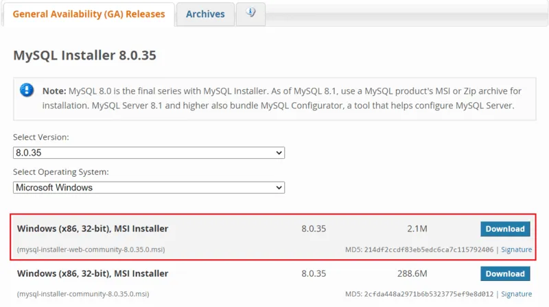
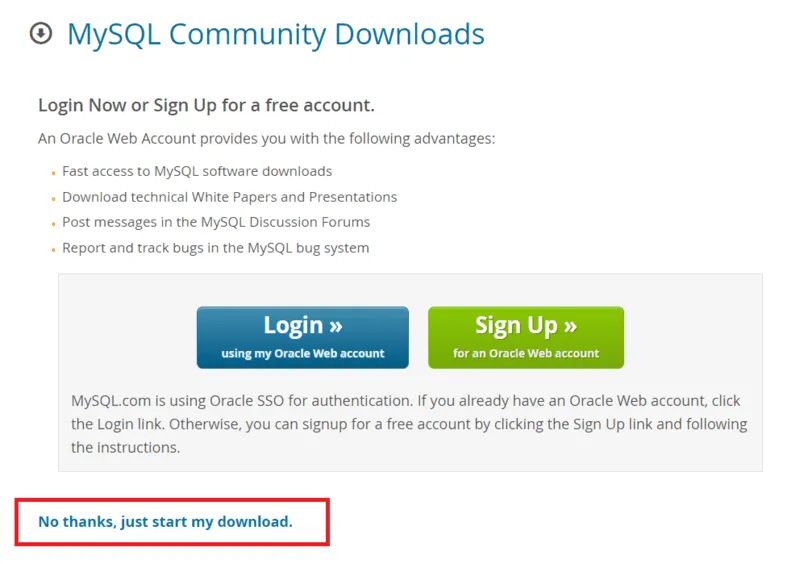
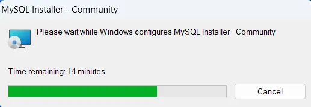
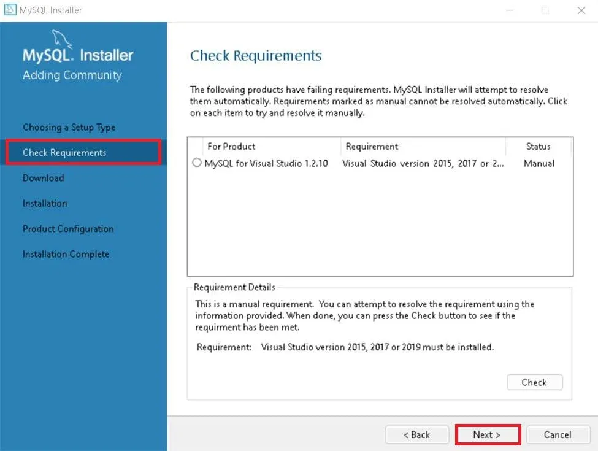
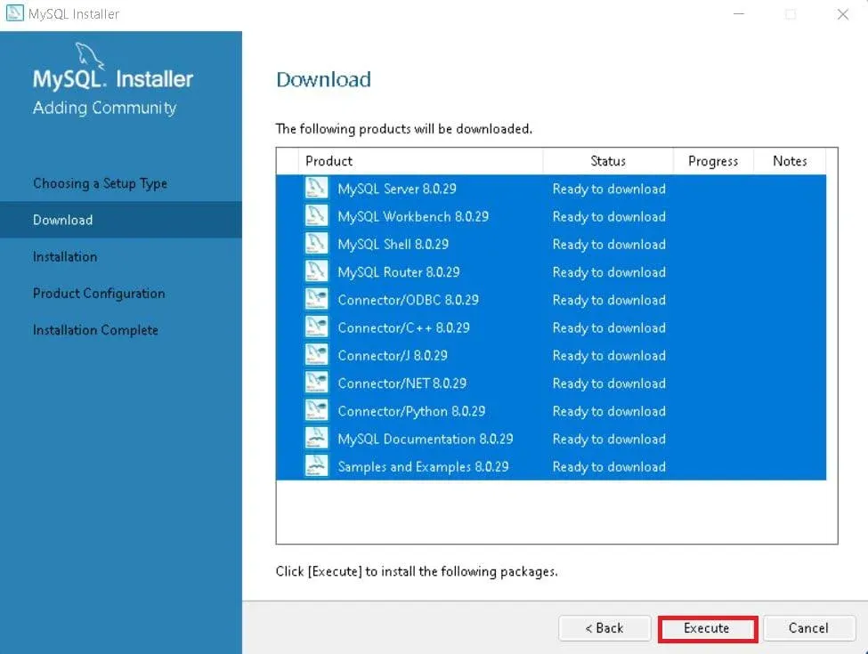
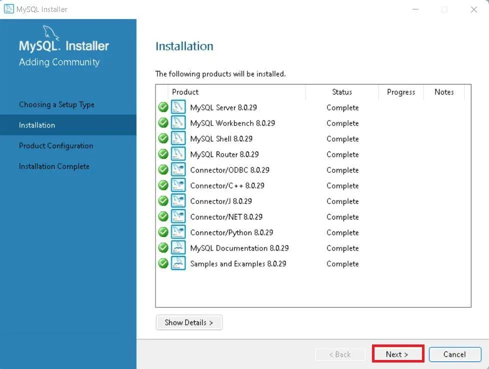
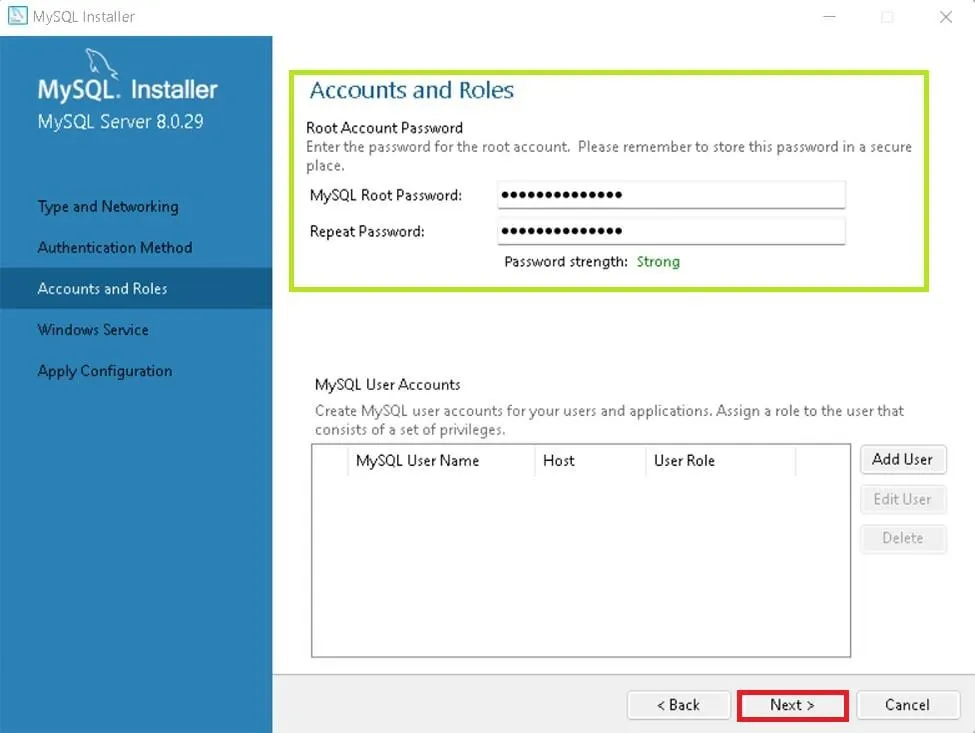
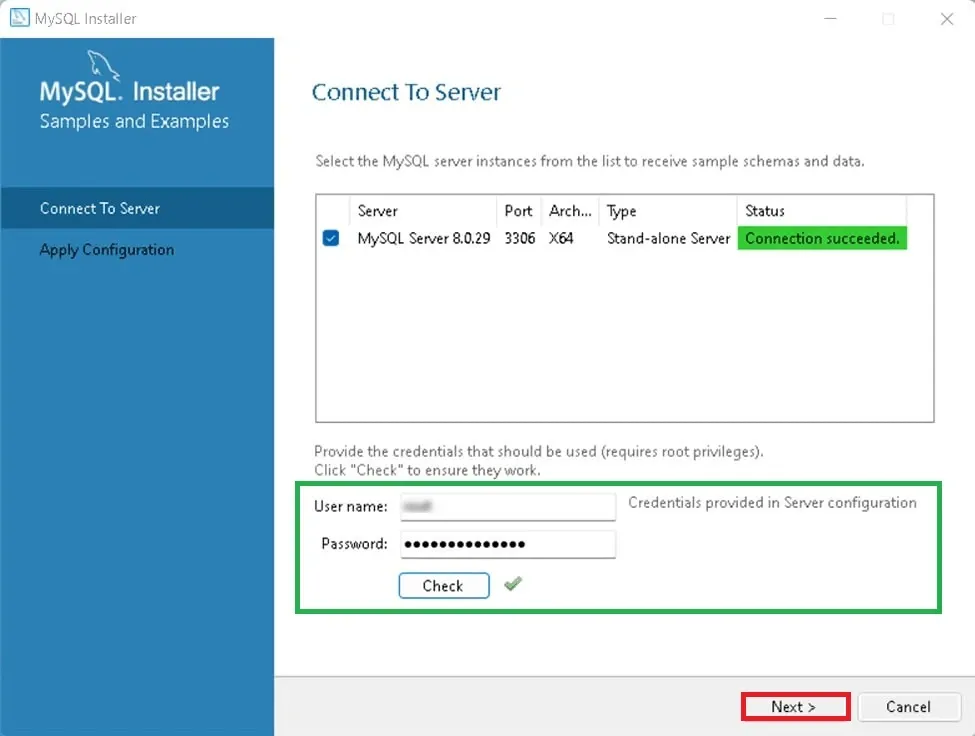
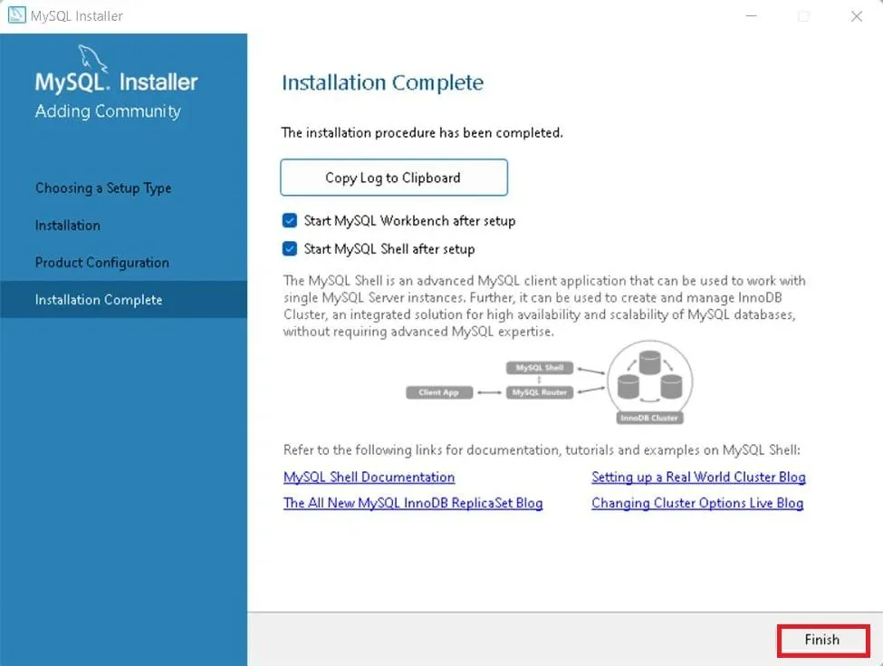
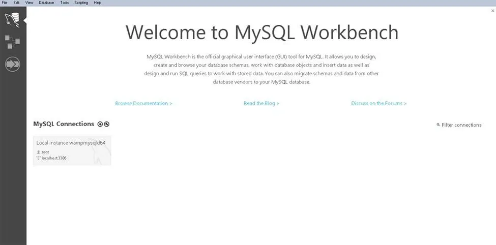

# Hướng dẫn cài đặt MySQL trên Windows

**Nguồn tham khảo:** GeeksforGeeks - [How to Install MySQL in Windows](https://www.geeksforgeeks.org/installation-guide/how-to-install-mysql-in-windows/)

---

## 1. Mục tiêu bài thực hành

Sau khi hoàn thành bài này, người học có thể:

1. Tải đúng bộ cài MySQL cho Windows.
2. Cài đặt MySQL Server và MySQL Workbench.
3. Thiết lập mật khẩu cho tài khoản `root`.
4. Kiểm tra kết nối MySQL sau khi cài đặt.

---

## 2. Yêu cầu hệ thống trước khi cài

Trước khi bắt đầu, cần kiểm tra một số yêu cầu cơ bản:

- Hệ điều hành Windows 11, Windows 10, Windows 8, Windows 7 hoặc Windows Server 2016/2019.
- Máy có tối thiểu 4 GB RAM.
- Dung lượng trống còn lại ít nhất 2 GB.
- Hệ điều hành đã được cập nhật.
- Có kết nối Internet để tải MySQL Installer.
- Nên gỡ các bản MySQL cũ nếu có để tránh xung đột.

---

## 3. Các bước cài đặt MySQL

### Bước 1. Truy cập trang tải MySQL chính thức

Mở trình duyệt và vào trang tải MySQL. Chọn nút tải đầu tiên để bắt đầu quá trình tải bộ cài.

### Bước 2. Chọn liên kết tải nhanh

Khi trang tải xuất hiện, chọn tùy chọn kiểu "No thanks, just start my download" để tải nhanh bộ cài.

### Bước 3. Chạy file cài đặt

Sau khi tải xong, mở thư mục `Downloads`, tìm file `.exe` vừa tải về và nhấp đúp để chạy trình cài đặt.

### Bước 4. Chọn kiểu cài đặt

Trình cài đặt sẽ yêu cầu chọn kiểu cài đặt. Với đa số người học, lựa chọn `Developer Default` là phù hợp vì nó cài cả MySQL Server và công cụ quản trị cần thiết.

### Bước 5. Kiểm tra yêu cầu phụ thuộc

Trình cài đặt sẽ kiểm tra các thành phần cần thiết như Microsoft Visual C++ Redistributable. Nếu thiếu, hệ thống có thể đề xuất cài bổ sung.

### Bước 6. Tải các thành phần cần thiết

Nhấn `Execute` để trình cài đặt tải các thành phần còn thiếu. Chờ cho đến khi tất cả hạng mục hiển thị dấu hoàn tất.

### Bước 7. Cài đặt các gói đã tải

Tiếp tục nhấn `Execute` để cài các thành phần đã tải xuống vào máy tính.

### Bước 8. Đi qua các trang cấu hình

Ở giai đoạn cấu hình, nhấn `Next` để đi qua các mục như `Product Configuration`, `Type and Networking` và `Authentication Method`.

### Bước 9. Tạo tài khoản MySQL

Tạo mật khẩu cho tài khoản `root`. Nên dùng mật khẩu mạnh, dễ nhớ nhưng khó đoán.

### Bước 10. Kiểm tra kết nối đến server

Nhập mật khẩu `root`, nhấn `Check` để xác minh kết nối. Nếu hiện thông báo kết nối thành công, quá trình cấu hình đã đúng.

### Bước 11. Hoàn tất cài đặt

Khi cài đặt xong, chọn `Finish` để kết thúc trình cài đặt.

### Bước 12. Kiểm tra sau cài đặt

Mở `MySQL Command Line Client` hoặc `MySQL Workbench` trong Start Menu, sau đó đăng nhập bằng tài khoản `root` để kiểm tra hệ thống đã sẵn sàng sử dụng.

---

## 4. Tóm tắt quy trình cài đặt

1. Tải MySQL Installer từ trang chính thức.
2. Chạy file cài đặt trên Windows.
3. Chọn kiểu cài đặt phù hợp.
4. Cài các thành phần phụ thuộc nếu cần.
5. Thiết lập `root` và cấu hình máy chủ.
6. Hoàn tất và kiểm tra bằng MySQL Workbench hoặc MySQL Command Line Client.

---

## 5. Một số lỗi thường gặp khi cài đặt

- Cổng `3306` đã bị chiếm dụng: đổi sang cổng khác trong bước cấu hình.
- MySQL Service không khởi động: kiểm tra dịch vụ Windows và tường lửa.
- Sai mật khẩu `root`: đặt lại mật khẩu theo tài liệu chính thức của MySQL.

---

## 6. Bài tập thực hành nhanh

**Bài tập.** Cài đặt MySQL trên máy Windows của bạn, mở MySQL Workbench và chụp lại màn hình đăng nhập thành công.

**Yêu cầu nộp bài:**

- Ảnh chụp màn hình bộ cài đã hoàn tất.
- Ảnh chụp cửa sổ MySQL Workbench.
- Một đoạn mô tả ngắn về các bước bạn đã thực hiện.

---

## 7. Nguồn tham khảo

- GeeksforGeeks: [How to Install MySQL in Windows](https://www.geeksforgeeks.org/installation-guide/how-to-install-mysql-in-windows/)
