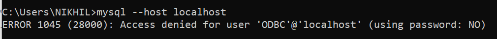
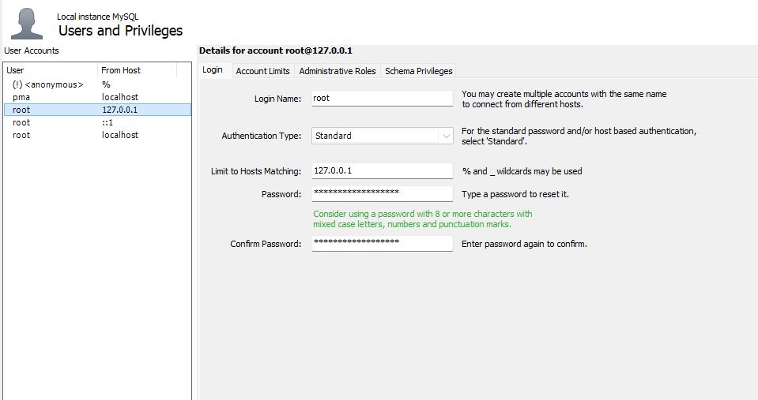
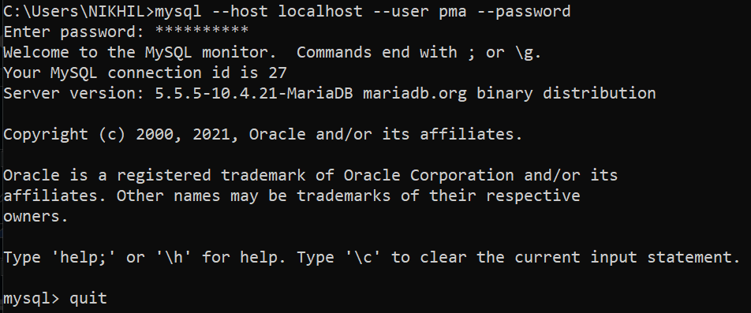

# Kết nối MySQL bằng các tùy chọn dòng lệnh

Nguồn: https://www.geeksforgeeks.org/sql/connecting-to-mysql-using-command-options/

## Mục tiêu
- Hiểu các tuỳ chọn dòng lệnh để kết nối tới MySQL
- Thực hành kết nối bằng `mysql` client với các tuỳ chọn phổ biến

## Yêu cầu
- MySQL Server (mysqld) đang chạy
- Biết `hostname`, `port`, `username` và mật khẩu của tài khoản

## Bước 1 — Khởi động MySQL Server
Đảm bảo tiến trình `mysqld` đang chạy. Nếu lệnh `mysqld` không được nhận dạng:

- Thêm thư mục `bin` của MySQL vào `PATH`
- Hoặc điều hướng vào thư mục `bin` rồi chạy `mysqld`

## Bước 2 — Mở dòng lệnh và kết nối
Sử dụng chương trình dòng lệnh `mysql` cùng các tuỳ chọn để kết nối:

```
mysql --host=<hostname> --port=<port> --user=<username> --password
```

Ví dụ:

```
mysql --host=localhost --user=root --password
```

Ghi chú: Không nên gõ mật khẩu trực tiếp trong lệnh vì không an toàn. Khi nhấn Enter, chương trình sẽ yêu cầu nhập mật khẩu một cách bảo mật.

## Các tuỳ chọn thường dùng

- `--host` / `-h`: máy chủ MySQL (ví dụ `localhost`)
- `--port` / `-P`: số cổng (mặc định `3306`)
- `--user` / `-u`: tên người dùng (mặc định `root`)
- `--password` / `-p`: yêu cầu nhập mật khẩu

## Ví dụ minh hoạ (thực tế)

Lỗi khi thiếu `--host` và `--user`:



Mở tab `Users and Privileges` trong MySQL Workbench:



Kết nối bằng tài khoản `root` (ví dụ):



Khi kết nối thành công, bạn sẽ thấy thông báo chào mừng và prompt của MySQL.

## Mẹo & Lưu ý

- Có thể bỏ qua `--port` nếu MySQL chạy trên cổng mặc định.
- Xem tất cả tuỳ chọn client với:

```
mysql --help
```
- Trong client, các lệnh hữu ích: `quit`, `exit`, `connect`, `print`.

## Tham khảo
- GeeksforGeeks: [Connecting to MySQL Using Command Options](https://www.geeksforgeeks.org/sql/connecting-to-mysql-using-command-options/)
