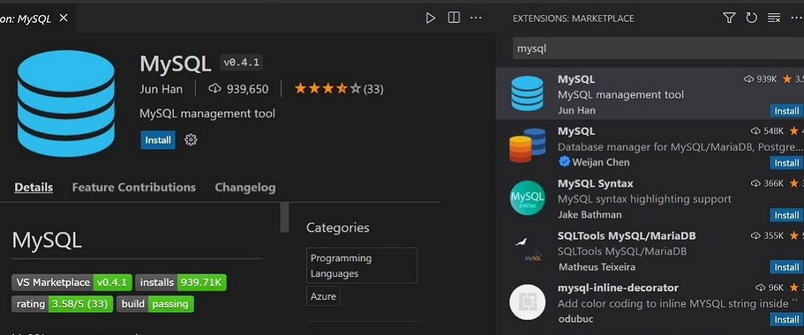
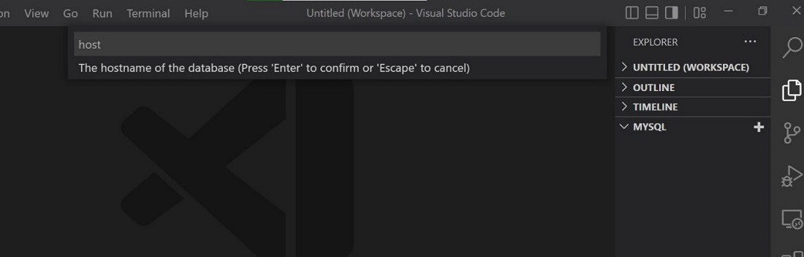
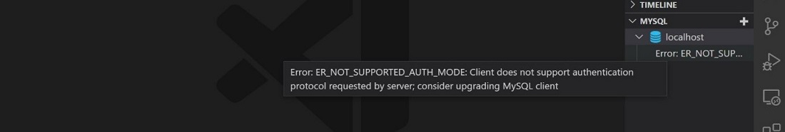
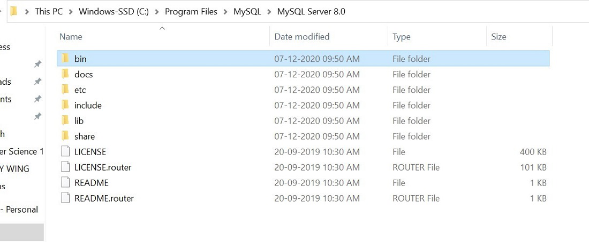
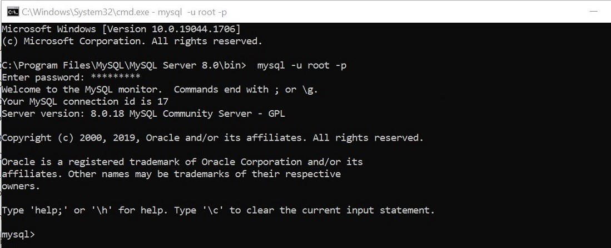
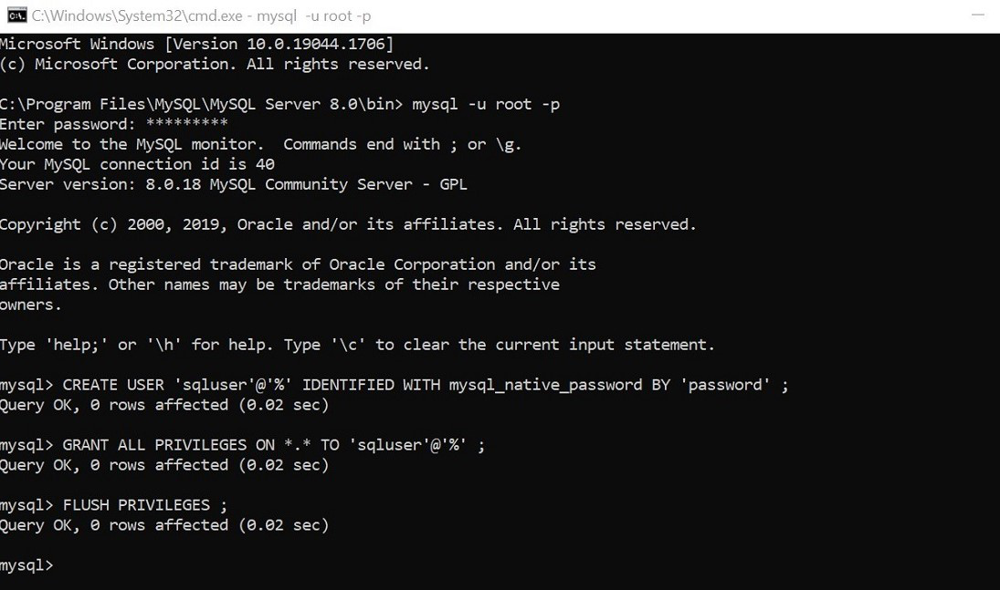
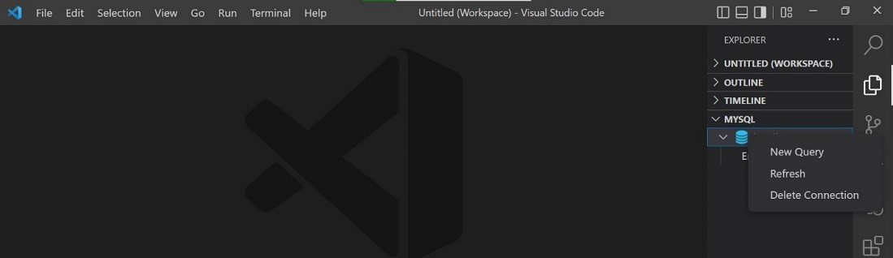
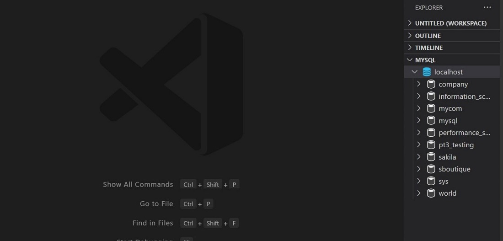
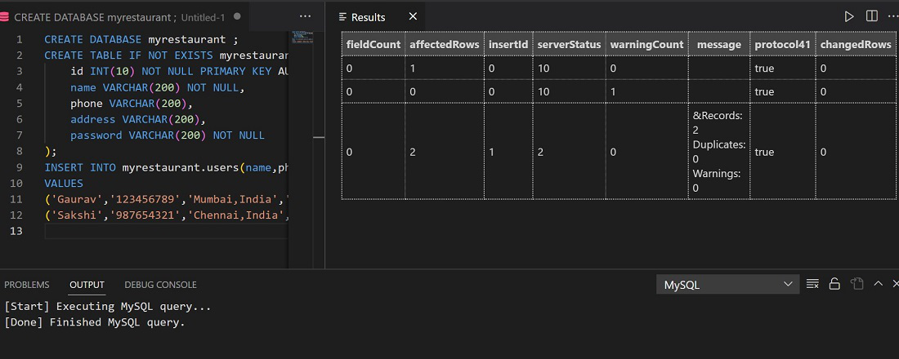

# Kết nối MySQL Server bằng VS Code và sửa lỗi thường gặp

Nguồn: https://www.geeksforgeeks.org/sql/how-to-connect-to-mysql-server-using-vs-code-and-fix-errors/

## Mục tiêu
- Kết nối MySQL từ Visual Studio Code
- Xử lý lỗi xác thực và kết nối thường gặp

## Yêu cầu
- Visual Studio Code đã cài đặt
- MySQL Server (mysqld) đã được cài và đang chạy
- Mở rộng MySQL cho VS Code (ví dụ: MySQL Management Tool)

## Các bước kết nối

1. Mở Visual Studio Code.
2. Vào Extensions, tìm `MySQL` và cài đặt extension `MySQL Management Tool`.



3. Mở Explorer (Ctrl+Shift+E) - mục MySQL sẽ xuất hiện. Nhấn `Add Connection` để tạo kết nối mới.



4. Điền thông tin server: `Host` = `localhost`, `User` = `root` (mặc định), nhập `Password` và `Port` = `3306`.
5. Nếu gặp lỗi xác thực (ví dụ khi dùng MySQL 8 với plugin xác thực mới), ta có thể tạo user mới sử dụng phương thức xác thực cũ.



6. Mở thư mục cài đặt MySQL, vào `bin`, rồi mở `cmd` tại đó nếu cần thao tác trực tiếp.



7. Kết nối bằng client nếu cần kiểm tra từ dòng lệnh:

```
mysql -u root -p
```



## Xử lý lỗi kết nối

- Nếu gặp `ERROR 2003 (HY000): Can't connect to MySQL server on 'localhost:3306' (10061)`, mở Services và khởi động dịch vụ MySQL (ví dụ `MYSQL80`).

## Tạo user dùng xác thực cũ (mysql_native_password)

Ví dụ tạo user `sqluser` với plugin `mysql_native_password`:

```
CREATE USER 'sqluser'@'%' IDENTIFIED WITH mysql_native_password BY 'password';
GRANT ALL PRIVILEGES ON *.* TO 'sqluser'@'%';
FLUSH PRIVILEGES;
```



## Thay đổi kết nối trong VS Code

1. Xoá kết nối cũ.



2. Thêm kết nối mới với:
- Host: `localhost`
- User: `sqluser`
- Password: `password`
- Port: `3306`

3. Kết nối thành công, truy cập và tạo database, bảng và thực thi truy vấn từ VS Code.



## Ví dụ tạo database và bảng

```
CREATE DATABASE myrestaurant;
CREATE TABLE IF NOT EXISTS myrestaurant.users(
  id INT(10) NOT NULL PRIMARY KEY AUTO_INCREMENT,
  name VARCHAR(200) NOT NULL,
  phone VARCHAR(200),
  address VARCHAR(200),
  password VARCHAR(200) NOT NULL
);
INSERT INTO myrestaurant.users(name,phone,address,password)
VALUES('Gaurav','123456789','Mumbai,India','pass134'),('Sakshi','987654321','Chennai,India','pass456');
```



## Ghi chú
- VS Code hỗ trợ quản lý cơ sở dữ liệu tiện lợi khi kết hợp extension phù hợp.

## Tham khảo
- GeeksforGeeks: [How to Connect to MySQL Server Using VS Code and Fix errors?](https://www.geeksforgeeks.org/sql/how-to-connect-to-mysql-server-using-vs-code-and-fix-errors/)
