# Bài giảng: Tạo cơ sở dữ liệu trong MySQL bằng `CREATE DATABASE`

## 1. Tóm tắt bài học

Trong bài học này, người học tìm hiểu cách tạo một cơ sở dữ liệu mới trong MySQL bằng câu lệnh `CREATE DATABASE` và bằng giao diện MySQL Workbench.

Một cơ sở dữ liệu trong MySQL là nơi lưu trữ các bảng, view, thủ tục, trigger và các đối tượng dữ liệu liên quan. Trước khi tạo bảng hoặc nhập dữ liệu cho một ứng dụng, ta thường cần tạo database trước.

Các nội dung chính:

- Hiểu mục đích của câu lệnh `CREATE DATABASE`.
- Tạo database bằng dòng lệnh MySQL.
- Kiểm tra database đã được tạo bằng `SHOW DATABASES`.
- Chọn database bằng `USE`.
- Tạo database bằng MySQL Workbench.
- Nhận biết một số lỗi thường gặp khi tạo database.

---

## 2. Mục tiêu học tập

Sau khi hoàn thành bài học này, người học có thể:

1. Giải thích được vai trò của database trong MySQL.
2. Viết đúng cú pháp `CREATE DATABASE`.
3. Tạo database mới bằng MySQL command line.
4. Kiểm tra danh sách database hiện có bằng `SHOW DATABASES`.
5. Chọn database vừa tạo bằng `USE`.
6. Tạo database bằng MySQL Workbench.
7. Phân biệt được `CREATE DATABASE`, `USE` và `DROP DATABASE`.
8. Xử lý được các lỗi cơ bản khi tạo database.

---

## 3. Database trong MySQL là gì?

Trong MySQL, database là một vùng lưu trữ logic dùng để nhóm các đối tượng dữ liệu thuộc cùng một ứng dụng hoặc cùng một mục đích.

Ví dụ:

- Ứng dụng bán hàng có thể có database `shop`.
- Hệ thống quản lý sinh viên có thể có database `student_management`.
- Ứng dụng thư viện có thể có database `library`.

Sau khi tạo database, ta có thể tạo các bảng bên trong database đó, chẳng hạn:

- `customers`
- `orders`
- `products`
- `students`
- `books`

---

## 4. Cú pháp `CREATE DATABASE`

Cú pháp cơ bản:

```sql
CREATE DATABASE database_name;
```

Trong đó, `database_name` là tên database cần tạo.

Ví dụ:

```sql
CREATE DATABASE testdb;
```

Câu lệnh trên tạo một database mới có tên `testdb`.

### Quy tắc đặt tên database

Khi đặt tên database, nên tuân thủ các nguyên tắc sau:

- Dùng tên ngắn gọn, có ý nghĩa.
- Hạn chế dùng khoảng trắng.
- Nên dùng chữ thường và dấu gạch dưới, ví dụ `student_management`.
- Không nên dùng từ khóa SQL làm tên database.
- Tên database phải nhất quán với mục đích sử dụng.

---

## 5. Tạo database bằng MySQL command line

Trước hết, đăng nhập vào MySQL:

```bash
mysql -u root -p
```

Sau đó nhập mật khẩu của user `root`.

Khi đã vào môi trường MySQL, tạo database bằng lệnh:

```sql
CREATE DATABASE testdb;
```

Nếu tạo thành công, MySQL thường hiển thị:

```text
Query OK, 1 row affected
```

Thông báo này cho biết database mới đã được tạo.

---

## 6. Kiểm tra database đã được tạo

Để xem danh sách database hiện có trên MySQL Server, dùng lệnh:

```sql
SHOW DATABASES;
```

Kết quả có thể bao gồm database vừa tạo:

```text
+--------------------+
| Database           |
+--------------------+
| information_schema |
| mysql              |
| performance_schema |
| sys                |
| testdb             |
+--------------------+
```

Nếu thấy `testdb` trong danh sách, nghĩa là database đã được tạo thành công.

---

## 7. Chọn database sau khi tạo

Sau khi tạo database, MySQL chưa tự động chuyển sang làm việc với database đó trong mọi trường hợp. Để chọn database hiện tại, dùng lệnh:

```sql
USE testdb;
```

Nếu thành công, MySQL hiển thị:

```text
Database changed
```

Có thể kiểm tra lại database hiện tại bằng:

```sql
SELECT DATABASE();
```

Kết quả mong muốn:

```text
+------------+
| DATABASE() |
+------------+
| testdb     |
+------------+
```

---

## 8. Tạo database nếu chưa tồn tại

Nếu chạy `CREATE DATABASE testdb;` khi `testdb` đã tồn tại, MySQL có thể báo lỗi:

```text
ERROR 1007 (HY000): Can't create database 'testdb'; database exists
```

Để tránh lỗi này, có thể dùng:

```sql
CREATE DATABASE IF NOT EXISTS testdb;
```

Câu lệnh này có ý nghĩa:

- Nếu `testdb` chưa tồn tại, MySQL sẽ tạo mới.
- Nếu `testdb` đã tồn tại, MySQL không tạo lại và không báo lỗi nghiêm trọng.

---

## 9. Tạo database với bộ ký tự và collation

Khi tạo database, có thể chỉ định bộ ký tự và collation.

Ví dụ:

```sql
CREATE DATABASE testdb
CHARACTER SET utf8mb4
COLLATE utf8mb4_unicode_ci;
```

Trong đó:

| Thành phần | Ý nghĩa |
|---|---|
| `CHARACTER SET utf8mb4` | Cho phép lưu trữ đầy đủ ký tự Unicode |
| `COLLATE utf8mb4_unicode_ci` | Quy định cách so sánh và sắp xếp chuỗi |

Trong các ứng dụng hiện đại, `utf8mb4` thường được khuyến nghị vì hỗ trợ tốt tiếng Việt, ký tự đặc biệt và emoji.

---

## 10. Tạo database bằng MySQL Workbench

Ngoài dòng lệnh, có thể tạo database bằng MySQL Workbench. Cách này phù hợp khi người học muốn thao tác trực quan.

### Bước 1: Tạo hoặc chọn kết nối MySQL

Mở MySQL Workbench và tạo một kết nối mới đến MySQL Server.

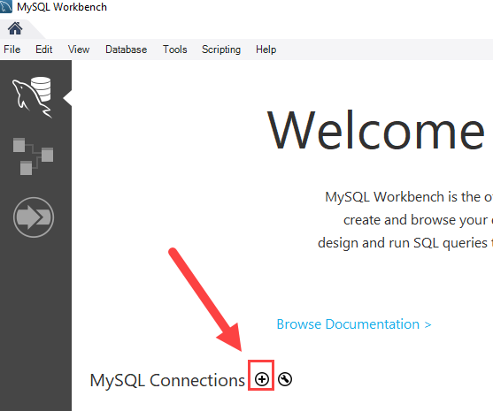

Nhập tên kết nối và các thông tin cần thiết.

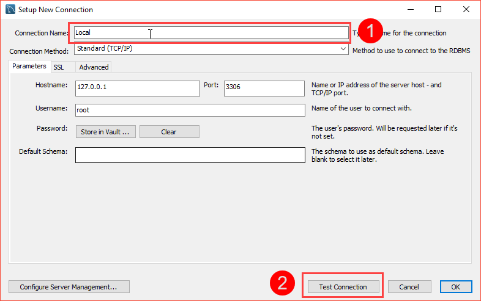

Khi kết nối đến server, MySQL Workbench có thể yêu cầu nhập mật khẩu.

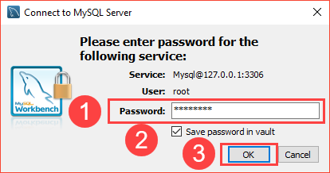

Sau khi kết nối được tạo, kết nối mới sẽ xuất hiện trên màn hình chính.

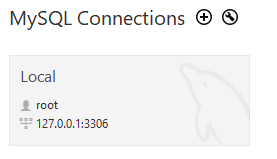

### Bước 2: Mở cửa sổ làm việc

Nhấn vào kết nối để mở giao diện làm việc với MySQL Server.

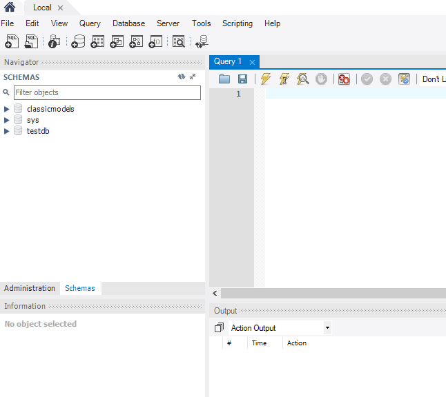

### Bước 3: Tạo schema mới

Trong MySQL Workbench, database thường được hiển thị dưới tên schema. Để tạo database mới, chọn chức năng tạo schema mới.

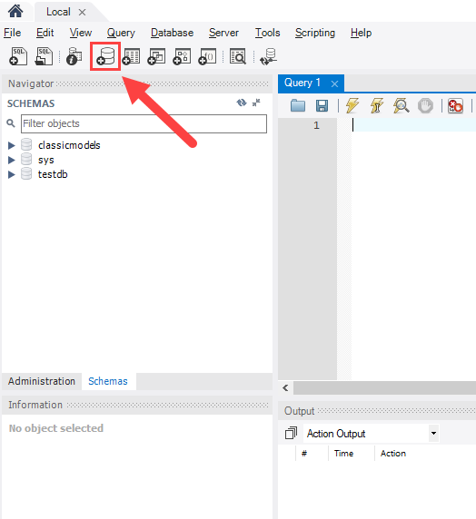

Nhập tên schema cần tạo, ví dụ `testdb`.

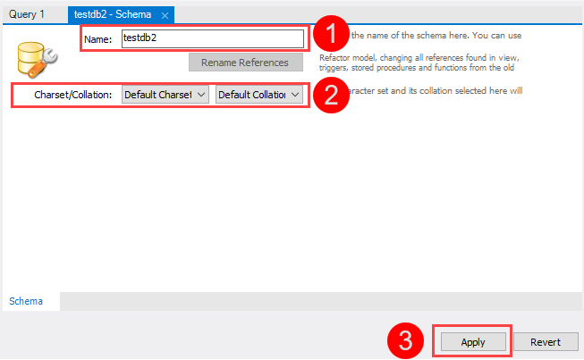

### Bước 4: Xem lại SQL script

MySQL Workbench sẽ sinh ra câu lệnh SQL tương ứng. Người học nên đọc lại script trước khi thực thi.

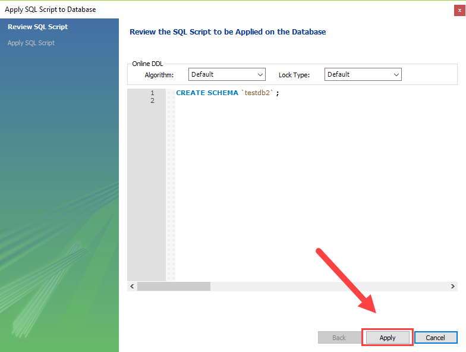

Ví dụ script có thể tương tự:

```sql
CREATE SCHEMA `testdb`;
```

Trong MySQL, `CREATE SCHEMA` có ý nghĩa tương đương `CREATE DATABASE`.

### Bước 5: Hoàn tất tạo database

Sau khi áp dụng script, database mới sẽ xuất hiện trong danh sách schema.

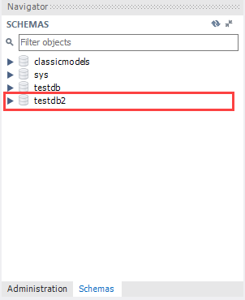

Có thể đặt schema vừa tạo làm schema mặc định để các câu lệnh SQL chạy trên database đó.

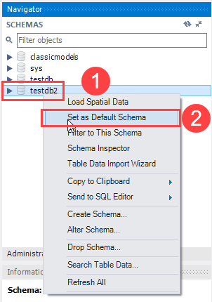

Khi schema đã được đặt làm mặc định, MySQL Workbench sẽ hiển thị trạng thái tương ứng.

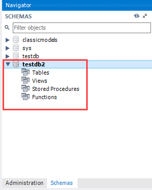

---

## 11. So sánh `CREATE DATABASE`, `CREATE SCHEMA` và `USE`

| Câu lệnh | Mục đích | Ví dụ |
|---|---|---|
| `CREATE DATABASE` | Tạo database mới | `CREATE DATABASE testdb;` |
| `CREATE SCHEMA` | Tạo schema mới, tương đương tạo database trong MySQL | `CREATE SCHEMA testdb;` |
| `USE` | Chọn database hiện tại để làm việc | `USE testdb;` |

Trong MySQL, `CREATE DATABASE` và `CREATE SCHEMA` gần như tương đương nhau. Tuy nhiên, khi học SQL cơ bản, `CREATE DATABASE` là cách viết dễ hiểu và phổ biến hơn.

---

## 12. Một số lỗi thường gặp

| Lỗi | Nguyên nhân có thể | Cách xử lý |
|---|---|---|
| `ERROR 1007: database exists` | Database đã tồn tại | Dùng tên khác hoặc dùng `CREATE DATABASE IF NOT EXISTS` |
| `ERROR 1044: Access denied` | User không có quyền tạo database | Kiểm tra quyền hoặc dùng user có quyền phù hợp |
| Sai tên database | Gõ sai tên hoặc dùng ký tự không phù hợp | Đặt tên ngắn gọn, không dùng khoảng trắng |
| Không thấy database mới | Chưa refresh trong Workbench hoặc tạo trên server khác | Refresh schema hoặc kiểm tra lại kết nối |

---

## 13. Ví dụ thực hành hoàn chỉnh

Yêu cầu: tạo database `school`, chọn database đó và kiểm tra database hiện tại.

```sql
CREATE DATABASE IF NOT EXISTS school
CHARACTER SET utf8mb4
COLLATE utf8mb4_unicode_ci;

SHOW DATABASES;

USE school;

SELECT DATABASE();
```

Kết quả mong muốn:

- Database `school` xuất hiện trong danh sách database.
- Lệnh `USE school;` chạy thành công.
- `SELECT DATABASE();` trả về `school`.

---

## 14. Bài tập thực hành

### Bài tập 1

Viết câu lệnh tạo database tên `library`.

### Bài tập 2

Viết câu lệnh tạo database tên `student_management` nếu database này chưa tồn tại.

### Bài tập 3

Viết câu lệnh xem danh sách database trên MySQL Server.

### Bài tập 4

Viết câu lệnh chọn database `library` làm database hiện tại.

### Bài tập 5

Giả sử chạy lệnh sau và gặp lỗi database đã tồn tại:

```sql
CREATE DATABASE library;
```

Hãy giải thích nguyên nhân và đưa ra cách sửa.

---

## 15. Đáp án gợi ý

<details>
<summary>Bấm để xem đáp án</summary>

### Đáp án bài tập 1

```sql
CREATE DATABASE library;
```

### Đáp án bài tập 2

```sql
CREATE DATABASE IF NOT EXISTS student_management;
```

### Đáp án bài tập 3

```sql
SHOW DATABASES;
```

### Đáp án bài tập 4

```sql
USE library;
```

### Đáp án bài tập 5

Nguyên nhân: database `library` đã tồn tại trên MySQL Server.

Cách sửa:

```sql
CREATE DATABASE IF NOT EXISTS library;
```

Hoặc chọn một tên database khác:

```sql
CREATE DATABASE library_demo;
```

</details>

---

## 16. Tổng kết

`CREATE DATABASE` là câu lệnh dùng để tạo database mới trong MySQL. Sau khi tạo database, người học nên kiểm tra bằng `SHOW DATABASES` và chọn database bằng `USE` trước khi tạo bảng hoặc thao tác dữ liệu.

Các câu lệnh cần nhớ:

```sql
CREATE DATABASE database_name;
```

```sql
CREATE DATABASE IF NOT EXISTS database_name;
```

```sql
SHOW DATABASES;
```

```sql
USE database_name;
```

Hiểu đúng quy trình tạo database giúp người học chuẩn bị nền tảng trước khi xây dựng bảng, quan hệ và truy vấn dữ liệu trong MySQL.
