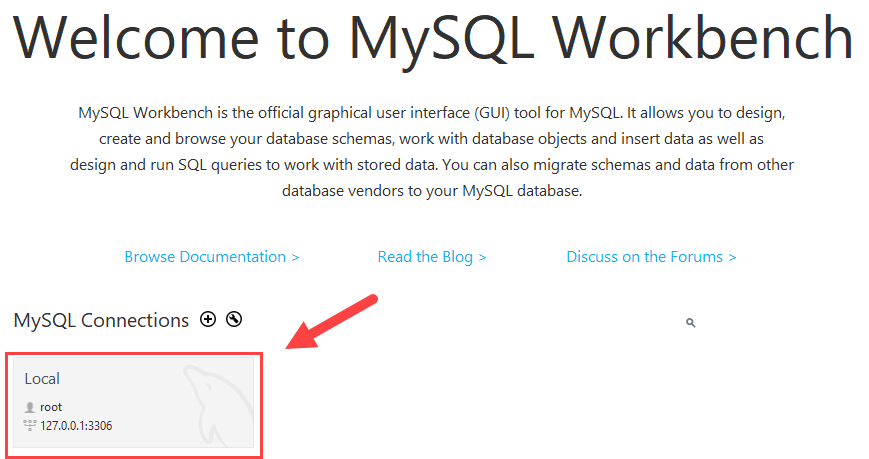
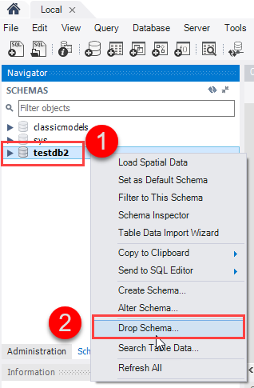
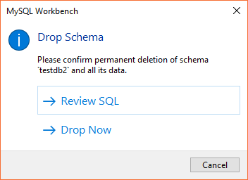
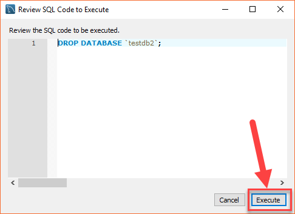
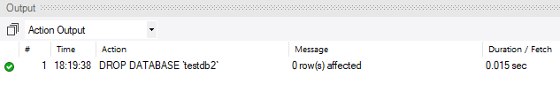
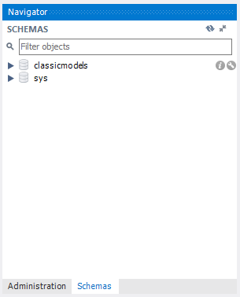

# Bài giảng: Xóa cơ sở dữ liệu trong MySQL bằng `DROP DATABASE`

## 1. Tóm tắt bài học

Trong bài học này, người học tìm hiểu cách xóa một cơ sở dữ liệu trong MySQL bằng câu lệnh `DROP DATABASE` và bằng MySQL Workbench.

`DROP DATABASE` là câu lệnh có tác động lớn vì nó xóa toàn bộ database cùng với các đối tượng bên trong như bảng, view, stored procedure, function và dữ liệu liên quan. Vì vậy, trước khi dùng lệnh này, cần kiểm tra kỹ tên database và sao lưu dữ liệu nếu cần.

Các nội dung chính:

- Hiểu mục đích và mức độ nguy hiểm của `DROP DATABASE`.
- Xóa database bằng dòng lệnh MySQL.
- Sử dụng `IF EXISTS` để tránh lỗi khi database không tồn tại.
- Kiểm tra danh sách database sau khi xóa.
- Xóa database bằng MySQL Workbench.
- Nhận biết các lỗi thường gặp và cách xử lý.

---

## 2. Mục tiêu học tập

Sau khi hoàn thành bài học này, người học có thể:

1. Giải thích được chức năng của câu lệnh `DROP DATABASE`.
2. Viết đúng cú pháp xóa database trong MySQL.
3. Sử dụng `DROP DATABASE IF EXISTS` trong tình huống phù hợp.
4. Kiểm tra database hiện có bằng `SHOW DATABASES`.
5. Phân biệt được `DROP DATABASE`, `CREATE DATABASE` và `USE`.
6. Xóa database bằng MySQL Workbench.
7. Hiểu rủi ro mất dữ liệu khi xóa database.
8. Xử lý được một số lỗi cơ bản khi xóa database.

---

## 3. Câu lệnh `DROP DATABASE` là gì?

Trong MySQL, `DROP DATABASE` dùng để xóa một database khỏi MySQL Server.

Cú pháp cơ bản:

```sql
DROP DATABASE database_name;
```

Ví dụ:

```sql
DROP DATABASE testdb;
```

Câu lệnh trên xóa database có tên `testdb`.

Khi xóa database, MySQL xóa toàn bộ các đối tượng thuộc database đó, bao gồm:

- Bảng.
- Dữ liệu trong bảng.
- View.
- Stored procedure.
- Function.
- Trigger.
- Các đối tượng khác thuộc database.

---

## 4. Lưu ý quan trọng trước khi xóa database

`DROP DATABASE` là thao tác không nên dùng tùy tiện. Trong môi trường thực tế, cần kiểm tra cẩn thận trước khi thực hiện.

Các điểm cần nhớ:

1. Database bị xóa sẽ không còn xuất hiện trong danh sách database.
2. Dữ liệu bên trong database cũng bị xóa.
3. Nếu chưa có bản sao lưu, việc khôi phục có thể khó hoặc không thể thực hiện.
4. Cần chắc chắn đang kết nối đúng MySQL Server.
5. Cần chắc chắn tên database cần xóa là chính xác.
6. User hiện tại phải có quyền xóa database.

Trước khi xóa database, nên kiểm tra danh sách database:

```sql
SHOW DATABASES;
```

---

## 5. Xóa database bằng dòng lệnh MySQL

Đăng nhập vào MySQL:

```bash
mysql -u root -p
```

Sau đó kiểm tra danh sách database:

```sql
SHOW DATABASES;
```

Giả sử có database `testdb`, có thể xóa bằng:

```sql
DROP DATABASE testdb;
```

Nếu xóa thành công, MySQL có thể hiển thị:

```text
Query OK, 0 rows affected
```

Sau đó kiểm tra lại:

```sql
SHOW DATABASES;
```

Nếu `testdb` không còn trong danh sách, database đã được xóa.

---

## 6. Xóa database nếu tồn tại

Nếu xóa một database không tồn tại, MySQL có thể báo lỗi:

```text
ERROR 1008 (HY000): Can't drop database 'testdb'; database doesn't exist
```

Để tránh lỗi này, có thể dùng:

```sql
DROP DATABASE IF EXISTS testdb;
```

Câu lệnh này có ý nghĩa:

- Nếu `testdb` tồn tại, MySQL sẽ xóa database đó.
- Nếu `testdb` không tồn tại, MySQL không báo lỗi nghiêm trọng.

Trong script triển khai hoặc bài thực hành, `IF EXISTS` giúp câu lệnh an toàn hơn khi không chắc database có tồn tại hay không.

---

## 7. Không thể xóa database đang dùng?

Trong MySQL, có thể xóa một database ngay cả khi database đó đang được chọn trong phiên làm việc hiện tại. Tuy nhiên, sau khi xóa, database hiện tại không còn hợp lệ.

Ví dụ:

```sql
USE testdb;
DROP DATABASE testdb;
SELECT DATABASE();
```

Tùy phiên bản và ngữ cảnh, MySQL có thể trả về `NULL` hoặc báo lỗi khi tiếp tục thao tác với database đã bị xóa.

Vì vậy, sau khi xóa database, nên kiểm tra lại:

```sql
SELECT DATABASE();
SHOW DATABASES;
```

---

## 8. Xóa database bằng MySQL Workbench

Ngoài dòng lệnh, có thể xóa database bằng giao diện MySQL Workbench. Trong Workbench, database thường được hiển thị dưới tên schema.

### Bước 1: Mở MySQL Workbench và chọn server

Kết nối đến MySQL Server cần thao tác. Trong danh sách schema bên trái, xác định database muốn xóa.



### Bước 2: Chọn chức năng Drop Schema

Nhấn chuột phải vào schema cần xóa, sau đó chọn chức năng xóa schema.



### Bước 3: Xác nhận thao tác xóa

MySQL Workbench sẽ yêu cầu xác nhận vì thao tác này có thể làm mất toàn bộ dữ liệu trong database.



### Bước 4: Xem lại SQL script

Workbench hiển thị câu lệnh SQL sẽ được thực thi. Người học nên kiểm tra lại tên database trước khi áp dụng.



Ví dụ script:

```sql
DROP SCHEMA `testdb`;
```

Trong MySQL, `DROP SCHEMA` có ý nghĩa tương đương `DROP DATABASE`.

### Bước 5: Kiểm tra kết quả

Sau khi thực thi, Workbench hiển thị kết quả thao tác.



Database đã xóa sẽ không còn xuất hiện trong danh sách schema.



---

## 9. So sánh các câu lệnh liên quan

| Câu lệnh | Mục đích | Ví dụ |
|---|---|---|
| `CREATE DATABASE` | Tạo database mới | `CREATE DATABASE testdb;` |
| `DROP DATABASE` | Xóa database | `DROP DATABASE testdb;` |
| `USE` | Chọn database hiện tại | `USE testdb;` |
| `SHOW DATABASES` | Liệt kê database hiện có | `SHOW DATABASES;` |

`CREATE DATABASE` và `DROP DATABASE` là hai thao tác ngược nhau. `USE` không tạo hoặc xóa database, mà chỉ chọn database để làm việc.

---

## 10. Một số lỗi thường gặp

| Lỗi | Nguyên nhân có thể | Cách xử lý |
|---|---|---|
| `ERROR 1008: database doesn't exist` | Database cần xóa không tồn tại | Dùng `SHOW DATABASES;` để kiểm tra hoặc dùng `DROP DATABASE IF EXISTS` |
| `ERROR 1044: Access denied` | User không có quyền xóa database | Dùng user có quyền phù hợp hoặc cấp quyền cần thiết |
| Xóa nhầm database | Không kiểm tra kỹ tên database | Khôi phục từ backup nếu có |
| Không thấy thay đổi trong Workbench | Chưa refresh danh sách schema | Refresh lại schema list |

---

## 11. Ví dụ thực hành hoàn chỉnh

Yêu cầu: tạo database thử nghiệm, kiểm tra, sau đó xóa database đó.

```sql
CREATE DATABASE IF NOT EXISTS demo_drop;

SHOW DATABASES;

DROP DATABASE IF EXISTS demo_drop;

SHOW DATABASES;
```

Khi thực hành, nên dùng database thử nghiệm như `demo_drop` thay vì database đang chứa dữ liệu thật.

---

## 12. Quy trình an toàn khi xóa database

Trước khi xóa database trong môi trường thật, nên thực hiện theo quy trình:

1. Kiểm tra đang kết nối đúng server.
2. Kiểm tra tên database bằng `SHOW DATABASES`.
3. Xác nhận database có thể xóa.
4. Sao lưu dữ liệu nếu database có dữ liệu quan trọng.
5. Chạy lệnh `DROP DATABASE`.
6. Kiểm tra lại danh sách database sau khi xóa.

Ví dụ sao lưu bằng `mysqldump`:

```bash
mysqldump -u root -p testdb > testdb_backup.sql
```

Sau khi đã có backup, mới cân nhắc xóa:

```sql
DROP DATABASE testdb;
```

---

## 13. Bài tập thực hành

### Bài tập 1

Viết câu lệnh xóa database tên `library`.

### Bài tập 2

Viết câu lệnh xóa database `student_management` nếu database này tồn tại.

### Bài tập 3

Viết câu lệnh kiểm tra danh sách database trước và sau khi xóa.

### Bài tập 4

Giả sử chạy lệnh sau và gặp lỗi:

```sql
DROP DATABASE library;
```

Lỗi:

```text
ERROR 1008 (HY000): Can't drop database 'library'; database doesn't exist
```

Hãy giải thích nguyên nhân và cách sửa.

### Bài tập 5

Vì sao cần sao lưu dữ liệu trước khi dùng `DROP DATABASE` trong môi trường thật?

---

## 14. Đáp án gợi ý

<details>
<summary>Bấm để xem đáp án</summary>

### Đáp án bài tập 1

```sql
DROP DATABASE library;
```

### Đáp án bài tập 2

```sql
DROP DATABASE IF EXISTS student_management;
```

### Đáp án bài tập 3

```sql
SHOW DATABASES;
DROP DATABASE IF EXISTS library;
SHOW DATABASES;
```

### Đáp án bài tập 4

Nguyên nhân: database `library` không tồn tại nên MySQL không thể xóa.

Cách sửa:

```sql
DROP DATABASE IF EXISTS library;
```

Hoặc kiểm tra tên database trước:

```sql
SHOW DATABASES;
```

### Đáp án bài tập 5

Vì `DROP DATABASE` xóa toàn bộ database và dữ liệu bên trong. Nếu xóa nhầm hoặc cần khôi phục dữ liệu, bản backup là cách quan trọng để phục hồi.

</details>

---

## 15. Tổng kết

`DROP DATABASE` là câu lệnh dùng để xóa database khỏi MySQL Server. Đây là thao tác có rủi ro cao vì toàn bộ dữ liệu trong database có thể bị mất.

Các câu lệnh cần nhớ:

```sql
DROP DATABASE database_name;
```

```sql
DROP DATABASE IF EXISTS database_name;
```

```sql
SHOW DATABASES;
```

Trong thực tế, luôn kiểm tra kỹ tên database, quyền truy cập, server đang kết nối và bản sao lưu trước khi thực hiện `DROP DATABASE`.
