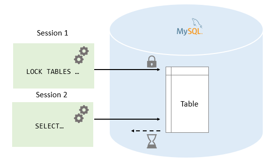
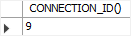
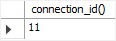
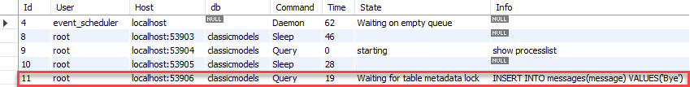
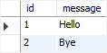
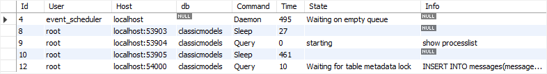
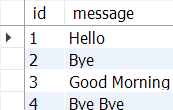

# Tutorial: MySQL Table Locking, InnoDB Locks và Lock Diagnosis

## Link tham khảo

### MySQL Tutorial

- [MySQL Table Locking](https://www.mysqltutorial.org/mysql-basics/mysql-table-locking/)

### MySQL Reference Manual

- [LOCK TABLES and UNLOCK TABLES Statements](https://dev.mysql.com/doc/refman/8.4/en/lock-tables.html)
- [InnoDB Locking Reads](https://dev.mysql.com/doc/refman/8.4/en/innodb-locking-reads.html)
- [Locks Set by Different SQL Statements in InnoDB](https://dev.mysql.com/doc/refman/8.4/en/innodb-locks-set.html)
- [Transaction Isolation Levels](https://dev.mysql.com/doc/refman/8.4/en/innodb-transaction-isolation-levels.html)
- [Deadlocks in InnoDB](https://dev.mysql.com/doc/refman/8.4/en/innodb-deadlocks.html)
- [Metadata Locking](https://dev.mysql.com/doc/refman/8.4/en/metadata-locking.html)
- [Performance Schema Lock Tables](https://dev.mysql.com/doc/refman/8.4/en/performance-schema-lock-tables.html)
- [sys.schema_table_lock_waits View](https://dev.mysql.com/doc/refman/8.4/en/sys-schema-table-lock-waits.html)
- [SHOW PROCESSLIST Statement](https://dev.mysql.com/doc/refman/8.4/en/show-processlist.html)

> **Phạm vi lab:** Toàn bộ thao tác sử dụng schema `table_locking_lab`. Bài có các câu lệnh cố ý làm session khác chờ. Không chạy các thí nghiệm khóa trên production, database dùng chung, hoặc khi bạn không kiểm soát được session đang kết nối. Luôn kết thúc thí nghiệm bằng `COMMIT`, `ROLLBACK` hoặc `UNLOCK TABLES` theo đúng phần hướng dẫn.

---

## 1. Mục tiêu học tập

Sau khi hoàn thành tutorial này, người học có thể:

1. Giải thích vì sao DBMS cần locks khi nhiều sessions cùng truy cập dữ liệu.
2. Phân biệt explicit table locks, InnoDB row locks và metadata locks.
3. Dùng `LOCK TABLES ... READ`, `LOCK TABLES ... WRITE` và `UNLOCK TABLES`.
4. Mô tả chính xác hành vi của READ lock và WRITE lock giữa hai sessions.
5. Nhận biết các restriction của explicit table locks: session scope, list tables, aliases, transaction interaction.
6. Dùng `SHOW PROCESSLIST` để quan sát session đang chờ.
7. Dùng transaction và `SELECT ... FOR UPDATE` thay cho table-level lock khi cần bảo vệ một tập rows InnoDB nhỏ.
8. Dùng `SELECT ... FOR SHARE`, `NOWAIT` và `SKIP LOCKED` ở mức khái niệm.
9. Giải thích lock wait, metadata lock wait và deadlock khác nhau như thế nào.
10. Đọc thông tin lock từ Performance Schema hoặc sys schema khi account có quyền phù hợp.
11. Thiết kế transaction ngắn, thứ tự lock nhất quán và indexes phù hợp để giảm contention/deadlock.
12. Viết test script hai session có cleanup rõ ràng.

---

## 2. Tại sao cần locking?

Khi chỉ có một session làm việc, các thao tác đọc và ghi có vẻ đơn giản:

```sql
SELECT balance
FROM accounts
WHERE account_id = 1;

UPDATE accounts
SET balance = balance - 100
WHERE account_id = 1;
```

Nhưng nếu hai sessions thực hiện gần như cùng lúc, có thể xuất hiện các rủi ro:

```text
- Lost update: hai người cùng đọc cùng một value rồi ghi đè lẫn nhau.
- Inconsistent read: một query nhiều bước thấy dữ liệu thay đổi giữa các bước.
- Double booking: hai người cùng nhìn thấy “còn 1 chỗ” và cùng đăng ký.
- Invalid state: một row bị xóa/cập nhật trong khi session khác đang dựa vào row đó.
- DDL blocking: ALTER TABLE phải chờ transaction đã dùng table kết thúc.
```

Lock là một cơ chế để database phối hợp truy cập concurrent. Lock không tự làm application “đúng” nếu transaction design, isolation level, index hoặc business logic không phù hợp. Nó chỉ là một phần trong cơ chế bảo đảm consistency.

### 2.1. Ba lớp lock quan trọng trong tutorial này

| Loại | Ví dụ | Phạm vi chính | Khi nào thường gặp |
|---|---|---|---|
| Explicit table lock | `LOCK TABLES messages READ` | Cả table, current session | Legacy workflows, phối hợp table access, demo |
| InnoDB data/row lock | `UPDATE ... WHERE ...`, `SELECT ... FOR UPDATE` | Rows/index records mà statement chạm tới | Transactional applications |
| Metadata lock (MDL) | DML/DDL tự acquire | Metadata object: table, schema, routine... | DDL bị chờ vì transaction chưa kết thúc |

### 2.2. Table lock không đồng nghĩa row lock

Ví dụ:

```sql
LOCK TABLES messages WRITE;
```

khóa table ở mức explicit MySQL table lock: session khác không thể đọc hoặc ghi table đó cho đến khi unlock.

Ngược lại:

```sql
START TRANSACTION;

SELECT *
FROM accounts
WHERE account_id = 1
FOR UPDATE;
```

với InnoDB thường bảo vệ row/index records phù hợp với predicate, không khóa toàn bộ table theo nghĩa explicit `LOCK TABLES WRITE`.

### 2.3. Table lock không phải lựa chọn mặc định cho InnoDB OLTP

Trong InnoDB, transaction ngắn và row-level locking thường cho concurrency tốt hơn explicit table locks.

Đối với ứng dụng hiện đại, ưu tiên:

```text
- PRIMARY KEY / suitable index
- Transaction ngắn
- UPDATE có predicate chính xác
- SELECT ... FOR UPDATE khi cần read-modify-write
- Constraint/FK/UNIQUE/CHECK khi rule có thể enforce declaratively
- Retry logic khi gặp deadlock
```

Explicit `LOCK TABLES` vẫn cần học vì:

- Có trong MySQL syntax và legacy systems.
- Một số workflows/admin tasks dùng table-level coordination.
- Giúp hiểu blocked sessions và compatibility.
- Là nền tảng để phân biệt với InnoDB locking reads và metadata locks.



*Source: [MySQL Table Locking](https://www.mysqltutorial.org/mysql-basics/mysql-table-locking/).*

### Bài tập thực hành

**Bài 2.1.** Nêu một tình huống có thể xảy ra lost update.

**Bài 2.2.** Nêu một tình huống có thể xảy ra double booking.

**Bài 2.3.** Phân biệt explicit table lock và InnoDB row lock bằng một câu cho mỗi loại.

**Bài 2.4.** Metadata lock bảo vệ loại tài nguyên nào?

**Bài 2.5.** Nêu hai lý do table locking không nên là default technique cho InnoDB application.

---

## 3. Chuẩn bị lab hai session

### 3.1. Mở hai connections

Mở hai MySQL Workbench SQL tabs độc lập, hoặc hai terminal clients.

Gọi chúng là:

```text
Session A
Session B
```

> Không dùng hai tab mà Workbench thực tế chia sẻ cùng connection. Mỗi session phải có `CONNECTION_ID()` khác nhau.

Trong cả hai sessions:

```sql
SELECT CONNECTION_ID() AS connection_id,
       CURRENT_USER() AS privilege_account,
       USER() AS login_account;
```

Ghi lại ID của Session A và Session B.

### 3.2. Tạo schema lab

Chỉ chạy script này ở **Session A**.

```sql
DROP DATABASE IF EXISTS table_locking_lab;

CREATE DATABASE table_locking_lab
    CHARACTER SET utf8mb4
    COLLATE utf8mb4_0900_ai_ci;

USE table_locking_lab;
```

Tạo table `messages` để thực hành explicit table locks:

```sql
CREATE TABLE messages (
    message_id BIGINT UNSIGNED NOT NULL AUTO_INCREMENT,
    message_text VARCHAR(200) NOT NULL,
    created_at DATETIME NOT NULL DEFAULT CURRENT_TIMESTAMP,
    PRIMARY KEY (message_id)
) ENGINE = InnoDB;
```

Tạo `lock_log`:

```sql
CREATE TABLE lock_log (
    log_id BIGINT UNSIGNED NOT NULL AUTO_INCREMENT,
    session_label VARCHAR(20) NOT NULL,
    event_name VARCHAR(100) NOT NULL,
    logged_at DATETIME NOT NULL DEFAULT CURRENT_TIMESTAMP,
    note VARCHAR(255) NULL,
    PRIMARY KEY (log_id)
) ENGINE = InnoDB;
```

Tạo `accounts` để thực hành row locks:

```sql
CREATE TABLE accounts (
    account_id BIGINT UNSIGNED NOT NULL,
    account_name VARCHAR(100) NOT NULL,
    balance DECIMAL(12,2) NOT NULL,
    PRIMARY KEY (account_id),
    CONSTRAINT ck_accounts_balance
        CHECK (balance >= 0)
) ENGINE = InnoDB;
```

Tạo `work_queue` để minh họa `SKIP LOCKED`:

```sql
CREATE TABLE work_queue (
    task_id BIGINT UNSIGNED NOT NULL AUTO_INCREMENT,
    task_name VARCHAR(150) NOT NULL,
    task_status ENUM('READY', 'PROCESSING', 'DONE')
        NOT NULL DEFAULT 'READY',
    created_at DATETIME NOT NULL DEFAULT CURRENT_TIMESTAMP,
    PRIMARY KEY (task_id),
    INDEX idx_work_queue_status_task (task_status, task_id)
) ENGINE = InnoDB;
```

Nạp dữ liệu mẫu:

```sql
INSERT INTO messages (message_text)
VALUES
    ('Hello'),
    ('Initial message');
```

```sql
INSERT INTO accounts (
    account_id,
    account_name,
    balance
)
VALUES
    (1, 'Operating Account', 1000.00),
    (2, 'Savings Account', 500.00);
```

```sql
INSERT INTO work_queue (task_name)
VALUES
    ('Generate daily report'),
    ('Send notification batch'),
    ('Refresh dashboard cache');
```

### 3.3. Chọn schema trong cả hai sessions

Trong **Session A**:

```sql
USE table_locking_lab;
```

Trong **Session B**:

```sql
USE table_locking_lab;
```

Kiểm tra:

```sql
SELECT DATABASE() AS current_database;
```

### 3.4. Kiểm tra engine

```sql
SHOW TABLE STATUS
WHERE Name IN ('messages', 'lock_log', 'accounts', 'work_queue');
```

Các tables trong lab nên hiển thị engine:

```text
InnoDB
```

### 3.5. Quy tắc an toàn trong lab

1. Chỉ để Session B chạy query “blocked” sau khi Session A đã giữ lock.
2. Khi Session B đang chờ, không đóng Workbench/terminal vội; quan sát `SHOW PROCESSLIST`.
3. Luôn trở lại Session A và release lock đúng cách.
4. Nếu lỡ mở transaction, kết thúc bằng `COMMIT` hoặc `ROLLBACK`.
5. Không dùng `KILL` session trong bài cơ bản trừ khi giảng viên yêu cầu.
6. Không chạy lock test trên database chung.





*Source: [MySQL Table Locking](https://www.mysqltutorial.org/mysql-basics/mysql-table-locking/).*

### Bài tập thực hành

**Bài 3.1.** Mở hai sessions và ghi hai `CONNECTION_ID()` khác nhau.

**Bài 3.2.** Tạo schema và bốn tables lab.

**Bài 3.3.** Insert dữ liệu mẫu.

**Bài 3.4.** Dùng `SHOW TABLE STATUS` kiểm tra engine.

**Bài 3.5.** Giải thích vì sao không thể thực hành table locking đúng chỉ với một session.

---

# Phần A. Explicit table locks

## 4. LOCK TABLES và UNLOCK TABLES

### 4.1. Cú pháp

```sql
LOCK TABLES
    table_name [AS alias] READ | WRITE,
    ...;
```

Ví dụ:

```sql
LOCK TABLES messages READ;
```

```sql
LOCK TABLES messages WRITE;
```

Khóa nhiều tables:

```sql
LOCK TABLES
    messages READ,
    lock_log WRITE;
```

Release locks của current session:

```sql
UNLOCK TABLES;
```

`LOCK TABLE` là synonym của `LOCK TABLES`; `UNLOCK TABLE` là synonym của `UNLOCK TABLES`.

### 4.2. Quyền cần thiết

Để explicit lock một table/view, account thường cần:

```text
LOCK TABLES privilege
SELECT privilege trên object cần lock
```

Kiểm tra quyền của current account:

```sql
SHOW GRANTS;
```

Nếu thiếu quyền, không cố cấp global privileges trên shared server. Dùng local server hoặc liên hệ giảng viên/DBA.

### 4.3. Scope của table lock

`LOCK TABLES`:

- Chỉ áp dụng cho **current client session**.
- Session A không thể `UNLOCK` locks Session B đang giữ.
- `UNLOCK TABLES` chỉ release locks của chính session gọi lệnh.
- Disconnect session sẽ release table locks.
- `LOCK TABLES` mới release locks cũ của chính session trước khi cố acquire locks mới.

### 4.4. Tạm dừng trước khi sang READ/WRITE

Đảm bảo cả hai sessions không đang giữ explicit table lock:

```sql
UNLOCK TABLES;
```

Lệnh này có thể báo/không làm gì nếu session không có table lock. Trong lab, chạy nó đầu mỗi experiment để cleanup state.

### Bài tập thực hành

**Bài 4.1.** Viết syntax lock một table READ.

**Bài 4.2.** Viết syntax lock hai tables với `messages READ` và `lock_log WRITE`.

**Bài 4.3.** Chạy `SHOW GRANTS;` và xác định account có `LOCK TABLES` hay không.

**Bài 4.4.** Session A lock `messages`; Session B chạy `UNLOCK TABLES`. Kết quả kỳ vọng là gì?

**Bài 4.5.** Nêu hai điều kiện có thể làm table locks được release implicit.

---

## 5. READ lock

### 5.1. Hành vi của READ lock

Khi Session A giữ:

```sql
LOCK TABLES messages READ;
```

hành vi khái quát:

| Hoạt động | Session A - holder | Session B/C - other sessions |
|---|---:|---:|
| `SELECT` từ `messages` | Được | Được |
| `INSERT` / `UPDATE` / `DELETE` trên `messages` | Không được | Bị chờ đến khi lock release |
| Acquire thêm `READ` lock | Có thể | Có thể |
| Acquire `WRITE` lock | Không tương thích | Bị chờ |

Điểm cần nhớ:

- READ lock là shared lock ở mức table.
- Holder có thể đọc nhưng không được ghi table đã READ lock.
- Other sessions vẫn có thể đọc data.
- DML của other sessions chờ lock được release.

### 5.2. Thí nghiệm READ lock - Session A

Trong **Session A**:

```sql
USE table_locking_lab;

UNLOCK TABLES;

LOCK TABLES messages READ;
```

Xác nhận holder có thể đọc:

```sql
SELECT *
FROM messages
ORDER BY message_id;
```

Thử write từ holder:

```sql
INSERT INTO messages (message_text)
VALUES ('Attempt from Session A');
```

Kỳ vọng: statement bị từ chối vì `messages` đang bị Session A lock với READ mode.

### 5.3. Thí nghiệm READ lock - Session B

Trong **Session B**:

```sql
USE table_locking_lab;

SELECT *
FROM messages
ORDER BY message_id;
```

Kỳ vọng: query đọc hoàn thành.

Sau đó chạy DML:

```sql
INSERT INTO messages (message_text)
VALUES ('Inserted by Session B while A holds READ lock');
```

Kỳ vọng: Session B chờ trong khi Session A vẫn giữ READ lock.

Không đóng Session B; để query chờ trong vài giây để quan sát.

### 5.4. Quan sát waiting session từ Session A

Trong **Session A**, chạy:

```sql
SHOW PROCESSLIST;
```

Tìm connection ID của Session B. `State`/`Info` có thể cho thấy query đang chờ lock hoặc statement đang thực thi. Output tùy version, privilege và client.

Nếu account có quyền phù hợp, thử:

```sql
SELECT ID,
       USER,
       HOST,
       DB,
       COMMAND,
       TIME,
       STATE,
       INFO
FROM INFORMATION_SCHEMA.PROCESSLIST
WHERE DB = 'table_locking_lab';
```

### 5.5. Release READ lock

Trong **Session A**:

```sql
UNLOCK TABLES;
```

Kỳ vọng: INSERT đã chờ ở Session B được tiếp tục thực hiện.

Trong **Session B**:

```sql
SELECT *
FROM messages
ORDER BY message_id;
```

Kỳ vọng: nhìn thấy row mới.

### 5.6. Cleanup

Trong cả hai sessions:

```sql
UNLOCK TABLES;
```






*Source: [MySQL Table Locking](https://www.mysqltutorial.org/mysql-basics/mysql-table-locking/).*

### Bài tập thực hành

**Bài 5.1.** Session A acquire `messages READ`.

**Bài 5.2.** Thử INSERT từ Session A và ghi error nhận được.

**Bài 5.3.** Session B chạy SELECT và ghi kết quả.

**Bài 5.4.** Session B chạy INSERT, quan sát trạng thái chờ bằng SHOW PROCESSLIST.

**Bài 5.5.** Release lock từ Session A rồi xác minh INSERT Session B hoàn thành.

---

## 6. WRITE lock

### 6.1. Hành vi của WRITE lock

Khi Session A giữ:

```sql
LOCK TABLES messages WRITE;
```

hành vi khái quát:

| Hoạt động | Session A - holder | Session B/C - other sessions |
|---|---:|---:|
| `SELECT` từ `messages` | Được | Bị chờ |
| `INSERT` / `UPDATE` / `DELETE` trên `messages` | Được | Bị chờ |
| Acquire `READ` lock | Không tương thích | Bị chờ |
| Acquire `WRITE` lock | Không tương thích | Bị chờ |

WRITE lock là exclusive table lock đối với table đó.

### 6.2. Thí nghiệm WRITE lock - Session A

Trong **Session A**:

```sql
USE table_locking_lab;

UNLOCK TABLES;

LOCK TABLES messages WRITE;
```

Write từ holder:

```sql
INSERT INTO messages (message_text)
VALUES ('Written by Session A while holding WRITE lock');
```

Read từ holder:

```sql
SELECT *
FROM messages
ORDER BY message_id;
```

Cả hai phải hoàn thành.

### 6.3. Thí nghiệm WRITE lock - Session B

Trong **Session B**, trước hết thử read:

```sql
SELECT *
FROM messages
ORDER BY message_id;
```

Kỳ vọng: Session B chờ.

Mở một query/tool session khác nếu cần, hoặc sau khi cancel query read (chỉ trong lab), thử write:

```sql
INSERT INTO messages (message_text)
VALUES ('Attempt by Session B during WRITE lock');
```

Kỳ vọng: cũng chờ.

Không cần chạy cả SELECT và INSERT cùng lúc trong cùng một single-thread client session; một session chỉ gửi được statement tiếp theo khi statement hiện tại hoàn thành/cancel. Có thể dùng **Session C** nếu muốn quan sát read wait và write wait đồng thời.

### 6.4. Quan sát và release

Trong **Session A**:

```sql
SHOW PROCESSLIST;
```

Sau đó:

```sql
UNLOCK TABLES;
```

Kỳ vọng: pending operations của Session B/C được tiếp tục theo cơ chế scheduling của server.

### 6.5. WRITE lock priority

MySQL docs mô tả WRITE locks thường có ưu tiên cao hơn READ lock requests để updates được xử lý sớm. Vì vậy, khi một WRITE request đang chờ sau một READ lock, các READ lock requests đến sau có thể phải chờ WRITE lock được cấp/release.

Đây là chi tiết scheduling, không phải lý do để application tự xây cơ chế concurrency bằng table locks.






*Source: [MySQL Table Locking](https://www.mysqltutorial.org/mysql-basics/mysql-table-locking/).*

### Bài tập thực hành

**Bài 6.1.** Session A lock `messages WRITE`.

**Bài 6.2.** Session A INSERT và SELECT.

**Bài 6.3.** Session B thử SELECT và quan sát chờ.

**Bài 6.4.** Dùng Session C hoặc sau khi cancel query B, thử INSERT từ session khác.

**Bài 6.5.** Release WRITE lock rồi xác nhận các statements đang chờ được giải phóng.

---

## 7. So sánh READ và WRITE explicit table locks

| Thuộc tính | `LOCK TABLES t READ` | `LOCK TABLES t WRITE` |
|---|---|---|
| Holder đọc table | Có | Có |
| Holder ghi table | Không | Có |
| Other sessions đọc table | Có | Không, phải chờ |
| Other sessions ghi table | Không, phải chờ | Không, phải chờ |
| Nhiều READ holders | Có | Không áp dụng |
| Use case | Phối hợp read period có chủ đích | Exclusive access legacy/admin workflow |
| Rủi ro trên InnoDB OLTP | Chặn writers toàn table | Chặn toàn bộ access table |

### 7.1. READ LOCAL

Syntax có dạng:

```sql
LOCK TABLES messages READ LOCAL;
```

`READ LOCAL` liên quan concurrent inserts trong một số tình huống/storage engines. Với InnoDB, `READ LOCAL` có cùng behavior như `READ`.

Trong bài cơ bản, dùng `READ` để tránh nhầm lẫn.

### 7.2. Không suy diễn từ table lock sang isolation level

`READ`/`WRITE` ở `LOCK TABLES` không phải là các isolation levels:

```text
READ UNCOMMITTED
READ COMMITTED
REPEATABLE READ
SERIALIZABLE
```

Isolation level là thuộc tính transaction/consistent read behavior của InnoDB; explicit table locks là cơ chế khác.

### Bài tập thực hành

**Bài 7.1.** Hoàn thành bảng compatibility READ/WRITE bằng lời của bạn.

**Bài 7.2.** Giải thích vì sao READ lock vẫn chặn INSERT từ Session B.

**Bài 7.3.** Giải thích vì sao WRITE lock chặn SELECT Session B.

**Bài 7.4.** `READ LOCAL` có khác `READ` đối với InnoDB trong tài liệu MySQL không?

**Bài 7.5.** Phân biệt explicit table lock với transaction isolation level.

---

## 8. Khóa nhiều tables, aliases và restrictions

### 8.1. Lock tất cả tables cần dùng

Khi session đã chạy `LOCK TABLES`, session chỉ được access các tables đã khóa trong statement đó, trừ một số ngoại lệ metadata như `INFORMATION_SCHEMA`.

Ví dụ đúng:

```sql
LOCK TABLES
    messages READ,
    lock_log WRITE;
```

Sau đó:

```sql
INSERT INTO lock_log (
    session_label,
    event_name,
    note
)
SELECT
    'A',
    'COPY_MESSAGES',
    CONCAT('Message count = ', COUNT(*))
FROM messages;
```

Cả `messages` và `lock_log` đã được khóa nên statement có thể dùng chúng.

Ví dụ dễ lỗi:

```sql
LOCK TABLES messages READ;

SELECT COUNT(*)
FROM lock_log;
```

Kỳ vọng: error vì `lock_log` không nằm trong lock list.

### 8.2. Multiple table locks là một statement

Acquire tất cả locks cần thiết trong **một** `LOCK TABLES` statement:

```sql
LOCK TABLES
    messages READ,
    lock_log WRITE,
    accounts READ;
```

Không lock từng table từng bước theo kiểu:

```sql
LOCK TABLES messages READ;
LOCK TABLES lock_log WRITE;
```

Lệnh thứ hai release locks cũ của current session trước khi cố acquire locks mới.

### 8.3. Aliases phải khớp

Nếu query dùng alias, lock statement phải dùng đúng alias.

Ví dụ:

```sql
LOCK TABLES messages AS m READ;

SELECT *
FROM messages AS m;
```

Đúng.

Nhưng:

```sql
SELECT *
FROM messages;
```

có thể bị từ chối khi table chỉ được locked dưới alias `m`.

Trong self-join hoặc insert-select dùng cùng table nhiều lần, cần lock từng reference với alias phù hợp.

Ví dụ minh họa:

```sql
LOCK TABLES
    messages WRITE,
    messages AS m_read READ;

INSERT INTO messages (message_text)
SELECT CONCAT('Copy: ', m_read.message_text)
FROM messages AS m_read;
```

### 8.4. Triggers và foreign keys

Khi explicit lock một table:

- MySQL có thể lock các tables được trigger dùng một cách implicit.
- Tables liên quan foreign keys cũng có thể được mở/locked implicit tùy foreign-key checks hoặc cascading operations.

Không dựa vào behavior implicit để viết application workflow phức tạp. Hãy hiểu trigger/FK dependencies trước khi dùng explicit locks.

### 8.5. Temporary tables

`LOCK TABLES` được phép với temporary table nhưng bị bỏ qua về mặt lock. Điều này hợp lý vì temporary table chỉ visible trong session đã tạo nó; session khác không nhìn thấy để cạnh tranh access.

### Bài tập thực hành

**Bài 8.1.** Lock `messages READ` và `lock_log WRITE`, sau đó INSERT summary row vào lock_log từ messages.

**Bài 8.2.** Lock chỉ `messages READ`, rồi thử SELECT từ lock_log. Ghi error.

**Bài 8.3.** Giải thích vì sao chạy hai `LOCK TABLES` statements liên tiếp không cộng dồn lock list.

**Bài 8.4.** Viết example lock table `messages` bằng alias `m`.

**Bài 8.5.** Giải thích vì sao temporary table không cần explicit locking giữa sessions.

---

## 9. Release rules và transaction interaction

### 9.1. Release locks

Explicit table locks của session được release khi:

```text
- Session chạy UNLOCK TABLES.
- Session chạy LOCK TABLES mới: locks cũ release trước.
- Session bắt đầu transaction bằng START TRANSACTION: existing table locks bị release.
- Connection/session đóng hoặc bị mất.
```

Ví dụ:

```sql
UNLOCK TABLES;
```

### 9.2. LOCK TABLES không transaction-safe

`LOCK TABLES` implicit commit active transaction trước khi cố acquire locks.

`UNLOCK TABLES` cũng implicit commit active transaction **nếu** current session đã dùng `LOCK TABLES` để acquire table locks.

Do đó, không viết logic transactional kiểu:

```sql
START TRANSACTION;

UPDATE accounts
SET balance = balance - 100
WHERE account_id = 1;

LOCK TABLES accounts WRITE;

UPDATE accounts
SET balance = balance + 100
WHERE account_id = 2;

ROLLBACK;
```

Vì `LOCK TABLES` có thể commit phần thay đổi trước đó, làm phá vỡ ý nghĩa atomic transaction.

### 9.3. START TRANSACTION release table locks

Sau:

```sql
LOCK TABLES messages WRITE;
```

nếu chạy:

```sql
START TRANSACTION;
```

MySQL release existing table locks.

Không dùng `START TRANSACTION` như một cách “giữ table lock lâu hơn”.

### 9.4. ROLLBACK không release explicit table locks

`ROLLBACK` rollback transaction data changes theo engine/transaction rules, nhưng không tự release table locks đã acquire bởi `LOCK TABLES`.

Nếu bạn vẫn giữ explicit table locks, cần:

```sql
UNLOCK TABLES;
```

### 9.5. Technical note: LOCK TABLES với InnoDB transaction

Tài liệu MySQL mô tả cách sử dụng cụ thể nếu thật sự cần `LOCK TABLES` với transactional InnoDB tables:

```sql
SET autocommit = 0;

LOCK TABLES
    table_to_write WRITE,
    table_to_read READ;

-- perform work

COMMIT;

UNLOCK TABLES;
```

Tuy nhiên, đây không phải pattern nên dùng đầu tiên cho application mới. Với InnoDB, transaction bình thường và row-level locks thường phù hợp hơn. Explicit table locks dễ giảm concurrency và làm deadlocks/transaction behavior khó hiểu nếu dùng sai.

### 9.6. Cleanup safety block

Cuối mọi experiment explicit table lock:

```sql
UNLOCK TABLES;
```

Nếu experiment liên quan transaction:

```sql
ROLLBACK;
UNLOCK TABLES;
```

hoặc:

```sql
COMMIT;
UNLOCK TABLES;
```

tùy intended result.

### Bài tập thực hành

**Bài 9.1.** Lock table rồi chạy `START TRANSACTION`; kiểm tra logic release theo tài liệu.

**Bài 9.2.** Nêu vì sao LOCK TABLES có thể phá atomicity của transaction đang chạy.

**Bài 9.3.** ROLLBACK có tự release explicit table locks không?

**Bài 9.4.** Viết cleanup block cho experiment có transaction + table lock.

**Bài 9.5.** Nêu lý do transaction + row locks nên là lựa chọn ưu tiên với InnoDB application.

---

# Phần B. InnoDB row locks và locking reads

## 10. InnoDB transactions và row-level locking

### 10.1. Basic transaction pattern

```sql
START TRANSACTION;

UPDATE accounts
SET balance = balance - 100.00
WHERE account_id = 1;

UPDATE accounts
SET balance = balance + 100.00
WHERE account_id = 2;

COMMIT;
```

Với InnoDB, updates acquire locks trên relevant rows/index records cho đến khi transaction commit/rollback.

Điều này bảo vệ transaction khỏi concurrent modifications không tương thích trên các records đó, trong khi rows khác trong table vẫn có thể được xử lý concurrently nếu predicates/indexes phù hợp.

### 10.2. Indexes ảnh hưởng lock scope

Query:

```sql
UPDATE accounts
SET balance = balance - 100.00
WHERE account_id = 1;
```

dùng primary key `account_id`, nên engine có thể xác định row target chính xác.

Nếu update theo một predicate không indexed trên table lớn, engine có thể examine/lock nhiều records hơn cần thiết tùy isolation level và execution plan, làm tăng contention.

Do đó:

```text
Index design là một phần của concurrency design.
```

### 10.3. Autocommit

Kiểm tra:

```sql
SELECT @@autocommit AS autocommit_status;
```

Với `autocommit = 1` (thường là default), mỗi standalone statement là một transaction riêng.

Để giữ locks qua nhiều statements:

```sql
START TRANSACTION;
```

hoặc:

```sql
SET autocommit = 0;
```

Trong application, ưu tiên transaction boundaries rõ ràng hơn là thay session autocommit tùy tiện.

### 10.4. Regular SELECT không phải locking read

```sql
SELECT *
FROM accounts
WHERE account_id = 1;
```

Regular consistent read không lock row như `SELECT ... FOR UPDATE`.

Nếu logic là:

```text
1. Đọc balance/capacity
2. Quyết định
3. Update/insert
```

mà cần bảo vệ khỏi transaction khác thay đổi row trong giữa các bước, cần transaction và locking read phù hợp, hoặc một atomic `UPDATE ... WHERE`/constraint có thể express rule.

### Bài tập thực hành

**Bài 10.1.** Viết transaction chuyển 50 từ account 1 sang account 2.

**Bài 10.2.** Kiểm tra `@@autocommit`.

**Bài 10.3.** Giải thích vì sao primary key predicate thường giúp giảm lock scope.

**Bài 10.4.** Phân biệt regular SELECT và locking read.

**Bài 10.5.** Nêu một reason index design ảnh hưởng concurrency.

---

## 11. SELECT ... FOR UPDATE

### 11.1. Mục tiêu

`SELECT ... FOR UPDATE` thực hiện locking read. Với relevant index records mà query tìm thấy, InnoDB đặt locks tương tự update operation; locks được release khi transaction commit hoặc rollback.

Pattern phù hợp:

```text
Read -> validate business condition -> update/insert related data
trong cùng một transaction
```

### 11.2. Thí nghiệm lock một account row

Trong **Session A**:

```sql
USE table_locking_lab;

START TRANSACTION;

SELECT account_id,
       account_name,
       balance
FROM accounts
WHERE account_id = 1
FOR UPDATE;
```

Giữ transaction mở. Không commit/rollback ngay.

Trong **Session B**:

```sql
USE table_locking_lab;

UPDATE accounts
SET balance = balance + 10.00
WHERE account_id = 1;
```

Kỳ vọng: Session B chờ Session A release row lock.

Trong **Session A**:

```sql
COMMIT;
```

Kỳ vọng: Session B tiếp tục update.

### 11.3. NOWAIT

Khi không muốn chờ:

```sql
START TRANSACTION;

SELECT *
FROM accounts
WHERE account_id = 1
FOR UPDATE NOWAIT;
```

Nếu row đang locked incompatibly, MySQL trả error ngay thay vì chờ.

Use case: application muốn trả ngay “resource currently busy” hoặc retry/backoff ở application layer.

Không biến NOWAIT thành default nếu business flow thực sự cần chờ để bảo đảm completion.

### 11.4. SKIP LOCKED

```sql
START TRANSACTION;

SELECT task_id,
       task_name
FROM work_queue
WHERE task_status = 'READY'
ORDER BY task_id
LIMIT 1
FOR UPDATE SKIP LOCKED;
```

Use case điển hình: nhiều workers lấy tasks từ queue-like table; worker có thể bỏ qua task đã bị worker khác lock.

`SKIP LOCKED` không phù hợp cho general transactional reporting vì result set có thể bỏ qua locked rows và tạo inconsistent view.

### 11.5. Privileges

`SELECT ... FOR UPDATE` cần `SELECT` và ít nhất một trong các privileges như:

```text
UPDATE
DELETE
LOCK TABLES
```

Tùy account/grants, statement có thể fail nếu không đủ quyền.

### 11.6. Locking reads cần transaction

Locking reads chỉ có ý nghĩa khi autocommit bị tắt bằng `START TRANSACTION` hoặc `SET autocommit = 0`. Locks từ `FOR UPDATE`/`FOR SHARE` được release khi transaction commit hoặc rollback.


### Bài tập thực hành

**Bài 11.1.** Session A lock account 1 bằng `FOR UPDATE`.

**Bài 11.2.** Session B thử UPDATE cùng account và quan sát chờ.

**Bài 11.3.** Commit Session A và xác nhận Session B hoàn thành.

**Bài 11.4.** Thử `FOR UPDATE NOWAIT` từ Session B trong lúc A đang giữ lock.

**Bài 11.5.** Viết query queue lấy một task READY bằng `FOR UPDATE SKIP LOCKED`.

---

## 12. SELECT ... FOR SHARE

### 12.1. Mục tiêu

`SELECT ... FOR SHARE` đặt shared mode lock lên rows được đọc.

Sessions khác có thể đọc rows, nhưng không thể modify rows đó cho đến khi transaction holder commit/rollback.

Ví dụ ý tưởng:

```sql
START TRANSACTION;

SELECT *
FROM parent_entity
WHERE parent_id = 10
FOR SHARE;

-- Validate parent still exists.
-- Insert related child row.

COMMIT;
```

### 12.2. Ví dụ với accounts

Trong **Session A**:

```sql
START TRANSACTION;

SELECT *
FROM accounts
WHERE account_id = 2
FOR SHARE;
```

Trong **Session B**:

```sql
UPDATE accounts
SET balance = balance + 1.00
WHERE account_id = 2;
```

Kỳ vọng: Session B update chờ Session A kết thúc transaction.

Trong **Session A**:

```sql
COMMIT;
```

### 12.3. FOR SHARE versus FOR UPDATE

| Đặc điểm | `FOR SHARE` | `FOR UPDATE` |
|---|---|---|
| Lock mode khái quát | Shared | Exclusive |
| Sessions khác đọc | Có | Consistent reads có thể vẫn đọc theo MVCC; locking operations bị hạn chế |
| Sessions khác update locked row | Bị chờ | Bị chờ |
| Use case | Bảo vệ existence/reference row | Read-modify-write/exclusive reservation |
| Typical example | Verify parent before inserting child | Reserve capacity/counter/account row |

### 12.4. LOCK IN SHARE MODE

Cú pháp legacy:

```sql
SELECT *
FROM accounts
WHERE account_id = 2
LOCK IN SHARE MODE;
```

MySQL giữ syntax này cho backward compatibility. Trong code mới, ưu tiên:

```sql
FOR SHARE
```

vì syntax hiện đại hỗ trợ options như `NOWAIT` và `SKIP LOCKED`.

### Bài tập thực hành

**Bài 12.1.** Session A chọn account 2 `FOR SHARE`.

**Bài 12.2.** Session B thử UPDATE account 2.

**Bài 12.3.** Commit Session A và kiểm tra Session B tiếp tục.

**Bài 12.4.** So sánh use case FOR SHARE và FOR UPDATE.

**Bài 12.5.** Viết legacy equivalent của `FOR SHARE`.

---

## 13. Capacity reservation: pattern đúng và pattern sai

### 13.1. Bài toán

Giả sử section có:

```text
capacity = 2
active enrollments = 1
```

Hai sessions cùng muốn đăng ký sinh viên mới.

Pattern dễ sai:

```sql
SELECT capacity - active_enrollments AS seats_left
FROM ...;

-- Application sees 1 seat.
-- Later:
INSERT INTO enrollment (...);
```

Hai sessions có thể đều thấy một chỗ trống, rồi cả hai insert, làm vượt capacity.

### 13.2. Pattern transaction + row lock

Một pattern minh họa:

```sql
START TRANSACTION;

SELECT capacity
FROM section
WHERE section_id = ?
FOR UPDATE;

SELECT COUNT(*) AS active_enrollments
FROM enrollment
WHERE section_id = ?
  AND enrollment_status = 'ENROLLED';

-- If active_enrollments < capacity:
INSERT INTO enrollment (
    student_id,
    section_id,
    enrollment_status
)
VALUES (?, ?, 'ENROLLED');

COMMIT;
```

Điểm quan trọng: mọi code path thay đổi enrollment/capacity phải tuân theo cùng concurrency protocol. Nếu một client insert trực tiếp vào `enrollment` mà bỏ qua procedure/transaction, rule có thể bị phá vỡ.

### 13.3. Indexes và capacity query

Để count active enrollments theo section hiệu quả:

```sql
CREATE INDEX idx_enrollment_section_status
ON enrollment (section_id, enrollment_status);
```

Index hỗ trợ query:

```sql
SELECT COUNT(*)
FROM enrollment
WHERE section_id = ?
  AND enrollment_status = 'ENROLLED';
```

Không tạo index chỉ vì “locking”; tạo vì query/filter/concurrency workload cần nó.

### 13.4. Alternative designs

Tùy use case, có thể dùng:

- Atomic conditional update of an available-seat counter.
- Unique constraint cho rules có thể express declaratively.
- Queue/waitlist workflow.
- Stored procedure với transaction.
- Application service + retry.
- Optimistic concurrency/version column.

Không có một pattern đúng cho mọi system.

### 13.5. Table lock có phải giải pháp capacity?

Có thể dùng table WRITE lock để serialize tất cả registrations, nhưng đây thường là quá thô:

```text
- Chặn mọi section khác.
- Chặn reads/writes khác tùy lock.
- Giảm concurrency.
- Khó kết hợp transaction.
```

Với InnoDB, lock đúng section row + transaction thường phù hợp hơn.

### Bài tập thực hành

**Bài 13.1.** Nêu race condition trong pattern select seats rồi insert riêng rẽ.

**Bài 13.2.** Viết pseudocode transaction cho registration có `FOR UPDATE`.

**Bài 13.3.** Đề xuất index cho count active enrollments theo section.

**Bài 13.4.** Giải thích vì sao mọi code path phải dùng cùng concurrency protocol.

**Bài 13.5.** Nêu hai nhược điểm của WRITE lock toàn bảng enrollment để xử lý capacity.

---

# Phần C. Metadata locks, waits và deadlocks

## 14. Metadata locks (MDL)

### 14.1. Metadata lock là gì?

MySQL dùng metadata locking để quản lý concurrent access đến database objects và giữ consistency của object definitions.

Metadata locking áp dụng không chỉ cho tables mà còn có thể liên quan:

```text
Schemas
Stored procedures/functions
Triggers
Events
Tablespaces
Các object/database metadata khác
```

Điểm thực tế quan trọng:

```text
Một transaction đang mở có thể giữ metadata lock trên table đã truy cập.
ALTER TABLE từ session khác có thể phải chờ transaction đó commit/rollback.
```

### 14.2. Demo metadata lock wait

Trong **Session A**:

```sql
USE table_locking_lab;

START TRANSACTION;

SELECT *
FROM messages
WHERE message_id = 1;
```

Giữ transaction mở.

Trong **Session B**:

```sql
USE table_locking_lab;

ALTER TABLE messages
ADD COLUMN demo_note VARCHAR(50) NULL;
```

Kỳ vọng: Session B có thể chờ metadata lock, vì Session A vẫn có transaction open đã dùng `messages`.

Trong **Session A**:

```sql
COMMIT;
```

Kỳ vọng: ALTER statement Session B có thể tiếp tục.

Sau experiment, cleanup:

```sql
ALTER TABLE messages
DROP COLUMN demo_note;
```

> Thực nghiệm timing/visible state có thể khác theo MySQL version, client behavior, active transaction state và privileges. Mục tiêu là quan sát rằng long-running transactions có thể block DDL thông qua metadata locks.

### 14.3. Metadata lock khác data lock

| Đặc điểm | Data / row lock | Metadata lock |
|---|---|---|
| Bảo vệ | Row/index records/data modification | Definition/object consistency |
| Ví dụ | `SELECT ... FOR UPDATE`, `UPDATE` | `ALTER TABLE` chờ transaction dùng table |
| Tác động thường thấy | DML session khác chờ | DDL bị chờ |
| Diagnostic | `data_locks`, `data_lock_waits` | `metadata_locks`, sys schema lock-wait views |

### 14.4. Tránh DDL bị treo bất ngờ

Trước production DDL:

1. Kiểm tra long-running transactions.
2. Kiểm tra active sessions đang dùng target table.
3. Chọn maintenance window khi cần.
4. Đảm bảo application không mở transaction rồi để idle lâu.
5. Theo dõi lock waits.
6. Có rollback/abort plan.
7. Test DDL trên staging với data size tương tự khi khả thi.


### Bài tập thực hành

**Bài 14.1.** Mô tả metadata lock bằng một câu.

**Bài 14.2.** Thực hiện demo Session A transaction + Session B ALTER TABLE.

**Bài 14.3.** Nêu vì sao Session B ALTER có thể chờ dù Session A chỉ SELECT.

**Bài 14.4.** Phân biệt data lock và metadata lock.

**Bài 14.5.** Nêu bốn bước giảm risk metadata lock wait khi deploy DDL.

---

## 15. Chẩn đoán lock waits

### 15.1. SHOW PROCESSLIST

Basic diagnostic:

```sql
SHOW PROCESSLIST;
```

Tìm:

```text
- Session đang chạy lâu.
- Time tăng dần.
- State cho thấy waiting/locked.
- INFO chứa SQL bị block.
```

Nếu có quyền phù hợp:

```sql
SELECT ID,
       USER,
       HOST,
       DB,
       COMMAND,
       TIME,
       STATE,
       INFO
FROM INFORMATION_SCHEMA.PROCESSLIST
WHERE DB = 'table_locking_lab'
ORDER BY TIME DESC;
```

### 15.2. Performance Schema

Performance Schema expose các tables quan trọng:

```text
performance_schema.data_locks
performance_schema.data_lock_waits
performance_schema.metadata_locks
performance_schema.table_handles
```

Ví dụ xem data locks trong lab:

```sql
SELECT ENGINE,
       ENGINE_LOCK_ID,
       ENGINE_TRANSACTION_ID,
       THREAD_ID,
       EVENT_ID,
       OBJECT_SCHEMA,
       OBJECT_NAME,
       INDEX_NAME,
       LOCK_TYPE,
       LOCK_MODE,
       LOCK_STATUS,
       LOCK_DATA
FROM performance_schema.data_locks
WHERE OBJECT_SCHEMA = 'table_locking_lab';
```

Ví dụ data lock waits:

```sql
SELECT *
FROM performance_schema.data_lock_waits;
```

Output và visibility phụ thuộc MySQL version, Performance Schema configuration và privileges.

### 15.3. Metadata locks

```sql
SELECT OBJECT_TYPE,
       OBJECT_SCHEMA,
       OBJECT_NAME,
       LOCK_TYPE,
       LOCK_DURATION,
       LOCK_STATUS,
       OWNER_THREAD_ID,
       OWNER_EVENT_ID
FROM performance_schema.metadata_locks
WHERE OBJECT_SCHEMA = 'table_locking_lab';
```

### 15.4. sys schema view

Nếu sys schema available và account có quyền phù hợp:

```sql
SELECT *
FROM sys.schema_table_lock_waits
WHERE object_schema = 'table_locking_lab';
```

View này hỗ trợ xem sessions blocked waiting metadata locks và sessions đang blocking.

### 15.5. Không xem diagnostic snapshot như lịch sử hoàn chỉnh

Lock tables expose live state. Khi query diagnostic trả về, lock có thể đã được release hoặc chuyển trạng thái.

Do đó:

- Chạy diagnostic khi problem đang tồn tại.
- Lưu processlist/metrics/log khi cần incident analysis.
- Không kết luận chỉ dựa trên một snapshot ngắn.
- Kết hợp application logs, transaction timing và query plan.

### Bài tập thực hành

**Bài 15.1.** Trong khi Session B chờ, chạy SHOW PROCESSLIST từ Session A.

**Bài 15.2.** Query `performance_schema.data_locks` cho schema lab nếu có quyền.

**Bài 15.3.** Query `performance_schema.metadata_locks` trong demo ALTER TABLE wait.

**Bài 15.4.** Nêu sự khác nhau giữa `data_lock_waits` và `metadata_locks`.

**Bài 15.5.** Giải thích vì sao diagnostic lock tables là live snapshot.

---

## 16. Lock wait và deadlock

### 16.1. Lock wait

Lock wait xảy ra khi transaction/session muốn một lock không tương thích với lock hiện đang được giữ.

Ví dụ:

```text
Session A lock account 1 FOR UPDATE.
Session B UPDATE account 1.
Session B chờ A COMMIT hoặc ROLLBACK.
```

Đây chưa chắc là lỗi. Nếu Session A kết thúc nhanh, Session B tiếp tục.

### 16.2. Deadlock

Deadlock xảy ra khi các transactions giữ resources mà transactions khác cần, tạo vòng chờ.

Ví dụ khái quát:

```text
Transaction A locks account 1, then needs account 2.
Transaction B locks account 2, then needs account 1.
```

Không transaction nào tiếp tục được nếu không có can thiệp.

InnoDB thường phát hiện deadlock và rollback một transaction victim. Application phải có retry logic cho transaction có thể bị rollback vì deadlock.

### 16.3. Deadlock demo có kiểm soát

> Chỉ chạy trong schema lab. Dùng hai sessions.

Reset balances trước:

```sql
UPDATE accounts
SET balance = CASE account_id
    WHEN 1 THEN 1000.00
    WHEN 2 THEN 500.00
END;
```

Trong **Session A**:

```sql
START TRANSACTION;

UPDATE accounts
SET balance = balance - 10.00
WHERE account_id = 1;

-- Chờ Session B update account 2.
```

Trong **Session B**:

```sql
START TRANSACTION;

UPDATE accounts
SET balance = balance - 20.00
WHERE account_id = 2;

-- Chờ Session A thực hiện bước tiếp theo.
```

Sau đó trong **Session A**:

```sql
UPDATE accounts
SET balance = balance + 10.00
WHERE account_id = 2;
```

Và gần như đồng thời trong **Session B**:

```sql
UPDATE accounts
SET balance = balance + 20.00
WHERE account_id = 1;
```

Kỳ vọng: InnoDB phát hiện deadlock và rollback một transaction. Transaction còn lại có thể tiếp tục/commit.

Sau demo, trong cả hai sessions:

```sql
ROLLBACK;
```

hoặc commit transaction còn sống nếu muốn giữ result, nhưng trong lab reset data sau đó.

### 16.4. Giảm deadlocks

Các hướng chính:

1. Giữ transactions ngắn.
2. Lock/update tables/rows theo cùng thứ tự trong mọi code path.
3. Dùng indexes cho columns trong `UPDATE ... WHERE` và `SELECT ... FOR UPDATE`.
4. Tránh transaction interactive chờ user input.
5. Không dùng table locks để thay thế transaction design.
6. Bắt và retry deadlock victim transaction ở application layer.
7. Chỉ lock rows thật sự cần thiết.

### 16.5. Xem deadlock gần nhất

```sql
SHOW ENGINE INNODB STATUS;
```

Tài liệu MySQL nêu đây là cách xem last deadlock trong InnoDB user transaction.

Trong production, quyền xem status và log policy có thể bị hạn chế; phối hợp với DBA/monitoring platform.


### Bài tập thực hành

**Bài 16.1.** Phân biệt lock wait và deadlock.

**Bài 16.2.** Thực hiện deadlock demo hai accounts.

**Bài 16.3.** Nêu transaction nào có thể bị rollback trong deadlock và vì sao application phải xử lý retry.

**Bài 16.4.** Liệt kê bốn cách giảm deadlocks.

**Bài 16.5.** Chạy `SHOW ENGINE INNODB STATUS;` nếu account có quyền và tìm phần latest deadlock.

---

# Phần D. Best practices và lựa chọn cơ chế

## 17. Khi nào dùng cơ chế nào?

| Nhu cầu | Cơ chế ưu tiên | Tránh |
|---|---|---|
| Update một row theo PK | `UPDATE ... WHERE PK = ?` trong transaction phù hợp | WRITE lock toàn table |
| Read-modify-write cần exclusive reservation | `START TRANSACTION` + `SELECT ... FOR UPDATE` | Regular SELECT rồi update sau ngoài transaction |
| Kiểm tra parent row không bị delete trước child insert | FK, hoặc `FOR SHARE` khi logic cần | Table READ lock toàn parent table |
| Multiple workers lấy jobs | `FOR UPDATE SKIP LOCKED` nếu queue semantics phù hợp | Poll và lock toàn work queue table |
| Bảo vệ business uniqueness | UNIQUE constraint | Tự check bằng SELECT rồi INSERT không atomic |
| DDL migration | Maintenance procedure, monitor metadata locks | ALTER table bất ngờ giữa long transactions |
| Legacy/nontransactional coordination | Explicit `LOCK TABLES` khi thật sự cần | Gán table locks làm default InnoDB pattern |
| Diagnosing contention | Processlist + Performance Schema/sys schema | Đoán từ application timeout một mình |

### 17.1. Tránh locking quá rộng

Không viết:

```sql
LOCK TABLES enrollment WRITE;

-- chỉ để đăng ký một sinh viên vào một section
```

vì nó chặn toàn bộ operations lên enrollment table.

Ưu tiên lock đúng resource:

```text
- Row section đang cần capacity check.
- Rows enrollment liên quan.
- Transaction ngắn.
- Index hỗ trợ predicate.
```

### 17.2. Giữ transaction ngắn

Không:

```sql
START TRANSACTION;

SELECT ... FOR UPDATE;

-- chờ người dùng bấm nút xác nhận 2 phút

UPDATE ...;

COMMIT;
```

Transaction giữ locks lâu làm tăng wait, timeout và deadlock probability.

Thay vào đó:

1. Thu thập user input trước.
2. Mở transaction gần thời điểm thay đổi.
3. Lock/read/validate/update.
4. Commit ngay.

### 17.3. Consistent order

Nếu workflow cần lock nhiều rows/tables, đặt cùng thứ tự trong mọi code path.

Ví dụ:

```text
Luôn lock account có ID nhỏ trước rồi account có ID lớn.
```

Không để:

```text
Transfer A->B locks A then B.
Transfer B->A locks B then A.
```

### 17.4. Constraints trước locks

Nhiều business rules nên dùng declarative constraints trước:

```text
PRIMARY KEY
UNIQUE
FOREIGN KEY
CHECK
NOT NULL
```

Locks/transactions giải quyết race conditions và multi-step consistency; constraints bảo vệ invariant ngay tại database layer.

### 17.5. Application retry behavior

Deadlock/lock timeout có thể xảy ra ngay cả với code thiết kế tốt. Application cần:

```text
- Identify retryable errors.
- Roll back/release connection state.
- Retry bounded number of times with backoff when appropriate.
- Preserve idempotency/request identity.
- Log enough context for diagnosis.
```

Không retry vô hạn hoặc retry non-idempotent action mà không hiểu impact.

### Bài tập thực hành

**Bài 17.1.** Chọn cơ chế cho use case update single row by PK.

**Bài 17.2.** Chọn cơ chế cho read-modify-write capacity reservation.

**Bài 17.3.** Nêu ba lý do transaction dài gây vấn đề.

**Bài 17.4.** Nêu một invariant nên dùng UNIQUE thay vì tự lock table.

**Bài 17.5.** Viết retry checklist tối thiểu cho deadlock victim transaction.

---

## 18. Bài tập tổng hợp

### Bài 18.1. READ lock walkthrough

1. Session A acquire `messages READ`.
2. A SELECT succeeds; A INSERT fails.
3. Session B SELECT succeeds.
4. Session B INSERT waits.
5. A observes Session B with `SHOW PROCESSLIST`.
6. A `UNLOCK TABLES`.
7. B INSERT completes.
8. Viết bảng kết luận behavior READ lock.

### Bài 18.2. WRITE lock walkthrough

1. Session A acquire `messages WRITE`.
2. A INSERT/SELECT succeeds.
3. Session B SELECT waits.
4. Session C INSERT waits.
5. A observes waiters.
6. A unlocks.
7. B/C complete.
8. Giải thích vì sao WRITE lock không phù hợp cho high-concurrency InnoDB table.

### Bài 18.3. Aliases and multiple locks

1. Lock `messages READ`, `lock_log WRITE`.
2. Write one summary log from messages.
3. Thử access `accounts` và quan sát error.
4. Lock messages using alias `m`.
5. Query đúng với `messages AS m`.
6. Query sai không alias và ghi error.
7. Explain why aliases must match.
8. Cleanup locks.

### Bài 18.4. Row lock and capacity reasoning

1. Viết schema `section`/`enrollment` tối giản.
2. Insert one section capacity 1.
3. Viết procedure/pseudocode `register_student`.
4. Dùng `FOR UPDATE` lock section row.
5. Check active enrollment count.
6. Insert only if capacity remains.
7. Đề xuất index.
8. Nêu rule application phải tuân theo.

### Bài 18.5. Metadata lock diagnosis

1. Session A starts transaction and SELECTs `messages`.
2. Session B attempts ALTER TABLE.
3. Quan sát wait bằng processlist/metadata_locks nếu có quyền.
4. Commit Session A.
5. Confirm ALTER B resumes.
6. Drop demo column.
7. Viết deployment checklist tránh MDL incident.
8. Nêu vì sao long idle transaction nguy hiểm.

### Bài 18.6. Deadlock recovery

1. Reproduce two-account deadlock.
2. Identify deadlock victim.
3. Roll back/cleanup both sessions.
4. Run `SHOW ENGINE INNODB STATUS` if permitted.
5. Rewrite workflow so all transfers lock smaller account ID first.
6. Explain why deadlock is still possible in complex systems.
7. Propose bounded retry.
8. Document expected handling in application.

---

## 19. Đáp án gợi ý

### Bài 18.1 - READ lock commands

**Session A**

```sql
LOCK TABLES messages READ;

SELECT *
FROM messages;

-- Expected error:
INSERT INTO messages (message_text)
VALUES ('A cannot write under READ lock');
```

**Session B**

```sql
SELECT *
FROM messages;

-- This waits until A unlocks:
INSERT INTO messages (message_text)
VALUES ('B waits under A READ lock');
```

**Session A**

```sql
SHOW PROCESSLIST;

UNLOCK TABLES;
```

### Bài 18.2 - WRITE lock commands

**Session A**

```sql
LOCK TABLES messages WRITE;

INSERT INTO messages (message_text)
VALUES ('A can write under WRITE lock');

SELECT *
FROM messages;
```

**Session B**

```sql
SELECT *
FROM messages;
```

**Session C**

```sql
INSERT INTO messages (message_text)
VALUES ('C waits under A WRITE lock');
```

**Session A**

```sql
UNLOCK TABLES;
```

### Bài 18.3 - Multiple table locks

```sql
LOCK TABLES
    messages READ,
    lock_log WRITE;
```

```sql
INSERT INTO lock_log (
    session_label,
    event_name,
    note
)
SELECT
    'A',
    'MESSAGE_COUNT',
    CONCAT('Count = ', COUNT(*))
FROM messages;
```

```sql
UNLOCK TABLES;
```

### Bài 18.4 - Capacity pseudocode

```sql
START TRANSACTION;

SELECT capacity
FROM section
WHERE section_id = p_section_id
FOR UPDATE;

SELECT COUNT(*) AS active_count
FROM enrollment
WHERE section_id = p_section_id
  AND enrollment_status = 'ENROLLED';

IF active_count >= capacity THEN
    ROLLBACK;
    SIGNAL 'Section is full';
END IF;

INSERT INTO enrollment (
    student_id,
    section_id,
    enrollment_status
)
VALUES (
    p_student_id,
    p_section_id,
    'ENROLLED'
);

COMMIT;
```

Index:

```sql
CREATE INDEX idx_enrollment_section_status
ON enrollment (section_id, enrollment_status);
```

### Bài 18.5 - Metadata lock observation

**Session A**

```sql
START TRANSACTION;

SELECT *
FROM messages
WHERE message_id = 1;

-- Keep transaction open.
```

**Session B**

```sql
ALTER TABLE messages
ADD COLUMN demo_note VARCHAR(50) NULL;
```

**Session A**

```sql
COMMIT;
```

**Cleanup**

```sql
ALTER TABLE messages
DROP COLUMN demo_note;
```

### Bài 18.6 - Consistent transfer order

Application logic can lock accounts in ascending order:

```sql
START TRANSACTION;

SELECT *
FROM accounts
WHERE account_id IN (?, ?)
ORDER BY account_id
FOR UPDATE;

-- Validate and perform both balance updates.

COMMIT;
```

This reduces a common deadlock pattern caused by two transactions taking the same resources in opposite orders.

---

## 20. Cleanup script

> **Cảnh báo:** Chỉ chạy trên schema lab.

Trước cleanup, trong mọi active lab sessions:

```sql
ROLLBACK;
UNLOCK TABLES;
```

Sau đó, từ một session:

```sql
DROP DATABASE IF EXISTS table_locking_lab;
```

---

## 21. Các lỗi thường gặp

### Lỗi 1. Dùng LOCK TABLES như default InnoDB transaction mechanism

Explicit table locks thường khóa rộng, giảm concurrency và có interaction phức tạp với transactions.

Ưu tiên transaction + row locks / constraints khi phù hợp.

### Lỗi 2. Quên UNLOCK TABLES

Session khác có thể tiếp tục chờ cho đến khi holder unlock hoặc disconnect.

Khắc phục:

```sql
UNLOCK TABLES;
```

### Lỗi 3. Bắt đầu transaction sau khi đã LOCK TABLES và nghĩ lock vẫn còn

`START TRANSACTION` release existing explicit table locks.

### Lỗi 4. Lock một table rồi access table khác không nằm trong lock list

Khi explicit table locks đang held, session phải lock tất cả tables cần dùng trong one `LOCK TABLES` statement.

### Lỗi 5. Query dùng alias nhưng lock không dùng alias

Alias trong query phải khớp alias trong `LOCK TABLES`.

### Lỗi 6. Dùng regular SELECT cho read-modify-write race condition

Regular SELECT không reserve row cho update sau đó.

Dùng transaction + `SELECT ... FOR UPDATE` hoặc atomic conditional update/constraint tùy use case.

### Lỗi 7. Giữ transaction mở khi chờ user input

Làm locks tồn tại lâu, tăng lock wait/deadlock/MDL blocking.

### Lỗi 8. Không handle deadlock retry

InnoDB có thể rollback một transaction victim. Application phải nhận biết error và retry có giới hạn khi phù hợp.

### Lỗi 9. Nhầm metadata lock với table lock

Một transaction có thể chặn DDL qua metadata lock dù không dùng `LOCK TABLES`.

### Lỗi 10. Chạy thí nghiệm lock trên database dùng chung

Có thể block bạn học/application khác. Luôn dùng schema lab.

### Bài tập thực hành

**Bài 21.1.** Sửa workflow dùng WRITE lock toàn table để dùng `FOR UPDATE` row lock.

**Bài 21.2.** Viết cleanup commands khi Session A quên unlock và transaction chưa commit.

**Bài 21.3.** Sửa statement bị error do table không nằm trong explicit lock list.

**Bài 21.4.** Sửa race condition select seats rồi insert.

**Bài 21.5.** Nêu một dấu hiệu cho thấy DDL có thể đang chờ metadata lock.

---

## 22. Tóm tắt

- `LOCK TABLES ... READ` cho phép holder và other sessions đọc, nhưng chặn writes; holder cũng không được write.
- `LOCK TABLES ... WRITE` cho phép holder đọc/ghi, đồng thời chặn all access từ other sessions.
- Explicit table locks có session scope; `UNLOCK TABLES`, connection close, new `LOCK TABLES`, hoặc `START TRANSACTION` có thể release locks theo rules của MySQL.
- `LOCK TABLES` không transaction-safe và có implicit commit interactions; không dùng nó một cách tùy tiện trong InnoDB transactional code.
- Khi explicit table locks đang held, session chỉ access tables đã lock; aliases phải khớp.
- InnoDB row locks từ `UPDATE`, `SELECT ... FOR UPDATE` và `SELECT ... FOR SHARE` thường phù hợp hơn cho concurrent transactional applications.
- `FOR UPDATE` và `FOR SHARE` chỉ hữu ích trong transaction; locks release khi commit/rollback.
- `NOWAIT` trả error ngay khi row locked; `SKIP LOCKED` có thể phù hợp queue-like workloads nhưng không phù hợp general consistent reporting.
- Metadata locks bảo vệ object definition; long-running transaction có thể block `ALTER TABLE`.
- Lock wait khác deadlock. InnoDB thường detect deadlock, rollback một victim transaction, và application cần retry logic.
- Giảm contention bằng transactions ngắn, consistent lock order, indexes phù hợp, declarative constraints và diagnostics bằng Processlist/Performance Schema/sys schema.

---

## 23. Từ khóa chính

- Table Lock
- LOCK TABLES
- UNLOCK TABLES
- READ Lock
- WRITE Lock
- READ LOCAL
- Explicit Lock
- Session Scope
- InnoDB
- Row Lock
- Locking Read
- SELECT FOR UPDATE
- SELECT FOR SHARE
- NOWAIT
- SKIP LOCKED
- Transaction
- Autocommit
- Metadata Lock
- MDL
- Lock Wait
- Deadlock
- SHOW PROCESSLIST
- Performance Schema
- data_locks
- data_lock_waits
- metadata_locks
- sys.schema_table_lock_waits
- table_locking_lab
