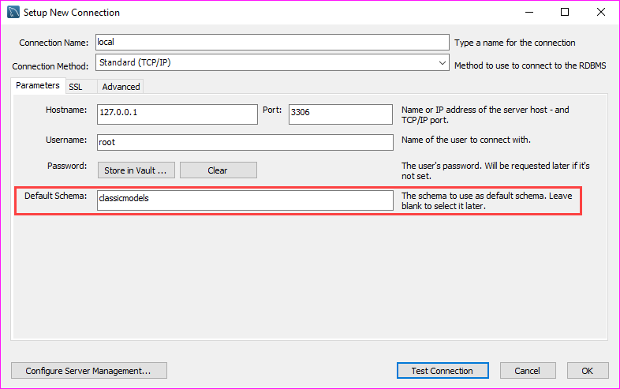
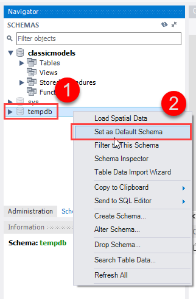

# Bài giảng: Chọn cơ sở dữ liệu trong MySQL bằng câu lệnh `USE`

## 1. Tóm tắt bài học

Trong bài học này, người học sẽ tìm hiểu cách chọn cơ sở dữ liệu đang làm việc trong MySQL bằng câu lệnh `USE`.

Khi đăng nhập vào MySQL mà chưa chỉ định cơ sở dữ liệu, MySQL sẽ không tự động biết ta muốn làm việc với database nào. Khi đó, nếu thực hiện truy vấn trực tiếp trên một bảng mà chưa chọn database, MySQL có thể báo lỗi:

```text
ERROR 1046 (3D000): No database selected
```

Để tránh lỗi này, ta cần biết cách:

- Kiểm tra database hiện tại.
- Chọn database bằng lệnh `USE`.
- Xem danh sách database có sẵn.
- Chọn database ngay khi đăng nhập.
- Chọn database trong MySQL Workbench.

---

## 2. Mục tiêu học tập

Sau khi hoàn thành bài học này, người học có thể:

1. Giải thích được ý nghĩa của database hiện tại trong MySQL.
2. Kiểm tra database hiện đang được chọn bằng hàm `DATABASE()`.
3. Sử dụng câu lệnh `USE` để chọn database làm việc.
4. Hiểu và xử lý lỗi `No database selected`.
5. Liệt kê các database có sẵn bằng lệnh `SHOW DATABASES`.
6. Chọn database ngay khi đăng nhập MySQL bằng tùy chọn `-D`.
7. Biết cách chọn database trong MySQL Workbench.

---

## 3. Đăng nhập MySQL nhưng chưa chọn database

Khi đăng nhập vào MySQL Server bằng chương trình `mysql` mà không chỉ định database, MySQL sẽ đặt database hiện tại là `NULL`.

Ví dụ đăng nhập bằng tài khoản `root`:

```bash
mysql -u root -p
```

Sau đó MySQL yêu cầu nhập mật khẩu:

```text
Enter password:
```

Sau khi nhập đúng mật khẩu, người dùng vào được môi trường dòng lệnh MySQL. Tuy nhiên, lúc này có thể chưa có database nào được chọn.

---

## 4. Kiểm tra database hiện tại

Để kiểm tra database hiện tại, sử dụng câu lệnh:

```sql
SELECT DATABASE();
```

Nếu chưa có database nào được chọn, kết quả có thể là:

```text
+------------+
| DATABASE() |
+------------+
| NULL       |
+------------+
```

Điều này có nghĩa là MySQL chưa biết ta đang muốn làm việc với database nào.

---

## 5. Lỗi thường gặp: `No database selected`

Nếu chưa chọn database mà thực hiện truy vấn trên một bảng, MySQL sẽ báo lỗi.

Ví dụ:

```sql
SELECT * FROM t;
```

Lỗi có thể xuất hiện:

```text
ERROR 1046 (3D000): No database selected
```

### Giải thích lỗi

Lỗi này xảy ra vì MySQL không biết bảng `t` thuộc database nào.

Trong MySQL, nhiều database có thể cùng tồn tại trên một server. Do đó, trước khi truy vấn bảng, ta cần:

- Chọn database hiện tại bằng lệnh `USE`; hoặc
- Ghi đầy đủ tên database kèm tên bảng.

Ví dụ ghi đầy đủ:

```sql
SELECT * FROM classicmodels.t;
```

Tuy nhiên, cách phổ biến hơn là chọn database bằng lệnh `USE`.

---

## 6. Chọn database bằng câu lệnh `USE`

Để chọn database làm việc, sử dụng cú pháp:

```sql
USE database_name;
```

Trong đó, `database_name` là tên database muốn sử dụng.

Ví dụ chọn database `classicmodels`:

```sql
USE classicmodels;
```

Nếu chọn thành công, MySQL sẽ hiển thị:

```text
Database changed
```

Điều này có nghĩa là database hiện tại đã được chuyển sang `classicmodels`.

---

## 7. Kiểm tra lại sau khi dùng `USE`

Sau khi dùng lệnh `USE`, có thể kiểm tra lại database hiện tại bằng:

```sql
SELECT DATABASE();
```

Ví dụ kết quả:

```text
+---------------+
| DATABASE()    |
+---------------+
| classicmodels |
+---------------+
```

Kết quả này cho biết database hiện tại là `classicmodels`.

Từ thời điểm này, các câu lệnh SQL không cần ghi rõ tên database nếu bảng nằm trong database `classicmodels`.

Ví dụ:

```sql
SELECT * FROM customers;
```

Thay vì phải viết:

```sql
SELECT * FROM classicmodels.customers;
```

---

## 8. Lỗi khi database không tồn tại

Nếu database cần chọn không tồn tại, MySQL sẽ báo lỗi.

Ví dụ:

```sql
USE classicmodels;
```

Nếu database `classicmodels` không tồn tại, lỗi có thể là:

```text
ERROR 1049 (42000): Unknown database 'classicmodels'
```

### Nguyên nhân

Lỗi này xảy ra khi:

- Database chưa được tạo.
- Gõ sai tên database.
- Đăng nhập vào nhầm MySQL Server.
- Người dùng hiện tại không nhìn thấy database do thiếu quyền.

---

## 9. Xem danh sách database có sẵn

Khi không chắc database nào đang có trên server, sử dụng lệnh:

```sql
SHOW DATABASES;
```

Ví dụ kết quả:

```text
+--------------------+
| Database           |
+--------------------+
| information_schema |
| mysql              |
| performance_schema |
| sys                |
+--------------------+
```

### Ý nghĩa một số database hệ thống

| Database | Ý nghĩa |
|---|---|
| `information_schema` | Chứa thông tin mô tả về các database, bảng, cột, quyền, ràng buộc |
| `mysql` | Chứa thông tin hệ thống, người dùng, quyền truy cập |
| `performance_schema` | Chứa thông tin phục vụ theo dõi hiệu năng |
| `sys` | Cung cấp các view hỗ trợ quản trị và phân tích hiệu năng |

Các database này thường được MySQL tạo sẵn.

---

## 10. Chọn database ngay khi đăng nhập

Nếu đã biết trước database muốn làm việc, có thể chọn database ngay lúc đăng nhập bằng tùy chọn `-D`.

Cú pháp:

```bash
mysql -u username -D database_name -p
```

Ví dụ đăng nhập bằng tài khoản `root` và chọn database `classicmodels`:

```bash
mysql -u root -D classicmodels -p
```

Sau khi nhập mật khẩu thành công, database hiện tại sẽ là `classicmodels`.

Kiểm tra lại:

```sql
SELECT DATABASE();
```

Kết quả:

```text
+---------------+
| DATABASE()    |
+---------------+
| classicmodels |
+---------------+
```

---

## 11. So sánh hai cách chọn database

| Cách thực hiện | Ví dụ | Khi nào dùng? |
|---|---|---|
| Chọn sau khi đăng nhập | `USE classicmodels;` | Khi đã vào MySQL rồi mới chọn database |
| Chọn ngay khi đăng nhập | `mysql -u root -D classicmodels -p` | Khi đã biết trước database muốn làm việc |

Cả hai cách đều có cùng mục đích: đặt database hiện tại để thực hiện các câu lệnh SQL thuận tiện hơn.

---

## 12. Chọn database trong MySQL Workbench

Nếu sử dụng MySQL Workbench, có thể chọn database theo một số cách.





### Cách 1: Chọn database khi tạo kết nối

Khi tạo kết nối đến MySQL Server trong MySQL Workbench, có thể cấu hình database mặc định trong phần thiết lập kết nối.

Database được chọn sẽ trở thành schema mặc định sau khi đăng nhập.

### Cách 2: Dùng câu lệnh `USE`

Trong cửa sổ SQL Editor của MySQL Workbench, có thể chạy:

```sql
USE classicmodels;
```

Sau đó chạy:

```sql
SELECT DATABASE();
```

để kiểm tra database hiện tại.

### Cách 3: Set As Default Schema

Trong MySQL Workbench, có thể chọn schema ở thanh bên trái, sau đó dùng chức năng:

```text
Set As Default Schema
```

Khi đó schema được chọn sẽ trở thành database mặc định cho phiên làm việc hiện tại.

---

## 13. Ví dụ thực hành hoàn chỉnh

Giả sử cần làm việc với database `classicmodels`.

### Bước 1: Đăng nhập MySQL

```bash
mysql -u root -p
```

### Bước 2: Kiểm tra database hiện tại

```sql
SELECT DATABASE();
```

Nếu kết quả là:

```text
NULL
```

nghĩa là chưa có database nào được chọn.

### Bước 3: Xem danh sách database

```sql
SHOW DATABASES;
```

### Bước 4: Chọn database

```sql
USE classicmodels;
```

Nếu thành công:

```text
Database changed
```

### Bước 5: Kiểm tra lại database hiện tại

```sql
SELECT DATABASE();
```

Kết quả mong muốn:

```text
classicmodels
```

### Bước 6: Truy vấn bảng

```sql
SELECT * FROM customers;
```

---

## 14. Một số lỗi thường gặp và cách xử lý

| Lỗi | Nguyên nhân có thể | Cách xử lý |
|---|---|---|
| `ERROR 1046: No database selected` | Chưa chọn database | Dùng `USE database_name;` |
| `ERROR 1049: Unknown database` | Database không tồn tại hoặc gõ sai tên | Dùng `SHOW DATABASES;` để kiểm tra |
| Không thấy database cần dùng | Người dùng chưa có quyền hoặc kết nối sai server | Kiểm tra quyền và thông tin kết nối |
| Truy vấn bảng báo không tồn tại | Chọn nhầm database | Dùng `SELECT DATABASE();` để kiểm tra |

---

## 15. Ghi chú quan trọng

1. `USE` không tạo database mới, mà chỉ chọn database đã tồn tại.
2. Muốn tạo database mới, cần dùng lệnh `CREATE DATABASE`.
3. Sau khi chọn database bằng `USE`, các truy vấn sẽ mặc định chạy trên database đó.
4. Có thể thay đổi database hiện tại nhiều lần trong cùng một phiên làm việc.
5. Khi mở phiên MySQL mới, database hiện tại có thể không còn được giữ, trừ khi chọn database khi đăng nhập hoặc cấu hình mặc định trong công cụ sử dụng.

---

## 16. Phân biệt `USE` và `CREATE DATABASE`

| Câu lệnh | Mục đích |
|---|---|
| `CREATE DATABASE database_name;` | Tạo database mới |
| `USE database_name;` | Chọn database đã tồn tại để làm việc |
| `SHOW DATABASES;` | Liệt kê các database hiện có |
| `SELECT DATABASE();` | Xem database hiện tại |

Ví dụ:

```sql
CREATE DATABASE school;
USE school;
SELECT DATABASE();
```

---

## 17. Bài tập thực hành

### Bài tập 1

Viết câu lệnh kiểm tra database hiện tại.

### Bài tập 2

Viết câu lệnh liệt kê tất cả database có sẵn trên MySQL Server.

### Bài tập 3

Viết câu lệnh chọn database có tên `classicmodels`.

### Bài tập 4

Giả sử sau khi đăng nhập MySQL, bạn chạy:

```sql
SELECT * FROM customers;
```

và nhận lỗi:

```text
ERROR 1046 (3D000): No database selected
```

Hãy giải thích nguyên nhân và cách sửa lỗi.

### Bài tập 5

Viết lệnh đăng nhập MySQL bằng user `root`, đồng thời chọn luôn database `classicmodels`.

---

## 18. Đáp án gợi ý

<details>
<summary>Bấm để xem đáp án</summary>

### Đáp án bài tập 1

```sql
SELECT DATABASE();
```

### Đáp án bài tập 2

```sql
SHOW DATABASES;
```

### Đáp án bài tập 3

```sql
USE classicmodels;
```

### Đáp án bài tập 4

Nguyên nhân: chưa chọn database hiện tại nên MySQL không biết bảng `customers` thuộc database nào.

Cách sửa:

```sql
USE classicmodels;
SELECT * FROM customers;
```

Hoặc ghi đầy đủ tên database:

```sql
SELECT * FROM classicmodels.customers;
```

### Đáp án bài tập 5

```bash
mysql -u root -D classicmodels -p
```

</details>

---

## 19. Tổng kết

Câu lệnh `USE` trong MySQL được dùng để chọn database hiện tại cho phiên làm việc.

Các câu lệnh quan trọng cần nhớ:

```sql
SELECT DATABASE();
```

Dùng để kiểm tra database hiện tại.

```sql
SHOW DATABASES;
```

Dùng để liệt kê các database có sẵn.

```sql
USE database_name;
```

Dùng để chọn database làm việc.

```bash
mysql -u root -D database_name -p
```

Dùng để đăng nhập MySQL và chọn database ngay từ đầu.

Hiểu và sử dụng đúng câu lệnh `USE` giúp tránh lỗi `No database selected` và làm việc hiệu quả hơn với MySQL.
