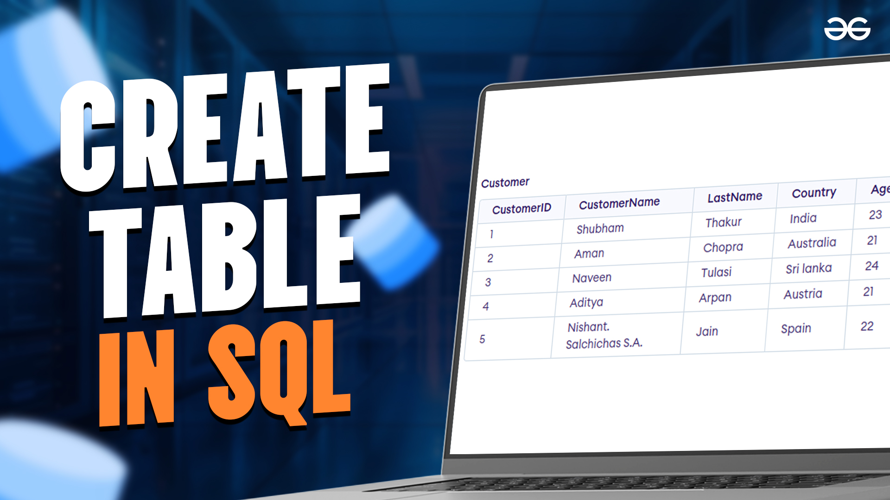
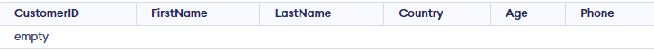

# SQL CREATE TABLE

**Cập nhật lần cuối:** 07/06/2026

**Nguồn tham khảo:**  
- GeeksforGeeks: [SQL CREATE TABLE](https://www.geeksforgeeks.org/sql/sql-create-table/)

---

## 1. Mục tiêu bài giảng

Sau khi hoàn thành bài học này, người học có thể:

1. Trình bày được mục đích của câu lệnh `CREATE TABLE` trong SQL.
2. Giải thích được cú pháp cơ bản của `CREATE TABLE`.
3. Xác định được vai trò của tên bảng, tên cột, kiểu dữ liệu và ràng buộc.
4. Tạo được bảng mới với các cột và kiểu dữ liệu phù hợp.
5. Sử dụng được các ràng buộc cơ bản như `PRIMARY KEY`, `NOT NULL`, `UNIQUE`, `CHECK`, `DEFAULT`.
6. Chèn dữ liệu mẫu vào bảng sau khi tạo.
7. Tạo bảng mới từ bảng đã có bằng `CREATE TABLE AS SELECT`.
8. Nhận biết được một số lỗi thiết kế thường gặp khi tạo bảng.

---

## 2. Giới thiệu tổng quan

Trong cơ sở dữ liệu quan hệ, dữ liệu thường được lưu trong các bảng. Mỗi bảng đại diện cho một nhóm đối tượng hoặc một loại thông tin cụ thể.

Ví dụ:

- Bảng `Customer` lưu thông tin khách hàng.
- Bảng `Product` lưu thông tin sản phẩm.
- Bảng `Orders` lưu thông tin đơn hàng.
- Bảng `Students` lưu thông tin sinh viên.

Để tạo một bảng mới, SQL cung cấp câu lệnh:

```sql
CREATE TABLE
```

Câu lệnh `CREATE TABLE` dùng để định nghĩa cấu trúc ban đầu của bảng. Khi tạo bảng, người thiết kế cần xác định:

- Tên bảng.
- Tên các cột.
- Kiểu dữ liệu của từng cột.
- Kích thước dữ liệu nếu cần.
- Các ràng buộc dữ liệu như khóa chính, giá trị bắt buộc, giá trị duy nhất hoặc điều kiện kiểm tra.

<p align="center">
  
</p>

<p align="center">
  <em>Hình 1. Chủ đề SQL CREATE TABLE.</em>
</p>

Nếu thiết kế bảng hợp lý ngay từ đầu, dữ liệu sẽ dễ quản lý, dễ truy vấn và ít phát sinh lỗi hơn trong quá trình sử dụng.

---

### Quiz nhanh: Giới thiệu tổng quan

**Câu 1.** Câu lệnh `CREATE TABLE` dùng để làm gì?

A. Xóa một bảng khỏi cơ sở dữ liệu  
B. Cập nhật dữ liệu trong bảng  
C. Tạo một bảng mới trong cơ sở dữ liệu  
D. Truy vấn dữ liệu từ nhiều bảng  

**Câu 2.** Khi tạo bảng, thông tin nào sau đây cần được xác định?

A. Tên bảng, tên cột và kiểu dữ liệu  
B. Chỉ cần tên bảng  
C. Chỉ cần số lượng bản ghi  
D. Chỉ cần tên cơ sở dữ liệu  

**Câu 3.** Vì sao cần thiết kế bảng cẩn thận ngay từ đầu?

A. Để tránh phải dùng SQL  
B. Để dữ liệu được tổ chức tốt, dễ quản lý và hạn chế lỗi  
C. Để bảng không thể bị thay đổi  
D. Để mọi cột đều có cùng kiểu dữ liệu  

---

## 3. Khái niệm cơ bản

### 3.1. Bảng trong SQL

Bảng là cấu trúc dùng để lưu dữ liệu theo dạng hàng và cột.

- Mỗi cột biểu diễn một thuộc tính của đối tượng.
- Mỗi hàng biểu diễn một bản ghi cụ thể.

Ví dụ, bảng `Customer` có thể gồm các cột:

| Cột | Ý nghĩa |
|---|---|
| `CustomerID` | Mã khách hàng |
| `FirstName` | Tên |
| `LastName` | Họ |
| `Country` | Quốc gia |
| `Age` | Tuổi |
| `Phone` | Số điện thoại |

### 3.2. Câu lệnh `CREATE TABLE`

`CREATE TABLE` là câu lệnh SQL dùng để tạo bảng mới trong cơ sở dữ liệu.

Câu lệnh này không chỉ tạo tên bảng mà còn mô tả cấu trúc của bảng, bao gồm các cột và kiểu dữ liệu tương ứng.

Ví dụ:

```sql
CREATE TABLE Students (
    StudentID INT,
    FullName VARCHAR(100),
    Age INT
);
```

Bảng `Students` gồm ba cột:

| Cột | Kiểu dữ liệu | Ý nghĩa |
|---|---|---|
| `StudentID` | `INT` | Mã sinh viên |
| `FullName` | `VARCHAR(100)` | Họ tên sinh viên |
| `Age` | `INT` | Tuổi |

### 3.3. Kiểu dữ liệu của cột

Mỗi cột trong bảng phải có một kiểu dữ liệu. Kiểu dữ liệu cho biết cột đó có thể lưu loại giá trị nào.

| Kiểu dữ liệu | Ý nghĩa | Ví dụ |
|---|---|---|
| `INT` | Số nguyên | `1`, `25`, `100` |
| `VARCHAR(50)` | Chuỗi tối đa 50 ký tự | `'Luca'` |
| `DATE` | Ngày tháng | `'2026-06-07'` |
| `DECIMAL(10,2)` | Số thập phân chính xác | `150000.50` |

### 3.4. Ý nghĩa của các khái niệm

Hiểu đúng bảng, cột, kiểu dữ liệu và ràng buộc giúp người học tạo được cấu trúc dữ liệu rõ ràng. Đây là nền tảng trước khi học các thao tác như `INSERT`, `SELECT`, `UPDATE`, `DELETE`, `ALTER TABLE` và thiết kế quan hệ giữa nhiều bảng.

---

### Quiz nhanh: Khái niệm cơ bản

**Câu 1.** Trong SQL, bảng được tổ chức chủ yếu theo dạng nào?

A. Cây và đồ thị  
B. Tệp văn bản  
C. Danh sách liên kết  
D. Hàng và cột  

**Câu 2.** Cột trong bảng thường biểu diễn điều gì?

A. Một bản ghi cụ thể  
B. Một thuộc tính của đối tượng  
C. Một cơ sở dữ liệu khác  
D. Một câu truy vấn  

**Câu 3.** Kiểu dữ liệu của cột dùng để làm gì?

A. Quy định loại giá trị mà cột có thể lưu  
B. Xóa dữ liệu trong cột  
C. Tự động tạo biểu đồ  
D. Đổi tên bảng  

---

## 4. Cách câu lệnh `CREATE TABLE` hoạt động

Câu lệnh `CREATE TABLE` gửi yêu cầu tới hệ quản trị cơ sở dữ liệu để tạo một cấu trúc bảng mới.

Quy trình cơ bản:

1. **Xác định tên bảng**

   Người thiết kế đặt tên cho bảng cần tạo, ví dụ `Customer`, `Students`, `Products`.

2. **Liệt kê các cột**

   Mỗi cột đại diện cho một thuộc tính cần lưu.

3. **Gán kiểu dữ liệu cho từng cột**

   Ví dụ `INT` cho mã số, `VARCHAR` cho chuỗi, `DATE` cho ngày tháng.

4. **Bổ sung ràng buộc nếu cần**

   Ví dụ `PRIMARY KEY`, `NOT NULL`, `UNIQUE`, `CHECK`, `DEFAULT`.

5. **Thực thi câu lệnh**

   Nếu cú pháp hợp lệ, hệ quản trị cơ sở dữ liệu tạo bảng theo cấu trúc đã khai báo.

Ví dụ:

```sql
CREATE TABLE Courses (
    CourseID INT PRIMARY KEY,
    CourseName VARCHAR(100),
    Credits INT
);
```

Sau khi chạy câu lệnh trên, cơ sở dữ liệu có thêm bảng `Courses` với ba cột `CourseID`, `CourseName` và `Credits`.

---

### Quiz nhanh: Cách hoạt động

**Câu 1.** Bước đầu tiên khi viết `CREATE TABLE` là gì?

A. Xóa dữ liệu cũ  
B. Chạy `DROP TABLE`  
C. Xác định tên bảng cần tạo  
D. Tạo bản sao lưu  

**Câu 2.** Mỗi cột trong `CREATE TABLE` cần có thông tin nào?

A. Tên bảng và số dòng dữ liệu  
B. Tên người tạo bảng  
C. Mật khẩu cơ sở dữ liệu  
D. Tên cột và kiểu dữ liệu  

**Câu 3.** Sau khi thực thi thành công `CREATE TABLE`, kết quả là gì?

A. Tất cả bảng bị xóa  
B. Một bảng mới được tạo trong cơ sở dữ liệu  
C. Dữ liệu được tự động nhập vào  
D. Cơ sở dữ liệu bị đóng  

---

## 5. Các thành phần chính

Một câu lệnh `CREATE TABLE` thường gồm các thành phần:

```sql
CREATE TABLE table_name (
    column1 datatype(size),
    column2 datatype(size),
    column3 datatype(size),
    ...
);
```

| Thành phần | Ý nghĩa |
|---|---|
| `CREATE TABLE` | Từ khóa tạo bảng mới |
| `table_name` | Tên bảng cần tạo |
| `column1`, `column2` | Tên các cột |
| `datatype` | Kiểu dữ liệu của cột |
| `size` | Độ dài hoặc kích thước dữ liệu nếu cần |
| Constraint | Ràng buộc dữ liệu tùy chọn |

### 5.1. Tên bảng

Tên bảng là tên được gán cho bảng mới.

Ví dụ:

```sql
CREATE TABLE Customer (...);
```

Ở đây, `Customer` là tên bảng.

Một số lưu ý khi đặt tên bảng:

- Nên đặt tên có ý nghĩa.
- Nên thống nhất quy ước đặt tên trong toàn bộ cơ sở dữ liệu.
- Tránh dùng từ khóa SQL làm tên bảng.
- Tránh đặt tên quá dài hoặc khó hiểu.

### 5.2. Tên cột

Tên cột biểu diễn thuộc tính của đối tượng được lưu trong bảng.

Ví dụ:

```sql
CREATE TABLE Customer (
    CustomerID INT,
    FirstName VARCHAR(50),
    LastName VARCHAR(50)
);
```

### 5.3. Kiểu dữ liệu và kích thước

Mỗi cột cần có kiểu dữ liệu phù hợp.

Ví dụ:

```sql
FirstName VARCHAR(50)
Age INT
```

`VARCHAR(50)` cho biết cột lưu chuỗi ký tự có độ dài tối đa 50. `INT` cho biết cột lưu số nguyên.

### 5.4. Ràng buộc dữ liệu

Ràng buộc giúp kiểm soát tính hợp lệ của dữ liệu.

| Ràng buộc | Ý nghĩa |
|---|---|
| `PRIMARY KEY` | Xác định khóa chính, mỗi bản ghi là duy nhất |
| `NOT NULL` | Không cho phép giá trị rỗng |
| `UNIQUE` | Không cho phép trùng lặp giá trị |
| `CHECK` | Kiểm tra điều kiện hợp lệ |
| `DEFAULT` | Gán giá trị mặc định |

---

### Quiz nhanh: Các thành phần chính

**Câu 1.** Ràng buộc nào thường dùng để xác định khóa chính?

A. `CHECK`  
B. `PRIMARY KEY`  
C. `DEFAULT`  
D. `VARCHAR`  

**Câu 2.** Ràng buộc `NOT NULL` có ý nghĩa gì?

A. Không cho phép cột nhận giá trị rỗng  
B. Không cho phép bảng được tạo  
C. Không cho phép truy vấn dữ liệu  
D. Không cho phép dùng kiểu số  

**Câu 3.** Ràng buộc `CHECK` dùng để làm gì?

A. Đặt tên bảng  
B. Tự động sao lưu bảng  
C. Xóa dữ liệu trùng lặp  
D. Kiểm tra điều kiện hợp lệ của dữ liệu  

---

## 6. Phân loại hoặc các nhóm chính

Trong bài này, có thể chia nội dung `CREATE TABLE` thành các nhóm chính:

1. **Cú pháp tạo bảng cơ bản:** tạo bảng với tên cột và kiểu dữ liệu.
2. **Tạo bảng có ràng buộc:** dùng `PRIMARY KEY`, `NOT NULL`, `UNIQUE`, `CHECK`, `DEFAULT`.
3. **Thêm dữ liệu sau khi tạo bảng:** dùng `INSERT INTO`.
4. **Tạo bảng từ bảng đã có:** dùng `CREATE TABLE AS SELECT`.
5. **Kiểm tra và thay đổi bảng:** dùng `DESC` hoặc `ALTER TABLE` tùy hệ quản trị.

---

## 7. Tạo bảng cơ bản

### 7.1. Khái niệm

Tạo bảng cơ bản là viết câu lệnh `CREATE TABLE` với tên bảng, danh sách cột và kiểu dữ liệu.

### 7.2. Đặc điểm chính

1. **Cần tên bảng rõ ràng**

   Tên bảng nên phản ánh loại dữ liệu được lưu.

2. **Cần danh sách cột phù hợp**

   Mỗi cột nên biểu diễn một thuộc tính cụ thể.

3. **Cần kiểu dữ liệu đúng**

   Kiểu dữ liệu nên phù hợp với bản chất dữ liệu.

### 7.3. Ví dụ

```sql
CREATE TABLE Customer (
    CustomerID INT,
    FirstName VARCHAR(50),
    LastName VARCHAR(50),
    Country VARCHAR(50),
    Age INT,
    Phone VARCHAR(15)
);
```

<p align="center">
  
</p>

<p align="center">
  <em>Hình 2. Ví dụ dữ liệu khách hàng.</em>
</p>

---

### Quiz nhanh: Tạo bảng cơ bản

**Câu 1.** Trong bảng `Customer`, cột nào có thể dùng để lưu mã khách hàng?

A. `CustomerID`  
B. `Country`  
C. `Phone`  
D. `LastName`  

**Câu 2.** Vì sao `Phone` nên dùng `VARCHAR` thay vì `INT`?

A. Vì số điện thoại nên được cộng trừ thường xuyên  
B. Vì `INT` tự động lưu được dấu `+` và khoảng trắng  
C. Vì số điện thoại có thể có số 0 đầu hoặc ký tự `+`  
D. Vì `VARCHAR` chỉ lưu số nguyên  

**Câu 3.** `Age INT` nghĩa là gì?

A. Tuổi được lưu dưới dạng văn bản dài  
B. Tuổi được lưu dưới dạng ngày tháng  
C. Tuổi là khóa chính  
D. Tuổi được lưu dưới dạng số nguyên  

---

## 8. Tạo bảng có ràng buộc

### 8.1. Khái niệm

Ràng buộc dữ liệu giúp cơ sở dữ liệu kiểm soát dữ liệu nhập vào bảng.

### 8.2. Đặc điểm chính

1. **Bảo vệ tính duy nhất**

   `PRIMARY KEY` và `UNIQUE` giúp tránh dữ liệu trùng lặp không hợp lệ.

2. **Bảo vệ tính đầy đủ**

   `NOT NULL` đảm bảo cột bắt buộc phải có dữ liệu.

3. **Bảo vệ tính hợp lệ**

   `CHECK` đảm bảo dữ liệu thỏa điều kiện được khai báo.

### 8.3. Các dạng con

#### 8.3.1. `PRIMARY KEY`

```sql
CREATE TABLE Students (
    StudentID INT PRIMARY KEY,
    FullName VARCHAR(100)
);
```

`StudentID` định danh duy nhất mỗi sinh viên.

#### 8.3.2. `NOT NULL` và `UNIQUE`

```sql
CREATE TABLE Users (
    UserID INT PRIMARY KEY,
    Email VARCHAR(100) UNIQUE,
    FullName VARCHAR(100) NOT NULL
);
```

`Email` không được trùng, còn `FullName` bắt buộc có giá trị.

#### 8.3.3. `CHECK` và `DEFAULT`

```sql
CREATE TABLE Products (
    ProductID INT PRIMARY KEY,
    Price DECIMAL(10,2) CHECK (Price >= 0),
    IsAvailable INT DEFAULT 1
);
```

`Price` không được âm, còn `IsAvailable` mặc định là `1`.

---

### Quiz nhanh: Tạo bảng có ràng buộc

**Câu 1.** Ràng buộc nào đảm bảo giá trị không trùng lặp?

A. `CHECK`  
B. `DEFAULT`  
C. `UNIQUE`  
D. `CREATE`  

**Câu 2.** `DEFAULT` dùng để làm gì?

A. Xóa bảng mặc định  
B. Gán giá trị mặc định cho cột  
C. Đổi tên cột  
D. Truy vấn dữ liệu  

**Câu 3.** `CHECK (Price >= 0)` giúp đảm bảo điều gì?

A. Giá không âm  
B. Giá luôn bằng 0  
C. Giá là chuỗi ký tự  
D. Giá không được truy vấn  

---

## 9. Nguyên lý, tính chất hoặc tiêu chuẩn quan trọng

### 9.1. Tính rõ nghĩa

Tên bảng và tên cột nên phản ánh đúng ý nghĩa dữ liệu. Ví dụ `CustomerID` rõ nghĩa hơn `ID1`.

### 9.2. Tính đúng kiểu

Chọn kiểu dữ liệu dựa trên bản chất dữ liệu. Số điện thoại nên dùng `VARCHAR`, tiền nên dùng `DECIMAL`, ngày sinh nên dùng `DATE`.

### 9.3. Tính toàn vẹn

Ràng buộc như `PRIMARY KEY`, `NOT NULL`, `UNIQUE`, `CHECK` giúp dữ liệu đáng tin cậy hơn.

### 9.4. Tính có thể mở rộng

Bảng nên được thiết kế để dễ thêm cột, thêm quan hệ và bảo trì về sau.

---

### Quiz nhanh: Nguyên lý hoặc tính chất quan trọng

**Câu 1.** Tên cột nên được đặt như thế nào?

A. Luôn viết tắt tối đa để tiết kiệm ký tự  
B. Càng dài càng tốt dù khó đọc  
C. Luôn dùng từ khóa SQL  
D. Rõ nghĩa và nhất quán  

**Câu 2.** Kiểu nào phù hợp để lưu tiền?

A. `DATE`  
B. `VARCHAR(MAX)`  
C. `DECIMAL(10,2)`  
D. `BLOB`  

**Câu 3.** Ràng buộc nào giúp định danh duy nhất bản ghi?

A. `DEFAULT`  
B. `PRIMARY KEY`  
C. `ALTER`  
D. `DESC`  

---

## 10. Ứng dụng thực tế

`CREATE TABLE` xuất hiện trong hầu hết các hệ thống dùng cơ sở dữ liệu quan hệ.

1. **Quản lý khách hàng**

   Tạo bảng lưu mã khách hàng, tên, quốc gia, tuổi, số điện thoại.

2. **Quản lý sinh viên**

   Tạo bảng lưu mã sinh viên, họ tên, email, lớp, điểm trung bình.

3. **Bán hàng và thương mại điện tử**

   Tạo bảng sản phẩm, đơn hàng, chi tiết đơn hàng, thanh toán.

4. **Nhân sự**

   Tạo bảng nhân viên, phòng ban, lương, chức vụ.

5. **Báo cáo và sao lưu**

   Dùng `CREATE TABLE AS SELECT` để tạo bảng mới từ kết quả truy vấn.

---

### Quiz nhanh: Ứng dụng thực tế

**Câu 1.** Trong hệ thống bán hàng, `CREATE TABLE` có thể dùng để tạo bảng nào?

A. `Products`  
B. `ORDER BY`  
C. `WHERE`  
D. `JOIN`  

**Câu 2.** Bảng sinh viên thường cần cột nào?

A. `DROP`  
B. `HAVING`  
C. `DATABASE`  
D. `StudentID`  

**Câu 3.** `CREATE TABLE AS SELECT` hữu ích khi nào?

A. Khi muốn xóa toàn bộ database  
B. Khi muốn đổi mật khẩu hệ điều hành  
C. Khi muốn tạo bảng mới từ kết quả truy vấn  
D. Khi muốn đóng kết nối mạng  

---

## 11. Vai trò trong các lĩnh vực công nghệ hoặc nghiệp vụ

### 11.1. Thiết kế cơ sở dữ liệu

- Vai trò: tạo cấu trúc lưu trữ dữ liệu ban đầu.
- Công cụ liên quan: MySQL, PostgreSQL, SQL Server, SQLite, Oracle.
- Trường hợp sử dụng: tạo bảng nghiệp vụ trước khi phát triển ứng dụng.

### 11.2. Phát triển backend

- Vai trò: định nghĩa bảng phục vụ API và logic nghiệp vụ.
- Công cụ liên quan: migration tool, ORM, SQL script.
- Trường hợp sử dụng: tạo bảng `users`, `orders`, `payments`.

### 11.3. Phân tích dữ liệu

- Vai trò: tạo bảng tạm, bảng trung gian hoặc bảng tổng hợp.
- Công cụ liên quan: SQL editor, data warehouse, BI tool.
- Trường hợp sử dụng: `CREATE TABLE AS SELECT` để lưu kết quả phân tích.

### 11.4. Quản trị cơ sở dữ liệu

- Vai trò: kiểm soát cấu trúc, ràng buộc và khả năng mở rộng.
- Công cụ liên quan: MySQL Workbench, pgAdmin, SQL Server Management Studio.
- Trường hợp sử dụng: chuẩn hóa schema và kiểm tra tính toàn vẹn dữ liệu.

---

### Quiz nhanh: Vai trò theo lĩnh vực

**Câu 1.** Công cụ nào thường dùng với câu lệnh `CREATE TABLE`?

A. Photoshop  
B. MySQL  
C. Git only  
D. PowerPoint only  

**Câu 2.** Trong backend, `CREATE TABLE` hỗ trợ điều gì?

A. Tạo cấu trúc bảng phục vụ ứng dụng  
B. Tạo ảnh minh họa  
C. Biên dịch mã C++  
D. Gửi email marketing  

**Câu 3.** Trong phân tích dữ liệu, `CREATE TABLE AS SELECT` thường dùng để làm gì?

A. Đổi tên máy tính  
B. Xóa trình duyệt  
C. Lưu kết quả truy vấn vào bảng mới  
D. Tạo file PDF  

---

## 12. Bảng so sánh

| Tiêu chí | `CREATE TABLE` | `INSERT INTO` | `ALTER TABLE` | `CREATE TABLE AS SELECT` |
|---|---|---|---|---|
| Mục đích | Tạo bảng mới | Thêm dữ liệu vào bảng | Thay đổi cấu trúc bảng | Tạo bảng từ kết quả truy vấn |
| Tác động chính | Tạo schema bảng | Tạo bản ghi mới | Thêm, sửa, xóa cột hoặc ràng buộc | Tạo bảng mới có dữ liệu từ truy vấn |
| Cần bảng đã tồn tại? | Không | Có | Có | Có bảng nguồn |
| Ví dụ | `CREATE TABLE Customer (...)` | `INSERT INTO Customer (...) VALUES (...)` | `ALTER TABLE Customer ADD Email VARCHAR(100)` | `CREATE TABLE Backup AS SELECT * FROM Customer` |
| Lưu ý | Cần thiết kế cột và kiểu dữ liệu | Dữ liệu phải phù hợp kiểu cột | Cú pháp khác nhau giữa hệ quản trị | Thường không sao chép đầy đủ khóa, ràng buộc, chỉ mục |

---

## 13. Câu hỏi ôn tập

### 13.1. Câu hỏi trắc nghiệm

**Câu 1.** Câu lệnh nào dùng để tạo bảng mới trong SQL?

A. `SELECT TABLE`  
B. `CREATE TABLE`  
C. `INSERT TABLE`  
D. `MAKE TABLE`  

---

**Câu 2.** Trong `CREATE TABLE`, phần nào xác định tên bảng mới?

A. `datatype`  
B. `column1`  
C. `table_name`  
D. `size`  

---

**Câu 3.** `CustomerID INT PRIMARY KEY` có nghĩa là gì?

A. `CustomerID` là cột văn bản  
B. `CustomerID` có thể trùng lặp tùy ý  
C. `CustomerID` chỉ lưu ngày tháng  
D. `CustomerID` là khóa chính dạng số nguyên  

---

**Câu 4.** `CHECK (Age >= 0 AND Age <= 99)` có tác dụng gì?

A. Đảm bảo tuổi nằm trong khoảng từ 0 đến 99  
B. Đảm bảo tuổi luôn bằng 99  
C. Đảm bảo tuổi luôn là chuỗi  
D. Đảm bảo tuổi không được truy vấn  

---

**Câu 5.** Kiểu dữ liệu nào phù hợp hơn để lưu số điện thoại?

A. `INT`  
B. `VARCHAR(15)`  
C. `FLOAT`  
D. `DATE`  

---

**Câu 6.** Lệnh nào dùng để thêm dữ liệu vào bảng?

A. `CREATE TABLE`  
B. `DROP TABLE`  
C. `ALTER DATABASE`  
D. `INSERT INTO`  

---

**Câu 7.** `CREATE TABLE new_table AS SELECT ...` dùng để làm gì?

A. Tạo bảng mới từ kết quả truy vấn  
B. Xóa bảng cũ  
C. Đổi tên cơ sở dữ liệu  
D. Tạo chỉ mục duy nhất  

---

**Câu 8.** `CREATE TABLE AS SELECT` thường không sao chép đầy đủ yếu tố nào?

A. Dữ liệu được truy vấn  
B. Một số ràng buộc, khóa và chỉ mục  
C. Tên cột được chọn  
D. Kết quả câu lệnh `SELECT`  

---

**Câu 9.** Mệnh đề nào có thể dùng để tránh lỗi khi bảng đã tồn tại?

A. `CREATE TABLE ALWAYS`  
B. `CREATE TABLE REPEAT`  
C. `CREATE TABLE IF NOT EXISTS`  
D. `CREATE TABLE FORCE DELETE`  

---

**Câu 10.** `DESC Customer;` thường dùng để làm gì trong MySQL?

A. Thêm cột mới vào bảng `Customer`  
B. Xóa bảng `Customer`  
C. Thêm dữ liệu vào bảng `Customer`  
D. Xem cấu trúc bảng `Customer`  

---

### 13.2. Câu hỏi tự luận ngắn

**Câu 1.** Trình bày mục đích của câu lệnh `CREATE TABLE` trong SQL.

---

**Câu 2.** Giải thích các thành phần chính trong cú pháp `CREATE TABLE table_name (...)`.

---

**Câu 3.** Phân biệt vai trò của `CREATE TABLE` và `INSERT INTO`.

---

**Câu 4.** Vì sao không nên dùng `INT` để lưu số điện thoại trong thực tế?

---

**Câu 5.** Trình bày ưu điểm và hạn chế của `CREATE TABLE AS SELECT`.

---

## 14. Bài tập vận dụng

### Bài tập 1

Hãy tạo bảng `Students` để lưu thông tin sinh viên gồm:

- Mã sinh viên.
- Họ tên.
- Email.
- Tuổi.
- Điểm trung bình.

**Yêu cầu:**  
Viết câu lệnh `CREATE TABLE` phù hợp. Trong đó:

- `StudentID` là khóa chính.
- `FullName` không được để trống.
- `Email` không được trùng lặp.
- `Age` phải từ 18 đến 60.
- `GPA` phải từ 0 đến 4.

---

### Bài tập 2

Cho bảng `Customer` đã tạo trong bài học.

**Yêu cầu:**  
Viết câu lệnh `INSERT INTO` để thêm 3 khách hàng mới vào bảng.

---

### Bài tập 3

Giả sử cần tạo bảng `YoungCustomers` chứa các khách hàng có tuổi nhỏ hơn hoặc bằng 25 từ bảng `Customer`.

**Yêu cầu:**  
Viết câu lệnh `CREATE TABLE AS SELECT` phù hợp.

---

### Bài tập 4

Một sinh viên thiết kế bảng như sau:

```sql
CREATE TABLE Employee (
    EmployeeID VARCHAR(100),
    FullName VARCHAR(100),
    Salary FLOAT,
    Phone INT,
    Age INT
);
```

**Yêu cầu:**  
Chỉ ra các điểm chưa hợp lý và viết lại câu lệnh tạo bảng tốt hơn.

---

## 15. Tóm tắt bài học

- `CREATE TABLE` là câu lệnh dùng để tạo bảng mới trong SQL.
- Khi tạo bảng, cần xác định tên bảng, tên cột, kiểu dữ liệu và các ràng buộc nếu cần.
- Mỗi cột cần có kiểu dữ liệu phù hợp với bản chất dữ liệu.
- `PRIMARY KEY` dùng để định danh duy nhất mỗi bản ghi.
- `CHECK` dùng để kiểm tra điều kiện hợp lệ của dữ liệu.
- Sau khi tạo bảng, có thể dùng `INSERT INTO` để thêm dữ liệu.
- `CREATE TABLE AS SELECT` cho phép tạo bảng mới từ kết quả truy vấn.
- `CREATE TABLE AS SELECT` thường không sao chép đầy đủ ràng buộc, khóa và chỉ mục.
- Có thể dùng `IF NOT EXISTS` để tránh lỗi khi bảng đã tồn tại.
- Có thể dùng `ALTER TABLE` để thay đổi cấu trúc bảng sau khi đã tạo.

---

## 16. Từ khóa chính

- SQL
- CREATE TABLE
- Table
- Column
- Data Type
- Constraint
- PRIMARY KEY
- CHECK
- NOT NULL
- UNIQUE
- DEFAULT
- INSERT INTO
- CREATE TABLE AS SELECT
- IF NOT EXISTS
- ALTER TABLE
- DESC

---

## 17. Đáp án và gợi ý trả lời

### Quiz nhanh: Giới thiệu tổng quan

- **Câu 1.** C
- **Câu 2.** A
- **Câu 3.** B

### Quiz nhanh: Khái niệm cơ bản

- **Câu 1.** D
- **Câu 2.** B
- **Câu 3.** A

### Quiz nhanh: Cách hoạt động

- **Câu 1.** C
- **Câu 2.** D
- **Câu 3.** B

### Quiz nhanh: Các thành phần chính

- **Câu 1.** B
- **Câu 2.** A
- **Câu 3.** D

### Quiz nhanh: Tạo bảng cơ bản

- **Câu 1.** A
- **Câu 2.** C
- **Câu 3.** D

### Quiz nhanh: Tạo bảng có ràng buộc

- **Câu 1.** C
- **Câu 2.** B
- **Câu 3.** A

### Quiz nhanh: Nguyên lý hoặc tính chất quan trọng

- **Câu 1.** D
- **Câu 2.** C
- **Câu 3.** B

### Quiz nhanh: Ứng dụng thực tế

- **Câu 1.** A
- **Câu 2.** D
- **Câu 3.** C

### Quiz nhanh: Vai trò theo lĩnh vực

- **Câu 1.** B
- **Câu 2.** A
- **Câu 3.** C

### Câu hỏi ôn tập - Trắc nghiệm

- **Câu 1.** B
- **Câu 2.** C
- **Câu 3.** D
- **Câu 4.** A
- **Câu 5.** B
- **Câu 6.** D
- **Câu 7.** A
- **Câu 8.** B
- **Câu 9.** C
- **Câu 10.** D

### Câu hỏi ôn tập - Tự luận ngắn

#### Câu 1

**Gợi ý trả lời:**

`CREATE TABLE` dùng để tạo một bảng mới trong cơ sở dữ liệu. Câu lệnh này xác định cấu trúc bảng, bao gồm tên bảng, tên các cột, kiểu dữ liệu và các ràng buộc dữ liệu nếu có.

#### Câu 2

**Gợi ý trả lời:**

Cú pháp `CREATE TABLE table_name (...)` gồm từ khóa `CREATE TABLE`, tên bảng cần tạo, danh sách cột đặt trong ngoặc đơn, kiểu dữ liệu của từng cột và các ràng buộc tùy chọn như `PRIMARY KEY`, `CHECK`, `NOT NULL`, `UNIQUE` hoặc `DEFAULT`.

#### Câu 3

**Gợi ý trả lời:**

`CREATE TABLE` dùng để tạo cấu trúc bảng mới. `INSERT INTO` dùng để thêm dữ liệu vào bảng đã tồn tại. Nói cách khác, `CREATE TABLE` tạo nơi lưu dữ liệu, còn `INSERT INTO` đưa dữ liệu vào nơi đó.

#### Câu 4

**Gợi ý trả lời:**

Không nên dùng `INT` để lưu số điện thoại vì số điện thoại không dùng cho phép toán số học, có thể bắt đầu bằng số `0`, có thể chứa mã quốc gia như `+84`, hoặc chứa ký tự định dạng. Kiểu phù hợp hơn là `VARCHAR`.

#### Câu 5

**Gợi ý trả lời:**

`CREATE TABLE AS SELECT` giúp tạo nhanh bảng mới từ dữ liệu của bảng đã có, phù hợp để sao lưu, tạo bảng tạm hoặc trích một phần dữ liệu. Hạn chế là nó thường không sao chép đầy đủ các ràng buộc, khóa và chỉ mục của bảng gốc.

### Bài tập vận dụng

#### Bài tập 1

**Gợi ý trả lời:**

```sql
CREATE TABLE Students (
    StudentID INT PRIMARY KEY,
    FullName VARCHAR(100) NOT NULL,
    Email VARCHAR(100) UNIQUE,
    Age INT CHECK (Age >= 18 AND Age <= 60),
    GPA DECIMAL(3,2) CHECK (GPA >= 0 AND GPA <= 4)
);
```

Có thể dùng `NVARCHAR(100)` cho `FullName` nếu cần lưu tiếng Việt có dấu trong SQL Server.

#### Bài tập 2

**Gợi ý trả lời:**

```sql
INSERT INTO Customer (CustomerID, FirstName, LastName, Country, Age, Phone)
VALUES
(6, 'Minh', 'Nguyen', 'Vietnam', 30, '0900000001'),
(7, 'Anna', 'Smith', 'UK', 28, '0900000002'),
(8, 'Kenji', 'Sato', 'Japan', 35, '0900000003');
```

#### Bài tập 3

**Gợi ý trả lời:**

```sql
CREATE TABLE YoungCustomers AS
SELECT *
FROM Customer
WHERE Age <= 25;
```

Sau khi tạo bảng, cần kiểm tra lại ràng buộc và khóa nếu muốn bảng mới có cấu trúc kiểm soát dữ liệu giống bảng gốc.

#### Bài tập 4

**Gợi ý trả lời:**

Các điểm chưa hợp lý:

- `EmployeeID VARCHAR(100)` chưa phù hợp nếu mã nhân viên là số; nên dùng `INT` và khai báo khóa chính.
- `FullName` nên có `NOT NULL` vì tên nhân viên thường bắt buộc.
- `Salary FLOAT` không phù hợp cho tiền lương vì `FLOAT` là số gần đúng; nên dùng `DECIMAL`.
- `Phone INT` không phù hợp để lưu số điện thoại; nên dùng `VARCHAR`.
- `Age` nên có ràng buộc kiểm tra giá trị hợp lệ.

Câu lệnh đề xuất:

```sql
CREATE TABLE Employee (
    EmployeeID INT PRIMARY KEY,
    FullName VARCHAR(100) NOT NULL,
    Salary DECIMAL(12,2) CHECK (Salary >= 0),
    Phone VARCHAR(15),
    Age INT CHECK (Age >= 18 AND Age <= 70)
);
```

---

## 18. Gợi ý sử dụng bài giảng

Bài giảng này có thể được dùng cho:

1. Buổi học nhập môn SQL trong học phần cơ sở dữ liệu.
2. Bài thực hành tạo bảng đầu tiên trong MySQL, SQL Server, PostgreSQL hoặc SQLite.
3. Hoạt động thảo luận về lựa chọn kiểu dữ liệu và ràng buộc dữ liệu.
4. Bài tập thiết kế bảng đơn giản cho các tình huống quản lý khách hàng, sinh viên, nhân viên hoặc sản phẩm.
5. Kiểm tra nhanh cuối buổi bằng phần quiz và câu hỏi ôn tập.
