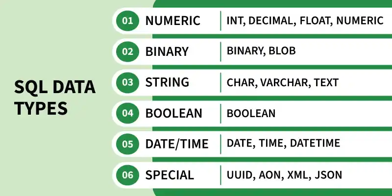

# SQL Data Types

**Cập nhật lần cuối:** 07/06/2026

**Nguồn tham khảo:**  
- GeeksforGeeks: [SQL Data Types](https://www.geeksforgeeks.org/sql/sql-data-types/)

---

## 1. Mục tiêu bài giảng

Sau khi hoàn thành bài học này, người học có thể:

1. Trình bày được khái niệm kiểu dữ liệu trong SQL.
2. Giải thích được vai trò của kiểu dữ liệu khi thiết kế bảng.
3. Phân biệt được các nhóm kiểu dữ liệu phổ biến trong SQL.
4. Chọn được kiểu dữ liệu phù hợp cho số, chuỗi, ngày giờ, nhị phân và logic.
5. Vận dụng kiểu dữ liệu trong câu lệnh `CREATE TABLE`.
6. Phân tích được một số lỗi thường gặp khi chọn kiểu dữ liệu.
7. Hoàn thành được các câu hỏi ôn tập và bài tập vận dụng.

---

## 2. Giới thiệu tổng quan

Trong SQL, mỗi cột của một bảng cần được khai báo với một kiểu dữ liệu cụ thể. Kiểu dữ liệu quy định loại giá trị mà cột đó có thể lưu trữ, chẳng hạn số nguyên, số thập phân, văn bản, ngày tháng, thời gian, dữ liệu nhị phân hoặc giá trị đúng/sai.

Ví dụ, khi thiết kế bảng sinh viên:

- `StudentID` có thể dùng `INT`.
- `FullName` có thể dùng `VARCHAR(100)` hoặc `NVARCHAR(100)`.
- `DateOfBirth` có thể dùng `DATE`.
- `GPA` có thể dùng `DECIMAL(4,2)`.

Việc chọn đúng kiểu dữ liệu giúp dữ liệu được lưu nhất quán, giảm lỗi nhập liệu, tiết kiệm dung lượng và tăng hiệu quả truy vấn.

<p align="center">
  
</p>

<p align="center">
  <em>Hình 1. Các nhóm kiểu dữ liệu phổ biến trong SQL.</em>
</p>

---

### Quiz nhanh: Giới thiệu tổng quan

**Câu 1.** Kiểu dữ liệu trong SQL dùng để làm gì?

A. Quy định loại giá trị mà một cột có thể lưu  
B. Xác định tên cơ sở dữ liệu  
C. Xóa dữ liệu khỏi bảng  
D. Tạo giao diện người dùng  

**Câu 2.** Cột lưu ngày sinh nên dùng kiểu nào?

A. `FLOAT`  
B. `DATE`  
C. `BLOB`  
D. `VARCHAR(MAX)` trong mọi trường hợp  

**Câu 3.** Vì sao cần chọn đúng kiểu dữ liệu?

A. Để bảng không cần khóa chính  
B. Để mọi dữ liệu đều biến thành chuỗi  
C. Để dữ liệu đúng hơn, truy vấn hiệu quả hơn và tránh lãng phí lưu trữ  
D. Để không cần viết SQL  

---

## 3. Khái niệm cơ bản

### 3.1. Kiểu dữ liệu trong SQL

Kiểu dữ liệu là quy định về loại dữ liệu mà một cột có thể chứa. Khi tạo bảng, người thiết kế cần khai báo kiểu dữ liệu cho từng cột.

Ví dụ:

```sql
CREATE TABLE Products (
    ProductID INT,
    ProductName VARCHAR(100),
    Price DECIMAL(10,2)
);
```

Trong ví dụ này:

- `ProductID INT` lưu mã sản phẩm dạng số nguyên.
- `ProductName VARCHAR(100)` lưu tên sản phẩm dạng chuỗi.
- `Price DECIMAL(10,2)` lưu giá sản phẩm dạng số thập phân chính xác.

### 3.2. Miền giá trị

Mỗi kiểu dữ liệu có miền giá trị riêng. Ví dụ, `INT` lưu số nguyên thông dụng, còn `BIGINT` dùng khi cần lưu số nguyên rất lớn.

Nếu chọn kiểu dữ liệu quá nhỏ, dữ liệu có thể vượt giới hạn. Nếu chọn kiểu dữ liệu quá lớn, hệ thống có thể lãng phí bộ nhớ.

### 3.3. Độ dài, độ chính xác và thang đo

Một số kiểu dữ liệu cần tham số bổ sung.

```sql
FullName VARCHAR(100)
Price DECIMAL(10,2)
```

- `VARCHAR(100)` cho phép lưu tối đa 100 ký tự.
- `DECIMAL(10,2)` cho phép tối đa 10 chữ số, trong đó có 2 chữ số sau dấu thập phân.

### 3.4. Ý nghĩa của các khái niệm

Hiểu đúng kiểu dữ liệu giúp thiết kế bảng chặt chẽ hơn. Sai lầm khi chọn kiểu dữ liệu có thể gây lỗi nhập liệu, mất độ chính xác, truy vấn chậm hoặc khó bảo trì hệ thống.

---

### Quiz nhanh: Khái niệm cơ bản

**Câu 1.** Trong `Price DECIMAL(10,2)`, số `2` có ý nghĩa gì?

A. Có 2 cột trong bảng  
B. Có 2 dòng dữ liệu  
C. Có 2 khóa chính  
D. Có 2 chữ số sau dấu thập phân  

**Câu 2.** Kiểu nào phù hợp để lưu tên sản phẩm?

A. `VARCHAR(100)`  
B. `INT`  
C. `DATE`  
D. `BLOB`  

**Câu 3.** Điều gì có thể xảy ra nếu chọn kiểu dữ liệu quá nhỏ?

A. Bảng tự động bị xóa  
B. Giá trị có thể vượt giới hạn cho phép  
C. SQL tự động chuyển sang Python  
D. Không thể tạo khóa chính  

---

## 4. Cách hệ thống/quy trình hoạt động

Khi thiết kế bảng, quá trình chọn kiểu dữ liệu thường đi theo các bước:

1. **Xác định dữ liệu cần lưu**

   Ví dụ: mã khách hàng, tên, ngày sinh, số lượng, giá tiền, trạng thái.

2. **Xác định bản chất dữ liệu**

   Dữ liệu là số, chuỗi, ngày giờ, nhị phân hay logic đúng/sai.

3. **Chọn kiểu dữ liệu phù hợp**

   Ví dụ `INT` cho mã số, `VARCHAR` cho chuỗi, `DATE` cho ngày, `DECIMAL` cho tiền.

4. **Xác định độ dài hoặc độ chính xác**

   Ví dụ `VARCHAR(100)` cho họ tên, `DECIMAL(10,2)` cho giá tiền.

5. **Kết hợp với ràng buộc**

   Ví dụ `PRIMARY KEY`, `NOT NULL`, `UNIQUE`, `CHECK`, `DEFAULT`.

Ví dụ:

```sql
CREATE TABLE Students (
    StudentID INT PRIMARY KEY,
    FullName VARCHAR(100) NOT NULL,
    DateOfBirth DATE,
    GPA DECIMAL(4,2),
    IsActive BOOLEAN
);
```

---

### Quiz nhanh: Cách hoạt động

**Câu 1.** Bước đầu tiên khi chọn kiểu dữ liệu cho cột là gì?

A. Chọn ngay `VARCHAR(MAX)`  
B. Xóa bảng hiện có  
C. Xác định dữ liệu cần lưu  
D. Tạo chỉ mục trước  

**Câu 2.** Cột `GPA` lưu điểm như `8.75` nên dùng kiểu nào?

A. `IMAGE`  
B. `DATE`  
C. `TEXT`  
D. `DECIMAL(4,2)`  

**Câu 3.** Sau khi chọn kiểu dữ liệu, thường cần cân nhắc thêm gì?

A. Ràng buộc dữ liệu  
B. Màu nền giao diện  
C. Tên hệ điều hành  
D. Tốc độ gõ bàn phím  

---

## 5. Các thành phần chính

Các kiểu dữ liệu SQL có thể được chia thành nhiều nhóm. Mỗi nhóm phục vụ một loại dữ liệu khác nhau.

### 5.1. Numeric data types

Dùng để lưu số, gồm số nguyên, số thập phân chính xác và số thực gần đúng.

Ví dụ: `INT`, `BIGINT`, `DECIMAL`, `FLOAT`.

### 5.2. Character and string data types

Dùng để lưu văn bản như tên, email, địa chỉ, mô tả.

Ví dụ: `CHAR`, `VARCHAR`, `TEXT`.

### 5.3. Date and time data types

Dùng để lưu ngày, giờ hoặc thời điểm cụ thể.

Ví dụ: `DATE`, `TIME`, `DATETIME`, `TIMESTAMP`.

### 5.4. Binary data types

Dùng để lưu dữ liệu nhị phân như ảnh, file hoặc dữ liệu mã hóa.

Ví dụ: `BINARY`, `VARBINARY`, `BLOB`.

### 5.5. Boolean and special data types

Dùng để lưu giá trị đúng/sai hoặc dữ liệu đặc biệt.

Ví dụ: `BOOLEAN`, `BIT`, `XML`, `JSON`, `GEOMETRY`.

---

### Quiz nhanh: Các thành phần chính

**Câu 1.** Nhóm nào dùng để lưu số lượng sản phẩm?

A. Binary data types  
B. Numeric data types  
C. XML data type  
D. Spatial data type  

**Câu 2.** Kiểu nào phù hợp để lưu email?

A. `DATE`  
B. `FLOAT`  
C. `VARCHAR(100)`  
D. `BINARY`  

**Câu 3.** Kiểu nào thường dùng để lưu dữ liệu nhị phân lớn?

A. `DATE`  
B. `INT`  
C. `CHAR(1)`  
D. `BLOB`  

---

## 6. Phân loại hoặc các nhóm chính

| Nhóm kiểu dữ liệu | Ví dụ | Mục đích sử dụng |
|---|---|---|
| Numeric | `INT`, `DECIMAL`, `FLOAT` | Lưu dữ liệu số |
| Character/String | `CHAR`, `VARCHAR`, `TEXT` | Lưu văn bản |
| Date/Time | `DATE`, `TIME`, `DATETIME` | Lưu ngày giờ |
| Binary | `BINARY`, `VARBINARY`, `BLOB` | Lưu dữ liệu nhị phân |
| Boolean | `BOOLEAN`, `BIT` | Lưu đúng/sai |
| Special | `JSON`, `XML`, `GEOMETRY` | Lưu dữ liệu đặc biệt |

Lưu ý: tên kiểu dữ liệu có thể khác nhau giữa MySQL, SQL Server, PostgreSQL, SQLite và Oracle.

---

## 7. Numeric data types

### 7.1. Khái niệm

Numeric data types dùng để lưu các giá trị số. Đây là nhóm rất phổ biến trong hệ thống bán hàng, tài chính, kho hàng, giáo dục và thống kê.

### 7.2. Đặc điểm chính

1. **Số nguyên**

   Dùng cho dữ liệu đếm được như mã định danh, số lượng, tuổi.

2. **Số thập phân chính xác**

   Dùng cho tiền tệ, điểm số hoặc các giá trị cần độ chính xác cao.

3. **Số thực gần đúng**

   Dùng cho đo lường khoa học hoặc thống kê, nơi sai số nhỏ có thể chấp nhận được.

### 7.3. Ví dụ

```sql
CREATE TABLE ProductSales (
    ProductID INT PRIMARY KEY,
    Quantity INT,
    UnitPrice DECIMAL(10,2),
    Rating FLOAT
);
```

---

### Quiz nhanh: Numeric data types

**Câu 1.** Kiểu nào phù hợp để lưu mã sản phẩm dạng số nguyên?

A. `INT`  
B. `TEXT`  
C. `DATE`  
D. `BLOB`  

**Câu 2.** Kiểu nào phù hợp để lưu giá tiền?

A. `FLOAT` trong mọi trường hợp  
B. `DECIMAL(10,2)`  
C. `IMAGE`  
D. `TIME`  

**Câu 3.** `FLOAT` thuộc nhóm nào?

A. Character string  
B. Binary  
C. Approximate numeric  
D. Date/time  

---

## 8. Character and string data types

### 8.1. Khái niệm

String data types dùng để lưu dữ liệu văn bản như tên người dùng, email, địa chỉ, mã sản phẩm hoặc mô tả.

### 8.2. Đặc điểm chính

1. **Có thể cố định hoặc thay đổi độ dài**

   `CHAR(n)` có độ dài cố định, còn `VARCHAR(n)` có độ dài thay đổi.

2. **Phù hợp với dữ liệu không dùng để tính toán**

   Số điện thoại thường nên lưu bằng chuỗi vì có thể có số 0 đầu, dấu `+` hoặc dấu cách.

3. **Cần chú ý Unicode**

   Khi lưu tiếng Việt hoặc dữ liệu đa ngôn ngữ, cần chọn kiểu và cấu hình hỗ trợ Unicode.

### 8.3. Các dạng con

#### 8.3.1. `CHAR`

`CHAR(n)` phù hợp với dữ liệu có độ dài cố định, ví dụ mã quốc gia `VN`, `US`, `JP`.

#### 8.3.2. `VARCHAR`

`VARCHAR(n)` phù hợp với dữ liệu có độ dài thay đổi, ví dụ họ tên, email, địa chỉ.

#### 8.3.3. `TEXT`

`TEXT` dùng cho văn bản dài như mô tả sản phẩm hoặc nội dung bài viết.

Ví dụ:

```sql
CREATE TABLE Customers (
    CustomerID INT PRIMARY KEY,
    FullName VARCHAR(100),
    Email VARCHAR(150),
    Phone VARCHAR(20)
);
```

---

### Quiz nhanh: Character and string data types

**Câu 1.** Kiểu nào phù hợp để lưu email?

A. `INT`  
B. `DATE`  
C. `BLOB`  
D. `VARCHAR(150)`  

**Câu 2.** `CHAR(2)` phù hợp với dữ liệu nào?

A. Mã quốc gia có 2 ký tự  
B. Mô tả sản phẩm dài  
C. Ảnh đại diện  
D. Ngày sinh  

**Câu 3.** Vì sao số điện thoại thường nên dùng chuỗi?

A. Vì luôn dùng để cộng trừ  
B. Vì có thể có số 0 đầu hoặc ký tự đặc biệt  
C. Vì không thể lưu bằng `VARCHAR`  
D. Vì là dữ liệu ngày giờ  

---

## 9. Nguyên lý, tính chất hoặc tiêu chuẩn quan trọng

### 9.1. Đúng bản chất dữ liệu

Chọn kiểu dữ liệu theo ý nghĩa thật của dữ liệu, không chỉ theo cách dữ liệu hiển thị.

### 9.2. Đủ phạm vi giá trị

Kiểu dữ liệu phải đủ lớn để lưu giá trị hiện tại và giá trị có thể phát sinh trong tương lai.

### 9.3. Tối ưu lưu trữ

Không nên chọn kiểu quá lớn nếu không cần thiết.

### 9.4. Hỗ trợ ràng buộc và truy vấn

Kiểu dữ liệu phù hợp giúp điều kiện `WHERE`, `ORDER BY`, `GROUP BY` và index hoạt động hiệu quả hơn.

---

### Quiz nhanh: Nguyên lý hoặc tính chất quan trọng

**Câu 1.** Nguyên tắc quan trọng nhất khi chọn kiểu dữ liệu là gì?

A. Luôn chọn kiểu lớn nhất  
B. Luôn chọn chuỗi  
C. Chọn theo bản chất dữ liệu  
D. Không cần quan tâm kiểu dữ liệu  

**Câu 2.** Vì sao không nên dùng kiểu quá lớn cho mọi cột?

A. Vì SQL không cho phép  
B. Vì sẽ xóa dữ liệu  
C. Vì không tạo được bảng  
D. Có thể lãng phí lưu trữ và làm thiết kế kém chặt chẽ  

**Câu 3.** Kiểu dữ liệu phù hợp giúp gì cho truy vấn?

A. Lọc, sắp xếp và đánh chỉ mục hiệu quả hơn  
B. Tự động viết giao diện  
C. Tự động xóa dữ liệu sai  
D. Tự động tạo tài khoản người dùng  

---

## 10. Ứng dụng thực tế

1. **Bán hàng**

   Dùng `INT` cho số lượng, `DECIMAL` cho giá, `DATE` cho ngày đặt hàng.

2. **Giáo dục**

   Dùng `VARCHAR` cho họ tên, `DATE` cho ngày sinh, `DECIMAL` cho điểm.

3. **Ngân hàng và tài chính**

   Dùng `DECIMAL` cho số tiền để tránh sai số làm tròn.

4. **Quản lý người dùng**

   Dùng `VARCHAR` cho email, `BOOLEAN` hoặc `BIT` cho trạng thái kích hoạt.

5. **Lưu trữ file**

   Dùng `BLOB` hoặc lưu đường dẫn file tùy kiến trúc hệ thống.

---

### Quiz nhanh: Ứng dụng thực tế

**Câu 1.** Trong bán hàng, giá sản phẩm nên dùng kiểu nào?

A. `DATE`  
B. `DECIMAL(10,2)`  
C. `BLOB`  
D. `TEXT` trong mọi trường hợp  

**Câu 2.** Trong giáo dục, ngày sinh nên dùng kiểu nào?

A. `FLOAT`  
B. `VARBINARY`  
C. `DATE`  
D. `INT` trong mọi trường hợp  

**Câu 3.** Trạng thái kích hoạt tài khoản có thể dùng kiểu nào?

A. `BLOB`  
B. `TEXT` dài  
C. `DATETIME`  
D. `BOOLEAN` hoặc `BIT`  

---

## 11. Vai trò trong các lĩnh vực công nghệ hoặc nghiệp vụ

### 11.1. Thiết kế cơ sở dữ liệu

- Vai trò: định nghĩa miền giá trị cho từng cột.
- Công cụ liên quan: MySQL Workbench, pgAdmin, SQL Server Management Studio.
- Trường hợp sử dụng: thiết kế schema ban đầu.

### 11.2. Phát triển ứng dụng

- Vai trò: đảm bảo dữ liệu gửi từ ứng dụng phù hợp cấu trúc bảng.
- Công cụ liên quan: ORM, migration tool, backend framework.
- Trường hợp sử dụng: tạo bảng `users`, `products`, `orders`.

### 11.3. Phân tích dữ liệu

- Vai trò: giúp tính toán và tổng hợp dữ liệu chính xác.
- Công cụ liên quan: SQL, BI tool, data warehouse.
- Trường hợp sử dụng: tính doanh thu, thống kê số lượng, lọc theo thời gian.

### 11.4. Quản trị dữ liệu

- Vai trò: tăng tính toàn vẹn, tối ưu lưu trữ và hiệu năng.
- Công cụ liên quan: index, constraint, query optimizer.
- Trường hợp sử dụng: kiểm soát chất lượng dữ liệu trong hệ thống lớn.

---

### Quiz nhanh: Vai trò theo lĩnh vực

**Câu 1.** Trong thiết kế cơ sở dữ liệu, kiểu dữ liệu giúp xác định điều gì?

A. Miền giá trị của cột  
B. Màu giao diện  
C. Tốc độ mạng  
D. Tên máy tính  

**Câu 2.** Trong phân tích dữ liệu, chọn đúng kiểu dữ liệu giúp gì?

A. Tự động tạo slide  
B. Tính toán và tổng hợp chính xác hơn  
C. Tự động gửi email  
D. Xóa toàn bộ bảng  

**Câu 3.** Công cụ nào thường liên quan đến tối ưu kiểu dữ liệu?

A. Paint  
B. File Explorer  
C. Query optimizer và index  
D. Trình nghe nhạc  

---

## 12. Bảng so sánh

| Tiêu chí | Numeric | String | Date/Time | Binary | Boolean/Special |
|---|---|---|---|---|---|
| Dữ liệu lưu trữ | Số | Văn bản | Ngày giờ | Dữ liệu nhị phân | Logic hoặc dữ liệu đặc biệt |
| Ví dụ | `INT`, `DECIMAL`, `FLOAT` | `CHAR`, `VARCHAR`, `TEXT` | `DATE`, `TIME`, `DATETIME` | `BINARY`, `VARBINARY`, `BLOB` | `BOOLEAN`, `JSON`, `XML` |
| Trường hợp phù hợp | Giá, số lượng, điểm | Tên, email, mô tả | Ngày sinh, thời điểm đặt hàng | Ảnh, file, dữ liệu mã hóa | Trạng thái, tài liệu JSON/XML |
| Lưu ý | Phân biệt chính xác và gần đúng | Chú ý độ dài và Unicode | Không lưu ngày giờ bằng chuỗi nếu cần tính toán | Không nên lạm dụng lưu file lớn trong DB | Phụ thuộc hệ quản trị |

---

## 13. Câu hỏi ôn tập

### 13.1. Câu hỏi trắc nghiệm

**Câu 1.** Cột `ProductID` dạng số nguyên nên dùng kiểu nào?

A. `TEXT`  
B. `DATE`  
C. `XML`  
D. `INT`  

---

**Câu 2.** Cột `UnitPrice` lưu giá sản phẩm nên dùng kiểu nào?

A. `FLOAT`  
B. `DECIMAL(10,2)`  
C. `IMAGE`  
D. `TIME`  

---

**Câu 3.** Kiểu nào phù hợp để lưu họ tên?

A. `VARCHAR(100)`  
B. `INT`  
C. `BLOB`  
D. `DATE`  

---

**Câu 4.** Kiểu nào lưu cả ngày và giờ?

A. `DATE`  
B. `TIME`  
C. `DATETIME`  
D. `CHAR`  

---

**Câu 5.** Kiểu nào thường dùng để lưu dữ liệu nhị phân lớn?

A. `INT`  
B. `DATE`  
C. `FLOAT`  
D. `BLOB`  

---

**Câu 6.** Trong SQL Server, giá trị đúng/sai thường dùng kiểu nào?

A. `BIT`  
B. `IMAGE`  
C. `XML`  
D. `FLOAT(MAX)`  

---

**Câu 7.** `DECIMAL` phù hợp hơn `FLOAT` trong trường hợp nào?

A. Lưu ảnh  
B. Lưu tiền tệ cần chính xác  
C. Lưu văn bản dài  
D. Lưu file video  

---

**Câu 8.** `VARCHAR(n)` nghĩa là gì?

A. Số nguyên tối đa `n` chữ số  
B. Ngày tháng có `n` phần  
C. Chuỗi có độ dài thay đổi, tối đa `n` ký tự  
D. Dữ liệu nhị phân cố định  

---

**Câu 9.** Kiểu nào phù hợp để lưu ngày sinh?

A. `VARBINARY(MAX)`  
B. `XML`  
C. `FLOAT`  
D. `DATE`  

---

**Câu 10.** Vì sao không nên dùng `VARCHAR(MAX)` cho mọi cột văn bản?

A. Có thể gây lãng phí và làm thiết kế kém chặt chẽ  
B. Vì không thể lưu văn bản  
C. Vì chỉ lưu số nguyên  
D. Vì chỉ dùng để lưu ngày tháng  

---

### 13.2. Câu hỏi tự luận ngắn

**Câu 1.** Trình bày khái niệm kiểu dữ liệu trong SQL.

---

**Câu 2.** Giải thích vì sao nên dùng `DECIMAL` thay vì `FLOAT` để lưu giá tiền.

---

**Câu 3.** Phân biệt `CHAR(10)` và `VARCHAR(10)`.

---

**Câu 4.** Nêu ví dụ chọn kiểu dữ liệu phù hợp cho bảng sinh viên.

---

**Câu 5.** Vì sao ngày tháng không nên lưu bằng chuỗi nếu cần lọc, sắp xếp hoặc tính toán?

---

## 14. Bài tập vận dụng

### Bài tập 1

Thiết kế bảng `Students` để lưu:

- Mã sinh viên.
- Họ tên.
- Ngày sinh.
- Email.
- Điểm trung bình.
- Trạng thái còn học.

**Yêu cầu:**  
Viết câu lệnh `CREATE TABLE` và chọn kiểu dữ liệu phù hợp.

---

### Bài tập 2

Một hệ thống bán hàng cần lưu thông tin sản phẩm gồm mã sản phẩm, tên sản phẩm, giá bán, số lượng tồn kho, ngày tạo và trạng thái còn bán.

**Yêu cầu:**  
Thiết kế bảng `Products` và giải thích lý do chọn kiểu dữ liệu.

---

### Bài tập 3

Cho bảng thiết kế chưa tốt:

```sql
CREATE TABLE Employees (
    EmployeeID BIGINT,
    FullName VARCHAR(100),
    Salary FLOAT,
    BirthDate VARCHAR(20),
    Phone INT
);
```

**Yêu cầu:**  
Chỉ ra các điểm chưa hợp lý và viết lại thiết kế tốt hơn.

---

### Bài tập 4

Một công ty logistics cần lưu mã giao hàng, tên khách hàng, trọng lượng, thời điểm giao hàng, trạng thái đã giao và ghi chú.

**Yêu cầu:**  
Chọn kiểu dữ liệu phù hợp cho từng cột.

---

## 15. Tóm tắt bài học

- Kiểu dữ liệu trong SQL quy định loại giá trị mà một cột có thể lưu.
- Chọn đúng kiểu dữ liệu giúp dữ liệu nhất quán, truy vấn hiệu quả và tiết kiệm dung lượng.
- Numeric data types dùng cho số nguyên, số thập phân chính xác và số thực gần đúng.
- `DECIMAL` phù hợp với dữ liệu tiền tệ vì cần độ chính xác cao.
- String data types dùng để lưu văn bản như tên, email, địa chỉ.
- Date/time data types dùng cho ngày, giờ và thời điểm cụ thể.
- Binary data types dùng để lưu dữ liệu nhị phân.
- Boolean và special data types phục vụ dữ liệu đúng/sai hoặc dữ liệu đặc biệt.
- Khi thiết kế bảng, cần chọn kiểu dữ liệu dựa trên bản chất thật của dữ liệu.

---

## 16. Từ khóa chính

- SQL Data Types
- Numeric Data Types
- Character Data Types
- String Data Types
- Date and Time Data Types
- Binary Data Types
- Boolean
- `INT`
- `BIGINT`
- `DECIMAL`
- `FLOAT`
- `CHAR`
- `VARCHAR`
- `DATE`
- `DATETIME`
- `BLOB`
- `JSON`

---

## 17. Đáp án và gợi ý trả lời

### Quiz nhanh: Giới thiệu tổng quan

- **Câu 1.** A
- **Câu 2.** B
- **Câu 3.** C

### Quiz nhanh: Khái niệm cơ bản

- **Câu 1.** D
- **Câu 2.** A
- **Câu 3.** B

### Quiz nhanh: Cách hoạt động

- **Câu 1.** C
- **Câu 2.** D
- **Câu 3.** A

### Quiz nhanh: Các thành phần chính

- **Câu 1.** B
- **Câu 2.** C
- **Câu 3.** D

### Quiz nhanh: Numeric data types

- **Câu 1.** A
- **Câu 2.** B
- **Câu 3.** C

### Quiz nhanh: Character and string data types

- **Câu 1.** D
- **Câu 2.** A
- **Câu 3.** B

### Quiz nhanh: Nguyên lý hoặc tính chất quan trọng

- **Câu 1.** C
- **Câu 2.** D
- **Câu 3.** A

### Quiz nhanh: Ứng dụng thực tế

- **Câu 1.** B
- **Câu 2.** C
- **Câu 3.** D

### Quiz nhanh: Vai trò theo lĩnh vực

- **Câu 1.** A
- **Câu 2.** B
- **Câu 3.** C

### Câu hỏi ôn tập - Trắc nghiệm

- **Câu 1.** D
- **Câu 2.** B
- **Câu 3.** A
- **Câu 4.** C
- **Câu 5.** D
- **Câu 6.** A
- **Câu 7.** B
- **Câu 8.** C
- **Câu 9.** D
- **Câu 10.** A

### Câu hỏi ôn tập - Tự luận ngắn

#### Câu 1

**Gợi ý trả lời:**

Kiểu dữ liệu trong SQL là quy định về loại giá trị mà một cột có thể lưu trữ. Ví dụ, `INT` lưu số nguyên, `VARCHAR` lưu chuỗi, `DATE` lưu ngày và `DECIMAL` lưu số thập phân chính xác.

#### Câu 2

**Gợi ý trả lời:**

Nên dùng `DECIMAL` để lưu giá tiền vì đây là kiểu số chính xác. `FLOAT` là kiểu số gần đúng nên có thể sinh sai số làm tròn, không phù hợp với các phép tính tài chính cần độ chính xác cao.

#### Câu 3

**Gợi ý trả lời:**

`CHAR(10)` lưu chuỗi độ dài cố định 10 ký tự, phù hợp với mã có độ dài cố định. `VARCHAR(10)` lưu chuỗi độ dài thay đổi tối đa 10 ký tự, phù hợp với dữ liệu có độ dài không đều.

#### Câu 4

**Gợi ý trả lời:**

Ví dụ bảng sinh viên có thể dùng `INT` cho mã sinh viên, `VARCHAR(100)` cho họ tên, `DATE` cho ngày sinh, `VARCHAR(100)` cho email và `DECIMAL(4,2)` cho điểm trung bình.

#### Câu 5

**Gợi ý trả lời:**

Ngày tháng không nên lưu bằng chuỗi nếu cần lọc, sắp xếp hoặc tính toán vì chuỗi dễ sai định dạng và không tận dụng tốt các hàm ngày giờ của hệ quản trị cơ sở dữ liệu.

### Bài tập vận dụng

#### Bài tập 1

**Gợi ý trả lời:**

```sql
CREATE TABLE Students (
    StudentID INT PRIMARY KEY,
    FullName VARCHAR(100) NOT NULL,
    DateOfBirth DATE,
    Email VARCHAR(100) UNIQUE,
    GPA DECIMAL(4,2),
    IsActive BOOLEAN
);
```

#### Bài tập 2

**Gợi ý trả lời:**

```sql
CREATE TABLE Products (
    ProductID INT PRIMARY KEY,
    ProductName VARCHAR(150) NOT NULL,
    Price DECIMAL(10,2) CHECK (Price >= 0),
    QuantityInStock INT CHECK (QuantityInStock >= 0),
    CreatedDate DATE,
    IsAvailable BOOLEAN
);
```

#### Bài tập 3

**Gợi ý trả lời:**

Các điểm chưa hợp lý:

- `EmployeeID BIGINT` có thể quá lớn nếu số lượng nhân viên không quá nhiều; `INT` thường đủ.
- `Salary FLOAT` không phù hợp cho tiền lương; nên dùng `DECIMAL`.
- `BirthDate VARCHAR(20)` không phù hợp cho ngày sinh; nên dùng `DATE`.
- `Phone INT` không phù hợp cho số điện thoại; nên dùng `VARCHAR`.

Phiên bản sửa:

```sql
CREATE TABLE Employees (
    EmployeeID INT PRIMARY KEY,
    FullName VARCHAR(100) NOT NULL,
    Salary DECIMAL(12,2) CHECK (Salary >= 0),
    BirthDate DATE,
    Phone VARCHAR(20)
);
```

#### Bài tập 4

**Gợi ý trả lời:**

```sql
CREATE TABLE Deliveries (
    DeliveryID INT PRIMARY KEY,
    CustomerName VARCHAR(100) NOT NULL,
    Weight DECIMAL(8,2),
    DeliveryTime DATETIME,
    IsDelivered BOOLEAN,
    Note TEXT
);
```

---

## 18. Gợi ý sử dụng bài giảng

Bài giảng này có thể được dùng cho:

1. Buổi học nhập môn SQL trước khi học `CREATE TABLE`.
2. Bài thực hành chọn kiểu dữ liệu cho bảng sinh viên, sản phẩm, đơn hàng.
3. Hoạt động thảo luận về lỗi thiết kế như dùng `FLOAT` cho tiền hoặc dùng `INT` cho số điện thoại.
4. Bài tập so sánh kiểu dữ liệu giữa MySQL, SQL Server, PostgreSQL và SQLite.
5. Kiểm tra nhanh cuối buổi bằng phần quiz và câu hỏi ôn tập.
