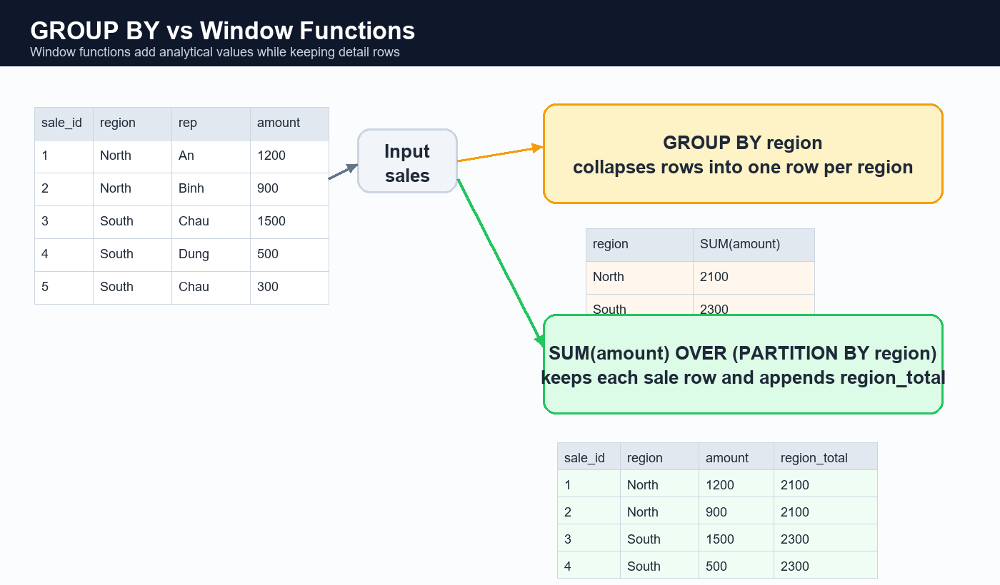
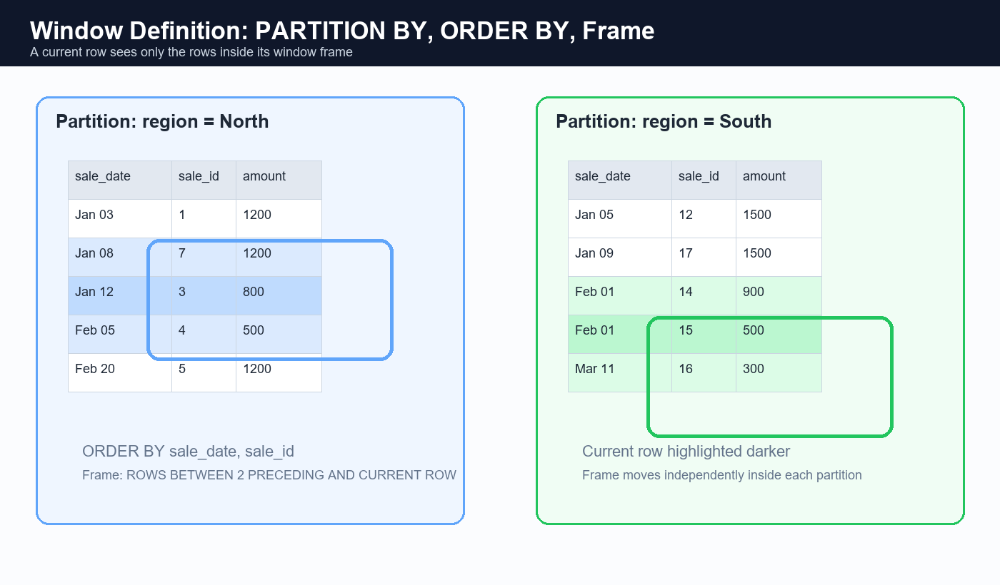
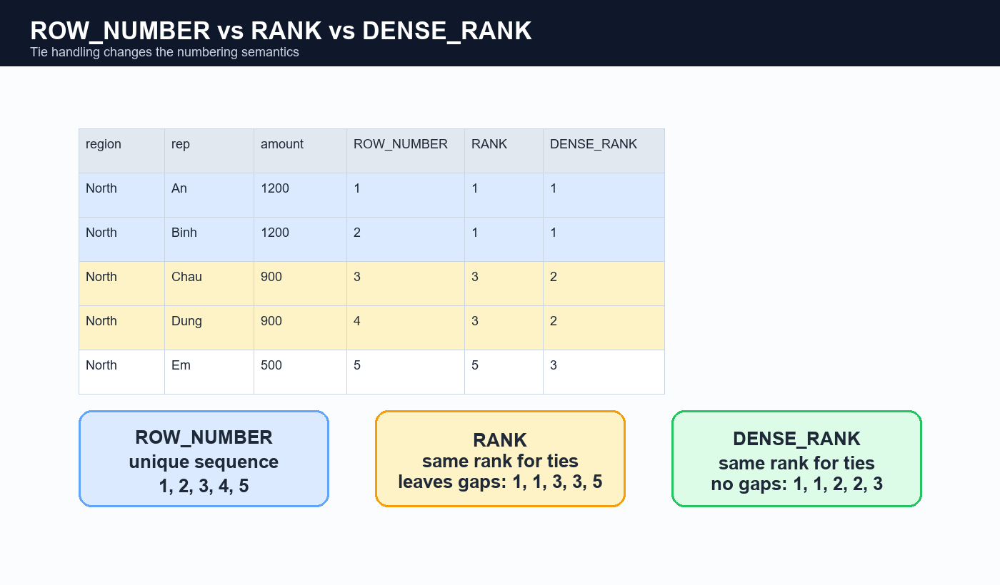
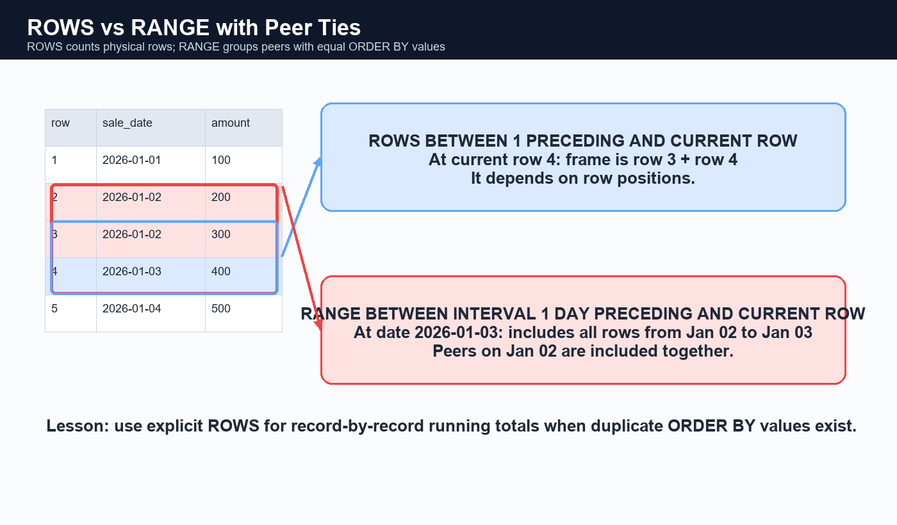

# Tutorial: MySQL Window Functions

## Link tham khảo

### MySQL Tutorial

- [MySQL Window Functions](https://www.mysqltutorial.org/mysql-window-functions/)
- [MySQL CUME_DIST()](https://www.mysqltutorial.org/mysql-window-functions/mysql-cume_dist-function/)
- [MySQL DENSE_RANK()](https://www.mysqltutorial.org/mysql-window-functions/mysql-dense_rank-function/)
- [MySQL FIRST_VALUE()](https://www.mysqltutorial.org/mysql-window-functions/mysql-first_value-function/)
- [MySQL LAG()](https://www.mysqltutorial.org/mysql-window-functions/mysql-lag-function/)
- [MySQL LAST_VALUE()](https://www.mysqltutorial.org/mysql-window-functions/mysql-last_value-function/)
- [MySQL LEAD()](https://www.mysqltutorial.org/mysql-window-functions/mysql-lead-function/)
- [MySQL NTH_VALUE()](https://www.mysqltutorial.org/mysql-window-functions/mysql-nth_value-function/)
- [MySQL NTILE()](https://www.mysqltutorial.org/mysql-window-functions/mysql-ntile-function/)
- [MySQL PERCENT_RANK()](https://www.mysqltutorial.org/mysql-window-functions/mysql-percent_rank-function/)
- [MySQL RANK()](https://www.mysqltutorial.org/mysql-window-functions/mysql-rank-function/)
- [MySQL ROW_NUMBER()](https://www.mysqltutorial.org/mysql-window-functions/mysql-row_number-function/)

### MySQL Reference Manual

- [Window Functions](https://dev.mysql.com/doc/refman/8.4/en/window-functions.html)
- [Window Function Concepts and Syntax](https://dev.mysql.com/doc/refman/8.4/en/window-functions-usage.html)
- [Window Function Frame Specification](https://dev.mysql.com/doc/refman/8.4/en/window-functions-frames.html)
- [Named Windows](https://dev.mysql.com/doc/refman/8.4/en/window-functions-named-windows.html)
- [Window Function Restrictions](https://dev.mysql.com/doc/refman/8.4/en/window-function-restrictions.html)

> **Phiên bản yêu cầu:** MySQL hỗ trợ window functions từ MySQL 8.0. Nếu server đang là MySQL 5.7 hoặc cũ hơn, cú pháp `OVER (...)`, `ROW_NUMBER()`, `LAG()`... không chạy được.
>
> **Phạm vi lab:** Bài dùng schema riêng `window_function_lab`. Phần mở rộng cuối bài có thể dùng `classicmodels` nếu database đó đã tồn tại và người học có quyền `SELECT`.

---

## 1. Mục tiêu học tập

Sau khi hoàn thành bài này, người học có thể:

1. Phân biệt aggregate function với window function.
2. Viết được `function(...) OVER (...)`.
3. Dùng `PARTITION BY`, `ORDER BY` và frame trong window definition.
4. Tính tổng, trung bình, tỷ trọng, running total và moving average.
5. Dùng `ROW_NUMBER`, `RANK`, `DENSE_RANK`.
6. Dùng `LAG`, `LEAD`, `FIRST_VALUE`, `LAST_VALUE`, `NTH_VALUE`.
7. Dùng `NTILE`, `PERCENT_RANK`, `CUME_DIST` để phân đoạn dữ liệu.
8. Phân biệt `ROWS` và `RANGE`, đặc biệt khi có các rows đồng hạng.
9. Dùng named windows bằng `WINDOW ... AS (...)`.
10. Dùng CTE/derived table để lọc theo kết quả window, ví dụ top-N theo nhóm.
11. Nhận biết các restriction của MySQL và các lỗi phổ biến.
12. Viết window queries có thứ tự xác định và dễ bảo trì.

---

## Cách đọc các ví dụ truy vấn trong bài

Từ đây, sau các ví dụ SQL quan trọng, bài giảng bổ sung bốn ý:

1. **Mục tiêu truy vấn:** câu hỏi nghiệp vụ hoặc analytical question mà query trả lời.
2. **Cách hoạt động:** vai trò của `FROM`, `PARTITION BY`, `ORDER BY`, frame, CTE hoặc outer query.
3. **Vì sao dùng window function:** lý do dùng `OVER(...)` thay vì chỉ dùng aggregate với `GROUP BY`.
4. **Cách đọc kết quả:** giá trị/kết quả mẫu dựa trên dữ liệu `window_function_lab` được tạo ở Mục 3.

Các con số mẫu dưới đây được tính từ đúng 21 rows dữ liệu mẫu:

| Nhóm | Tổng doanh thu | Số sales | Trung bình |
|---|---:|---:|---:|
| Toàn công ty | 14,200.00 | 21 | 676.19 |
| North | 7,350.00 | 11 | 668.18 |
| South | 6,850.00 | 10 | 685.00 |

Tổng doanh thu theo sales rep:

| Sales rep | Total revenue |
|---|---:|
| An | 4,200.00 |
| Binh | 3,150.00 |
| Chau | 3,400.00 |
| Dung | 3,450.00 |

> **Lưu ý:** Kết quả chỉ đúng với dataset mẫu trong bài. Khi thay dữ liệu, các con số và ranking sẽ thay đổi, nhưng cách đọc query vẫn giữ nguyên.

---

## 2. Window function là gì?

Window function tính toán trên một tập rows liên quan đến **current row**, nhưng không làm mất các detail rows như `GROUP BY`.

Ví dụ, từ bảng sales ta muốn vừa giữ từng giao dịch, vừa nhìn thấy:

- Tổng doanh thu toàn công ty.
- Tổng doanh thu của region.
- Xếp hạng của giao dịch trong region.
- Doanh thu tích lũy của từng sales rep.
- Chênh lệch doanh thu với giao dịch trước đó.

### 2.1. Aggregate và `GROUP BY`

```sql
SELECT SUM(amount) AS total_revenue
FROM sales;
```

> **Mục tiêu.** Tính tổng doanh thu của toàn bộ bảng `sales`.
> 
> **Cách hoạt động.** `SUM(amount)` cộng giá trị `amount` của tất cả rows. Vì không có `GROUP BY`, MySQL gộp toàn bộ input thành **một result row**.
> 
> **Vì sao chưa dùng `OVER()`.** Ở ví dụ này mục tiêu là tạo một con số tổng duy nhất; không cần giữ từng giao dịch. Vì vậy aggregate thông thường phù hợp hơn window aggregate.
> 
> **Kết quả mẫu.** Query trả một row: `total_revenue = 14200.00`.
> 


Kết quả chỉ còn một row.

```sql
SELECT region,
       SUM(amount) AS region_revenue
FROM sales
GROUP BY region;
```

> **Mục tiêu.** Tính doanh thu cho từng `region`.
> 
> **Cách hoạt động.** `GROUP BY region` gom các rows North thành một group và các rows South thành một group. `SUM(amount)` được tính riêng trên mỗi group.
> 
> **Vì sao chưa dùng `OVER()`.** Query này chỉ cần summary theo region, không cần hiển thị từng sale. Dùng `GROUP BY` sẽ tạo đúng một row summary cho mỗi region.
> 
> **Kết quả mẫu.**
> 
> | region | region_revenue |
> |---|---:|
> | North | 7,350.00 |
> | South | 6,850.00 |
> 


Kết quả còn một row cho mỗi region.

### 2.2. Window aggregate

```sql
SELECT sale_id,
       region,
       amount,
       SUM(amount) OVER (
           PARTITION BY region
       ) AS region_revenue
FROM sales;
```

> **Mục tiêu.** Hiển thị từng sale, đồng thời cho biết tổng doanh thu của region chứa sale đó.
> 
> **Cách hoạt động.**
> - `FROM sales` giữ từng transaction làm một row đầu ra.
> - `PARTITION BY region` chia 21 rows thành hai cửa sổ: North và South.
> - `SUM(amount)` chỉ cộng trong cửa sổ của row hiện tại.
> 
> **Vì sao dùng `OVER(PARTITION BY region)`.** Nếu thay bằng `GROUP BY region`, chỉ còn hai rows summary. `OVER(...)` cho phép vừa giữ detail row, vừa gắn total của group vào detail row.
> 
> **Cách đọc kết quả.** Một sale North, chẳng hạn `sale_id = 1` có `amount = 1200.00`, sẽ mang thêm `region_revenue = 7350.00`. Mọi sale South đều nhận `region_revenue = 6850.00`.
> 


Query vẫn trả về một row cho mỗi sale, đồng thời thêm tổng region vào từng row.

```text
GROUP BY:
    nhiều rows -> ít rows hơn.

Window function:
    nhiều rows -> vẫn nhiều rows,
    nhưng có thêm analytical values trên từng row.
```



*Hinh 1. `GROUP BY` gom nhieu rows thanh it rows hon, con window function giu tung sale va them gia tri phan tich vao moi row.*

### 2.3. Logical query processing và vị trí dùng window function

Ở mức khái niệm, result rows được xác định theo luồng:

```text
FROM
-> WHERE
-> GROUP BY
-> HAVING
-> window functions
-> ORDER BY
-> LIMIT
-> SELECT DISTINCT
```

Vì window functions chạy sau `WHERE`, `GROUP BY`, `HAVING`, MySQL chỉ cho phép dùng chúng trực tiếp trong:

```text
SELECT list
ORDER BY
```

Không thể dùng trực tiếp trong:

```text
WHERE
GROUP BY
HAVING
ON
```

Ví dụ **sai**:

```sql
SELECT sale_id,
       region,
       amount,
       ROW_NUMBER() OVER (
           PARTITION BY region
           ORDER BY amount DESC
       ) AS row_num
FROM sales
WHERE ROW_NUMBER() OVER (
    PARTITION BY region
    ORDER BY amount DESC
) <= 3;
```

> **Vì sao query sai.** `WHERE` được xử lý trước window functions. Ở thời điểm MySQL lọc `WHERE`, alias `row_num` và giá trị `ROW_NUMBER() OVER (...)` chưa được tính.
> 
> **Cách sửa.** Tính window result ở query layer trong CTE/derived table trước; sau đó outer query mới dùng `WHERE row_num <= 3`.
> 


Ví dụ **đúng**: dùng CTE.

```sql
WITH ranked_sales AS (
    SELECT sale_id,
           region,
           amount,
           ROW_NUMBER() OVER (
               PARTITION BY region
               ORDER BY amount DESC, sale_id
           ) AS row_num
    FROM sales
)
SELECT sale_id,
       region,
       amount,
       row_num
FROM ranked_sales
WHERE row_num <= 3;
```

> **Mục tiêu.** Lấy ba sales có amount cao nhất trong mỗi region.
> 
> **Cách hoạt động.**
> - CTE `ranked_sales` vẫn giữ toàn bộ rows nhưng gắn `row_num` cho từng region.
> - `PARTITION BY region` reset thứ tự khi đổi region.
> - `ORDER BY amount DESC, sale_id` xếp amount lớn trước; `sale_id` là tie-breaker để kết quả ổn định.
> - Outer query lọc các rows có `row_num <= 3`.
> 
> **Vì sao dùng `ROW_NUMBER() OVER(...)`.** Cần đánh số **bên trong từng region**, điều mà `LIMIT 3` thông thường không làm được vì `LIMIT` chỉ giới hạn toàn bộ result set.
> 
> **Kết quả mẫu.**
> - North: `sale_id` 1, 5, 7 (đều amount 1,200.00).
> - South: `sale_id` 12, 17 (1,500.00) và 14 (900.00).
> 


### Bài tập thực hành

**Bài 2.1.** Nêu khác biệt cốt lõi giữa `GROUP BY` và window function.  
**Bài 2.2.** Khi nào window function phù hợp hơn `GROUP BY`?  
**Bài 2.3.** Window function có làm giảm số rows của result không?  
**Bài 2.4.** Vì sao `ROW_NUMBER() OVER (...)` không dùng trực tiếp trong `WHERE`?  
**Bài 2.5.** Viết skeleton CTE để lọc rank <= 5.

---

## 3. Chuẩn bị schema `window_function_lab`

> **Cảnh báo:** Script này xóa toàn bộ schema `window_function_lab` nếu schema đã tồn tại.

```sql
DROP DATABASE IF EXISTS window_function_lab;

CREATE DATABASE window_function_lab
    CHARACTER SET utf8mb4
    COLLATE utf8mb4_0900_ai_ci;

USE window_function_lab;
```

### 3.1. Tạo table `sales`

```sql
CREATE TABLE sales (
    sale_id BIGINT UNSIGNED NOT NULL AUTO_INCREMENT,
    sales_rep VARCHAR(50) NOT NULL,
    region VARCHAR(30) NOT NULL,
    product_name VARCHAR(100) NOT NULL,
    sale_date DATE NOT NULL,
    amount DECIMAL(12,2) NOT NULL,
    PRIMARY KEY (sale_id),
    CONSTRAINT ck_sales_amount
        CHECK (amount > 0),
    INDEX idx_sales_rep_date (sales_rep, sale_date, sale_id),
    INDEX idx_sales_region_amount (region, amount)
) ENGINE = InnoDB;
```

### 3.2. Dữ liệu mẫu

Dữ liệu có amounts trùng nhau và có nhiều sales cùng ngày để minh họa ties, `ROWS` và `RANGE`.

```sql
INSERT INTO sales (
    sales_rep,
    region,
    product_name,
    sale_date,
    amount
)
VALUES
    ('An',   'North', 'Laptop',    '2026-01-03', 1200.00),
    ('An',   'North', 'Mouse',     '2026-01-03',  200.00),
    ('An',   'North', 'Monitor',   '2026-01-12',  800.00),
    ('An',   'North', 'Keyboard', '2026-02-05',  500.00),
    ('An',   'North', 'Laptop',    '2026-02-20', 1200.00),
    ('An',   'North', 'Headset',   '2026-03-10',  300.00),

    ('Binh', 'North', 'Laptop',    '2026-01-08', 1200.00),
    ('Binh', 'North', 'Monitor',   '2026-01-25',  900.00),
    ('Binh', 'North', 'Keyboard', '2026-02-10',  500.00),
    ('Binh', 'North', 'Mouse',     '2026-03-03',  250.00),
    ('Binh', 'North', 'Headset',   '2026-03-15',  300.00),

    ('Chau', 'South', 'Laptop',    '2026-01-05', 1500.00),
    ('Chau', 'South', 'Mouse',     '2026-01-18',  200.00),
    ('Chau', 'South', 'Monitor',   '2026-02-01',  900.00),
    ('Chau', 'South', 'Keyboard', '2026-02-01',  500.00),
    ('Chau', 'South', 'Headset',   '2026-03-11',  300.00),

    ('Dung', 'South', 'Laptop',    '2026-01-09', 1500.00),
    ('Dung', 'South', 'Monitor',   '2026-01-27',  900.00),
    ('Dung', 'South', 'Keyboard', '2026-02-17',  500.00),
    ('Dung', 'South', 'Mouse',     '2026-03-07',  250.00),
    ('Dung', 'South', 'Headset',   '2026-03-20',  300.00);
```

### 3.3. Kiểm tra data và version

```sql
SELECT sale_id,
       sales_rep,
       region,
       product_name,
       sale_date,
       amount
FROM sales
ORDER BY region,
         sales_rep,
         sale_date,
         sale_id;
```

> **Mục tiêu.** Xem dữ liệu đầu vào theo một thứ tự có thể kiểm tra được trước khi chạy các window queries.
> 
> **Cách hoạt động.** Final `ORDER BY region, sales_rep, sale_date, sale_id` chỉ sắp xếp cách hiển thị. Nó không thay đổi dữ liệu và không tạo ranking/window calculation.
> 
> **Cách đọc kết quả.** Mỗi region được nhóm trên màn hình; trong region, sales của mỗi rep xuất hiện theo ngày và `sale_id`. Đây là thứ tự thuận tiện để đối chiếu dữ liệu mẫu.
> 


```sql
SELECT VERSION() AS mysql_version;
```

> **Mục tiêu.** Kiểm tra phiên bản MySQL đang chạy.
> 
> **Cách hoạt động.** `VERSION()` trả version của MySQL Server cho session hiện tại.
> 
> **Cách đọc kết quả.** Cần MySQL 8.0+ để các examples dùng `OVER(...)`, `ROW_NUMBER()`, `LAG()`, `WINDOW`... chạy được.
> 


### Bài tập thực hành

**Bài 3.1.** Tạo schema và table.  
**Bài 3.2.** Insert toàn bộ data mẫu.  
**Bài 3.3.** Đếm số rows của `sales`.  
**Bài 3.4.** Kiểm tra indexes bằng `SHOW INDEX FROM sales;`.  
**Bài 3.5.** Kiểm tra MySQL version.

---

## 4. Cú pháp `OVER()`

### 4.1. Dạng tổng quát

```sql
window_function_name(expression) OVER (
    [PARTITION BY expression [, expression ...]]
    [ORDER BY expression [ASC | DESC] [, expression ...]]
    [frame_clause]
)
```

Một số functions không có expression:

```sql
ROW_NUMBER() OVER (...)
RANK() OVER (...)
DENSE_RANK() OVER (...)
CUME_DIST() OVER (...)
PERCENT_RANK() OVER (...)
```

### 4.2. Ba thành phần của window definition

| Thành phần | Câu hỏi cần trả lời | Ví dụ |
|---|---|---|
| `PARTITION BY` | Tính riêng theo nhóm nào? | `PARTITION BY region` |
| `ORDER BY` | Thứ tự logic trong mỗi nhóm là gì? | `ORDER BY sale_date, sale_id` |
| Frame | Current row tính với subset nào? | `ROWS BETWEEN 2 PRECEDING AND CURRENT ROW` |

### 4.3. `OVER()` rỗng

```sql
SELECT sale_id,
       sales_rep,
       amount,
       SUM(amount) OVER () AS company_total
FROM sales;
```

> **Mục tiêu.** Gắn tổng doanh thu toàn công ty lên từng sale.
> 
> **Cách hoạt động.** `OVER()` rỗng nghĩa là toàn bộ result set là **một window duy nhất**. Không có `PARTITION BY`, nên `SUM(amount)` cộng cả 21 rows.
> 
> **Vì sao dùng `OVER()`.** Query cần giữ `sale_id`, `sales_rep`, `amount` của từng giao dịch. Aggregate `SUM(amount)` không có `OVER()` sẽ collapse 21 rows thành một row; `SUM(amount) OVER()` không collapse rows.
> 
> **Kết quả mẫu.** `company_total = 14200.00` xuất hiện lặp lại ở mọi row. Ví dụ:
> 
> | sale_id | sales_rep | amount | company_total |
> |---:|---|---:|---:|
> | 1 | An | 1,200.00 | 14,200.00 |
> | 12 | Chau | 1,500.00 | 14,200.00 |
> 


`OVER()` rỗng nghĩa là toàn bộ result set là một partition duy nhất.

### 4.4. `PARTITION BY`

```sql
SELECT sale_id,
       region,
       amount,
       SUM(amount) OVER (
           PARTITION BY region
       ) AS region_total
FROM sales
ORDER BY region,
         sale_id;
```

> **Mục tiêu.** Gắn tổng doanh thu của region lên từng sale.
> 
> **Cách hoạt động.** `PARTITION BY region` tạo hai partitions. Khi current row thuộc North, `SUM` chỉ thấy 11 rows North; khi thuộc South, `SUM` chỉ thấy 10 rows South.
> 
> **Vì sao dùng `OVER(PARTITION BY region)`.** Cần total theo region nhưng vẫn muốn xem `sale_id` và `amount` của từng giao dịch.
> 
> **Kết quả mẫu.** North rows đều có `region_total = 7350.00`; South rows đều có `region_total = 6850.00`.
> 


Calculation reset khi chuyển sang region mới.

### 4.5. `ORDER BY` bên trong window khác final `ORDER BY`

```sql
SELECT sale_id,
       sales_rep,
       sale_date,
       amount,
       ROW_NUMBER() OVER (
           PARTITION BY sales_rep
           ORDER BY sale_date, sale_id
       ) AS sale_sequence
FROM sales
ORDER BY region,
         sales_rep,
         sale_date,
         sale_id;
```

> **Mục tiêu.** Đánh số thứ tự giao dịch của mỗi sales rep theo thời gian.
> 
> **Cách hoạt động.**
> - `PARTITION BY sales_rep` tạo một sequence độc lập cho An, Binh, Chau, Dung.
> - `ORDER BY sale_date, sale_id` định nghĩa sale nào là thứ nhất, thứ hai...
> - Final `ORDER BY region, sales_rep, sale_date, sale_id` chỉ dùng để display.
> 
> **Vì sao dùng `ROW_NUMBER() OVER(...)`.** Đây là numbering theo từng group, không phải numbering toàn bộ table.
> 
> **Kết quả mẫu.** Với An, `sale_id` 1, 2, 3, 4, 5, 6 có `sale_sequence` lần lượt là 1, 2, 3, 4, 5, 6.
> 


- `ORDER BY` trong `OVER`: định nghĩa ranking, sequence, frame trong partition.
- `ORDER BY` cuối query: định nghĩa thứ tự display result set.

Không giả định window ordering tự sắp final output.

### 4.6. Peer rows

Hai rows là **peers** nếu chúng có cùng tất cả values theo `ORDER BY` trong window definition.

```sql
RANK() OVER (
    PARTITION BY region
    ORDER BY amount DESC
)
```

Các rows cùng `amount` trong region là peers và có cùng rank.

Nếu thêm `sale_id`:

```sql
ORDER BY amount DESC, sale_id
```

thì ties bị break. Điều này tốt cho `ROW_NUMBER()` deterministic, nhưng thay đổi semantics của `RANK()` và `DENSE_RANK()`.



*Hinh 2. `PARTITION BY` chia du lieu thanh nhom, `ORDER BY` xac dinh thu tu trong nhom, va frame di chuyen theo current row.*

### Bài tập thực hành

**Bài 4.1.** Viết `SUM(amount) OVER()`.  
**Bài 4.2.** Viết tổng sales theo region mà không collapse rows.  
**Bài 4.3.** Đánh số sales theo từng rep và sale date.  
**Bài 4.4.** Phân biệt hai `ORDER BY` trong query window.  
**Bài 4.5.** Khi nào rows được gọi là peers?

---

# Phần A. Aggregate window functions

## 5. Tổng toàn cục, tổng theo nhóm và tỷ trọng

### 5.1. Tổng doanh thu toàn công ty

```sql
SELECT sale_id,
       sales_rep,
       region,
       amount,
       SUM(amount) OVER () AS total_revenue
FROM sales
ORDER BY sale_id;
```

> **Mục tiêu.** Lặp lại ví dụ tổng công ty trong một section riêng về aggregate window functions.
> 
> **Vì sao dùng `OVER()`.** `SUM(amount) OVER()` tính một total toàn bảng rồi gắn lại total đó vào **mỗi** detail row; `SUM(amount)` không có `OVER()` chỉ trả một summary row.
> 
> **Kết quả mẫu.** Mỗi sale đều có `total_revenue = 14200.00`.
> 


### 5.2. Tổng theo region

```sql
SELECT sale_id,
       sales_rep,
       region,
       amount,
       SUM(amount) OVER (
           PARTITION BY region
       ) AS region_revenue
FROM sales
ORDER BY region,
         sale_id;
```

> **Mục tiêu.** So sánh amount của một sale với tổng doanh thu region của chính nó.
> 
> **Vì sao dùng `PARTITION BY region`.** Nó reset aggregation cho mỗi region, nên không trộn North với South.
> 
> **Kết quả mẫu.** `sale_id = 7` thuộc North có amount 1,200.00 và `region_revenue = 7,350.00`; `sale_id = 12` thuộc South có `region_revenue = 6,850.00`.
> 


### 5.3. Tổng theo sales rep

```sql
SELECT sale_id,
       sales_rep,
       sale_date,
       amount,
       SUM(amount) OVER (
           PARTITION BY sales_rep
       ) AS rep_revenue
FROM sales
ORDER BY sales_rep,
         sale_date,
         sale_id;
```

> **Mục tiêu.** Hiển thị từng sale cùng doanh thu tổng của sales rep tạo sale đó.
> 
> **Vì sao dùng `OVER(PARTITION BY sales_rep)`.** Mỗi row vẫn là một sale, nhưng aggregate chỉ cộng những rows của cùng rep.
> 
> **Kết quả mẫu.**
> - Mọi rows của An có `rep_revenue = 4200.00`.
> - Mọi rows của Binh có `rep_revenue = 3150.00`.
> - Chau: 3400.00; Dung: 3450.00.
> 


### 5.4. Tỷ trọng một sale trong region

```sql
SELECT sale_id,
       region,
       sales_rep,
       amount,
       SUM(amount) OVER (
           PARTITION BY region
       ) AS region_revenue,
       ROUND(
           100.0 * amount
           / SUM(amount) OVER (
               PARTITION BY region
           ),
           2
       ) AS pct_of_region
FROM sales
ORDER BY region,
         amount DESC,
         sale_id;
```

> **Mục tiêu.** Tính tỷ trọng một sale trong tổng doanh thu region.
> 
> **Cách hoạt động.**
> - Numerator là `amount` của current row.
> - Denominator là `SUM(amount) OVER (PARTITION BY region)`.
> - Nhân `100.0` để biểu diễn theo phần trăm; `ROUND(..., 2)` chỉ làm tròn để dễ đọc.
> 
> **Vì sao dùng window aggregate.** Denominator phải là tổng của region nhưng row hiện tại vẫn phải tồn tại để dùng `amount`.
> 
> **Kết quả mẫu.**
> - `sale_id = 1`: `1200 / 7350 × 100 = 16.33%`.
> - `sale_id = 12`: `1500 / 6850 × 100 = 21.90%`.
> 


Nếu denominator có thể bằng 0 ở bài toán khác, dùng `NULLIF(denominator, 0)`.

### 5.5. COUNT, AVG, MIN và MAX

```sql
SELECT sale_id,
       region,
       amount,
       COUNT(*) OVER (
           PARTITION BY region
       ) AS sales_count_in_region,
       ROUND(
           AVG(amount) OVER (
               PARTITION BY region
           ),
           2
       ) AS avg_amount_in_region,
       MIN(amount) OVER (
           PARTITION BY region
       ) AS min_amount_in_region,
       MAX(amount) OVER (
           PARTITION BY region
       ) AS max_amount_in_region
FROM sales
ORDER BY region,
         sale_id;
```

> **Mục tiêu.** Gắn bốn statistics của region vào từng sale: số giao dịch, trung bình, min, max.
> 
> **Vì sao dùng các hàm với `OVER(PARTITION BY region)`.** Bốn statistics được tính ở cấp region nhưng không làm mất sale-level detail.
> 
> **Kết quả mẫu.**
> 
> | region | count | avg | min | max |
> |---|---:|---:|---:|---:|
> | North | 11 | 668.18 | 200.00 | 1,200.00 |
> | South | 10 | 685.00 | 200.00 | 1,500.00 |
> 
> Ví dụ mọi rows North nhận cùng bốn values ở dòng North.
> 


### 5.6. So sánh sale với trung bình của rep

```sql
SELECT sale_id,
       sales_rep,
       sale_date,
       amount,
       ROUND(
           AVG(amount) OVER (
               PARTITION BY sales_rep
           ),
           2
       ) AS rep_avg_amount,
       ROUND(
           amount - AVG(amount) OVER (
               PARTITION BY sales_rep
           ),
           2
       ) AS difference_from_rep_avg
FROM sales
ORDER BY sales_rep,
         sale_date,
         sale_id;
```

> **Mục tiêu.** Đo sale hiện tại cao/thấp hơn mức trung bình của chính sales rep bao nhiêu.
> 
> **Cách hoạt động.**
> - `AVG(amount) OVER (PARTITION BY sales_rep)` tạo average của rep.
> - `amount - average` cho deviation của current sale.
> 
> **Vì sao dùng window average.** Cần average theo rep trên cùng output với từng transaction.
> 
> **Kết quả mẫu.** An có average `4200 / 6 = 700.00`. Vì vậy:
> - `sale_id = 1`, amount 1,200.00, difference = `+500.00`.
> - `sale_id = 2`, amount 200.00, difference = `-500.00`.
> 


### Bài tập thực hành

**Bài 5.1.** Hiển thị mỗi sale với company total.  
**Bài 5.2.** Hiển thị mỗi sale với region total.  
**Bài 5.3.** Tính total và average của mỗi sales rep.  
**Bài 5.4.** Tính phần trăm mỗi sale trong total của sales rep.  
**Bài 5.5.** Lấy sales có amount cao hơn average amount của region. Gợi ý: CTE hoặc derived table.

## 6. Running total

### 6.1. Running total theo sales rep

```sql
SELECT sale_id,
       sales_rep,
       sale_date,
       amount,
       SUM(amount) OVER (
           PARTITION BY sales_rep
           ORDER BY sale_date, sale_id
           ROWS BETWEEN UNBOUNDED PRECEDING
                    AND CURRENT ROW
       ) AS running_revenue
FROM sales
ORDER BY sales_rep,
         sale_date,
         sale_id;
```

> **Mục tiêu.** Tính doanh thu tích lũy theo thời gian cho từng sales rep.
> 
> **Cách hoạt động.**
> - Partition reset khi đổi rep.
> - `ORDER BY sale_date, sale_id` tạo sequence thời gian xác định.
> - `ROWS BETWEEN UNBOUNDED PRECEDING AND CURRENT ROW` lấy từ sale đầu tiên của rep đến current sale.
> 
> **Vì sao phải dùng `ROWS`.** Requirement nói running total theo **từng record**. `ROWS` xử lý từng physical row theo order, tránh việc peer rows cùng ngày bị cộng chung như default `RANGE`.
> 
> **Kết quả mẫu của An.**
> 
> | sale_id | amount | running_revenue |
> |---:|---:|---:|
> | 1 | 1,200.00 | 1,200.00 |
> | 2 | 200.00 | 1,400.00 |
> | 3 | 800.00 | 2,200.00 |
> | 4 | 500.00 | 2,700.00 |
> | 5 | 1,200.00 | 3,900.00 |
> | 6 | 300.00 | 4,200.00 |
> 


`ROWS BETWEEN UNBOUNDED PRECEDING AND CURRENT ROW` có thể viết ngắn là:

```sql
ROWS UNBOUNDED PRECEDING
```

Trong tutorial này dùng form đầy đủ để thấy rõ boundaries.

### 6.2. Running total toàn company

```sql
SELECT sale_id,
       sale_date,
       amount,
       SUM(amount) OVER (
           ORDER BY sale_date, sale_id
           ROWS BETWEEN UNBOUNDED PRECEDING
                    AND CURRENT ROW
       ) AS company_running_revenue
FROM sales
ORDER BY sale_date,
         sale_id;
```

> **Mục tiêu.** Tính doanh thu tích lũy của toàn công ty theo thời gian.
> 
> **Cách hoạt động.** Không có `PARTITION BY`, nên không reset theo rep/region. Frame luôn chạy từ first sale toàn company đến current sale trong order `sale_date, sale_id`.
> 
> **Kết quả mẫu.** Hai rows đầu là sale 1 và 2 ngày 2026-01-03:
> - Sau sale 1: `1,200.00`.
> - Sau sale 2: `1,400.00`.
> Sau sale 12 ngày 2026-01-05: `2,900.00`.
> 


### 6.3. Running count

```sql
SELECT sale_id,
       sales_rep,
       sale_date,
       COUNT(*) OVER (
           PARTITION BY sales_rep
           ORDER BY sale_date, sale_id
           ROWS BETWEEN UNBOUNDED PRECEDING
                    AND CURRENT ROW
       ) AS sale_number_for_rep
FROM sales
ORDER BY sales_rep,
         sale_date,
         sale_id;
```

> **Mục tiêu.** Đánh số giao dịch lũy kế của mỗi rep bằng aggregate `COUNT(*)`.
> 
> **Vì sao dùng `COUNT(*) OVER(...)`.** Không chỉ muốn số rows cuối cùng của rep; cần biết tại mỗi row, đây là giao dịch thứ mấy theo timeline.
> 
> **Kết quả mẫu.** Với Binh, `sale_number_for_rep` chạy từ 1 đến 5. Giá trị ở row cuối Binh là 5 vì Binh có 5 sales.
> 


### Bài tập thực hành

**Bài 6.1.** Tính running revenue cho mỗi rep.  
**Bài 6.2.** Tính running revenue cho mỗi region.  
**Bài 6.3.** Tính running count cho mỗi sales rep.  
**Bài 6.4.** Giải thích vì sao thêm `sale_id` sau `sale_date`.  
**Bài 6.5.** Tính phần trăm running revenue/current company total.

## 7. Moving average và rolling windows

### 7.1. Moving average của ba sales gần nhất

```sql
SELECT sale_id,
       sales_rep,
       sale_date,
       amount,
       ROUND(
           AVG(amount) OVER (
               PARTITION BY sales_rep
               ORDER BY sale_date, sale_id
               ROWS BETWEEN 2 PRECEDING
                        AND CURRENT ROW
           ),
           2
       ) AS moving_avg_last_3_sales
FROM sales
ORDER BY sales_rep,
         sale_date,
         sale_id;
```

> **Mục tiêu.** Tính average của current sale và tối đa hai sales trước đó của cùng rep.
> 
> **Cách hoạt động.** Frame `ROWS BETWEEN 2 PRECEDING AND CURRENT ROW` có tối đa ba rows. Ở đầu partition, số rows trong frame nhỏ hơn ba.
> 
> **Kết quả mẫu của An.**
> 
> | sale_id | amount | moving_avg_last_3_sales |
> |---:|---:|---:|
> | 1 | 1,200.00 | 1,200.00 |
> | 2 | 200.00 | 700.00 |
> | 3 | 800.00 | 733.33 |
> | 4 | 500.00 | 500.00 |
> | 5 | 1,200.00 | 833.33 |
> | 6 | 300.00 | 666.67 |
> 
> Ví dụ tại sale 5, average là `(800 + 500 + 1200) / 3 = 833.33`.
> 


Ở row đầu partition frame chỉ có 1 row; ở row thứ hai có 2 rows; từ row thứ ba trở đi có tối đa 3 rows.

### 7.2. Centered moving average

```sql
SELECT sale_id,
       sales_rep,
       sale_date,
       amount,
       ROUND(
           AVG(amount) OVER (
               PARTITION BY sales_rep
               ORDER BY sale_date, sale_id
               ROWS BETWEEN 1 PRECEDING
                        AND 1 FOLLOWING
           ),
           2
       ) AS centered_moving_avg
FROM sales
ORDER BY sales_rep,
         sale_date,
         sale_id;
```

> **Mục tiêu.** Làm mượt amount bằng average của previous row, current row và next row.
> 
> **Cách hoạt động.** Frame `1 PRECEDING AND 1 FOLLOWING` nhìn cả hai phía current row. Row đầu/cuối chỉ có những rows thực sự tồn tại.
> 
> **Kết quả mẫu của An.**
> - Sale 1: average `(1200 + 200)/2 = 700.00`.
> - Sale 2: average `(1200 + 200 + 800)/3 = 733.33`.
> - Sale 6: average `(1200 + 300)/2 = 750.00`.
> 


### 7.3. Tổng current + previous sale

```sql
SELECT sale_id,
       sales_rep,
       sale_date,
       amount,
       SUM(amount) OVER (
           PARTITION BY sales_rep
           ORDER BY sale_date, sale_id
           ROWS BETWEEN 1 PRECEDING
                    AND CURRENT ROW
       ) AS total_current_and_previous
FROM sales
ORDER BY sales_rep,
         sale_date,
         sale_id;
```

> **Mục tiêu.** Tính tổng của current sale và sale ngay trước nó cho từng rep.
> 
> **Vì sao dùng frame `1 PRECEDING ... CURRENT ROW`.** Requirement chỉ quan tâm một row ngay trước, không phải tất cả history.
> 
> **Kết quả mẫu của An.**
> - Sale 1: 1,200.00 vì chưa có previous row.
> - Sale 2: `1,200 + 200 = 1,400.00`.
> - Sale 3: `200 + 800 = 1,000.00`.
> 


### Bài tập thực hành

**Bài 7.1.** Tính average current sale và hai sales trước.  
**Bài 7.2.** Tính total current sale và sale trước.  
**Bài 7.3.** Tính centered moving average 3 rows.  
**Bài 7.4.** Vì sao frame ở cuối partition có thể ít hơn 3 rows?  
**Bài 7.5.** Requirement “3 giao dịch gần nhất” nên dùng `ROWS` hay `RANGE`? Giải thích.

# Phần B. Ranking functions

## 8. ROW_NUMBER, RANK và DENSE_RANK

### 8.1. Cùng một thứ tự, ba cách đánh số

Giả sử amounts theo descending order:

```text
1500
1200
1200
900
```

| Function | Kết quả |
|---|---|
| `ROW_NUMBER()` | 1, 2, 3, 4 |
| `RANK()` | 1, 2, 2, 4 |
| `DENSE_RANK()` | 1, 2, 2, 3 |

### 8.2. ROW_NUMBER

```sql
SELECT sale_id,
       region,
       sales_rep,
       amount,
       ROW_NUMBER() OVER (
           PARTITION BY region
           ORDER BY amount DESC, sale_id
       ) AS row_num_in_region
FROM sales
ORDER BY region,
         row_num_in_region;
```

> **Mục tiêu.** Gán số thứ tự duy nhất cho mọi sale trong từng region, ưu tiên amount lớn.
> 
> **Cách hoạt động.** `ORDER BY amount DESC, sale_id` đảm bảo tie-break deterministic. Các rows amount 1,200 trong North được xếp theo `sale_id` 1, 5, 7 và nhận `row_num` 1, 2, 3.
> 
> **Vì sao dùng `ROW_NUMBER`.** Requirement là một sequence unique, nên ties không được giữ cùng số.
> 


`ROW_NUMBER()` luôn trả integer unique trong partition. Dùng khi cần:

```text
- Chọn chính xác N rows theo nhóm.
- Deduplicate, giữ newest/oldest record.
- Pagination theo group.
- Một đại diện duy nhất cho mỗi business key.
```

### 8.3. RANK

```sql
SELECT sale_id,
       region,
       sales_rep,
       amount,
       RANK() OVER (
           PARTITION BY region
           ORDER BY amount DESC
       ) AS amount_rank
FROM sales
ORDER BY region,
         amount DESC,
         sale_id;
```

> **Mục tiêu.** Xếp hạng sales theo amount trong region theo kiểu ranking có ties.
> 
> **Vì sao dùng `RANK`.** Hai sales cùng amount phải có cùng rank. Sau một group ties, rank tiếp theo có gap.
> 
> **Kết quả mẫu North.**
> - Amount 1,200.00: sale IDs 1, 5, 7 đều rank 1.
> - Amount 900.00: sale 8 rank 4, vì có ba rows đứng trước.
> - Amount 800.00: sale 3 rank 5.
> 


`RANK()` giữ ties và tạo gap sau ties.

### 8.4. DENSE_RANK

```sql
SELECT sale_id,
       region,
       sales_rep,
       amount,
       DENSE_RANK() OVER (
           PARTITION BY region
           ORDER BY amount DESC
       ) AS dense_amount_rank
FROM sales
ORDER BY region,
         amount DESC,
         sale_id;
```

> **Mục tiêu.** Xếp hạng amount theo level không bỏ số sau ties.
> 
> **Vì sao dùng `DENSE_RANK`.** Nếu business muốn các distinct amount levels liên tiếp 1, 2, 3..., dùng dense ranking thay vì ranking kiểu thể thao.
> 
> **Kết quả mẫu North.**
> - 1,200.00 có dense rank 1.
> - 900.00 có dense rank 2.
> - 800.00 có dense rank 3.
> - 500.00 có dense rank 4.
> 


`DENSE_RANK()` giữ ties nhưng không bỏ số rank sau ties.

### 8.5. Rule chọn function

| Requirement | Function phù hợp |
|---|---|
| Lấy chính xác N rows, tie-break deterministic | `ROW_NUMBER()` |
| Xếp hạng kiểu thể thao, có gaps | `RANK()` |
| Phân loại thứ hạng distinct không gaps | `DENSE_RANK()` |
| Top 3 amount levels | `DENSE_RANK()` |
| Giữ newest row trong mỗi duplicate group | `ROW_NUMBER()` |

### 8.6. Determinism và ties

Query sau không tạo deterministic sequence giữa tied amounts:

```sql
ROW_NUMBER() OVER (
    PARTITION BY region
    ORDER BY amount DESC
)
```

Nếu cần exactly one reproducible row order:

```sql
ROW_NUMBER() OVER (
    PARTITION BY region
    ORDER BY amount DESC, sale_id
)
```

Nhưng không thêm `sale_id` vào window ranking nếu business muốn amounts bằng nhau giữ same rank. Có thể tính cả hai:

```sql
SELECT sale_id,
       region,
       amount,
       RANK() OVER (
           PARTITION BY region
           ORDER BY amount DESC
       ) AS business_rank_by_amount,
       ROW_NUMBER() OVER (
           PARTITION BY region
           ORDER BY amount DESC, sale_id
       ) AS deterministic_row_number
FROM sales
ORDER BY region,
         amount DESC,
         sale_id;
```

> **Mục tiêu.** Hiển thị đồng thời hai khái niệm:
> - `business_rank_by_amount`: rank nghiệp vụ, giữ ties.
> - `deterministic_row_number`: thứ tự kỹ thuật duy nhất để chọn đúng một row hoặc top exactly N.
> 
> **Vì sao cần hai window expressions.** Một `ORDER BY amount DESC, sale_id` là tốt cho `ROW_NUMBER`, nhưng sẽ tách ties nếu dùng cho `RANK`. Vì vậy rank nghiệp vụ chỉ order theo `amount DESC`, còn row number thêm `sale_id`.
> 
> **Cách đọc kết quả.** North sale IDs 1, 5, 7 cùng `business_rank_by_amount = 1`, nhưng có deterministic row numbers 1, 2, 3.
> 




*Hinh 3. `ROW_NUMBER`, `RANK` va `DENSE_RANK` khac nhau o cach xu ly cac rows dong hang.*

### Bài tập thực hành

**Bài 8.1.** Rank sales trong mỗi region theo amount.  
**Bài 8.2.** Làm lại bằng `DENSE_RANK()`.  
**Bài 8.3.** Dùng ROW_NUMBER deterministic với `amount DESC, sale_id`.  
**Bài 8.4.** Cho amounts 100, 100, 80, 50: hãy ghi 3 dãy kết quả.  
**Bài 8.5.** Chọn function cho yêu cầu “mỗi region lấy chính xác 2 sales lớn nhất”.

## 9. Top-N per group

### 9.1. Top exactly 2 rows

```sql
WITH ranked_sales AS (
    SELECT sale_id,
           region,
           sales_rep,
           product_name,
           amount,
           ROW_NUMBER() OVER (
               PARTITION BY region
               ORDER BY amount DESC, sale_id
           ) AS row_num
    FROM sales
)
SELECT sale_id,
       region,
       sales_rep,
       product_name,
       amount,
       row_num
FROM ranked_sales
WHERE row_num <= 2
ORDER BY region,
         row_num;
```

> **Mục tiêu.** Lấy **chính xác tối đa hai rows** mỗi region.
> 
> **Cách hoạt động.** CTE tạo `ROW_NUMBER` unique; outer query giữ `row_num <= 2`.
> 
> **Vì sao dùng `ROW_NUMBER`.** Ties vẫn được giải quyết bằng `sale_id`, nên mỗi region không thể trả về quá hai rows.
> 
> **Kết quả mẫu.**
> - North: sale IDs 1 và 5.
> - South: sale IDs 12 và 17.
> 


Mỗi region trả về tối đa 2 rows.

### 9.2. Top 2 ranks, giữ all ties

```sql
WITH ranked_sales AS (
    SELECT sale_id,
           region,
           sales_rep,
           product_name,
           amount,
           RANK() OVER (
               PARTITION BY region
               ORDER BY amount DESC
           ) AS amount_rank
    FROM sales
)
SELECT sale_id,
       region,
       sales_rep,
       product_name,
       amount,
       amount_rank
FROM ranked_sales
WHERE amount_rank <= 2
ORDER BY region,
         amount DESC,
         sale_id;
```

> **Mục tiêu.** Lấy các sales thuộc **hai rank đầu tiên**, đồng thời giữ ties.
> 
> **Vì sao dùng `RANK`.** Rows equal amount có cùng rank. Vì có thể xuất hiện gap, điều kiện `amount_rank <= 2` không có nghĩa “luôn lấy hai mức amount khác nhau”.
> 
> **Kết quả mẫu.**
> - North: chỉ có ba rows amount 1,200.00 ở rank 1. Rank kế tiếp là 4, nên không row nào có rank 2.
> - South: hai rows amount 1,500.00 ở rank 1; rank tiếp theo là 3.
> 
> Vì vậy result có thể không có đủ hai rank levels như người học ban đầu kỳ vọng.
> 


Một region có thể trả về hơn 2 rows vì ties.

### 9.3. Top 3 distinct levels

```sql
WITH ranked_sales AS (
    SELECT sale_id,
           region,
           sales_rep,
           amount,
           DENSE_RANK() OVER (
               PARTITION BY region
               ORDER BY amount DESC
           ) AS amount_level
    FROM sales
)
SELECT sale_id,
       region,
       sales_rep,
       amount,
       amount_level
FROM ranked_sales
WHERE amount_level <= 3
ORDER BY region,
         amount DESC,
         sale_id;
```

> **Mục tiêu.** Lấy ba **distinct amount levels** cao nhất trong mỗi region.
> 
> **Vì sao dùng `DENSE_RANK`.** Dense rank không có gaps, nên `amount_level <= 3` đúng nghĩa là ba mức amount khác nhau đầu tiên.
> 
> **Kết quả mẫu.**
> - North: levels 1,200; 900; 800, tương ứng 5 rows.
> - South: levels 1,500; 900; 500, tương ứng 6 rows.
> 


### 9.4. Deduplicate: giữ newest row

Giả sử business key là `(sales_rep, product_name)` và giữ sale mới nhất:

```sql
WITH numbered AS (
    SELECT sale_id,
           sales_rep,
           product_name,
           sale_date,
           amount,
           ROW_NUMBER() OVER (
               PARTITION BY sales_rep, product_name
               ORDER BY sale_date DESC, sale_id DESC
           ) AS row_num
    FROM sales
)
SELECT sale_id,
       sales_rep,
       product_name,
       sale_date,
       amount
FROM numbered
WHERE row_num = 1;
```

> **Mục tiêu.** Giữ một sale mới nhất cho mỗi cặp `(sales_rep, product_name)`.
> 
> **Cách hoạt động.**
> - `PARTITION BY sales_rep, product_name` tạo nhóm potential duplicates.
> - `ORDER BY sale_date DESC, sale_id DESC` đưa bản ghi mới nhất lên `row_num = 1`.
> - Outer query giữ `row_num = 1`.
> 
> **Vì sao dùng `ROW_NUMBER`.** Nó diễn đạt trực tiếp rule “mỗi group chọn exactly one winner”.
> 
> **Cách đọc kết quả.** Với An + Laptop, sale 5 ngày 2026-02-20 được giữ thay sale 1 ngày 2026-01-03.
> 


### Bài tập thực hành

**Bài 9.1.** Lấy top 3 sales theo amount trong mỗi region.  
**Bài 9.2.** Lấy top 2 ranks mỗi region, giữ all ties.  
**Bài 9.3.** Lấy top 3 distinct levels.  
**Bài 9.4.** Dùng ROW_NUMBER lấy sale mới nhất của mỗi rep.  
**Bài 9.5.** Khi nào top-N trả về nhiều hơn N rows?

# Phần C. Value functions

## 10. LAG và LEAD

### 10.1. Cú pháp

```sql
LAG(expression [, offset [, default_value]]) OVER (...)
LEAD(expression [, offset [, default_value]]) OVER (...)
```

- `offset` mặc định là `1`.
- `default_value` mặc định là `NULL`.
- `offset = 0` nghĩa là current row.

### 10.2. So sánh current sale với previous sale

```sql
SELECT sale_id,
       sales_rep,
       sale_date,
       amount,
       LAG(amount) OVER (
           PARTITION BY sales_rep
           ORDER BY sale_date, sale_id
       ) AS previous_amount,
       amount - LAG(amount) OVER (
           PARTITION BY sales_rep
           ORDER BY sale_date, sale_id
       ) AS change_from_previous
FROM sales
ORDER BY sales_rep,
         sale_date,
         sale_id;
```

> **Mục tiêu.** So sánh amount của current sale với sale liền trước của cùng rep.
> 
> **Cách hoạt động.**
> - `LAG(amount)` đọc amount của previous row trong order `sale_date, sale_id`.
> - Expression `amount - LAG(amount)` tính thay đổi so với previous amount.
> - First row của mỗi rep không có previous row nên kết quả là `NULL`.
> 
> **Kết quả mẫu của An.**
> 
> | sale_id | amount | previous_amount | change_from_previous |
> |---:|---:|---:|---:|
> | 1 | 1,200.00 | NULL | NULL |
> | 2 | 200.00 | 1,200.00 | -1,000.00 |
> | 3 | 800.00 | 200.00 | 600.00 |
> 


First row mỗi rep có `previous_amount = NULL`.

### 10.3. Default value

```sql
SELECT sale_id,
       sales_rep,
       sale_date,
       amount,
       LAG(amount, 1, 0) OVER (
           PARTITION BY sales_rep
           ORDER BY sale_date, sale_id
       ) AS previous_amount_or_zero
FROM sales
ORDER BY sales_rep,
         sale_date,
         sale_id;
```

> **Mục tiêu.** Thay `NULL` ở first row bằng giá trị default 0.
> 
> **Cách hoạt động.** Tham số thứ ba của `LAG(amount, 1, 0)` là default value khi không tìm được row cách current row một vị trí.
> 
> **Cách đọc kết quả.** First sale của mỗi rep sẽ có `previous_amount_or_zero = 0`. Đây chỉ phù hợp khi business muốn coi “không có sale trước” như zero; nếu cần phân biệt rõ absence với numeric zero, giữ `NULL`.
> 


`0` khác `NULL`:

```text
NULL = không tồn tại previous row.
0    = bạn quyết định thay previous missing bằng numeric zero.
```

### 10.4. LEAD nhìn trước

```sql
SELECT sale_id,
       sales_rep,
       sale_date,
       amount,
       LEAD(amount) OVER (
           PARTITION BY sales_rep
           ORDER BY sale_date, sale_id
       ) AS next_amount,
       LEAD(sale_date) OVER (
           PARTITION BY sales_rep
           ORDER BY sale_date, sale_id
       ) AS next_sale_date
FROM sales
ORDER BY sales_rep,
         sale_date,
         sale_id;
```

> **Mục tiêu.** Xem trước sale kế tiếp của từng rep.
> 
> **Cách hoạt động.** `LEAD(amount)` và `LEAD(sale_date)` lấy values của next row theo cùng ordering.
> 
> **Cách đọc kết quả.** Với An:
> - Sale 1 có `next_amount = 200.00`, `next_sale_date = 2026-01-03`.
> - Sale 6 là last row nên hai columns `next_*` là `NULL`.
> 


### 10.5. Days since previous sale

```sql
SELECT sale_id,
       sales_rep,
       sale_date,
       LAG(sale_date) OVER (
           PARTITION BY sales_rep
           ORDER BY sale_date, sale_id
       ) AS previous_sale_date,
       DATEDIFF(
           sale_date,
           LAG(sale_date) OVER (
               PARTITION BY sales_rep
               ORDER BY sale_date, sale_id
           )
       ) AS days_since_previous_sale
FROM sales
ORDER BY sales_rep,
         sale_date,
         sale_id;
```

> **Mục tiêu.** Tính số ngày giữa current sale và previous sale của cùng rep.
> 
> **Cách hoạt động.** `LAG(sale_date)` trả previous date, sau đó `DATEDIFF(current_date, previous_date)` trả số ngày chênh.
> 
> **Kết quả mẫu của An.**
> - Sale 1: `NULL` vì không có previous sale.
> - Sale 2: `0` ngày vì cùng ngày 2026-01-03.
> - Sale 3: `9` ngày vì từ 2026-01-03 đến 2026-01-12.
> 


### 10.6. LAG/LEAD phải có business order

Không viết:

```sql
LAG(amount) OVER (
    PARTITION BY sales_rep
)
```

Hãy xác định previous/next theo:

```text
- event timestamp
- version number
- fiscal period
- status transition time
- sequence id
```

### Bài tập thực hành

**Bài 10.1.** Hiển thị current amount và previous amount.  
**Bài 10.2.** Tính difference with previous amount.  
**Bài 10.3.** Hiển thị next sale date của rep.  
**Bài 10.4.** Tính số ngày từ sale trước.  
**Bài 10.5.** Giải thích default `NULL` khác `0` như thế nào.

## 11. FIRST_VALUE, LAST_VALUE và NTH_VALUE

### 11.1. FIRST_VALUE

```sql
SELECT sale_id,
       sales_rep,
       sale_date,
       amount,
       FIRST_VALUE(amount) OVER (
           PARTITION BY sales_rep
           ORDER BY sale_date, sale_id
           ROWS BETWEEN UNBOUNDED PRECEDING
                    AND UNBOUNDED FOLLOWING
       ) AS first_sale_amount
FROM sales
ORDER BY sales_rep,
         sale_date,
         sale_id;
```

> **Mục tiêu.** Gắn amount của sale đầu tiên vào mọi sale của cùng rep.
> 
> **Vì sao dùng full-partition frame.** `FIRST_VALUE` trả first value của **frame**. Full frame giúp intention rõ ràng: first row của whole partition, không chỉ first row của current running frame.
> 
> **Kết quả mẫu.**
> - Tất cả rows của An có `first_sale_amount = 1200.00`.
> - Tất cả rows của Chau có `first_sale_amount = 1500.00`.
> 


### 11.2. LAST_VALUE: lỗi frame rất phổ biến

Nhiều người kỳ vọng query này trả last value of whole partition:

```sql
LAST_VALUE(amount) OVER (
    PARTITION BY sales_rep
    ORDER BY sale_date, sale_id
)
```

> **Vì sao ví dụ này dễ sai kỳ vọng.** Với `ORDER BY` nhưng không ghi frame, MySQL dùng default frame kết thúc ở current row. Vì vậy `LAST_VALUE(amount)` nhìn “last value của frame hiện tại”, thường chính là amount hiện tại.
> 
> **Ví dụ với An.** Ở sale 3, expression có thể trả 800.00, không phải last sale 300.00 của An. Muốn true last value của toàn partition, dùng explicit frame ở query kế tiếp.
> 


Nhưng có `ORDER BY` mà không chỉ rõ frame, MySQL default là:

```sql
RANGE BETWEEN UNBOUNDED PRECEDING
          AND CURRENT ROW
```

Vì frame kết thúc tại current row, `LAST_VALUE()` thường trả current row hoặc peer cuối current frame, không phải final row của partition.

### 11.3. Lấy true last value

```sql
SELECT sale_id,
       sales_rep,
       sale_date,
       amount,
       LAST_VALUE(amount) OVER (
           PARTITION BY sales_rep
           ORDER BY sale_date, sale_id
           ROWS BETWEEN UNBOUNDED PRECEDING
                    AND UNBOUNDED FOLLOWING
       ) AS last_sale_amount
FROM sales
ORDER BY sales_rep,
         sale_date,
         sale_id;
```

> **Mục tiêu.** Gắn amount của sale cuối cùng vào mọi rows của mỗi rep.
> 
> **Cách hoạt động.** `UNBOUNDED FOLLOWING` mở frame đến row cuối partition. Nhờ đó `LAST_VALUE` thật sự thấy final sale thay vì chỉ thấy current running frame.
> 
> **Kết quả mẫu.**
> - Mọi rows của An/Binh/Chau/Dung đều có `last_sale_amount = 300.00`, vì sale cuối cùng của mỗi người trong dataset đều amount 300.00.
> 


### 11.4. NTH_VALUE

```sql
SELECT sale_id,
       sales_rep,
       sale_date,
       amount,
       NTH_VALUE(amount, 2) OVER (
           PARTITION BY sales_rep
           ORDER BY sale_date, sale_id
           ROWS BETWEEN UNBOUNDED PRECEDING
                    AND UNBOUNDED FOLLOWING
       ) AS second_sale_amount
FROM sales
ORDER BY sales_rep,
         sale_date,
         sale_id;
```

> **Mục tiêu.** Lấy amount của sale thứ hai trong sequence của mỗi rep.
> 
> **Cách hoạt động.** `NTH_VALUE(amount, 2)` lấy row thứ 2 trong frame. Full-partition frame giúp value này có sẵn ở mọi rows của partition.
> 
> **Kết quả mẫu.**
> - An: second sale amount = 200.00.
> - Binh: 900.00.
> - Chau: 200.00.
> - Dung: 900.00.
> 


Nếu partition không có đủ N rows, result là `NULL`.

### Bài tập thực hành

**Bài 11.1.** Hiển thị first sale amount của mỗi rep.  
**Bài 11.2.** Hiển thị final sale amount của mỗi rep.  
**Bài 11.3.** Giải thích vì sao LAST_VALUE cần full-partition frame.  
**Bài 11.4.** Hiển thị third sale amount mỗi rep.  
**Bài 11.5.** Tính chênh lệch current amount với first sale amount.

# Phần D. Distribution functions

## 12. NTILE, PERCENT_RANK và CUME_DIST

### 12.1. NTILE

`NTILE(N)` chia rows trong partition thành N buckets theo ordering.

```sql
SELECT sale_id,
       region,
       sales_rep,
       amount,
       NTILE(4) OVER (
           PARTITION BY region
           ORDER BY amount DESC
       ) AS revenue_quartile
FROM sales
ORDER BY region,
         amount DESC,
         sale_id;
```

> **Mục tiêu.** Chia rows mỗi region thành bốn buckets theo amount giảm dần.
> 
> **Cách hoạt động.** `NTILE(4)` phân bổ số rows gần đều giữa bốn buckets; với ordering DESC, bucket 1 chứa rows xuất hiện sớm nhất, tức amount cao hơn.
> 
> **Kết quả mẫu.**
> - North có 11 rows, nên bucket sizes là 3, 3, 3, 2.
> - South có 10 rows, nên bucket sizes là 3, 3, 2, 2.
> 
> **Lưu ý ties.** Query chỉ order theo `amount DESC`, nên rows cùng amount có thể bị phân vào bucket khác nhau theo internal tie ordering. Nếu cần reproducible placement, thêm `sale_id` vào `ORDER BY`.
> 


Với ordering DESC, bucket 1 là nhóm highest amounts. Khi row count không chia hết cho N, bucket sizes có thể chênh nhau một row.

### 12.2. PERCENT_RANK

```sql
SELECT sale_id,
       region,
       amount,
       RANK() OVER (
           PARTITION BY region
           ORDER BY amount
       ) AS amount_rank_asc,
       PERCENT_RANK() OVER (
           PARTITION BY region
           ORDER BY amount
       ) AS percent_rank
FROM sales
ORDER BY region,
         amount,
         sale_id;
```

> **Mục tiêu.** Đo vị trí tương đối của amount trong distribution của region.
> 
> **Cách hoạt động.** `PERCENT_RANK()` dựa trên rank: `(rank - 1) / (number_of_rows - 1)`. Query order ASC nên amount nhỏ có value gần 0, amount lớn có value gần 1.
> 
> **Cách đọc kết quả.** Với North có 11 rows, amount 200.00 ở rank 1 nên percent rank = 0. Amount 1,200.00 ở rank 9 (ba peer rows) nên percent rank = `(9 - 1)/(11 - 1) = 0.80`.
> 


Trực giác:

```text
PERCENT_RANK = (rank - 1) / (rows - 1)
```

Values ở khoảng 0 đến 1.

### 12.3. CUME_DIST

```sql
SELECT sale_id,
       region,
       amount,
       CUME_DIST() OVER (
           PARTITION BY region
           ORDER BY amount
       ) AS cumulative_distribution
FROM sales
ORDER BY region,
         amount,
         sale_id;
```

> **Mục tiêu.** Tính cumulative distribution: tỷ lệ rows có amount nhỏ hơn hoặc bằng amount hiện tại trong region.
> 
> **Cách hoạt động.** `CUME_DIST()` tính trên partition order ASC. Tất cả peer rows có cùng amount nhận cùng value.
> 
> **Kết quả mẫu.** Trong North, amount 1,200.00 là maximum và xuất hiện 3 lần; 11/11 rows có amount <= 1,200.00, nên các rows 1, 5, 7 nhận `cumulative_distribution = 1.00`.
> 


Nếu ordering ASC, `CUME_DIST = 0.8` có thể hiểu là 80% rows của partition có amount nhỏ hơn hoặc bằng current amount.

### 12.4. Phân biệt

| Function | Trực giác |
|---|---|
| `NTILE(4)` | Chia rows thành bốn buckets gần cân bằng số lượng |
| `PERCENT_RANK()` | Relative position từ rank |
| `CUME_DIST()` | Tỷ lệ rows có value <= current row |

### Bài tập thực hành

**Bài 12.1.** Chia sales mỗi region thành ba buckets.  
**Bài 12.2.** Tính PERCENT_RANK theo amount.  
**Bài 12.3.** Tính CUME_DIST theo amount.  
**Bài 12.4.** So sánh PERCENT_RANK với CUME_DIST.  
**Bài 12.5.** Lấy top 25% theo CUME_DIST và giải thích treatment of ties.

# Phần E. Window frames và named windows

## 13. `ROWS`, `RANGE` và default frame

### 13.1. Frame là gì?

Frame là subset của partition mà window function dùng để tính cho current row.

```sql
ROWS BETWEEN 2 PRECEDING
         AND CURRENT ROW
```

nghĩa là current row và hai physical rows đứng trước nó theo window order.

### 13.2. Boundaries quan trọng

| Boundary | Ý nghĩa |
|---|---|
| `UNBOUNDED PRECEDING` | First row of partition |
| `N PRECEDING` | N rows/values trước current row |
| `CURRENT ROW` | Current row; với RANGE còn gồm peers |
| `N FOLLOWING` | N rows/values sau current row |
| `UNBOUNDED FOLLOWING` | Last row of partition |

### 13.3. ROWS và RANGE

| Đặc điểm | `ROWS` | `RANGE` |
|---|---|---|
| Xác định frame bằng | Physical row positions | Order values/peer groups |
| `CURRENT ROW` | Chỉ current physical row | Current row và tất cả peers |
| Phù hợp | Running total theo records; rolling N records | Semantic numeric/temporal ranges; default frame behavior |
| Với ties | Dễ kiểm soát khi order deterministic | Có thể tính cả peer group cùng lúc |

### 13.4. Default frame

Nếu có `ORDER BY` nhưng không viết frame:

```sql
SUM(amount) OVER (
    PARTITION BY sales_rep
    ORDER BY sale_date
)
```

MySQL default tương đương:

```sql
RANGE BETWEEN UNBOUNDED PRECEDING
          AND CURRENT ROW
```

Nếu không có `ORDER BY`:

```sql
SUM(amount) OVER (
    PARTITION BY sales_rep
)
```

frame mặc định tương đương whole partition:

```sql
RANGE BETWEEN UNBOUNDED PRECEDING
          AND UNBOUNDED FOLLOWING
```

### 13.5. Demo RANGE default và ROWS explicit

An có hai sales cùng `sale_date = '2026-01-03'`.

```sql
SELECT sale_id,
       sales_rep,
       sale_date,
       amount,
       SUM(amount) OVER (
           PARTITION BY sales_rep
           ORDER BY sale_date
       ) AS running_total_default_range,
       SUM(amount) OVER (
           PARTITION BY sales_rep
           ORDER BY sale_date, sale_id
           ROWS BETWEEN UNBOUNDED PRECEDING
                    AND CURRENT ROW
       ) AS running_total_explicit_rows
FROM sales
WHERE sales_rep = 'An'
ORDER BY sale_date,
         sale_id;
```

> **Mục tiêu.** So sánh default `RANGE` với explicit `ROWS` khi có hai sales cùng ngày.
> 
> **Cách hoạt động.**
> - Cột `running_total_default_range` chỉ order theo `sale_date`; hai rows của An ngày 2026-01-03 là peers, nên `RANGE ... CURRENT ROW` bao gồm cả hai rows ngay từ row đầu.
> - Cột `running_total_explicit_rows` thêm `sale_id` và dùng `ROWS`, nên đi từng record.
> 
> **Kết quả mẫu của An.**
> 
> | sale_id | sale_date | amount | default RANGE | explicit ROWS |
> |---:|---|---:|---:|---:|
> | 1 | 2026-01-03 | 1,200.00 | 1,400.00 | 1,200.00 |
> | 2 | 2026-01-03 | 200.00 | 1,400.00 | 1,400.00 |
> | 3 | 2026-01-12 | 800.00 | 2,200.00 | 2,200.00 |
> 
> **Kết luận.** Với running total theo từng giao dịch, dùng explicit `ROWS` cùng ordering deterministic.
> 


- Default `RANGE` ordered only by `sale_date` includes all date peers together.
- Explicit `ROWS` with `sale_id` gives record-by-record cumulative total.



*Hinh 4. `ROWS` tinh theo vi tri vat ly cua row, con `RANGE` co the keo theo toan bo peer rows co cung gia tri `ORDER BY`.*

### 13.6. Quy tắc thực hành

```text
Running total theo từng record:
ROWS BETWEEN UNBOUNDED PRECEDING AND CURRENT ROW

Moving average ba records:
ROWS BETWEEN 2 PRECEDING AND CURRENT ROW

First/last của toàn partition:
ROWS BETWEEN UNBOUNDED PRECEDING AND UNBOUNDED FOLLOWING
```

### Bài tập thực hành

**Bài 13.1.** Viết frame running total.  
**Bài 13.2.** Viết frame current + 2 previous rows.  
**Bài 13.3.** Viết frame full partition.  
**Bài 13.4.** Giải thích `ROWS CURRENT ROW` khác `RANGE CURRENT ROW` khi có peers.  
**Bài 13.5.** Chạy demo An và nhận xét hai cột running total.

## 14. Named windows

### 14.1. Vấn đề lặp window specification

```sql
SELECT sale_id,
       sales_rep,
       sale_date,
       amount,
       ROW_NUMBER() OVER (
           PARTITION BY sales_rep
           ORDER BY sale_date, sale_id
       ) AS sale_number,
       LAG(amount) OVER (
           PARTITION BY sales_rep
           ORDER BY sale_date, sale_id
       ) AS previous_amount
FROM sales;
```

> **Mục tiêu.** Tái sử dụng cùng partition/order cho hai calculations: sale sequence và previous amount.
> 
> **Cách hoạt động.** `WINDOW w_rep_order AS (...)` đặt tên cho definition. `ROW_NUMBER() OVER w_rep_order` và `LAG(amount) OVER w_rep_order` dùng đúng cùng một sequence.
> 
> **Vì sao dùng named window.** Không thay đổi semantics; nó giảm copy-paste và tránh lỗi một expression order theo `sale_date`, expression khác vô tình order khác.
> 


Nếu thay đổi ordering, phải sửa nhiều nơi.

### 14.2. WINDOW clause

```sql
SELECT sale_id,
       sales_rep,
       sale_date,
       amount,
       ROW_NUMBER() OVER w_rep_order AS sale_number,
       LAG(amount) OVER w_rep_order AS previous_amount
FROM sales
WINDOW w_rep_order AS (
    PARTITION BY sales_rep
    ORDER BY sale_date, sale_id
)
ORDER BY sales_rep,
         sale_date,
         sale_id;
```

> **Mục tiêu.** Tính đồng thời running amount và moving average last 3 sales với hai frames khác nhau.
> 
> **Cách hoạt động.**
> - `w_running` đi từ first row đến current row.
> - `w_last_3` chỉ lấy 2 preceding + current row.
> - Hai windows có cùng partition/order nhưng khác frame vì hai business questions khác nhau.
> 
> **Kết quả mẫu.** Với An ở sale 5:
> - `running_amount = 3900.00`.
> - `moving_avg_last_3 = 833.33`.
> 


`WINDOW` clause đứng sau `HAVING` và trước final `ORDER BY`.

### 14.3. Named windows cho running và moving calculations

```sql
SELECT sale_id,
       sales_rep,
       sale_date,
       amount,
       SUM(amount) OVER w_running AS running_amount,
       ROUND(
           AVG(amount) OVER w_last_3,
           2
       ) AS moving_avg_last_3
FROM sales
WINDOW
    w_running AS (
        PARTITION BY sales_rep
        ORDER BY sale_date, sale_id
        ROWS BETWEEN UNBOUNDED PRECEDING
                 AND CURRENT ROW
    ),
    w_last_3 AS (
        PARTITION BY sales_rep
        ORDER BY sale_date, sale_id
        ROWS BETWEEN 2 PRECEDING
                 AND CURRENT ROW
    )
ORDER BY sales_rep,
         sale_date,
         sale_id;
```

### 14.4. Lợi ích

```text
- Ít copy-paste.
- Dễ review và bảo trì.
- Thay partition/order/frame nhất quán.
- Window name diễn tả ý nghĩa business.
```

Đặt tên rõ:

```text
w_rep_order
w_region_rank
w_customer_running
w_month_last_3
```

### Bài tập thực hành

**Bài 14.1.** Viết query ROW_NUMBER + LAG dùng named window.  
**Bài 14.2.** Tạo named window cho running total.  
**Bài 14.3.** Tạo named window cho moving average 3 sales.  
**Bài 14.4.** WINDOW clause đứng ở đâu?  
**Bài 14.5.** Nêu hai lợi ích named windows.

## 15. Aggregate trước, window sau

### 15.1. Chọn đúng unit of analysis

Requirement:

```text
Tính doanh thu theo sales rep/tháng,
rồi so sánh tháng hiện tại với tháng trước.
```

Đơn vị phân tích là **month**, nên aggregate trước, sau đó mới dùng `LAG`.

### 15.2. Monthly sales per rep

```sql
WITH monthly_rep_sales AS (
    SELECT sales_rep,
           DATE_FORMAT(sale_date, '%Y-%m-01') AS sale_month,
           SUM(amount) AS monthly_revenue
    FROM sales
    GROUP BY sales_rep,
             DATE_FORMAT(sale_date, '%Y-%m-01')
)
SELECT sales_rep,
       sale_month,
       monthly_revenue,
       LAG(monthly_revenue) OVER (
           PARTITION BY sales_rep
           ORDER BY sale_month
       ) AS previous_month_revenue,
       monthly_revenue
       - LAG(monthly_revenue) OVER (
           PARTITION BY sales_rep
           ORDER BY sale_month
       ) AS month_over_month_change
FROM monthly_rep_sales
ORDER BY sales_rep,
         sale_month;
```

> **Mục tiêu.** So sánh doanh thu tháng hiện tại với tháng trước của cùng rep.
> 
> **Cách hoạt động.**
> 1. CTE `monthly_rep_sales` gom raw transactions thành một row per rep/month.
> 2. `LAG(monthly_revenue)` so sánh với month row trước đó.
> 3. Không dùng LAG trực tiếp trên `sales` vì unit of analysis ở đây là month, không phải individual transaction.
> 
> **Kết quả mẫu của An.**
> 
> | sale_month | monthly_revenue | previous_month_revenue | month_over_month_change |
> |---|---:|---:|---:|
> | 2026-01-01 | 2,200.00 | NULL | NULL |
> | 2026-02-01 | 1,700.00 | 2,200.00 | -500.00 |
> | 2026-03-01 | 300.00 | 1,700.00 | -1,400.00 |
> 


### 15.3. Running monthly revenue

```sql
WITH monthly_rep_sales AS (
    SELECT sales_rep,
           DATE_FORMAT(sale_date, '%Y-%m-01') AS sale_month,
           SUM(amount) AS monthly_revenue
    FROM sales
    GROUP BY sales_rep,
             DATE_FORMAT(sale_date, '%Y-%m-01')
)
SELECT sales_rep,
       sale_month,
       monthly_revenue,
       SUM(monthly_revenue) OVER (
           PARTITION BY sales_rep
           ORDER BY sale_month
           ROWS BETWEEN UNBOUNDED PRECEDING
                    AND CURRENT ROW
       ) AS running_monthly_revenue
FROM monthly_rep_sales
ORDER BY sales_rep,
         sale_month;
```

> **Mục tiêu.** Tính doanh thu lũy kế theo tháng cho từng rep.
> 
> **Vì sao aggregate trước rồi window sau.** CTE đã đưa dữ liệu về grain “một row mỗi rep mỗi month”. Window sum sau đó tích lũy theo month, thay vì tích lũy từng sale.
> 
> **Kết quả mẫu của An.**
> - January: running = 2,200.00.
> - February: running = 3,900.00.
> - March: running = 4,200.00.
> 


### 15.4. Rank rep totals trong region

```sql
WITH rep_totals AS (
    SELECT region,
           sales_rep,
           SUM(amount) AS total_revenue
    FROM sales
    GROUP BY region,
             sales_rep
)
SELECT region,
       sales_rep,
       total_revenue,
       DENSE_RANK() OVER (
           PARTITION BY region
           ORDER BY total_revenue DESC
       ) AS revenue_rank
FROM rep_totals
ORDER BY region,
         revenue_rank,
         sales_rep;
```

> **Mục tiêu.** Xếp hạng sales reps dựa trên total revenue, riêng trong từng region.
> 
> **Cách hoạt động.**
> - `rep_totals` aggregate trước để mỗi rep chỉ còn một row per region.
> - `DENSE_RANK` xếp hạng các totals trong region.
> 
> **Kết quả mẫu.**
> - North: An = 4,200.00, rank 1; Binh = 3,150.00, rank 2.
> - South: Dung = 3,450.00, rank 1; Chau = 3,400.00, rank 2.
> 


### Bài tập thực hành

**Bài 15.1.** Aggregate revenue theo region/month và tính change tháng.  
**Bài 15.2.** Tính running monthly total theo region.  
**Bài 15.3.** Rank reps theo total trong region.  
**Bài 15.4.** Vì sao CTE aggregate trước giúp đúng unit of analysis?  
**Bài 15.5.** Lấy rep có total cao nhất mỗi region bằng rank + outer query.

# Phần F. Restrictions, performance và lỗi phổ biến

## 16. Restrictions quan trọng

### 16.1. Vị trí hợp lệ

Window functions dùng trực tiếp ở:

```text
SELECT list
ORDER BY
```

Không trực tiếp ở:

```text
WHERE
GROUP BY
HAVING
ON
```

Dùng CTE/derived table khi cần filter theo ranking/window result.

### 16.2. Không update rows trực tiếp bằng window function

Không viết:

```sql
UPDATE sales
SET amount_rank = RANK() OVER (
    PARTITION BY region
    ORDER BY amount DESC
);
```

> **Vì sao query sai.** MySQL không cho gọi window function trực tiếp trong `SET` của cùng `UPDATE` query block. Window functions được thiết kế cho analytical result sets, không phải direct row update syntax.
> 
> **Hướng xử lý.** Tính ranking ở CTE/derived table trước, sau đó cân nhắc update qua join nếu thực sự phải persist. Trong đa số reporting cases, nên tính rank on demand thay vì lưu vào table.
> 


Nếu thật sự cần persist analytical result, hãy tách query layer, xem xét update qua join/subquery đúng syntax, hoặc tốt hơn là tính on demand trong reporting view/query nếu data thay đổi liên tục.

### 16.3. Các constructs MySQL chưa hỗ trợ

| Construct | Trạng thái MySQL |
|---|---|
| `DISTINCT` trong aggregate window | Không hỗ trợ |
| Nested window functions | Không hỗ trợ |
| `GROUPS` frame unit | Parse nhưng error |
| `EXCLUDE` frame clause | Parse nhưng error |
| `IGNORE NULLS` | Parse nhưng error; chỉ `RESPECT NULLS` |
| `FROM LAST` của NTH_VALUE | Parse nhưng error; đảo ORDER BY để mô phỏng |

### 16.4. Không nested windows

Sai:

```sql
SELECT SUM(
    RANK() OVER (
        PARTITION BY region
        ORDER BY amount DESC
    )
) OVER ()
FROM sales;
```

> **Vì sao query sai.** MySQL không hỗ trợ nested window functions: không thể dùng kết quả `RANK() OVER(...)` làm input cho `SUM(...) OVER(...)` trong cùng query layer.
> 
> **Hướng xử lý.** Query kế tiếp tách thành hai layers: CTE `ranked` tính rank trước; outer query aggregate rank đó.
> 


Tách query layers:

```sql
WITH ranked AS (
    SELECT sale_id,
           region,
           amount,
           RANK() OVER (
               PARTITION BY region
               ORDER BY amount DESC
           ) AS amount_rank
    FROM sales
)
SELECT region,
       SUM(amount_rank) AS rank_sum
FROM ranked
GROUP BY region;
```

> **Mục tiêu.** Minh họa cách tách query layers khi cần aggregate kết quả đã được window hóa.
> 
> **Cách hoạt động.**
> - CTE `ranked` tạo `amount_rank` theo region.
> - Outer query xem `amount_rank` như một column bình thường, sau đó `GROUP BY region` và `SUM(amount_rank)`.
> 
> **Vì sao không dùng window thứ hai.** Requirement cuối là summary per region, nên aggregate `SUM` + `GROUP BY` là phù hợp sau khi ranking đã được materialize logic trong CTE.
> 


### Bài tập thực hành

**Bài 16.1.** Viết query ROW_NUMBER trong WHERE sai, rồi sửa bằng CTE.  
**Bài 16.2.** Nêu ba vị trí không dùng direct window function.  
**Bài 16.3.** Vì sao nested windows không được hỗ trợ?  
**Bài 16.4.** Nêu hai constructs parse nhưng error.  
**Bài 16.5.** Mô phỏng NTH_VALUE FROM LAST như thế nào?

## 17. Performance và query design

### 17.1. Window function không luôn nhanh hơn mọi alternative

Window functions thường giúp SQL rõ ràng hơn và tránh self-join/correlated subquery trong nhiều bài toán. Tuy nhiên performance phụ thuộc vào:

```text
- số rows và số partitions
- sort requirements
- frame type
- WHERE filters
- indexes
- execution plan
- temporary work/memory
- MySQL version và server configuration
```

Không kết luận “window function luôn nhanh hơn subquery”.

### 17.2. Filter sớm nếu business semantics cho phép

```sql
SELECT sale_id,
       region,
       sale_date,
       amount,
       SUM(amount) OVER (
           PARTITION BY region
       ) AS region_total_after_filter
FROM sales
WHERE sale_date >= '2026-02-01';
```

> **Mục tiêu.** Tính total doanh thu theo region chỉ trên các sales từ February 2026 trở đi.
> 
> **Cách hoạt động.** `WHERE sale_date >= '2026-02-01'` lọc rows trước khi window `SUM` chạy. Vì vậy `region_total_after_filter` không phải total toàn lịch sử.
> 
> **Cách đọc kết quả.**
> - North từ February: 500 + 1200 + 300 + 500 + 250 + 300 = 3,050.00.
> - South từ February: 900 + 500 + 300 + 500 + 250 + 300 = 2,750.00.
> 
> Nếu cần total lịch sử nhưng chỉ hiển thị February, phải tính total ở inner query trước rồi filter ở outer query.
> 


Window chỉ tính trên rows còn lại sau WHERE. Nếu requirement là “total toàn bộ lịch sử nhưng chỉ display February”, cần query layers khác để không đổi population calculation.

### 17.3. Dùng đúng grain

Nếu report là monthly:

```text
aggregate by month -> then use LAG/rank/running sum
```

Không dùng LAG raw transactions rồi gọi kết quả là month-over-month change.

### 17.4. Indexes và EXPLAIN

Index có thể hỗ trợ filtering/join/preprocessing, ví dụ:

```sql
CREATE INDEX idx_sales_rep_date
ON sales (sales_rep, sale_date, sale_id);
```

Nhưng không giả định index luôn loại bỏ mọi sorting/temp work của every window query. Kiểm tra:

```sql
EXPLAIN
SELECT sale_id,
       sales_rep,
       sale_date,
       amount,
       SUM(amount) OVER (
           PARTITION BY sales_rep
           ORDER BY sale_date, sale_id
           ROWS BETWEEN UNBOUNDED PRECEDING
                    AND CURRENT ROW
       ) AS running_revenue
FROM sales;
```

> **Mục tiêu.** Xem optimizer dự định thực hiện query running total như thế nào.
> 
> **Cách đọc `EXPLAIN`.**
> - `possible_keys`: index có thể được cân nhắc.
> - `key`: index optimizer chọn thực tế; trên dataset 21 rows, có thể là `NULL` vì table scan rẻ.
> - `rows`: số rows MySQL ước lượng phải đọc.
> - `Extra`: có thể có thông tin về temporary/sort/window processing.
> 
> **Vì sao index được tạo.** `(sales_rep, sale_date, sale_id)` khớp với partition/order pattern của query, đồng thời có thể hỗ trợ filtering theo rep. Nhưng không được giả định nó luôn loại bỏ mọi sort hoặc luôn được chọn.
> 


Nếu server hỗ trợ:

```sql
EXPLAIN ANALYZE
SELECT ...;
```

### 17.5. Deterministic ordering

Nếu multiple rows có same timestamp/date/value, thêm stable tiebreaker như PK khi business needs a single sequence:

```sql
ORDER BY sale_date, sale_id
```

### 17.6. Views chứa window function

View chứa window function thường phù hợp cho reporting. Không kỳ vọng view đó là updatable view để INSERT/UPDATE trực tiếp.

### Bài tập thực hành

**Bài 17.1.** Viết window query filter sales từ February.  
**Bài 17.2.** Khi nào WHERE filter trước window làm đổi business meaning của total?  
**Bài 17.3.** Đề xuất index cho partition by rep/order by date.  
**Bài 17.4.** Chạy EXPLAIN cho running-total query.  
**Bài 17.5.** Vì sao view có window function thường chỉ dành cho reporting?

## 18. Các lỗi thường gặp

### Lỗi 1. Dùng GROUP BY nhưng vẫn cần detail rows

```sql
SELECT region,
       SUM(amount)
FROM sales
GROUP BY region;
```

Nếu cần từng sale + total region, dùng:

```sql
SUM(amount) OVER (
    PARTITION BY region
)
```

### Lỗi 2. Quên `OVER`

Sai:

```sql
SELECT ROW_NUMBER()
FROM sales;
```

Các nonaggregate window functions yêu cầu `OVER`.

### Lỗi 3. Quên final ORDER BY

Window order không đảm bảo display order. Thêm:

```sql
ORDER BY sale_date, sale_id;
```

### Lỗi 4. ROW_NUMBER không deterministic giữa ties

```sql
ROW_NUMBER() OVER (
    PARTITION BY region
    ORDER BY amount DESC
)
```

Sửa khi cần exact sequence:

```sql
ORDER BY amount DESC, sale_id
```

### Lỗi 5. Dùng RANK khi requirement là exactly N rows

`RANK() <= 3` có thể trả hơn 3 rows. Dùng `ROW_NUMBER()` nếu requirement là exactly 3 rows.

### Lỗi 6. Không hiểu default RANGE frame

Running total có thể nhảy theo peer groups. Dùng explicit `ROWS` cho record-by-record calculation.

### Lỗi 7. LAST_VALUE không full frame

Dùng:

```sql
ROWS BETWEEN UNBOUNDED PRECEDING
         AND UNBOUNDED FOLLOWING
```

nếu cần final row của partition.

### Lỗi 8. LAG/LEAD không có business ordering

Previous/next không có nghĩa nếu thiếu order rule.

### Lỗi 9. Dùng window function thay constraints

Window queries không thay `UNIQUE`, `FOREIGN KEY`, `CHECK`, `NOT NULL`, transaction hoặc concurrency control.

### Bài tập thực hành

**Bài 18.1.** Sửa query RANK nếu requirement exactly 2 rows.  
**Bài 18.2.** Sửa running total default RANGE thành ROWS.  
**Bài 18.3.** Sửa LAST_VALUE để lấy final partition row.  
**Bài 18.4.** Sửa query filter ROW_NUMBER trong WHERE.  
**Bài 18.5.** Nêu một business rule phải dùng UNIQUE thay vì window function.

# Phần G. Bài tập tổng hợp

## 19. Bài tập tổng hợp

### Bài 19.1. Sales dashboard per region

Viết một query hiển thị mỗi sale với:

1. `sale_id`, `region`, `sales_rep`, `sale_date`, `amount`.
2. Total toàn company.
3. Total của region.
4. Average amount region.
5. Percent contribution của sale trong region.
6. Rank theo amount trong region.
7. Deterministic row number trong region.
8. Final output theo region, rank, sale_id.

### Bài 19.2. Rep performance sequence

Viết query cho mỗi sales rep gồm:

1. Sale sequence number.
2. Current amount.
3. Previous amount.
4. Next amount.
5. Difference from previous amount.
6. Running revenue.
7. Moving average last 3 sales.
8. First sale amount và final sale amount.

Dùng named windows khi phù hợp.

### Bài 19.3. Top-N semantics

Viết ba queries:

1. Top exactly 2 rows mỗi region.
2. Top 2 ranks mỗi region, giữ ties.
3. Top 2 distinct amount levels mỗi region.

Với mỗi query, giải thích number of rows có thể nhận được khi có ties.

### Bài 19.4. Monthly analytics

1. Aggregate revenue theo region/month.
2. Tính previous-month revenue.
3. Tính month-over-month change.
4. Tính running revenue theo region.
5. Lọc months có revenue lớn hơn previous month bằng outer query.
6. Sắp output theo region/month.
7. Nêu ảnh hưởng của missing months lên `LAG`.

### Bài 19.5. Distribution segmentation

1. Chia sales mỗi region thành 4 buckets bằng NTILE.
2. Tính PERCENT_RANK và CUME_DIST.
3. Gán labels `LOW`, `MID`, `HIGH` bằng CTE/CASE.
4. Nêu effect of ties.
5. Chọn function cho “top 20%”.
6. Chọn function cho “chia gần đều số sales thành 4 groups”.

### Bài 19.6. Dedupe import

Giả sử có table:

```sql
CREATE TABLE sales_import (
    import_id BIGINT UNSIGNED NOT NULL AUTO_INCREMENT,
    source_transaction_id VARCHAR(50) NOT NULL,
    loaded_at DATETIME NOT NULL,
    amount DECIMAL(12,2) NOT NULL,
    PRIMARY KEY (import_id)
) ENGINE = InnoDB;
```

Yêu cầu:

1. Dùng `ROW_NUMBER()` partition by `source_transaction_id`.
2. Order by `loaded_at DESC, import_id DESC`.
3. Lấy latest record của mỗi transaction id.
4. Liệt kê duplicate records.
5. Nêu cách archive/delete duplicates có kiểm soát.
6. Nêu UNIQUE constraint cần thêm sau data cleanup.
7. Giải thích vì sao query window không ngăn duplicate mới.

---

## 20. Đáp án gợi ý

### Bài 19.1. Sales dashboard

```sql
SELECT sale_id,
       region,
       sales_rep,
       sale_date,
       amount,
       SUM(amount) OVER () AS company_total,
       SUM(amount) OVER (
           PARTITION BY region
       ) AS region_total,
       ROUND(
           AVG(amount) OVER (
               PARTITION BY region
           ),
           2
       ) AS region_avg,
       ROUND(
           100.0 * amount
           / SUM(amount) OVER (
               PARTITION BY region
           ),
           2
       ) AS pct_of_region,
       RANK() OVER (
           PARTITION BY region
           ORDER BY amount DESC
       ) AS amount_rank,
       ROW_NUMBER() OVER (
           PARTITION BY region
           ORDER BY amount DESC, sale_id
       ) AS deterministic_row_num
FROM sales
ORDER BY region,
         amount_rank,
         sale_id;
```

> **Mục tiêu.** Đây là đáp án tổng hợp cho dashboard theo region: một query trả đồng thời company total, region total, average, percentage, business rank và deterministic row number.
> 
> **Cách đọc kết quả.**
> - `company_total` luôn 14,200.00.
> - `region_total` là 7,350.00 cho North và 6,850.00 cho South.
> - `amount_rank` giữ ties theo amount.
> - `deterministic_row_num` phá ties bằng `sale_id` để tạo thứ tự unique.
> 
> **Ví dụ.** North sale IDs 1, 5, 7 đều rank 1; nhưng `deterministic_row_num` của chúng là 1, 2, 3.
> 


### Bài 19.2. Rep performance sequence

```sql
SELECT sale_id,
       sales_rep,
       sale_date,
       amount,
       ROW_NUMBER() OVER w_rep_order AS sale_number,
       LAG(amount) OVER w_rep_order AS previous_amount,
       LEAD(amount) OVER w_rep_order AS next_amount,
       amount - LAG(amount) OVER w_rep_order AS amount_change,
       SUM(amount) OVER w_running AS running_revenue,
       ROUND(
           AVG(amount) OVER w_last_3,
           2
       ) AS moving_avg_last_3,
       FIRST_VALUE(amount) OVER w_full AS first_sale_amount,
       LAST_VALUE(amount) OVER w_full AS last_sale_amount
FROM sales
WINDOW
    w_rep_order AS (
        PARTITION BY sales_rep
        ORDER BY sale_date, sale_id
    ),
    w_running AS (
        PARTITION BY sales_rep
        ORDER BY sale_date, sale_id
        ROWS BETWEEN UNBOUNDED PRECEDING
                 AND CURRENT ROW
    ),
    w_last_3 AS (
        PARTITION BY sales_rep
        ORDER BY sale_date, sale_id
        ROWS BETWEEN 2 PRECEDING
                 AND CURRENT ROW
    ),
    w_full AS (
        PARTITION BY sales_rep
        ORDER BY sale_date, sale_id
        ROWS BETWEEN UNBOUNDED PRECEDING
                 AND UNBOUNDED FOLLOWING
    )
ORDER BY sales_rep,
         sale_date,
         sale_id;
```

> **Mục tiêu.** Đây là đáp án tổng hợp cho timeline analytics của từng rep.
> 
> **Cách đọc từng nhóm columns.**
> - `sale_number`: giao dịch thứ mấy của rep.
> - `previous_amount` / `next_amount`: amount liền trước/liền sau.
> - `amount_change`: current trừ previous; first row là NULL.
> - `running_revenue`: tổng từ sale đầu đến current sale.
> - `moving_avg_last_3`: average tối đa ba sales gần nhất.
> - `first_sale_amount` / `last_sale_amount`: mốc đầu/cuối toàn partition nhờ full frame.
> 
> **Ví dụ An, sale 5.** Sale number 5; previous 500.00; next 300.00; change +700.00; running 3,900.00; moving average 833.33; first 1,200.00; last 300.00.
> 


### Bài 19.3. Top exactly 2 rows

```sql
WITH ranked AS (
    SELECT sale_id,
           region,
           sales_rep,
           amount,
           ROW_NUMBER() OVER (
               PARTITION BY region
               ORDER BY amount DESC, sale_id
           ) AS row_num
    FROM sales
)
SELECT *
FROM ranked
WHERE row_num <= 2
ORDER BY region,
         row_num;
```

> **Mục tiêu.** Lấy exactly two sales per region.
> 
> **Vì sao đáp án dùng `ROW_NUMBER`.** Đề yêu cầu số rows cố định, nên deterministic row number là lựa chọn đúng hơn `RANK`.
> 
> **Kết quả mẫu.** North trả 2 rows sale IDs 1 và 5; South trả 2 rows sale IDs 12 và 17.
> 


### Bài 19.4. Monthly analytics

```sql
WITH monthly_region_sales AS (
    SELECT region,
           DATE_FORMAT(sale_date, '%Y-%m-01') AS sale_month,
           SUM(amount) AS monthly_revenue
    FROM sales
    GROUP BY region,
             DATE_FORMAT(sale_date, '%Y-%m-01')
),
analyzed AS (
    SELECT region,
           sale_month,
           monthly_revenue,
           LAG(monthly_revenue) OVER (
               PARTITION BY region
               ORDER BY sale_month
           ) AS previous_month_revenue,
           SUM(monthly_revenue) OVER (
               PARTITION BY region
               ORDER BY sale_month
               ROWS BETWEEN UNBOUNDED PRECEDING
                        AND CURRENT ROW
           ) AS running_region_revenue
    FROM monthly_region_sales
)
SELECT region,
       sale_month,
       monthly_revenue,
       previous_month_revenue,
       monthly_revenue - previous_month_revenue
           AS month_over_month_change,
       running_region_revenue
FROM analyzed
WHERE previous_month_revenue IS NULL
   OR monthly_revenue > previous_month_revenue
ORDER BY region,
         sale_month;
```

> **Mục tiêu.** Tổng hợp doanh thu theo region/month, sau đó chỉ giữ first month hoặc months tăng so với previous existing month.
> 
> **Cách hoạt động.**
> - CTE đầu aggregate month.
> - CTE `analyzed` tính `LAG` và running sum.
> - Outer query lọc theo calculated column.
> 
> **Kết quả mẫu với dataset hiện tại.** Vì cả North lẫn South đều giảm doanh thu từ January sang February và từ February sang March, output chỉ có January của mỗi region:
> - North January: monthly 4,300.00; running 4,300.00.
> - South January: monthly 4,100.00; running 4,100.00.
> 
> Đây là ví dụ tốt để thấy outer filter có thể trả ít rows hơn expected nếu data không có growth month-over-month.
> 


> Nếu missing months, `LAG` lấy previous **existing row**, không tự tạo tháng bị thiếu. Nếu business requirement cần calendar-continuous comparison, tạo calendar table/month series trước rồi LEFT JOIN monthly data.

### Bài 19.6. Latest import per transaction

```sql
WITH numbered_import AS (
    SELECT import_id,
           source_transaction_id,
           loaded_at,
           amount,
           ROW_NUMBER() OVER (
               PARTITION BY source_transaction_id
               ORDER BY loaded_at DESC, import_id DESC
           ) AS row_num
    FROM sales_import
)
SELECT *
FROM numbered_import
WHERE row_num = 1;
```

> **Mục tiêu.** Chọn record mới nhất của mỗi `source_transaction_id`.
> 
> **Cách hoạt động.** `ROW_NUMBER` sắp xếp `loaded_at DESC, import_id DESC`; record mới nhất trong mỗi transaction group luôn `row_num = 1`.
> 
> **Cách đọc kết quả.** Nếu cùng transaction có hai rows cùng `loaded_at`, `import_id DESC` quyết định row có ID lớn hơn là latest winner, tạo rule deterministic.
> 


Liệt kê duplicate records:

```sql
WITH numbered_import AS (
    SELECT import_id,
           source_transaction_id,
           loaded_at,
           amount,
           ROW_NUMBER() OVER (
               PARTITION BY source_transaction_id
               ORDER BY loaded_at DESC, import_id DESC
           ) AS row_num
    FROM sales_import
)
SELECT *
FROM numbered_import
WHERE row_num > 1
ORDER BY source_transaction_id,
         row_num;
```

> **Mục tiêu.** Liệt kê các duplicate records sau khi đã xác định record cần giữ.
> 
> **Cách hoạt động.** Cùng CTE numbering, nhưng outer query chọn `row_num > 1`; mọi rows này là candidates để archive/review/delete.
> 
> **Lưu ý.** Không chạy `DELETE` ngay chỉ từ kết quả này trên production. Review business rule, backup hoặc archive trước; sau đó enforce `UNIQUE` nếu duplicate thật sự không hợp lệ.
> 


Sau cleanup, nếu business rule là một source transaction chỉ có một record:

```sql
ALTER TABLE sales_import
ADD CONSTRAINT uq_sales_import_source_transaction
UNIQUE (source_transaction_id);
```

> **Mục tiêu.** Ngăn duplicate mới sau khi data hiện có đã được làm sạch.
> 
> **Cách hoạt động.** `UNIQUE(source_transaction_id)` là constraint ở schema layer. Nó khác window query: query chỉ **phát hiện/chọn** duplicates đã có, còn UNIQUE **ngăn** insert/update tạo duplicate tương lai.
> 
> **Kết quả kỳ vọng.** Sau khi constraint tồn tại, attempt insert một `source_transaction_id` đã có sẽ bị MySQL từ chối.
> 


---

## 21. Mở rộng với `classicmodels`

> Chỉ làm phần này khi `classicmodels` tồn tại và account có quyền `SELECT`.

### 21.1. Running total payments theo customer

```sql
SELECT customerNumber,
       paymentDate,
       amount,
       SUM(amount) OVER (
           PARTITION BY customerNumber
           ORDER BY paymentDate
           ROWS BETWEEN UNBOUNDED PRECEDING
                    AND CURRENT ROW
       ) AS running_paid_amount
FROM classicmodels.payments
ORDER BY customerNumber,
         paymentDate;
```

> **Mục tiêu.** Tính cumulative payment của từng customer trong `classicmodels`.
> 
> **Vì sao dùng window sum.** Cần giữ từng payment date/amount, đồng thời cộng dồn các payments trước đó của cùng customer.
> 
> **Cách đọc kết quả.** Với mỗi `customerNumber`, `running_paid_amount` reset từ payment đầu tiên. Kết quả cụ thể phụ thuộc dữ liệu `classicmodels` đang được cài trên máy.
> 


### 21.2. Payment difference theo customer

```sql
SELECT customerNumber,
       paymentDate,
       amount,
       LAG(amount) OVER (
           PARTITION BY customerNumber
           ORDER BY paymentDate
       ) AS previous_payment,
       amount - LAG(amount) OVER (
           PARTITION BY customerNumber
           ORDER BY paymentDate
       ) AS payment_change
FROM classicmodels.payments
ORDER BY customerNumber,
         paymentDate;
```

> **Mục tiêu.** So sánh mỗi payment với payment trước đó của cùng customer.
> 
> **Cách hoạt động.** `LAG(amount)` lấy payment amount trước theo `paymentDate`; subtraction cho mức tăng/giảm.
> 
> **Lưu ý.** Nếu một customer có nhiều payments cùng ngày, nên thêm stable tie-breaker như `checkNumber` vào window `ORDER BY` để result deterministic.
> 


### 21.3. Top customers theo total payments trong country

```sql
WITH customer_totals AS (
    SELECT c.country,
           c.customerNumber,
           c.customerName,
           SUM(p.amount) AS total_paid
    FROM classicmodels.customers AS c
    JOIN classicmodels.payments AS p
        ON p.customerNumber = c.customerNumber
    GROUP BY c.country,
             c.customerNumber,
             c.customerName
),
ranked_customers AS (
    SELECT country,
           customerNumber,
           customerName,
           total_paid,
           DENSE_RANK() OVER (
               PARTITION BY country
               ORDER BY total_paid DESC
           ) AS revenue_rank
    FROM customer_totals
)
SELECT country,
       customerNumber,
       customerName,
       total_paid,
       revenue_rank
FROM ranked_customers
WHERE revenue_rank <= 3
ORDER BY country,
         revenue_rank,
         customerName;
```

> **Mục tiêu.** Xếp hạng customers theo tổng payments trong từng country.
> 
> **Cách hoạt động.**
> 1. `customer_totals` join customers/payments và aggregate one row per customer/country.
> 2. `ranked_customers` dùng `DENSE_RANK` trên total payments trong country.
> 3. Outer query giữ top three distinct revenue ranks, nên có thể trả hơn ba customers nếu ties.
> 
> **Cách đọc kết quả.** Kết quả phụ thuộc data `classicmodels`; `revenue_rank = 1` là customer hoặc các customers có total payments cao nhất trong mỗi country.
> 


### Bài tập mở rộng

**Bài 21.1.** Rank payments theo customer.  
**Bài 21.2.** Lấy customer có payment lớn nhất trong mỗi country.  
**Bài 21.3.** Chia customers trong country thành 4 tiers theo total payment.  
**Bài 21.4.** Tính running order value theo customer từ `orders` + `orderdetails`.  
**Bài 21.5.** Viết dedupe query trên một lab copy của bảng payments.

---

## 22. Cleanup script

> **Cảnh báo:** Chỉ chạy nếu chắc chắn đây là schema lab.

```sql
DROP DATABASE IF EXISTS window_function_lab;
```

---

## 23. Tóm tắt

- Window functions tính trên các rows liên quan đến current row nhưng giữ nguyên detail rows.
- `OVER()` rỗng dùng toàn result set làm một partition.
- `PARTITION BY` chia result set thành các nhóm phân tích độc lập.
- `ORDER BY` trong window định nghĩa sequence/rank/frame; final `ORDER BY` vẫn cần để hiển thị output theo thứ tự rõ ràng.
- Aggregate functions như `SUM`, `AVG`, `COUNT`, `MIN`, `MAX` trở thành window functions khi có `OVER`.
- `ROW_NUMBER`, `RANK`, `DENSE_RANK` khác nhau ở cách xử lý ties.
- `LAG`/`LEAD` so sánh current row với previous/next row.
- `FIRST_VALUE`, `LAST_VALUE`, `NTH_VALUE` phụ thuộc vào frame; `LAST_VALUE` thường cần explicit full-partition frame.
- `NTILE`, `PERCENT_RANK`, `CUME_DIST` hỗ trợ segmentation và distribution analysis.
- `ROWS` dùng row positions; `RANGE` dựa vào order values và peer rows.
- Khi có window `ORDER BY` nhưng không ghi frame, MySQL default `RANGE BETWEEN UNBOUNDED PRECEDING AND CURRENT ROW`.
- Window functions chỉ dùng trực tiếp trong SELECT list và ORDER BY; dùng CTE/derived table để filter result.
- Window functions không thay constraints, transaction hay concurrency design.

---

## 24. Từ khóa chính

- Window Function
- OVER
- PARTITION BY
- Window ORDER BY
- Window Frame
- ROWS
- RANGE
- Current Row
- Peer Rows
- Aggregate Window Function
- Running Total
- Moving Average
- ROW_NUMBER
- RANK
- DENSE_RANK
- LAG
- LEAD
- FIRST_VALUE
- LAST_VALUE
- NTH_VALUE
- NTILE
- PERCENT_RANK
- CUME_DIST
- Named Window
- WINDOW Clause
- CTE
- Derived Table
- Top-N per Group
- MySQL 8.0
- window_function_lab
