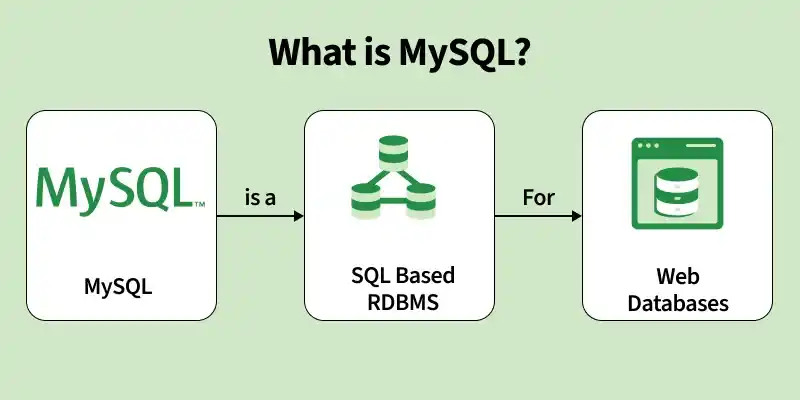

# Bài giảng: Giới thiệu về MySQL

**Cập nhật lần cuối:** 13/03/2026

---

## 1. Mục tiêu bài giảng

Sau khi hoàn thành bài học này, người học có thể:

1. Giải thích được khái niệm **MySQL** và vai trò của MySQL trong hệ sinh thái cơ sở dữ liệu.
2. Trình bày được cách MySQL xử lý yêu cầu từ client và thực thi truy vấn SQL.
3. Mô tả được các đặc điểm nổi bật của MySQL: mã nguồn mở, hiệu năng cao, ACID, storage engine, replication và security.
4. Nhận diện được các nhóm người dùng và lĩnh vực ứng dụng phổ biến của MySQL.
5. Phân tích được vai trò của cloud đối với sự phát triển hiện đại của MySQL.
6. Phân biệt được **MySQL** và **SQL**.
7. Vận dụng kiến thức để lựa chọn MySQL cho các tình huống ứng dụng phù hợp.

---

## 2. MySQL là gì?

**MySQL** là một hệ quản trị cơ sở dữ liệu quan hệ mã nguồn mở, tiếng Anh gọi là **Open-source Relational Database Management System (RDBMS)**.

MySQL sử dụng **SQL** (*Structured Query Language*) để:

- Lưu trữ dữ liệu.
- Quản lý dữ liệu.
- Truy vấn dữ liệu.
- Cập nhật dữ liệu.
- Xóa dữ liệu.
- Tổ chức dữ liệu theo mô hình quan hệ.

MySQL là một trong những hệ quản trị cơ sở dữ liệu được sử dụng rộng rãi trong các ứng dụng web nhờ tốc độ xử lý tốt, độ tin cậy cao, dễ sử dụng và có cộng đồng hỗ trợ lớn.

Một số đặc điểm tổng quan:

- Được phát triển và duy trì bởi **Oracle Corporation**.
- Hỗ trợ nhiều nền tảng như Windows, Linux và macOS.
- Thường được sử dụng với PHP, Java, Python và nhiều ngôn ngữ lập trình khác.
- Phù hợp để xây dựng các ứng dụng động cần lưu trữ và truy xuất dữ liệu thường xuyên.



---

### Quiz: Khái niệm MySQL

**Câu 1.** MySQL là gì?

A. Một hệ quản trị cơ sở dữ liệu quan hệ mã nguồn mở  
B. Một ngôn ngữ lập trình thay thế Python  
C. Một hệ điều hành máy chủ  
D. Một phần mềm chỉnh sửa ảnh  

**Câu 2.** MySQL sử dụng ngôn ngữ nào để thao tác với dữ liệu?

A. SQL  
B. HTML  
C. CSS  
D. LaTeX  

**Câu 3.** MySQL thường được dùng nhiều trong loại ứng dụng nào?

A. Ứng dụng web và ứng dụng cần dữ liệu có cấu trúc  
B. Chỉ phần mềm chỉnh sửa ảnh  
C. Chỉ trình phát nhạc  
D. Chỉ hệ điều hành  

---

## 3. Vai trò của MySQL trong hệ thống phần mềm

Trong một hệ thống phần mềm, MySQL thường đóng vai trò là **backend database**, tức là nơi lưu trữ và quản lý dữ liệu phía sau ứng dụng.

Ví dụ trong một website thương mại điện tử, MySQL có thể lưu trữ:

- Danh sách sản phẩm.
- Thông tin khách hàng.
- Đơn hàng.
- Lịch sử giao dịch.
- Giỏ hàng.
- Trạng thái thanh toán.
- Thông tin vận chuyển.

Trong một hệ thống quản lý sinh viên, MySQL có thể lưu trữ:

- Hồ sơ sinh viên.
- Danh sách lớp học.
- Môn học.
- Điểm số.
- Học phí.
- Lịch học.

MySQL đặc biệt phù hợp với các hệ thống có dữ liệu **có cấu trúc**, tức là dữ liệu có thể tổ chức thành các bảng, hàng và cột.

---

## 4. Cách MySQL hoạt động

MySQL xử lý các yêu cầu từ client và tương tác với dữ liệu được lưu trữ để thực thi các truy vấn SQL một cách hiệu quả. Quy trình hoạt động có thể mô tả qua các bước sau.

### 4.1. Client Request - Gửi yêu cầu từ client

Người dùng hoặc ứng dụng gửi một câu lệnh SQL đến MySQL Server thông qua ứng dụng, API, công cụ dòng lệnh hoặc công cụ quản trị như MySQL Workbench, phpMyAdmin hoặc DBeaver.

Ví dụ:

```sql
SELECT * FROM students;
```

### 4.2. Connection - Thiết lập kết nối

MySQL Server thiết lập kết nối với client, tạo một **session** để client có thể gửi truy vấn và nhận kết quả. Ở bước này, MySQL kiểm tra tên người dùng, mật khẩu, host và quyền truy cập.

### 4.3. SQL Parsing - Phân tích câu lệnh SQL

MySQL phân tích câu lệnh SQL để kiểm tra cú pháp, tên bảng, tên cột và quyền thực hiện thao tác.

Ví dụ câu lệnh sau sai cú pháp:

```sql
SELEC * FROM students;
```

Do viết sai từ khóa `SELECT`, MySQL sẽ báo lỗi.

### 4.4. Query Optimization - Tối ưu hóa truy vấn

Sau khi câu lệnh hợp lệ, MySQL tìm cách thực thi truy vấn hiệu quả nhất. Trình tối ưu hóa có thể quyết định:

- Có dùng index hay không.
- Nên đọc bảng nào trước.
- Nên dùng phương án join nào.
- Cách giảm số lượng bản ghi cần quét.

Ví dụ nếu bảng `students` có index trên `student_id`, truy vấn sau có thể nhanh hơn:

```sql
SELECT * FROM students
WHERE student_id = 'S001';
```

### 4.5. Execution - Thực thi truy vấn

MySQL thực thi truy vấn để lấy, thêm, cập nhật hoặc xóa dữ liệu.

```sql
INSERT INTO students(student_id, full_name, major)
VALUES ('S001', 'Nguyen Van A', 'Data Science');
```

### 4.6. Storage Engine - Bộ máy lưu trữ

MySQL sử dụng **storage engine** để quản lý cách dữ liệu được lưu trữ, truy xuất và duy trì trên đĩa.

Một số storage engine phổ biến:

- **InnoDB**.
- **MyISAM**.
- **Memory**.
- **CSV**.
- **Archive**.

Trong thực tế, **InnoDB** là storage engine mặc định và phổ biến nhất vì hỗ trợ transaction, ACID, foreign key, row-level locking và crash recovery.

### 4.7. Result Generation và Response

Sau khi thực thi truy vấn, MySQL tạo kết quả trả về. Kết quả có thể là bảng dữ liệu, số dòng bị ảnh hưởng, thông báo thành công hoặc thông báo lỗi. Sau đó, MySQL Server gửi kết quả về ứng dụng client để hiển thị cho người dùng.

### 4.8. Transaction Management

MySQL quản lý transaction để đảm bảo nhiều thao tác được thực hiện đáng tin cậy và nhất quán.

Ví dụ chuyển tiền:

1. Trừ tiền tài khoản A.
2. Cộng tiền vào tài khoản B.

Hai thao tác này phải thành công cùng nhau. Nếu một thao tác thất bại, toàn bộ giao dịch phải được hủy.

### 4.9. Logging, Recovery, Replication và Backup

MySQL ghi log để hỗ trợ phục hồi dữ liệu khi có lỗi. MySQL cũng hỗ trợ replication và backup để:

- Tăng khả năng sẵn sàng.
- Giảm rủi ro mất dữ liệu.
- Phân tán tải đọc.
- Tạo bản sao dữ liệu trên nhiều server.
- Hỗ trợ phục hồi sau sự cố.

---

### Quiz: Cách MySQL hoạt động

**Câu 1.** Bước nào kiểm tra cú pháp của câu lệnh SQL?

A. SQL Parsing  
B. Backup  
C. Replication  
D. Result Display  

**Câu 2.** Storage engine trong MySQL dùng để làm gì?

A. Quản lý cách dữ liệu được lưu trữ và truy xuất  
B. Thiết kế giao diện người dùng  
C. Biên dịch chương trình Java  
D. Tạo slide trình chiếu  

**Câu 3.** Storage engine phổ biến và mặc định hiện nay của MySQL là gì?

A. InnoDB  
B. MyISAM  
C. CSV  
D. Memory  

---

## 5. Các đặc điểm nổi bật của MySQL

MySQL là lựa chọn phổ biến cho nhiều hệ thống cơ sở dữ liệu quan hệ nhờ các đặc điểm sau.

### 5.1. Mã nguồn mở

MySQL là phần mềm mã nguồn mở, cho phép sử dụng, triển khai và phân phối với chi phí thấp. Điều này giúp MySQL phù hợp với sinh viên, người mới học, doanh nghiệp nhỏ và vừa.

### 5.2. Hiệu năng cao

MySQL được thiết kế để truy xuất và xử lý dữ liệu nhanh. Với thiết kế schema, chỉ mục và truy vấn hợp lý, MySQL có thể phục vụ tốt các ứng dụng có lượng truy cập lớn.

### 5.3. Tuân thủ ACID

Với storage engine **InnoDB**, MySQL hỗ trợ các tính chất ACID:

- **Atomicity**: giao dịch thành công toàn bộ hoặc thất bại toàn bộ.
- **Consistency**: dữ liệu luôn tuân thủ ràng buộc hợp lệ.
- **Isolation**: các giao dịch đồng thời không làm sai lệch nhau.
- **Durability**: dữ liệu đã commit được lưu bền vững.

### 5.4. Khả năng mở rộng

MySQL có thể hỗ trợ các cơ sở dữ liệu lớn và hệ thống có lượng truy cập cao thông qua indexing, partitioning, replication, clustering, caching và read replica.

### 5.5. Nhiều storage engine

| Storage Engine | Đặc điểm chính | Trường hợp sử dụng |
|---|---|---|
| InnoDB | Hỗ trợ transaction, ACID, foreign key | Hầu hết ứng dụng hiện đại |
| MyISAM | Đơn giản, đọc nhanh trong một số trường hợp | Hệ cũ, dữ liệu ít cập nhật |
| Memory | Lưu dữ liệu trong RAM | Dữ liệu tạm, tốc độ cao |
| CSV | Lưu dữ liệu dạng CSV | Trao đổi dữ liệu đơn giản |
| Archive | Tối ưu lưu trữ dữ liệu ít truy vấn | Lưu trữ log hoặc dữ liệu lịch sử |

### 5.6. Replication

Replication cho phép sao chép dữ liệu từ một MySQL server sang server khác. Tính năng này giúp tăng tính sẵn sàng, hỗ trợ backup, phân tán truy vấn đọc và tăng khả năng chịu lỗi.

### 5.7. Bảo mật

MySQL cung cấp nhiều cơ chế bảo mật:

- Xác thực người dùng.
- Phân quyền theo user.
- Phân quyền theo database, table hoặc column.
- Hỗ trợ SSL encryption.
- Quản lý mật khẩu.
- Kiểm soát quyền truy cập từ host.

Ví dụ phân quyền:

```sql
GRANT SELECT, INSERT ON school_db.* TO 'student_user'@'localhost';
```

---

### Quiz: Đặc điểm của MySQL

**Câu 1.** Storage engine nào hỗ trợ transaction và ACID mạnh trong MySQL?

A. InnoDB  
B. CSV  
C. Archive  
D. Memory  

**Câu 2.** Replication trong MySQL giúp ích cho điều gì?

A. Sao chép dữ liệu giữa nhiều server  
B. Tạo giao diện web  
C. Nén file ảnh  
D. Tắt toàn bộ cơ sở dữ liệu  

**Câu 3.** Tính năng bảo mật nào sau đây thuộc MySQL?

A. Xác thực người dùng và phân quyền truy cập  
B. Tự động thiết kế logo  
C. Biên dịch code C++  
D. Tạo hiệu ứng video  

---

## 6. Ai sử dụng MySQL?

MySQL được sử dụng bởi nhiều nhóm người dùng khác nhau, từ cá nhân, tổ chức giáo dục, doanh nghiệp nhỏ đến doanh nghiệp lớn.

### 6.1. Doanh nghiệp nhỏ và vừa

Doanh nghiệp nhỏ và vừa sử dụng MySQL để quản lý dữ liệu khách hàng, giao dịch, sản phẩm, đơn hàng, hồ sơ kinh doanh và báo cáo nội bộ.

### 6.2. Doanh nghiệp lớn

Doanh nghiệp lớn có thể dùng MySQL cho ứng dụng web có lượng truy cập cao, hệ thống nội bộ, dịch vụ trực tuyến, hệ thống báo cáo hoặc các thành phần trong kiến trúc microservices.

### 6.3. Web developers

Lập trình viên web thường sử dụng MySQL làm database backend cho website, blog, diễn đàn, CMS, hệ thống đăng nhập và ứng dụng thương mại điện tử.

MySQL thường đi cùng các stack phổ biến như:

- LAMP: Linux, Apache, MySQL, PHP.
- LEMP: Linux, Nginx, MySQL, PHP.
- Java Spring Boot + MySQL.
- Django/Flask + MySQL.

### 6.4. Cơ sở giáo dục

Trường học và đại học sử dụng MySQL để dạy SQL, thiết kế cơ sở dữ liệu, quản lý bài thực hành và hỗ trợ dự án môn học.

---

### Quiz: Người dùng MySQL

**Câu 1.** Vì sao MySQL phù hợp với doanh nghiệp nhỏ và vừa?

A. Chi phí thấp, dễ triển khai, cộng đồng lớn  
B. Chỉ chạy được trên siêu máy tính  
C. Không cần lưu dữ liệu  
D. Không dùng được với web  

**Câu 2.** Stack LAMP gồm Linux, Apache, MySQL và ngôn ngữ nào?

A. PHP  
B. C#  
C. Swift  
D. Kotlin  

---

## 7. Ứng dụng của MySQL

MySQL được sử dụng rộng rãi trong nhiều lĩnh vực nhờ độ tin cậy, khả năng mở rộng và hiệu năng tốt.

### 7.1. Thương mại điện tử

Trong e-commerce, MySQL có thể dùng để quản lý danh mục sản phẩm, khách hàng, đơn hàng, thanh toán, giỏ hàng, mã giảm giá và trạng thái giao hàng.

### 7.2. Hệ quản trị nội dung

Nhiều hệ quản trị nội dung dùng MySQL để lưu bài viết, trang nội dung, người dùng, bình luận, cấu hình website và metadata.

### 7.3. Dịch vụ tài chính

Trong lĩnh vực tài chính, MySQL có thể dùng để quản lý dữ liệu giao dịch, tài khoản khách hàng, lịch sử thanh toán, hồ sơ tài chính và báo cáo kế toán.

### 7.4. Y tế

Trong healthcare, MySQL có thể lưu hồ sơ bệnh nhân, lịch sử khám chữa bệnh, thông tin điều trị, lịch hẹn và kết quả xét nghiệm.

### 7.5. Mạng xã hội

Trong social media, MySQL có thể lưu hồ sơ người dùng, bài đăng, bình luận, lượt thích, quan hệ bạn bè hoặc theo dõi, tin nhắn và nhật ký hoạt động.

---

### Quiz: Ứng dụng MySQL

**Câu 1.** Trong thương mại điện tử, MySQL có thể dùng để quản lý dữ liệu nào?

A. Sản phẩm, khách hàng, đơn hàng và giao dịch  
B. Chỉ hình nền máy tính  
C. Chỉ driver bàn phím  
D. Chỉ âm thanh hệ thống  

**Câu 2.** Trong CMS, MySQL thường lưu gì?

A. Bài viết, người dùng, bình luận và cấu hình website  
B. Chỉ tệp hệ điều hành  
C. Chỉ dữ liệu cảm biến thời tiết  
D. Chỉ file video thô  

**Câu 3.** Khi dùng MySQL cho dữ liệu y tế, cần đặc biệt chú ý điều gì?

A. Bảo mật, phân quyền và kiểm soát truy cập  
B. Màu sắc giao diện  
C. Font chữ của website  
D. Logo của ứng dụng  

---

## 8. Cloud và tương lai của MySQL

Công nghệ cloud ảnh hưởng mạnh đến sự phát triển của MySQL. MySQL ngày nay không chỉ được cài đặt trên máy chủ vật lý hoặc máy chủ riêng mà còn được triển khai như một dịch vụ cloud.

### 8.1. Cloud Integration

Các nền tảng cloud cho phép MySQL chạy dưới dạng **managed service**, giúp đơn giản hóa triển khai, mở rộng và bảo trì.

Ví dụ:

- Amazon RDS for MySQL.
- Google Cloud SQL for MySQL.
- Azure Database for MySQL.

### 8.2. Managed Services

Managed MySQL service giúp giảm gánh nặng vận hành vì cloud provider hỗ trợ cài đặt, cập nhật, backup, monitoring, scaling, high availability và một số tác vụ bảo trì.

### 8.3. Scalability

Cloud cho phép mở rộng tài nguyên linh hoạt dựa trên nhu cầu thực tế, ví dụ tăng CPU, RAM, dung lượng lưu trữ, tạo read replica và tăng khả năng chịu tải đọc.

### 8.4. High Availability và Automatic Backups

Các giải pháp MySQL trên cloud thường hỗ trợ multi-zone deployment, failover tự động, replication, snapshot, disaster recovery và backup tự động.

### 8.5. Xu hướng tương lai

Một số xu hướng tương lai của MySQL gồm:

1. **Hybrid cloud deployments**: kết hợp database tại chỗ với cloud.
2. **Advanced analytics**: tích hợp với nền tảng phân tích và machine learning.
3. **Serverless architectures**: hỗ trợ môi trường serverless để giảm chi phí và đơn giản hóa vận hành.

---

### Quiz: Cloud và MySQL

**Câu 1.** Managed MySQL service giúp ích chủ yếu ở điểm nào?

A. Giảm gánh nặng triển khai, bảo trì và vận hành database  
B. Loại bỏ hoàn toàn nhu cầu lưu trữ dữ liệu  
C. Thay thế ngôn ngữ SQL bằng HTML  
D. Chỉ dùng để thiết kế giao diện  

**Câu 2.** Dịch vụ nào là ví dụ của MySQL trên cloud?

A. Amazon RDS for MySQL  
B. Microsoft Paint  
C. VLC Media Player  
D. LaTeX Beamer  

**Câu 3.** Automatic backup giúp gì cho hệ thống?

A. Hỗ trợ bảo vệ và phục hồi dữ liệu  
B. Làm tăng kích thước font chữ  
C. Tạo logo tự động  
D. Xóa toàn bộ database mỗi ngày  

---

## 9. MySQL và SQL khác nhau như thế nào?

Nhiều người mới học thường nhầm giữa **MySQL** và **SQL**. Hai khái niệm này liên quan chặt chẽ nhưng không giống nhau.

| Tiêu chí | MySQL | SQL |
|---|---|---|
| Bản chất | Hệ quản trị cơ sở dữ liệu quan hệ | Ngôn ngữ truy vấn có cấu trúc |
| Vai trò | Lưu trữ, quản lý và tổ chức dữ liệu | Giao tiếp với cơ sở dữ liệu |
| Là phần mềm? | Có | Không, SQL là ngôn ngữ |
| Mã nguồn mở? | MySQL là mã nguồn mở | SQL là chuẩn/ngôn ngữ, không phải sản phẩm phần mềm |
| Dùng để làm gì? | Quản lý database | Viết truy vấn tạo, đọc, cập nhật, xóa dữ liệu |
| Ví dụ sử dụng | Cài đặt MySQL Server để quản lý database | Viết `SELECT`, `INSERT`, `UPDATE`, `DELETE` |
| Quan hệ với hệ khác | Là một RDBMS cụ thể | Được dùng trong MySQL, PostgreSQL, SQL Server, Oracle, SQLite |

Ví dụ:

```sql
SELECT * FROM products;
```

Câu lệnh trên là **SQL**. Khi câu lệnh này được chạy trên **MySQL Server**, MySQL xử lý câu lệnh và trả về kết quả.

Nói ngắn gọn:

- **SQL** là ngôn ngữ.
- **MySQL** là phần mềm hệ quản trị cơ sở dữ liệu sử dụng SQL.

---

### Quiz: MySQL và SQL

**Câu 1.** SQL là gì?

A. Ngôn ngữ truy vấn có cấu trúc  
B. Một hệ điều hành  
C. Một loại phần cứng  
D. Một trình duyệt web  

**Câu 2.** MySQL là gì?

A. Một hệ quản trị cơ sở dữ liệu quan hệ  
B. Một câu lệnh truy vấn  
C. Một kiểu dữ liệu trong Python  
D. Một phần mềm trình chiếu  

**Câu 3.** Phát biểu nào đúng?

A. SQL là ngôn ngữ, MySQL là phần mềm RDBMS sử dụng SQL  
B. MySQL và SQL hoàn toàn giống nhau  
C. SQL chỉ dùng để chỉnh sửa ảnh  
D. MySQL không dùng SQL  

---

## 10. Một số lệnh MySQL cơ bản

### 10.1. Tạo cơ sở dữ liệu

```sql
CREATE DATABASE school_db;
```

### 10.2. Chọn cơ sở dữ liệu

```sql
USE school_db;
```

### 10.3. Tạo bảng

```sql
CREATE TABLE students (
    student_id VARCHAR(10) PRIMARY KEY,
    full_name VARCHAR(100) NOT NULL,
    major VARCHAR(100),
    gpa DECIMAL(3,2)
);
```

### 10.4. Thêm dữ liệu

```sql
INSERT INTO students(student_id, full_name, major, gpa)
VALUES ('S001', 'Nguyen Van A', 'Data Science', 3.45);
```

### 10.5. Truy vấn dữ liệu

```sql
SELECT * FROM students;
```

### 10.6. Truy vấn có điều kiện

```sql
SELECT student_id, full_name, gpa
FROM students
WHERE gpa >= 3.0;
```

### 10.7. Cập nhật dữ liệu

```sql
UPDATE students
SET gpa = 3.60
WHERE student_id = 'S001';
```

### 10.8. Xóa dữ liệu

```sql
DELETE FROM students
WHERE student_id = 'S001';
```

### 10.9. Xóa bảng

```sql
DROP TABLE students;
```

### 10.10. Xóa cơ sở dữ liệu

```sql
DROP DATABASE school_db;
```

---

## 11. Ví dụ minh họa: Quản lý sinh viên bằng MySQL

Giả sử ta cần xây dựng một cơ sở dữ liệu nhỏ để quản lý sinh viên.

### 11.1. Tạo database

```sql
CREATE DATABASE university_db;
USE university_db;
```

### 11.2. Tạo bảng ngành học

```sql
CREATE TABLE majors (
    major_id VARCHAR(10) PRIMARY KEY,
    major_name VARCHAR(100) NOT NULL
);
```

### 11.3. Tạo bảng sinh viên

```sql
CREATE TABLE students (
    student_id VARCHAR(10) PRIMARY KEY,
    full_name VARCHAR(100) NOT NULL,
    date_of_birth DATE,
    major_id VARCHAR(10),
    gpa DECIMAL(3,2),
    FOREIGN KEY (major_id) REFERENCES majors(major_id)
);
```

### 11.4. Thêm dữ liệu

```sql
INSERT INTO majors(major_id, major_name)
VALUES
('DS', 'Data Science'),
('AI', 'Artificial Intelligence'),
('IS', 'Information Systems');
```

```sql
INSERT INTO students(student_id, full_name, date_of_birth, major_id, gpa)
VALUES
('S001', 'Nguyen Van A', '2005-03-12', 'DS', 3.40),
('S002', 'Tran Thi B', '2005-07-20', 'AI', 3.70),
('S003', 'Le Van C', '2004-11-05', 'IS', 3.10);
```

### 11.5. Truy vấn kết hợp hai bảng

```sql
SELECT 
    s.student_id,
    s.full_name,
    m.major_name,
    s.gpa
FROM students s
JOIN majors m ON s.major_id = m.major_id;
```

Truy vấn trên cho biết sinh viên thuộc ngành học nào.

---

## 12. Bảng tóm tắt ưu điểm và hạn chế của MySQL

| Khía cạnh | Ưu điểm | Hạn chế cần lưu ý |
|---|---|---|
| Chi phí | Mã nguồn mở, chi phí thấp | Một số dịch vụ/phiên bản thương mại có thể phát sinh chi phí |
| Hiệu năng | Tốt cho nhiều ứng dụng web | Cần tối ưu khi dữ liệu hoặc tải ghi rất lớn |
| Dễ học | Phù hợp với người mới | Cần học thêm về index, transaction, backup khi làm hệ thật |
| Bảo mật | Có phân quyền, xác thực, SSL | Cần cấu hình đúng để tránh rủi ro |
| Mở rộng | Hỗ trợ replication, partitioning | Sharding và scale lớn cần thiết kế cẩn thận |
| Cộng đồng | Rất lớn, nhiều tài liệu | Có nhiều nguồn, cần chọn tài liệu đáng tin cậy |
| Ứng dụng | Web, CMS, e-commerce, giáo dục | Không phải lựa chọn tối ưu cho mọi loại workload |

---

## 13. Câu hỏi ôn tập

### 13.1. Câu hỏi trắc nghiệm

**Câu 1.** MySQL là loại hệ thống nào?

A. Hệ quản trị cơ sở dữ liệu quan hệ  
B. Hệ điều hành  
C. Trình duyệt web  
D. Phần mềm xử lý ảnh  

---

**Câu 2.** MySQL thường dùng ngôn ngữ nào để thao tác với dữ liệu?

A. SQL  
B. CSS  
C. HTML  
D. Markdown  

---

**Câu 3.** Storage engine mặc định và phổ biến trong MySQL hiện nay là gì?

A. InnoDB  
B. CSV  
C. Archive  
D. Memory  

---

**Câu 4.** Replication trong MySQL chủ yếu dùng để làm gì?

A. Sao chép dữ liệu giữa các server  
B. Tạo màu cho giao diện  
C. Xóa dữ liệu tự động  
D. Thiết kế biểu đồ  

---

**Câu 5.** MySQL phù hợp nhất với loại ứng dụng nào sau đây?

A. Ứng dụng web có dữ liệu có cấu trúc  
B. Ứng dụng không cần dữ liệu  
C. Phần mềm chỉ chỉnh sửa video  
D. Trình phát nhạc cá nhân không lưu dữ liệu  

---

**Câu 6.** SQL khác MySQL ở điểm nào?

A. SQL là ngôn ngữ, MySQL là hệ quản trị cơ sở dữ liệu  
B. SQL là hệ điều hành, MySQL là trình duyệt  
C. SQL là phần cứng, MySQL là dây mạng  
D. SQL và MySQL không liên quan gì đến cơ sở dữ liệu  

---

**Câu 7.** Trong MySQL, `SELECT` thường dùng để làm gì?

A. Truy vấn dữ liệu  
B. Xóa database  
C. Tạo người dùng hệ điều hành  
D. Nén tệp ảnh  

---

**Câu 8.** Lệnh nào dùng để tạo database?

A. CREATE DATABASE  
B. MAKE FILE  
C. NEW SCREEN  
D. BUILD IMAGE  

---

**Câu 9.** Vì sao MySQL được dùng nhiều trong giáo dục?

A. Dễ học, dễ cài đặt và có nhiều tài liệu  
B. Không cần học SQL  
C. Chỉ chạy trên máy chủ rất đắt tiền  
D. Không thể tạo bảng  

---

**Câu 10.** Khi dùng MySQL cho dữ liệu quan trọng, cần chú ý điều gì?

A. Backup, security, transaction và recovery  
B. Chỉ màu sắc giao diện  
C. Chỉ logo của phần mềm  
D. Chỉ tên thư mục cài đặt  

### 13.2. Câu hỏi tự luận ngắn

**Câu 1.** Giải thích vì sao MySQL được xem là một RDBMS.

---

**Câu 2.** Trình bày quy trình xử lý một truy vấn trong MySQL.

---

**Câu 3.** Vì sao InnoDB thường được sử dụng nhiều hơn MyISAM trong các ứng dụng hiện đại?

---

**Câu 4.** Nêu ba ứng dụng thực tế của MySQL và giải thích ngắn gọn.

---

**Câu 5.** Phân biệt MySQL và SQL bằng ví dụ.

---

**Câu 6.** Vì sao cloud làm thay đổi cách triển khai và vận hành MySQL?

---

## 14. Bài tập vận dụng

### Bài tập 1

Một cửa hàng online nhỏ cần lưu thông tin sản phẩm, khách hàng, đơn hàng và giao dịch.

**Yêu cầu:**  
Hãy đề xuất cách dùng MySQL cho hệ thống này. Nên có những bảng chính nào?

---

### Bài tập 2

Một trường đại học muốn dạy sinh viên nhập môn cơ sở dữ liệu và SQL.

**Yêu cầu:**  
Giải thích vì sao MySQL là lựa chọn phù hợp cho môn học này.

---

### Bài tập 3

Một website có lượng truy cập tăng nhanh, truy vấn đọc nhiều hơn truy vấn ghi.

**Yêu cầu:**  
Đề xuất một số kỹ thuật trong hệ sinh thái MySQL để cải thiện hiệu năng và khả năng mở rộng.

---

### Bài tập 4

Một hệ thống y tế sử dụng MySQL để lưu hồ sơ bệnh nhân.

**Yêu cầu:**  
Nêu các vấn đề bảo mật và vận hành cần chú ý.

---

### Bài tập 5

Viết các câu lệnh SQL để:

1. Tạo database `library_db`.
2. Tạo bảng `books` gồm `book_id`, `title`, `author`, `published_year`.
3. Thêm hai cuốn sách vào bảng.
4. Truy vấn toàn bộ danh sách sách.

---

## 15. Tóm tắt bài học

- MySQL là hệ quản trị cơ sở dữ liệu quan hệ mã nguồn mở sử dụng SQL.
- MySQL được dùng rộng rãi trong ứng dụng web nhờ tốc độ, độ tin cậy, dễ sử dụng và cộng đồng lớn.
- Quy trình xử lý truy vấn của MySQL gồm gửi yêu cầu, kết nối, phân tích SQL, tối ưu truy vấn, thực thi, truy cập storage engine, tạo kết quả và trả phản hồi.
- InnoDB là storage engine phổ biến vì hỗ trợ transaction, ACID, foreign key và crash recovery.
- MySQL được sử dụng bởi doanh nghiệp nhỏ, doanh nghiệp lớn, lập trình viên web và cơ sở giáo dục.
- MySQL có nhiều ứng dụng trong thương mại điện tử, CMS, tài chính, y tế và mạng xã hội.
- Cloud giúp MySQL dễ triển khai, mở rộng, sao lưu, giám sát và tăng tính sẵn sàng.
- SQL là ngôn ngữ truy vấn, còn MySQL là phần mềm hệ quản trị cơ sở dữ liệu sử dụng SQL.

---

## 16. Từ khóa chính

- MySQL
- SQL
- RDBMS
- Database
- DBMS
- InnoDB
- MyISAM
- Storage Engine
- ACID
- Transaction
- Replication
- Backup
- Recovery
- Query Optimization
- Client-server
- Cloud MySQL
- Amazon RDS
- Google Cloud SQL
- Azure Database for MySQL
- Security
- Scalability

---

## 17. Đáp án và gợi ý trả lời

### Quiz: Khái niệm MySQL

- **Câu 1.** A
- **Câu 2.** A
- **Câu 3.** A

### Quiz: Cách MySQL hoạt động

- **Câu 1.** A
- **Câu 2.** A
- **Câu 3.** A

### Quiz: Đặc điểm của MySQL

- **Câu 1.** A
- **Câu 2.** A
- **Câu 3.** A

### Quiz: Người dùng MySQL

- **Câu 1.** A
- **Câu 2.** A

### Quiz: Ứng dụng MySQL

- **Câu 1.** A
- **Câu 2.** A
- **Câu 3.** A

### Quiz: Cloud và MySQL

- **Câu 1.** A
- **Câu 2.** A
- **Câu 3.** A

### Quiz: MySQL và SQL

- **Câu 1.** A
- **Câu 2.** A
- **Câu 3.** A

### Câu hỏi ôn tập - Trắc nghiệm

- **Câu 1.** A
- **Câu 2.** A
- **Câu 3.** A
- **Câu 4.** A
- **Câu 5.** A
- **Câu 6.** A
- **Câu 7.** A
- **Câu 8.** A
- **Câu 9.** A
- **Câu 10.** A

### Câu hỏi ôn tập - Tự luận ngắn

#### Câu 1

**Gợi ý trả lời:**

MySQL là RDBMS vì nó quản lý dữ liệu theo mô hình quan hệ, trong đó dữ liệu được tổ chức thành bảng, hàng và cột. Các bảng có thể liên kết với nhau thông qua khóa chính và khóa ngoại. MySQL sử dụng SQL để thao tác dữ liệu.

#### Câu 2

**Gợi ý trả lời:**

Một truy vấn MySQL thường đi qua các bước: client gửi SQL query, MySQL Server thiết lập kết nối, kiểm tra quyền truy cập, phân tích cú pháp SQL, tối ưu hóa truy vấn, thực thi truy vấn thông qua storage engine, tạo kết quả và trả kết quả về client.

#### Câu 3

**Gợi ý trả lời:**

InnoDB thường được dùng nhiều hơn MyISAM vì hỗ trợ transaction, ACID, foreign key, row-level locking và crash recovery. Những tính năng này rất quan trọng cho các ứng dụng hiện đại cần độ tin cậy và toàn vẹn dữ liệu.

#### Câu 4

**Gợi ý trả lời:**

Ba ứng dụng thực tế của MySQL có thể gồm: thương mại điện tử để lưu sản phẩm, khách hàng và đơn hàng; CMS để lưu bài viết, người dùng và bình luận; giáo dục để quản lý sinh viên, lớp học và điểm số.

#### Câu 5

**Gợi ý trả lời:**

SQL là ngôn ngữ dùng để viết truy vấn như `SELECT * FROM students;`. MySQL là phần mềm hệ quản trị cơ sở dữ liệu dùng để lưu trữ và quản lý database. Khi chạy câu lệnh SQL trên MySQL Server, MySQL sẽ xử lý câu lệnh đó và trả kết quả.

#### Câu 6

**Gợi ý trả lời:**

Cloud giúp MySQL dễ triển khai và vận hành hơn thông qua managed services, backup tự động, monitoring, scaling, high availability và disaster recovery. Nhờ đó, đội phát triển có thể tập trung vào ứng dụng thay vì quản trị hạ tầng database thủ công.

### Bài tập vận dụng

#### Bài tập 1

**Gợi ý trả lời:**

Có thể dùng MySQL để lưu dữ liệu có cấu trúc của cửa hàng online. Các bảng chính gồm `products`, `customers`, `orders`, `order_items`, `payments`, `shipments`. MySQL phù hợp vì dữ liệu đơn hàng và sản phẩm có quan hệ rõ ràng, cần transaction và truy vấn thường xuyên.

#### Bài tập 2

**Gợi ý trả lời:**

MySQL phù hợp cho giảng dạy vì dễ cài đặt, miễn phí, có cộng đồng lớn, hỗ trợ SQL chuẩn ở mức cơ bản, có nhiều công cụ như MySQL Workbench/phpMyAdmin và phù hợp để minh họa bảng, khóa, truy vấn, join, transaction.

#### Bài tập 3

**Gợi ý trả lời:**

Có thể cải thiện bằng cách tạo index phù hợp, tối ưu truy vấn, dùng caching, dùng replication/read replica để phân tán truy vấn đọc, partitioning cho bảng lớn, cấu hình connection pool và theo dõi slow query log.

#### Bài tập 4

**Gợi ý trả lời:**

Cần chú ý phân quyền người dùng, mã hóa kết nối SSL, bảo vệ mật khẩu, backup định kỳ, audit log, kiểm soát truy cập dữ liệu nhạy cảm, kiểm thử phục hồi dữ liệu, tuân thủ quy định bảo mật y tế và giới hạn quyền theo vai trò.

#### Bài tập 5

**Gợi ý trả lời:**

```sql
CREATE DATABASE library_db;
USE library_db;

CREATE TABLE books (
    book_id INT PRIMARY KEY,
    title VARCHAR(200) NOT NULL,
    author VARCHAR(100),
    published_year INT
);

INSERT INTO books(book_id, title, author, published_year)
VALUES
(1, 'Database System Concepts', 'Silberschatz', 2020),
(2, 'Learning MySQL', 'Seyed Tahaghoghi', 2006);

SELECT * FROM books;
```
