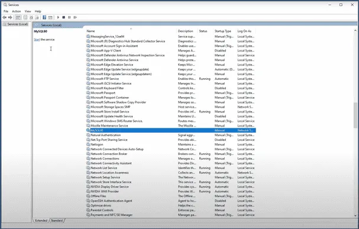
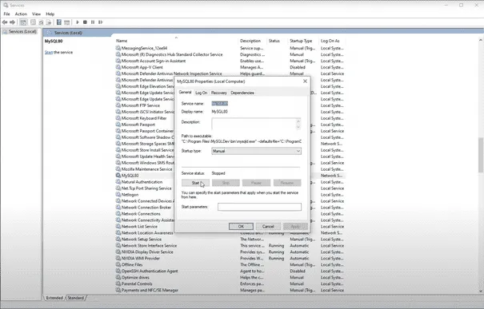
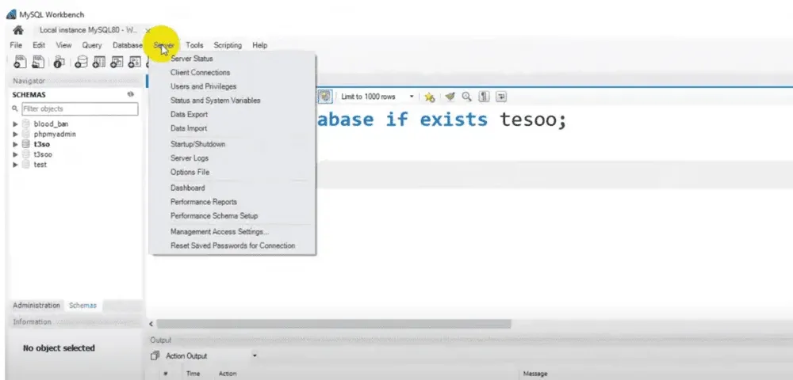
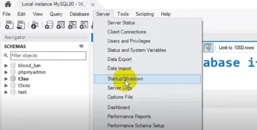
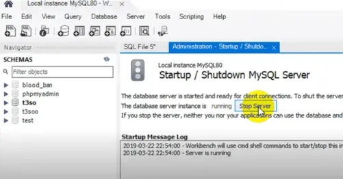
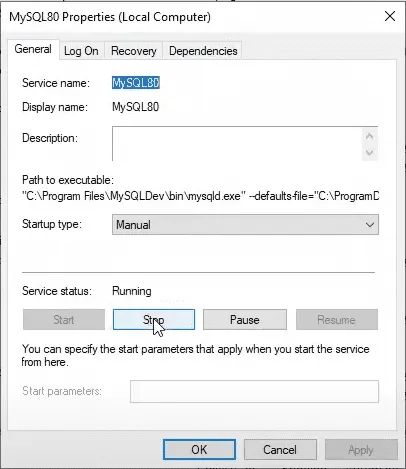

# Bài giảng: Cách Start và Stop MySQL Server trên Windows và Linux

**Cập nhật lần cuối:** 14/04/2026

---

## 1. Mục tiêu bài giảng

Sau khi hoàn thành bài học này, người học có thể:

1. Giải thích được vì sao cần quản lý trạng thái hoạt động của **MySQL Server**.
2. Khởi động và dừng MySQL Server trên Windows bằng `services.msc`, Command Prompt và MySQL Workbench.
3. Khởi động và dừng MySQL Server trên Linux bằng `service`, `systemctl`, `mysqld` và `mysqladmin`.
4. Phân biệt được vai trò của `mysqld`, `mysqladmin`, `service` và `systemctl`.
5. Kiểm tra trạng thái MySQL Server và xử lý một số lỗi thường gặp.
6. Vận dụng các lệnh quản trị cơ bản để phục vụ học tập, phát triển ứng dụng và bảo trì hệ thống.

---

## 2. Vì sao cần biết cách Start và Stop MySQL Server?

**MySQL Server** là dịch vụ chịu trách nhiệm nhận kết nối, xử lý truy vấn SQL, đọc/ghi dữ liệu và trả kết quả cho client.

Việc kiểm soát MySQL Server rất quan trọng vì nó giúp:

- Quản lý dịch vụ cơ sở dữ liệu.
- Kiểm soát server đang chạy hay đã dừng.
- Hỗ trợ bảo trì hệ thống.
- Hỗ trợ xử lý lỗi kết nối.
- Phục vụ quá trình phát triển và kiểm thử ứng dụng.
- Đảm bảo database sẵn sàng khi ứng dụng cần truy cập.

Nếu MySQL Server chưa chạy, ứng dụng hoặc MySQL Workbench có thể báo lỗi kiểu:

```text
Can't connect to MySQL server on 'localhost'
```

---

### Quiz: Vai trò của việc quản lý MySQL Server

**Câu 1.** Vì sao cần biết cách start và stop MySQL Server?

A. Để quản lý trạng thái hoạt động của dịch vụ database  
B. Để thay đổi màu giao diện Windows  
C. Để xóa toàn bộ database sau mỗi lần dùng  
D. Để thay thế SQL bằng HTML  

**Câu 2.** Nếu MySQL Server chưa chạy, điều gì có thể xảy ra?

A. Ứng dụng không kết nối được đến database  
B. Database tự động tạo bảng mới  
C. Máy tính không khởi động được  
D. SQL tự động chuyển thành Python  

**Câu 3.** Việc stop MySQL Server thường cần thiết khi nào?

A. Khi bảo trì, cấu hình lại hoặc xử lý sự cố  
B. Khi muốn tăng độ sáng màn hình  
C. Khi muốn đổi tên thư mục ảnh  
D. Khi muốn mở trình duyệt web  

---

## 3. Một số khái niệm cần biết

### 3.1. MySQL Server

**MySQL Server** là tiến trình hoặc service chạy nền, chịu trách nhiệm:

- Nhận kết nối từ client.
- Xử lý câu lệnh SQL.
- Đọc và ghi dữ liệu.
- Quản lý transaction.
- Quản lý quyền truy cập.
- Trả kết quả truy vấn cho client.

### 3.2. MySQL Client

**MySQL Client** là công cụ hoặc ứng dụng dùng để kết nối đến MySQL Server.

Ví dụ:

- MySQL Command Line Client.
- MySQL Workbench.
- phpMyAdmin.
- DBeaver.
- Ứng dụng Python, Java, PHP kết nối MySQL.
- Backend của website hoặc API.

### 3.3. `mysqld`

`mysqld` là chương trình server chính của MySQL. Khi MySQL Server chạy, tiến trình `mysqld` thường đang hoạt động trong hệ thống.

### 3.4. `mysqladmin`

`mysqladmin` là công cụ dòng lệnh dùng cho một số thao tác quản trị MySQL như:

- Kiểm tra server còn hoạt động không.
- Shutdown server.
- Xem version.
- Ping server.

Ví dụ:

```bash
mysqladmin -u root -p ping
```

### 3.5. MySQL Workbench

**MySQL Workbench** là công cụ giao diện đồ họa chính thức để làm việc với MySQL. Nó hỗ trợ:

- Kết nối database.
- Viết và chạy SQL.
- Quản lý schema.
- Thiết kế mô hình dữ liệu.
- Start/stop server trong một số cấu hình.
- Theo dõi trạng thái server.

---

## 4. Start MySQL Server trên Windows

Trên Windows, có ba cách phổ biến để khởi động MySQL Server:

1. Sử dụng `services.msc`.
2. Sử dụng Command Prompt.
3. Sử dụng MySQL Workbench.

---

## 5. Cách 1 trên Windows: Sử dụng `services.msc`

Đây là cách trực quan và phù hợp với người mới học.

### Bước 1. Mở cửa sổ Services

Nhấn tổ hợp phím:

```text
Windows + R
```

Nhập:

```text
services.msc
```

và nhấn **Enter**.


*Hình: Mở Services (services.msc).* 

### Bước 2. Tìm dịch vụ MySQL

Trong danh sách dịch vụ, tìm dịch vụ có tên liên quan đến MySQL, ví dụ:

- `MySQL`
- `MySQL80`
- `MySQL57`
- `MySQL Server`
- `MySQL80 Community`

Tên cụ thể có thể khác nhau tùy phiên bản cài đặt.


*Hình: Tìm dịch vụ MySQL trong danh sách services.*

### Bước 3. Start hoặc Restart MySQL Server

Nhấp chuột phải vào dịch vụ MySQL và chọn:

- **Start** nếu dịch vụ đang dừng.
- **Restart** nếu muốn khởi động lại dịch vụ.


*Hình: Start / Restart dịch vụ MySQL qua Services.*

### Bước 4. Kiểm tra trạng thái

Nếu MySQL chạy thành công, cột **Status** thường hiển thị:

```text
Running
```

---

## 6. Cách 2 trên Windows: Sử dụng Command Prompt

### Bước 1. Mở Command Prompt

Mở **Command Prompt**. Nếu cần thao tác với service, nên chọn **Run as administrator**.

### Bước 2. Chạy `mysqld`

Nhập lệnh:

```bat
mysqld
```

và nhấn **Enter**.

### Lưu ý

Trong thực tế, lệnh `mysqld` có thể yêu cầu:

- MySQL đã được thêm vào biến môi trường `PATH`.
- Command Prompt đang ở đúng thư mục chứa `mysqld.exe`.
- File cấu hình MySQL hợp lệ.
- Cổng mặc định `3306` chưa bị chiếm.

Nếu Windows báo:

```text
'mysqld' is not recognized as an internal or external command
```

có thể chuyển đến thư mục cài MySQL, ví dụ:

```bat
cd "C:\Program Files\MySQL\MySQL Server 8.0\bin"
mysqld
```

---

## 7. Cách 3 trên Windows: Sử dụng MySQL Workbench

### Bước 1. Mở MySQL Workbench

Mở **MySQL Workbench** từ Start Menu hoặc Desktop.


*Hình: Giao diện MySQL Workbench.*

### Bước 2. Vào menu Server

Trên thanh menu phía trên, chọn:

```text
Server
```


*Hình: Menu Server → Startup/Shutdown trong Workbench.*

### Bước 3. Chọn Startup/Shutdown

Trong danh sách, chọn:

```text
Startup/Shutdown
```


*Hình: Nút Start/Stop trong MySQL Workbench.*

### Bước 4. Start Server

Nếu server chưa chạy, chọn:

```text
Start Server
```

Sau đó kiểm tra trạng thái server đã chuyển sang running hay chưa.


*Hình: Thao tác Start server trong Workbench.*


*Hình: Screenshot minh họa thao tác.*

---

## 8. Stop MySQL Server trên Windows

Trên Windows, có ba cách phổ biến để dừng MySQL Server:

1. Sử dụng `services.msc`.
2. Sử dụng `mysqladmin`.
3. Sử dụng MySQL Workbench.

---

## 9. Cách 1 Stop trên Windows: Sử dụng `services.msc`

1. Nhấn `Windows + R`.
2. Nhập `services.msc`.
3. Tìm service MySQL, ví dụ `MySQL80`.
4. Nhấp chuột phải và chọn **Stop**.


*Hình: Stop MySQL service qua Services.*

---

## 10. Cách 2 Stop trên Windows: Sử dụng `mysqladmin`

Có thể dừng MySQL Server bằng lệnh:

```bat
mysqladmin -u <username> shutdown
```

Ví dụ với user `root`:

```bat
mysqladmin -u root -p shutdown
```

Giải thích:

- `mysqladmin`: công cụ quản trị MySQL.
- `-u root`: đăng nhập bằng user `root`.
- `-p`: yêu cầu nhập mật khẩu.
- `shutdown`: yêu cầu server dừng hoạt động.

Người dùng cần có quyền phù hợp để shutdown MySQL Server.

---

## 11. Cách 3 Stop trên Windows: Sử dụng MySQL Workbench

1. Mở MySQL Workbench.
2. Chọn menu **Server**.
3. Chọn **Startup/Shutdown**.
4. Chọn **Stop Server**.

---

### Quiz: Start/Stop MySQL trên Windows

**Câu 1.** Công cụ Windows nào cho phép start/stop MySQL Server bằng giao diện Services?

A. `services.msc`  
B. `notepad.exe`  
C. `paint.exe`  
D. `calc.exe`  

**Câu 2.** Lệnh nào có thể dùng để shutdown MySQL Server?

A. `mysqladmin -u root -p shutdown`  
B. `mysql start html`  
C. `delete mysql all`  
D. `python mysql stop`  

**Câu 3.** Trong MySQL Workbench, mục nào thường dùng để start/stop server?

A. Startup/Shutdown  
B. Font Settings  
C. Slide Design  
D. Image Editor  

---

## 12. Start MySQL Server trên Linux

Trên Linux, MySQL Server thường được quản lý bằng command line.

Một số cách phổ biến:

1. Sử dụng `mysqld`.
2. Sử dụng `service`.
3. Sử dụng `systemctl` trong các bản Linux hiện đại.

---

## 13. Cách 1 trên Linux: Sử dụng `mysqld`

### Bước 1. Mở terminal

Mở terminal trên Linux.

### Bước 2. Kiểm tra vị trí của `mysqld`

```bash
which mysqld
```

Nếu cần, di chuyển đến thư mục chứa `mysqld`.

### Bước 3. Start MySQL

Một số tài liệu đưa ra lệnh:

```bash
mysqld start
```

Tuy nhiên, trong nhiều hệ thống Linux hiện đại, cách phổ biến hơn là dùng `service` hoặc `systemctl`.

---

## 14. Cách 2 trên Linux: Sử dụng `service`

Tùy bản phân phối, service có thể tên là `mysql` hoặc `mysqld`.

### Start MySQL

```bash
sudo service mysql start
```

hoặc:

```bash
sudo service mysqld start
```

### Kiểm tra trạng thái

```bash
sudo service mysql status
```

hoặc:

```bash
sudo service mysqld status
```

---

## 15. Cách 3 trên Linux: Sử dụng `systemctl`

Trên nhiều bản Linux hiện đại dùng `systemd`, nên dùng `systemctl`.

### Start MySQL

```bash
sudo systemctl start mysql
```

hoặc:

```bash
sudo systemctl start mysqld
```

### Kiểm tra trạng thái

```bash
sudo systemctl status mysql
```

hoặc:

```bash
sudo systemctl status mysqld
```

### Cho phép MySQL tự khởi động cùng hệ thống

```bash
sudo systemctl enable mysql
```

hoặc:

```bash
sudo systemctl enable mysqld
```

---

## 16. Stop MySQL Server trên Linux

Có nhiều cách để dừng MySQL Server trên Linux.

### Sử dụng `service`

```bash
sudo service mysql stop
```

hoặc:

```bash
sudo service mysqld stop
```

Restart:

```bash
sudo service mysql restart
```

hoặc:

```bash
sudo service mysqld restart
```

### Sử dụng `systemctl`

```bash
sudo systemctl stop mysql
```

hoặc:

```bash
sudo systemctl stop mysqld
```

Restart:

```bash
sudo systemctl restart mysql
```

hoặc:

```bash
sudo systemctl restart mysqld
```

### Sử dụng `mysqladmin`

```bash
mysqladmin -u <username> shutdown
```

Ví dụ:

```bash
mysqladmin -u root -p shutdown
```

---

## 17. Sử dụng MySQL Workbench trên Linux

Nếu đã cài MySQL Workbench trên Linux:

1. Mở MySQL Workbench.
2. Chọn menu **Server**.
3. Chọn **Startup/Shutdown**.
4. Chọn **Start Server** hoặc **Stop Server**.

Tùy hệ thống, tính năng này có thể yêu cầu quyền quản trị hoặc cấu hình service phù hợp.

---

### Quiz: Start/Stop MySQL trên Linux

**Câu 1.** Lệnh nào thường dùng để start MySQL trên Linux dùng `systemd`?

A. `sudo systemctl start mysql`  
B. `open mysql browser`  
C. `mysql paint start`  
D. `run html server`  

**Câu 2.** Lệnh nào dùng để kiểm tra trạng thái MySQL bằng `systemctl`?

A. `sudo systemctl status mysql`  
B. `sudo color mysql`  
C. `mysql html status`  
D. `stop all sql`  

**Câu 3.** Lệnh nào có thể shutdown MySQL bằng `mysqladmin`?

A. `mysqladmin -u root -p shutdown`  
B. `mysqladmin paint stop`  
C. `delete mysql server`  
D. `mysql html close`  

---

## 18. Bảng tổng hợp lệnh thường dùng

| Hệ điều hành | Mục đích | Lệnh / Công cụ |
|---|---|---|
| Windows | Mở Services | `services.msc` |
| Windows | Start bằng Services | Services → MySQL → Start |
| Windows | Stop bằng Services | Services → MySQL → Stop |
| Windows | Start bằng command | `mysqld` |
| Windows | Stop bằng mysqladmin | `mysqladmin -u root -p shutdown` |
| Windows | Start/Stop bằng GUI | MySQL Workbench → Server → Startup/Shutdown |
| Linux | Start bằng service | `sudo service mysql start` |
| Linux | Stop bằng service | `sudo service mysql stop` |
| Linux | Restart bằng service | `sudo service mysql restart` |
| Linux | Start bằng systemctl | `sudo systemctl start mysql` |
| Linux | Stop bằng systemctl | `sudo systemctl stop mysql` |
| Linux | Restart bằng systemctl | `sudo systemctl restart mysql` |
| Linux | Status bằng systemctl | `sudo systemctl status mysql` |
| Linux | Stop bằng mysqladmin | `mysqladmin -u root -p shutdown` |

---

## 19. Một số lỗi thường gặp

### 19.1. Không tìm thấy lệnh `mysqld`

Thông báo có thể gặp:

```text
'mysqld' is not recognized as an internal or external command
```

hoặc:

```text
command not found: mysqld
```

Nguyên nhân có thể là:

- MySQL chưa được cài đặt.
- Thư mục chứa `mysqld` chưa có trong `PATH`.
- Đang dùng sai terminal hoặc sai môi trường.

Cách xử lý:

- Kiểm tra MySQL đã cài chưa.
- Tìm đường dẫn `mysqld`.
- Thêm thư mục `bin` của MySQL vào `PATH`.
- Dùng `service` hoặc `systemctl` thay vì gọi trực tiếp `mysqld`.

### 19.2. Không đủ quyền start/stop service

Trên Windows, cần mở Command Prompt bằng:

```text
Run as administrator
```

Trên Linux, cần dùng `sudo`:

```bash
sudo systemctl restart mysql
```

### 19.3. Port 3306 bị chiếm

MySQL mặc định thường dùng cổng:

```text
3306
```

Kiểm tra trên Linux:

```bash
sudo lsof -i :3306
```

Kiểm tra trên Windows:

```bat
netstat -ano | findstr 3306
```

### 19.4. Sai tên service

Tên service có thể khác nhau tùy hệ thống:

- `mysql`
- `mysqld`
- `MySQL80`
- `MySQL57`

Nếu một lệnh không chạy, cần kiểm tra đúng tên service.

---

## 20. Câu hỏi ôn tập

### 20.1. Câu hỏi trắc nghiệm

**Câu 1.** MySQL Server dùng để làm gì?

A. Xử lý kết nối, truy vấn và thao tác dữ liệu  
B. Chỉ chỉnh sửa ảnh  
C. Chỉ chạy trình duyệt web  
D. Chỉ phát nhạc  

---

**Câu 2.** Trên Windows, công cụ nào có thể dùng để start/stop MySQL service?

A. `services.msc`  
B. `notepad.exe`  
C. `mspaint.exe`  
D. `snippingtool.exe`  

---

**Câu 3.** Lệnh nào dùng để shutdown MySQL bằng `mysqladmin`?

A. `mysqladmin -u root -p shutdown`  
B. `mysqladmin open browser`  
C. `mysqladmin delete html`  
D. `mysqladmin color red`  

---

**Câu 4.** Trên Linux, lệnh nào dùng để start MySQL bằng `service`?

A. `sudo service mysql start`  
B. `sudo service html start`  
C. `sudo service browser start`  
D. `sudo service image start`  

---

**Câu 5.** Trên Linux hiện đại, công cụ nào thường dùng để quản lý service?

A. `systemctl`  
B. `paint`  
C. `wordpad`  
D. `explorer`  

---

**Câu 6.** Lệnh nào dùng để kiểm tra trạng thái MySQL với `systemctl`?

A. `sudo systemctl status mysql`  
B. `sudo systemctl color mysql`  
C. `sudo systemctl edit image`  
D. `sudo systemctl delete sql syntax`  

---

**Câu 7.** MySQL thường dùng port mặc định nào?

A. 3306  
B. 80  
C. 443  
D. 22  

---

**Câu 8.** Nếu Windows báo không nhận lệnh `mysqld`, nguyên nhân có thể là gì?

A. MySQL chưa được thêm vào PATH hoặc chưa cài đúng  
B. Màn hình quá sáng  
C. SQL không hỗ trợ bảng  
D. Database tự động bị xóa  

---

**Câu 9.** Trong MySQL Workbench, mục nào thường dùng để start/stop server?

A. Startup/Shutdown  
B. Font Style  
C. Image Crop  
D. Slide Master  

---

**Câu 10.** Khi không đủ quyền quản trị trên Linux, nên dùng gì trước lệnh quản lý service?

A. `sudo`  
B. `paint`  
C. `html`  
D. `zip`  

---

### 20.2. Câu hỏi tự luận ngắn

**Câu 1.** Vì sao cần biết cách start và stop MySQL Server?

---

**Câu 2.** Trình bày cách start MySQL Server trên Windows bằng `services.msc`.

---

**Câu 3.** So sánh cách dùng `service` và `systemctl` trên Linux.

---

**Câu 4.** Khi MySQL không khởi động được, cần kiểm tra những vấn đề nào?

---

**Câu 5.** Vì sao không nên tùy tiện stop MySQL Server trên môi trường production?

---

## 21. Bài tập vận dụng

### Bài tập 1

Một sinh viên cài MySQL trên Windows nhưng MySQL Workbench báo không kết nối được đến `localhost`.

**Yêu cầu:**  
Hãy đề xuất các bước kiểm tra xem MySQL Server đã chạy hay chưa.

---

### Bài tập 2

Một server Linux cần restart MySQL sau khi thay đổi file cấu hình.

**Yêu cầu:**  
Viết các lệnh cần dùng để restart MySQL và kiểm tra trạng thái server.

---

### Bài tập 3

Một hệ thống báo lỗi port `3306` đang bị chiếm.

**Yêu cầu:**  
Hãy đề xuất cách kiểm tra tiến trình đang dùng port này trên Windows hoặc Linux.

---

### Bài tập 4

Một DBA muốn dừng MySQL Server bằng tài khoản `root`.

**Yêu cầu:**  
Viết lệnh `mysqladmin` phù hợp.

---

## 22. Tóm tắt bài học

- MySQL Server là dịch vụ xử lý kết nối, truy vấn và thao tác dữ liệu.
- Trên Windows, có thể start/stop MySQL bằng `services.msc`, Command Prompt, `mysqladmin` hoặc MySQL Workbench.
- Trên Linux, có thể dùng `service`, `systemctl`, `mysqld` hoặc `mysqladmin` tùy cách cài đặt và bản phân phối.
- `systemctl` là cách phổ biến trên nhiều bản Linux hiện đại dùng `systemd`.
- `mysqladmin -u root -p shutdown` có thể dùng để shutdown MySQL Server nếu user có đủ quyền.
- Khi MySQL không chạy, cần kiểm tra service, quyền quản trị, PATH, port 3306, file cấu hình và log lỗi.
- Không nên tùy tiện stop MySQL Server trong môi trường production vì có thể làm gián đoạn ứng dụng và người dùng.

---

## 23. Từ khóa chính

- MySQL Server
- MySQL Service
- Start Server
- Stop Server
- Restart Server
- Windows Services
- services.msc
- Command Prompt
- mysqld
- mysqladmin
- MySQL Workbench
- Linux Terminal
- service
- systemctl
- systemd
- Port 3306
- PATH
- Database Administration
- Backup
- Troubleshooting

---

## 24. Đáp án và gợi ý trả lời

### Quiz: Vai trò của việc quản lý MySQL Server

- **Câu 1.** A
- **Câu 2.** A
- **Câu 3.** A

### Quiz: Start/Stop MySQL trên Windows

- **Câu 1.** A
- **Câu 2.** A
- **Câu 3.** A

### Quiz: Start/Stop MySQL trên Linux

- **Câu 1.** A
- **Câu 2.** A
- **Câu 3.** A

### Câu hỏi ôn tập - Trắc nghiệm

- **Câu 1.** A
- **Câu 2.** A
- **Câu 3.** A
- **Câu 4.** A
- **Câu 5.** A
- **Câu 6.** A
- **Câu 7.** A
- **Câu 8.** A
- **Câu 9.** A
- **Câu 10.** A

### Câu hỏi ôn tập - Tự luận ngắn

#### Câu 1

**Gợi ý trả lời:**

Cần biết cách start và stop MySQL Server để kiểm soát trạng thái hoạt động của dịch vụ database, xử lý lỗi kết nối, bảo trì hệ thống, kiểm thử ứng dụng và đảm bảo database sẵn sàng khi ứng dụng cần truy cập.

#### Câu 2

**Gợi ý trả lời:**

Nhấn `Windows + R`, nhập `services.msc`, tìm dịch vụ MySQL như `MySQL80`, nhấp chuột phải và chọn `Start` hoặc `Restart`. Sau đó kiểm tra trạng thái dịch vụ có hiển thị `Running` hay không.

#### Câu 3

**Gợi ý trả lời:**

`service` là lệnh truyền thống dùng để quản lý dịch vụ trên nhiều bản Linux. `systemctl` là công cụ quản lý service trên các hệ thống dùng `systemd`, phổ biến trong nhiều bản Linux hiện đại. Cả hai đều có thể dùng để start, stop, restart và kiểm tra trạng thái MySQL nếu service được cấu hình đúng.

#### Câu 4

**Gợi ý trả lời:**

Cần kiểm tra MySQL service có tồn tại không, tên service là `mysql` hay `mysqld`, người dùng có đủ quyền không, port 3306 có bị chiếm không, đường dẫn `mysqld` có trong PATH không, file cấu hình có lỗi không và log lỗi MySQL ghi gì.

#### Câu 5

**Gợi ý trả lời:**

Không nên tùy tiện stop MySQL Server trên production vì có thể làm ứng dụng mất kết nối database, gây gián đoạn dịch vụ, làm thất bại giao dịch đang chạy và ảnh hưởng đến người dùng cuối.

### Bài tập vận dụng

#### Bài tập 1

**Gợi ý trả lời:**

Trên Windows, mở `services.msc`, tìm service MySQL như `MySQL80`, kiểm tra trạng thái có phải `Running` không. Nếu chưa chạy, chọn `Start`. Có thể kiểm tra thêm trong MySQL Workbench mục `Server → Startup/Shutdown`, hoặc dùng Command Prompt để kiểm tra kết nối.

#### Bài tập 2

**Gợi ý trả lời:**

Có thể dùng:

```bash
sudo systemctl restart mysql
sudo systemctl status mysql
```

Nếu service tên là `mysqld`:

```bash
sudo systemctl restart mysqld
sudo systemctl status mysqld
```

#### Bài tập 3

**Gợi ý trả lời:**

Trên Linux:

```bash
sudo lsof -i :3306
```

Trên Windows:

```bat
netstat -ano | findstr 3306
```

Sau đó kiểm tra PID tương ứng để xác định tiến trình đang chiếm port.

#### Bài tập 4

**Gợi ý trả lời:**

```bash
mysqladmin -u root -p shutdown
```
