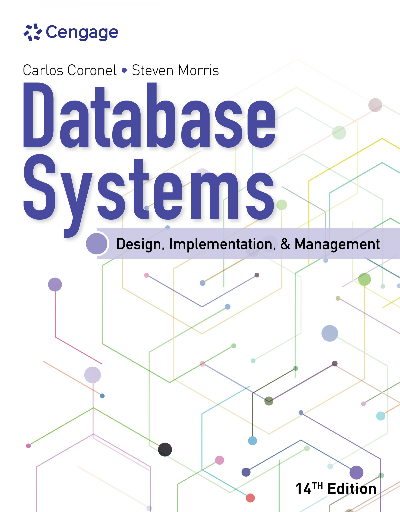
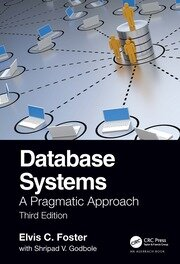

# DBMS

  <button type="button" id="lang-vi" aria-pressed="true">Tiếng Việt</button>
  <button type="button" id="lang-en" aria-pressed="false">English</button>

<section id="content-vi" class="language-panel" lang="vi" markdown="1">

Tài liệu học tập về hệ quản trị cơ sở dữ liệu và MySQL.

## Đề cương môn học

- [Syllabus Database VNUIS](assets/files/Syllabus_Database_VNUIS.pdf)

## Sách tham khảo

| Bìa sách | Tài liệu | Tác giả | Nhà xuất bản | ISBN | Liên kết |
|---|---|---|---|---|---|
|  | **Database Systems: Design, Implementation, & Management, 14th Edition** | Carlos Coronel, Steven Morris | Cengage, 2023 | 9780357673034 | [Thông tin sách](https://www.cengageasia.com/title/default/detail?isbn=9780357673034) |
|  | **Database Systems: A Pragmatic Approach, 3rd edition** | Elvis C. Foster, Shripad Godbole | CRC Press / Taylor & Francis, 2022 | 9781032202020 | [Thông tin sách](https://www.routledge.com/Database-Systems-A-Pragmatic-Approach-3rd-edition/Foster-Godbole/p/book/9781032202020) |

## DBMS Basic

| Bài học | Bài giảng Markdown | Slides PDF | Ghi chú |
|---|---|---|---|
| Giới thiệu cơ sở dữ liệu | [Markdown](DBMS_Basic/gioi_thieu_csdl_vi/gioi_thieu_csdl_vi.md) | [VI](DBMS_Basic/gioi_thieu_csdl_vi/gioi_thieu_csdl_vi_beamer.pdf) / [EN](DBMS_Basic/gioi_thieu_csdl_vi/gioi_thieu_csdl_en_beamer.pdf) | Có slides song ngữ |
| Giới thiệu DBMS | [Markdown](DBMS_Basic/gioi_thieu_dbms_vi/gioi_thieu_dbms_vi.md) | — | |
| Nhu cầu sử dụng DBMS | [Markdown](DBMS_Basic/nhu_cau_su_dung_dbms_vi/nhu_cau_su_dung_dbms_vi.md) | — | |
| Kiến trúc DBMS | [Markdown](DBMS_Basic/kien_truc_dbms_vi/kien_truc_dbms_vi.md) | [VI](DBMS_Basic/kien_truc_dbms_vi/kien_truc_dbms_vi.pdf) / [EN](DBMS_Basic/kien_truc_dbms_vi/kien_truc_dbms_en.pdf) | Có slides song ngữ |
| Trừu tượng hóa dữ liệu | [Markdown](DBMS_Basic/data-abstraction/data-abstraction.md) | — | |
| Độc lập dữ liệu | [Markdown](DBMS_Basic/data-independence/data-independence.md) | [VI](DBMS_Basic/data-independence/data_independence_beamer_pdflatex.pdf) / [EN](DBMS_Basic/data-independence/data_independence_beamer_english_pdflatex.pdf) | Có slides song ngữ |
| Lược đồ cơ sở dữ liệu | [Markdown](DBMS_Basic/database-schema/database-schema.md) | — | |
| Cách lựa chọn DBMS phù hợp | [Markdown](DBMS_Basic/choose-right-dbms/choose-right-dbms.md) | [VI](DBMS_Basic/choose-right-dbms/choose-right-dbms-vi.pdf) / [EN](DBMS_Basic/choose-right-dbms/choose-right-dbms-en.pdf) | Có slides song ngữ |

<!-- | Độc lập vật lý và độc lập logic | [Markdown](DBMS_Basic/physical-logical-independence/physical-logical-independence.md) | — | | -->

## Data Modeling

| Bài học | Bài giảng Markdown | Slides PDF | Ghi chú |
|---|---|---|---|
| Mô hình hóa dữ liệu trong DBMS | [Markdown](Data-Modeling/data-modeling/data-modeling.md) | — | |
| Relational Schema trong DBMS | [Markdown](Data-Modeling/relational-schema/relational-schema.md) | — | |
| Mapping từ ER Model sang Relational Model | [Markdown](Data-Modeling/er-2-relational/er-2-relational.md) | — | |
| Giới thiệu ER Model trong DBMS | [Markdown](Data-Modeling/er-model/er-model.md) | [VI](Data-Modeling/er-model/er-model-vi.pdf) / [EN](Data-Modeling/er-model/er-model-en.pdf) | Có slides song ngữ |
| Quan hệ đệ quy trong sơ đồ ER | [Markdown](Data-Modeling/recursive-relationship/recursive-relationship.md) | — | |
| Mô hình Enhanced ER trong DBMS | [Markdown](Data-Modeling/enhanced-er-model/enhanced-er-model.md) | [VI](Data-Modeling/enhanced-er-model/enhance-er-model-beamer-vi.pdf) | |
| Generalization, Specialization và Aggregation trong ER Model | [Markdown](Data-Modeling/generalization-specialization-aggregation/generalization-specialization-aggregation.md) | — | Có ví dụ và bài tập vận dụng |
| Các loại khóa trong mô hình quan hệ | [Markdown](Data-Modeling/key/key.md) | — | Super, candidate, primary, foreign và các loại khóa khác |
| Functional Dependency trong DBMS | [Markdown](Data-Modeling/functional-dependency/functional-dependency.md) | — | Phụ thuộc hàm, determinant và dependent attribute |
| Các loại Functional Dependency trong DBMS | [Markdown](Data-Modeling/functional-dependency-types/functional-dependency-types.md) | — | Trivial, non-trivial, multivalued, transitive, fully và partial dependency |
| Attribute Closure trong DBMS | [Markdown](Data-Modeling/attribute-closure/attribute-closure.md) | — | Đang cập nhật nội dung bài học |
| Normal Forms trong DBMS | [Markdown](Data-Modeling/normal-forms/normal-forms.md) | — | Tổng quan chuẩn hóa và các dạng chuẩn |
| First Normal Form (1NF) trong DBMS | [Markdown](Data-Modeling/1st-normal-form/1st-normal-form.md) | — | Loại bỏ nhóm lặp và đảm bảo giá trị nguyên tử |
| Second Normal Form (2NF) trong DBMS | [Markdown](Data-Modeling/2nd-normal-form/2nd-normal-form.md) | — | Phụ thuộc đầy đủ vào khóa chính |
| Third Normal Form (3NF) trong DBMS | [Markdown](Data-Modeling/3rd-normal-form/3rd-normal-form.md) | — | Loại bỏ phụ thuộc bắc cầu |
| Fourth Normal Form (4NF) trong DBMS | [Markdown](Data-Modeling/4th-normal-form/4th-normal-form.md) | — | Xử lý phụ thuộc đa trị |
| Schema Design trong DBMS | [Markdown](Data-Modeling/schema-design/schema-design.md) | — | Đang cập nhật nội dung bài học |

## Labs

| Lab | Markdown | Thời gian | Độ khó |
|---|---|---:|---|
| Lab 1: ER model basics | [Markdown](Data-Modeling/lab-er-model-1.md) / [Solution](Data-Modeling/lab-er-model-1-hot-water-solution/) | 60m | Beginner |

## MySQL Server

| Bài học | Bài giảng Markdown | Slides PDF | Ghi chú |
|---|---|---|---|
| Giới thiệu MySQL | [Markdown](MySQL/MySQL%20Server/gioi-thieu-mysql/gioi-thieu-mysql.md) | — | |
| Cài đặt MySQL trên Windows | [Markdown](MySQL/MySQL%20Server/huong_dan_cai_dat_mysql_windows/huong_dan_cai_dat_mysql_windows.md) | — | |
| Cài đặt MySQL Workbench trên Windows | [Markdown](MySQL/MySQL%20Server/huong_dan_cai_dat_mysql_workbench_windows/huong_dan_cai_dat_mysql_workbench_windows.md) | — | |
| Kết nối MySQL bằng command options | [Markdown](MySQL/MySQL%20Server/huong_dan_ket_noi_mysql_command_options/huong_dan_ket_noi_mysql_command_options.md) | — | |
| Kết nối MySQL trong VS Code | [Markdown](MySQL/MySQL%20Server/huong_dan_ket_noi_mysql_vscode/huong_dan_ket_noi_mysql_vscode.md) | — | |
| Khởi động và dừng MySQL | [Markdown](MySQL/MySQL%20Server/start-stop-MySQL/start-stop-MySQL.md) | — | |
| MySQL Sample Database: classicmodels | [Markdown](MySQL/MySQL%20Server/mysql-sample-database/mysql-sample-database.md) | — | |
| Nạp MySQL sample database vào server | [Markdown](MySQL/MySQL%20Server/load-sample-database/load-sample-database.md) | — | |
| MySQL Storage Engines | [Markdown](MySQL/MySQL%20Server/storage-engine/storage-engine.md) | — | |
| Khám phá MySQL Server: kiến trúc và mysqld | [Markdown](MySQL/MySQL%20Server/exploring-mysql-server-1.md) | — | MySQL Server, mysqld, client và storage engine |
| Quản lý vòng đời MySQL Server: start, stop và restart | [Markdown](MySQL/MySQL%20Server/exploring-mysql-server-2.md) | — | Kiểm tra service, start, stop, restart và log cơ bản |
| MySQL Configuration File và Data Directory | [Markdown](MySQL/MySQL%20Server/exploring-mysql-server-3.md) | — | Option file, system variables và data directory |

## Quản lý CSDL và quản trị MySQL

| Bài học | Bài giảng Markdown | Slides PDF | Ghi chú |
|---|---|---|---|
| Chọn cơ sở dữ liệu trong MySQL | [Markdown](MySQL/SQL/select-database/select-database.md) | — | `USE`, database mặc định |
| Tạo cơ sở dữ liệu trong MySQL | [Markdown](MySQL/SQL/create-database/create-database.md) | — | `CREATE DATABASE` |
| Xóa cơ sở dữ liệu trong MySQL | [Markdown](MySQL/SQL/drop-database/drop-database.md) | — | `DROP DATABASE` |
| SHOW Commands và mysqldump trong MySQL | [Markdown](MySQL/MySQL%20Server/show-command.md) | — | SHOW DATABASES, SHOW TABLES, SHOW COLUMNS, backup và restore |
| Quản lý người dùng, quyền và role trong MySQL | [Markdown](MySQL/SQL/user-administration.md) | — | User administration, privileges và roles |

## Câu lệnh SQL trong MySQL

### Định nghĩa dữ liệu và kiểu dữ liệu

| Bài học | Bài giảng Markdown | Slides PDF | Ghi chú |
|---|---|---|---|
| Kiểu dữ liệu SQL | [Markdown](MySQL/SQL/sql-data-types/sql-data-types.md) | — | |
| Tạo bảng bằng SQL | [Markdown](MySQL/SQL/sql-create-table/sql-create-table.md) | — | |
| Tutorial: Ràng buộc trong CREATE TABLE với MySQL | [Markdown](MySQL/SQL/create-table-statement.md) | — | PRIMARY KEY, FOREIGN KEY, NOT NULL, UNIQUE, CHECK và DEFAULT |

### Truy vấn dữ liệu với SELECT

| Bài học | Bài giảng Markdown | Slides PDF | Ghi chú |
|---|---|---|---|
| Câu lệnh SELECT cơ bản trong MySQL | [Markdown](MySQL/SQL/SELECT/select-statement-1.md) | — | Sử dụng CSDL mẫu `classicmodels` |
| SELECT và JOIN trong MySQL | [Markdown](MySQL/SQL/SELECT/select-statement-2.md) | — | Sử dụng CSDL mẫu `classicmodels` |
| Hàm SQL trong MySQL | [Markdown](MySQL/SQL/SELECT/select-statement-3.md) | — | Sử dụng CSDL mẫu `classicmodels` |
| GROUP BY, HAVING và truy vấn tổng hợp trong MySQL | [Markdown](MySQL/SQL/SELECT/select-statement-4.md) | — | Sử dụng CSDL mẫu `classicmodels` |
| Subquery trong MySQL | [Markdown](MySQL/SQL/SELECT/select-statement-5.md) | — | Sử dụng CSDL mẫu `classicmodels` |
| CTE và WITH trong MySQL | [Markdown](MySQL/SQL/SELECT/select-statement-6.md) | — | Sử dụng CSDL mẫu `classicmodels` |
| Subquery với EXISTS, NOT EXISTS, ALL và ANY trong MySQL | [Markdown](MySQL/SQL/SELECT/select-statement-7.md) | — | Sử dụng CSDL mẫu `classicmodels` |
| Các phép toán tập hợp UNION, EXCEPT và INTERSECT trong MySQL | [Markdown](MySQL/SQL/set-operations.md) | — | Sử dụng CSDL mẫu `classicmodels` |
| Lab: Kết nối nhiều bảng bằng WHERE và JOIN ON trong MySQL | [Markdown](MySQL/SQL/SELECT/select-statement-note-1.md) | — | Ghi chú bổ sung về implicit join, explicit join và điều kiện `ON` |
| Tutorial: CTE vs Subquery trong MySQL | [Markdown](MySQL/SQL/SELECT/select-statement-note-2.md) | — | Ghi chú bổ sung so sánh Subquery và CTE |

### Index và tối ưu truy vấn

| Bài học | Bài giảng Markdown | Slides PDF | Ghi chú |
|---|---|---|---|
| Tạo và quản lý Index trong MySQL | [Markdown](MySQL/SQL/INDEX/index-1.md) | — | CREATE INDEX, DROP INDEX, SHOW INDEX và composite index |
| MySQL Index Types và chiến lược chọn Index | [Markdown](MySQL/SQL/INDEX/index-2.md) | — | Unique, prefix, invisible, descending, clustered và functional indexes |
| MySQL Index Hints: USE INDEX và FORCE INDEX | [Markdown](MySQL/SQL/INDEX/index-3.md) | — | EXPLAIN, optimizer và index hints |

### Thao tác dữ liệu và giao dịch

| Bài học | Bài giảng Markdown | Slides PDF | Ghi chú |
|---|---|---|---|
| INSERT, UPDATE và DELETE trong MySQL | [Markdown](MySQL/SQL/DML/insert-update-delete.md) | — | Sử dụng CSDL mẫu `classicmodels` |
| Thao tác dữ liệu nâng cao trong MySQL | [Markdown](MySQL/SQL/modifying-data.md) | — | INSERT, UPDATE, DELETE, CASCADE, DELETE JOIN và REPLACE |
| Transaction trong MySQL | [Markdown](MySQL/SQL/transaction.md) | — | START TRANSACTION, COMMIT, ROLLBACK, SAVEPOINT và autocommit |

### View, stored procedure, stored function, trigger và event

| Bài học | Bài giảng Markdown | Slides PDF | Ghi chú |
|---|---|---|---|
| Views trong MySQL | [Markdown](MySQL/SQL/View/view.md) | [PDF](MySQL/SQL/View/view.pdf) | CREATE VIEW, updatable view và WITH CHECK OPTION |
| Stored Procedures cơ bản trong MySQL | [Markdown](MySQL/SQL/STORED-PROCEDURE/stored-procedure-1.md) | — | DELIMITER, CREATE PROCEDURE, CALL và tham số |
| Điều kiện và vòng lặp trong MySQL Stored Procedures | [Markdown](MySQL/SQL/STORED-PROCEDURE/stored-procedure-2.md) | — | IF, CASE, LOOP, WHILE, REPEAT và LEAVE |
| Cursors và Prepared Statements trong MySQL Stored Procedures | [Markdown](MySQL/SQL/STORED-PROCEDURE/stored-procedure-3.md) | — | Cursor và dynamic SQL |
| Stored Functions trong MySQL | [Markdown](MySQL/SQL/STORED-PROCEDURE/stored-procedure-4.md) | — | CREATE FUNCTION, DROP FUNCTION và SHOW FUNCTION STATUS |
| MySQL Triggers: nền tảng, CREATE/DROP/SHOW và INSERT triggers | [Markdown](MySQL/SQL/TRIGGER/triggers-1.md) | — | BEFORE INSERT, AFTER INSERT, audit log và summary table |
| MySQL Triggers: UPDATE, DELETE, validation và audit | [Markdown](MySQL/SQL/TRIGGER/triggers-2.md) | — | BEFORE UPDATE, AFTER UPDATE, BEFORE DELETE và AFTER DELETE |
| MySQL Triggers: multiple triggers, metadata và best practices | [Markdown](MySQL/SQL/TRIGGER/triggers-3.md) | — | PRECEDES, FOLLOWS, INFORMATION_SCHEMA và restrictions |
| MySQL Events và Event Scheduler | [Markdown](MySQL/SQL/EVENTS/event.md) | — | CREATE EVENT, ALTER EVENT, SHOW EVENTS và DROP EVENT |

## Tham khảo

- GeeksforGeeks: [Database Management System Tutorial](https://www.geeksforgeeks.org/dbms/dbms/)
- GeeksforGeeks: [SQL Tutorial](https://www.geeksforgeeks.org/sql/sql-tutorial/)
- MySQL Tutorial: [MySQL Tutorial](https://www.mysqltutorial.org/)
- GeeksforGeeks: [30 Days of SQL - From Basic to Advanced Level](https://www.geeksforgeeks.org/sql/30-days-of-sql-from-basic-to-advanced-level/)
- Roadmap.sh: [SQL Roadmap](https://roadmap.sh/sql?fl=1)

</section>

<section id="content-en" class="language-panel" lang="en" hidden markdown="1">

Learning materials for database management systems and MySQL.

## Course Syllabus

- [Syllabus Database VNUIS](assets/files/Syllabus_Database_VNUIS.pdf)

## Reference Books

| Cover | Reference | Authors | Publisher | ISBN | Link |
|---|---|---|---|---|---|
|  | **Database Systems: Design, Implementation, & Management, 14th Edition** | Carlos Coronel, Steven Morris | Cengage, 2023 | 9780357673034 | [Book information](https://www.cengageasia.com/title/default/detail?isbn=9780357673034) |
|  | **Database Systems: A Pragmatic Approach, 3rd edition** | Elvis C. Foster, Shripad Godbole | CRC Press / Taylor & Francis, 2022 | 9781032202020 | [Book information](https://www.routledge.com/Database-Systems-A-Pragmatic-Approach-3rd-edition/Foster-Godbole/p/book/9781032202020) |

## DBMS Basic

| Lesson | Markdown Lecture | Slides PDF | Notes |
|---|---|---|---|
| Introduction to Databases | [Markdown](DBMS_Basic/gioi_thieu_csdl_vi/gioi_thieu_csdl_vi.md) | [VI](DBMS_Basic/gioi_thieu_csdl_vi/gioi_thieu_csdl_vi_beamer.pdf) / [EN](DBMS_Basic/gioi_thieu_csdl_vi/gioi_thieu_csdl_en_beamer.pdf) | Bilingual slides |
| Introduction to DBMS | [Markdown](DBMS_Basic/gioi_thieu_dbms_vi/gioi_thieu_dbms_vi.md) | — | |
| Why Use a DBMS? | [Markdown](DBMS_Basic/nhu_cau_su_dung_dbms_vi/nhu_cau_su_dung_dbms_vi.md) | — | |
| DBMS Architecture | [Markdown](DBMS_Basic/kien_truc_dbms_vi/kien_truc_dbms_vi.md) | [VI](DBMS_Basic/kien_truc_dbms_vi/kien_truc_dbms_vi.pdf) / [EN](DBMS_Basic/kien_truc_dbms_vi/kien_truc_dbms_en.pdf) | Bilingual slides |
| Data Abstraction | [Markdown](DBMS_Basic/data-abstraction/data-abstraction.md) | — | |
| Data Independence | [Markdown](DBMS_Basic/data-independence/data-independence.md) | [VI](DBMS_Basic/data-independence/data_independence_beamer_pdflatex.pdf) / [EN](DBMS_Basic/data-independence/data_independence_beamer_english_pdflatex.pdf) | Bilingual slides |
| Physical and Logical Independence | [Markdown](DBMS_Basic/physical-logical-independence/physical-logical-independence.md) | — | |
| Database Schema | [Markdown](DBMS_Basic/database-schema/database-schema.md) | — | |
| How to Choose the Right DBMS | [Markdown](DBMS_Basic/choose-right-dbms/choose-right-dbms.md) | [VI](DBMS_Basic/choose-right-dbms/choose-right-dbms-vi.pdf) / [EN](DBMS_Basic/choose-right-dbms/choose-right-dbms-en.pdf) | Bilingual slides |

## Data Modeling

| Lesson | Markdown Lecture | Slides PDF | Notes |
|---|---|---|---|
| Data Modeling in DBMS | [Markdown](Data-Modeling/data-modeling/data-modeling.md) | — | |
| Relational Schema in DBMS | [Markdown](Data-Modeling/relational-schema/relational-schema.md) | — | |
| Mapping from ER Model to Relational Model | [Markdown](Data-Modeling/er-2-relational/er-2-relational.md) | — | |
| Introduction to ER Model in DBMS | [Markdown](Data-Modeling/er-model/er-model.md) | [VI](Data-Modeling/er-model/er-model-vi.pdf) / [EN](Data-Modeling/er-model/er-model-en.pdf) | Bilingual slides |
| Recursive Relationships in ER Diagrams | [Markdown](Data-Modeling/recursive-relationship/recursive-relationship.md) | — | |
| Enhanced ER Model | [Markdown](Data-Modeling/enhanced-er-model/enhanced-er-model.md) | [VI](Data-Modeling/enhanced-er-model/enhance-er-model-beamer-vi.pdf) | |
| Generalization, Specialization, and Aggregation in the ER Model | [Markdown](Data-Modeling/generalization-specialization-aggregation/generalization-specialization-aggregation.md) | — | Includes examples and exercises |
| Types of Keys in the Relational Model | [Markdown](Data-Modeling/key/key.md) | — | Super, candidate, primary, foreign, and other key types |
| Functional Dependency in DBMS | [Markdown](Data-Modeling/functional-dependency/functional-dependency.md) | — | Functional dependency, determinant, and dependent attribute |
| Types of Functional Dependencies in DBMS | [Markdown](Data-Modeling/functional-dependency-types/functional-dependency-types.md) | — | Trivial, non-trivial, multivalued, transitive, fully, and partial dependency |
| Attribute Closure in DBMS | [Markdown](Data-Modeling/attribute-closure/attribute-closure.md) | — | Lesson content in progress |
| Normal Forms in DBMS | [Markdown](Data-Modeling/normal-forms/normal-forms.md) | — | Overview of normalization and normal forms |
| First Normal Form (1NF) in DBMS | [Markdown](Data-Modeling/1st-normal-form/1st-normal-form.md) | — | Removes repeating groups and keeps values atomic |
| Second Normal Form (2NF) in DBMS | [Markdown](Data-Modeling/2nd-normal-form/2nd-normal-form.md) | — | Full dependency on the primary key |
| Third Normal Form (3NF) in DBMS | [Markdown](Data-Modeling/3rd-normal-form/3rd-normal-form.md) | — | Removes transitive dependencies |
| Fourth Normal Form (4NF) in DBMS | [Markdown](Data-Modeling/4th-normal-form/4th-normal-form.md) | — | Handles multivalued dependencies |
| Schema Design in DBMS | [Markdown](Data-Modeling/schema-design/schema-design.md) | — | Lesson content in progress |

## Labs

| Lab | Markdown | Duration | Difficulty |
|---|---|---:|---|
| Lab 1: ER model basics | [Markdown](Data-Modeling/lab-er-model-1.md) / [Solution](Data-Modeling/lab-er-model-1-hot-water-solution/) | 60m | Beginner |

**Short description:** Hands-on practice building an ER model: entities, attributes, primary keys, relationships, and mapping to relational schema.

## MySQL Server

| Lesson | Markdown Lecture | Slides PDF | Notes |
|---|---|---|---|
| Introduction to MySQL | [Markdown](MySQL/MySQL%20Server/gioi-thieu-mysql/gioi-thieu-mysql.md) | — | |
| Install MySQL on Windows | [Markdown](MySQL/MySQL%20Server/huong_dan_cai_dat_mysql_windows/huong_dan_cai_dat_mysql_windows.md) | — | |
| Install MySQL Workbench on Windows | [Markdown](MySQL/MySQL%20Server/huong_dan_cai_dat_mysql_workbench_windows/huong_dan_cai_dat_mysql_workbench_windows.md) | — | |
| Connect to MySQL with Command Options | [Markdown](MySQL/MySQL%20Server/huong_dan_ket_noi_mysql_command_options/huong_dan_ket_noi_mysql_command_options.md) | — | |
| Connect to MySQL in VS Code | [Markdown](MySQL/MySQL%20Server/huong_dan_ket_noi_mysql_vscode/huong_dan_ket_noi_mysql_vscode.md) | — | |
| Start and Stop MySQL | [Markdown](MySQL/MySQL%20Server/start-stop-MySQL/start-stop-MySQL.md) | — | |
| MySQL Sample Database: classicmodels | [Markdown](MySQL/MySQL%20Server/mysql-sample-database/mysql-sample-database.md) | — | |
| Load MySQL Sample Database into Server | [Markdown](MySQL/MySQL%20Server/load-sample-database/load-sample-database.md) | — | |
| MySQL Storage Engines | [Markdown](MySQL/MySQL%20Server/storage-engine/storage-engine.md) | — | |
| Exploring MySQL Server: Architecture and mysqld | [Markdown](MySQL/MySQL%20Server/exploring-mysql-server-1.md) | — | MySQL Server, mysqld, clients, and storage engines |
| MySQL Server Lifecycle: Start, Stop, and Restart | [Markdown](MySQL/MySQL%20Server/exploring-mysql-server-2.md) | — | Service checks, start, stop, restart, and basic logs |
| MySQL Configuration File and Data Directory | [Markdown](MySQL/MySQL%20Server/exploring-mysql-server-3.md) | — | Option files, system variables, and data directory |

## Database Management and MySQL Administration

| Lesson | Markdown Lecture | Slides PDF | Notes |
|---|---|---|---|
| Selecting a MySQL Database | [Markdown](MySQL/SQL/select-database/select-database.md) | — | `USE` and default database |
| Creating a MySQL Database | [Markdown](MySQL/SQL/create-database/create-database.md) | — | `CREATE DATABASE` |
| Dropping a MySQL Database | [Markdown](MySQL/SQL/drop-database/drop-database.md) | — | `DROP DATABASE` |
| SHOW Commands and mysqldump in MySQL | [Markdown](MySQL/MySQL%20Server/show-command.md) | — | SHOW DATABASES, SHOW TABLES, SHOW COLUMNS, backup, and restore |
| User Administration, Privileges, and Roles in MySQL | [Markdown](MySQL/SQL/user-administration.md) | — | Users, privileges, and roles |

## SQL Statements in MySQL

### Data Definition and Data Types

| Lesson | Markdown Lecture | Slides PDF | Notes |
|---|---|---|---|
| SQL Data Types | [Markdown](MySQL/SQL/sql-data-types/sql-data-types.md) | — | |
| Creating Tables with SQL | [Markdown](MySQL/SQL/sql-create-table/sql-create-table.md) | — | |
| Tutorial: Constraints in CREATE TABLE with MySQL | [Markdown](MySQL/SQL/create-table-statement.md) | — | PRIMARY KEY, FOREIGN KEY, NOT NULL, UNIQUE, CHECK, and DEFAULT |

### Querying Data with SELECT

| Lesson | Markdown Lecture | Slides PDF | Notes |
|---|---|---|---|
| Basic MySQL SELECT Statement | [Markdown](MySQL/SQL/SELECT/select-statement-1.md) | — | Uses the `classicmodels` sample database |
| MySQL SELECT and JOIN | [Markdown](MySQL/SQL/SELECT/select-statement-2.md) | — | Uses the `classicmodels` sample database |
| MySQL SQL Functions | [Markdown](MySQL/SQL/SELECT/select-statement-3.md) | — | Uses the `classicmodels` sample database |
| MySQL GROUP BY, HAVING, and Aggregate Queries | [Markdown](MySQL/SQL/SELECT/select-statement-4.md) | — | Uses the `classicmodels` sample database |
| MySQL Subqueries | [Markdown](MySQL/SQL/SELECT/select-statement-5.md) | — | Uses the `classicmodels` sample database |
| MySQL CTE and WITH | [Markdown](MySQL/SQL/SELECT/select-statement-6.md) | — | Uses the `classicmodels` sample database |
| MySQL Subqueries with EXISTS, NOT EXISTS, ALL, and ANY | [Markdown](MySQL/SQL/SELECT/select-statement-7.md) | — | Uses the `classicmodels` sample database |
| MySQL Set Operations: UNION, EXCEPT, and INTERSECT | [Markdown](MySQL/SQL/set-operations.md) | — | Uses the `classicmodels` sample database |
| Lab: Joining Tables with WHERE and JOIN ON in MySQL | [Markdown](MySQL/SQL/SELECT/select-statement-note-1.md) | — | Supplementary notes on implicit join, explicit join, and `ON` conditions |
| Tutorial: CTE vs Subquery in MySQL | [Markdown](MySQL/SQL/SELECT/select-statement-note-2.md) | — | Supplementary notes comparing Subquery and CTE |

### Indexes and Query Optimization

| Lesson | Markdown Lecture | Slides PDF | Notes |
|---|---|---|---|
| Creating and Managing Indexes in MySQL | [Markdown](MySQL/SQL/INDEX/index-1.md) | — | CREATE INDEX, DROP INDEX, SHOW INDEX, and composite indexes |
| MySQL Index Types and Index Selection Strategy | [Markdown](MySQL/SQL/INDEX/index-2.md) | — | Unique, prefix, invisible, descending, clustered, and functional indexes |
| MySQL Index Hints: USE INDEX and FORCE INDEX | [Markdown](MySQL/SQL/INDEX/index-3.md) | — | EXPLAIN, optimizer, and index hints |

### Data Modification and Transactions

| Lesson | Markdown Lecture | Slides PDF | Notes |
|---|---|---|---|
| MySQL INSERT, UPDATE, and DELETE | [Markdown](MySQL/SQL/DML/insert-update-delete.md) | — | Uses the `classicmodels` sample database |
| Advanced Data Modification in MySQL | [Markdown](MySQL/SQL/modifying-data.md) | — | INSERT, UPDATE, DELETE, CASCADE, DELETE JOIN, and REPLACE |
| Transactions in MySQL | [Markdown](MySQL/SQL/transaction.md) | — | START TRANSACTION, COMMIT, ROLLBACK, SAVEPOINT, and autocommit |

### Views, Stored Procedures, Stored Functions, Triggers, and Events

| Lesson | Markdown Lecture | Slides PDF | Notes |
|---|---|---|---|
| Views in MySQL | [Markdown](MySQL/SQL/View/view.md) | [PDF](MySQL/SQL/View/view.pdf) | CREATE VIEW, updatable views, and WITH CHECK OPTION |
| Basic Stored Procedures in MySQL | [Markdown](MySQL/SQL/STORED-PROCEDURE/stored-procedure-1.md) | — | DELIMITER, CREATE PROCEDURE, CALL, and parameters |
| Conditions and Loops in MySQL Stored Procedures | [Markdown](MySQL/SQL/STORED-PROCEDURE/stored-procedure-2.md) | — | IF, CASE, LOOP, WHILE, REPEAT, and LEAVE |
| Cursors and Prepared Statements in MySQL Stored Procedures | [Markdown](MySQL/SQL/STORED-PROCEDURE/stored-procedure-3.md) | — | Cursors and dynamic SQL |
| Stored Functions in MySQL | [Markdown](MySQL/SQL/STORED-PROCEDURE/stored-procedure-4.md) | — | CREATE FUNCTION, DROP FUNCTION, and SHOW FUNCTION STATUS |
| MySQL Triggers: Foundations, CREATE/DROP/SHOW, and INSERT Triggers | [Markdown](MySQL/SQL/TRIGGER/triggers-1.md) | — | BEFORE INSERT, AFTER INSERT, audit logs, and summary tables |
| MySQL Triggers: UPDATE, DELETE, Validation, and Audit | [Markdown](MySQL/SQL/TRIGGER/triggers-2.md) | — | BEFORE UPDATE, AFTER UPDATE, BEFORE DELETE, and AFTER DELETE |
| MySQL Triggers: Multiple Triggers, Metadata, and Best Practices | [Markdown](MySQL/SQL/TRIGGER/triggers-3.md) | — | PRECEDES, FOLLOWS, INFORMATION_SCHEMA, and restrictions |
| MySQL Events and Event Scheduler | [Markdown](MySQL/SQL/EVENTS/event.md) | — | CREATE EVENT, ALTER EVENT, SHOW EVENTS, and DROP EVENT |

## References

- GeeksforGeeks: [Database Management System Tutorial](https://www.geeksforgeeks.org/dbms/dbms/)
- GeeksforGeeks: [SQL Tutorial](https://www.geeksforgeeks.org/sql/sql-tutorial/)
- MySQL Tutorial: [MySQL Tutorial](https://www.mysqltutorial.org/)
- GeeksforGeeks: [30 Days of SQL - From Basic to Advanced Level](https://www.geeksforgeeks.org/sql/30-days-of-sql-from-basic-to-advanced-level/)
- Roadmap.sh: [SQL Roadmap](https://roadmap.sh/sql?fl=1)

</section>

