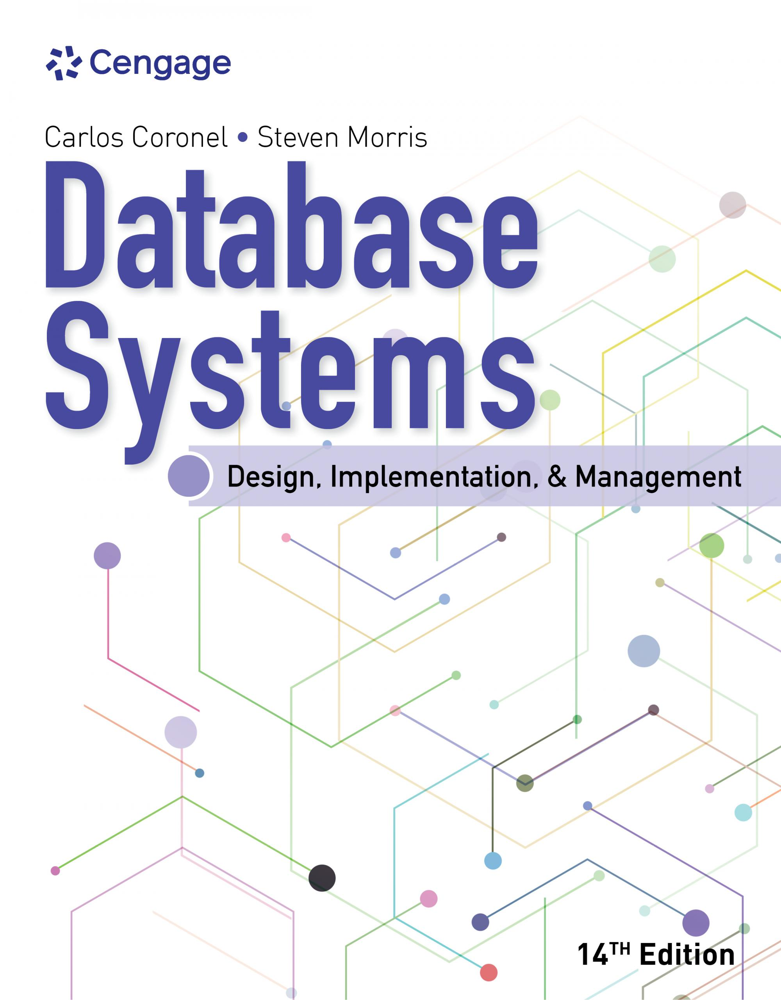
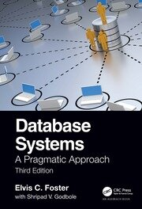

---
title: DBMS
---

# DBMS

  <button type="button" id="lang-vi" aria-pressed="true">Tiếng Việt</button>
  <button type="button" id="lang-en" aria-pressed="false">English</button>

<section id="content-vi" class="language-panel" lang="vi" markdown="1">

Tài liệu học tập về hệ quản trị cơ sở dữ liệu và MySQL.

## Đề cương môn học

- [Syllabus Database VNUIS](assets/files/Syllabus_Database_VNUIS.pdf)

## Sách tham khảo

| Bìa sách | Tài liệu | Tác giả | Nhà xuất bản | ISBN | Liên kết |
|---|---|---|---|---|---|
|  | **Database Systems: Design, Implementation, & Management, 14th Edition** | Carlos Coronel, Steven Morris | Cengage, 2023 | 9780357673034 | [Thông tin sách](https://www.cengageasia.com/title/default/detail?isbn=9780357673034) |
|  | **Database Systems: A Pragmatic Approach, 3rd edition** | Elvis C. Foster, Shripad Godbole | CRC Press / Taylor & Francis, 2022 | 9781032202020 | [Thông tin sách](https://www.routledge.com/Database-Systems-A-Pragmatic-Approach-3rd-edition/Foster-Godbole/p/book/9781032202020) |

## Introduction

Phần này trình bày các khái niệm nền tảng của DBMS, nhu cầu sử dụng DBMS và các kiến trúc cơ sở dữ liệu thường gặp trong hệ thống thực tế.

| Bài học | Bài giảng Markdown | Slides PDF | Ghi chú |
|---|---|---|---|
| Tổng quan Introduction to DBMS | [Markdown](introduction/introduction.md) | — | Bài tổng quan nhập môn |
| Giới thiệu cơ sở dữ liệu | [Markdown](introduction/gioi_thieu_csdl_vi/gioi_thieu_csdl_vi.md) | [VI](introduction/gioi_thieu_csdl_vi/gioi_thieu_csdl_vi_beamer.pdf) / [EN](introduction/gioi_thieu_csdl_vi/gioi_thieu_csdl_en_beamer.pdf) | Có slides song ngữ |
| Giới thiệu DBMS | [Markdown](introduction/gioi_thieu_dbms_vi/gioi_thieu_dbms_vi.md) | — | |
| Nhu cầu sử dụng DBMS | [Markdown](introduction/nhu_cau_su_dung_dbms_vi/nhu_cau_su_dung_dbms_vi.md) | — | |
| Kiến trúc DBMS | [Markdown](introduction/kien_truc_dbms_vi/kien_truc_dbms_vi.md) | [VI](introduction/kien_truc_dbms_vi/kien_truc_dbms_vi.pdf) / [EN](introduction/kien_truc_dbms_vi/kien_truc_dbms_en.pdf) | Kiến trúc 1-tier, 2-tier, 3-tier |
| Trừu tượng hóa dữ liệu | [Markdown](introduction/data-abstraction/data-abstraction.md) | — | Ba mức trừu tượng dữ liệu |
| Độc lập dữ liệu | [Markdown](introduction/data-independence/data-independence.md) | [VI](introduction/data-independence/data_independence_beamer_pdflatex.pdf) / [EN](introduction/data-independence/data_independence_beamer_english_pdflatex.pdf) | Có slides song ngữ |
| Độc lập vật lý và độc lập logic | [Markdown](introduction/physical-logical-independence/physical-logical-independence.md) | — | |
| Lược đồ cơ sở dữ liệu | [Markdown](introduction/database-schema/database-schema.md) | — | Schema, instance và mô hình dữ liệu |
| Cách lựa chọn DBMS phù hợp | [Markdown](introduction/choose-right-dbms/choose-right-dbms.md) | [VI](introduction/choose-right-dbms/choose-right-dbms-vi.pdf) / [EN](introduction/choose-right-dbms/choose-right-dbms-en.pdf) | Có slides song ngữ |

## Entity Relationship Model

Phần này trình bày mô hình ER ở mức khái niệm, dùng thực thể, thuộc tính và mối quan hệ để biểu diễn dữ liệu trong bài toán thực tế.

| Bài học | Bài giảng Markdown | Slides PDF | Ghi chú |
|---|---|---|---|
| Mô hình hóa dữ liệu trong DBMS | [Markdown](entity-relationship-model/data-modeling/data-modeling.md) | — | Nền tảng trước khi thiết kế ERD |
| Giới thiệu ER Model trong DBMS | [Markdown](entity-relationship-model/er-model/er-model.md) | [VI](entity-relationship-model/er-model/er-model-vi.pdf) / [EN](entity-relationship-model/er-model/er-model-en.pdf) | Có slides song ngữ |
| Mô hình Enhanced ER trong DBMS | [Markdown](entity-relationship-model/enhanced-er-model/enhanced-er-model.md) | [VI](entity-relationship-model/enhanced-er-model/enhance-er-model-beamer-vi.pdf) | |
| Generalization, Specialization và Aggregation trong ER Model | [Markdown](entity-relationship-model/generalization-specialization-aggregation/generalization-specialization-aggregation.md) | — | Có ví dụ và bài tập vận dụng |
| Quan hệ đệ quy trong sơ đồ ER | [Markdown](entity-relationship-model/recursive-relationship/recursive-relationship.md) | — | |

### Labs ER Model

| Lab | Markdown | PDF | Ghi chú |
|---|---|---|---|
| Lab 1: ER model basics | [Markdown](entity-relationship-model/lab-er-model-1.md) / [Solution](entity-relationship-model/lab-er-model-1-hot-water-solution.md) | [Solution PDF](entity-relationship-model/lab-er-model-1-hot-water-solution.pdf) | Entities, attributes, keys, relationships |
| Lab 2: United Helpers ER model | [Markdown](entity-relationship-model/lab-er-model-2-united-helpers.md) / [Solution](entity-relationship-model/lab-er-model-2-united-helpers-solution.md) | [Lab PDF](entity-relationship-model/lab-er-model-2-united-helpers.pdf) / [Solution PDF](entity-relationship-model/lab-er-model-2-united-helpers-solution.pdf) | Bài thực hành ER mở rộng |

## Relational Model and Functional Dependencies

Phần này trình bày cách tổ chức dữ liệu theo bảng quan hệ, các loại khóa, phụ thuộc hàm và vai trò của chúng trong thiết kế lược đồ.

| Bài học | Bài giảng Markdown | Slides PDF | Ghi chú |
|---|---|---|---|
| Relational Schema trong DBMS | [Markdown](relational-model-and-functional-dependencies/relational-schema/relational-schema.md) | — | Relation, attribute, tuple và schema |
| Mapping từ ER Model sang Relational Model | [Markdown](relational-model-and-functional-dependencies/er-2-relational/er-2-relational.md) | — | Chuyển ERD sang bảng quan hệ |
| Các loại khóa trong mô hình quan hệ | [Markdown](relational-model-and-functional-dependencies/key/key.md) | — | Super, candidate, primary, foreign và các loại khóa khác |
| Functional Dependency trong DBMS | [Markdown](relational-model-and-functional-dependencies/functional-dependency/functional-dependency.md) | — | Phụ thuộc hàm, determinant và dependent attribute |
| Các loại Functional Dependency trong DBMS | [Markdown](relational-model-and-functional-dependencies/functional-dependency-types/functional-dependency-types.md) | — | Trivial, non-trivial, multivalued, transitive, fully và partial dependency |
| Attribute Closure trong DBMS | [Markdown](relational-model-and-functional-dependencies/attribute-closure/attribute-closure.md) | — | Tìm bao đóng thuộc tính |
| Schema Design trong DBMS | [Markdown](relational-model-and-functional-dependencies/schema-design/schema-design.md) | — | Chiến lược thiết kế schema |

## Normalization

Phần này trình bày chuẩn hóa dữ liệu, các dạng chuẩn và cách giảm dư thừa để cải thiện tính nhất quán của thiết kế cơ sở dữ liệu.

| Bài học | Bài giảng Markdown | Slides PDF | Ghi chú |
|---|---|---|---|
| Normal Forms trong DBMS | [Markdown](normalization/normal-forms/normal-forms.md) | — | Tổng quan chuẩn hóa và các dạng chuẩn |
| First Normal Form (1NF) trong DBMS | [Markdown](normalization/1st-normal-form/1st-normal-form.md) | — | Loại bỏ nhóm lặp và đảm bảo giá trị nguyên tử |
| Second Normal Form (2NF) trong DBMS | [Markdown](normalization/2nd-normal-form/2nd-normal-form.md) | — | Phụ thuộc đầy đủ vào khóa chính |
| Third Normal Form (3NF) trong DBMS | [Markdown](normalization/3rd-normal-form/3rd-normal-form.md) | — | Loại bỏ phụ thuộc bắc cầu |
| Fourth Normal Form (4NF) trong DBMS | [Markdown](normalization/4th-normal-form/4th-normal-form.md) | — | Xử lý phụ thuộc đa trị |

## MySQL Server

Phần này trình bày quá trình cài đặt, kết nối và vận hành MySQL Server trước khi làm việc với SQL. Nội dung bao gồm môi trường làm việc, dịch vụ MySQL, cơ sở dữ liệu mẫu, storage engine và các thành phần server thường gặp.

| Bài học | Bài giảng Markdown | Slides PDF | Ghi chú |
|---|---|---|---|
| Giới thiệu MySQL | [Markdown](MySQL/mysql-server/gioi-thieu-mysql/gioi-thieu-mysql.md) | — | Tổng quan MySQL và hệ sinh thái |
| Cài đặt MySQL trên Windows | [Markdown](MySQL/mysql-server/huong_dan_cai_dat_mysql_windows/huong_dan_cai_dat_mysql_windows.md) | — | Cài đặt server trên Windows |
| Cài đặt MySQL Workbench trên Windows | [Markdown](MySQL/mysql-server/huong_dan_cai_dat_mysql_workbench_windows/huong_dan_cai_dat_mysql_workbench_windows.md) | — | Công cụ GUI cho MySQL |
| Kết nối MySQL bằng command options | [Markdown](MySQL/mysql-server/huong_dan_ket_noi_mysql_command_options/huong_dan_ket_noi_mysql_command_options.md) | — | Kết nối bằng command line |
| Kết nối MySQL trong VS Code | [Markdown](MySQL/mysql-server/huong_dan_ket_noi_mysql_vscode/huong_dan_ket_noi_mysql_vscode.md) | — | Làm việc với MySQL trong VS Code |
| Khởi động và dừng MySQL | [Markdown](MySQL/mysql-server/start-stop-MySQL/start-stop-MySQL.md) | — | Quản lý service MySQL |
| MySQL Sample Database: classicmodels | [Markdown](MySQL/mysql-server/mysql-sample-database/mysql-sample-database.md) | — | Cấu trúc CSDL mẫu classicmodels |
| Nạp MySQL sample database vào server | [Markdown](MySQL/mysql-server/load-sample-database/load-sample-database.md) | — | Import dữ liệu mẫu vào MySQL |
| MySQL Storage Engines | [Markdown](MySQL/mysql-server/storage-engine/storage-engine.md) | — | InnoDB và storage engine |
| Khám phá MySQL Server: kiến trúc và mysqld | [Markdown](MySQL/mysql-server/exploring-mysql-server-1.md) | — | MySQL Server, mysqld, client và storage engine |
| Quản lý vòng đời MySQL Server: start, stop và restart | [Markdown](MySQL/mysql-server/exploring-mysql-server-2.md) | — | Kiểm tra service, start, stop, restart và log cơ bản |
| MySQL Configuration File và Data Directory | [Markdown](MySQL/mysql-server/exploring-mysql-server-3.md) | — | Option file, system variables và data directory |

## Quản lý CSDL và quản trị MySQL

Phần này trình bày các thao tác quản trị thường dùng: tạo, chọn và xóa database; sử dụng lệnh `SHOW`; backup/restore cơ bản; quản lý user, role, privilege và các chủ đề bảo mật dữ liệu.

| Bài học | Bài giảng Markdown | Slides PDF | Ghi chú |
|---|---|---|---|
| Quản lý vòng đời Database trong MySQL | [Markdown](MySQL/database-administration/database/create-use-drop-database.md) | — | `USE`, `CREATE DATABASE`, `DROP DATABASE`, charset, collation và checklist an toàn |
| SHOW Commands và mysqldump trong MySQL | [Markdown](MySQL/database-administration/show-command.md) | — | SHOW DATABASES, SHOW TABLES, SHOW COLUMNS, backup và restore |
| Quản lý người dùng, quyền và role trong MySQL | [Markdown](MySQL/database-administration/user-administration.md) | — | User administration, privileges và roles |
| Mã hóa và giải mã trong MySQL | [Markdown](MySQL/database-administration/security/encryption-decryption.md) | — | Encoding, hashing, AES encryption/decryption và key management |

## Câu lệnh SQL trong MySQL

Phần này trình bày các câu lệnh SQL theo từng loại công việc: định nghĩa cấu trúc dữ liệu, truy vấn, tối ưu, thay đổi dữ liệu/giao dịch và lập trình trong database. Trình tự nội dung đi từ thao tác bảng cơ bản đến các đối tượng nâng cao như view, procedure, trigger và event.

### Định nghĩa dữ liệu và kiểu dữ liệu

Phần DDL trình bày kiểu dữ liệu, tạo bảng, ràng buộc và vòng đời table trong MySQL.

| Bài học | Bài giảng Markdown | Slides PDF | Ghi chú |
|---|---|---|---|
| Kiểu dữ liệu SQL | [Markdown](MySQL/data-definition/sql-data-types/sql-data-types.md) | — | Numeric, string, date/time và chọn kiểu dữ liệu |
| CREATE TABLE và ràng buộc trong MySQL | [Markdown](MySQL/data-definition/create-table-statement.md) | — | PRIMARY KEY, FOREIGN KEY, NOT NULL, UNIQUE, CHECK và DEFAULT |
| Quản lý vòng đời Table trong MySQL | [Markdown](MySQL/data-definition/table/tables.md) | — | CREATE, ALTER, RENAME, DROP, temporary table, TRUNCATE và generated columns |

### Truy vấn dữ liệu với SELECT

Phần truy vấn trình bày `SELECT` cơ bản, JOIN, aggregate, subquery, CTE, set operations và window functions trên CSDL mẫu `classicmodels`.

| Bài học | Bài giảng Markdown | Slides PDF | Ghi chú |
|---|---|---|---|
| Câu lệnh SELECT cơ bản trong MySQL | [Markdown](MySQL/querying-data/select/select-statement-1.md) | — | Sử dụng CSDL mẫu `classicmodels` |
| SELECT và JOIN trong MySQL | [Markdown](MySQL/querying-data/select/select-statement-2.md) | — | Sử dụng CSDL mẫu `classicmodels` |
| Hàm SQL trong MySQL | [Markdown](MySQL/querying-data/select/select-statement-3.md) | — | Sử dụng CSDL mẫu `classicmodels` |
| GROUP BY, HAVING và truy vấn tổng hợp trong MySQL | [Markdown](MySQL/querying-data/select/select-statement-4.md) | — | Sử dụng CSDL mẫu `classicmodels` |
| Subquery trong MySQL | [Markdown](MySQL/querying-data/select/select-statement-5.md) | — | Sử dụng CSDL mẫu `classicmodels` |
| CTE và WITH trong MySQL | [Markdown](MySQL/querying-data/select/select-statement-6.md) | — | Sử dụng CSDL mẫu `classicmodels` |
| Subquery với EXISTS, NOT EXISTS, ALL và ANY trong MySQL | [Markdown](MySQL/querying-data/select/select-statement-7.md) | — | Sử dụng CSDL mẫu `classicmodels` |
| Các phép toán tập hợp UNION, EXCEPT và INTERSECT trong MySQL | [Markdown](MySQL/querying-data/set-operations.md) | — | Sử dụng CSDL mẫu `classicmodels` |
| Window Functions trong MySQL | [Markdown](MySQL/querying-data/window-functions/window-functions.md) | — | ROW_NUMBER, RANK, frame và partition |
| Lab: Kết nối nhiều bảng bằng WHERE và JOIN ON trong MySQL | [Markdown](MySQL/querying-data/select/select-statement-note-1.md) | — | Ghi chú bổ sung về implicit join, explicit join và điều kiện `ON` |
| Tutorial: CTE vs Subquery trong MySQL | [Markdown](MySQL/querying-data/select/select-statement-note-2.md) | — | Ghi chú bổ sung so sánh Subquery và CTE |

### Index và tối ưu truy vấn

Phần này trình bày cách MySQL sử dụng index, cách tạo/xóa index, đọc thông tin index và sử dụng index hints khi cần định hướng optimizer.

| Bài học | Bài giảng Markdown | Slides PDF | Ghi chú |
|---|---|---|---|
| Tạo và quản lý Index trong MySQL | [Markdown](MySQL/index-optimization/index/index-1.md) | — | CREATE INDEX, DROP INDEX, SHOW INDEX và composite index |
| MySQL Index Types và chiến lược chọn Index | [Markdown](MySQL/index-optimization/index/index-2.md) | — | Unique, prefix, invisible, descending, clustered và functional indexes |
| MySQL Index Hints: USE INDEX và FORCE INDEX | [Markdown](MySQL/index-optimization/index/index-3.md) | — | EXPLAIN, optimizer và index hints |

### Thao tác dữ liệu và giao dịch

Phần DML và transaction trình bày thao tác thay đổi dữ liệu, kiểm soát commit/rollback, savepoint, locking và các tình huống đồng thời trong MySQL.

| Bài học | Bài giảng Markdown | Slides PDF | Ghi chú |
|---|---|---|---|
| INSERT, UPDATE, DELETE và thao tác dữ liệu nâng cao trong MySQL | [Markdown](MySQL/data-modification-transactions/modifying-data.md) | — | INSERT, UPDATE, DELETE, CASCADE, DELETE JOIN và REPLACE |
| Transaction trong MySQL | [Markdown](MySQL/data-modification-transactions/transaction.md) | — | START TRANSACTION, COMMIT, ROLLBACK, SAVEPOINT và autocommit |
| MySQL Table Locking và InnoDB Locks | [Markdown](MySQL/data-modification-transactions/locking/locking.md) | — | LOCK TABLES, READ/WRITE locks, row locks, metadata locks và deadlocks |

### View, stored procedure, stored function, trigger và event

Phần programmability trình bày các đối tượng dùng để đóng gói logic trong database: view, stored procedure, stored function, trigger và event scheduler.

| Bài học | Bài giảng Markdown | Slides PDF | Ghi chú |
|---|---|---|---|
| Views trong MySQL | [Markdown](MySQL/programmability/view/view.md) | [PDF](MySQL/programmability/view/view.pdf) | CREATE VIEW, updatable view và WITH CHECK OPTION |
| Stored Procedures cơ bản trong MySQL | [Markdown](MySQL/programmability/stored-procedure/stored-procedure-1.md) | — | DELIMITER, CREATE PROCEDURE, CALL và tham số |
| Điều kiện và vòng lặp trong MySQL Stored Procedures | [Markdown](MySQL/programmability/stored-procedure/stored-procedure-2.md) | — | IF, CASE, LOOP, WHILE, REPEAT và LEAVE |
| Cursors và Prepared Statements trong MySQL Stored Procedures | [Markdown](MySQL/programmability/stored-procedure/stored-procedure-3.md) | — | Cursor và dynamic SQL |
| Stored Functions trong MySQL | [Markdown](MySQL/programmability/stored-procedure/stored-procedure-4.md) | — | CREATE FUNCTION, DROP FUNCTION và SHOW FUNCTION STATUS |
| MySQL Triggers: nền tảng, CREATE/DROP/SHOW và INSERT triggers | [Markdown](MySQL/programmability/trigger/triggers-1.md) | — | BEFORE INSERT, AFTER INSERT, audit log và summary table |
| MySQL Triggers: UPDATE, DELETE, validation và audit | [Markdown](MySQL/programmability/trigger/triggers-2.md) | — | BEFORE UPDATE, AFTER UPDATE, BEFORE DELETE và AFTER DELETE |
| MySQL Triggers: multiple triggers, metadata và best practices | [Markdown](MySQL/programmability/trigger/triggers-3.md) | — | PRECEDES, FOLLOWS, INFORMATION_SCHEMA và restrictions |
| MySQL Events và Event Scheduler | [Markdown](MySQL/programmability/events/event.md) | — | CREATE EVENT, ALTER EVENT, SHOW EVENTS và DROP EVENT |

## Tham khảo

- GeeksforGeeks: [Database Management System Tutorial](https://www.geeksforgeeks.org/dbms/dbms/)
- GeeksforGeeks: [SQL Tutorial](https://www.geeksforgeeks.org/sql/sql-tutorial/)
- MySQL Tutorial: [MySQL Tutorial](https://www.mysqltutorial.org/)
- GeeksforGeeks: [30 Days of SQL - From Basic to Advanced Level](https://www.geeksforgeeks.org/sql/30-days-of-sql-from-basic-to-advanced-level/)
- Roadmap.sh: [SQL Roadmap](https://roadmap.sh/sql?fl=1)

</section>

<section id="content-en" class="language-panel" lang="en" hidden markdown="1">

Learning materials for database management systems and MySQL.

## Course Syllabus

- [Syllabus Database VNUIS](assets/files/Syllabus_Database_VNUIS.pdf)

## Reference Books

| Cover | Reference | Authors | Publisher | ISBN | Link |
|---|---|---|---|---|---|
|  | **Database Systems: Design, Implementation, & Management, 14th Edition** | Carlos Coronel, Steven Morris | Cengage, 2023 | 9780357673034 | [Book information](https://www.cengageasia.com/title/default/detail?isbn=9780357673034) |
|  | **Database Systems: A Pragmatic Approach, 3rd edition** | Elvis C. Foster, Shripad Godbole | CRC Press / Taylor & Francis, 2022 | 9781032202020 | [Book information](https://www.routledge.com/Database-Systems-A-Pragmatic-Approach-3rd-edition/Foster-Godbole/p/book/9781032202020) |

## Introduction

Phần này trình bày các khái niệm nền tảng của DBMS, nhu cầu sử dụng DBMS và các kiến trúc cơ sở dữ liệu thường gặp trong hệ thống thực tế.

| Lesson | Markdown Lecture | Slides PDF | Notes |
|---|---|---|---|
| DBMS Introduction Overview | [Markdown](introduction/introduction.md) | — | Introductory overview |
| Introduction to Databases | [Markdown](introduction/gioi_thieu_csdl_vi/gioi_thieu_csdl_vi.md) | [VI](introduction/gioi_thieu_csdl_vi/gioi_thieu_csdl_vi_beamer.pdf) / [EN](introduction/gioi_thieu_csdl_vi/gioi_thieu_csdl_en_beamer.pdf) | Bilingual slides |
| Introduction to DBMS | [Markdown](introduction/gioi_thieu_dbms_vi/gioi_thieu_dbms_vi.md) | — | |
| Why Use a DBMS? | [Markdown](introduction/nhu_cau_su_dung_dbms_vi/nhu_cau_su_dung_dbms_vi.md) | — | |
| DBMS Architecture | [Markdown](introduction/kien_truc_dbms_vi/kien_truc_dbms_vi.md) | [VI](introduction/kien_truc_dbms_vi/kien_truc_dbms_vi.pdf) / [EN](introduction/kien_truc_dbms_vi/kien_truc_dbms_en.pdf) | 1-tier, 2-tier, and 3-tier architectures |
| Data Abstraction | [Markdown](introduction/data-abstraction/data-abstraction.md) | — | Three levels of data abstraction |
| Data Independence | [Markdown](introduction/data-independence/data-independence.md) | [VI](introduction/data-independence/data_independence_beamer_pdflatex.pdf) / [EN](introduction/data-independence/data_independence_beamer_english_pdflatex.pdf) | Bilingual slides |
| Physical and Logical Independence | [Markdown](introduction/physical-logical-independence/physical-logical-independence.md) | — | |
| Database Schema | [Markdown](introduction/database-schema/database-schema.md) | — | Schema, instance, and data models |
| How to Choose the Right DBMS | [Markdown](introduction/choose-right-dbms/choose-right-dbms.md) | [VI](introduction/choose-right-dbms/choose-right-dbms-vi.pdf) / [EN](introduction/choose-right-dbms/choose-right-dbms-en.pdf) | Bilingual slides |

## Entity Relationship Model

Phần này trình bày mô hình ER ở mức khái niệm, dùng thực thể, thuộc tính và mối quan hệ để biểu diễn dữ liệu trong bài toán thực tế.

| Lesson | Markdown Lecture | Slides PDF | Notes |
|---|---|---|---|
| Data Modeling in DBMS | [Markdown](entity-relationship-model/data-modeling/data-modeling.md) | — | Foundation before ERD design |
| Introduction to ER Model in DBMS | [Markdown](entity-relationship-model/er-model/er-model.md) | [VI](entity-relationship-model/er-model/er-model-vi.pdf) / [EN](entity-relationship-model/er-model/er-model-en.pdf) | Bilingual slides |
| Enhanced ER Model | [Markdown](entity-relationship-model/enhanced-er-model/enhanced-er-model.md) | [VI](entity-relationship-model/enhanced-er-model/enhance-er-model-beamer-vi.pdf) | |
| Generalization, Specialization, and Aggregation in the ER Model | [Markdown](entity-relationship-model/generalization-specialization-aggregation/generalization-specialization-aggregation.md) | — | Includes examples and exercises |
| Recursive Relationships in ER Diagrams | [Markdown](entity-relationship-model/recursive-relationship/recursive-relationship.md) | — | |

### ER Model Labs

| Lab | Markdown | PDF | Notes |
|---|---|---|---|
| Lab 1: ER model basics | [Markdown](entity-relationship-model/lab-er-model-1.md) / [Solution](entity-relationship-model/lab-er-model-1-hot-water-solution.md) | [Solution PDF](entity-relationship-model/lab-er-model-1-hot-water-solution.pdf) | Entities, attributes, keys, relationships |
| Lab 2: United Helpers ER model | [Markdown](entity-relationship-model/lab-er-model-2-united-helpers.md) / [Solution](entity-relationship-model/lab-er-model-2-united-helpers-solution.md) | [Lab PDF](entity-relationship-model/lab-er-model-2-united-helpers.pdf) / [Solution PDF](entity-relationship-model/lab-er-model-2-united-helpers-solution.pdf) | Extended ER practice |

## Relational Model and Functional Dependencies

Phần này trình bày cách tổ chức dữ liệu theo bảng quan hệ, các loại khóa, phụ thuộc hàm và vai trò của chúng trong thiết kế lược đồ.

| Lesson | Markdown Lecture | Slides PDF | Notes |
|---|---|---|---|
| Relational Schema in DBMS | [Markdown](relational-model-and-functional-dependencies/relational-schema/relational-schema.md) | — | Relation, attribute, tuple, and schema |
| Mapping from ER Model to Relational Model | [Markdown](relational-model-and-functional-dependencies/er-2-relational/er-2-relational.md) | — | Mapping ERD to relational tables |
| Types of Keys in the Relational Model | [Markdown](relational-model-and-functional-dependencies/key/key.md) | — | Super, candidate, primary, foreign, and other key types |
| Functional Dependency in DBMS | [Markdown](relational-model-and-functional-dependencies/functional-dependency/functional-dependency.md) | — | Functional dependency, determinant, and dependent attribute |
| Types of Functional Dependencies in DBMS | [Markdown](relational-model-and-functional-dependencies/functional-dependency-types/functional-dependency-types.md) | — | Trivial, non-trivial, multivalued, transitive, fully, and partial dependency |
| Attribute Closure in DBMS | [Markdown](relational-model-and-functional-dependencies/attribute-closure/attribute-closure.md) | — | Finding attribute closures |
| Schema Design in DBMS | [Markdown](relational-model-and-functional-dependencies/schema-design/schema-design.md) | — | Schema design strategies |

## Normalization

Phần này trình bày chuẩn hóa dữ liệu, các dạng chuẩn và cách giảm dư thừa để cải thiện tính nhất quán của thiết kế cơ sở dữ liệu.

| Lesson | Markdown Lecture | Slides PDF | Notes |
|---|---|---|---|
| Normal Forms in DBMS | [Markdown](normalization/normal-forms/normal-forms.md) | — | Overview of normalization and normal forms |
| First Normal Form (1NF) in DBMS | [Markdown](normalization/1st-normal-form/1st-normal-form.md) | — | Removes repeating groups and keeps values atomic |
| Second Normal Form (2NF) in DBMS | [Markdown](normalization/2nd-normal-form/2nd-normal-form.md) | — | Full dependency on the primary key |
| Third Normal Form (3NF) in DBMS | [Markdown](normalization/3rd-normal-form/3rd-normal-form.md) | — | Removes transitive dependencies |
| Fourth Normal Form (4NF) in DBMS | [Markdown](normalization/4th-normal-form/4th-normal-form.md) | — | Handles multivalued dependencies |

## MySQL Server

Phần này trình bày quá trình cài đặt, kết nối và vận hành MySQL Server trước khi làm việc với SQL. Nội dung bao gồm môi trường làm việc, dịch vụ MySQL, cơ sở dữ liệu mẫu, storage engine và các thành phần server thường gặp.

| Lesson | Markdown Lecture | Slides PDF | Notes |
|---|---|---|---|
| Introduction to MySQL | [Markdown](MySQL/mysql-server/gioi-thieu-mysql/gioi-thieu-mysql.md) | — | MySQL overview and ecosystem |
| Install MySQL on Windows | [Markdown](MySQL/mysql-server/huong_dan_cai_dat_mysql_windows/huong_dan_cai_dat_mysql_windows.md) | — | Installing the server on Windows |
| Install MySQL Workbench on Windows | [Markdown](MySQL/mysql-server/huong_dan_cai_dat_mysql_workbench_windows/huong_dan_cai_dat_mysql_workbench_windows.md) | — | GUI tooling for MySQL |
| Connect to MySQL with Command Options | [Markdown](MySQL/mysql-server/huong_dan_ket_noi_mysql_command_options/huong_dan_ket_noi_mysql_command_options.md) | — | Command-line connection options |
| Connect to MySQL in VS Code | [Markdown](MySQL/mysql-server/huong_dan_ket_noi_mysql_vscode/huong_dan_ket_noi_mysql_vscode.md) | — | Working with MySQL in VS Code |
| Start and Stop MySQL | [Markdown](MySQL/mysql-server/start-stop-MySQL/start-stop-MySQL.md) | — | Managing the MySQL service |
| MySQL Sample Database: classicmodels | [Markdown](MySQL/mysql-server/mysql-sample-database/mysql-sample-database.md) | — | classicmodels sample schema |
| Load MySQL Sample Database into Server | [Markdown](MySQL/mysql-server/load-sample-database/load-sample-database.md) | — | Importing sample data into MySQL |
| MySQL Storage Engines | [Markdown](MySQL/mysql-server/storage-engine/storage-engine.md) | — | InnoDB and storage engines |
| Exploring MySQL Server: Architecture and mysqld | [Markdown](MySQL/mysql-server/exploring-mysql-server-1.md) | — | MySQL Server, mysqld, clients, and storage engines |
| MySQL Server Lifecycle: Start, Stop, and Restart | [Markdown](MySQL/mysql-server/exploring-mysql-server-2.md) | — | Service checks, start, stop, restart, and basic logs |
| MySQL Configuration File and Data Directory | [Markdown](MySQL/mysql-server/exploring-mysql-server-3.md) | — | Option files, system variables, and data directory |

## Database Management and MySQL Administration

Phần này trình bày các thao tác quản trị thường dùng: tạo, chọn và xóa database; sử dụng lệnh `SHOW`; backup/restore cơ bản; quản lý user, role, privilege và các chủ đề bảo mật dữ liệu.

| Lesson | Markdown Lecture | Slides PDF | Notes |
|---|---|---|---|
| Managing the Database Lifecycle in MySQL | [Markdown](MySQL/database-administration/database/create-use-drop-database.md) | — | `USE`, `CREATE DATABASE`, `DROP DATABASE`, charset, collation, and safety checklist |
| SHOW Commands and mysqldump in MySQL | [Markdown](MySQL/database-administration/show-command.md) | — | SHOW DATABASES, SHOW TABLES, SHOW COLUMNS, backup, and restore |
| User Administration, Privileges, and Roles in MySQL | [Markdown](MySQL/database-administration/user-administration.md) | — | Users, privileges, and roles |
| Encryption and Decryption in MySQL | [Markdown](MySQL/database-administration/security/encryption-decryption.md) | — | Encoding, hashing, AES encryption/decryption, and key management |

## SQL Statements in MySQL

Phần này trình bày các câu lệnh SQL theo từng loại công việc: định nghĩa cấu trúc dữ liệu, truy vấn, tối ưu, thay đổi dữ liệu/giao dịch và lập trình trong database. Trình tự nội dung đi từ thao tác bảng cơ bản đến các đối tượng nâng cao như view, procedure, trigger và event.

### Data Definition and Data Types

Phần DDL trình bày kiểu dữ liệu, tạo bảng, ràng buộc và vòng đời table trong MySQL.

| Lesson | Markdown Lecture | Slides PDF | Notes |
|---|---|---|---|
| SQL Data Types | [Markdown](MySQL/data-definition/sql-data-types/sql-data-types.md) | — | Numeric, string, date/time, and choosing data types |
| CREATE TABLE and Constraints in MySQL | [Markdown](MySQL/data-definition/create-table-statement.md) | — | PRIMARY KEY, FOREIGN KEY, NOT NULL, UNIQUE, CHECK, and DEFAULT |
| Managing the Table Lifecycle in MySQL | [Markdown](MySQL/data-definition/table/tables.md) | — | CREATE, ALTER, RENAME, DROP, temporary tables, TRUNCATE, and generated columns |

### Querying Data with SELECT

Phần truy vấn trình bày `SELECT` cơ bản, JOIN, aggregate, subquery, CTE, set operations và window functions trên CSDL mẫu `classicmodels`.

| Lesson | Markdown Lecture | Slides PDF | Notes |
|---|---|---|---|
| Basic MySQL SELECT Statement | [Markdown](MySQL/querying-data/select/select-statement-1.md) | — | Uses the `classicmodels` sample database |
| MySQL SELECT and JOIN | [Markdown](MySQL/querying-data/select/select-statement-2.md) | — | Uses the `classicmodels` sample database |
| MySQL SQL Functions | [Markdown](MySQL/querying-data/select/select-statement-3.md) | — | Uses the `classicmodels` sample database |
| MySQL GROUP BY, HAVING, and Aggregate Queries | [Markdown](MySQL/querying-data/select/select-statement-4.md) | — | Uses the `classicmodels` sample database |
| MySQL Subqueries | [Markdown](MySQL/querying-data/select/select-statement-5.md) | — | Uses the `classicmodels` sample database |
| MySQL CTE and WITH | [Markdown](MySQL/querying-data/select/select-statement-6.md) | — | Uses the `classicmodels` sample database |
| MySQL Subqueries with EXISTS, NOT EXISTS, ALL, and ANY | [Markdown](MySQL/querying-data/select/select-statement-7.md) | — | Uses the `classicmodels` sample database |
| MySQL Set Operations: UNION, EXCEPT, and INTERSECT | [Markdown](MySQL/querying-data/set-operations.md) | — | Uses the `classicmodels` sample database |
| Window Functions in MySQL | [Markdown](MySQL/querying-data/window-functions/window-functions.md) | — | ROW_NUMBER, RANK, frames, and partitions |
| Lab: Joining Tables with WHERE and JOIN ON in MySQL | [Markdown](MySQL/querying-data/select/select-statement-note-1.md) | — | Supplementary notes on implicit join, explicit join, and `ON` conditions |
| Tutorial: CTE vs Subquery in MySQL | [Markdown](MySQL/querying-data/select/select-statement-note-2.md) | — | Supplementary notes comparing Subquery and CTE |

### Indexes and Query Optimization

Phần này trình bày cách MySQL sử dụng index, cách tạo/xóa index, đọc thông tin index và sử dụng index hints khi cần định hướng optimizer.

| Lesson | Markdown Lecture | Slides PDF | Notes |
|---|---|---|---|
| Creating and Managing Indexes in MySQL | [Markdown](MySQL/index-optimization/index/index-1.md) | — | CREATE INDEX, DROP INDEX, SHOW INDEX, and composite indexes |
| MySQL Index Types and Index Selection Strategy | [Markdown](MySQL/index-optimization/index/index-2.md) | — | Unique, prefix, invisible, descending, clustered, and functional indexes |
| MySQL Index Hints: USE INDEX and FORCE INDEX | [Markdown](MySQL/index-optimization/index/index-3.md) | — | EXPLAIN, optimizer, and index hints |

### Data Modification and Transactions

Phần DML và transaction trình bày thao tác thay đổi dữ liệu, kiểm soát commit/rollback, savepoint, locking và các tình huống đồng thời trong MySQL.

| Lesson | Markdown Lecture | Slides PDF | Notes |
|---|---|---|---|
| INSERT, UPDATE, DELETE, and Advanced Data Modification in MySQL | [Markdown](MySQL/data-modification-transactions/modifying-data.md) | — | INSERT, UPDATE, DELETE, CASCADE, DELETE JOIN, and REPLACE |
| Transactions in MySQL | [Markdown](MySQL/data-modification-transactions/transaction.md) | — | START TRANSACTION, COMMIT, ROLLBACK, SAVEPOINT, and autocommit |
| MySQL Table Locking and InnoDB Locks | [Markdown](MySQL/data-modification-transactions/locking/locking.md) | — | LOCK TABLES, READ/WRITE locks, row locks, metadata locks, and deadlocks |

### Views, Stored Procedures, Stored Functions, Triggers, and Events

Phần programmability trình bày các đối tượng dùng để đóng gói logic trong database: view, stored procedure, stored function, trigger và event scheduler.

| Lesson | Markdown Lecture | Slides PDF | Notes |
|---|---|---|---|
| Views in MySQL | [Markdown](MySQL/programmability/view/view.md) | [PDF](MySQL/programmability/view/view.pdf) | CREATE VIEW, updatable views, and WITH CHECK OPTION |
| Basic Stored Procedures in MySQL | [Markdown](MySQL/programmability/stored-procedure/stored-procedure-1.md) | — | DELIMITER, CREATE PROCEDURE, CALL, and parameters |
| Conditions and Loops in MySQL Stored Procedures | [Markdown](MySQL/programmability/stored-procedure/stored-procedure-2.md) | — | IF, CASE, LOOP, WHILE, REPEAT, and LEAVE |
| Cursors and Prepared Statements in MySQL Stored Procedures | [Markdown](MySQL/programmability/stored-procedure/stored-procedure-3.md) | — | Cursors and dynamic SQL |
| Stored Functions in MySQL | [Markdown](MySQL/programmability/stored-procedure/stored-procedure-4.md) | — | CREATE FUNCTION, DROP FUNCTION, and SHOW FUNCTION STATUS |
| MySQL Triggers: Foundations, CREATE/DROP/SHOW, and INSERT Triggers | [Markdown](MySQL/programmability/trigger/triggers-1.md) | — | BEFORE INSERT, AFTER INSERT, audit logs, and summary tables |
| MySQL Triggers: UPDATE, DELETE, Validation, and Audit | [Markdown](MySQL/programmability/trigger/triggers-2.md) | — | BEFORE UPDATE, AFTER UPDATE, BEFORE DELETE, and AFTER DELETE |
| MySQL Triggers: Multiple Triggers, Metadata, and Best Practices | [Markdown](MySQL/programmability/trigger/triggers-3.md) | — | PRECEDES, FOLLOWS, INFORMATION_SCHEMA, and restrictions |
| MySQL Events and Event Scheduler | [Markdown](MySQL/programmability/events/event.md) | — | CREATE EVENT, ALTER EVENT, SHOW EVENTS, and DROP EVENT |

## References

- GeeksforGeeks: [Database Management System Tutorial](https://www.geeksforgeeks.org/dbms/dbms/)
- GeeksforGeeks: [SQL Tutorial](https://www.geeksforgeeks.org/sql/sql-tutorial/)
- MySQL Tutorial: [MySQL Tutorial](https://www.mysqltutorial.org/)
- GeeksforGeeks: [30 Days of SQL - From Basic to Advanced Level](https://www.geeksforgeeks.org/sql/30-days-of-sql-from-basic-to-advanced-level/)
- Roadmap.sh: [SQL Roadmap](https://roadmap.sh/sql?fl=1)

</section>

