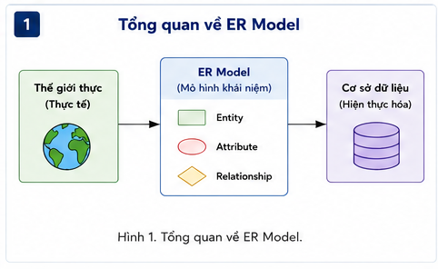
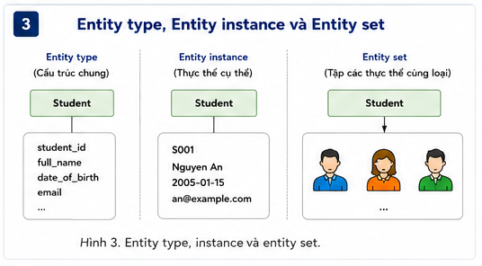
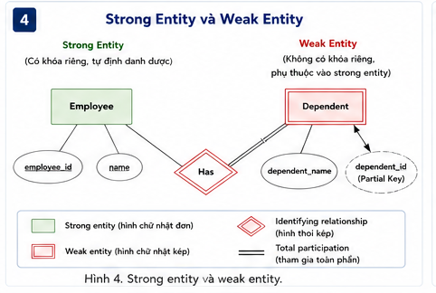
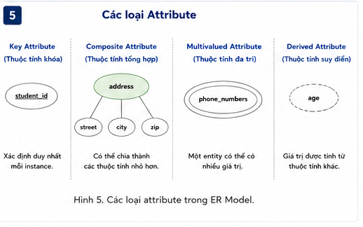
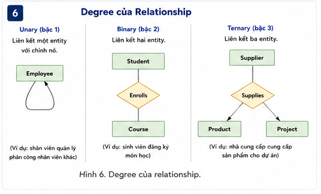
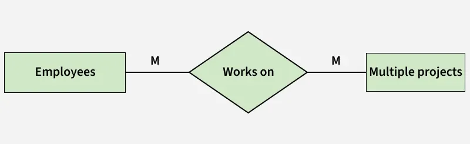
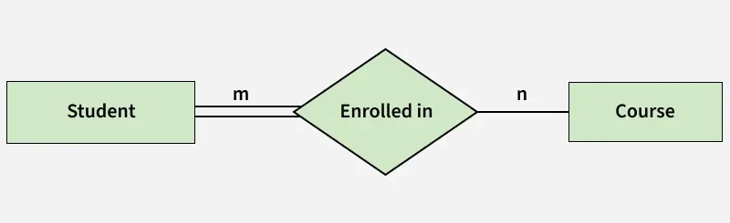
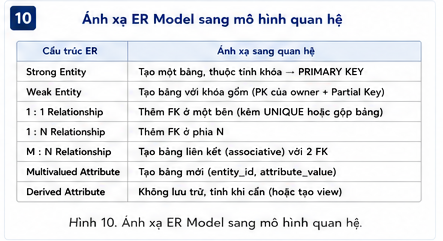
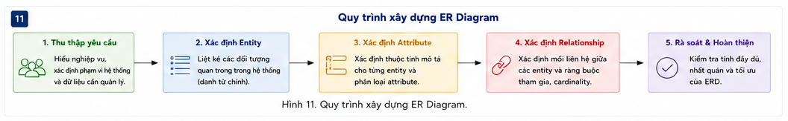

# Giới thiệu ER Model trong DBMS

## Tài liệu tham khảo

- GeeksforGeeks – *Introduction of ER Model*
- Giáo trình thiết kế cơ sở dữ liệu: ER modeling và relational mapping
- Tài liệu về Chen notation và Crow’s Foot notation

> **Trọng tâm:** ER Model là mô hình khái niệm. Nó dùng để mô tả dữ liệu theo ngôn ngữ nghiệp vụ trước khi quyết định tables, foreign keys, indexes hoặc chi tiết triển khai DBMS.

> **Về ký hiệu:** Bài mô tả ERD theo tinh thần **Chen notation**: entity là hình chữ nhật, attribute là oval, relationship là hình thoi. Các công cụ hiện nay có thể dùng Crow’s Foot hoặc UML; ký hiệu khác nhau nhưng business rules phải nhất quán.

---

## 1. Mục tiêu học tập

Sau bài học, người học có thể:

1. Giải thích vai trò của ER Model trong quy trình thiết kế database.
2. Phân biệt conceptual ERD, relational schema và physical design.
3. Xác định entity, entity type, entity instance và entity set.
4. Phân biệt strong entity, weak entity và associative entity.
5. Phân tích simple, composite, multivalued, derived và key attributes.
6. Xác định relationship, relationship attributes và degree.
7. Mô tả cardinality và participation bằng min-max constraints.
8. Chuyển những cấu trúc ERD cơ bản sang relational schema.
9. Kiểm tra ERD bằng business rules và các tình huống phản ví dụ.
10. Tránh những lỗi mô hình hóa phổ biến trước khi viết SQL.

---

## 2. ER Model trong quy trình thiết kế database

ER Model giúp nhóm dự án trả lời các câu hỏi:

```text
Hệ thống quản lý những đối tượng hoặc sự kiện nào?
Mỗi đối tượng có thông tin gì?
Đối tượng được định danh như thế nào?
Các đối tượng liên hệ ra sao?
Liên kết có bắt buộc hay tùy chọn?
Có dữ liệu nào thuộc chính liên kết không?
```

Một luồng thiết kế hợp lý:

```text
Business requirements
→ Conceptual design: ER Model / ERD
→ Logical design: relational schema, keys, constraints
→ Physical design: DDL, index, partition, backup, storage
```

ERD không thay thế SQL schema. ERD là nơi đội ngũ thống nhất **ý nghĩa dữ liệu** trước khi triển khai.



<p align="center"><em>Hình 1. ER Model mô tả dữ liệu ở mức khái niệm trước khi triển khai DBMS cụ thể.</em></p>

---

**Quiz nhanh: ER Model trong quy trình thiết kế**


**Câu 1.** ER Model chủ yếu giúp nhóm dự án làm rõ điều gì trước khi tạo bảng vật lý?

A. Các đối tượng nghiệp vụ, thông tin cần lưu và các quy tắc liên hệ giữa chúng.
B. Dung lượng ổ cứng tối đa của server.
C. Màu giao diện của ứng dụng.
D. Cấu hình network interface.

**Câu 2.** Điều nào phân biệt đúng conceptual ERD với physical database design?

A. ERD chỉ dùng để vẽ giao diện.
B. ERD mô tả ý nghĩa dữ liệu và ràng buộc nghiệp vụ; physical design mô tả cách triển khai như index, partition hoặc storage.
C. Physical design không liên quan hiệu năng.
D. ERD luôn chứa câu lệnh SQL hoàn chỉnh.

**Câu 3.** Một nhóm vẽ bảng `Student`, `Course`, `Enrollment` ngay từ đầu mà chưa hỏi quy tắc nghiệp vụ. Rủi ro lớn nhất là gì?

A. Database chắc chắn nhanh hơn.
B. Không thể có foreign key.
C. Có thể mô hình hóa sai identity, relationship hoặc ràng buộc vì bảng được tạo trước khi hiểu domain.
D. ERD sẽ tự động chuyển thành 4NF.

---

## 3. Entity, entity type, entity instance và entity set

### 3.1. Entity là gì?

**Entity** là đối tượng, khái niệm, sự kiện hoặc đơn vị có ý nghĩa trong nghiệp vụ mà hệ thống cần quản lý.

Ví dụ:

```text
Student, Course, Department, Order, Payment, Shipment, Device, Reservation
```

Không phải mọi danh từ trong yêu cầu đều là entity. Một khái niệm nên được cân nhắc làm entity khi nó có:

- Identity riêng.
- Nhiều thuộc tính riêng.
- Relationship độc lập với đối tượng khác.
- Vòng đời hoặc trạng thái cần quản lý.

### 3.2. Entity type, entity instance và entity set

| Khái niệm | Ví dụ |
|---|---|
| Entity type | `Student(student_id, full_name, email)` |
| Entity instance | `S2026001, Nguyễn An, an@example.com` |
| Entity set | Tập tất cả Students hiện có |

ERD thường mô tả entity types, không vẽ từng record cụ thể.

### 3.3. Entity hay attribute?

`DepartmentName` có thể là attribute trong bài toán rất nhỏ. Nhưng `Department` nên là entity nếu nó có:

```text
department_id, department_name, office_location, budget
```

và có relationships với `Lecturer`, `Course` hoặc `Program`.



---

**Quiz nhanh: Entity, entity type và entity instance**


**Câu 1.** Trong hệ thống học vụ, câu nào là entity type thay vì entity instance?

A. `S2026001`.
B. `Nguyễn An`.
C. `Sinh viên Nguyễn An, mã S2026001`.
D. `Student`.

**Câu 2.** Điều nào là dấu hiệu một khái niệm nên được cân nhắc là entity thay vì chỉ là attribute?

A. Khái niệm có identity riêng, có nhiều thuộc tính riêng hoặc có relationship độc lập với các đối tượng khác.
B. Khái niệm chỉ có một nhãn hiển thị ngắn.
C. Khái niệm không bao giờ thay đổi.
D. Khái niệm chỉ xuất hiện trong giao diện.

**Câu 3.** Trong mô hình bán hàng, `Order` thường nên là entity/event entity thay vì chỉ là relationship giữa Customer và Product vì:

A. Order không thể liên kết với Customer.
B. Order có identity, thời gian, trạng thái, tổng tiền và có thể liên quan đến payment/shipment.
C. Product không có attributes.
D. Relationship không bao giờ có attributes.

---

## 4. Strong entity, weak entity và associative entity

### 4.1. Strong entity

**Strong entity** có thể được định danh bằng key của chính nó.

```text
Student(student_id, ...)
Employee(employee_id, ...)
Product(product_id, ...)
```

Trong Chen notation, strong entity thường là hình chữ nhật đơn.

### 4.2. Weak entity

**Weak entity** không có định danh đầy đủ khi đứng độc lập. Nó cần key của owner entity kết hợp với một **partial key** (discriminator).

Ví dụ:

```text
Employee(employee_id, ...)
Dependent(dependent_name, birth_date, relationship)
```

Nếu `dependent_name` chỉ phân biệt dependents trong phạm vi một employee:

```text
Full identifier = (employee_id, dependent_name)
```

Trong Chen notation:

- Weak entity: hình chữ nhật kép.
- Identifying relationship: hình thoi kép.
- Weak entity thường có total participation trong identifying relationship.

### 4.3. Associative entity

M:N relationship trở thành **associative entity** khi relationship có attributes hoặc identity riêng.

```text
Student — ENROLLS_IN — Course
```

Nếu có:

```text
semester, enrolled_at, status, grade
```

thì dùng:

```text
Enrollment(student_id, course_id, semester, enrolled_at, status, grade)
```

Enrollment không tự động là weak entity; đây là entity/relation liên kết biểu diễn một sự kiện nghiệp vụ.



---

**Quiz nhanh: Strong entity, weak entity và identifying relationship**


**Câu 1.** Một `Dependent` chỉ được phân biệt trong phạm vi một `Employee` bằng `dependent_name`. Cách nhận diện đầy đủ phù hợp là:

A. `dependent_name` duy nhất toàn công ty.
B. `employee_id` duy nhất cho mọi dependent.
C. `(employee_id, dependent_name)`.
D. `birth_date` duy nhất toàn công ty.

**Câu 2.** Điều nào đúng nhất về weak entity trong ER Model?

A. Weak entity không có attributes.
B. Weak entity luôn chuyển thành một cột JSON.
C. Weak entity luôn có primary key độc lập từ đầu.
D. Weak entity phụ thuộc vào owner entity để có định danh đầy đủ và thường có total participation trong identifying relationship.

**Câu 3.** Một bảng `Enrollment(student_id, course_id, semester, grade)` có khóa ghép không tự động là weak entity vì:

A. Khóa ghép chỉ nói cách định danh relation; weak entity đòi hỏi ngữ nghĩa phụ thuộc nhận dạng vào owner entity.
B. Mọi khóa ghép đều là surrogate key.
C. Weak entity không thể có khóa ghép.
D. Enrollment không thể có relationship attributes.

---

## 5. Attributes và cách mô hình hóa đúng mức cần thiết

Attribute mô tả entity, hoặc trong một số trường hợp mô tả relationship.

Ví dụ:

```text
Student: student_id, full_name, date_of_birth, email
Course: course_id, course_name, credits
Enrollment: enrolled_at, status, grade
```

### 5.1. Simple attribute

Simple attribute không có thành phần con cần quản lý riêng.

```text
gender, credit_count, status
```

### 5.2. Key attribute

Key attribute giúp nhận diện entity. Trong Chen notation, nó thường được gạch chân.

```text
Student.student_id
Course.course_id
```

### 5.3. Composite attribute

Composite attribute có các thành phần con có ý nghĩa riêng.

```text
Address = street + ward + city + country
Name    = given_name + family_name
```

Chỉ nên tách khi các phần con cần được validate, query hoặc quản lý riêng.

### 5.4. Multivalued attribute

Một entity có thể có nhiều values cùng loại:

```text
Student → nhiều PhoneNumber
Employee → nhiều Skill
Product → nhiều Color
```

Khi chuyển sang relational schema, thường tách thành relation riêng:

```text
StudentPhone(student_id, phone_number)
```

### 5.5. Derived attribute

Derived attribute có thể suy ra từ dữ liệu khác:

```text
Age từ DateOfBirth
TotalAmount từ OrderLine
YearsOfService từ StartDate
```

Có thể không lưu derived attribute. Khi materialize nó, cần cơ chế giữ consistency.



---

**Quiz nhanh: Attributes và các ràng buộc thuộc tính**


**Câu 1.** Nếu `Age` được tính từ `DateOfBirth` và ngày hiện tại, cách mô hình hóa nào thường phù hợp hơn?

A. Chỉ lưu Age, bỏ DateOfBirth.
B. Mô hình `DateOfBirth` là stored attribute; `Age` là derived attribute và chỉ lưu khi có lý do nghiệp vụ rõ.
C. Lưu Age làm key attribute.
D. Biến Age thành multivalued attribute.

**Câu 2.** Một Student có thể có nhiều số điện thoại. Trong ERD Chen, `PhoneNumber` được biểu diễn phù hợp nhất là:

A. Derived attribute.
B. Composite key bắt buộc.
C. Multivalued attribute; khi chuyển sang relational model thường cần relation riêng.
D. Weak entity trong mọi trường hợp.

**Câu 3.** Khi nào `Address` nên được xem là composite attribute?

A. Khi Address chỉ cần hiển thị như một chuỗi duy nhất.
B. Khi Address là foreign key.
C. Khi không có bất kỳ thành phần nào.
D. Khi các thành phần như street, ward, city hoặc country có ý nghĩa và được truy vấn/quản lý riêng.

---

## 6. Relationship, relationship attributes và degree

Relationship mô tả liên kết có ý nghĩa giữa entities.

```text
Student ENROLLS_IN Course
Lecturer TEACHES Section
Customer PLACES Order
Department OFFERS Course
```

### 6.1. Relationship attributes

Một attribute thuộc relationship khi nó phụ thuộc vào tổ hợp entities chứ không thuộc riêng entity nào.

```text
Student — ENROLLS_IN — Course
relationship attributes: semester, enrolled_at, grade
```

`grade` không thuộc riêng Student hay Course; nó thuộc lần đăng ký cụ thể.

### 6.2. Degree

| Degree | Ví dụ |
|---|---|
| Unary/recursive | Employee manages Employee |
| Binary | Student enrolls in Course |
| Ternary | Supplier supplies Part for Project |
| N-ary | Relationship có hơn ba entity types |

Trong recursive relationship, một entity type tham gia ở nhiều roles, ví dụ `manager` và `subordinate`.



---

**Quiz nhanh: Relationship, degree và relationship attributes**


**Câu 1.** Trong quan hệ `Student ENROLLS_IN Course`, thuộc tính `grade` nên được gắn ở đâu trong ERD?

A. Gắn với relationship/associative entity Enrollment vì grade phụ thuộc vào cặp Student–Course, thường còn theo semester.
B. Chỉ gắn với Student.
C. Chỉ gắn với Course.
D. Gắn với Department bắt buộc.

**Câu 2.** Vì sao ternary relationship `Supplier SUPPLIES Part FOR Project` không nên mặc định thay bằng ba binary relationships?

A. Ternary relationship không có cardinality.
B. Ba binary relationships có thể mất ý nghĩa rằng một supplier cung cấp một part cho một project cụ thể.
C. Binary relationship không thể có attributes.
D. ERD không cho phép quá hai entity.

**Câu 3.** Một employee quản lý employee khác là ví dụ của:

A. Binary relationship giữa Employee và Department.
B. Ternary relationship.
C. Unary/recursive relationship, trong đó cùng một entity type tham gia với hai roles khác nhau.
D. Weak entity relationship.

---

## 7. Cardinality và min-max constraints

Cardinality mô tả **số lượng liên kết tối đa** giữa các entities.

| Dạng | Ví dụ |
|---|---|
| 1:1 | Person — Passport |
| 1:N | Department — Employee |
| N:1 | Employee — Department, nhìn từ phía Employee |
| M:N | Student — Course |

Chỉ ghi 1:N thường chưa đủ. Dùng min-max để mô tả minimum và maximum:

```text
Customer (0, N) — PLACES — Order (1, 1)
```

Diễn giải:

- Customer có thể chưa có order hoặc có nhiều orders.
- Mỗi Order thuộc đúng một Customer.

### 7.1. M:N và associative entity

M:N relationship thường chuyển thành relation trung gian:

```text
Enrollment(student_id, course_id, semester, grade)
```

Relation này có thể chứa:

- Composite key hoặc surrogate key.
- Foreign keys đến hai entities.
- Attributes của relationship.
- Các relationship khác nếu nghiệp vụ cần.

<p align="center">
  
</p>

<p align="center"><em>Hình 6. Many-to-many relationship cần associative entity khi chuyển sang mô hình quan hệ.</em></p>

---

**Quiz nhanh: Cardinality và min-max constraints**


**Câu 1.** Một Customer có thể đặt 0..N Orders, còn mỗi Order thuộc đúng 1 Customer. Ký hiệu min-max hợp lý nhất là:

A. Customer `(1, 1)` — Order `(0, N)`.
B. Customer `(1, N)` — Order `(1, N)`.
C. Customer `(0, 0)` — Order `(1, N)`.
D. Customer `(0, N)` — places — Order `(1, 1)`.

**Câu 2.** Cardinality `M:N` giữa Student và Course khi chuyển sang mô hình quan hệ thường cần:

A. Một associative relation như Enrollment chứa foreign keys và các thuộc tính của relationship.
B. Đặt course_id trực tiếp trong Student duy nhất.
C. Đặt student_id trực tiếp trong Course duy nhất.
D. Bỏ relationship để giảm bảng.

**Câu 3.** One-to-one relationship không có nghĩa hai entities nên luôn gộp vào cùng một table vì:

A. 1:1 không thể triển khai relational.
B. Có thể có lý do về optionality, security, lifecycle hoặc tần suất truy cập khiến tách table vẫn hợp lý.
C. Hai tables không được có foreign key.
D. 1:1 luôn là weak entity.

---

## 8. Participation và optionality

Participation constraint trả lời liệu entity có phải tham gia relationship ít nhất một lần không.

| Kiểu | Ý nghĩa |
|---|---|
| Total participation | Mỗi entity phải tham gia ít nhất một relationship instance |
| Partial participation | Entity có thể chưa tham gia relationship |

Ví dụ:

```text
Employee (1,1) — WORKS_FOR — Department (0,N)
```

Nếu mọi employee bắt buộc thuộc đúng một department:

- Employee có total participation.
- Department có thể chưa có employee, nên partial participation.

### 8.1. Cardinality và participation khác nhau

- Cardinality/max cardinality: `1`, `N`.
- Participation/min cardinality: `0`, `1`.

Min-max notation như `(0,N)` và `(1,1)` mô tả cả hai.

### 8.2. Optionality phải theo business rule

Không có quy tắc mặc định rằng Student luôn phải đăng ký học phần hoặc Course luôn phải có Lecturer. Điều đó phụ thuộc thời điểm và quy định nghiệp vụ.

<p align="center">
  
</p>

<p align="center"><em>Hình 7. Participation constraint mô tả liên kết bắt buộc hoặc tùy chọn.</em></p>

---

**Quiz nhanh: Participation và business constraints**


**Câu 1.** Total participation của Employee trong `WorksFor Department` nghĩa là:

A. Mỗi Department chỉ có một Employee.
B. Mỗi Employee phải có nhiều Departments.
C. Mỗi Employee phải tham gia ít nhất một relationship instance WorksFor.
D. Không Employee nào được tham gia.

**Câu 2.** Nếu một Course có thể được tạo trước khi có Lecturer phụ trách, participation của Course trong `TEACHES` nên là:

A. Total participation bắt buộc.
B. Weak participation.
C. Multivalued participation.
D. Partial participation, trừ khi nghiệp vụ yêu cầu mọi course phải có lecturer ngay khi tồn tại.

**Câu 3.** Khác biệt chính giữa cardinality và participation là:

A. Cardinality mô tả số lượng liên kết tối đa; participation/minimum cardinality mô tả việc tham gia có bắt buộc hay không.
B. Cardinality chỉ dùng cho weak entities.
C. Participation chỉ dùng trong SQL.
D. Hai khái niệm hoàn toàn giống nhau.

---

## 9. Mapping ERD sang relational schema

ERD là conceptual design; mapping tạo relations, primary keys, foreign keys và constraints.

### 9.1. Strong entity

```text
Student(student_id PK, full_name, email, date_of_birth)
```

### 9.2. Weak entity

```text
Dependent(
    employee_id PK/FK,
    dependent_name PK,
    birth_date,
    relationship
)
```

`(employee_id, dependent_name)` là identifier đầy đủ.

### 9.3. 1:N relationship

Đặt foreign key của phía 1 vào relation phía N:

```text
Department(department_id PK, department_name)
Employee(employee_id PK, full_name, department_id FK)
```

`NOT NULL` hay nullable phụ thuộc total/partial participation.

### 9.4. M:N relationship

```text
Enrollment(
    student_id FK,
    course_id FK,
    semester,
    grade,
    PRIMARY KEY(student_id, course_id, semester)
)
```

### 9.5. Multivalued attribute

```text
StudentPhone(
    student_id FK,
    phone_number,
    PRIMARY KEY(student_id, phone_number)
)
```

### 9.6. Derived attribute

```text
Age = current_date - date_of_birth
```

Thường được tính trong query/view. Chỉ materialize khi có lý do rõ và quy tắc đồng bộ.



---

**Quiz nhanh: Từ ERD sang relational schema**


**Câu 1.** Khi chuyển 1:N relationship sang relational model, cách phổ biến nhất là:

A. Tạo một bảng trung gian bắt buộc trong mọi trường hợp.
B. Đặt foreign key của phía 1 vào relation ở phía N, kèm NULL/NOT NULL phù hợp optionality.
C. Đặt foreign key của phía N vào phía 1.
D. Không cần foreign key.

**Câu 2.** Khi một relationship M:N có thuộc tính `enrolled_at` và `grade`, cách mapping phù hợp là:

A. Đưa grade vào Student duy nhất.
B. Đưa enrolled_at vào Course duy nhất.
C. Tạo relation Enrollment với khóa/foreign keys và các thuộc tính relationship.
D. Xóa attributes vì relationship không có dữ liệu.

**Câu 3.** Derived attribute `Age` trong ERD khi mapping sang database thường nên:

A. Luôn làm primary key.
B. Luôn lưu mà không cần nguồn.
C. Thay thế DateOfBirth.
D. Được tính từ DateOfBirth trong query/view, trừ khi có nhu cầu snapshot hoặc performance được phân tích rõ.

---

## 10. Quy trình xây dựng ERD từ business rules

### Bước 1. Thu thập requirement theo câu hỏi nghiệp vụ

```text
Ai làm gì với ai?
Một đối tượng có thể liên kết với bao nhiêu đối tượng?
Liên kết có bắt buộc không?
Thông tin nào thuộc chính liên kết?
Có event/lịch sử nào cần identity riêng không?
```

### Bước 2. Xác định entity candidates

```text
Danh từ có identity/vòng đời → entity candidate.
Động từ/liên kết → relationship candidate.
Thông tin mô tả → attribute candidate.
Sự kiện có dữ liệu riêng → event/associative entity candidate.
```

### Bước 3. Xác định identity

```text
Entity được định danh ra sao?
Có natural identifier không?
Có cần surrogate key ở bước triển khai không?
Có weak entity không?
```

### Bước 4. Gắn attributes đúng chỗ

```text
Grade → Enrollment
Quantity → OrderLine
PaymentStatus → Payment hoặc PaymentAttempt, tùy nghiệp vụ
```

### Bước 5. Xác định min-max constraints

Không chỉ hỏi “1:N hay M:N?”, mà hỏi:

```text
Có được 0 liên kết không?
Tối đa bao nhiêu?
Có giới hạn theo thời gian hoặc trạng thái không?
```

### Bước 6. Rà soát bằng phản ví dụ

```text
Student có thể học lại cùng course không?
Course có thể chưa mở section không?
Order có thể giao nhiều lần không?
Một payment có thể thất bại rồi retry không?
```



---

**Quiz nhanh: Quy trình mô hình hóa ERD thực tế**


**Câu 1.** Khi đọc yêu cầu “khách hàng có thể đặt nhiều đơn, mỗi đơn có nhiều sản phẩm”, bước mô hình hóa đúng nhất trước tiên là:

A. Xác định Candidate entities Customer, Order, Product và làm rõ OrderLine/relationship cùng business rules.
B. Tạo ngay 20 indexes.
C. Chọn tên database cloud.
D. Bỏ quan hệ nhiều-nhiều để đơn giản.

**Câu 2.** Một ERD tốt cần được kiểm tra bằng câu hỏi nào?

A. Có dùng nhiều màu không?
B. Có phản ánh đúng business rules, identity, optionality, cardinality và các dữ liệu của relationship không?
C. Có ít hơn ba entities không?
D. Có một entity tên User không?

**Câu 3.** Khi stakeholder nói “một đơn hàng có thể giao nhiều lần”, mô hình nào nên được xem xét?

A. Đặt nhiều giá trị trong một cột status.
B. Xóa Order entity.
C. Thêm entity/event Shipment hoặc Delivery thay vì chỉ thêm một thuộc tính trạng thái đơn giản vào Order.
D. Dùng derived attribute làm khóa.

---

## 11. Ví dụ tổng hợp: hệ thống đăng ký học phần

### 11.1. Requirement được làm rõ

```text
Student đăng ký Section, không chỉ đăng ký catalog Course.
Course có thể mở nhiều Sections theo học kỳ.
Section có room, capacity, lịch học và lecturer phụ trách.
Một Student có tối đa một Enrollment cho cùng Section.
Grade thuộc Enrollment.
```

### 11.2. Entity candidates

```text
Student, Course, Section, Lecturer, Department, Enrollment
```

### 11.3. Relationships

```text
Department OFFERS Course
Course HAS Section
Lecturer TEACHES Section
Student ENROLLS_IN Section through Enrollment
```

### 11.4. Relational mapping gợi ý

```text
Departments(department_id PK, department_name)
Courses(course_id PK, course_name, credits, department_id FK)
Sections(section_id PK, course_id FK, semester, room, capacity)
Lecturers(lecturer_id PK, full_name, email, department_id FK)
Teaches(section_id FK, lecturer_id FK, PRIMARY KEY(section_id, lecturer_id))
Students(student_id PK, full_name, email, date_of_birth)
Enrollments(student_id FK, section_id FK, enrolled_at, status, grade,
            PRIMARY KEY(student_id, section_id))
```

> Nếu mỗi Section luôn do đúng một Lecturer phụ trách, có thể đặt `lecturer_id FK` trực tiếp vào `Sections`. Nếu co-teaching được phép, `Teaches` relation sẽ linh hoạt hơn.

---

**Quiz nhanh: Ví dụ tổng hợp và kiểm tra mô hình**


**Câu 1.** Trong hệ thống đăng ký học phần, `Enrollment(student_id, section_id, semester, grade)` thường là:

A. Một simple attribute của Student.
B. Một derived attribute của Course.
C. Một weak entity bắt buộc trong mọi thiết kế.
D. Associative entity/relation biểu diễn M:N và chứa dữ liệu của lần đăng ký.

**Câu 2.** Nếu Course được offered bởi Department, còn Lecturer teaches Section, mô hình tốt hơn `Lecturer teaches Course` trực tiếp vì:

A. Section biểu diễn lần mở cụ thể theo học kỳ/lớp, phù hợp với lịch, phòng, sĩ số và giảng viên.
B. Course không thể có tên.
C. Department không được có quan hệ.
D. Lecturer không thể tham gia ERD.

**Câu 3.** Một mô hình ERD đang có `StudentPhone` như entity riêng. Khi nào điều này có thể hợp lý hơn multivalued attribute đơn giản?

A. Khi mỗi Student chỉ có đúng một phone.
B. Khi số điện thoại có attributes/relationships riêng như type, verified_at, preferred_flag hoặc lịch sử.
C. Khi phone không bao giờ được truy vấn.
D. Khi muốn bỏ foreign key.

---

## 12. Các lỗi thường gặp khi vẽ ERD

### 12.1. Biến mọi danh từ thành entity

`status`, `email`, `quantity` thường là attributes; chúng chỉ thành entity khi có metadata, lifecycle hoặc relationships riêng.

### 12.2. Gắn attribute sai nơi

```text
Grade thuộc Enrollment, không thuộc Student hoặc Course.
Quantity thuộc OrderLine, không thuộc Product hay Order duy nhất.
```

### 12.3. Chỉ ghi 1:N mà không làm rõ optionality

`Department 1:N Employee` chưa nói employee có bắt buộc thuộc department không, hoặc department có thể trống không.

### 12.4. Nhầm composite key với weak entity

Composite key chỉ mô tả cách định danh; weak entity là khái niệm phụ thuộc nhận dạng trong ER semantics.

### 12.5. Tách ternary relationship không kiểm tra semantics

Ba binary relationships không luôn thay thế được một ternary relationship.

### 12.6. Vẽ implementation quá sớm

Index, partition, storage engine, generated ID và query plan thuộc logical/physical design, không phải mục tiêu chính của conceptual ERD.

---

## 13. Bài tập vận dụng

### Bài 13.1. Cửa hàng online

Hệ thống cần quản lý:

```text
Customer, Product, Order, Payment, Shipment, Promotion
```

1. Xác định entities và một số attributes.
2. Xác định relationship có thể có attributes riêng.
3. Mô tả min-max cho Customer–Order, Order–Payment và Order–Shipment.
4. Xác định relation trung gian giữa Order và Product.
5. Chỉ ra event entity cần identity riêng.

### Bài 13.2. Bệnh viện

Hệ thống cần quản lý:

```text
Patient, Doctor, Department, Appointment, Prescription, Medicine
```

1. Entity nào là event entity?
2. Prescription nên gắn với Patient, Doctor hay Appointment? Giải thích bằng business rule.
3. Patient–Doctor có thể M:N không?
4. Nêu một multivalued attribute và mapping sang relation.

### Bài 13.3. Logistics

Một công ty có:

```text
Truck, Driver, Route, DeliveryOrder, ShipmentEvent, Warehouse
```

1. Phân biệt entities lâu dài và event entities.
2. ShipmentEvent có nên là entity không? Vì sao?
3. Nêu hai participation constraints.
4. Mô hình sơ bộ một M:N relationship nếu một order có thể được giao qua nhiều chuyến.

### Bài 13.4. Weak entity

Cho:

```text
Employee(employee_id, ...)
Dependent(dependent_name, date_of_birth, relationship)
```

1. Xác định owner entity, weak entity và partial key.
2. Viết full identifier.
3. Đề xuất relational mapping.
4. Nêu một business rule khiến Dependent không còn phù hợp là weak entity.

---

## 14. Đáp án các câu kiểm tra

### Đáp án – ER Model trong quy trình thiết kế

| Câu | Đáp án | Giải thích |
|---:|:---:|---|
| 1 | A | ER Model tập trung vào mô hình hóa dữ liệu ở mức nghiệp vụ, trước khi quyết định DBMS, index hoặc storage. |
| 2 | B | ERD ở mức khái niệm; physical design gắn với DBMS và mục tiêu hiệu năng/vận hành. |
| 3 | C | Thiết kế tốt bắt đầu bằng yêu cầu nghiệp vụ; table structure nên là kết quả của mô hình hóa, không phải điểm xuất phát duy nhất. |
### Đáp án – Entity, entity type và entity instance

| Câu | Đáp án | Giải thích |
|---:|:---:|---|
| 1 | D | Entity type là lớp/loại đối tượng; instance là một đối tượng cụ thể thuộc loại đó. |
| 2 | A | Entity thường có vòng đời, định danh hoặc quan hệ riêng; attribute chỉ mô tả entity. |
| 3 | B | Một sự kiện có dữ liệu/identity riêng thường nên trở thành entity hoặc associative entity. |
### Đáp án – Strong entity, weak entity và identifying relationship

| Câu | Đáp án | Giải thích |
|---:|:---:|---|
| 1 | C | Partial key phân biệt weak entity trong phạm vi owner; cần kết hợp owner key để định danh đầy đủ. |
| 2 | D | Trong Chen notation, weak entity dùng partial key + owner key; total participation biểu thị sự phụ thuộc tồn tại. |
| 3 | A | Không nên đồng nhất composite primary key với weak entity; đây là hai khái niệm khác nhau. |
### Đáp án – Attributes và các ràng buộc thuộc tính

| Câu | Đáp án | Giải thích |
|---:|:---:|---|
| 1 | B | Age thay đổi theo thời gian; lưu DOB thường ổn định hơn, Age có thể suy ra khi cần. |
| 2 | C | Multivalued attribute biểu diễn nhiều values trên một entity; quan hệ triển khai thường tách StudentPhone. |
| 3 | D | Composite attribute hợp lý khi các phần con có ngữ nghĩa độc lập; không phải mọi chuỗi dài đều cần tách. |
### Đáp án – Relationship, degree và relationship attributes

| Câu | Đáp án | Giải thích |
|---:|:---:|---|
| 1 | A | Grade không thuộc riêng Student hay Course; nó thuộc lần đăng ký cụ thể. |
| 2 | B | Quan hệ 3 ngôi có semantics chung của cả ba participant; decomposition chỉ đúng khi business rules chứng minh được. |
| 3 | C | Degree unary vì chỉ có một entity type Employee, dù có hai vai trò manager/subordinate. |
### Đáp án – Cardinality và min-max constraints

| Câu | Đáp án | Giải thích |
|---:|:---:|---|
| 1 | D | Min-max biểu diễn cả minimum và maximum participation; mỗi order có đúng một customer, customer có thể chưa đặt order. |
| 2 | A | M:N không biểu diễn trực tiếp bằng một foreign key đơn; cần relation trung gian. |
| 3 | B | 1:1 là business cardinality; quyết định gộp/tách còn phụ thuộc optionality và thiết kế thực tế. |
### Đáp án – Participation và business constraints

| Câu | Đáp án | Giải thích |
|---:|:---:|---|
| 1 | C | Total participation là ràng buộc minimum = 1, không nói trực tiếp maximum. |
| 2 | D | Optionality phải bám theo quy tắc nghiệp vụ, không theo giả định chung. |
| 3 | A | Nên dùng min-max notation để thể hiện đồng thời minimum và maximum. |
### Đáp án – Từ ERD sang relational schema

| Câu | Đáp án | Giải thích |
|---:|:---:|---|
| 1 | B | 1:N thường triển khai bằng FK ở phía many; bảng trung gian chỉ cần khi relationship có attributes hoặc có lý do thiết kế. |
| 2 | C | Relationship attributes thuộc associative relation khi chuyển sang bảng. |
| 3 | D | Derived data có nguy cơ inconsistency; chỉ materialize khi có lý do và cơ chế đồng bộ. |
### Đáp án – Quy trình mô hình hóa ERD thực tế

| Câu | Đáp án | Giải thích |
|---:|:---:|---|
| 1 | A | Từ requirement cần xác định entities/events/relationships và constraints trước khi vẽ chi tiết. |
| 2 | B | Độ đúng của ERD được đo bằng mức phản ánh nghiệp vụ, không phải hình thức. |
| 3 | C | Nhiều lần giao có identity/time/status riêng; thường cần entity riêng. |
### Đáp án – Ví dụ tổng hợp và kiểm tra mô hình

| Câu | Đáp án | Giải thích |
|---:|:---:|---|
| 1 | D | Enrollment là thực thể liên kết có dữ liệu riêng của relationship. |
| 2 | A | Nên phân biệt catalog Course với lớp mở/section theo kỳ khi nghiệp vụ cần. |
| 3 | B | Khi một value có metadata/lifecycle riêng, nâng nó thành entity là hợp lý. |
## 15. Tóm tắt

- ER Model mô tả dữ liệu theo business rules trước khi triển khai table và SQL.
- Entity cần được nhận diện qua identity, attributes, lifecycle và relationships; không chỉ qua danh từ.
- Weak entity cần owner key kết hợp partial key; không đồng nghĩa mọi relation có composite key là weak entity.
- Attribute có thể thuộc entity hoặc relationship; grade và quantity thường thuộc associative entity.
- Cardinality mô tả maximum participation; participation/optionality mô tả minimum participation.
- M:N relationship thường mapping thành associative relation; relationship attributes nằm trong relation này.
- Multivalued attribute thường mapping thành relation riêng; derived attribute thường nên tính từ source data.
- Một ERD tốt được kiểm tra bằng business rules, phản ví dụ, identity, optionality và data lifecycle.
- Mapping ERD sang relational schema là bước thiết kế có chủ đích, không phải sao chép hình vẽ sang tables.

## 16. Từ khóa chính

- Entity-Relationship Model
- ER Model
- Entity-Relationship Diagram
- ERD
- Chen Notation
- Crow’s Foot
- Entity
- Entity Type
- Entity Instance
- Entity Set
- Strong Entity
- Weak Entity
- Owner Entity
- Partial Key
- Associative Entity
- Relationship
- Relationship Attribute
- Unary Relationship
- Binary Relationship
- Ternary Relationship
- Cardinality
- Min-Max Constraint
- Participation Constraint
- Total Participation
- Partial Participation
- Simple Attribute
- Composite Attribute
- Multivalued Attribute
- Derived Attribute
- Key Attribute
- Relational Mapping
