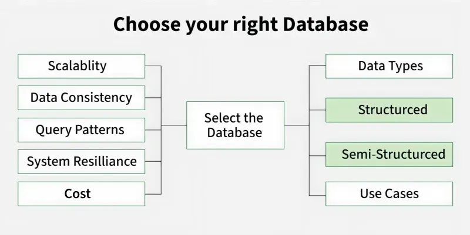
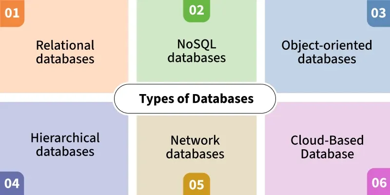

# Cách lựa chọn hệ quản trị cơ sở dữ liệu phù hợp

## Tài liệu tham khảo

- GeeksforGeeks – *How to Choose the Database*
- Tài liệu kiến trúc hệ thống và nguyên tắc thiết kế workload-driven
- Tài liệu chính thức của DBMS/dịch vụ được lựa chọn khi triển khai thực tế

> **Thông điệp chính:** Không tồn tại một DBMS “tốt nhất” cho mọi hệ thống. Một lựa chọn tốt là lựa chọn phù hợp với dữ liệu, truy vấn, quy tắc nhất quán, năng lực vận hành và lộ trình phát triển của hệ thống.

> **Lưu ý về thuật ngữ:**  
> - **Data model**: cách tổ chức dữ liệu, ví dụ relational, document, graph.  
> - **DBMS/database engine**: phần mềm hiện thực một hoặc nhiều data model, ví dụ PostgreSQL, MongoDB, Redis.  
> - **Deployment model**: cách vận hành, ví dụ self-managed hoặc managed service.  
>
> Không nên trộn ba khái niệm này. Ví dụ “managed PostgreSQL” là một relational DBMS được triển khai theo mô hình managed service.

---

## 1. Mục tiêu học tập

Sau bài học, người học có thể:

1. Phân biệt data model, DBMS và deployment model.
2. Phân tích workload trước khi chọn database.
3. Đánh giá trade-off giữa tính nhất quán, độ trễ, khả năng mở rộng và chi phí vận hành.
4. Nhận diện tình huống phù hợp với relational, document, key-value, time-series, columnar và graph database.
5. Phân biệt OLTP, OLAP, cache và search workload.
6. Giải thích khi nào managed database phù hợp hơn self-managed database.
7. Đánh giá đúng vai trò của polyglot persistence, CQRS, event sourcing và microservices.
8. Đề xuất phương án DBMS cho các bài toán thực tế, kèm lý do và rủi ro.
9. Biết cách thiết kế proof of concept trước khi cam kết kiến trúc dài hạn.

---

## 2. Lựa chọn database là một quyết định kiến trúc

Database ảnh hưởng trực tiếp đến:

- Tính đúng đắn của dữ liệu.
- Khả năng đáp ứng truy vấn.
- Chi phí phát triển và vận hành.
- Cách mở rộng hệ thống.
- Khả năng audit, backup và recovery.
- Mức độ phụ thuộc của ứng dụng vào schema hoặc API dữ liệu.

Một lựa chọn thiếu phù hợp có thể dẫn tới:

```text
Query quan trọng chậm hoặc khó tối ưu.
Dữ liệu giao dịch bị sai lệch khi có lỗi đồng thời.
Schema khó tiến hóa.
Chi phí hạ tầng và nhân sự vận hành tăng.
Hệ thống phụ thuộc quá chặt vào công nghệ không phù hợp.
```

Tuy nhiên, “chọn sai database” thường không có nghĩa là một DBMS hoàn toàn không dùng được. Nhiều vấn đề có thể bắt nguồn từ:

```text
Schema chưa tốt.
Index chưa phù hợp.
Query không tối ưu.
Không phân tách OLTP và analytics.
Thiếu cache hoặc queue.
Không đo workload trước khi thiết kế.
```

> Vì vậy, câu hỏi tốt không phải là “DBMS nào mạnh nhất?”, mà là “DBMS nào đáp ứng tốt nhất các yêu cầu quan trọng của hệ thống với chi phí và rủi ro chấp nhận được?”.



*Hình 1. Lựa chọn database cần xuất phát từ yêu cầu hệ thống, không chỉ từ mức độ phổ biến.*

### Quiz – Quyết định kiến trúc

**Câu 2.1.** Lý do phù hợp nhất để không chọn database chỉ vì nó phổ biến là:

A. Mỗi hệ thống có dữ liệu, workload, yêu cầu nhất quán và năng lực vận hành khác nhau.
B. Database phổ biến luôn có ít tính năng hơn.
C. Database phổ biến không thể chạy trên cloud.
D. Một hệ thống không được phép dùng database phổ biến.

**Câu 2.2.** Một dashboard chậm không tự động chứng minh rằng DBMS đang dùng là sai. Điều nào nên được kiểm tra trước?

A. Màu sắc của dashboard.
B. Schema, index, query plan và việc có tách analytics khỏi OLTP hay chưa.
C. Tên của database.
D. Số lượng lập trình viên frontend.

**Câu 2.3.** Câu hỏi nào phản ánh cách tiếp cận đúng khi chọn database?

A. “Công nghệ nào đang thịnh hành nhất?”
B. “Công nghệ nào có logo đẹp nhất?”
C. “Workload quan trọng nhất của hệ thống là gì, và ràng buộc nào không được vi phạm?”
D. “Có thể bỏ backup để giảm chi phí không?”

**Câu 2.4.** Lựa chọn database ảnh hưởng trực tiếp nhất đến điều nào sau đây?

A. Cách viết màu của giao diện người dùng.
B. Kiểu font của báo cáo.
C. Kích thước ảnh trong ứng dụng.
D. Tính đúng đắn, hiệu năng và khả năng vận hành dữ liệu.

---

## 3. Phân biệt data model, DBMS và deployment model

Ba khái niệm sau thường bị nhầm lẫn.

| Khái niệm | Câu hỏi trả lời | Ví dụ |
|---|---|---|
| Data model | Dữ liệu được tổ chức và truy vấn theo cách nào? | Relational, document, graph |
| DBMS / engine | Phần mềm nào lưu trữ, truy vấn, bảo vệ dữ liệu? | MySQL, PostgreSQL, MongoDB, Redis |
| Deployment model | Ai vận hành hạ tầng và các tác vụ quản trị? | Self-managed, managed database |

Ví dụ:

```text
PostgreSQL                 → DBMS
Relational model           → data model chính
Managed PostgreSQL service → deployment model
```

### 3.1. Một DBMS có thể hỗ trợ nhiều kiểu dữ liệu

Trong thực tế, ranh giới không luôn tuyệt đối:

- Relational DBMS có thể hỗ trợ JSON.
- Time-series workload có thể chạy trên relational extension.
- Graph-like query có thể thực hiện bằng SQL trong một số phạm vi.
- Document database có thể hỗ trợ query và index phức tạp hơn key-value store.

Do đó, không nên chọn công nghệ chỉ dựa trên nhãn “SQL” hoặc “NoSQL”. Cần bắt đầu từ query patterns và constraints.

### 3.2. NoSQL không có nghĩa “không có schema”

Nhiều NoSQL systems cho phép schema linh hoạt hơn, nhưng ứng dụng vẫn có schema ở một mức nào đó:

```text
Cấu trúc JSON được code giả định.
Validation rule có thể tồn tại trong database hoặc application.
API contract vẫn quy định fields cần có.
```

Schema-less thường là cách nói đơn giản hóa; chính xác hơn là **schema-on-read** hoặc **schema flexibility** trong một số hệ thống.

### Quiz – Phân biệt khái niệm

**Câu 3.1.** “Managed PostgreSQL” mô tả đúng nhất điều gì?

A. Một DBMS relational được triển khai theo mô hình dịch vụ quản lý.
B. Một graph data model.
C. Một key-value store tự quản lý.
D. Một công cụ frontend.

**Câu 3.2.** Phát biểu nào đúng về NoSQL?

A. NoSQL luôn không có schema ở bất kỳ mức nào.
B. Nhiều NoSQL systems có schema linh hoạt, nhưng ứng dụng và API vẫn cần quy tắc dữ liệu rõ ràng.
C. NoSQL không thể enforce validation.
D. NoSQL chỉ dùng cho cache.

**Câu 3.3.** “Relational” trong cụm “relational DBMS” chủ yếu nói về:

A. Việc database có được quản lý bởi cloud hay không.
B. Cách đặt mật khẩu người dùng.
C. Data model tổ chức dữ liệu và quan hệ giữa các facts.
D. Màu giao diện quản trị.

**Câu 3.4.** Điều nào là deployment model?

A. Document.
B. Graph.
C. Columnar.
D. Self-managed.

---

## 4. Bắt đầu từ workload, không bắt đầu từ sản phẩm

Trước khi chọn DBMS, cần mô tả workload bằng các câu hỏi có thể đo lường.

### 4.1. Các câu hỏi về dữ liệu

```text
Dữ liệu có cấu trúc ổn định hay thay đổi thường xuyên?
Có quan hệ nhiều-nhiều không?
Có cần lưu nested objects không?
Có dữ liệu theo timestamp, event hoặc log không?
Có cần truy vết lịch sử thay đổi không?
```

### 4.2. Các câu hỏi về truy vấn

```text
Các 5–10 truy vấn quan trọng nhất là gì?
Có cần JOIN nhiều bảng không?
Có cần aggregate theo thời gian/khu vực/sản phẩm không?
Có cần traversal nhiều bước qua quan hệ không?
Truy vấn chủ yếu là key lookup, full-text search hay scan analytics?
```

### 4.3. Các câu hỏi về ghi dữ liệu

```text
Tỷ lệ read/write là bao nhiêu?
Có cần transaction nhiều bản ghi không?
Có ghi theo batch hay stream liên tục không?
Có peak traffic theo giờ/sự kiện không?
Có yêu cầu idempotency hoặc ordering không?
```

### 4.4. Các câu hỏi về vận hành

```text
RPO và RTO là bao nhiêu?
Có cần multi-region không?
Dữ liệu có nhạy cảm hoặc chịu ràng buộc compliance không?
Đội ngũ có DBA/SRE chuyên trách không?
Ngân sách hạ tầng và vận hành là bao nhiêu?
```

> **RPO** là mức dữ liệu tối đa có thể mất chấp nhận được. **RTO** là thời gian khôi phục dịch vụ tối đa chấp nhận được.

### Quiz – Phân tích workload

**Câu 4.1.** Một hệ thống cần phân tích “doanh thu theo sản phẩm, khu vực và tháng” trên hàng trăm triệu giao dịch. Dạng truy vấn này gần nhất với:

A. OLAP/aggregate analytics.
B. Key lookup.
C. Graph traversal.
D. Session storage.

**Câu 4.2.** Một hệ thống chuyển tiền cần bảo đảm trừ tiền và cộng tiền được xử lý như một đơn vị nhất quán. Yêu cầu này tập trung nhất vào:

A. Full-text indexing.
B. Transactional consistency.
C. Document flexibility.
D. Image storage.

**Câu 4.3.** RPO giúp trả lời câu hỏi nào?

A. Query nhanh đến mức nào?
B. Bao nhiêu người được đăng nhập?
C. Chấp nhận mất tối đa bao nhiêu dữ liệu khi xảy ra sự cố?
D. Có bao nhiêu bảng trong schema?

**Câu 4.4.** Cách tốt nhất để xác định DBMS có đáp ứng workload hay không là:

A. Chỉ đọc benchmark tổng quát trên internet.
B. Chọn DBMS giống đối thủ cạnh tranh.
C. Dùng một dữ liệu mẫu rất nhỏ.
D. Mô phỏng các truy vấn, dữ liệu và tải quan trọng bằng proof of concept.

---

## 5. Tính nhất quán, độ trễ và khả năng mở rộng

### 5.1. ACID không phải chỉ dành cho “SQL”

ACID thường bao gồm:

| Thuật ngữ | Ý nghĩa ngắn |
|---|---|
| Atomicity | Giao dịch hoặc hoàn thành toàn bộ, hoặc không áp dụng gì |
| Consistency | Giao dịch đưa dữ liệu từ trạng thái hợp lệ sang trạng thái hợp lệ |
| Isolation | Các giao dịch đồng thời không gây hiệu ứng sai ngoài mức isolation đã chọn |
| Durability | Dữ liệu đã commit vẫn tồn tại sau lỗi phù hợp với cam kết hệ thống |

Nhiều relational DBMS nổi tiếng về transaction ACID, nhưng không nên suy ra rằng mọi NoSQL system đều không hỗ trợ transaction hoặc mọi relational deployment đều luôn có consistency tuyệt đối trên nhiều vùng địa lý. Cần xem cơ chế và cấu hình cụ thể.

### 5.2. Strong consistency và eventual consistency

- **Strong consistency**: sau khi ghi thành công, các reads phù hợp với cam kết consistency sẽ nhìn thấy giá trị mới.
- **Eventual consistency**: nếu không có cập nhật mới, replicas có xu hướng hội tụ về cùng trạng thái sau một khoảng thời gian.

Không phải mọi phần của một ứng dụng đều cần cùng một mức consistency.

Ví dụ:

| Dữ liệu | Mức ưu tiên thường gặp |
|---|---|
| Số dư, thanh toán, tồn kho giới hạn | Strong consistency / transaction |
| Bộ đếm lượt xem, feed cache | Có thể chấp nhận eventual consistency |
| Log telemetry | Ưu tiên throughput và durability phù hợp |
| Báo cáo analytics | Có thể cập nhật trễ theo batch hoặc stream |

### 5.3. Vertical và horizontal scaling

- **Vertical scaling**: tăng CPU, RAM, storage hoặc IOPS cho một node.
- **Horizontal scaling**: thêm nodes, replicas hoặc shards để tăng năng lực.

Không nên nói relational database chỉ scale vertically hoặc NoSQL luôn scale horizontally. Cả hai hướng phụ thuộc vào engine, kiến trúc, replication, partitioning và cách ứng dụng dùng dữ liệu.

> Scale-out thường làm tăng độ phức tạp: partitioning, distributed transactions, replica lag, observability và vận hành.

### Quiz – Consistency và scale

**Câu 5.1.** Eventual consistency phù hợp hơn trong trường hợp nào?

A. Feed cache hoặc bộ đếm không gây hậu quả nghiêm trọng nếu cập nhật trễ ngắn.
B. Hệ thống thanh toán cần quyết định số dư ngay lập tức.
C. Kiểm tra trùng mã hóa đơn bắt buộc.
D. Ghi sổ kế toán cuối ngày.

**Câu 5.2.** Vertical scaling là:

A. Thêm nhiều shards vào tất cả database.
B. Tăng tài nguyên cho một node hiện có.
C. Chuyển từ SQL sang NoSQL.
D. Xóa index để giảm tải.

**Câu 5.3.** Phát biểu nào chính xác nhất?

A. Relational DBMS không thể scale horizontally.
B. NoSQL luôn strong consistent.
C. Horizontal scaling thường tăng năng lực nhưng cũng tăng độ phức tạp vận hành.
D. Eventual consistency luôn tốt hơn strong consistency.

**Câu 5.4.** Khi cần quyết định mức consistency, cách phù hợp nhất là:

A. Dùng một mức cho mọi dữ liệu vì dễ nhớ.
B. Chọn eventual consistency cho mọi transaction.
C. Chọn strong consistency cho mọi cache.
D. Phân loại dữ liệu theo hậu quả nghiệp vụ nếu đọc thấy dữ liệu cũ hoặc xung đột.

---

## 6. Bản đồ các data model phổ biến

| Data model | Điểm mạnh chính | Workload tiêu biểu | Rủi ro khi dùng sai |
|---|---|---|---|
| Relational | Transactions, integrity, JOIN, SQL | OLTP, nghiệp vụ, reporting có cấu trúc | Schema/queries/index chưa tốt có thể làm chậm |
| Document | Nested records, schema flexibility | Profile, content, product catalog | Duplication và cross-document consistency |
| Key-value | Lookup độ trễ thấp | Cache, session, counters | Không phù hợp query ad hoc phức tạp |
| Time-series | Timestamp, retention, time-window aggregates | Telemetry, IoT, monitoring | Không thay thế system-of-record cho mọi dữ liệu |
| Columnar | Scan/aggregate lớn | Warehouse, BI, OLAP | Không tối ưu cho OLTP row-by-row |
| Graph | Traversal quan hệ nhiều bước | Fraud, recommendation, knowledge graph | Đưa vào quá sớm khi joins thông thường đã đủ |



*Hình 2. Các data model phổ biến phục vụ các workload khác nhau.*

### 6.1. Không nhất thiết chọn “một loại duy nhất”

Một hệ thống nhỏ thường nên bắt đầu đơn giản, có thể chỉ với một relational DBMS. Khi workload thực sự đòi hỏi, có thể bổ sung cache, search index, warehouse hoặc specialized store.

> **Nguyên tắc:** Bắt đầu với ít thành phần nhất có thể đáp ứng yêu cầu; chỉ tăng tính đa dạng công nghệ khi lợi ích vượt chi phí vận hành.

### Quiz – Bản đồ data model

**Câu 6.1.** Workload nào phù hợp nhất với key-value store?

A. Tìm session theo session token với độ trễ rất thấp.
B. Tính tổng doanh thu theo 5 năm và 20 chiều phân tích.
C. Tìm đường đi giữa hai người trong mạng xã hội.
D. Join nhiều bảng hóa đơn và kế toán.

**Câu 6.2.** Columnar storage thường phù hợp nhất với:

A. Ghi từng giao dịch đơn lẻ với cập nhật liên tục.
B. Scan và aggregate trên tập dữ liệu lớn.
C. Lưu khóa phiên người dùng.
D. Lưu quan hệ cha-con đơn giản.

**Câu 6.3.** Khi nào graph database đáng cân nhắc?

A. Khi chỉ cần lấy một row theo primary key.
B. Khi cần lưu cache TTL ngắn.
C. Khi traversal nhiều bước qua relationships là chức năng cốt lõi.
D. Khi chỉ cần cộng tổng theo tháng.

**Câu 6.4.** Một hệ thống nhỏ có đơn hàng, khách hàng và tồn kho nên bắt đầu hợp lý nhất bằng:

A. Sáu DBMS chuyên biệt ngay từ đầu.
B. Một graph database duy nhất.
C. Chỉ lưu file JSON trên ổ đĩa.
D. Một relational DBMS được thiết kế tốt, rồi đánh giá thêm thành phần khi workload yêu cầu.

---

# Phần A. Relational và Document Database

## 7. Relational Database

### 7.1. Điểm mạnh

Relational DBMS thường phù hợp khi hệ thống cần:

```text
Schema có cấu trúc rõ.
Transactions nhiều rows/tables.
Constraints, foreign keys và audit.
JOIN, reporting nghiệp vụ.
SQL và tooling trưởng thành.
```

Ví dụ:

```text
Order, OrderItem, Payment, Inventory, Customer
Student, Course, Enrollment, Grade
Employee, Department, Payroll
```

### 7.2. Điểm cần thận trọng

Relational database không tự động chậm hoặc khó scale. Các vấn đề thường xuất hiện khi:

- Schema không phản ánh business rules.
- Index không phù hợp query patterns.
- Transaction kéo dài.
- Dùng `SELECT *` hoặc truy vấn không giới hạn.
- Dùng database giao dịch để chạy analytics nặng.
- Scale-out mà không có chiến lược partitioning.

### 7.3. Khi relational là lựa chọn khởi đầu tốt

| Dấu hiệu | Lý do |
|---|---|
| Nhiều quan hệ rõ ràng | Keys và constraints mô tả tốt nghiệp vụ |
| Cần transaction | ACID và isolation hỗ trợ xử lý nhất quán |
| Cần truy vấn linh hoạt | SQL hỗ trợ join, aggregate, reporting |
| Team quen SQL | Giảm thời gian phát triển và vận hành |

### Quiz – Relational database

**Câu 7.1.** Hệ thống nào phù hợp nhất để bắt đầu bằng relational database?

A. Quản lý đơn hàng, thanh toán và tồn kho có nhiều business rules.
B. Cache session với TTL 30 phút.
C. Lưu metric CPU mỗi giây cho hàng nghìn machines.
D. Traversal bạn của bạn ở độ sâu 6.

**Câu 7.2.** Khi một relational database chậm ở dashboard analytics, hành động hợp lý nhất trước tiên là:

A. Xóa mọi foreign keys.
B. Phân tích query plan, index, data volume và khả năng tách OLTP/OLAP.
C. Đổi sang graph database ngay lập tức.
D. Tắt transaction.

**Câu 7.3.** Lợi ích cốt lõi của foreign key trong relational database là:

A. Tăng màu sắc giao diện.
B. Thay thế mọi index.
C. Bảo vệ referential integrity giữa các relations.
D. Luôn tăng tốc mọi query.

**Câu 7.4.** Khi nào relational schema có thể cần denormalization có chủ đích?

A. Ngay khi tạo table đầu tiên.
B. Khi không biết query nào quan trọng.
C. Khi muốn bỏ constraints.
D. Khi có workload đọc rõ ràng cần giảm join hoặc phục vụ reporting, kèm cơ chế giữ consistency.

---

## 8. Document Database

### 8.1. Điểm mạnh

Document database phù hợp khi một aggregate dữ liệu thường được đọc/ghi như một đơn vị:

```json
{
  "product_id": "P101",
  "title": "Running Shoes",
  "variants": [
    {"size": 39, "color": "Black"},
    {"size": 40, "color": "Blue"}
  ],
  "attributes": {
    "material": "mesh",
    "brand": "Example"
  }
}
```

Các use cases thường gặp:

- Product catalog.
- Content management.
- User profile.
- Form submissions đa dạng.
- Dữ liệu có nested objects.

### 8.2. Trade-off quan trọng

Document flexibility không loại bỏ nhu cầu thiết kế.

Cần đánh giá:

```text
Có duplicate dữ liệu giữa documents không?
Có cần transaction xuyên nhiều documents không?
Có query ad hoc hoặc join-like query không?
Một document có thể tăng quá lớn không?
Schema evolution được version như thế nào?
```

### 8.3. Không chọn document chỉ vì “schema thay đổi”

Schema thay đổi có thể được xử lý bằng migration, JSON column hoặc extension trong relational DBMS. Document database đáng cân nhắc khi aggregate boundaries, nested data và access patterns thật sự phù hợp với document model.

### Quiz – Document database

**Câu 8.1.** Product catalog với variants lồng nhau, attributes khác nhau theo loại sản phẩm, và thường đọc cả product trong một request phù hợp nhất với:

A. Document model.
B. Time-series model.
C. Key-value cache duy nhất.
D. Graph model bắt buộc.

**Câu 8.2.** Rủi ro phổ biến khi duplicate thông tin giữa nhiều documents là:

A. Không thể tạo index.
B. Update consistency trở nên khó khi dữ liệu chung thay đổi.
C. Dữ liệu tự động trở thành relational.
D. Không thể lưu JSON.

**Câu 8.3.** Lý do nào chưa đủ để chọn document database?

A. Dữ liệu có nested objects.
B. Aggregate thường đọc/ghi như một document.
C. “Schema có thể thay đổi” nhưng chưa phân tích access patterns và consistency requirements.
D. Một số records có fields tùy chọn.

**Câu 8.4.** Khi cần transaction mạnh xuyên nhiều aggregate và constraints chặt, phương án nào cần được đánh giá nghiêm túc?

A. Chỉ dùng file JSON.
B. Key-value store đơn giản không có transaction.
C. Chỉ dùng cache.
D. Relational database hoặc khả năng transaction cụ thể của DBMS được chọn.

---

# Phần B. Specialized Stores

## 9. Key-Value Store

Key-value store phù hợp khi ứng dụng cần:

```text
Lookup bằng key rõ ràng.
Độ trễ thấp.
TTL hoặc expiration.
Cache, session, rate limit, counters.
```

Ví dụ:

```text
session:8f2a... → session data
cart:customer:1001 → cart snapshot
rate-limit:user:1001 → counter
```

### 9.1. Cache không phải source of truth mặc định

Một cache có thể mất dữ liệu, hết hạn hoặc stale. Nếu dữ liệu quan trọng cần bền vững và nhất quán, system-of-record phải được xác định rõ, thường là transactional database hoặc durable event store.

### 9.2. Các câu hỏi cần trả lời

```text
Cache miss xử lý thế nào?
TTL bao lâu?
Có cache invalidation strategy không?
Có nguy cơ stale read không?
Cache có chịu tải lớn khi bị cold start không?
```

### Quiz – Key-value store

**Câu 9.1.** Use case nào phù hợp nhất với key-value store?

A. Cache session theo token.
B. Báo cáo doanh thu theo 30 dimensions.
C. Query “bạn của bạn của bạn”.
D. Transaction kế toán nhiều bảng.

**Câu 9.2.** Vì sao cache không nên được xem là source of truth mặc định?

A. Cache không có keys.
B. Cache có thể hết hạn, mất dữ liệu hoặc trả stale data.
C. Cache không bao giờ nhanh.
D. Cache không thể lưu string.

**Câu 9.3.** Cache invalidation chủ yếu nhằm xử lý vấn đề nào?

A. Database không còn primary key.
B. Tăng kích thước document.
C. Dữ liệu cache không còn phù hợp với dữ liệu nguồn sau update.
D. Xóa foreign key.

**Câu 9.4.** Nếu cache bị cold start, rủi ro nào cần được tính đến?

A. SQL không còn tồn tại.
B. Tất cả rows bị xóa.
C. Graph traversal trở nên nhanh hơn.
D. Tất cả requests có thể dồn về database nguồn cùng lúc.

---

## 10. Time-Series Database

Time-series database được tối ưu cho dữ liệu có:

```text
Timestamp.
Series identifier hoặc tags.
Ghi liên tục theo thời gian.
Query theo time window.
Retention và downsampling.
```

Ví dụ:

```text
timestamp            device_id   metric       value
2026-06-01 10:00:00  truck_01    temperature  4.2
2026-06-01 10:00:10  truck_01    temperature  4.4
```

### 10.1. Use cases

- IoT telemetry.
- Infrastructure metrics.
- GPS location stream.
- Energy consumption.
- Market price series.
- Application logs/observability metrics.

### 10.2. Lưu ý thiết kế

Time-series system không tự động thay thế relational system-of-record. Ví dụ, metadata về xe, tài xế, hợp đồng hoặc người dùng vẫn có thể cần relation model và transactional integrity.

### Quiz – Time-series database

**Câu 10.1.** Dữ liệu nào phù hợp nhất với time-series database?

A. Nhiệt độ kho lạnh ghi mỗi 10 giây kèm timestamp.
B. Danh sách quyền người dùng.
C. Quan hệ bạn bè.
D. Danh mục sản phẩm lồng nhau.

**Câu 10.2.** Retention policy trong time-series workload thường phục vụ mục tiêu nào?

A. Xác định primary key cho user.
B. Quản lý thời gian lưu dữ liệu chi tiết theo yêu cầu vận hành/chi phí.
C. Tạo foreign key.
D. Mã hóa password.

**Câu 10.3.** Trong hệ thống logistics, dữ liệu nào vẫn thường phù hợp hơn với relational database bên cạnh telemetry?

A. Mỗi GPS point theo giây.
B. Metric CPU của device.
C. Thông tin hợp đồng, xe, tài xế và đơn hàng.
D. Bộ đếm cache.

**Câu 10.4.** Query “nhiệt độ trung bình của mỗi kho trong 24 giờ gần nhất” chủ yếu là:

A. Graph traversal.
B. Key lookup duy nhất.
C. Referential integrity check.
D. Time-window aggregate.

---

## 11. Columnar Database và OLAP

Columnar database hoặc column-oriented warehouse thường phù hợp với:

```text
Scan dữ liệu lớn.
Aggregate theo nhiều dimensions.
BI dashboards.
Historical analytics.
Ad hoc analytical queries.
```

Ví dụ:

```text
SUM(revenue)
GROUP BY month, region, product_category
```

### 11.1. OLTP và OLAP

| Tiêu chí | OLTP | OLAP |
|---|---|---|
| Mục tiêu | Xử lý giao dịch hằng ngày | Phân tích dữ liệu lịch sử |
| Query | Ngắn, có chọn lọc, read/write | Scan/aggregate lớn, thường read-heavy |
| Schema thường gặp | Normalized relational | Star/snowflake/columnar |
| Ví dụ | Order checkout | Revenue dashboard |

### 11.2. Không dùng warehouse như nguồn giao dịch chính

Warehouse thường được tối ưu cho analytics, không phải để xử lý từng transaction có ràng buộc nghiệp vụ chặt trong thời gian thực.

### Quiz – Columnar và OLAP

**Câu 11.1.** Công việc nào phù hợp nhất với columnar warehouse?

A. Phân tích doanh thu 5 năm theo tháng, khu vực và danh mục.
B. Xử lý checkout từng đơn hàng với lock và transaction ngắn.
C. Lưu session 15 phút.
D. Tìm path trong graph.

**Câu 11.2.** Khác biệt chính giữa OLTP và OLAP là:

A. OLTP không có dữ liệu; OLAP không có query.
B. OLTP xử lý giao dịch thường ngày; OLAP phục vụ phân tích dữ liệu lớn/lịch sử.
C. OLTP chỉ dùng NoSQL; OLAP chỉ dùng SQL.
D. OLTP luôn chậm hơn OLAP.

**Câu 11.3.** Vì sao không nên chạy dashboard nặng trực tiếp trên database giao dịch nếu có thể tránh?

A. Vì dashboard không dùng dữ liệu.
B. Vì relational database không có aggregate.
C. Vì analytics scan lớn có thể cạnh tranh tài nguyên với transactions quan trọng.
D. Vì dữ liệu giao dịch không cần backup.

**Câu 11.4.** Star schema thường hỗ trợ tốt cho:

A. Lưu cache theo session token.
B. Traversal quan hệ nhiều bước.
C. Chỉ lưu một document JSON.
D. Slice/dice facts theo dimensions trong BI.

---

## 12. Graph Database

Graph database phù hợp khi các relationships là trung tâm của workload.

Các thành phần cơ bản:

```text
Node: đối tượng
Edge: quan hệ
Property: thuộc tính
```

Ví dụ:

```text
Customer ──BOUGHT──> Product
Customer ──FOLLOWS──> Customer
Account ──TRANSFERRED_TO──> Account
```

### 12.1. Khi graph có lợi thế

- Truy vấn nhiều bước trên quan hệ.
- Tìm đường đi, cộng đồng, vòng lặp.
- Fraud ring detection.
- Recommendation dựa trên mạng liên kết.
- Knowledge graph.

### 12.2. Khi relational database vẫn đủ

Nếu use case chủ yếu là:

```text
CRUD.
Join nông 1–3 cấp.
Reporting chuẩn.
Transactions nghiệp vụ.
```

thì relational database thường đơn giản hơn để bắt đầu.

### Quiz – Graph database

**Câu 12.1.** Use case nào thể hiện graph traversal là yêu cầu cốt lõi?

A. Tìm các tài khoản có chuỗi chuyển tiền nhiều bước dẫn về cùng một cụm nghi ngờ.
B. Tìm sản phẩm theo SKU.
C. Tính tổng doanh thu theo tháng.
D. Lưu session người dùng.

**Câu 12.2.** Khi nào relational database có thể là lựa chọn đơn giản hơn graph database?

A. Khi cần traversal 10 bước là use case chính.
B. Khi CRUD và join nông đáp ứng đầy đủ yêu cầu.
C. Khi relationships phức tạp là trọng tâm duy nhất.
D. Khi cần community detection thời gian thực.

**Câu 12.3.** Trong graph model, edge mô tả:

A. Một query plan.
B. Một index bắt buộc.
C. Một quan hệ giữa các nodes.
D. Một backup file.

**Câu 12.4.** Rủi ro khi đưa graph database vào quá sớm là:

A. Mất khả năng lưu data.
B. Không thể có nodes.
C. Không thể kiểm soát access.
D. Có thể tăng độ phức tạp vận hành khi relational queries thông thường đã đủ.

---

# Phần C. Managed, Self-managed và các mẫu kiến trúc

## 13. Managed Database và Self-managed Database

### 13.1. Managed database

Managed service thường hỗ trợ một phần hoặc nhiều phần sau:

```text
Provisioning.
Patching.
Backup và point-in-time recovery.
Monitoring cơ bản.
Replication/failover theo gói dịch vụ.
Scaling options.
Encryption integration.
```

Tuy nhiên, managed không có nghĩa nhà cung cấp chịu toàn bộ trách nhiệm.

Đội ngũ ứng dụng vẫn thường chịu trách nhiệm về:

```text
Schema và query design.
Access policy.
Data classification.
Application-level security.
Cost control.
Backup/restore validation.
Incident response process.
```

### 13.2. Self-managed database

Self-managed phù hợp hơn khi cần:

- Kiểm soát sâu OS, storage, extensions hoặc version.
- Môi trường on-premises/air-gapped.
- Tích hợp hạ tầng đặc thù.
- Đội ngũ có năng lực DBA/SRE rõ ràng.
- Tối ưu chi phí theo workload ổn định và có quy mô phù hợp.

### 13.3. Không có lựa chọn mặc định cho mọi tổ chức

| Yếu tố | Managed thường thuận lợi | Self-managed thường thuận lợi |
|---|---|---|
| Đội ngũ nhỏ | Giảm tác vụ vận hành lặp lại | Có thể quá tải |
| Custom engine/config | Có giới hạn | Kiểm soát sâu |
| On-premises bắt buộc | Không phải lựa chọn mặc định | Phù hợp hơn |
| Backup/patch/failover | Thường có công cụ tích hợp | Cần tự xây dựng/vận hành |
| Chi phí dài hạn | Thuận tiện nhưng cần theo dõi | Có thể tối ưu nếu vận hành tốt |

### Quiz – Managed và self-managed

**Câu 13.1.** Managed database thường giúp giảm nhiều nhất loại công việc nào?

A. Backup, patching, monitoring cơ bản và một phần failover.
B. Thiết kế nghiệp vụ ứng dụng.
C. Viết mọi query SQL.
D. Xác định business rules.

**Câu 13.2.** Phát biểu nào đúng nhất về shared responsibility?

A. Managed service khiến application không cần bảo mật.
B. Đội ngũ vẫn cần quản lý access, schema, query, chi phí và kiểm thử recovery.
C. Nhà cung cấp chịu trách nhiệm về schema và query.
D. Managed database không cần backup policy.

**Câu 13.3.** Tình huống nào nghiêng về self-managed database hơn?

A. Team nhỏ muốn giảm vận hành tiêu chuẩn.
B. Cần backup tự động.
C. Cần custom extensions/hạ tầng on-premises bắt buộc và có DBA mạnh.
D. Muốn triển khai nhanh proof of concept.

**Câu 13.4.** Một rủi ro của managed database là:

A. Không thể có data.
B. Không thể dùng encryption.
C. Không cần theo dõi chi phí.
D. Chi phí và giới hạn dịch vụ có thể không phù hợp nếu không đánh giá workload/cấu hình.

---

## 14. Polyglot Persistence, CQRS, Event Sourcing và Microservices

### 14.1. Polyglot persistence

Một hệ thống dùng nhiều data stores cho các nhu cầu khác nhau.

Ví dụ:

```text
Relational DB   → orders, payments, inventory
Key-value store → cache, sessions, rate limiting
Search index    → full-text product search
Warehouse       → analytics
```

Điều này có thể hợp lý, nhưng đi kèm chi phí:

```text
Nhiều pipelines dữ liệu.
Nhiều cơ chế backup/monitoring.
Nhiều quyền truy cập và rủi ro consistency.
Nhiều kỹ năng vận hành.
```

### 14.2. CQRS

CQRS tách mô hình ghi và mô hình đọc khi nhu cầu đọc/ghi rất khác nhau.

Ví dụ:

```text
Write model: transactional relational database
Read model: denormalized view hoặc analytical store
```

CQRS không bắt buộc phải dùng hai DBMS khác nhau. Có thể bắt đầu bằng một DBMS với read model riêng.

### 14.3. Event sourcing

Event sourcing lưu các events thay vì chỉ trạng thái cuối:

```text
OrderCreated
PaymentAuthorized
OrderShipped
OrderDelivered
```

Nó hỗ trợ audit và tái dựng trạng thái, nhưng làm tăng độ phức tạp về event versioning, replay, projections và idempotency.

### 14.4. Microservices

“Database per service” là nguyên tắc tránh shared database coupling giữa services, không có nghĩa mỗi service phải dùng một DBMS khác nhau.

> Đừng dùng polyglot persistence như một mục tiêu. Chỉ dùng khi từng data store giải quyết một yêu cầu cụ thể mà một lựa chọn đơn giản hơn không đáp ứng tốt.

### Quiz – Mẫu kiến trúc

**Câu 14.1.** Polyglot persistence là:

A. Dùng nhiều database/data stores cho các mục đích khác nhau trong cùng hệ thống.
B. Dùng nhiều primary keys trong một table.
C. Tự động sao lưu database sang mọi cloud.
D. Chỉ dùng NoSQL.

**Câu 14.2.** CQRS có ý tưởng chính là:

A. Xóa mọi read queries.
B. Tách responsibility của command/write và query/read khi nhu cầu khác biệt.
C. Bắt buộc dùng graph database.
D. Không cho phép transactions.

**Câu 14.3.** Một chi phí của event sourcing là:

A. Không thể audit.
B. Không có events.
C. Quản lý event versioning, projection và replay phức tạp hơn.
D. Không cần idempotency.

**Câu 14.4.** “Database per service” đúng nhất được hiểu là:

A. Mỗi service bắt buộc chọn một DBMS khác nhau.
B. Mỗi service không được lưu dữ liệu.
C. Không cần integration giữa services.
D. Services tránh chia sẻ database schema trực tiếp để giảm coupling; công nghệ có thể vẫn giống nhau.

---

## 15. Quy trình lựa chọn DBMS

### Bước 1. Liệt kê non-negotiable requirements

Ví dụ:

```text
Không được mất committed payment.
Phải khôi phục trong tối đa 30 phút.
P95 API read dưới 100 ms.
Dữ liệu cần lưu trong 5 năm.
Không được lưu dữ liệu nhạy cảm ngoài khu vực được phép.
```

### Bước 2. Lập workload matrix

| Workload | Tần suất | Độ trễ mục tiêu | Consistency | Dữ liệu |
|---|---:|---:|---|---|
| Create order | cao | thấp | strong | transactional |
| Product search | cao | thấp | có thể stale ngắn | text/document |
| Revenue dashboard | trung bình | giây/phút | batch acceptable | analytical |
| Session lookup | rất cao | rất thấp | TTL acceptable | key-value |

### Bước 3. Chọn phương án tối giản có thể đáp ứng

Ban đầu có thể là:

```text
Relational DBMS + object storage backup
```

Chỉ bổ sung:

```text
Cache / search / warehouse / specialized DB
```

khi workload cụ thể chứng minh cần thiết.

### Bước 4. Đánh giá failure modes

```text
Node lỗi thì sao?
Region lỗi thì sao?
Cache miss hàng loạt thì sao?
Backup restore có thật sự hoạt động không?
Replica lag ảnh hưởng business rule nào?
```

### Bước 5. Làm proof of concept

POC nên dùng:

- Dữ liệu gần thực tế.
- Query quan trọng.
- Concurrency gần thực tế.
- Failure/recovery test cơ bản.
- Ước lượng cost và operational effort.

### Bước 6. Ghi quyết định kiến trúc

Nên lưu lại:

```text
Requirements.
Alternatives đã xem xét.
Trade-offs chấp nhận.
Assumptions.
Kế hoạch review lại khi workload thay đổi.
```

### Quiz – Quy trình lựa chọn

**Câu 15.1.** “Non-negotiable requirement” là:

A. Một ràng buộc quan trọng không được vi phạm, như không mất committed payment.
B. Một yêu cầu có thể bỏ qua khi deadline gấp.
C. Tên của DBMS.
D. Một query không bao giờ chạy.

**Câu 15.2.** Lý do tốt nhất để làm POC là:

A. Để thay thế hoàn toàn production.
B. Để kiểm chứng giả định bằng dữ liệu, query, tải và failure modes gần thực tế.
C. Để tránh phải viết tài liệu.
D. Để chọn công nghệ có benchmark cao nhất.

**Câu 15.3.** Trong quá trình lựa chọn, nên bổ sung specialized database khi:

A. Có một bài blog nhắc đến công nghệ đó.
B. Team muốn thử càng nhiều công nghệ càng tốt.
C. Có một workload cụ thể mà kiến trúc đơn giản hiện tại không đáp ứng tốt và lợi ích vượt chi phí vận hành.
D. Chưa có query nào cần tối ưu.

**Câu 15.4.** Architectural decision record hữu ích vì:

A. Thay thế monitoring.
B. Bỏ qua backup.
C. Loại bỏ nhu cầu review kiến trúc.
D. Giúp ghi rõ requirements, alternatives và trade-offs đã chấp nhận.

---

## 16. Các tình huống lựa chọn điển hình

### 16.1. Hệ thống quản lý học vụ

**Yêu cầu:**

```text
Sinh viên, học phần, lớp học phần, điểm, học phí.
Nhiều business rules.
Transaction và referential integrity quan trọng.
Reporting nghiệp vụ thường xuyên.
```

**Lựa chọn khởi đầu hợp lý:**

```text
Relational DBMS.
```

**Lý do:**

```text
Quan hệ rõ ràng.
Keys, constraints và transactions quan trọng.
SQL phù hợp với truy vấn nghiệp vụ.
```

**Bổ sung có thể cần về sau:**

```text
Warehouse/columnar store cho analytics lớn.
Cache cho đọc dữ liệu phổ biến.
Search service nếu cần tìm kiếm văn bản phong phú.
```

### 16.2. Theo dõi nhiệt độ kho lạnh

**Yêu cầu:**

```text
Thiết bị gửi dữ liệu mỗi vài giây.
Query theo cửa sổ thời gian.
Dashboard và alert gần thời gian thực.
Lưu metadata thiết bị, kho, hợp đồng.
```

**Lựa chọn thường hợp lý:**

```text
Time-series store cho telemetry
+
Relational DBMS cho metadata và nghiệp vụ.
```

### 16.3. Thương mại điện tử

**Yêu cầu:**

```text
Checkout cần transaction.
Catalog có attributes linh hoạt.
Search sản phẩm quan trọng.
Cache cần độ trễ thấp.
Analytics doanh thu lớn.
```

**Kiến trúc có thể phát triển theo từng bước:**

```text
Bước đầu: relational DBMS cho orders, payment, inventory.
Khi cần: document model hoặc JSON cho catalog phức tạp.
Khi cần: cache cho session/reads.
Khi cần: search index cho full-text search.
Khi cần: warehouse cho BI.
```

### 16.4. Fraud detection theo mạng giao dịch

**Yêu cầu:**

```text
Tìm vòng chuyển tiền.
Phân tích các paths nhiều bước.
Tìm clusters bất thường.
```

**Lựa chọn cần đánh giá:**

```text
Relational system-of-record cho giao dịch
+
Graph database hoặc graph processing cho traversal/fraud analytics nếu workload chứng minh cần thiết.
```

### Quiz – Tình huống

**Câu 16.1.** Một hệ thống học vụ có điểm, học phí, đăng ký và nhiều ràng buộc nghiệp vụ nên bắt đầu phù hợp nhất với:

A. Relational DBMS.
B. Key-value store duy nhất.
C. Graph database duy nhất.
D. File CSV.

**Câu 16.2.** Hệ thống kho lạnh nên tách telemetry và metadata chủ yếu vì:

A. Relational DBMS không lưu được text.
B. Time-series data và dữ liệu nghiệp vụ có query patterns/retention khác nhau.
C. Telemetry không có timestamp.
D. Metadata không cần backup.

**Câu 16.3.** Trong thương mại điện tử, thành phần nào thường cần strong transaction nhất?

A. Product image cache.
B. Search autocomplete cache.
C. Checkout, payment và inventory reservation.
D. Page view counter.

**Câu 16.4.** Với fraud detection, graph database được bổ sung khi:

A. Muốn thay mọi transaction bằng graph.
B. Không có quan hệ giữa các entities.
C. Chỉ cần cache session.
D. Cần traversal nhiều bước là workload quan trọng và relational queries không còn đáp ứng hợp lý.

---

## 17. Các lỗi lựa chọn DBMS thường gặp

### 17.1. Chọn theo xu hướng

Một công nghệ đang phổ biến không chứng minh nó phù hợp với workload của hệ thống.

### 17.2. Tối ưu trước khi có số đo

Đừng thêm sharding, nhiều replicas, nhiều database hoặc CQRS khi chưa có query/load/failure evidence.

### 17.3. Dùng cache để che lỗi dữ liệu

Cache giải quyết độ trễ trong một số trường hợp; nó không thay thế constraints, transaction design, schema tốt hoặc source-of-truth rõ ràng.

### 17.4. Đưa analytics nặng vào OLTP

Nếu dashboard chạy scan lớn trên cùng database giao dịch, nó có thể gây ảnh hưởng checkout, order processing hoặc các tác vụ quan trọng.

### 17.5. Quên chi phí vận hành

Mỗi data store mới cần:

```text
Backup.
Monitoring.
Patch.
Access control.
Incident runbook.
Cost tracking.
Data lifecycle management.
```

### 17.6. Không kiểm tra restore

Backup chưa được restore thử không phải là bằng chứng recovery thực sự hoạt động.

### Quiz – Lỗi thường gặp

**Câu 17.1.** Dấu hiệu của over-engineering trong lựa chọn database là:

A. Thêm nhiều specialized stores dù chưa có query hoặc tải chứng minh cần thiết.
B. Bắt đầu đơn giản và đo workload.
C. Kiểm tra backup restore.
D. Ghi architectural decision record.

**Câu 17.2.** Tại sao cache không thể thay thế thiết kế transaction đúng?

A. Cache không có read operations.
B. Cache không đảm bảo source-of-truth và consistency cho các business invariants quan trọng.
C. Cache không thể có TTL.
D. Cache luôn chậm hơn database.

**Câu 17.3.** Tại sao cần kiểm thử restore thay vì chỉ kiểm tra backup job “successful”?

A. Restore luôn tự động không cần test.
B. Backup không liên quan database.
C. Backup job có thể thành công nhưng dữ liệu/khóa/quy trình restore vẫn có thể không hoạt động như kỳ vọng.
D. Restore chỉ dành cho frontend.

**Câu 17.4.** Khi analytics làm ảnh hưởng transactions, hướng xử lý phù hợp là:

A. Tắt tất cả dashboards.
B. Xóa mọi indexes.
C. Không lưu dữ liệu lịch sử.
D. Đánh giá tách workload analytics sang read replica, warehouse hoặc analytical store phù hợp.

---

## 18. Bài tập vận dụng

### Bài 18.1. Nền tảng đặt vé

Một hệ thống đặt vé có:

```text
Tìm kiếm chuyến bay.
Giữ chỗ tạm thời trong 10 phút.
Thanh toán.
Xuất vé.
Dashboard doanh thu.
```

Hãy đề xuất:

1. System-of-record cho booking/payment.
2. Cách xử lý giữ chỗ tạm thời.
3. Nơi phù hợp cho dashboard doanh thu.
4. Các rủi ro consistency cần đặc biệt lưu ý.

### Bài 18.2. Hệ thống logistics

Mỗi xe gửi GPS và nhiệt độ khoang hàng mỗi 10 giây. Hệ thống cần:

```text
Theo dõi vị trí gần thời gian thực.
Cảnh báo khi nhiệt độ vượt ngưỡng.
Báo cáo hiệu suất giao hàng theo tháng.
Quản lý hợp đồng và đơn hàng.
```

Hãy đề xuất data stores theo từng workload, giải thích luồng dữ liệu và retention policy sơ bộ.

### Bài 18.3. Mạng xã hội học thuật

Hệ thống có:

```text
Hồ sơ người dùng.
Bài viết và bình luận.
Theo dõi, cộng tác, trích dẫn.
Gợi ý cộng tác viên.
Tìm kiếm bài viết.
Phân tích xu hướng.
```

Hãy xây dựng phương án bắt đầu tối giản, sau đó nêu điều kiện nào khiến cần bổ sung search index, graph store hoặc warehouse.

### Bài 18.4. Đánh giá managed service

Một công ty nhỏ có hai developers, không có DBA, cần triển khai hệ thống quản lý đơn hàng cho thị trường khu vực.

1. Liệt kê lợi ích của managed relational DBMS.
2. Liệt kê các trách nhiệm vẫn thuộc về team.
3. Nêu ba tiêu chí chi phí cần theo dõi.
4. Đề xuất hai bài kiểm tra recovery/incident tối thiểu trước khi go-live.

---

## 19. Đáp án quiz

### Đáp án – Quyết định kiến trúc

| Câu | Đáp án | Giải thích |
|---:|:---:|---|
| 2.1 | A | Lựa chọn phải phù hợp workload, constraints và khả năng vận hành. |
| 2.2 | B | Cần loại trừ schema/query/index/workload mismatch trước khi đổi DBMS. |
| 2.3 | C | Cần xuất phát từ workload và ràng buộc không được vi phạm. |
| 2.4 | D | Database ảnh hưởng trực tiếp đến correctness, performance và operations. |

### Đáp án – Phân biệt khái niệm

| Câu | Đáp án | Giải thích |
|---:|:---:|---|
| 3.1 | A | PostgreSQL là DBMS; managed là deployment model; relational là data model. |
| 3.2 | B | Schema flexibility không đồng nghĩa không cần data rules. |
| 3.3 | C | Relational mô tả cách mô hình hóa dữ liệu và quan hệ. |
| 3.4 | D | Self-managed là cách triển khai/vận hành. |

### Đáp án – Phân tích workload

| Câu | Đáp án | Giải thích |
|---:|:---:|---|
| 4.1 | A | Đây là aggregate analytics trên tập dữ liệu lớn. |
| 4.2 | B | Chuyển tiền cần transaction consistency. |
| 4.3 | C | RPO là lượng dữ liệu có thể mất tối đa. |
| 4.4 | D | POC kiểm chứng các giả định với workload gần thực tế. |

### Đáp án – Consistency và scale

| Câu | Đáp án | Giải thích |
|---:|:---:|---|
| 5.1 | A | Feed/cache/counter có thể chấp nhận stale ngắn tùy nghiệp vụ. |
| 5.2 | B | Vertical scaling tăng năng lực của node hiện có. |
| 5.3 | C | Scale-out tăng năng lực nhưng thêm distributed-systems complexity. |
| 5.4 | D | Cần dựa trên hậu quả nghiệp vụ của stale/conflicting data. |

### Đáp án – Bản đồ data model

| Câu | Đáp án | Giải thích |
|---:|:---:|---|
| 6.1 | A | Session token lookup là key-value workload điển hình. |
| 6.2 | B | Columnar phù hợp scan và aggregate lớn. |
| 6.3 | C | Traversal nhiều bước là lý do chính để cân nhắc graph. |
| 6.4 | D | Bắt đầu đơn giản giảm chi phí vận hành và complexity. |

### Đáp án – Relational database

| Câu | Đáp án | Giải thích |
|---:|:---:|---|
| 7.1 | A | Orders/payments/inventory cần transactions và business rules rõ. |
| 7.2 | B | Phải đo query/index/data-volume và tách workload trước khi đổi hệ. |
| 7.3 | C | Foreign key bảo vệ referential integrity. |
| 7.4 | D | Denormalization cần workload rõ và cơ chế consistency. |

### Đáp án – Document database

| Câu | Đáp án | Giải thích |
|---:|:---:|---|
| 8.1 | A | Nested product aggregate và flexible attributes phù hợp document model. |
| 8.2 | B | Duplicate dữ liệu chung làm update consistency khó hơn. |
| 8.3 | C | Schema change một mình không đủ để quyết định data model. |
| 8.4 | D | Cần đánh giá transactions/constraints phù hợp cho nhiều aggregates. |

### Đáp án – Key-value store

| Câu | Đáp án | Giải thích |
|---:|:---:|---|
| 9.1 | A | Session lookup theo token là workload key-value điển hình. |
| 9.2 | B | Cache có thể mất/hết hạn/stale và không mặc định là durable truth. |
| 9.3 | C | Invalidation xử lý sự lệch giữa cache và dữ liệu nguồn. |
| 9.4 | D | Cold cache có thể gây thundering herd vào source database. |

### Đáp án – Time-series database

| Câu | Đáp án | Giải thích |
|---:|:---:|---|
| 10.1 | A | Đây là dữ liệu đo theo thời điểm liên tục. |
| 10.2 | B | Retention quản lý thời hạn giữ dữ liệu chi tiết. |
| 10.3 | C | Metadata/nghiệp vụ vẫn thường cần relational transactions. |
| 10.4 | D | Đây là aggregate trên cửa sổ thời gian. |

### Đáp án – Columnar và OLAP

| Câu | Đáp án | Giải thích |
|---:|:---:|---|
| 11.1 | A | Warehouse phù hợp scan/aggregate lịch sử lớn. |
| 11.2 | B | OLTP là giao dịch; OLAP là phân tích. |
| 11.3 | C | Analytics nặng cạnh tranh tài nguyên với OLTP. |
| 11.4 | D | Star schema hỗ trợ phân tích facts theo dimensions. |

### Đáp án – Graph database

| Câu | Đáp án | Giải thích |
|---:|:---:|---|
| 12.1 | A | Phân tích paths và cụm liên kết là graph workload. |
| 12.2 | B | CRUD/join nông thường có thể bắt đầu đơn giản với relational. |
| 12.3 | C | Edge mô tả relationship giữa nodes. |
| 12.4 | D | Graph adds operational complexity nếu workload chưa cần traversal sâu. |

### Đáp án – Managed và self-managed

| Câu | Đáp án | Giải thích |
|---:|:---:|---|
| 13.1 | A | Managed services thường giảm tác vụ hạ tầng lặp lại. |
| 13.2 | B | Team vẫn chịu trách nhiệm nhiều phần ở application/data layer. |
| 13.3 | C | Custom/on-premises/DBA mạnh nghiêng về self-managed. |
| 13.4 | D | Cần đánh giá cost và service constraints theo workload. |

### Đáp án – Mẫu kiến trúc

| Câu | Đáp án | Giải thích |
|---:|:---:|---|
| 14.1 | A | Polyglot persistence dùng nhiều data stores theo nhu cầu. |
| 14.2 | B | CQRS tách read/write responsibility khi workload khác biệt. |
| 14.3 | C | Versioning/projection/replay là chi phí đáng kể của event sourcing. |
| 14.4 | D | Database per service giảm coupling, không bắt buộc DBMS khác nhau. |

### Đáp án – Quy trình lựa chọn

| Câu | Đáp án | Giải thích |
|---:|:---:|---|
| 15.1 | A | Đây là ràng buộc không thể vi phạm. |
| 15.2 | B | POC kiểm chứng assumptions bằng thực nghiệm gần thực tế. |
| 15.3 | C | Chỉ thêm specialized store khi có lợi ích chứng minh được. |
| 15.4 | D | ADR ghi requirements, options và trade-offs. |

### Đáp án – Tình huống

| Câu | Đáp án | Giải thích |
|---:|:---:|---|
| 16.1 | A | Học vụ phù hợp relational integrity/transaction. |
| 16.2 | B | Telemetry và metadata có vòng đời/query pattern khác nhau. |
| 16.3 | C | Payment/inventory reservation cần correctness mạnh. |
| 16.4 | D | Graph phù hợp khi traversal cần thiết được chứng minh. |

### Đáp án – Lỗi thường gặp

| Câu | Đáp án | Giải thích |
|---:|:---:|---|
| 17.1 | A | Nhiều components không có workload justification là over-engineering. |
| 17.2 | B | Cache không thay thế source-of-truth cho invariants quan trọng. |
| 17.3 | C | Cần xác minh khả năng restore thực tế, không chỉ backup job. |
| 17.4 | D | Tách hoặc chuyển analytics giúp bảo vệ transaction workload. |

---

## 20. Tóm tắt

- Chọn database là quyết định kiến trúc dựa trên workload và trade-offs.
- Cần phân biệt data model, DBMS và deployment model.
- Không có phân chia tuyệt đối giữa SQL/NoSQL, vertical/horizontal scaling hoặc consistency model; phải xem engine và cấu hình cụ thể.
- Relational database thường phù hợp với transactions, constraints và quan hệ nghiệp vụ rõ.
- Document model hợp với nested aggregates và schema flexibility có kiểm soát.
- Key-value store phù hợp cache/session/lookup độ trễ thấp, nhưng không mặc định là source of truth.
- Time-series, columnar và graph database giải quyết những workload chuyên biệt.
- Managed database giảm gánh nặng vận hành nhưng không loại bỏ trách nhiệm về schema, access, cost và recovery test.
- Polyglot persistence, CQRS và event sourcing là công cụ kiến trúc có chi phí; không nên dùng chỉ vì xu hướng.
- Bắt đầu đơn giản, đo workload, làm POC và review quyết định khi hệ thống thay đổi.

## 21. Từ khóa chính

- DBMS
- Data Model
- Deployment Model
- Workload
- OLTP
- OLAP
- ACID
- Strong Consistency
- Eventual Consistency
- RPO
- RTO
- Vertical Scaling
- Horizontal Scaling
- Relational Database
- Document Database
- Key-Value Store
- Time-Series Database
- Columnar Database
- Graph Database
- Managed Database
- Self-managed Database
- Polyglot Persistence
- CQRS
- Event Sourcing
- Proof of Concept
- Architectural Decision Record
