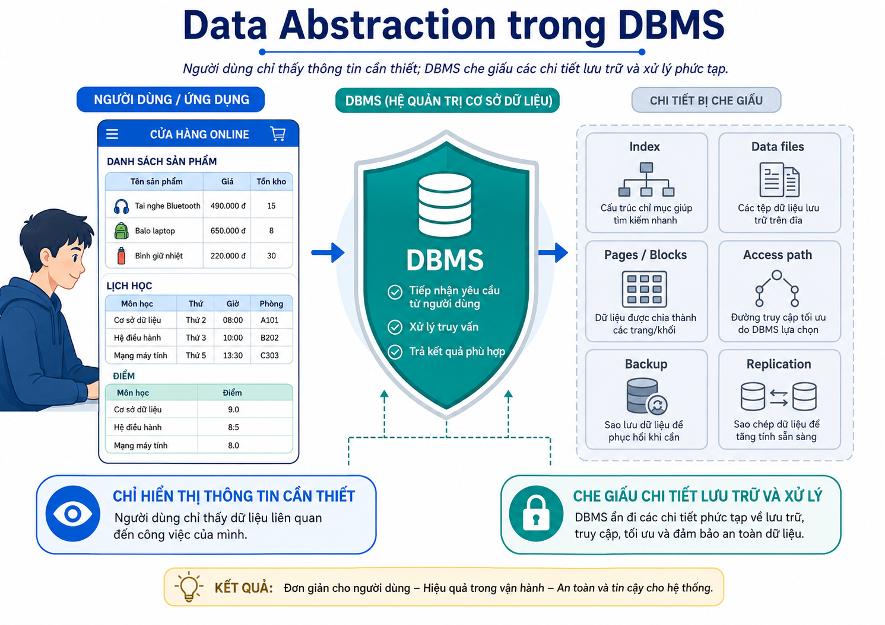
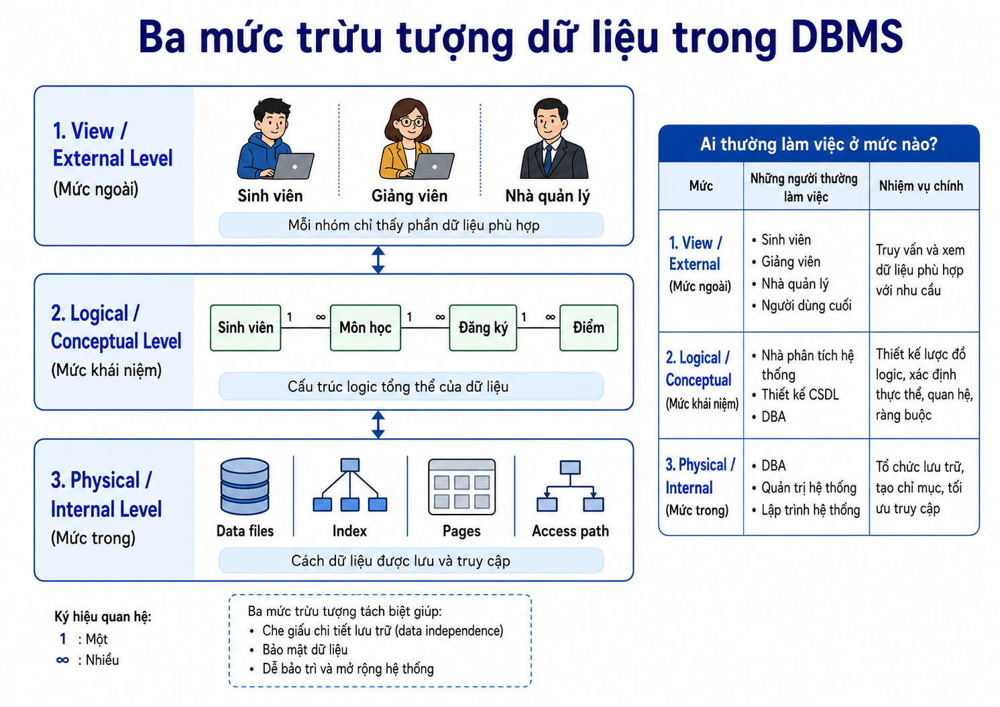
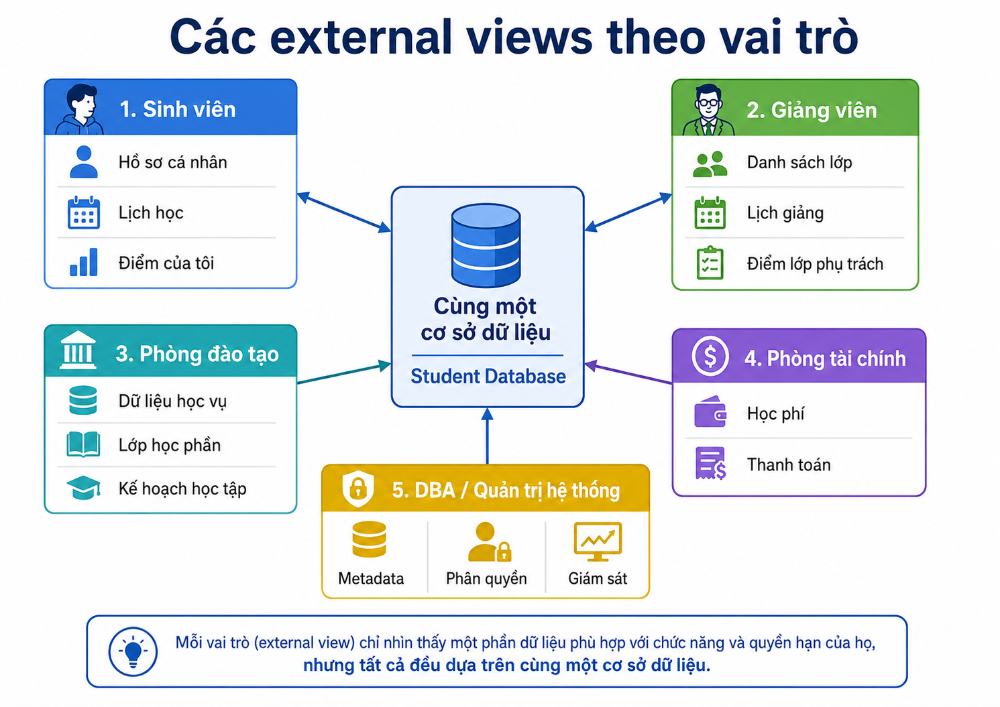
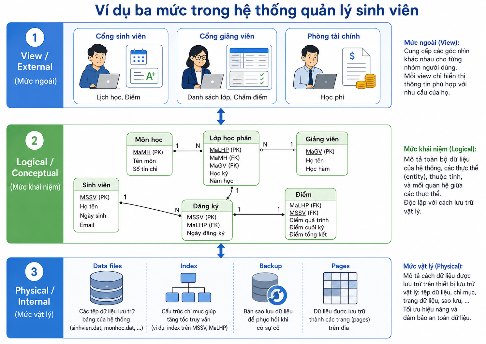

# Bài giảng: Data Abstraction trong DBMS

## Tài liệu tham khảo

- GeeksforGeeks – *What is Data Abstraction in DBMS?*
- Các khái niệm kiến trúc ba mức của DBMS (Internal, Conceptual, External)

> Bài này tập trung vào **người dùng hoặc ứng dụng nhìn thấy dữ liệu ở mức nào**. Bài tiếp theo về **Data Independence** tập trung vào việc thay đổi ở một mức có thể ít ảnh hưởng đến mức cao hơn như thế nào.

---

## 1. Mục tiêu học tập

Sau bài học, người học có thể:

1. Giải thích Data Abstraction trong DBMS bằng ví dụ thực tế.
2. Phân biệt ba mức: Internal, Conceptual và External.
3. Nêu được câu hỏi trọng tâm mà mỗi mức trả lời.
4. Xác định nhóm người dùng thường làm việc tại mỗi mức.
5. Giải thích vì sao trừu tượng hóa giúp hệ thống dễ dùng hơn.
6. Phân biệt Data Abstraction với Data Independence.
7. Liên hệ External Level với view, report, form, dashboard và API response.
8. Phân tích một hệ thống đơn giản theo ba mức trừu tượng.

---

## 2. Data Abstraction là gì?

**Data Abstraction** hay **trừu tượng hóa dữ liệu** là cách DBMS che giấu các chi tiết không cần thiết đối với một người dùng hoặc một ứng dụng, đồng thời chỉ cung cấp phần thông tin phù hợp với nhiệm vụ của họ.

Người dùng đặt hàng trực tuyến thường cần biết:

```text
Tên sản phẩm
Giá bán
Màu sắc
Kích thước
Tình trạng còn hàng
```

Người dùng thường không cần biết:

```text
Dữ liệu được lưu ở file vật lý nào
DBMS dùng index nào để tìm sản phẩm
Dữ liệu nằm ở page/block nào
Có bao nhiêu bản sao dữ liệu
Chiến lược tối ưu truy vấn đang được dùng
```


### 2.1. Mục đích

Data Abstraction giúp:

- Đơn giản hóa việc sử dụng dữ liệu.
- Che giấu phần kỹ thuật phức tạp không cần thiết.
- Hỗ trợ thiết kế giao diện dữ liệu khác nhau cho các nhóm vai trò.
- Hạn chế việc hiển thị dữ liệu không liên quan.
- Cho phép DBA và kỹ sư tối ưu hệ thống phía sau mà người dùng không phải biết chi tiết.

> Data Abstraction **hỗ trợ** bảo mật vì có thể giới hạn thông tin hiển thị. Tuy nhiên, bảo mật thực tế vẫn cần xác thực, phân quyền, policy, audit và các cơ chế kiểm soát khác.

---


### Quiz – Data Abstraction là gì?

**Câu 1.** Một sinh viên dùng cổng thông tin để xem điểm nhưng không thể xem cấu trúc index hay vị trí file lưu điểm. Điều này minh họa trực tiếp nhất cho điều gì?

A. External Level chỉ hiển thị thông tin phù hợp, còn chi tiết nội bộ được che giấu.
B. Sinh viên đang quản lý Internal Schema.
C. Mọi người dùng đều có cùng một view dữ liệu.
D. DBMS không có Conceptual Level.

**Câu 2.** Một nhóm cho rằng chỉ cần giấu tên file dữ liệu thì hệ thống đã an toàn. Nhận định nào chính xác nhất?

A. Đúng, vì che giấu file đã thay thế hoàn toàn phân quyền.
B. Chưa đầy đủ; Data Abstraction hỗ trợ giới hạn thông tin hiển thị nhưng cần thêm xác thực, phân quyền và audit.
C. Đúng, vì Data Abstraction tự động ngăn mọi truy cập trái phép.
D. Sai, vì Data Abstraction chỉ liên quan đến màn hình màu sắc.

**Câu 3.** Trong website bán hàng, khách hàng thấy giá và tồn kho nhưng không thấy chiến lược truy cập dữ liệu. Chi tiết nào thuộc phần bị che giấu nhiều nhất?

A. Tên sản phẩm.
B. Màu sắc sản phẩm.
C. Cấu trúc index và access path do DBMS lựa chọn.
D. Giá niêm yết.

## 3. Ba mức trừu tượng dữ liệu

DBMS thường mô tả dữ liệu theo ba mức:

```text
View / External Level
        ↑
Logical / Conceptual Level
        ↑
Physical / Internal Level
```

| Mức | Câu hỏi trọng tâm | Ai thường làm việc? |
|---|---|---|
| View / External | Mỗi nhóm người dùng cần nhìn thấy dữ liệu nào? | End users, application developers, analysts |
| Logical / Conceptual | Toàn bộ dữ liệu được tổ chức logic như thế nào? | Database designers, developers, analysts, DBA |
| Physical / Internal | Dữ liệu thực sự được lưu và truy cập như thế nào? | DBA, system engineers, DBMS engineers |



---


### Quiz – Ba mức trừu tượng dữ liệu

**Câu 1.** Một nhà phân tích mô tả những nhóm dữ liệu chính của hệ thống, ý nghĩa của chúng và quan hệ nghiệp vụ giữa chúng, nhưng không bàn về page hoặc index. Họ đang làm việc chủ yếu ở mức nào?

A. External Level.
B. Physical/Internal Level.
C. Network Level.
D. Logical/Conceptual Level.

**Câu 2.** Phát biểu nào ghép đúng câu hỏi với mức dữ liệu?

A. External: người dùng cần thấy gì; Conceptual: dữ liệu được tổ chức logic ra sao.
B. External: dữ liệu lưu ở block nào; Internal: ai được xem dữ liệu nào.
C. Conceptual: index nào được dùng; Internal: dashboard nào được hiển thị.
D. Internal: giao diện API trả về dữ liệu nào; External: dữ liệu được nén ra sao.

**Câu 3.** Một external view thay đổi bố cục báo cáo cho phòng tài chính nhưng không làm thay đổi toàn bộ mô hình dữ liệu. Đây cho thấy điều gì?

A. External Level thay thế Physical Level.
B. Mỗi external view có thể phục vụ nhu cầu riêng mà vẫn dựa trên một conceptual model chung.
C. Mọi báo cáo phải dùng cùng một giao diện.
D. Logical Level chỉ dành cho người dùng cuối.

## 4. Physical / Internal Level

### 4.1. Khái niệm

Physical Level hoặc Internal Level là mức thấp nhất. Nó mô tả cách dữ liệu được lưu trữ và truy cập trong hệ thống.

Ví dụ các chi tiết ở mức này:

```text
Data files
Pages hoặc blocks
Indexes
Access paths
B+ tree hoặc hash structures
Nén dữ liệu
Phân vùng dữ liệu
Sao chép dữ liệu
Vị trí lưu trữ
```

### 4.2. Ví dụ

Khi một người tìm sinh viên theo mã số, họ chỉ yêu cầu hệ thống trả về thông tin sinh viên. DBMS có thể sử dụng index hoặc đọc một số page cụ thể để trả kết quả.

Người dùng không cần biết:

```text
Index có tồn tại hay không
Index dùng cấu trúc nào
Dữ liệu nằm trong file nào
Cần đọc bao nhiêu page
```

### 4.3. Ai quan tâm đến mức này?

- DBA tối ưu hiệu năng và quản lý lưu trữ.
- Kỹ sư hệ thống giám sát tài nguyên.
- DBMS engineers phát triển cơ chế lưu trữ.
- Người dùng cuối thường không làm việc trực tiếp ở mức này.

---


### Quiz – Physical / Internal Level

**Câu 1.** DBA chuyển các data files sang thiết bị lưu trữ mới và tổ chức lại index để cải thiện hiệu năng. Mô tả nào đúng nhất?

A. Đây là thay đổi bắt buộc ở External Level.
B. Đây là thay đổi về nội dung dashboard.
C. Đây là thay đổi chủ yếu ở Physical/Internal Level.
D. Đây là thay đổi trong quyền xem điểm của sinh viên.

**Câu 2.** Vì sao người dùng cuối thường không cần biết DBMS đọc bao nhiêu pages khi tìm một sinh viên?

A. Vì pages chỉ xuất hiện trong Excel.
B. Vì mọi truy vấn chỉ cần đọc đúng một page.
C. Vì database không lưu dữ liệu vật lý.
D. Vì việc chọn access path và đọc pages là chi tiết internal được DBMS che giấu.

**Câu 3.** Một thiết kế cho phép người dùng tự chọn B+ tree hay hash index cho mỗi lần tìm kiếm thông thường là không phù hợp nhất vì lý do nào?

A. Nó buộc người dùng xử lý chi tiết Internal Level thay vì tập trung vào nghiệp vụ.
B. Người dùng không thể nhập dữ liệu.
C. B+ tree không được DBMS hỗ trợ.
D. Hash index luôn chậm hơn mọi cấu trúc khác.

## 5. Logical / Conceptual Level

### 5.1. Khái niệm

Logical Level hoặc Conceptual Level mô tả cấu trúc logic của toàn bộ database.

Nó trả lời các câu hỏi:

```text
Có những thực thể hoặc bảng nào?
Mỗi thực thể có dữ liệu gì?
Các thực thể có quan hệ gì?
Có quy tắc dữ liệu nào?
Thông tin nào cần được lưu?
```

Ví dụ trong hệ thống quản lý sinh viên:

```text
Sinh viên
Môn học
Lớp học phần
Đăng ký học
Điểm
Khoa
Giảng viên
```

Ở mức khái niệm, nhà thiết kế quan tâm đến ý nghĩa và cấu trúc dữ liệu; họ không cần biết bảng đang được lưu trong file nào.

### 5.2. Vai trò

- Là nền tảng để thiết kế database.
- Giúp thống nhất cách hiểu dữ liệu giữa nghiệp vụ và kỹ thuật.
- Cung cấp cấu trúc chung cho nhiều external views.
- Là mức gần nhất với các mô hình ERD và relational schema trong các bài học tiếp theo.

---


### Quiz – Logical / Conceptual Level

**Câu 1.** Một nhóm xác định hệ thống phải quản lý sinh viên, học phần, đăng ký và điểm; sau đó mô tả quan hệ giữa các khái niệm này. Công việc này gần nhất với:

A. Tối ưu page cache.
B. Thiết kế Conceptual Schema.
C. Thiết kế giao diện mobile.
D. Thực hiện backup vật lý.

**Câu 2.** Điều nào không thuộc Logical/Conceptual Level?

A. Các nhóm dữ liệu cần lưu và ý nghĩa nghiệp vụ của chúng.
B. Các quan hệ và quy tắc dữ liệu.
C. Cách DBMS phân bổ dữ liệu trên từng block của ổ đĩa.
D. Cấu trúc tổng thể mà nhiều external views cùng dựa vào.

**Câu 3.** Một báo cáo mới cần xuất hiện cho phòng đào tạo. Báo cáo này nên dựa trực tiếp nhất vào lớp nào để lấy cấu trúc và ý nghĩa dữ liệu thống nhất?

A. Physical Level.
B. Thiết bị lưu trữ.
C. Màn hình của người dùng cuối.
D. Conceptual Level.

## 6. View / External Level

### 6.1. Khái niệm

View Level hoặc External Level là mức gần người dùng nhất. Nó mô tả dữ liệu nào được hiển thị cho một người dùng, một nhóm người dùng hoặc một ứng dụng cụ thể.

Trong một trường đại học:

| Nhóm | Thông tin thường cần |
|---|---|
| Sinh viên | Hồ sơ cá nhân, lịch học, điểm của chính mình |
| Giảng viên | Danh sách lớp, lịch giảng, điểm của lớp phụ trách |
| Phòng đào tạo | Dữ liệu học vụ rộng hơn |
| Phòng tài chính | Học phí, thanh toán, hỗ trợ tài chính |
| DBA | Metadata, quyền, cấu hình và giám sát hệ thống |

### 6.2. External Level không chỉ là SQL VIEW

External Level có thể được hiện thực bằng:

```text
SQL view
Form
Report
Dashboard
API response
Trang web hoặc mobile screen
Export file
Role-based interface
```

SQL `VIEW` là một cơ chế phổ biến, nhưng không phải là toàn bộ ý nghĩa của External Level.



---


### Quiz – View / External Level

**Câu 1.** Một ứng dụng mobile trả về JSON chỉ chứa tên môn học, lịch học và điểm của sinh viên đang đăng nhập. JSON response này có thể được xem là một hiện thực của:

A. External Level.
B. Internal file organization.
C. Physical data page.
D. Index partition.

**Câu 2.** Vì sao không nên đồng nhất hoàn toàn External Level với SQL VIEW?

A. Vì SQL VIEW không thể hiển thị dữ liệu.
B. Vì External Level rộng hơn: có thể được thể hiện qua reports, forms, dashboards, APIs và role-based screens.
C. Vì External Level chỉ dùng cho DBA.
D. Vì SQL VIEW luôn thuộc Physical Level.

**Câu 3.** Trong một trường, phòng tài chính xem học phí nhưng không cần xem điểm chi tiết. Thiết kế hợp lý nhất là:

A. Cấp toàn bộ database cho phòng tài chính để tự lọc.
B. Chuyển toàn bộ dữ liệu sang file Excel.
C. Tạo external interface/view phù hợp với nhiệm vụ và quyền hạn của phòng tài chính.
D. Xóa dữ liệu điểm khỏi conceptual schema.

## 7. Ví dụ xuyên suốt: hệ thống quản lý sinh viên

### 7.1. Physical / Internal

```text
Dữ liệu được lưu trong data files.
DBMS có thể dùng index để tìm nhanh thông tin.
Có thể có backup, replication hoặc partition.
```

### 7.2. Logical / Conceptual

```text
Có các nhóm dữ liệu: sinh viên, môn học, lớp học phần, đăng ký, điểm.
Có các liên hệ và quy tắc nghiệp vụ giữa các nhóm dữ liệu.
```

### 7.3. View / External

```text
Sinh viên xem dữ liệu cá nhân.
Giảng viên xem lớp mình phụ trách.
Phòng đào tạo xem thông tin học vụ.
Phòng tài chính xem dữ liệu học phí.
```



---

## 8. Data Abstraction và Data Independence

Hai khái niệm liên quan nhưng không giống nhau.

| Khái niệm | Câu hỏi trung tâm |
|---|---|
| Data Abstraction | Người dùng hoặc ứng dụng cần nhìn dữ liệu ở mức nào? |
| Data Independence | Khi thay đổi một mức dữ liệu, mức cao hơn hoặc ứng dụng có cần thay đổi đáng kể không? |

Ví dụ:

```text
Sinh viên chỉ xem điểm của mình
→ Data Abstraction / External Level.

DBA thêm index để truy vấn nhanh hơn mà portal sinh viên không cần sửa
→ Physical Data Independence.
```

---

### Quiz – Quiz tổng hợp

**Câu 1.** Một developer nói: “Chúng ta đã có dashboard riêng cho từng phòng ban, vì vậy hệ thống đương nhiên có Data Independence.” Nhận định nào tốt nhất?

A. Đúng hoàn toàn; dashboard tự bảo đảm mọi thay đổi schema không ảnh hưởng application.
B. Sai vì dashboard thuộc Physical Level.
C. Đúng nếu database có ít hơn mười tables.
D. Chưa đủ; dashboard chủ yếu liên quan External Level, còn Data Independence nói về ảnh hưởng của thay đổi giữa các mức.

**Câu 2.** Khi phân tích một hệ thống, thứ tự nào phản ánh đúng từ góc nhìn người dùng đến chi tiết lưu trữ?

A. External → Conceptual → Internal.
B. Physical → External → Conceptual.
C. Conceptual → Physical → External.
D. Internal → External → Conceptual.

**Câu 3.** Một yêu cầu “sinh viên chỉ xem điểm của mình” thuộc loại yêu cầu nào trực tiếp nhất?

A. Yêu cầu thay đổi index vật lý.
B. Yêu cầu về External View và quyền truy cập theo vai trò.
C. Yêu cầu phân vùng ổ đĩa.
D. Yêu cầu thay đổi access path.

**Câu 4.** Một yêu cầu “hệ thống phải có thể đổi cách tổ chức lưu trữ mà portal không cần sửa” liên quan trực tiếp nhất đến:

A. Data Abstraction ở External Level.
B. Thiết kế dashboard.
C. Physical Data Independence.
D. Thiết kế form nhập liệu.

**Câu 5.** Điều nào mô tả đúng nhất mối quan hệ giữa ba mức?

A. Mỗi mức tồn tại độc lập hoàn toàn và không liên quan nhau.
B. Internal Level chỉ mô tả giao diện người dùng.
C. Conceptual Level chỉ mô tả thiết bị phần cứng.
D. External Level mô tả dữ liệu cho vai trò; Conceptual Level mô tả logic chung; Internal Level mô tả lưu trữ/truy cập.

## 10. Bài tập vận dụng

### Bài 10.1. Hệ thống bệnh viện

Một hệ thống bệnh viện có bác sĩ, bệnh nhân, kế toán và quản trị viên.

Hãy nêu:

1. Một external view cho bác sĩ.
2. Một external view cho bệnh nhân.
3. Một loại thông tin ở conceptual level.
4. Hai chi tiết thuộc physical level.

### Bài 10.2. Cổng thương mại điện tử

Đối với một website bán hàng, hãy phân loại các nội dung sau vào Physical, Conceptual hoặc External Level:

```text
Danh mục sản phẩm hiển thị cho khách hàng
Chiến lược index tìm kiếm sản phẩm
Thông tin sản phẩm và đơn hàng cần được quản lý
Dashboard doanh thu cho quản lý
Bản sao dữ liệu dự phòng
```

### Bài 10.3. Nhận xét thiết kế

Một nhóm nói: “Chúng tôi dùng dashboard nên đã có Data Independence.”

Nhận xét phát biểu này bằng 3–5 câu, đồng thời chỉ ra phần nào liên quan đến abstraction và phần nào liên quan đến independence.

---

## 11. Tóm tắt

- Data Abstraction che giấu chi tiết không cần thiết và chỉ hiển thị thông tin phù hợp với từng mục đích.
- DBMS thường có ba mức: Physical/Internal, Logical/Conceptual và View/External.
- Physical Level tập trung vào cách lưu trữ và truy cập dữ liệu.
- Logical Level tập trung vào cấu trúc logic tổng thể của dữ liệu.
- External Level tập trung vào phần dữ liệu từng nhóm người dùng hoặc ứng dụng cần thấy.
- External Level có thể xuất hiện dưới dạng views, forms, reports, dashboards hoặc API responses.
- Data Abstraction không đồng nghĩa hoàn toàn với Data Independence.

## 12. Từ khóa chính

- Data Abstraction
- Internal Level
- Physical Level
- Conceptual Level
- Logical Level
- External Level
- View Level
- External Schema
- Conceptual Schema
- Internal Schema
- Metadata
- Database View
- Role-based Access
- Data Independence


---

# Đáp án quiz

## Đáp án – Data Abstraction là gì?

| Câu | Đáp án | Giải thích |
|---:|:---:|---|
| 2.1 | A | External Level chỉ đưa ra phần dữ liệu cần thiết; các chi tiết kỹ thuật được che giấu. |
| 2.2 | B | Che giấu thông tin không thay thế xác thực, phân quyền hoặc audit. |
| 2.3 | C | Index và access path thuộc chi tiết nội bộ của DBMS. |

## Đáp án – Ba mức trừu tượng dữ liệu

| Câu | Đáp án | Giải thích |
|---:|:---:|---|
| 3.1 | D | Cấu trúc và quan hệ nghiệp vụ của toàn database thuộc Conceptual Level. |
| 3.2 | A | External trả lời người dùng thấy gì; Conceptual trả lời dữ liệu tổ chức logic ra sao. |
| 3.3 | B | Nhiều external views có thể dựa trên cùng một conceptual model. |

## Đáp án – Physical / Internal Level

| Câu | Đáp án | Giải thích |
|---:|:---:|---|
| 4.1 | C | Data files và index là chi tiết internal. |
| 4.2 | D | Page reads và access path do DBMS quản lý ở mức internal. |
| 4.3 | A | Buộc người dùng chọn cấu trúc lưu trữ làm lộ chi tiết không cần thiết. |

## Đáp án – Logical / Conceptual Level

| Câu | Đáp án | Giải thích |
|---:|:---:|---|
| 5.1 | B | Xác định dữ liệu, ý nghĩa và quan hệ là thiết kế conceptual schema. |
| 5.2 | C | Block trên đĩa là chi tiết physical. |
| 5.3 | D | Conceptual Level cung cấp cấu trúc/ý nghĩa chung cho các view. |

## Đáp án – View / External Level

| Câu | Đáp án | Giải thích |
|---:|:---:|---|
| 6.1 | A | API response là một cách biểu hiện external view. |
| 6.2 | B | External Level rộng hơn SQL VIEW. |
| 6.3 | C | Mỗi vai trò nên có interface/view theo nhiệm vụ và quyền hạn. |

## Đáp án – Quiz tổng hợp

| Câu | Đáp án | Giải thích |
|---:|:---:|---|
| 9.1 | D | Dashboard riêng liên quan External Level, không tự bảo đảm independence. |
| 9.2 | A | Thứ tự từ gần người dùng đến gần lưu trữ là External–Conceptual–Internal. |
| 9.3 | B | Đây là yêu cầu external view và access control theo vai trò. |
| 9.4 | C | Đổi cách lưu trữ mà portal không đổi là Physical Data Independence. |
| 9.5 | D | Ba mức có vai trò riêng nhưng liên kết với nhau. |
