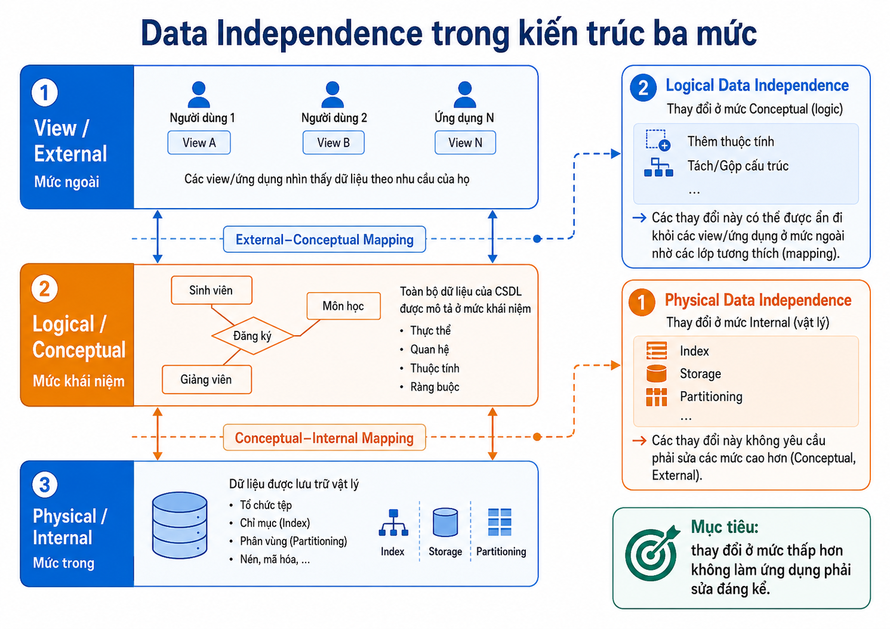
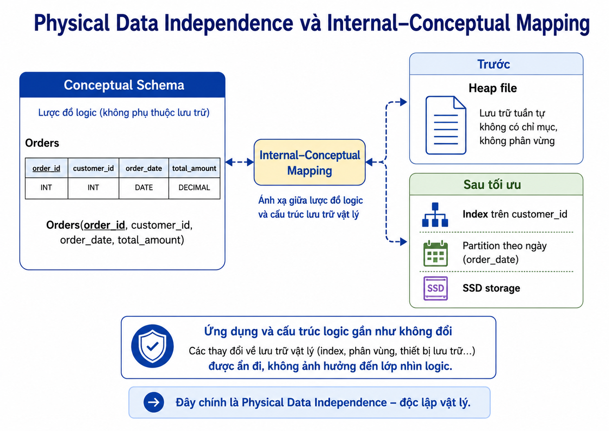
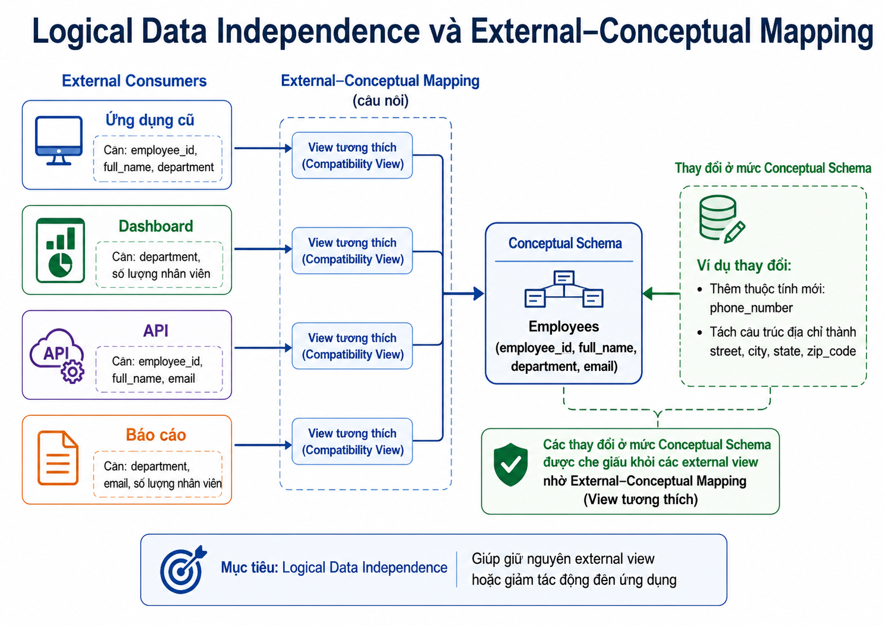

# Bài giảng: Data Independence trong DBMS

## Tài liệu tham khảo

- GeeksforGeeks – *What is Data Independence in DBMS?*
- GeeksforGeeks – *Physical and Logical Data Independence*
- Khái niệm kiến trúc ba mức ANSI/SPARC

> Bài này tiếp nối Data Abstraction. Trọng tâm là: **khi cấu trúc hoặc cách lưu trữ dữ liệu thay đổi, ứng dụng và người dùng có phải sửa theo không?**

---

## 1. Mục tiêu học tập

Sau bài học, người học có thể:

1. Giải thích được Data Independence.
2. Phân biệt Physical Data Independence và Logical Data Independence.
3. Liên hệ hai loại independence với ba mức Internal, Conceptual và External.
4. Giải thích Internal–Conceptual Mapping và External–Conceptual Mapping.
5. Phân tích vì sao Logical Data Independence thường khó hơn.
6. Nhận diện giới hạn thực tế khi schema thay đổi.
7. Đề xuất compatibility view hoặc interface phù hợp để giảm ảnh hưởng đến ứng dụng.
8. Phân loại các tình huống thay đổi thành physical hoặc logical.

---

## 2. Data Independence là gì?

**Data Independence** hay **độc lập dữ liệu** là khả năng thay đổi schema hoặc cách tổ chức dữ liệu ở một mức mà không buộc các mức cao hơn hay các chương trình sử dụng dữ liệu phải thay đổi đáng kể.

Nói cách khác:

```text
Thay đổi cách lưu trữ hoặc tổ chức dữ liệu
→ không nhất thiết làm hỏng application, report, API hoặc user view.
```

Ví dụ:

```text
DBA tạo thêm index để tăng tốc query.
Portal sinh viên vẫn dùng giao diện và truy vấn nghiệp vụ như trước.
```



### 2.1. Lợi ích

- Giảm chi phí bảo trì.
- Hỗ trợ tối ưu hiệu năng mà ít ảnh hưởng ứng dụng.
- Giúp schema phát triển theo yêu cầu nghiệp vụ.
- Hạn chế gián đoạn hệ thống.
- Tăng khả năng tái sử dụng application interfaces.
- Hỗ trợ hệ thống tồn tại lâu dài khi dữ liệu và workload thay đổi.

> Data Independence không phải lời hứa rằng **mọi** thay đổi đều không ảnh hưởng application. Nếu ứng dụng phụ thuộc trực tiếp vào thành phần bị đổi, vẫn cần sửa code hoặc duy trì compatibility layer.


---

### Quiz – Data Independence là gì?

**Câu 1.** Một DBA tạo index mới để tăng tốc tìm đơn hàng, còn ứng dụng không đổi query nghiệp vụ. Điều này phản ánh trực tiếp nhất:

A. Physical Data Independence.
B. Logical Data Independence.
C. External View redesign.
D. Data redundancy.

**Câu 2.** Phát biểu nào về Data Independence là chính xác nhất?

A. Mọi thay đổi schema đều không bao giờ ảnh hưởng application.
B. Data Independence giúp giảm ảnh hưởng của thay đổi, nhưng ứng dụng vẫn có thể cần sửa nếu phụ thuộc trực tiếp vào phần bị đổi.
C. Chỉ có ý nghĩa đối với backup.
D. Chỉ áp dụng cho giao diện web.

**Câu 3.** Mục tiêu chính của Data Independence là gì?

A. Buộc mọi ứng dụng dùng cùng một framework.
B. Loại bỏ hoàn toàn nhu cầu test sau khi schema thay đổi.
C. Giảm sự phụ thuộc giữa các mức dữ liệu và interface sử dụng dữ liệu.
D. Thay thế conceptual schema bằng file vật lý.

## 3. Ôn lại ba mức kiến trúc

```text
View / External Level
        ↑
Logical / Conceptual Level
        ↑
Physical / Internal Level
```

| Mức | Mô tả ngắn |
|---|---|
| Internal | Chi tiết lưu trữ vật lý, file, index, access path |
| Conceptual | Cấu trúc logic tổng thể của database |
| External | Dữ liệu được nhìn thấy qua view, report, form, API hoặc giao diện vai trò |

Data Independence được hỗ trợ bởi các ánh xạ giữa các mức này.


---

### Quiz – Ba mức kiến trúc và mapping

**Câu 1.** Internal–Conceptual Mapping phục vụ trực tiếp nhất cho mục tiêu nào?

A. Cho phép mỗi phòng ban dùng dashboard riêng.
B. Tạo account cho người dùng mới.
C. Mã hóa mật khẩu ở application layer.
D. Ánh xạ cấu trúc logic sang cách lưu trữ vật lý để thay đổi physical organization ít ảnh hưởng conceptual schema.

**Câu 2.** External–Conceptual Mapping quan trọng nhất khi nào?

A. Khi cần duy trì các view/interface phù hợp cho người dùng trong khi conceptual schema có thể tiến hóa.
B. Khi cần thay ổ HDD bằng SSD.
C. Khi cần nén data files.
D. Khi cần chọn page size.

**Câu 3.** Một report cũ tiếp tục hiển thị các cột quen thuộc dù cấu trúc logic bên dưới đã được điều chỉnh. Điều này minh họa tốt nhất cho:

A. Physical partitioning.
B. External–Conceptual Mapping.
C. Index scan.
D. Internal file format.

## 4. Physical Data Independence

### 4.1. Khái niệm

**Physical Data Independence** là khả năng thay đổi internal schema mà không cần thay đổi conceptual schema.

Vì application và external views thường dựa trên conceptual schema hoặc interface ở mức cao hơn, chúng thường không cần thay đổi khi các tối ưu vật lý được thực hiện đúng cách.

### 4.2. Các thay đổi thường gặp

```text
Tạo hoặc thay đổi index
Thay đổi access path
Di chuyển data files
Chuyển dữ liệu từ HDD sang SSD
Nén dữ liệu
Partitioning hoặc reorganization
Thay đổi chiến lược lưu trữ
```

### 4.3. Ví dụ

```sql
CREATE INDEX idx_orders_customer
ON Orders(customer_id);
```

Application vẫn có thể thực hiện:

```sql
SELECT *
FROM Orders
WHERE customer_id = 101;
```

Việc thêm index thay đổi cách DBMS truy cập dữ liệu, nhưng không thay đổi ý nghĩa logic của dữ liệu trong `Orders`.

### 4.4. Internal–Conceptual Mapping

**Internal–Conceptual Mapping** là ánh xạ giữa:

```text
Internal schema
↕
Conceptual schema
```

Vai trò của ánh xạ này:

- DBMS biết cách biểu diễn cấu trúc conceptual bằng các cấu trúc lưu trữ vật lý.
- Khi storage organization thay đổi, DBMS có thể cập nhật mapping nội bộ.
- Conceptual schema và các application dùng nó ít bị ảnh hưởng.




---

### Quiz – Physical Data Independence

**Câu 1.** Thay đổi nào dưới đây thuộc Physical Data Independence rõ nhất?

A. Đổi tên cột `customer_name` thành `full_name`.
B. Tách bảng địa chỉ thành nhiều thành phần logic.
C. Tạo index trên `order_date` và giữ nguyên conceptual schema.
D. Thay đổi API response fields.

**Câu 2.** Vì sao Physical Data Independence thường dễ đạt hơn Logical Data Independence?

A. Vì logical schema không có trong DBMS.
B. Vì physical changes không bao giờ cần kiểm tra.
C. Vì index luôn làm ứng dụng nhanh hơn.
D. Vì thay đổi physical thường được DBMS che giấu tốt hơn khỏi conceptual schema và application.

**Câu 3.** Một tổ chức chuyển dữ liệu lịch sử sang storage tier rẻ hơn, nhưng ứng dụng vẫn truy vấn cùng logical tables. Đây gần nhất là:

A. Physical Data Independence.
B. Logical Data Independence.
C. External schema change.
D. Data duplication.

## 5. Logical Data Independence

### 5.1. Khái niệm

**Logical Data Independence** là khả năng thay đổi conceptual schema mà không buộc external schemas, views hoặc applications phải thay đổi đáng kể.

Đây là mục tiêu khó hơn vì logical schema gần với ý nghĩa dữ liệu mà application đang sử dụng.

### 5.2. Ví dụ thay đổi logic

```text
Thêm thuộc tính mới
Tạo quan hệ mới
Tách một cấu trúc dữ liệu thành nhiều cấu trúc
Gộp nhiều cấu trúc
Đổi tên thuộc tính
Loại bỏ thuộc tính
Thay đổi quy tắc dữ liệu
```

### 5.3. Ví dụ đơn giản

Ban đầu, application cần thông tin nhân viên:

```text
employee_id
full_name
department
```

Sau đó database bổ sung thêm `email`.

```sql
ALTER TABLE Employees
ADD email VARCHAR(100);
```

Nếu application không dùng `SELECT *`, không phụ thuộc vào số lượng cột cố định và không cần trường `email`, application cũ có thể tiếp tục hoạt động.

### 5.4. Compatibility view

Khi logical schema thay đổi, có thể duy trì một view hoặc interface tương thích.

```sql
CREATE VIEW EmployeeBasicView AS
SELECT employee_id,
       full_name,
       department
FROM Employees;
```

Application cũ sử dụng `EmployeeBasicView` có thể tiếp tục nhận tập dữ liệu quen thuộc.

### 5.5. External–Conceptual Mapping

**External–Conceptual Mapping** là ánh xạ giữa:

```text
External schemas / views
↕
Conceptual schema
```

Vai trò:

- Cho phép mỗi nhóm người dùng thấy cấu trúc phù hợp.
- Giúp duy trì interface tương thích khi conceptual schema thay đổi.
- Hỗ trợ giảm tác động của thay đổi logic lên reports, applications và APIs.




---

### Quiz – Logical Data Independence

**Câu 1.** Một ứng dụng dùng `SELECT *` và export CSV có số cột cố định. Khi table được thêm cột, đánh giá nào đúng nhất?

A. Ứng dụng chắc chắn không bị ảnh hưởng.
B. Có thể bị ảnh hưởng, vì nó phụ thuộc trực tiếp vào hình dạng logical schema.
C. Đây chỉ là physical change.
D. DBMS sẽ tự sửa file export.

**Câu 2.** Compatibility view hữu ích nhất trong trường hợp nào?

A. Khi cần tăng dung lượng RAM.
B. Khi cần chọn B+ tree hay hash index.
C. Khi cần giữ interface dữ liệu cũ cho ứng dụng/report trong lúc conceptual schema đã thay đổi.
D. Khi cần sao lưu database.

**Câu 3.** Thay đổi nào có nguy cơ yêu cầu Logical Data Independence hoặc migration plan nhiều nhất?

A. Tạo thêm index cho một cột.
B. Nén data files.
C. Chuyển data files sang SSD.
D. Tách một table đang được nhiều application truy vấn thành các cấu trúc mới.

## 6. So sánh hai loại Data Independence

| Tiêu chí | Physical Data Independence | Logical Data Independence |
|---|---|---|
| Mức thay đổi | Internal schema | Conceptual schema |
| Mức cao hơn cần được bảo vệ | Conceptual schema, external views, applications | External views, applications |
| Ví dụ | Tạo index, đổi storage, nén dữ liệu | Thêm cột, tách/gộp cấu trúc, tạo compatibility view |
| Mục tiêu | Tối ưu lưu trữ và hiệu năng | Cho phép model dữ liệu tiến hóa |
| Độ khó | Thường dễ hơn | Thường khó hơn |
| Rủi ro ảnh hưởng application | Thấp hơn nếu DBMS che giấu tốt | Cao hơn nếu app phụ thuộc trực tiếp schema |

---


---

### Quiz – So sánh hai loại Independence

**Câu 1.** Cặp ghép nào đúng nhất?

A. Physical Independence – thay đổi index/storage; Logical Independence – thay đổi conceptual structure.
B. Physical Independence – thay dashboard; Logical Independence – thay SSD.
C. Physical Independence – đổi API; Logical Independence – đổi page size.
D. Physical Independence – tạo report; Logical Independence – tạo backup.

**Câu 2.** Một team muốn giảm rủi ro khi đổi tên cột đang được nhiều application sử dụng. Giải pháp nào phù hợp nhất?

A. Chỉ thêm index.
B. Duy trì compatibility view hoặc API adapter, công bố lộ trình migration và regression test.
C. Xóa ngay cột cũ mà không thông báo.
D. Chuyển storage sang SSD.

**Câu 3.** Điều nào là kết luận đúng về ảnh hưởng application?

A. Physical changes luôn làm ứng dụng phải sửa.
B. Logical changes không bao giờ ảnh hưởng API hay reports.
C. Physical changes thường ít ảnh hưởng hơn; logical changes cần đánh giá dependency kỹ hơn.
D. Cả hai loại thay đổi luôn có mức rủi ro giống nhau.

## 7. Vì sao Logical Data Independence khó hơn?

Logical changes thường có khả năng ảnh hưởng trực tiếp đến ý nghĩa hoặc hình dạng dữ liệu mà application dùng.

Ví dụ các tình huống rủi ro:

```text
Application dùng SELECT *
ORM mapping phụ thuộc chặt vào schema
Export file yêu cầu cột theo thứ tự cố định
API contract bị thay đổi
Tên cột bị đổi
Một table bị tách thành nhiều table
Quy tắc nghiệp vụ thay đổi ý nghĩa của dữ liệu
```

Do đó, Logical Data Independence thường cần thêm:

```text
Compatibility views
API versioning
Data transformation layer
Migration plan
Regression tests
Deprecation policy
```

---


---

### Quiz – Vì sao Logical Data Independence khó hơn?

**Câu 1.** Lý do nào làm Logical Data Independence khó hơn trong thực tế?

A. DBMS không thể lưu dữ liệu logic.
B. Physical storage không tồn tại.
C. Người dùng cuối luôn quản lý index.
D. Logical changes thường tác động đến tên, cấu trúc hoặc ý nghĩa dữ liệu mà application, report và API đang phụ thuộc.

**Câu 2.** Một migration plan tốt cho thay đổi logical schema nên có nội dung nào?

A. Compatibility layer, kiểm tra dependencies, migration dữ liệu và regression tests.
B. Chỉ cần thay đổi production trực tiếp.
C. Chỉ tạo thêm một index.
D. Chỉ tăng dung lượng storage.

**Câu 3.** Khi một API contract cần duy trì ổn định trong lúc conceptual schema thay đổi, giải pháp nào trực tiếp nhất?

A. Bắt client tự đoán schema mới.
B. Dùng adapter hoặc API versioning để duy trì interface tương thích.
C. Xóa endpoint cũ ngay lập tức.
D. Thay đổi page size của database.

## 8. Ví dụ tổng hợp: hệ thống bán hàng

### 8.1. Physical change

DBA thêm index để tối ưu tìm đơn hàng theo khách hàng.

```text
Thay đổi: index/access path
Loại: Physical Data Independence
Application: thường không cần thay đổi
```

### 8.2. Logical change

Hệ thống tách địa chỉ khách hàng thành một cấu trúc riêng để quản lý nhiều địa chỉ.

```text
Thay đổi: conceptual schema
Loại: Logical Data Independence
Application: có thể cần sửa nếu đang đọc trực tiếp cấu trúc cũ
Giảm ảnh hưởng: tạo compatibility view hoặc API adapter
```

### 8.3. Cách đánh giá trước khi thay đổi

1. Thành phần nào đang dùng schema bị thay đổi?
2. Có report, API, ETL hoặc export nào phụ thuộc không?
3. Có thể giữ interface cũ qua view hoặc adapter không?
4. Có cần chạy migration dữ liệu không?
5. Có regression tests cho application không?

---

### Quiz – Quiz tổng hợp

**Câu 1.** Một thay đổi gồm: thêm index, chuyển sang SSD và partition dữ liệu theo ngày. Nếu conceptual schema và API giữ nguyên, đây chủ yếu là:

A. Logical Data Independence.
B. External view redesign.
C. Physical Data Independence.
D. Business rule change.

**Câu 2.** Một thay đổi gồm: tách địa chỉ thành street, city, province, postal_code trong khi dashboard cũ vẫn dùng `full_address`. Cách xử lý phù hợp nhất là:

A. Chỉ thêm index.
B. Chuyển database sang SSD.
C. Bỏ dashboard cũ mà không kiểm tra.
D. Duy trì compatibility view hoặc adapter trả `full_address` trong thời gian chuyển đổi.

**Câu 3.** Dấu hiệu nào cho thấy một thay đổi cần đánh giá Logical Data Independence kỹ hơn?

A. Có reports, APIs, ETL hoặc ORM mappings phụ thuộc trực tiếp vào cấu trúc logic cũ.
B. Thay đổi chỉ liên quan đến access path bên trong DBMS.
C. Thay đổi chỉ di chuyển data files.
D. Chỉ thay đổi cấu hình backup.

**Câu 4.** Phát biểu nào tổng hợp đúng nhất?

A. Physical và Logical Data Independence đều bảo đảm không bao giờ có lỗi.
B. Physical Independence giúp che giấu thay đổi internal; Logical Independence cố gắng che giấu thay đổi conceptual khỏi external consumers.
C. Logical Independence chỉ liên quan đến hardware.
D. Physical Independence chỉ có ý nghĩa với UI.

**Câu 5.** Khi không thể giữ toàn bộ interface cũ, lựa chọn quản trị thay đổi hợp lý nhất là:

A. Thay đổi đột ngột và không kiểm tra.
B. Xóa dữ liệu cũ ngay lập tức.
C. Thông báo deprecation, versioning interface, cung cấp migration guide và kiểm thử.
D. Chỉ thay màu dashboard.

## 10. Bài tập vận dụng

### Bài 10.1. Phân loại thay đổi

Phân loại mỗi thay đổi là Physical hoặc Logical Data Independence, đồng thời giải thích ngắn:

1. Chuyển data files từ HDD sang SSD.
2. Thêm index trên cột `order_date`.
3. Đổi tên cột `customer_name`.
4. Tách địa chỉ giao hàng thành cấu trúc riêng.
5. Nén dữ liệu lịch sử.
6. Tạo view tương thích cho ứng dụng cũ.

### Bài 10.2. Phân tích rủi ro

Một hệ thống đang dùng:

```text
SELECT *
CSV export cố định 8 cột
ORM mapping trực tiếp bảng Customers
Một dashboard dùng view CustomerSummary
```

Nhóm kỹ thuật muốn thêm cột `email_verified`.

Hãy trả lời:

1. Thành phần nào có nguy cơ bị ảnh hưởng?
2. Thay đổi này thuộc physical hay logical?
3. Có thể dùng view hoặc API contract để giảm ảnh hưởng thế nào?
4. Cần test những gì trước khi deploy?

### Bài 10.3. Thiết kế compatibility layer

Một table `Orders` được thay đổi mạnh để hỗ trợ nhiều loại đơn hàng. Hãy đề xuất cách duy trì compatibility cho báo cáo cũ trong một giai đoạn chuyển đổi.

---

## 11. Tóm tắt

- Data Independence là khả năng thay đổi ở một mức schema mà ít buộc các mức cao hơn hoặc application thay đổi.
- Physical Data Independence bảo vệ conceptual schema trước thay đổi internal/physical.
- Logical Data Independence bảo vệ external views và applications trước thay đổi conceptual.
- Internal–Conceptual Mapping hỗ trợ che giấu thay đổi lưu trữ vật lý.
- External–Conceptual Mapping hỗ trợ duy trì external views và interfaces.
- Logical Data Independence thường khó hơn vì applications thường phụ thuộc trực tiếp vào cấu trúc và ý nghĩa dữ liệu.
- Compatibility views, adapters, API versioning và tests giúp giảm rủi ro khi logical schema tiến hóa.

## 12. Từ khóa chính

- Data Independence
- Physical Data Independence
- Logical Data Independence
- Internal Schema
- Conceptual Schema
- External Schema
- Internal–Conceptual Mapping
- External–Conceptual Mapping
- Compatibility View
- API Contract
- Schema Evolution
- Migration
- Index
- Access Path
- Regression Testing


---

# Đáp án quiz

## Đáp án – Data Independence là gì?

| Câu | Đáp án | Giải thích |
|---:|:---:|---|
| 2.1 | A | Thêm index là thay đổi internal/physical. |
| 2.2 | B | Independence giảm ảnh hưởng, không loại bỏ mọi rủi ro phụ thuộc. |
| 2.3 | C | Mục tiêu là giảm coupling giữa các mức và consumers. |

## Đáp án – Ba mức kiến trúc và mapping

| Câu | Đáp án | Giải thích |
|---:|:---:|---|
| 3.1 | D | Internal–Conceptual Mapping che giấu thay đổi physical khỏi conceptual schema. |
| 3.2 | A | External–Conceptual Mapping hỗ trợ external views khi logical schema tiến hóa. |
| 3.3 | B | Report ổn định qua thay đổi logic là ví dụ của mapping External–Conceptual. |

## Đáp án – Physical Data Independence

| Câu | Đáp án | Giải thích |
|---:|:---:|---|
| 4.1 | C | Index là thay đổi physical. |
| 4.2 | D | DBMS thường che giấu thay đổi internal tốt hơn. |
| 4.3 | A | Storage tier là thay đổi physical khi logical tables không đổi. |

## Đáp án – Logical Data Independence

| Câu | Đáp án | Giải thích |
|---:|:---:|---|
| 5.1 | B | SELECT * và CSV fixed schema tạo dependency trực tiếp. |
| 5.2 | C | Compatibility view giữ interface cũ trong khi schema bên dưới thay đổi. |
| 5.3 | D | Tách table có thể phá vỡ nhiều dependencies logic. |

## Đáp án – So sánh hai loại Independence

| Câu | Đáp án | Giải thích |
|---:|:---:|---|
| 6.1 | A | Physical: storage/index; Logical: conceptual structure. |
| 6.2 | B | Compatibility layer và migration/testing phù hợp khi logical interface thay đổi. |
| 6.3 | C | Logical changes thường cần đánh giá dependency kỹ hơn. |

## Đáp án – Vì sao Logical Data Independence khó hơn?

| Câu | Đáp án | Giải thích |
|---:|:---:|---|
| 7.1 | D | Application thường phụ thuộc vào tên/cấu trúc/ý nghĩa dữ liệu. |
| 7.2 | A | Migration plan cần compatibility, dependency analysis và testing. |
| 7.3 | B | Adapter/versioning giúp giữ API contract ổn định. |

## Đáp án – Quiz tổng hợp

| Câu | Đáp án | Giải thích |
|---:|:---:|---|
| 9.1 | C | Index/SSD/partitioning là các thay đổi internal. |
| 9.2 | D | Compatibility view/adapter giữ output `full_address` quen thuộc. |
| 9.3 | A | Dependencies của report/API/ETL/ORM là dấu hiệu logical risk. |
| 9.4 | B | Hai loại independence che giấu thay đổi ở hai ranh giới khác nhau. |
| 9.5 | C | Deprecation, versioning và test giảm rủi ro chuyển đổi. |
