# Bài giảng: Database Schemas và lựa chọn mô hình schema

## Tài liệu tham khảo

- GeeksforGeeks – *Database Schemas*
- Tài liệu nền tảng về mô hình quan hệ, data warehouse và kiến trúc ba mức DBMS

> **Lưu ý về thuật ngữ:** Trong bài này, “schema” được dùng theo hai nghĩa:
>
> 1. **Schema theo mức trừu tượng:** conceptual, logical, physical và view/external schema.  
> 2. **Mô hình tổ chức schema/data model:** flat, hierarchical, network/graph-oriented, relational, star và snowflake.
>
> Hai cách phân loại này không thay thế nhau. Chúng trả lời các câu hỏi khác nhau.

---

## 1. Mục tiêu học tập

Sau bài học, người học có thể:

1. Giải thích database schema và phân biệt schema với database instance.
2. Phân biệt conceptual, logical, physical và view schema.
3. Phân tích ưu điểm, hạn chế và tình huống phù hợp của các mô hình schema phổ biến.
4. Giải thích vì sao relational schema phù hợp với nhiều hệ thống nghiệp vụ.
5. Phân biệt star schema và snowflake schema trong data warehouse.
6. Lựa chọn schema dựa trên workload, query pattern, integrity, scale và năng lực vận hành.
7. Nhận biết khi nào cần tách schema vận hành khỏi schema phân tích.
8. Đề xuất schema hợp lý cho các tình huống thực tế.

---

## 2. Database Schema là gì?

**Database schema** là bản thiết kế mô tả cách dữ liệu được tổ chức, liên kết và kiểm soát trong một database.

Schema có thể bao gồm:

```text
Tables hoặc collections
Columns/fields và data types
Primary keys và foreign keys
Relationships
Constraints
Views
Indexes
Partitions
Access permissions
```

Ví dụ trong hệ thống đào tạo:

```text
Students(student_id, full_name, major_id)
Majors(major_id, major_name)
Courses(course_id, course_name, credits)
Enrollments(student_id, course_id, semester, grade)
```

Schema giúp trả lời:

```text
Cần lưu những loại dữ liệu nào?
Các dữ liệu liên hệ ra sao?
Dữ liệu nào là bắt buộc?
Giá trị nào là hợp lệ?
Ai được nhìn thấy phần dữ liệu nào?
DBMS nên lưu và truy cập dữ liệu như thế nào?
```

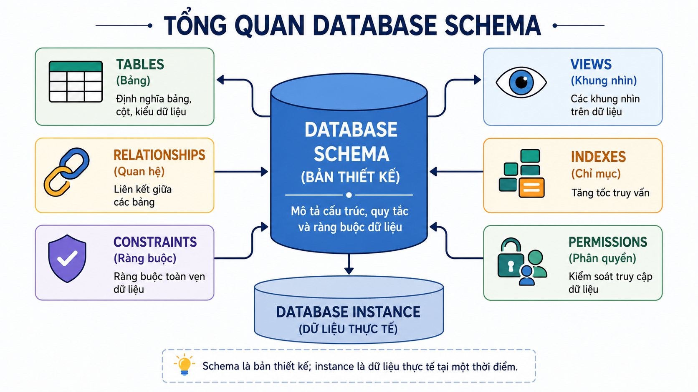

>  *Hình 1. Tổng quan Database Schema.*


### 2.1. Schema không phải dữ liệu thực tế

Schema là **bản thiết kế**; dữ liệu thực tế tại một thời điểm gọi là **database instance**.

| Thành phần | Ví dụ |
|---|---|
| Schema | `Students(student_id, full_name, major_id)` |
| Instance | `S001, Nguyen Van A, DS` |
| Schema | Cột `credits` có kiểu số nguyên |
| Instance | Môn “Cơ sở dữ liệu” có `credits = 3` |

---

## 3. Database Schema và Database Instance

| Tiêu chí | Database Schema | Database Instance |
|---|---|---|
| Bản chất | Cấu trúc hoặc quy tắc thiết kế | Trạng thái dữ liệu thực tế tại một thời điểm |
| Thay đổi | Tương đối ít | Thường xuyên khi insert, update hoặc delete |
| Ví dụ | Table definitions, constraints, views | Các rows hiện có trong tables |
| Người quan tâm | Designer, developer, DBA | Users, applications, analysts |
| Mục đích | Tổ chức và kiểm soát dữ liệu | Phục vụ nghiệp vụ và phân tích |

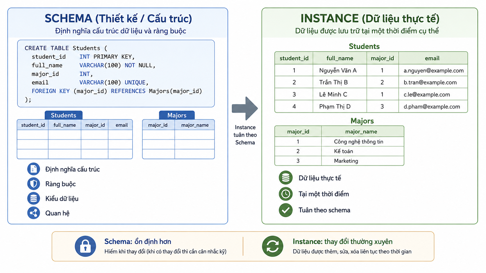
>*Hình 2. Schema và Database Instance.*


### Quiz – Schema và Instance

**Câu 1.** Một script định nghĩa bảng `Orders(order_id, customer_id, order_date, total_amount)` là:

A. Database instance.  
B. Database schema.  
C. Một bản backup.  
D. Một query result.

**Câu 2.** Khi một đơn hàng mới được thêm vào `Orders`, điều gì thay đổi trực tiếp nhất?

A. Database instance.  
B. Conceptual schema.  
C. Physical schema bắt buộc.  
D. Tên database.

**Câu 3.** Lý do nào giải thích đúng nhất vì sao schema thường ổn định hơn instance?

A. Schema không có bất kỳ liên hệ nào với dữ liệu.  
B. Instance không bao giờ thay đổi.  
C. Schema mô tả cấu trúc, còn instance phản ánh hoạt động dữ liệu hằng ngày.  
D. Schema chỉ tồn tại ở frontend.

---

# Phần A. Schema theo mức trừu tượng

## 4. Conceptual Schema

### 4.1. Mục đích

**Conceptual schema** mô tả dữ liệu ở mức nghiệp vụ và ý nghĩa chung của toàn hệ thống.

Nó tập trung vào:

```text
Entities
Attributes
Relationships
Business rules
Data requirements
```

Ví dụ trong hệ thống quản lý sinh viên:

```text
Student enrolls in Course
Lecturer teaches Course
Department manages Course
```

Conceptual schema thường được biểu diễn bằng ERD hoặc mô hình khái niệm tương đương.

### 4.2. Ưu điểm

- Dễ trao đổi với stakeholder nghiệp vụ.
- Ít phụ thuộc DBMS hay công nghệ cụ thể.
- Giúp phát hiện thiếu sót yêu cầu trước khi tạo tables.
- Là cầu nối giữa domain knowledge và thiết kế kỹ thuật.

### 4.3. Hạn chế

- Chưa đủ chi tiết để triển khai database.
- Không trả lời trực tiếp câu hỏi về data types, indexes, partitions hoặc SQL.
- Có thể mơ hồ nếu quy tắc nghiệp vụ chưa được làm rõ.

### 4.4. Khi nên bắt đầu từ conceptual schema?

```text
Yêu cầu nghiệp vụ còn chưa rõ.
Có nhiều stakeholder không chuyên kỹ thuật.
Hệ thống mới hoặc đang tái thiết kế.
Cần thống nhất ngôn ngữ nghiệp vụ trước khi triển khai.
```
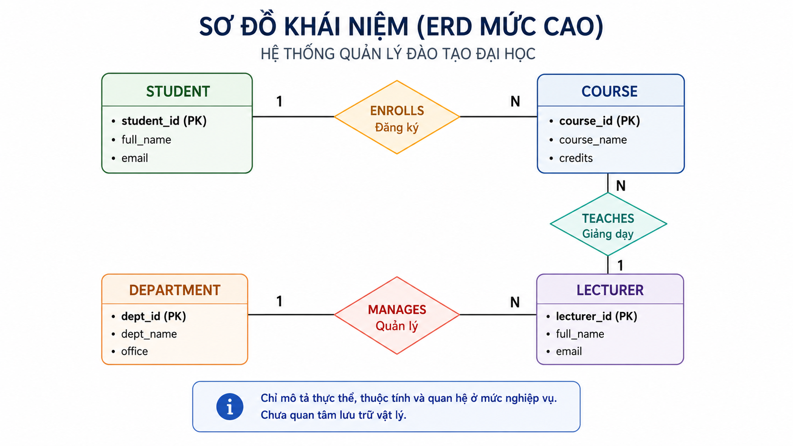
> *Hình 3. Conceptual Schema / ERD mức cao.*

---

## 5. Logical Schema

### 5.1. Mục đích

**Logical schema** chuyển mô hình khái niệm thành cấu trúc có thể triển khai trên một kiểu DBMS.

Trong relational DBMS, logical schema thường mô tả:

```text
Tables
Columns
Data types
Primary keys
Foreign keys
Unique constraints
Check constraints
Relationships
```

Ví dụ:

```text
Students(student_id PK, full_name, major_id FK)
Majors(major_id PK, major_name)
Courses(course_id PK, course_name, credits)
Enrollments(student_id FK, course_id FK, semester, grade)
```

### 5.2. Ưu điểm

- Cụ thể hơn conceptual schema.
- Giúp kiểm soát integrity và quan hệ dữ liệu.
- Là cơ sở để viết DDL, query và application logic.
- Dễ phát hiện dữ liệu bị thiếu, lặp hoặc mâu thuẫn.

### 5.3. Hạn chế

- Gắn nhiều hơn với data model đã chọn, ví dụ relational model.
- Schema quá chuẩn hóa có thể làm các báo cáo đọc dữ liệu phải join nhiều tables.
- Thay đổi logic có thể ảnh hưởng applications nếu không có compatibility layer.

### 5.4. Khi nên dùng logical schema?

```text
Đã xác định data model phù hợp.
Cần triển khai database thực tế.
Cần định nghĩa rules, keys và relationships.
Cần cho developer, DBA và analyst làm việc trên cùng cấu trúc rõ ràng.
```
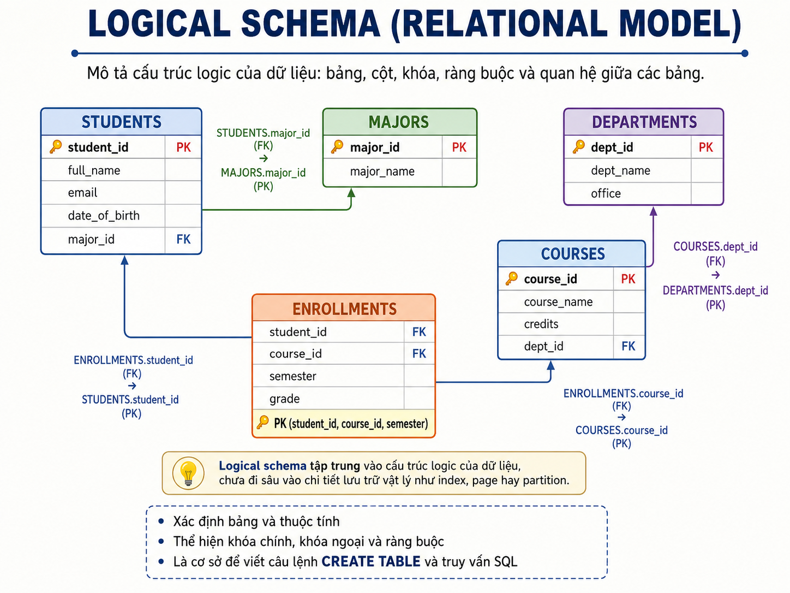
---

## 6. Physical Schema

### 6.1. Mục đích

**Physical schema** mô tả cách DBMS lưu trữ và truy cập dữ liệu thực tế.

Nó có thể gồm:

```text
Indexes
Partitions
Storage engine
File organization
Pages/blocks
Compression
Replication
Access paths
```

### 6.2. Ưu điểm

- Cải thiện hiệu năng cho workload cụ thể.
- Hỗ trợ mở rộng dữ liệu lớn.
- Giúp quản lý storage, backup và recovery.
- Có thể tối ưu truy vấn mà không đổi logical schema.

### 6.3. Hạn chế

- Phụ thuộc DBMS và hạ tầng.
- Tối ưu sai có thể làm write chậm, tăng storage hoặc tăng chi phí vận hành.
- Cần đo workload và theo dõi hiệu năng, không nên dựa vào cảm tính.

### 6.4. Khi điều chỉnh physical schema?

```text
Data volume tăng đáng kể.
Có query chậm lặp lại.
Có workload đọc/ghi thay đổi.
Cần archive hoặc partition dữ liệu theo thời gian.
Cần tăng khả năng phục hồi hoặc availability.
```
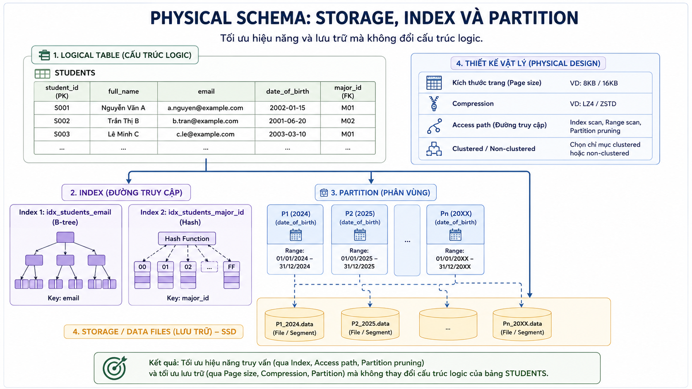
> *Hình 4. Physical Schema: Storage, Index và Partition.*


---

## 7. View / External Schema

### 7.1. Mục đích

**View schema** hoặc **external schema** mô tả phần dữ liệu được hiển thị cho một nhóm người dùng hoặc một ứng dụng.

Ví dụ:

| Vai trò | Phần dữ liệu cần thấy |
|---|---|
| Sinh viên | Hồ sơ cá nhân, lịch học, điểm cá nhân |
| Giảng viên | Danh sách lớp, điểm lớp phụ trách |
| Phòng đào tạo | Dữ liệu học vụ rộng hơn |
| Phòng tài chính | Học phí và thanh toán |
| Quản trị viên | Metadata, accounts, permissions, monitoring |

### 7.2. Ưu điểm

- Đơn giản hóa thông tin cho từng vai trò.
- Hỗ trợ least privilege và giảm lộ dữ liệu không cần thiết.
- Giúp giữ interface ổn định khi logical schema thay đổi.
- Hữu ích cho reports, dashboards, APIs và exports.

### 7.3. Hạn chế

- Quá nhiều views có thể khó quản lý.
- View phức tạp có thể tạo vấn đề hiệu năng.
- View không thay thế toàn bộ access-control policy.
- Cần quản lý dependency khi base tables thay đổi.

### 7.4. Khi dùng view schema?

```text
Các nhóm người dùng cần các góc nhìn dữ liệu khác nhau.
Cần che giấu cột nhạy cảm.
Cần tạo báo cáo hoặc API có cấu trúc ổn định.
Cần giảm ảnh hưởng của thay đổi logical schema tới consumers cũ.
```

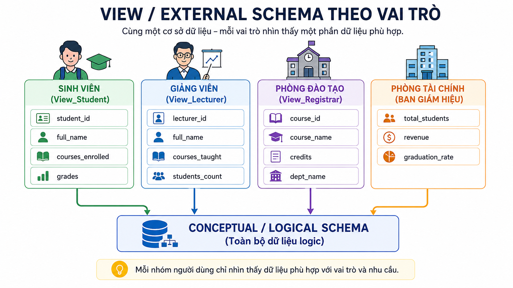
> *Hình 5. View / External Schema theo vai trò.*


---

## 8. So sánh bốn mức schema

| Mức schema | Câu hỏi chính | Mục tiêu chính | Người dùng chính | Rủi ro nếu thiết kế kém |
|---|---|---|---|---|
| Conceptual | Hệ thống cần lưu gì? | Hiểu nghiệp vụ và dữ liệu | Stakeholders, analysts, designers | Thiếu hoặc hiểu sai yêu cầu |
| Logical | Dữ liệu được cấu trúc logic ra sao? | Integrity và tổ chức dữ liệu | Designers, developers, DBA | Dư thừa, quan hệ sai, logic khó mở rộng |
| Physical | Dữ liệu được lưu/truy cập thế nào? | Hiệu năng và storage | DBA, engineers | Query chậm, chi phí cao, khó scale |
| View/External | Ai được thấy dữ liệu nào? | Usability và access scope | Users, applications, analysts | Lộ dữ liệu, interface khó dùng, dependency phức tạp |

---

# Phần B. Mô hình schema và lý do lựa chọn

## 9. Các mô hình schema phổ biến

Các mô hình sau không phải luôn cạnh tranh trực tiếp. Chúng phục vụ các dạng dữ liệu và workload khác nhau:

```text
Flat model
Hierarchical model
Network/graph-oriented model
Relational model
Star schema
Snowflake schema
```

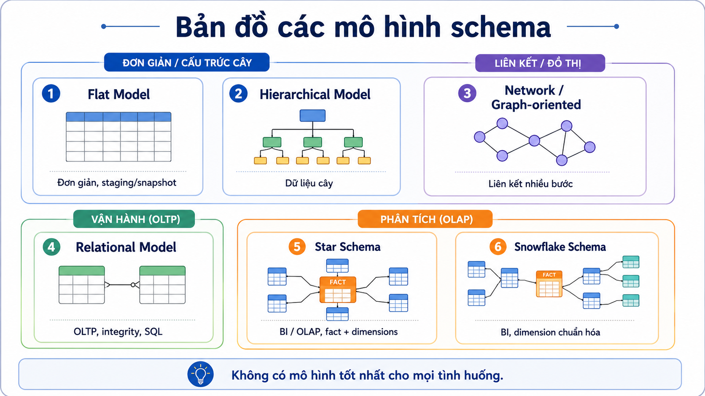
>  *Hình 6. Bản đồ các mô hình schema.*


---

## 10. Flat Model

### 10.1. Đặc điểm

Flat model lưu dữ liệu trong một bảng phẳng hoặc file tabular.

Ví dụ:

```text
StudentID | FullName | Major | AdvisorName | AdvisorEmail
S001      | An       | IS    | Nguyen A    | a@example.edu
```

### 10.2. Ưu điểm

- Dễ hiểu và triển khai nhanh.
- Hợp với danh sách nhỏ, import/export CSV hoặc dữ liệu tạm.
- Ít cần join.
- Phù hợp cho prototype hoặc reporting snapshot đơn giản.

### 10.3. Hạn chế

- Dễ lặp dữ liệu.
- Dễ phát sinh inconsistency khi cùng thông tin được sửa ở nhiều rows.
- Khó biểu diễn many-to-many hoặc dữ liệu có quan hệ phức tạp.
- Khó kiểm soát integrity khi dữ liệu lớn lên.

### 10.4. Khi nên chọn?

```text
Dữ liệu nhỏ.
Quan hệ dữ liệu đơn giản.
Mục đích chính là import/export, staging hoặc snapshot.
Không cần cập nhật nhiều và không cần quản lý quan hệ phức tạp.
```

**Không nên chọn** làm schema vận hành chính khi hệ thống có nhiều thực thể, thay đổi thường xuyên hoặc nhiều quan hệ.

---

## 11. Hierarchical Model

### 11.1. Đặc điểm

Hierarchical model tổ chức dữ liệu theo cây cha–con. Mỗi node con thường có một parent chính.

Ví dụ:

```text
University
├── Faculty
│   ├── Department
│   │   ├── Lecturer
│   │   └── Course
```

### 11.2. Ưu điểm

- Tự nhiên cho dữ liệu có hierarchy cố định.
- Dễ điều hướng theo đường dẫn cha–con.
- Có thể hiệu quả cho các truy vấn dạng subtree.
- Phù hợp với menu, taxonomy, organizational chart hoặc category tree.

### 11.3. Hạn chế

- Không tự nhiên cho many-to-many.
- Khó khi một node cần nhiều parent.
- Thay đổi cấu trúc cây có thể phức tạp.
- Có thể tạo duplication hoặc logic đặc biệt để biểu diễn liên kết chéo.

### 11.4. Khi nên chọn?

```text
Quan hệ chủ yếu là one-to-many.
Cấu trúc có root và hierarchy ổn định.
Truy vấn thường đi từ parent xuống children hoặc ngược lại.
Quan hệ chéo ít quan trọng.
```

---

## 12. Network / Graph-oriented Model

### 12.1. Đặc điểm

Network/graph-oriented model biểu diễn nodes và các liên kết phức tạp. Một node có thể có nhiều parent và nhiều child.

### 12.2. Ưu điểm

- Biểu diễn many-to-many tự nhiên hơn hierarchical model.
- Phù hợp với dữ liệu có nhiều mối liên kết.
- Hỗ trợ các truy vấn traversal nhiều bước.
- Hữu ích khi relationships quan trọng hơn attributes đơn lẻ.

### 12.3. Hạn chế

- Khó hiểu và khó bảo trì nếu link structure phức tạp.
- Coupling cao với cách điều hướng dữ liệu.
- Không phải lựa chọn mặc định cho CRUD business applications.
- Cần cân nhắc graph database hiện đại nếu traversal là workload trung tâm.

### 12.4. Khi nên chọn?

```text
Mối quan hệ là dữ liệu trung tâm.
Có truy vấn nhiều bước theo liên kết.
Ví dụ: recommendation, fraud detection, knowledge graph, social network.
```

---

## 13. Relational Model

### 13.1. Đặc điểm

Relational model tổ chức dữ liệu thành tables có rows và columns, liên kết qua keys và constraints.

### 13.2. Ưu điểm

- Mô hình hóa rõ ràng, trưởng thành và phổ biến.
- Hỗ trợ transactions và integrity constraints tốt.
- SQL mạnh cho CRUD, reporting và joins.
- Hệ sinh thái tooling, backup, security và administration phong phú.
- Phù hợp nhiều hệ thống nghiệp vụ có dữ liệu có cấu trúc.

### 13.3. Hạn chế

- Schema rigidity có thể làm thay đổi cấu trúc cần migration cẩn thận.
- Join nhiều bảng lớn có thể cần thiết kế và indexing tốt.
- Không phải lựa chọn tự nhiên nhất cho graph traversal sâu hoặc document rất biến đổi.
- Scale-out có thể phức tạp hơn trong một số workload cực lớn.

### 13.4. Khi nên chọn?

Relational model thường là lựa chọn khởi đầu hợp lý khi:

```text
Cần giao dịch chính xác.
Có nhiều quy tắc và quan hệ dữ liệu.
Cần báo cáo, joins và SQL.
Cần audit, quyền truy cập và dữ liệu nhất quán.
Hệ thống là ERP, banking, order management, education hoặc HR.
```
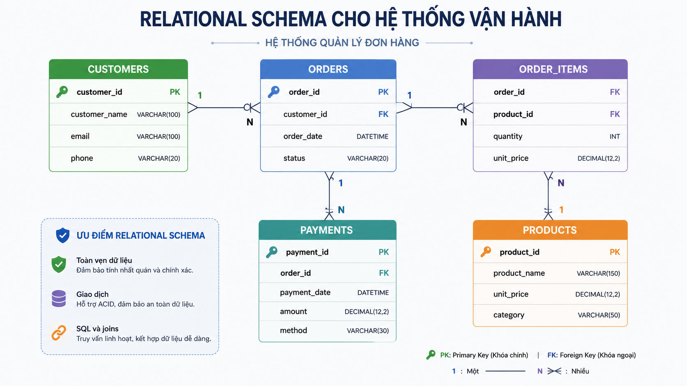
>*Hình 7. Relational Schema cho hệ thống vận hành.*

---

## 14. Star Schema

### 14.1. Đặc điểm

Star schema dùng trong analytics/data warehouse:

```text
Fact table ở trung tâm
Dimension tables kết nối trực tiếp xung quanh
```

Ví dụ:

```text
             DimDate
                |
DimProduct — FactSales — DimCustomer
                |
             DimStore
```

### 14.2. Ưu điểm

- Dễ hiểu với analyst và BI tools.
- Query aggregate thường đơn giản.
- Ít join hơn snowflake schema.
- Phù hợp dashboard, OLAP và báo cáo theo dimensions.
- Dimension denormalized có thể giúp đọc nhanh hơn.

### 14.3. Hạn chế

- Dimension có thể bị lặp dữ liệu.
- Không nên dùng trực tiếp làm schema vận hành cho CRUD transactions.
- Cần ETL/ELT và governance để fact/dimension nhất quán.
- Nếu dimension rất lớn hoặc thay đổi phức tạp, cần thiết kế kỹ.

### 14.4. Khi nên chọn?

```text
Mục tiêu chính là phân tích và reporting.
Queries chủ yếu aggregate theo thời gian, sản phẩm, khách hàng, khu vực.
Người dùng cần hiểu mô hình nhanh.
Ưu tiên tốc độ đọc/dashboard hơn tối ưu hóa cập nhật transactional.
```

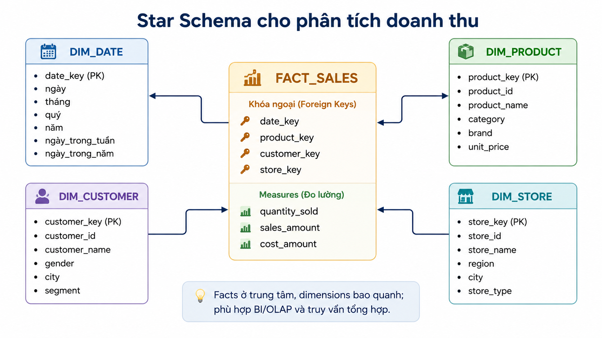

>*Hình 8. Star Schema cho phân tích doanh thu.*

---

## 15. Snowflake Schema

### 15.1. Đặc điểm

Snowflake schema cũng có fact table ở trung tâm nhưng chuẩn hóa dimensions thành nhiều bảng liên quan.

Ví dụ:

```text
FactSales
  ├── DimProduct
  │      ├── DimCategory
  │      └── DimBrand
  ├── DimCustomer
  └── DimDate
```

### 15.2. Ưu điểm

- Giảm redundancy trong dimensions.
- Giúp quản trị các hierarchy dùng chung rõ hơn.
- Hữu ích khi dimension lớn, có nhiều cấp hoặc được tái sử dụng.
- Có thể hỗ trợ data governance tốt hơn cho master data.

### 15.3. Hạn chế

- Nhiều joins hơn star schema.
- Khó hiểu hơn với người mới và analyst.
- BI query có thể phức tạp hơn.
- Tối ưu hiệu năng cần cẩn thận nếu dashboard dày đặc.

### 15.4. Khi nên chọn?

```text
Dimensions có hierarchy phức tạp hoặc dùng chung.
Cần giảm redundancy ở dimensions.
Có yêu cầu governance/master-data rõ.
Team có năng lực quản lý mô hình nhiều tables hơn.
Tăng số joins là trade-off chấp nhận được.
```

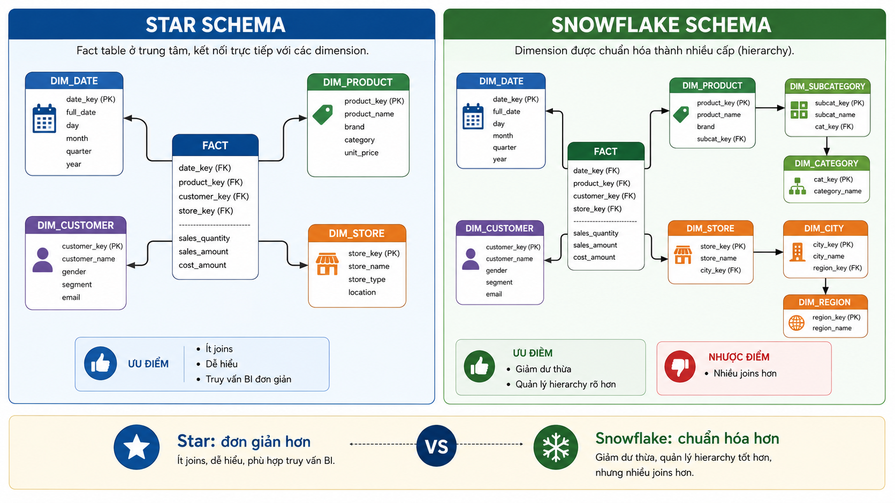

> *Hình 9. So sánh Star Schema và Snowflake Schema.*


---

## 16. Bảng so sánh và chọn schema

| Mô hình | Điểm mạnh | Hạn chế chính | Chọn khi | Không nên chọn khi |
|---|---|---|---|---|
| Flat | Đơn giản, nhanh, ít join | Dễ lặp và sai lệch dữ liệu | Dữ liệu nhỏ, staging, snapshot | Nghiệp vụ nhiều quan hệ/cập nhật |
| Hierarchical | Tự nhiên cho tree | Khó many-to-many | Taxonomy, menu, org chart | Quan hệ chéo phức tạp |
| Network/graph-oriented | Mạnh cho liên kết nhiều bước | Khó quản lý nếu graph phức tạp | Social, fraud, recommendation | CRUD/reporting thông thường |
| Relational | Integrity, transactions, SQL, ecosystem | Migration/join/scale cần thiết kế kỹ | OLTP, nghiệp vụ, reporting có cấu trúc | Graph traversal sâu hoặc schema rất biến đổi |
| Star | Dễ BI/OLAP, đọc aggregate tốt | Redundancy dimension, không phải OLTP model | Warehouse, dashboards | Ghi transaction thường xuyên |
| Snowflake | Giảm redundancy, hierarchy rõ | Nhiều joins, phức tạp hơn | Warehouse với dimensions phức tạp | Dashboard đơn giản cần ít joins |

---

## 17. Khung ra quyết định: tại sao chọn schema này?

Không nên chọn schema chỉ vì “đây là mô hình phổ biến”. Hãy trả lời theo thứ tự.

### 17.1. Workload chính là gì?

```text
OLTP: nhiều insert/update, cần transactions và integrity
OLAP: nhiều aggregate, scan lịch sử, dashboard
Graph traversal: đi theo nhiều tầng quan hệ
Staging/import: xử lý file hoặc dữ liệu tạm
```

### 17.2. Dữ liệu có cấu trúc và quan hệ ra sao?

```text
Mostly tabular, có rules rõ → relational
Tree rõ, parent-child ổn định → hierarchical
Relationships là trung tâm → graph/network-oriented
Facts + dimensions cho analytics → star/snowflake
```

### 17.3. Query pattern nào quan trọng?

```text
Nhiều joins + transactions → relational
Aggregate theo dimensions → star
Dimension hierarchy sâu + governance → snowflake
Traversal nhiều bước → graph-oriented
```

### 17.4. Trade-off nào chấp nhận được?

| Ưu tiên | Hướng lựa chọn thường gặp |
|---|---|
| Data integrity và transactions | Relational |
| Dễ hiểu cho BI users | Star |
| Giảm redundancy dimension | Snowflake |
| Điều hướng parent-child | Hierarchical |
| Phân tích liên kết sâu | Network/graph |
| Đơn giản cho file tạm | Flat |

### 17.5. Câu hỏi kiểm tra cuối

1. Schema có hỗ trợ các query quan trọng nhất không?
2. Schema có kiểm soát được dữ liệu sai hoặc mâu thuẫn không?
3. Team có đủ năng lực vận hành schema này không?
4. Việc mở rộng 12–24 tháng tới có làm schema khó quản lý không?
5. Có cần tách OLTP schema khỏi analytics schema không?

> Một hệ thống lớn thường dùng **nhiều schema cho nhiều mục đích**: relational schema cho vận hành và star/snowflake schema cho warehouse/analytics.

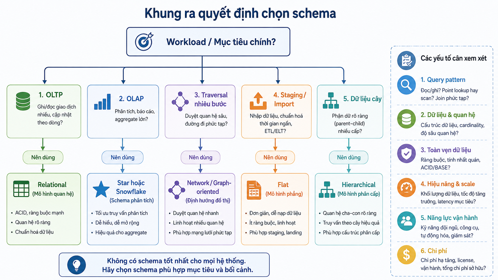
> *Hình 10. Khung ra quyết định chọn schema.*


---

## 18. Ví dụ quyết định schema

### 18.1. Hệ thống đăng ký học phần

**Yêu cầu:**

```text
Đăng ký, hủy đăng ký, cập nhật điểm
Nhiều quy tắc dữ liệu
Cần lịch sử và báo cáo học vụ
Cần phân quyền rõ
```

**Lựa chọn chính:** relational schema.

**Lý do:**

```text
Cần integrity, transactions, keys, constraints và joins.
Nghiệp vụ có nhiều relationships rõ ràng.
Cần kiểm soát quyền và audit.
```

**Bổ sung hợp lý:** star schema ở data warehouse nếu cần dashboard phân tích kết quả theo thời gian, khoa hoặc môn học.

### 18.2. Dashboard doanh thu bán lẻ

**Yêu cầu:**

```text
Xem doanh thu theo ngày, sản phẩm, chi nhánh, khách hàng
Các queries chủ yếu là aggregate và historical trends
Ít cập nhật trực tiếp từng giao dịch trong dashboard
```

**Lựa chọn chính:** star schema.

**Lý do:**

```text
FactSales chứa measures như quantity, revenue, discount.
Dimensions giúp slice/dice theo date, product, customer, store.
Mô hình dễ hiểu cho BI và thường phù hợp với query aggregate.
```

### 18.3. Cây danh mục sản phẩm

**Yêu cầu:**

```text
Danh mục có cấp cha-con rõ.
Người dùng thường duyệt từ category cha xuống category con.
Quan hệ chéo ít.
```

**Lựa chọn chính:** hierarchical representation.

**Lý do:**

```text
Cấu trúc tree phản ánh trực tiếp nghiệp vụ.
Các truy vấn subtree thường tự nhiên.
Không cần mô hình graph phức tạp nếu category chỉ có một parent.
```

### 18.4. Hệ thống gợi ý kết nối

**Yêu cầu:**

```text
Phân tích bạn của bạn, liên kết nhiều bước.
Tìm cộng đồng, đường đi, mức độ liên quan.
Relationships quan trọng hơn attributes đơn lẻ.
```

**Lựa chọn chính:** graph/network-oriented model.

**Lý do:**

```text
Traversal quan hệ nhiều bước là query trung tâm.
Biểu diễn nodes và edges tự nhiên hơn joins dài.
```

---

## 19. Quiz tổng hợp

**Câu 19.1.** Một hệ thống cần xử lý đơn hàng, thanh toán, tồn kho và nhiều quy tắc nghiệp vụ. Schema nào là lựa chọn khởi đầu hợp lý nhất?

A. Flat model duy nhất.  
B. Relational schema.  
C. Star schema làm database vận hành chính.  
D. Hierarchical model bắt buộc.

**Câu 19.2.** Một dashboard yêu cầu phân tích doanh thu theo thời gian, sản phẩm, chi nhánh và khách hàng. Lý do chính chọn star schema là:

A. Fact và dimension hỗ trợ phân tích aggregate theo nhiều góc nhìn, thường dễ dùng với BI.  
B. Star schema luôn loại bỏ mọi redundancy.  
C. Star schema phù hợp nhất cho giao dịch cập nhật từng row liên tục.  
D. Star schema không cần ETL/ELT.

**Câu 19.3.** Khi dimension `Product` có hierarchy Category → Subcategory → Brand rất lớn và dùng chung trong nhiều báo cáo, trade-off nào có thể khiến snowflake schema phù hợp?

A. Ít tables hơn và không cần join.  
B. Giảm redundancy và quản lý hierarchy rõ hơn, đổi lại query có thể cần nhiều joins hơn.  
C. Không cần conceptual schema.  
D. Không cần metadata hoặc governance.

**Câu 19.4.** Một hệ thống chỉ lưu một danh sách nhỏ để import mỗi tuần, không có quan hệ phức tạp và không cần cập nhật thường xuyên. Lựa chọn nào có thể phù hợp?

A. Graph model bắt buộc.  
B. Snowflake schema.  
C. Flat model hoặc staging table đơn giản.  
D. Mạng lưới nhiều parent-child.

**Câu 19.5.** Một team muốn dùng relational schema cho hệ thống social recommendation có truy vấn “bạn của bạn của bạn” rất sâu. Nhận định cân bằng nhất là:

A. Relational schema không bao giờ dùng được.  
B. Relational có thể làm được trong một số trường hợp, nhưng cần đánh giá query pattern; graph-oriented model có thể tự nhiên hơn nếu traversal sâu là workload cốt lõi.  
C. Star schema luôn thay thế graph model.  
D. Flat model là tối ưu cho mọi traversal.

---

## 20. Bài tập vận dụng

### Bài 20.1. Chọn schema theo tình huống

Với mỗi tình huống, chọn một mô hình schema phù hợp nhất và nêu ít nhất hai lý do:

1. Hệ thống quản lý lương và hợp đồng lao động.
2. Dashboard phân tích doanh thu theo tháng và vùng.
3. Cây danh mục thư viện số.
4. Hệ thống phát hiện gian lận dựa trên mạng giao dịch liên kết.
5. File staging nhận dữ liệu CSV hằng ngày.

### Bài 20.2. Star hay Snowflake?

Một data warehouse bán lẻ có các dimensions:

```text
Product → Brand → Category
Store → District → Province
Customer → Segment
Date → Month → Quarter → Year
```

Hãy trả lời:

1. Khi nào nên dùng star schema?
2. Khi nào snowflake schema có thể phù hợp hơn?
3. Tác động của nhiều joins lên BI query là gì?
4. Có thể dùng star cho một số dimensions và snowflake cho dimensions khác không? Giải thích.

### Bài 20.3. Phân tích schema không phù hợp

Một công ty lưu đơn hàng, khách hàng và sản phẩm trong một flat table duy nhất. Hãy nêu:

1. Ba rủi ro về redundancy/inconsistency.
2. Hai truy vấn hoặc cập nhật có thể trở nên khó khăn.
3. Khi nào bảng phẳng vẫn có thể chấp nhận được?
4. Cách chuyển dần sang relational schema mà giảm rủi ro gián đoạn.

---

## 21. Tóm tắt

- Database schema là bản thiết kế cấu trúc, quan hệ và quy tắc dữ liệu.
- Database instance là dữ liệu thực tế ở một thời điểm.
- Conceptual, logical, physical và view schema là các mức mô tả khác nhau của cùng một hệ thống.
- Flat, hierarchical, network, relational, star và snowflake là các mô hình phục vụ những data/workload khác nhau.
- Relational schema phù hợp mạnh với OLTP, integrity, transactions và dữ liệu nghiệp vụ có cấu trúc.
- Star schema phù hợp cho analytics/BI với fact và dimensions.
- Snowflake schema giảm redundancy của dimensions nhưng tăng joins và độ phức tạp.
- Không có schema tốt nhất cho mọi tình huống; lựa chọn phải dựa trên workload, query pattern, integrity, scale, governance và năng lực vận hành.
- Hệ thống lớn thường dùng nhiều schema: operational schema cho OLTP và analytic schema cho BI/warehouse.

## 22. Từ khóa chính

- Database Schema
- Database Instance
- Conceptual Schema
- Logical Schema
- Physical Schema
- View Schema
- Flat Model
- Hierarchical Model
- Network Model
- Relational Model
- Star Schema
- Snowflake Schema
- Fact Table
- Dimension Table
- OLTP
- OLAP
- Data Warehouse
- Schema Evolution
- Data Integrity
- Workload
- Query Pattern

---

# Đáp án quiz

## Đáp án – Schema và Instance

| Câu | Đáp án | Giải thích |
|---:|:---:|---|
| 3.1 | B | Lệnh định nghĩa table là schema, không phải dữ liệu hiện tại. |
| 3.2 | A | Thêm đơn hàng làm thay đổi instance. |
| 3.3 | C | Schema là cấu trúc, còn instance thay đổi theo hoạt động nghiệp vụ. |

## Đáp án – Quiz tổng hợp

| Câu | Đáp án | Giải thích |
|---:|:---:|---|
| 19.1 | B | Hệ thống nghiệp vụ có transactions, rules và relationships thường bắt đầu hợp lý với relational schema. |
| 19.2 | A | Star schema được tối ưu theo hướng phân tích facts qua nhiều dimensions. |
| 19.3 | B | Snowflake giảm redundancy/hỗ trợ hierarchy, đổi lại thường nhiều joins hơn. |
| 19.4 | C | Dữ liệu nhỏ, tạm và đơn giản có thể dùng flat/staging model. |
| 19.5 | B | Cần đánh giá workload; graph model có thể tự nhiên hơn cho traversal sâu. |
