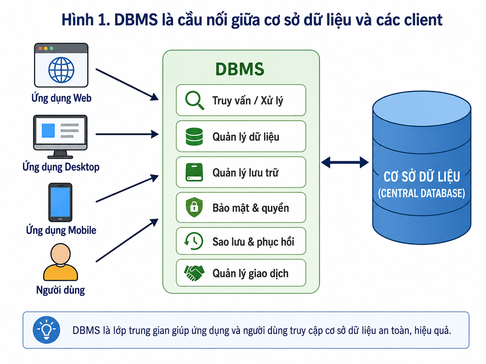
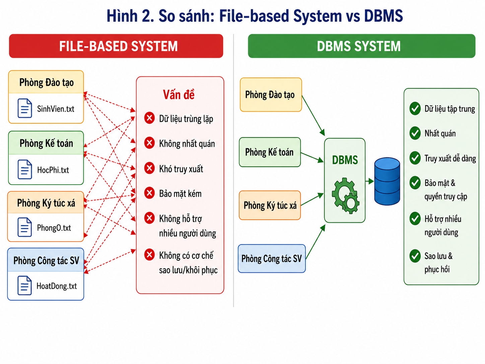
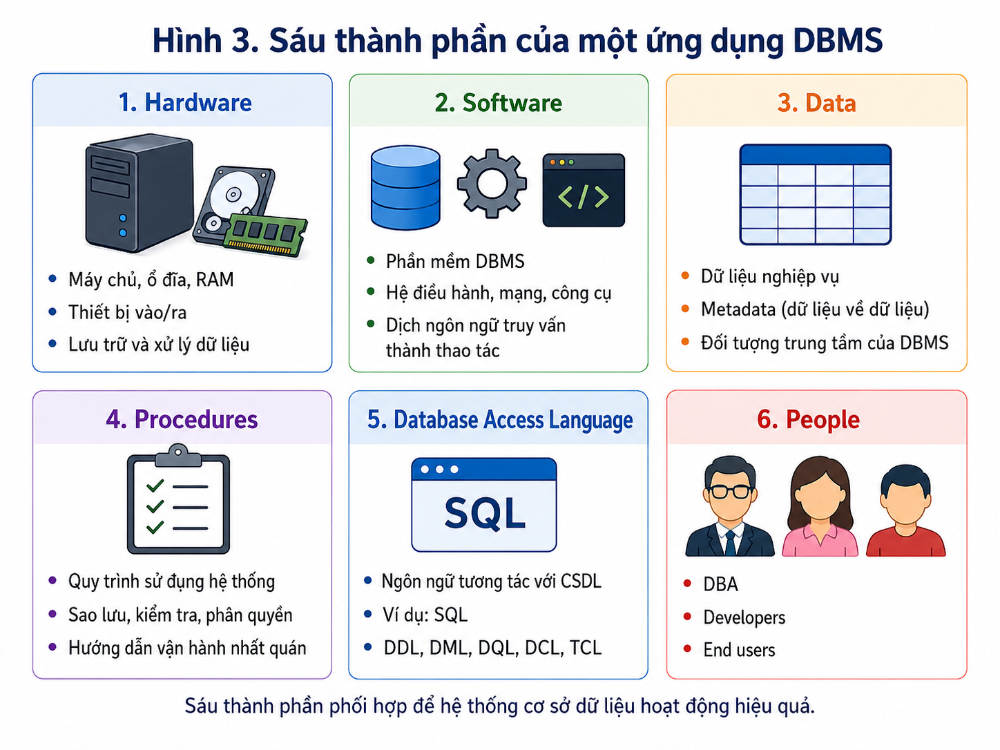
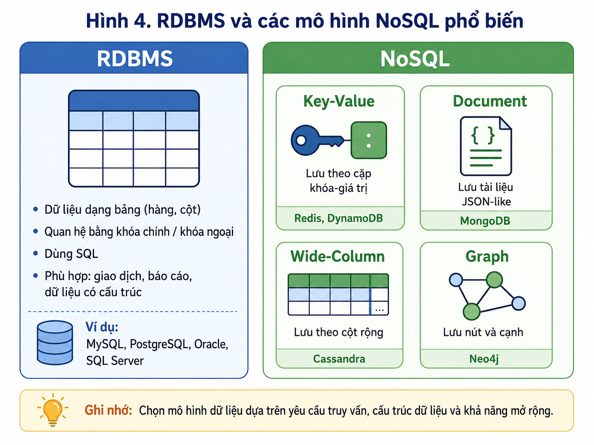
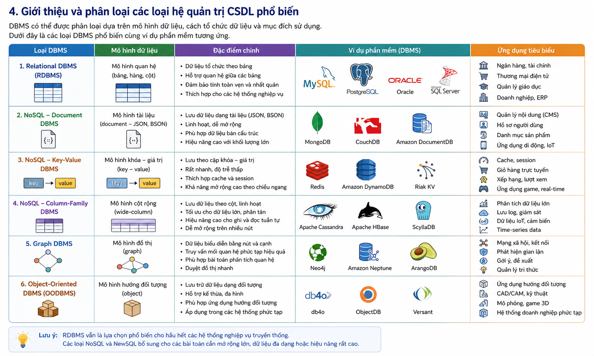
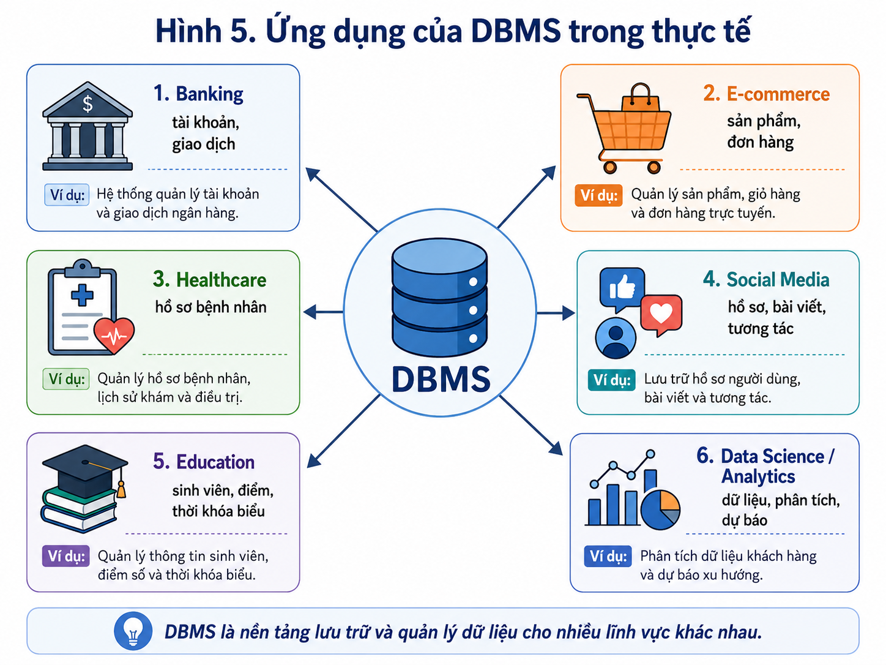

# Bài giảng: Introduction to DBMS – Hệ quản trị cơ sở dữ liệu

## Tài liệu tham khảo

- [GeeksforGeeks – Introduction of DBMS](https://www.geeksforgeeks.org/dbms/introduction-of-dbms-database-management-system-set-1/)
- [MySQL Reference Manual – Introduction](https://dev.mysql.com/doc/refman/8.4/en/introduction.html)

> Đây là **bài giới thiệu DBMS**. Bài không đi sâu vào thiết kế table, primary key, foreign key, ERD, chuẩn hóa, SQL syntax, transaction implementation hay index. Các nội dung này được học ở các bài tiếp theo.
>
> Đây là một bài giảng nhập môn duy nhất cho phần Introduction to DBMS.

---

## 1. Mục tiêu học tập

Sau khi hoàn thành bài này, sinh viên có thể:

1. Mô tả database và DBMS bằng ngôn ngữ của mình.
2. Giải thích DBMS là lớp trung gian giữa người dùng/ứng dụng và dữ liệu.
3. Phân tích các hạn chế của hệ thống lưu dữ liệu bằng file rời rạc.
4. Nhận diện sáu thành phần của một ứng dụng dựa trên DBMS.
5. Phân biệt ở mức khái quát các loại DBMS phổ biến.
6. Biết các nhóm thao tác dữ liệu cơ bản: định nghĩa dữ liệu, cập nhật dữ liệu, truy vấn, kiểm soát quyền và transaction.
7. Liên hệ DBMS với các lĩnh vực như ngân hàng, thương mại điện tử, giáo dục, y tế và phân tích dữ liệu.
8. Chuẩn bị kiến thức nền cho các bài học sau về mô hình dữ liệu và SQL.

---

## 2. Khởi động: dữ liệu đang ở đâu?

Mỗi ngày, chúng ta tương tác với nhiều hệ thống có lưu trữ dữ liệu:

```text
Đăng nhập hệ thống học tập
-> kiểm tra tài khoản và quyền sử dụng.

Đăng ký học phần
-> tra cứu thông tin sinh viên, lớp học phần và tình trạng đăng ký.

Mua hàng trực tuyến
-> xem sản phẩm, giỏ hàng, đơn hàng và thanh toán.

Chuyển tiền
-> kiểm tra thông tin tài khoản và ghi nhận giao dịch.

Đặt lịch khám
-> tra cứu bệnh nhân, bác sĩ, lịch hẹn và hồ sơ khám.
```

Các hệ thống này cần nhiều hơn việc “lưu một file”:

- Lưu dữ liệu có tổ chức.
- Cho nhiều người sử dụng cùng lúc.
- Kiểm soát ai được xem hoặc thay đổi thông tin.
- Giữ dữ liệu đúng và nhất quán.
- Hỗ trợ khôi phục khi xảy ra lỗi.
- Tìm kiếm thông tin nhanh khi dữ liệu tăng lên.

Đó là lý do DBMS xuất hiện.

### Quiz

**Câu 2.1.** Một hệ thống học tập cần đồng thời cho sinh viên xem lịch, giảng viên cập nhật lớp học và phòng đào tạo quản lý danh sách. Nhu cầu nào thể hiện rõ nhất vai trò của DBMS?

A. Hỗ trợ nhiều người sử dụng cùng truy cập dữ liệu theo các quyền khác nhau.  
B. Chỉ tăng số lượng file lưu trữ.  
C. Chỉ thay đổi giao diện website.  
D. Chỉ chuyển dữ liệu sang định dạng PDF.

**Câu 2.2.** Nếu máy chủ gặp sự cố giữa lúc ghi nhận thanh toán, yêu cầu nào của hệ thống dữ liệu trở nên quan trọng nhất?

A. Tăng số màu trong giao diện.  
B. Có khả năng khôi phục dữ liệu về trạng thái phù hợp.  
C. In thêm báo cáo giấy.  
D. Tạo thêm file Excel.

**Câu 2.3.** Điều nào dưới đây **không** phải lý do chính để một tổ chức dùng DBMS?

A. Quản lý truy cập dữ liệu.  
B. Hỗ trợ tìm kiếm và cập nhật dữ liệu.  
C. Giảm rủi ro dữ liệu thiếu nhất quán.  
D. Loại bỏ hoàn toàn nhu cầu có ứng dụng hoặc người vận hành.


---

## 3. Database, DBMS và RDBMS

### 3.1. Database là gì?

**Database** hay **cơ sở dữ liệu** là tập dữ liệu có tổ chức, được lưu trữ để có thể tìm kiếm, cập nhật và quản lý.

Ví dụ trong hệ thống quản lý sinh viên, database có thể lưu:

```text
Thông tin sinh viên
Thông tin môn học
Thông tin lớp học phần
Thông tin lịch học
Thông tin đăng ký
Thông tin điểm
Thông tin học phí
```

Database không chỉ là một file đơn lẻ. Nó là một tập dữ liệu được tổ chức theo quy tắc và được DBMS quản lý.

### 3.2. DBMS là gì?

**DBMS – Database Management System** là phần mềm hỗ trợ tạo, lưu trữ, truy vấn, cập nhật, bảo vệ và quản lý database.

Ví dụ:

```text
MySQL
PostgreSQL
Oracle Database
Microsoft SQL Server
SQLite
MongoDB
Redis
Cassandra
```

DBMS đóng vai trò cầu nối:

```text
Người dùng / Ứng dụng
        |
        v
      DBMS
        |
        v
    Database / Storage
```



### 3.3. DBMS làm gì?

| Năng lực | Ý nghĩa khái quát |
|---|---|
| Lưu trữ dữ liệu | Tổ chức dữ liệu để có thể sử dụng lâu dài |
| Cập nhật dữ liệu | Thêm, sửa hoặc xóa thông tin khi nghiệp vụ thay đổi |
| Truy vấn dữ liệu | Tìm kiếm, lọc, tổng hợp và báo cáo |
| Quản lý đồng thời | Điều phối nhiều người/ứng dụng cùng truy cập |
| Bảo mật | Quản lý tài khoản, vai trò và quyền |
| Khôi phục | Hỗ trợ backup, recovery và vận hành khi xảy ra sự cố |
| Quản lý metadata | Lưu thông tin mô tả cấu trúc và đối tượng dữ liệu |
| Hỗ trợ hiệu năng | Tối ưu cách truy cập dữ liệu khi quy mô tăng |

### 3.4. RDBMS là gì?

**RDBMS – Relational Database Management System** là một nhóm DBMS tổ chức dữ liệu chủ yếu theo các bảng có hàng và cột.

Ví dụ RDBMS:

```text
MySQL
PostgreSQL
Oracle Database
Microsoft SQL Server
SQLite
```

RDBMS phù hợp với nhiều hệ thống nghiệp vụ có dữ liệu rõ ràng và cần báo cáo, quản lý giao dịch hoặc kiểm soát dữ liệu chặt chẽ.

### 3.5. Phân biệt nhanh

| Khái niệm | Là gì? | Ví dụ |
|---|---|---|
| Data | Thông tin được lưu và sử dụng | Tên sinh viên, đơn hàng, điểm |
| Database | Tập dữ liệu có tổ chức | `university_db` |
| DBMS | Phần mềm quản lý database | MySQL |
| RDBMS | DBMS theo mô hình bảng/quan hệ | PostgreSQL, MySQL |
| Application | Phần mềm người dùng tương tác | Cổng thông tin sinh viên |
| DB server | Máy/chương trình chạy DBMS | MySQL Server |

### Quiz

**Câu 3.1.** Phát biểu nào phân biệt đúng database và DBMS?

A. Database là phần mềm; DBMS là tập dữ liệu.  
B. Database là tập dữ liệu có tổ chức; DBMS là phần mềm quản lý tập dữ liệu đó.  
C. Database và DBMS luôn là hai tên của cùng một thứ.  
D. DBMS chỉ là một loại ổ cứng.

**Câu 3.2.** Một trường dùng MySQL để quản lý dữ liệu học tập. Trong mô tả này, MySQL là gì?

A. Một application portal cho sinh viên.  
B. Một database duy nhất chứa dữ liệu.  
C. Một DBMS.  
D. Một bản sao lưu dữ liệu.

**Câu 3.3.** Vai trò phù hợp nhất của DBMS trong sơ đồ ứng dụng là gì?

A. Là lớp trung gian xử lý việc truy cập và quản lý dữ liệu.  
B. Thay thế hoàn toàn người dùng cuối.  
C. Chỉ hiển thị biểu đồ.  
D. Chỉ dùng để lưu ảnh.


---

# Phần A. Vì sao không chỉ dùng file?

## 4. Hệ thống quản lý dữ liệu bằng file truyền thống

Trước khi dùng DBMS, tổ chức có thể lưu dữ liệu trong các file riêng:

```text
students.xlsx
student_scores.xlsx
hostel_students.csv
tuition_payment.xlsx
teachers.docx
courses.csv
```

Ví dụ trong một trường đại học:

```text
Phòng đào tạo:
    students.csv
    courses.csv
    enrollments.csv

Phòng tài chính:
    tuition.xlsx
    scholarships.xlsx

Ký túc xá:
    residents.csv
    rooms.csv

Khoa:
    class_list.xlsx
    grades.xlsx
```

Cách này có thể phù hợp khi dữ liệu rất nhỏ, ít người sử dụng và ít thay đổi. Khi quy mô tăng, nó tạo ra nhiều vấn đề.

### 4.1. Dư thừa dữ liệu

Cùng thông tin có thể xuất hiện ở nhiều file:

```text
students.csv:
    student_id, full_name, email, phone

tuition.xlsx:
    student_id, full_name, email, tuition_status

hostel_students.csv:
    student_id, full_name, phone, room_id
```

Hậu quả:

```text
- Tốn công cập nhật.
- Dễ tạo nhiều bản sao khác nhau.
- Khó biết đâu là nguồn thông tin chính xác.
- Tăng nguy cơ dữ liệu lỗi thời.
```

### 4.2. Dữ liệu không nhất quán

Giả sử sinh viên đổi email:

```text
students.csv:
    minh.new@example.edu.vn

tuition.xlsx:
    minh.old@example.edu.vn

hostel_students.csv:
    minh.personal@example.com
```

Câu hỏi đặt ra:

```text
Email nào đúng?
Bộ phận nào cần cập nhật?
Báo cáo nào đang dùng dữ liệu cũ?
```

### 4.3. Khó truy cập và tổng hợp dữ liệu

Một câu hỏi nghiệp vụ có thể cần dữ liệu từ nhiều nơi:

```text
“Tất cả sinh viên năm 3 chưa hoàn tất học phí
và đang đăng ký học phần Cơ sở dữ liệu là ai?”
```

Với file rời rạc, người dùng phải mở nhiều file, ghép thông tin thủ công, kiểm tra dòng bị lặp và xử lý dữ liệu thiếu.

DBMS hỗ trợ tổ chức dữ liệu để các yêu cầu tổng hợp như vậy có thể được xử lý nhất quán hơn.

### 4.4. Bảo mật yếu

File có thể bị:

```text
- Copy sang USB.
- Gửi qua email.
- Chỉnh sửa không có kiểm soát.
- Mở bởi người không có nhiệm vụ liên quan.
- Đặt password yếu hoặc không có password.
```

DBMS có thể hỗ trợ kiểm soát tài khoản, vai trò và quyền truy cập.

### 4.5. Khó hỗ trợ nhiều người dùng

Nhiều người cùng sửa một file có thể gây:

```text
- Ghi đè thay đổi của nhau.
- Nhiều phiên bản file khác nhau.
- Không biết ai đã sửa nội dung nào.
- File bị khóa hoặc lỗi.
```

### 4.6. Backup và recovery hạn chế

Nếu file bị xóa, hỏng hoặc ghi đè:

```text
- Có thể không có bản sao lưu.
- Có thể không rõ file nào cần khôi phục.
- Có thể chỉ còn bản backup cũ.
- Có thể mất dữ liệu cập nhật gần nhất.
```

### 4.7. Phụ thuộc vào định dạng file

Nếu application giả định một cột luôn nằm ở vị trí cố định trong file CSV, thay đổi cấu trúc file có thể làm application đọc sai dữ liệu.

DBMS giúp quản lý dữ liệu theo cấu trúc và metadata rõ hơn, giảm phụ thuộc trực tiếp vào layout file.

### 4.8. Bảng so sánh

| Tiêu chí | File-based system | DBMS |
|---|---|---|
| Nơi lưu data | Nhiều file rời rạc | Database có tổ chức |
| Dữ liệu lặp | Dễ cao | Có thể kiểm soát tốt hơn |
| Tính nhất quán | Khó kiểm soát | Có cơ chế hỗ trợ |
| Truy vấn phức tạp | Thường thủ công | Có query engine |
| Nhiều người dùng | Dễ xung đột | Có cơ chế điều phối |
| Security | File permissions đơn giản | User, role, privilege |
| Backup/recovery | Thường rời rạc | Có cơ chế DB-level |
| Mở rộng | Hạn chế | Tốt hơn tùy DBMS/architecture |



### Quiz

**Câu 4.1.** Một sinh viên đổi số điện thoại nhưng chỉ file đào tạo được cập nhật. Vấn đề nào đã xảy ra?

A. Dữ liệu bị không nhất quán giữa các nguồn.  
B. Hệ thống đã tự động backup thành công.  
C. Dữ liệu đã được mã hóa.  
D. Ứng dụng đã tăng hiệu năng.

**Câu 4.2.** Vì sao một câu hỏi cần đồng thời dữ liệu học phí, đăng ký học phần và thông tin sinh viên khó hơn trong file-based system?

A. Vì file không thể lưu chữ.  
B. Vì phải ghép và kiểm tra nhiều nguồn dữ liệu thủ công.  
C. Vì file luôn bị xóa sau một ngày.  
D. Vì file không thể chứa mã sinh viên.

**Câu 4.3.** Điều nào là ví dụ tốt nhất về phụ thuộc vào định dạng file?

A. Application đọc nhầm email vì một cột mới được chèn vào file CSV.  
B. User xem dashboard theo quyền được cấp.  
C. Database phục hồi sau sự cố.  
D. Hệ thống tạo backup tự động.


---

## 5. DBMS hỗ trợ giải quyết vấn đề như thế nào?

DBMS không tự động giải quyết mọi vấn đề, nhưng cung cấp nền tảng để tổ chức và vận hành dữ liệu tốt hơn.

| Vấn đề | DBMS có thể hỗ trợ |
|---|---|
| Dữ liệu bị lặp | Tổ chức dữ liệu tập trung hơn |
| Dữ liệu sai lệch | Quy tắc kiểm tra và quản lý thay đổi |
| Khó tìm thông tin | Ngôn ngữ truy vấn và query processing |
| Nhiều người cùng dùng | Concurrency control và transaction management |
| Quyền truy cập không rõ | User, role và privilege |
| Mất dữ liệu | Backup, recovery và logs |
| Hệ thống chậm | Tối ưu truy vấn và cơ chế hỗ trợ hiệu năng |

### 5.1. DBMS không thay thế thiết kế tốt

DBMS là công cụ, không tự biết:

```text
- Tổ chức cần lưu dữ liệu nào.
- Dữ liệu nào nhạy cảm.
- Ai được quyền xem dữ liệu.
- Quy tắc nghiệp vụ nào cần áp dụng.
- Báo cáo nào thật sự cần thiết.
```

Những nội dung này cần được phân tích từ yêu cầu thực tế.

### 5.2. DBMS không tự tạo business rule đúng

Ví dụ một trường có thể có rule:

```text
Sinh viên không được đăng ký hai lớp bị trùng giờ.
```

DBMS có thể hỗ trợ triển khai rule, nhưng con người vẫn phải xác định rule rõ ràng trước.

### 5.3. Centralized control không nhất thiết là một máy

“Centralized control” nghĩa là dữ liệu được quản lý theo các quy tắc thống nhất. Hệ thống vẫn có thể dùng nhiều server, cloud service, bản sao dữ liệu hoặc cluster tùy nhu cầu.

### Quiz

**Câu 5.1.** Nhận định nào đúng nhất về DBMS?

A. DBMS tự hiểu mọi quy tắc nghiệp vụ mà không cần phân tích.  
B. DBMS cung cấp cơ chế hỗ trợ, nhưng thiết kế và rule vẫn cần con người xác định.  
C. DBMS chỉ hữu ích khi dữ liệu là hình ảnh.  
D. DBMS thay thế hoàn toàn backup procedure.

**Câu 5.2.** “Centralized control” nên được hiểu là gì?

A. Mọi dữ liệu bắt buộc nằm trong một file duy nhất.  
B. Mỗi phòng ban dùng một quy tắc dữ liệu riêng.  
C. Dữ liệu được quản lý theo quy tắc thống nhất, dù có thể triển khai trên nhiều máy.  
D. Không thể sử dụng cloud.

**Câu 5.3.** Một rule “chỉ nhân viên phòng tài chính được xem học phí” cần được xác định trước bởi ai?

A. Người phân tích nghiệp vụ và tổ chức vận hành hệ thống.  
B. Ổ cứng của máy chủ.  
C. File CSV.  
D. Màn hình của người dùng.


---

# Phần B. Các thành phần của ứng dụng DBMS

## 6. Sáu thành phần của một ứng dụng DBMS

Một ứng dụng database thường có sáu thành phần:

```text
1. Hardware
2. Software
3. Data
4. Procedures
5. Database access language
6. People
```

### 6.1. Hardware

Hardware là các thiết bị vật lý hỗ trợ lưu trữ, xử lý và truyền dữ liệu.

Ví dụ:

```text
- Máy chủ.
- CPU.
- RAM.
- SSD/HDD.
- Thiết bị mạng.
- Backup storage.
- Máy tính hoặc điện thoại của người dùng.
```

### 6.2. Software

Software gồm:

```text
- DBMS.
- Operating system.
- Application hoặc backend service.
- Client tools.
- Network software.
- Backup và monitoring tools.
```

### 6.3. Data

Data là lý do chính để DBMS tồn tại.

| Loại | Ý nghĩa | Ví dụ |
|---|---|---|
| Operational data | Dữ liệu nghiệp vụ dùng hằng ngày | Tên sinh viên, đơn hàng, số dư |
| Metadata | Dữ liệu mô tả dữ liệu | Tên đối tượng, kiểu dữ liệu, mô tả cấu trúc |

### 6.4. Procedures

Trong thành phần DBMS application, **procedures** là quy trình/hướng dẫn để sử dụng hệ thống đúng và nhất quán.

Ví dụ:

```text
- Quy trình tạo tài khoản.
- Quy trình reset password.
- Quy trình backup.
- Quy trình khôi phục thử nghiệm.
- Quy trình xử lý sự cố.
- Quy trình cấp và thu hồi quyền.
```

### 6.5. Database access language

Đây là tập lệnh/ngôn ngữ để ứng dụng hoặc người quản trị tương tác với database. Với hệ quản trị quan hệ, SQL là ngôn ngữ phổ biến.

Trong bài nhập môn này, chỉ cần hiểu rằng ngôn ngữ dữ liệu cho phép:

```text
- Định nghĩa dữ liệu.
- Thêm, sửa, xóa dữ liệu.
- Truy vấn dữ liệu.
- Quản lý quyền.
- Điều khiển transaction.
```

### 6.6. People

| Vai trò | Trách nhiệm chính |
|---|---|
| DBA | Cấu hình, backup, recovery, security, monitoring, performance |
| Database designer | Phân tích yêu cầu và tổ chức dữ liệu |
| Developer | Xây application và chức năng làm việc với dữ liệu |
| Data analyst | Reporting, dashboard và phân tích dữ liệu |
| End user | Sử dụng application để thực hiện nghiệp vụ |
| Security/operations team | Hỗ trợ hạ tầng, security và xử lý sự cố |



### Quiz

**Câu 6.1.** Một lịch backup hằng ngày và hướng dẫn restore khi có lỗi thuộc thành phần nào?

A. Hardware.  
B. Procedures.  
C. Operational data.  
D. End users.

**Câu 6.2.** Thông tin mô tả cấu trúc của dữ liệu thuộc nhóm nào?

A. Metadata.  
B. Hardware.  
C. Application UI.  
D. Backup media.

**Câu 6.3.** Vai trò nào phù hợp nhất với việc theo dõi performance và hỗ trợ khôi phục database?

A. End user.  
B. Designer của poster.  
C. DBA.  
D. Người chỉ xem báo cáo.


---

## 7. Mini case: hệ thống đăng ký học phần

Một hệ thống đăng ký học phần có thể được nhìn theo sáu thành phần.

### 7.1. Hardware

```text
- Application server.
- Database server.
- Network.
- Storage.
- Backup storage.
```

### 7.2. Software

```text
- Student portal.
- DBMS.
- Operating system.
- Backup tool.
- Monitoring tool.
```

### 7.3. Data

```text
Thông tin sinh viên
Thông tin môn học
Thông tin lớp học phần
Thông tin lịch học
Thông tin đăng ký
Thông tin điểm
```

### 7.4. Procedures

```text
- Mở và đóng đợt đăng ký.
- Backup trước giai đoạn cao điểm.
- Hỗ trợ người dùng khi gặp lỗi.
- Cấp quyền cho các nhóm người dùng.
- Khôi phục khi có sự cố.
```

### 7.5. People

```text
- Student.
- Lecturer.
- Registrar.
- DBA.
- Developer.
- Support staff.
```

### Quiz

**Câu 7.1.** Trong hệ thống đăng ký học phần, thao tác “mở đợt đăng ký” thuộc thành phần nào?

A. Procedures.  
B. Metadata.  
C. Hardware.  
D. Data type.

**Câu 7.2.** Student portal thuộc thành phần nào?

A. Software.  
B. People.  
C. Hardware.  
D. Operational data.

**Câu 7.3.** Ai phù hợp nhất để quản lý vận hành database, backup và security?

A. Student.  
B. Lecturer.  
C. DBA.  
D. Người xem thời khóa biểu.


---

# Phần C. Các loại DBMS

## 8. Phân loại DBMS

Có nhiều cách phân loại DBMS, chẳng hạn theo:

```text
- Data model.
- Architecture.
- Deployment model.
- Workload.
- Storage model.
```

Trong bài nhập môn, tập trung vào các nhóm sau:

```text
1. Relational DBMS.
2. NoSQL DBMS.
3. Object-oriented DBMS.
4. Hierarchical database.
5. Network database.
6. Cloud database.
```

> “Cloud database” chủ yếu mô tả cách triển khai hoặc cung cấp dịch vụ; nó không phải một data model tương đương hoàn toàn với relational, document hay graph.

### 8.1. Relational DBMS

Relational DBMS tổ chức dữ liệu chủ yếu theo bảng gồm hàng và cột.

Ví dụ:

```text
MySQL
PostgreSQL
Oracle Database
Microsoft SQL Server
SQLite
```

RDBMS thường phù hợp với hệ thống có dữ liệu rõ ràng, cần báo cáo, cần quản lý giao dịch và cần kiểm soát dữ liệu tốt.

### 8.2. NoSQL DBMS

NoSQL là nhóm DBMS không nhất thiết dùng mô hình bảng quan hệ truyền thống.

Một số mô hình thường gặp:

| Loại | Cách tổ chức | Ví dụ use case |
|---|---|---|
| Key-value | Key → value | Cache, session |
| Document | Tài liệu JSON-like | Product catalog, profile |
| Wide-column | Column families | Workload phân tán quy mô lớn |
| Graph | Nodes và edges | Social network, recommendation |

Ví dụ:

```text
MongoDB
Redis
Cassandra
Neo4j
DynamoDB
```

NoSQL không có nghĩa là “không cần thiết kế dữ liệu”. Vẫn cần validation, access control, backup/recovery và hiểu rõ query patterns.

### 8.3. Object-oriented DBMS

Object-oriented DBMS lưu dữ liệu theo object-oriented concepts. Nó có thể phù hợp với dữ liệu kỹ thuật, mô phỏng hoặc object graph phức tạp.

Ví dụ:

```text
ObjectDB
db4o
```

### 8.4. Hierarchical database

Hierarchical database tổ chức dữ liệu theo cấu trúc cây.

Ví dụ trực giác:

```text
Company
  -> Department
      -> Team
          -> Employee
```

Mô hình này phù hợp khi hierarchy khá cố định, nhưng khó linh hoạt với các mối quan hệ phức tạp.

### 8.5. Network database

Network database cho phép các record có nhiều liên kết với nhau, phù hợp hơn hierarchical model khi quan hệ phức tạp.

Ví dụ lịch sử:

```text
Integrated Data Store (IDS)
TurboIMAGE
```

### 8.6. Cloud database

Cloud database là database được triển khai hoặc cung cấp qua cloud platform.

Ví dụ:

```text
Amazon RDS
Azure SQL Database
Google Cloud SQL
MongoDB Atlas
Google BigQuery
```

Cloud database có thể là relational, document, key-value, graph hoặc analytic warehouse.





### Quiz

**Câu 8.1.** Một hệ thống cần lưu session ngắn hạn của web application. Mô hình nào thường là lựa chọn tự nhiên nhất để cân nhắc đầu tiên?

A. Key-value store.  
B. Hierarchical database.  
C. Chỉ dùng file Word.  
D. Network database lịch sử.

**Câu 8.2.** Phát biểu nào đúng nhất về cloud database?

A. Cloud database luôn là NoSQL.  
B. Cloud database chỉ chạy trên một laptop.  
C. Cloud database mô tả cách triển khai/dịch vụ và có thể dùng nhiều data models khác nhau.  
D. Cloud database không cần security.

**Câu 8.3.** Vì sao NoSQL không nên được hiểu là “không cần schema hoặc quy tắc dữ liệu”?

A. Vì mọi NoSQL database đều dùng bảng quan hệ.  
B. Vì vẫn cần validation, data modeling và access control.  
C. Vì NoSQL không thể lưu dữ liệu lớn.  
D. Vì NoSQL chỉ dùng cho backup.


---

# Phần D. Nhóm thao tác dữ liệu ở mức khái quát

## 9. Database languages

Khi làm việc với database, hệ thống cần hỗ trợ các nhóm thao tác khác nhau.

| Nhóm | Mục đích khái quát |
|---|---|
| Data definition | Xác định hoặc thay đổi cấu trúc đối tượng dữ liệu |
| Data manipulation | Thêm, sửa, xóa dữ liệu |
| Data query | Đọc, lọc, tổng hợp và báo cáo dữ liệu |
| Data control | Cấp và thu hồi quyền truy cập |
| Transaction control | Xác nhận hoặc hoàn tác một chuỗi thay đổi |

Các nhóm này thường được gọi tắt là:

```text
DDL
DML
DQL
DCL
TCL
```

Trong bài này, sinh viên chỉ cần hiểu **mục đích của từng nhóm**, chưa cần học chi tiết cú pháp hay viết câu lệnh.

### 9.1. Data Definition

Dùng để mô tả hoặc thay đổi các đối tượng/cấu trúc dữ liệu.

Ví dụ ở mức khái niệm:

```text
Tạo database mới.
Tạo nơi lưu thông tin sinh viên.
Thay đổi cấu trúc lưu thông tin.
Xóa một đối tượng dữ liệu không còn dùng.
```

### 9.2. Data Manipulation

Dùng để thay đổi nội dung dữ liệu.

Ví dụ:

```text
Thêm sinh viên mới.
Cập nhật email sinh viên.
Xóa bản ghi nhập nhầm.
```

### 9.3. Data Query

Dùng để lấy thông tin phục vụ vận hành và báo cáo.

Ví dụ:

```text
Tìm sinh viên chưa hoàn thành học phí.
Xem danh sách lớp.
Tổng hợp số lượng sinh viên theo khoa.
```

### 9.4. Data Control

Dùng để quản lý ai có thể xem hoặc thay đổi dữ liệu.

Ví dụ:

```text
Sinh viên chỉ xem hồ sơ của mình.
Giảng viên xem lớp mình phụ trách.
Phòng tài chính xem thông tin học phí.
```

### 9.5. Transaction Control

Dùng để điều phối một chuỗi thay đổi liên quan đến nhau.

Ví dụ:

```text
Khi chuyển tiền:
- ghi nhận giảm tiền ở tài khoản gửi;
- ghi nhận tăng tiền ở tài khoản nhận.

Hai thay đổi cần được xử lý như một công việc thống nhất.
```

### Quiz

**Câu 9.1.** Một nhân viên cần tạo báo cáo số lượng sinh viên theo khoa. Đây gần nhất là nhóm thao tác nào?

A. Data query.  
B. Data control.  
C. Transaction control.  
D. Data definition.

**Câu 9.2.** Một quản trị viên cấp quyền để giảng viên chỉ xem lớp của mình. Đây gần nhất là nhóm thao tác nào?

A. Data manipulation.  
B. Data control.  
C. Data query.  
D. Data definition.

**Câu 9.3.** Một chuỗi thay đổi cần hoặc cùng được lưu, hoặc cùng bị hoàn tác. Đây là mục tiêu của nhóm nào?

A. Data definition.  
B. Data query.  
C. Transaction control.  
D. Data control.


---

# Phần E. Ứng dụng của DBMS

## 10. DBMS trong thực tế

### 10.1. Banking

Database có thể quản lý:

```text
Khách hàng
Tài khoản
Giao dịch
Khoản vay
Thẻ
Chi nhánh
Lịch sử hoạt động
```

Điểm quan trọng:

```text
Tính chính xác
Bảo mật
Khả năng khôi phục
Kiểm soát truy cập
```

### 10.2. E-commerce

Database có thể quản lý:

```text
Sản phẩm
Khách hàng
Đơn hàng
Thanh toán
Giao hàng
Khuyến mãi
Đánh giá
Tồn kho
```

### 10.3. Healthcare

Database có thể quản lý:

```text
Bệnh nhân
Lịch hẹn
Bác sĩ
Chẩn đoán
Đơn thuốc
Kết quả xét nghiệm
Hồ sơ khám
```

Điểm quan trọng:

```text
Tính bí mật
Tính toàn vẹn
Kiểm soát truy cập
Audit
Khả năng sẵn sàng
```

### 10.4. Education

Database có thể quản lý:

```text
Sinh viên
Giảng viên
Môn học
Lớp học phần
Lịch học
Đăng ký
Điểm
Học phí
```

### 10.5. Social media

Database có thể quản lý:

```text
Hồ sơ
Bài viết
Bình luận
Tương tác
Tin nhắn
Thông báo
Nội dung đa phương tiện
```

### 10.6. Data science và analytics

Data platforms có thể lưu:

```text
Sự kiện hoạt động
Giao dịch
Hành vi khách hàng
Dữ liệu lịch sử
Chỉ số tổng hợp
Kết quả phân tích
```



### Quiz

**Câu 10.1.** Trong lĩnh vực y tế, lý do quan trọng nhất để kiểm soát quyền truy cập là gì?

A. Hồ sơ bệnh nhân có tính nhạy cảm cao và cần được bảo vệ.  
B. Dữ liệu y tế không bao giờ thay đổi.  
C. Mọi người đều cần xem toàn bộ hồ sơ.  
D. Không cần backup cho dữ liệu y tế.

**Câu 10.2.** Một e-commerce system cần quản lý đơn hàng, tồn kho và thanh toán. Điều này cho thấy DBMS cần hỗ trợ tốt nhất điều gì?

A. Chỉ tạo hình ảnh sản phẩm.  
B. Lưu trữ và phối hợp nhiều loại dữ liệu nghiệp vụ liên quan.  
C. Chỉ gửi email marketing.  
D. Chỉ đổi định dạng file.

**Câu 10.3.** Trong data analytics, dữ liệu lịch sử có giá trị chủ yếu vì sao?

A. Nó giúp phân tích xu hướng, hành vi và các chỉ số theo thời gian.  
B. Nó làm cho mọi dữ liệu mới không cần thiết.  
C. Nó loại bỏ nhu cầu kiểm tra chất lượng dữ liệu.  
D. Nó thay thế hoàn toàn application.


---

# Phần F. Tổng hợp

## 11. Sơ đồ tư duy

```text
DBMS
|
+-- Mục đích
|   +-- Lưu trữ dữ liệu
|   +-- Cập nhật dữ liệu
|   +-- Truy vấn và báo cáo
|   +-- Bảo mật
|   +-- Hỗ trợ nhiều người dùng
|   +-- Backup và recovery
|
+-- Hạn chế của file rời rạc
|   +-- Dữ liệu lặp
|   +-- Dữ liệu không nhất quán
|   +-- Khó tổng hợp
|   +-- Bảo mật yếu
|   +-- Xung đột nhiều người dùng
|   +-- Khó khôi phục
|
+-- Thành phần
|   +-- Hardware
|   +-- Software
|   +-- Data
|   +-- Procedures
|   +-- Access language
|   +-- People
|
+-- Phân loại
|   +-- Relational
|   +-- NoSQL
|   +-- Object-oriented
|   +-- Hierarchical
|   +-- Network
|   +-- Cloud deployment
|
+-- Nhóm thao tác
    +-- Định nghĩa dữ liệu
    +-- Cập nhật dữ liệu
    +-- Truy vấn dữ liệu
    +-- Kiểm soát quyền
    +-- Điều khiển transaction
```

---

## 12. Bài tập tổng hợp không dùng SQL

### Bài 12.1. File system to DBMS

Một trường có ba files:

```text
student_info.xlsx
tuition.xlsx
dormitory.xlsx
```

Cả ba đều chứa:

```text
student_id
full_name
email
phone
```

Trả lời:

1. Nêu hai rủi ro khi cùng thông tin xuất hiện trong ba files.
2. Khi một sinh viên đổi email, điều gì có thể xảy ra nếu chỉ cập nhật một file?
3. DBMS có thể giúp tổ chức quản lý thông tin này tốt hơn như thế nào?
4. Nêu một loại người dùng nên có quyền xem học phí.
5. Nêu một quy trình backup phù hợp trước đợt đăng ký học phần.
6. Nêu một báo cáo mà DBMS có thể hỗ trợ tốt hơn file rời rạc.

### Bài 12.2. Chọn loại DBMS ở mức khái quát

Ghép mỗi use case với nhóm/mô hình có thể phù hợp để thảo luận ban đầu:

| Use case | Gợi ý |
|---|---|
| Quản lý đơn hàng, hóa đơn, thanh toán | ? |
| Session cache của web application | ? |
| Product catalog có thuộc tính thay đổi nhiều | ? |
| Phân tích mối quan hệ trong mạng xã hội | ? |
| Organizational chart có hierarchy rõ | ? |
| MySQL vận hành như managed service trên cloud | ? |

### Bài 12.3. Vai trò và thành phần

Với hệ thống thư viện, hãy nêu:

1. Hai ví dụ hardware.
2. Hai ví dụ software.
3. Ba loại data cần lưu.
4. Một metadata example.
5. Hai procedures vận hành.
6. Ba people/roles và trách nhiệm của từng vai trò.

---

## 13. Quiz tổng kết

**Câu 13.1.** Một tổ chức muốn giảm tình trạng nhiều file chứa các phiên bản khác nhau của cùng thông tin khách hàng. Lợi ích DBMS phù hợp nhất là gì?

A. Quản lý dữ liệu tập trung và nhất quán hơn.  
B. Loại bỏ hoàn toàn mọi quy trình vận hành.  
C. Không cần backup nữa.  
D. Không cần xác định quyền người dùng.

**Câu 13.2.** Phát biểu nào đúng nhất về DBMS?

A. DBMS chỉ dùng để lưu bảng điểm.  
B. DBMS có thể hỗ trợ quản lý dữ liệu, bảo mật, truy vấn, backup và nhiều người dùng.  
C. DBMS thay thế mọi application.  
D. DBMS chỉ phù hợp khi dữ liệu rất nhỏ.

**Câu 13.3.** Một hệ thống cloud managed database vẫn cần team sử dụng chịu trách nhiệm điều gì?

A. Thiết kế dữ liệu và kiểm soát quyền truy cập phù hợp.  
B. Không cần quan tâm chi phí.  
C. Không cần xem xét backup/restore.  
D. Không cần kiểm tra security.


---

## 14. Tóm tắt

- Database là tập dữ liệu có tổ chức; DBMS là phần mềm quản lý database.
- DBMS là cầu nối giữa ứng dụng/người dùng và dữ liệu.
- File rời rạc dễ gây dữ liệu lặp, sai lệch, khó tổng hợp, bảo mật yếu và khó hỗ trợ nhiều người.
- Một ứng dụng DBMS gồm hardware, software, data, procedures, database access language và people.
- Các nhóm DBMS có thể khác nhau về data model hoặc deployment model.
- Các nhóm thao tác dữ liệu ở mức khái quát gồm định nghĩa dữ liệu, cập nhật, truy vấn, quản lý quyền và transaction control.
- DBMS xuất hiện trong ngân hàng, thương mại điện tử, y tế, giáo dục, mạng xã hội và analytics.
- DBMS không thay thế requirement analysis, security policy, backup procedure hay vận hành có trách nhiệm.
- Các nội dung kỹ thuật như thiết kế bảng, relationships, SQL và transaction implementation sẽ được học ở các bài sau.

---

## 15. Từ khóa chính

- Data
- Database
- DBMS
- RDBMS
- File-based system
- Data redundancy
- Data inconsistency
- Metadata
- Operational data
- Hardware
- Software
- Procedures
- Database access language
- People
- DBA
- Concurrency
- Backup
- Recovery
- Security
- Access control
- Relational DBMS
- NoSQL
- Key-value
- Document database
- Graph database
- Hierarchical database
- Network database
- Cloud database
- Data definition
- Data manipulation
- Data query
- Data control
- Transaction control

---

# Đáp án quiz

Phần này tổng hợp đáp án và giải thích ngắn cho toàn bộ quiz trong bài.

## Đáp án quiz Mục 2

| Câu | Đáp án | Giải thích |
|---:|:---:|---|
| 2.1 | A | DBMS hỗ trợ nhiều người và nhiều vai trò làm việc trên cùng hệ thống dữ liệu. |
| 2.2 | B | Recovery giúp giảm rủi ro dữ liệu bị cập nhật dở dang hoặc mất sau sự cố. |
| 2.3 | D | DBMS vẫn cần application, người dùng và quy trình vận hành. |

## Đáp án quiz Mục 3

| Câu | Đáp án | Giải thích |
|---:|:---:|---|
| 3.1 | B | Database là dữ liệu có tổ chức; DBMS là phần mềm quản lý dữ liệu đó. |
| 3.2 | C | MySQL là một hệ quản trị cơ sở dữ liệu. |
| 3.3 | A | DBMS tiếp nhận yêu cầu từ ứng dụng/người dùng và quản lý truy cập tới dữ liệu. |

## Đáp án quiz Mục 4

| Câu | Đáp án | Giải thích |
|---:|:---:|---|
| 4.1 | A | Các file chứa cùng dữ liệu nhưng không được cập nhật đồng bộ. |
| 4.2 | B | File rời rạc khiến việc ghép dữ liệu và kiểm tra độ đúng trở nên thủ công. |
| 4.3 | A | Chương trình phụ thuộc vào vị trí cố định của cột trong file. |

## Đáp án quiz Mục 5

| Câu | Đáp án | Giải thích |
|---:|:---:|---|
| 5.1 | B | DBMS hỗ trợ implementation, nhưng không thay thế requirement analysis. |
| 5.2 | C | Centralized control nói về quản lý thống nhất, không nói về đúng một máy vật lý. |
| 5.3 | A | Quy tắc nghiệp vụ và quyền truy cập phải được con người xác định rõ. |

## Đáp án quiz Mục 6

| Câu | Đáp án | Giải thích |
|---:|:---:|---|
| 6.1 | B | Procedures là các quy trình vận hành, backup và xử lý sự cố. |
| 6.2 | A | Metadata là dữ liệu mô tả dữ liệu. |
| 6.3 | C | DBA thường chịu trách nhiệm về vận hành, performance, backup và recovery. |

## Đáp án quiz Mục 7

| Câu | Đáp án | Giải thích |
|---:|:---:|---|
| 7.1 | A | Đây là quy trình vận hành hệ thống. |
| 7.2 | A | Portal là phần mềm mà người dùng tương tác. |
| 7.3 | C | DBA phụ trách nhiều nhiệm vụ vận hành database. |

## Đáp án quiz Mục 8

| Câu | Đáp án | Giải thích |
|---:|:---:|---|
| 8.1 | A | Key-value stores thường phù hợp cho session/cache use cases. |
| 8.2 | C | Cloud nói về deployment/service, không bắt buộc một data model. |
| 8.3 | B | Schema flexibility không loại bỏ nhu cầu quản trị và kiểm soát dữ liệu. |

## Đáp án quiz Mục 9

| Câu | Đáp án | Giải thích |
|---:|:---:|---|
| 9.1 | A | Báo cáo và tổng hợp là hoạt động truy vấn dữ liệu. |
| 9.2 | B | Quyền truy cập thuộc data control. |
| 9.3 | C | Transaction control quản lý một chuỗi thay đổi liên quan. |

## Đáp án quiz Mục 10

| Câu | Đáp án | Giải thích |
|---:|:---:|---|
| 10.1 | A | Hồ sơ y tế nhạy cảm nên cần privacy và access control. |
| 10.2 | B | DBMS giúp quản lý các dữ liệu nghiệp vụ liên quan trong cùng hệ thống. |
| 10.3 | A | Analytics cần dữ liệu theo thời gian để tìm xu hướng và hỗ trợ dự báo. |

## Đáp án quiz Mục 13

| Câu | Đáp án | Giải thích |
|---:|:---:|---|
| 13.1 | A | DBMS giúp kiểm soát nguồn dữ liệu và giảm sai lệch giữa các bản sao. |
| 13.2 | B | DBMS có nhiều vai trò ngoài việc lưu dữ liệu. |
| 13.3 | A | Managed service không thay thế trách nhiệm thiết kế và quản trị dữ liệu của team dùng hệ thống. |
