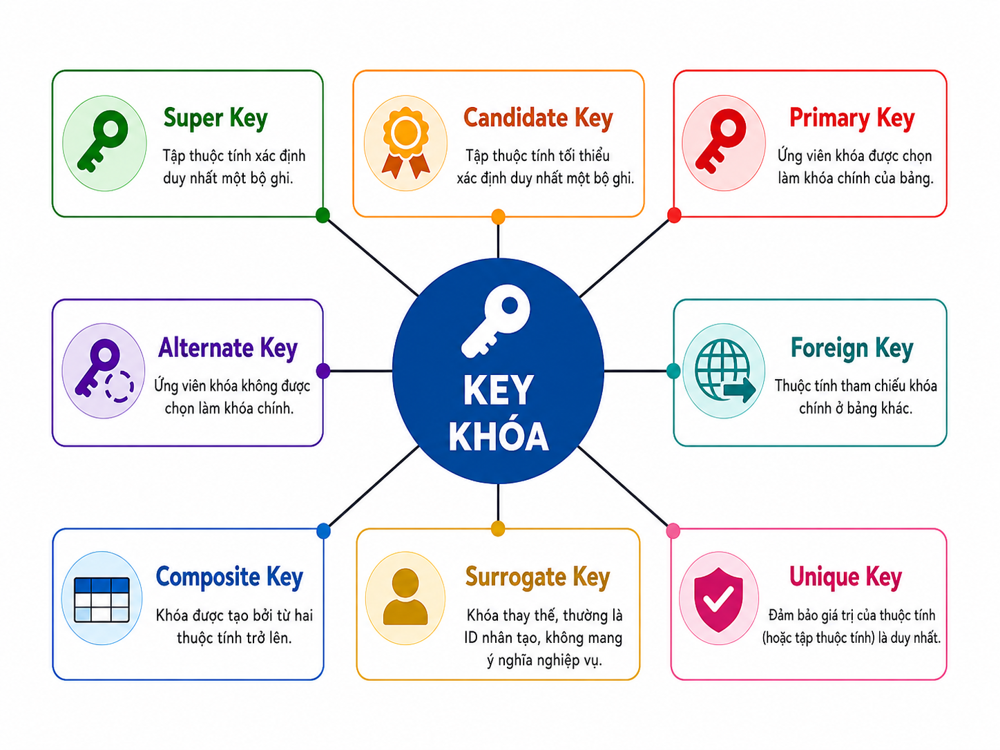
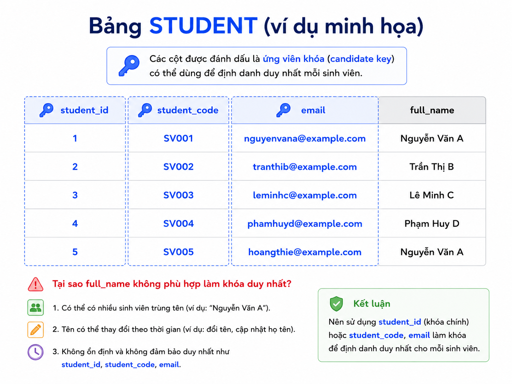
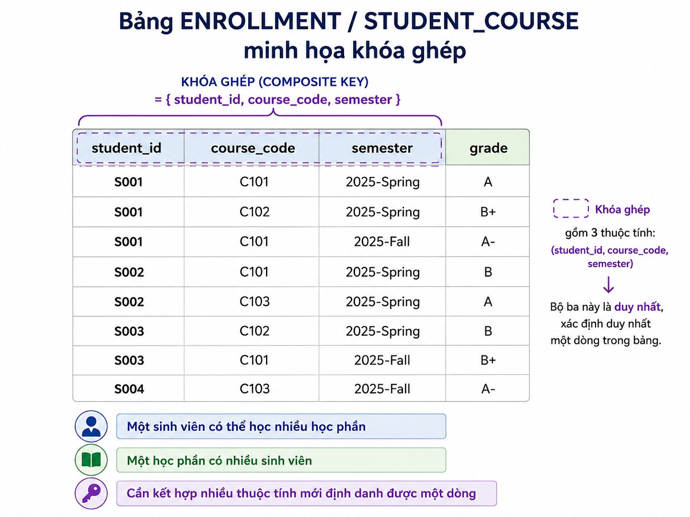
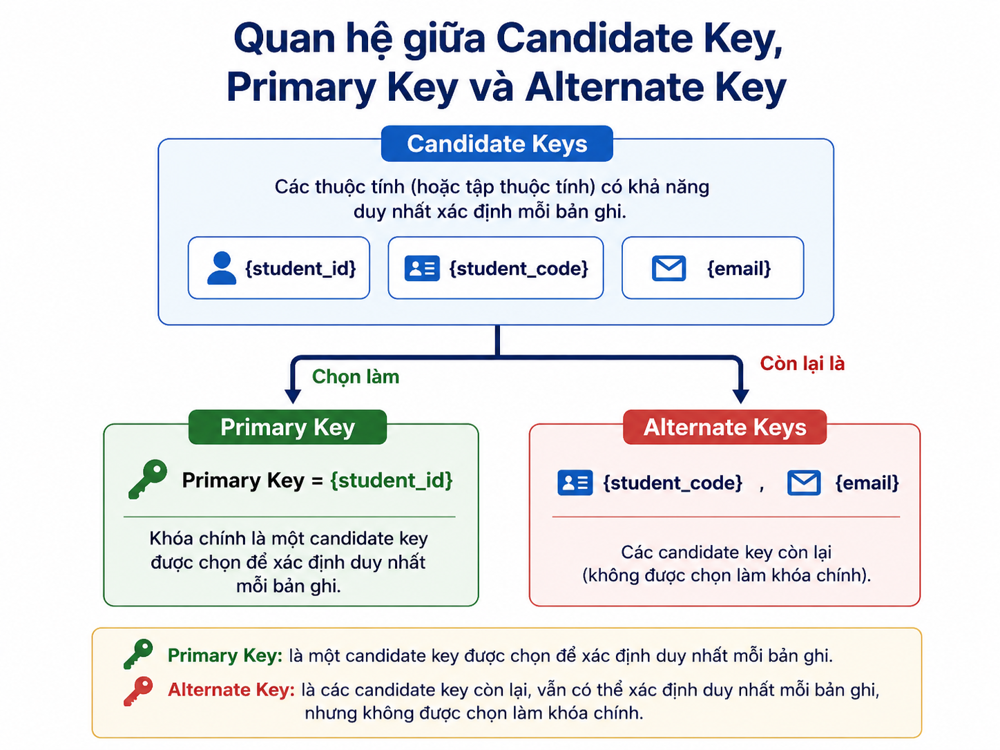
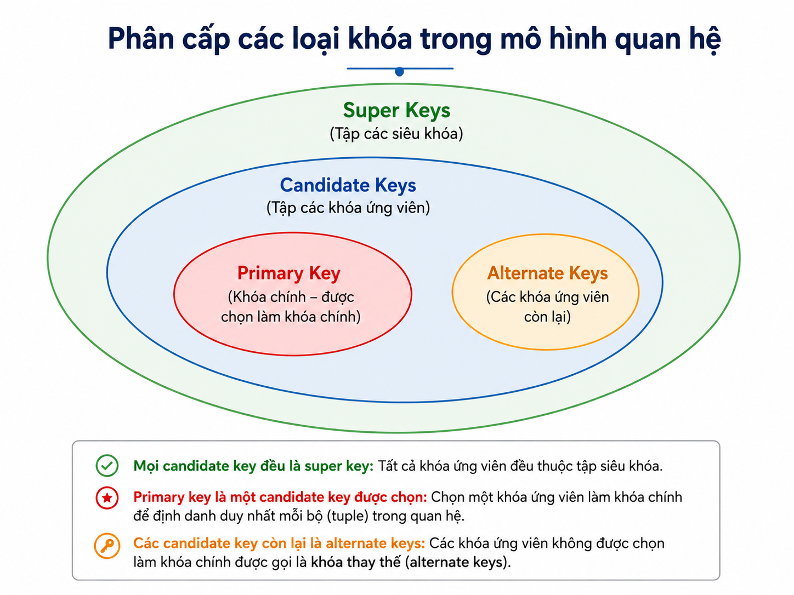
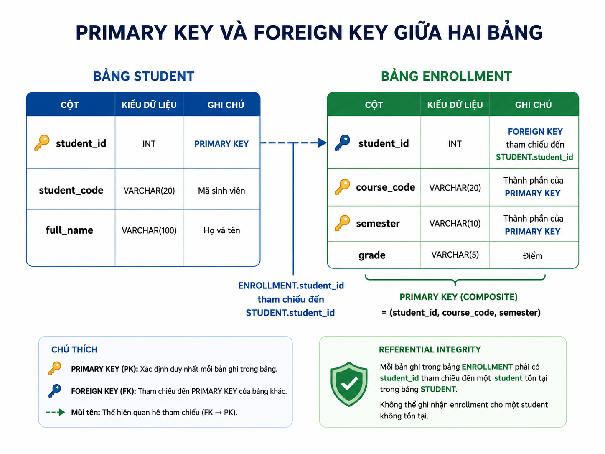
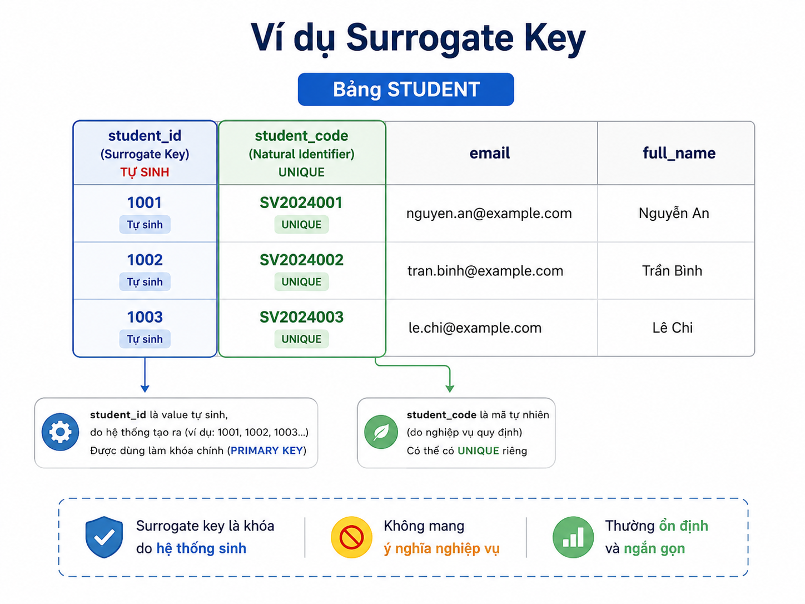
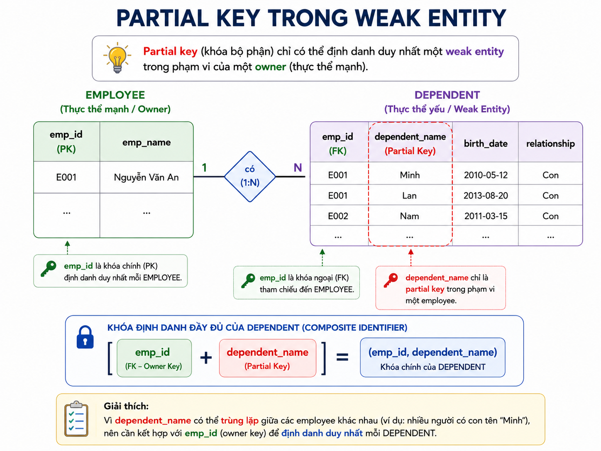

# Các loại khóa trong mô hình quan hệ

## Tài liệu tham khảo

- GeeksforGeeks – *Types of Keys in Relational Model*
- MySQL Reference Manual – `CREATE TABLE`
- Giáo trình mô hình quan hệ và toàn vẹn tham chiếu

> **Lưu ý thuật ngữ:** Một số thuật ngữ như *secondary key* thường xuất hiện trong tài liệu nhập môn hoặc tài liệu về truy xuất dữ liệu, nhưng không phải là một loại “key” nền tảng theo nghĩa chặt của lý thuyết quan hệ. Trong bài này, thuật ngữ được dùng để chỉ thuộc tính phục vụ tìm kiếm nhưng không nhất thiết duy nhất.

> **Nguyên tắc xuyên suốt:** Chọn key không chỉ dựa vào dữ liệu mẫu hiện tại. Cần dựa trên business rules, tính ổn định của dữ liệu, ràng buộc cần duy trì và workload thực tế.

---

## 1. Mục tiêu học tập

Sau bài học, người học có thể:

1. Giải thích vai trò của key trong mô hình quan hệ.
2. Phân biệt super key, candidate key, primary key và alternate key.
3. Phân biệt foreign key với primary key và unique constraint.
4. Xác định composite key phù hợp từ business rules.
5. Phân biệt partial key trong weak entity với composite key thông thường.
6. Giải thích khi nào nên dùng natural key hoặc surrogate key.
7. Nhận diện vai trò của secondary key/index trong tìm kiếm.
8. Phân tích các lỗi thiết kế thường gặp liên quan đến key.
9. Đề xuất constraints SQL phù hợp cho các tình huống đơn giản.
10. Làm quiz tình huống về lựa chọn key và toàn vẹn dữ liệu.

---

## 2. Key trong mô hình quan hệ là gì?

Trong mô hình quan hệ, một **key** là attribute hoặc tập attributes có vai trò nhận diện hoặc liên kết dữ liệu.

Câu hỏi cốt lõi là:

> Làm thế nào để phân biệt một tuple với tất cả các tuples còn lại trong relation?

Ví dụ:

```text
Student(StudentID, FullName, DateOfBirth, Email)
```

Nếu mỗi `StudentID` thuộc đúng một sinh viên, thì:

```text
StudentID → FullName, DateOfBirth, Email
```

`StudentID` có thể đóng vai trò key.

### 2.1. Key không chỉ là “một cột ID”

Một key có thể là:

```text
Một attribute đơn: StudentID
Nhiều attributes: StudentID, CourseID, Semester
Một giá trị nghiệp vụ: SKU, tax code, student code
Một giá trị hệ thống sinh: order_id, customer_id
```

### 2.2. Vai trò chính của key

| Vai trò | Ý nghĩa |
|---|---|
| Nhận diện | Phân biệt đúng một tuple |
| Toàn vẹn | Ngăn trùng lặp hoặc dữ liệu mồ côi |
| Liên kết | Kết nối relations qua foreign key |
| Tối ưu truy xuất | Hỗ trợ index và query pattern |
| Bảo trì | Giúp update/delete diễn ra chính xác |

![Tổng quan các loại khóa trong mô hình quan hệ]

*Hình 1. Tổng quan các loại key trong mô hình quan hệ.*

### Quiz – Vai trò của key

**Câu 2.1.** Mục đích trực tiếp nhất của một key là:

A. Nhận diện hoặc liên kết tuples theo quy tắc dữ liệu.
B. Tô màu các rows trong bảng.
C. Thay thế mọi query SQL.
D. Nén dữ liệu tự động.

**Câu 2.2.** Tình huống nào cho thấy một key có thể gồm nhiều attributes?

A. Khi một cột bất kỳ có giá trị NULL.
B. Khi cần kết hợp nhiều attributes mới nhận diện được duy nhất một tuple.
C. Khi một row chỉ có một attribute.
D. Khi bảng không có quan hệ với bảng khác.

**Câu 2.3.** Vì sao không nên chọn key chỉ dựa trên dữ liệu mẫu hiện tại?

A. Data sample luôn có quá nhiều rows.
B. Key không liên quan đến business rules.
C. Dữ liệu mẫu có thể chưa thể hiện các trường hợp trùng hoặc thay đổi trong tương lai.
D. SQL không hỗ trợ constraints.

---

## 3. Dữ liệu xuyên suốt và business rules

Để tránh hiểu key chỉ bằng định nghĩa, bài dùng ba relations sau.

### 3.1. Student

```text
Student(
    student_id,
    student_code,
    email,
    full_name
)
```

Business rules:

```text
student_id do hệ thống sinh.
student_code là duy nhất và ổn định trong trường.
email phải duy nhất nếu sinh viên đã xác minh email.
full_name có thể trùng.
```

### 3.2. Course

```text
Course(
    course_code,
    course_name,
    credits
)
```

Business rules:

```text
course_code là duy nhất.
course_name có thể trùng trong một số ngữ cảnh.
```

### 3.3. Enrollment

```text
Enrollment(
    student_id,
    course_code,
    semester,
    grade
)
```

Business rules:

```text
Một sinh viên có thể học nhiều học phần.
Một học phần có nhiều sinh viên.
Một sinh viên chỉ có một kết quả cho cùng course_code trong cùng semester.
```

Do đó, một định danh hợp lý của Enrollment là:

```text
(student_id, course_code, semester)
```


*Hình 2. Relation Student và các thuộc tính có thể được dùng trong phân tích key.*


*Hình 3. Relation Enrollment minh họa lý do cần composite key.*

### Quiz – Đọc business rules

**Câu 3.1.** Theo business rules ở trên, attribute nào chắc chắn không thể là candidate key của `Student`?

A. `student_id`
B. `student_code`
C. `email` nếu được yêu cầu duy nhất và không NULL
D. `full_name`

**Câu 3.2.** Vì sao `(student_id, course_code)` có thể chưa đủ để định danh Enrollment?

A. Vì một sinh viên có thể học lại cùng học phần ở semester khác.
B. Vì `course_code` luôn NULL.
C. Vì `student_id` không thể là foreign key.
D. Vì composite key không được phép dùng trong SQL.

**Câu 3.3.** Mệnh đề nào mô tả đúng cách xác định key?

A. Nhìn dữ liệu mẫu, chọn cột ngắn nhất.
B. Dựa trên business rules để kiểm tra uniqueness và minimality.
C. Chọn cột xuất hiện đầu tiên trong bảng.
D. Luôn dùng tên người dùng.

---

# Phần A. Super Key, Candidate Key, Primary Key và Alternate Key

## 4. Super Key

### 4.1. Định nghĩa

Một tập attributes `K` là **super key** của relation `R` nếu `K` xác định duy nhất mọi tuple của `R`.

Theo ngôn ngữ functional dependency:

```text
K → tất cả attributes của R
```

Ví dụ trong `Student(student_id, student_code, email, full_name)`, nếu `student_id` là duy nhất:

```text
{student_id}
{student_id, full_name}
{student_id, email}
```

đều là super keys.

### 4.2. Thuộc tính dư thừa

`{student_id, full_name}` vẫn là super key nếu `student_id` đã đủ định danh. Tuy nhiên, `full_name` là dư thừa trong tập key đó.

> Super key đảm bảo uniqueness, nhưng không bắt buộc tối giản.

### 4.3. Ý nghĩa thực tế

Super key chủ yếu là khái niệm phân tích. Khi thiết kế, ta thường ưu tiên candidate key hoặc primary key thay vì một super key có attributes dư thừa.

### Quiz – Super key

**Câu 4.1.** Nếu `{student_id}` đã nhận diện duy nhất Student, tập nào sau đây vẫn là super key?

A. `{full_name}`
B. `{course_code}`
C. `{student_id, full_name}`
D. `{semester}`

**Câu 4.2.** Vì sao `{student_id, full_name}` thường không được chọn trực tiếp làm candidate key nếu `{student_id}` đã đủ?

A. Vì full_name không thể lưu trong database.
B. Vì super key không thể có nhiều attributes.
C. Vì candidate key phải luôn là foreign key.
D. Vì full_name là attribute dư thừa trong việc nhận diện.

**Câu 4.3.** Phát biểu nào đúng?

A. Mọi candidate key đều là super key.
B. Mọi super key đều là candidate key.
C. Super key luôn chỉ gồm một cột.
D. Super key không thể tham chiếu từ bảng khác.

---

## 5. Candidate Key

### 5.1. Định nghĩa

Một **candidate key** là một super key tối giản.

Nói cách khác, `K` là candidate key nếu:

```text
K xác định duy nhất mọi tuple
và
Không có proper subset nào của K vẫn xác định duy nhất mọi tuple
```

### 5.2. Ví dụ

Giả sử trong Student:

```text
student_id  : duy nhất
student_code: duy nhất
email       : duy nhất và không NULL
full_name   : có thể trùng
```

Các candidate keys có thể là:

```text
{student_id}
{student_code}
{email}
```

Nhưng:

```text
{student_id, full_name}
```

không là candidate key vì không tối giản.

### 5.3. Candidate key và unique constraint

Trong lý thuyết quan hệ, candidate key không có NULL. Khi triển khai SQL, một candidate key thường cần:

```sql
NOT NULL
UNIQUE
```

Ví dụ:

```sql
student_code VARCHAR(20) NOT NULL UNIQUE
```

> Một `UNIQUE` constraint có cột cho phép NULL chưa chắc hiện thực một candidate key theo nghĩa lý thuyết, vì cách DBMS xử lý nhiều NULL có thể khác nhau.

### Quiz – Candidate key

**Câu 5.1.** Candidate key là:

A. Một foreign key luôn duy nhất.
B. Một super key tối giản.
C. Một index không có constraint.
D. Một attribute chỉ dùng tìm kiếm.

**Câu 5.2.** Trong SQL, cách cài đặt gần đúng nhất cho một candidate key là:

A. Chỉ dùng `INDEX`.
B. Chỉ dùng `DEFAULT`.
C. Dùng `NOT NULL` kết hợp `UNIQUE`.
D. Dùng `FOREIGN KEY`.

**Câu 5.3.** Giả sử `email` là duy nhất nhưng cho phép NULL. Nhận định nào phù hợp nhất?

A. Email chắc chắn là candidate key theo lý thuyết.
B. Email tự động trở thành foreign key.
C. Email không thể có unique constraint.
D. Cần xem quy tắc NULL của DBMS và yêu cầu nghiệp vụ trước khi gọi nó là candidate key.

---

## 6. Primary Key và Alternate Key

### 6.1. Primary Key

**Primary key** là một candidate key được chọn làm định danh chính thức của relation.

Ví dụ:

```sql
CREATE TABLE Student (
    student_id INT PRIMARY KEY,
    student_code VARCHAR(20) NOT NULL UNIQUE,
    email VARCHAR(100) NOT NULL UNIQUE,
    full_name VARCHAR(100) NOT NULL
);
```

Ở đây:

```text
Primary key: student_id
Candidate keys khác: student_code, email
```

Primary key:

- Phải unique.
- Không được NULL.
- Mỗi relation chỉ có **một primary key constraint**.
- Có thể là single-attribute hoặc composite.

### 6.2. Alternate Key

**Alternate key** là candidate key không được chọn làm primary key.

Trong ví dụ trên:

```text
student_code và email là alternate keys
```

Trong SQL, alternate key thường được hiện thực bằng `UNIQUE NOT NULL`.

### 6.3. Chọn primary key bằng tiêu chí nào?

Một candidate key phù hợp làm primary key thường có các đặc điểm:

| Tiêu chí | Lý do |
|---|---|
| Ổn định | Ít thay đổi trong vòng đời dữ liệu |
| Ngắn gọn | Dễ join, index và tham chiếu |
| Không nhạy cảm | Tránh đưa dữ liệu cá nhân vào mọi foreign key |
| Có ý nghĩa vận hành | Phù hợp với kiến trúc ứng dụng |
| Có ràng buộc rõ | DBMS có thể enforce nhất quán |



*Hình 4. Primary key là một candidate key được chọn; các candidate keys còn lại là alternate keys.*

### Quiz – Primary key và alternate key

**Câu 6.1.** Một relation có thể có bao nhiêu primary key constraint?

A. Một.
B. Không giới hạn.
C. Hai nếu có composite key.
D. Một cho mỗi candidate key.

**Câu 6.2.** Nếu `student_id`, `student_code` và `email` đều là candidate keys, và chọn `student_id` làm primary key, `student_code` là:

A. Foreign key.
B. Alternate key.
C. Partial key.
D. Secondary key bắt buộc.

**Câu 6.3.** Lý do nào không phù hợp để chọn một candidate key làm primary key?

A. Khóa ổn định và ít thay đổi.
B. Khóa ngắn và dễ tham chiếu.
C. Khóa chứa dữ liệu nhạy cảm và thường xuyên thay đổi.
D. Khóa có ràng buộc uniqueness rõ ràng.

---

## 7. Quan hệ giữa Super Key, Candidate Key, Primary Key và Alternate Key

Có thể hình dung:

```text
Super Keys
└── Candidate Keys
    ├── Primary Key
    └── Alternate Keys
```

Tuy nhiên, đây là quan hệ khái niệm, không có nghĩa DBMS tự động biết tất cả candidate keys nếu ta không khai báo constraints tương ứng.



*Hình 5. Mối quan hệ khái niệm giữa super key, candidate key, primary key và alternate key.*

### Quiz – Quan hệ giữa các key

**Câu 7.1.** Mệnh đề nào đúng?

A. Alternate key là super key chứa thuộc tính dư thừa.
B. Primary key không phải candidate key.
C. Foreign key luôn là alternate key.
D. Mọi candidate key đều là super key.

**Câu 7.2.** Điều nào phân biệt candidate key với super key?

A. Candidate key không được có attributes dư thừa.
B. Candidate key luôn gồm đúng hai attributes.
C. Candidate key chỉ dùng trong NoSQL.
D. Candidate key không được dùng làm primary key.

**Câu 7.3.** Một DBMS chỉ enforce uniqueness cho `student_id`, nhưng business rule nói `email` cũng phải duy nhất. Hành động thiết kế phù hợp là:

A. Không làm gì vì DBMS đã có primary key.
B. Thêm `UNIQUE NOT NULL` cho email nếu business rule yêu cầu.
C. Xóa primary key.
D. Đổi email thành foreign key.

---

# Phần B. Foreign Key, Composite Key và Referential Integrity

## 8. Foreign Key

### 8.1. Định nghĩa

**Foreign key** là attribute hoặc tập attributes ở relation con tham chiếu tới một candidate key hoặc primary key ở relation cha.

Ví dụ:

```text
Student(student_id, student_code, ...)
Enrollment(student_id, course_code, semester, grade)
```

Trong đó:

```text
Enrollment.student_id → Student.student_id
```

`Enrollment.student_id` là foreign key.

### 8.2. Vai trò

Foreign key hỗ trợ:

- Liên kết relations.
- Ngăn dữ liệu mồ côi.
- Diễn đạt business rule về quan hệ.
- Kiểm soát update/delete thông qua các action như `RESTRICT`, `CASCADE`, `SET NULL`.

### 8.3. Ví dụ SQL

```sql
CREATE TABLE Enrollment (
    student_id INT NOT NULL,
    course_code VARCHAR(20) NOT NULL,
    semester VARCHAR(20) NOT NULL,
    grade DECIMAL(4, 2),
    PRIMARY KEY (student_id, course_code, semester),
    CONSTRAINT fk_enrollment_student
        FOREIGN KEY (student_id)
        REFERENCES Student(student_id)
);
```

### 8.4. Foreign key có nhất thiết unique không?

Không. Trong quan hệ one-to-many, giá trị foreign key thường lặp.

Ví dụ:

```text
Nhiều Enrollment rows có cùng student_id
```

Foreign key chỉ unique khi relationship hoặc business rule yêu cầu one-to-one.



*Hình 6. Foreign key tạo liên kết từ relation con tới relation cha.*

### Quiz – Foreign key

**Câu 8.1.** Foreign key thường tham chiếu đến:

A. Bất kỳ cột nào không cần constraint.
B. Một secondary key bất kỳ.
C. Một primary key hoặc candidate key được enforce của relation khác.
D. Chỉ một surrogate key.

**Câu 8.2.** Vì sao `Enrollment.student_id` có thể xuất hiện ở nhiều rows?

A. Vì foreign key không được phép kiểm tra dữ liệu.
B. Vì foreign key luôn là primary key.
C. Vì student_id không có kiểu dữ liệu.
D. Vì một student có thể có nhiều enrollment.

**Câu 8.3.** Cơ chế nào ngăn một Enrollment tham chiếu tới student_id không tồn tại?

A. Referential integrity do foreign key constraint.
B. `CHECK` duy nhất.
C. `UNIQUE` duy nhất.
D. Secondary index.

---

## 9. Composite Key

### 9.1. Định nghĩa

**Composite key** là key gồm từ hai attributes trở lên.

Composite key không tự động là primary key hay candidate key; nó chỉ nói rằng key có nhiều thành phần. Nó có thể được dùng làm:

```text
Composite candidate key
Composite primary key
Composite unique constraint
Composite foreign key
```

### 9.2. Ví dụ: Enrollment

Business rule:

```text
Một student chỉ có một enrollment result
cho cùng course_code trong cùng semester.
```

Do đó:

```text
(student_id, course_code, semester)
```

có thể là composite candidate key và được chọn làm composite primary key.

```sql
PRIMARY KEY (student_id, course_code, semester)
```

### 9.3. Thứ tự attributes trong composite key

Về logic uniqueness, bộ `(student_id, course_code, semester)` xác định một enrollment. Nhưng trong implementation, thứ tự columns trong composite index có thể ảnh hưởng query performance.

Vì vậy:

- Chọn key theo business rule trước.
- Sau đó cân nhắc thứ tự index theo query patterns.

### 9.4. Không nhầm composite key với partial key

Composite key:

```text
(StudentID, CourseID, Semester)
```

là một key đầy đủ trong một relation bình thường.

Partial key là khái niệm của weak entity và cần owner key để nhận diện đầy đủ.

### Quiz – Composite key

**Câu 9.1.** Composite key là:

A. Key do hệ thống tự sinh.
B. Key có ít nhất hai attributes.
C. Key chỉ dùng để tìm kiếm.
D. Key không thể là primary key.

**Câu 9.2.** Điều gì quyết định `(student_id, course_code, semester)` có phải key hợp lý hay không?

A. Tên columns có ngắn hay không.
B. Số rows trong bảng hiện tại.
C. Business rule về uniqueness của enrollment.
D. Có dùng MySQL hay không.

**Câu 9.3.** Phát biểu nào đúng về thứ tự columns trong composite primary key?

A. Không bao giờ có ảnh hưởng gì.
B. Chỉ ảnh hưởng caption của table.
C. Làm foreign key không còn hợp lệ.
D. Có thể ảnh hưởng performance index, dù logic business key được xác định trước.

---

## 10. Referential Integrity và các action khi thay đổi dữ liệu

Foreign key không chỉ kiểm tra tồn tại; nó còn yêu cầu quyết định điều gì xảy ra khi row cha bị sửa hoặc xóa.

Một số lựa chọn phổ biến:

| Action | Ý nghĩa |
|---|---|
| `RESTRICT` / `NO ACTION` | Không cho xóa/sửa row cha nếu còn row con tham chiếu |
| `CASCADE` | Lan truyền cập nhật/xóa sang rows con |
| `SET NULL` | Đặt foreign key ở row con thành NULL nếu relationship optional |
| `SET DEFAULT` | Đặt foreign key thành giá trị mặc định nếu DBMS hỗ trợ phù hợp |

### 10.1. Chọn action theo business rule

Ví dụ:

- Không nên `CASCADE DELETE` từ `Student` sang lịch sử Enrollment nếu trường cần lưu lịch sử.
- Có thể dùng `RESTRICT` để buộc xử lý enrollment trước khi xóa student.
- Chỉ dùng `SET NULL` khi relationship thật sự optional và column cho phép NULL.

### Quiz – Referential integrity

**Câu 10.1.** Khi không muốn xóa Student nếu còn Enrollment rows, action phù hợp nhất thường là:

A. `RESTRICT` hoặc `NO ACTION`.
B. `CASCADE`.
C. `SET DEFAULT` trong mọi trường hợp.
D. Xóa foreign key constraint.

**Câu 10.2.** `ON DELETE SET NULL` chỉ hợp lý khi:

A. Parent key là composite key.
B. Foreign key column cho phép NULL và relationship là optional.
C. Bảng con luôn phải có parent.
D. Muốn giữ orphan rows mà không cần business rule.

**Câu 10.3.** Lý do cần cân nhắc kỹ `ON DELETE CASCADE` là:

A. Nó không bao giờ thực thi.
B. Nó làm foreign key trở thành unique key.
C. Nó có thể xóa nhiều dữ liệu con hơn dự kiến.
D. Nó chỉ hoạt động trên views.

---

# Phần C. Unique Constraint, Natural Key, Surrogate Key và Secondary Key

## 11. Unique Constraint và Unique Key

### 11.1. Ý nghĩa

Trong SQL, `UNIQUE` là constraint bảo đảm rằng các giá trị không trùng theo một cột hoặc tổ hợp cột.

Ví dụ:

```sql
CREATE TABLE Student (
    student_id INT PRIMARY KEY,
    student_code VARCHAR(20) NOT NULL UNIQUE,
    email VARCHAR(100) NOT NULL UNIQUE,
    full_name VARCHAR(100) NOT NULL
);
```

### 11.2. Unique constraint và candidate key

Một `UNIQUE NOT NULL` constraint thường hiện thực một candidate key.

Tuy nhiên:

- `UNIQUE` tự nó không nhất thiết tương đương candidate key nếu columns cho phép NULL.
- Quy tắc về nhiều NULL trong unique constraint phụ thuộc DBMS.
- Một composite `UNIQUE (email, full_name)` chỉ đảm bảo uniqueness của **cặp**, không đảm bảo email riêng lẻ duy nhất.

### 11.3. Ví dụ suy luận

Nếu có:

```sql
UNIQUE (email, full_name)
```

thì hai rows có thể có cùng `email` nếu `full_name` khác, tùy dữ liệu và DBMS constraints. Do đó không thể suy ra:

```text
email → full_name
```

chỉ từ constraint uniqueness trên cặp.

### Quiz – Unique constraint

**Câu 11.1.** `UNIQUE (email, full_name)` đảm bảo điều gì?

A. Email luôn duy nhất.
B. Full name luôn duy nhất.
C. Email tự động là primary key.
D. Cặp `(email, full_name)` không được trùng hoàn toàn.

**Câu 11.2.** Điều kiện nào làm một unique attribute phù hợp hơn với candidate key theo lý thuyết?

A. Attribute được `NOT NULL` và unique theo business rule.
B. Attribute cho phép NULL tùy ý.
C. Attribute có index nhưng không unique.
D. Attribute là foreign key.

**Câu 11.3.** Vì sao cần thận trọng khi suy luận từ `UNIQUE` có NULL?

A. NULL luôn bằng mọi giá trị.
B. NULL có thể có semantics và cách enforce khác theo DBMS.
C. UNIQUE không phải constraint.
D. Primary key cho phép NULL.

---

## 12. Natural Key và Surrogate Key

### 12.1. Natural Key

**Natural key** là key có nguồn gốc từ dữ liệu nghiệp vụ.

Ví dụ:

```text
student_code
course_code
SKU
tax_id
```

### 12.2. Surrogate Key

**Surrogate key** là key nhân tạo do hệ thống tạo, thường không mang ý nghĩa nghiệp vụ trực tiếp.

Ví dụ:

```sql
student_id BIGINT GENERATED ALWAYS AS IDENTITY PRIMARY KEY
```

### 12.3. So sánh

| Tiêu chí | Natural key | Surrogate key |
|---|---|---|
| Nguồn gốc | Quy tắc nghiệp vụ | Hệ thống sinh |
| Ý nghĩa | Có ý nghĩa trong domain | Không có ý nghĩa nghiệp vụ |
| Khả năng thay đổi | Có thể thay đổi | Thường ổn định |
| Độ dài | Có thể dài/phức tạp | Thường ngắn |
| Cần unique constraint? | Có | Có thể cần thêm unique cho natural identifier |

### 12.4. Nguyên tắc thiết kế thực tế

Dùng surrogate key không có nghĩa natural identifier trở nên không quan trọng.

Ví dụ:

```text
student_id       : primary key surrogate
student_code     : unique natural identifier
```

Cần giữ `UNIQUE` cho `student_code` nếu hệ thống không cho phép hai sinh viên cùng mã.

### 12.5. Khi nào thiên về surrogate key?

| Tình huống | Lý do |
|---|---|
| Natural key có thể thay đổi | Tránh lan truyền update qua foreign keys |
| Natural key dài hoặc ghép nhiều cột | Dễ tham chiếu hơn |
| Natural key nhạy cảm | Không đưa dữ liệu nhạy cảm vào nhiều relations |
| Có nhiều nguồn dữ liệu khác nhau | Giảm phụ thuộc vào mã từ một nguồn bên ngoài |



*Hình 7. Surrogate key và natural identifier có thể cùng tồn tại.*

### Quiz – Natural và surrogate key

**Câu 12.1.** Trong thiết kế `student_id` tự sinh và `student_code UNIQUE NOT NULL`, vai trò phù hợp nhất là:

A. student_code là foreign key.
B. student_id không phải key.
C. student_id là surrogate primary key; student_code là natural alternate key.
D. student_code không cần constraint.

**Câu 12.2.** Lợi ích quan trọng của surrogate key là:

A. Tự động bảo đảm dữ liệu nghiệp vụ không trùng.
B. Loại bỏ mọi unique constraints khác.
C. Không cần foreign keys.
D. Thường ổn định, ngắn gọn và không phụ thuộc vào business identifier có thể thay đổi.

**Câu 12.3.** Khi nào natural key có thể không phù hợp làm primary key?

A. Khi nó dài, thay đổi được hoặc nhạy cảm.
B. Khi nó ổn định và ngắn.
C. Khi nó không mang ý nghĩa nghiệp vụ.
D. Khi relation chỉ có một row.

---

## 13. Secondary Key và index phục vụ tìm kiếm

Một **secondary key** trong cách dùng thực hành là attribute hoặc tập attributes được dùng để tìm kiếm, lọc hoặc sắp xếp, nhưng không nhất thiết định danh duy nhất tuple.

Ví dụ:

```text
full_name
department_id
created_at
status
```

Có thể tạo index:

```sql
CREATE INDEX idx_student_full_name
ON Student(full_name);
```

### 13.1. Phân biệt secondary key với candidate key

| Tiêu chí | Candidate key | Secondary key |
|---|---|---|
| Đảm bảo uniqueness | Có | Không nhất thiết |
| Dùng làm định danh | Có thể | Không |
| Cần minimality | Có | Không |
| Mục tiêu chính | Integrity/identity | Search/query performance |

### 13.2. Không index mọi cột

Index có lợi cho đọc dữ liệu, nhưng có thể làm insert/update/delete tốn chi phí hơn. Chỉ nên tạo index khi có query patterns rõ ràng.

### Quiz – Secondary key và index

**Câu 13.1.** `full_name` có thể là secondary key vì:

A. Nó luôn duy nhất.
B. Nó có thể được dùng để tìm kiếm dù không định danh duy nhất.
C. Nó tự động là foreign key.
D. Nó không thể có index.

**Câu 13.2.** Khác biệt cốt lõi giữa candidate key và secondary key là:

A. Secondary key luôn là primary key.
B. Candidate key không được dùng trong query.
C. Candidate key có uniqueness/minimality; secondary key phục vụ truy xuất và có thể trùng.
D. Secondary key không phải column.

**Câu 13.3.** Vì sao không nên tạo index trên mọi cột?

A. Index không bao giờ tăng tốc query.
B. Index chỉ dùng cho primary key.
C. Index làm mọi values thành unique.
D. Index thêm chi phí storage và maintenance cho write operations.

---

# Phần D. Partial Key và Weak Entity

## 14. Partial Key trong weak entity

### 14.1. Weak entity

Weak entity là entity không thể được định danh duy nhất chỉ bằng attributes của nó trong phạm vi toàn hệ thống. Nó cần kết hợp với key của owner entity.

Ví dụ:

```text
Employee(EmpID, EmpName)
Dependent(EmpID, DependentName, BirthDate, Relationship)
```

Giả sử `DependentName` chỉ phân biệt dependents **trong phạm vi một Employee**.

```text
Partial key: DependentName
Full identifier: (EmpID, DependentName)
```

### 14.2. Không nhầm partial key với composite key

| Khái niệm | Ý nghĩa |
|---|---|
| Composite key | Key gồm nhiều attributes, có thể tự định danh tuple trong relation |
| Partial key | Attribute nhận diện weak entity trong phạm vi owner; cần owner key để thành định danh đầy đủ |

Ví dụ:

```text
(student_id, course_code, semester)
```

trong Enrollment thường là composite primary key, không phải partial key.



*Hình 8. Partial key cần kết hợp với key của owner entity để định danh weak entity.*

### Quiz – Partial key và weak entity

**Câu 14.1.** Partial key thường dùng để:

A. Phân biệt weak entity trong phạm vi owner entity.
B. Thay thế foreign key trong mọi relation.
C. Tạo index cho dữ liệu lớn.
D. Mã hóa dữ liệu nhạy cảm.

**Câu 14.2.** Vì sao `DependentName` một mình không nhất thiết là key toàn hệ thống?

A. Vì tên không có kiểu dữ liệu.
B. Vì nhiều employees khác nhau có thể đều có dependent tên Anna.
C. Vì partial key luôn NULL.
D. Vì weak entity không có attributes.

**Câu 14.3.** Phát biểu nào đúng nhất?

A. Mọi composite key đều là partial key.
B. Partial key không cần owner key.
C. Partial key cần kết hợp owner key để tạo định danh đầy đủ.
D. Composite key trong Enrollment và partial key trong Dependent là cùng một khái niệm.

---

## 15. Bảng tổng hợp các loại key

| Loại | Có đảm bảo uniqueness? | Có minimality? | Vai trò chính |
|---|---|---|---|
| Super key | Có | Không nhất thiết | Nhận diện tuple |
| Candidate key | Có | Có | Ứng viên làm primary key |
| Primary key | Có | Có | Định danh chính thức |
| Alternate key | Có | Có | Candidate key không được chọn |
| Foreign key | Không nhất thiết | Không nhất thiết | Liên kết và tham chiếu |
| Composite key | Tùy key cụ thể | Tùy key cụ thể | Key có nhiều attributes |
| Unique constraint | Có theo columns khai báo | Không nhất thiết | Enforce uniqueness |
| Surrogate key | Có nếu được chọn làm PK/UNIQUE | Thường có | Định danh do hệ thống sinh |
| Natural key | Tùy business rule | Có thể | Định danh nghiệp vụ |
| Secondary key | Không nhất thiết | Không | Tìm kiếm/truy xuất |
| Partial key | Chỉ trong phạm vi owner | Tương đối | Phân biệt weak entity |

> Một attribute có thể giữ nhiều vai trò. Ví dụ `student_code` có thể là natural key, candidate key, alternate key và unique constraint cùng lúc.

---

## 16. Quy trình xác định key trong thiết kế

### Bước 1. Xác định business identifiers

Hỏi:

```text
Điều gì phân biệt duy nhất một đối tượng trong nghiệp vụ?
Mã nào được cấp và có thay đổi không?
Có identifier nào nhạy cảm không?
```

### Bước 2. Liệt kê candidate keys có thể có

Ví dụ:

```text
Student(student_id, student_code, email, full_name)
Candidate keys có thể: student_id, student_code, email
```

### Bước 3. Kiểm tra minimality và NULL

```text
Có attribute dư thừa không?
Có cho phép NULL không?
Business rule có thực sự enforce uniqueness không?
```

### Bước 4. Chọn primary key

Ưu tiên stability, simplicity và khả năng vận hành.

### Bước 5. Giữ alternate keys bằng constraints

```sql
UNIQUE (student_code)
UNIQUE (email)
```

khi các business identifiers phải không trùng.

### Bước 6. Thiết kế foreign keys và delete/update actions

Đặt câu hỏi:

```text
Có relation nào tham chiếu key này?
Có được xóa parent khi còn child không?
Có cần history không?
```

### Quiz – Quy trình thiết kế key

**Câu 16.1.** Bước đầu tiên hợp lý khi chọn key là:

A. Chọn cột ngắn nhất.
B. Tạo index cho mọi cột.
C. Xóa các unique constraints.
D. Xác định business identifiers và business rules.

**Câu 16.2.** Vì sao alternate keys nên được khai báo rõ bằng constraints nếu nghiệp vụ yêu cầu uniqueness?

A. Để DBMS enforce quy tắc thay vì chỉ dựa vào code ứng dụng.
B. Để foreign key không còn cần thiết.
C. Để primary key cho phép NULL.
D. Để xóa dữ liệu nhanh hơn.

**Câu 16.3.** Khi thiết kế foreign key, câu hỏi nào quan trọng nhất?

A. Caption bảng có đẹp không?
B. Hành vi update/delete nào phù hợp với business rule và lịch sử dữ liệu?
C. Cột có tên ngắn không?
D. Có thể bỏ parent table không?

---

## 17. Ví dụ tổng hợp: hệ thống đăng ký học phần

### 17.1. Student

```sql
CREATE TABLE Student (
    student_id BIGINT GENERATED ALWAYS AS IDENTITY PRIMARY KEY,
    student_code VARCHAR(20) NOT NULL UNIQUE,
    email VARCHAR(100) NOT NULL UNIQUE,
    full_name VARCHAR(100) NOT NULL
);
```

| Thành phần | Vai trò |
|---|---|
| `student_id` | Surrogate primary key |
| `student_code` | Natural candidate/alternate key |
| `email` | Candidate/alternate key nếu rule yêu cầu duy nhất và NOT NULL |
| `full_name` | Có thể là secondary key cho search |

### 17.2. Course

```sql
CREATE TABLE Course (
    course_code VARCHAR(20) PRIMARY KEY,
    course_name VARCHAR(100) NOT NULL,
    credits INT NOT NULL
);
```

| Thành phần | Vai trò |
|---|---|
| `course_code` | Natural primary key |
| `course_name` | Non-key attribute; có thể index để search |

### 17.3. Enrollment

```sql
CREATE TABLE Enrollment (
    student_id BIGINT NOT NULL,
    course_code VARCHAR(20) NOT NULL,
    semester VARCHAR(20) NOT NULL,
    grade DECIMAL(4, 2),
    PRIMARY KEY (student_id, course_code, semester),
    CONSTRAINT fk_enrollment_student
        FOREIGN KEY (student_id)
        REFERENCES Student(student_id),
    CONSTRAINT fk_enrollment_course
        FOREIGN KEY (course_code)
        REFERENCES Course(course_code)
);
```

| Thành phần | Vai trò |
|---|---|
| `(student_id, course_code, semester)` | Composite primary key |
| `student_id` | Foreign key đến Student |
| `course_code` | Foreign key đến Course |
| `grade` | Non-key attribute |

### Quiz – Ví dụ tổng hợp

**Câu 17.1.** Trong bảng Enrollment, vì sao `semester` nằm trong composite primary key?

A. Vì semester luôn là foreign key.
B. Vì grade cần được unique toàn hệ thống.
C. Để mỗi student có thể học cùng một course ở các semester khác nhau mà vẫn có rows phân biệt.
D. Vì primary key không thể chứa student_id.

**Câu 17.2.** Nếu `student_code` là unique business identifier, việc chỉ dùng `student_id` primary key mà không đặt `UNIQUE(student_code)` có rủi ro gì?

A. Không có rủi ro vì surrogate key tự enforce mọi business rule.
B. student_id sẽ không còn unique.
C. Enrollment không thể có foreign key.
D. Có thể xuất hiện hai students có cùng student_code.

**Câu 17.3.** Nếu trường cần giữ lịch sử enrollment, action nào cần đặc biệt thận trọng khi xóa Student?

A. `ON DELETE CASCADE`.
B. `ON UPDATE RESTRICT`.
C. `UNIQUE`.
D. `PRIMARY KEY`.

---

## 18. Những lỗi thường gặp

### 18.1. Nhầm “unique” với “candidate key”

`UNIQUE` constraint có thể không đủ để là candidate key theo nghĩa lý thuyết nếu columns cho phép NULL hoặc business rule chưa khẳng định identity.

### 18.2. Nhầm foreign key với unique key

Foreign key có thể lặp trong one-to-many relationship. Nó chỉ unique trong trường hợp one-to-one.

### 18.3. Dùng surrogate key nhưng quên business constraints

Có `id` tự sinh không ngăn:

```text
Trùng email
Trùng SKU
Trùng student_code
Trùng national identifier
```

nếu không có `UNIQUE` hoặc quy tắc kiểm tra phù hợp.

### 18.4. Chọn natural key thay đổi thường xuyên

Một natural key thay đổi có thể gây update lan truyền qua nhiều foreign keys. Đây là lý do nhiều hệ thống dùng surrogate key làm primary key và giữ natural key bằng alternate/unique constraint.

### 18.5. Nhầm partial key với composite primary key

Partial key chỉ có ý nghĩa cùng owner entity trong weak entity; composite primary key có thể tự định danh relation mà không cần ngữ cảnh owner riêng.

### Quiz – Phát hiện lỗi thiết kế

**Câu 18.1.** Một bảng Customer dùng `customer_id` tự tăng làm primary key nhưng không đặt unique cho `tax_code`, dù tax_code phải duy nhất. Đây là lỗi gì?

A. Dùng surrogate key là sai.
B. Thiếu constraint cho business identifier.
C. Foreign key bị lặp.
D. Composite key quá ngắn.

**Câu 18.2.** Một thiết kế đặt `email` làm primary key nhưng cho phép người dùng thay email thường xuyên. Rủi ro chính là:

A. Email không thể lưu text.
B. Email không thể unique.
C. Update key có thể lan truyền sang nhiều foreign keys.
D. Không thể tạo index.

**Câu 18.3.** Phát biểu nào đúng về foreign key?

A. Nó luôn phải unique.
B. Nó luôn là primary key của child table.
C. Nó thay thế candidate key ở parent table.
D. Nó có thể lặp và vẫn duy trì referential integrity.

---

## 19. Bài tập vận dụng

### Bài 19.1. Nhân sự

Cho:

```text
Employee(emp_id, national_id, email, full_name, department_id)
```

Business rules:

```text
emp_id do công ty cấp và không đổi.
national_id duy nhất.
email duy nhất và bắt buộc.
full_name có thể trùng.
```

1. Liệt kê candidate keys.
2. Chọn primary key và giải thích.
3. Xác định alternate keys.
4. Đề xuất secondary key để tìm kiếm.
5. Viết các constraints SQL cơ bản.

### Bài 19.2. Department và Employee

Cho:

```text
Department(department_id, department_name)
Employee(emp_id, full_name, department_id)
```

1. Xác định primary key của mỗi relation.
2. Xác định foreign key.
3. Giải thích vì sao `Employee.department_id` có thể lặp.
4. Chọn hành vi delete phù hợp nếu không muốn mất lịch sử employee.

### Bài 19.3. Enrollment

Cho:

```text
Enrollment(student_id, course_id, semester, grade)
```

1. Đề xuất composite candidate key.
2. Giải thích vì sao chỉ `student_id` không đủ.
3. Giải thích vì sao chỉ `course_id` không đủ.
4. Nếu student có thể học lại cùng course trong semester với attempt number khác nhau, key cần thay đổi thế nào?

### Bài 19.4. Product

Cho:

```text
Product(product_id, sku, product_name, price)
```

Trong đó:

```text
product_id do hệ thống sinh.
sku là mã nghiệp vụ phải duy nhất.
product_name có thể trùng.
```

1. Xác định surrogate key và natural key.
2. Đề xuất primary key và alternate key.
3. Viết constraint cần có cho SKU.
4. Nêu một query pattern có thể khiến cần secondary index.

---

## 20. Đáp án quiz

### Đáp án – Vai trò của key

| Câu | Đáp án | Giải thích |
|---:|:---:|---|
| 2.1 | A | Key nhận diện hoặc liên kết tuples theo các quy tắc dữ liệu. |
| 2.2 | B | Có trường hợp cần tổ hợp attributes mới đủ phân biệt tuple. |
| 2.3 | C | Sample có thể chưa thể hiện các trường hợp trùng tương lai. |

### Đáp án – Đọc business rules

| Câu | Đáp án | Giải thích |
|---:|:---:|---|
| 3.1 | D | Full name có thể trùng theo business rule. |
| 3.2 | A | Cùng course có thể lặp lại ở semester khác. |
| 3.3 | B | Business rule xác định uniqueness và minimality. |

### Đáp án – Super key

| Câu | Đáp án | Giải thích |
|---:|:---:|---|
| 4.1 | C | Thêm full_name vẫn giữ uniqueness từ student_id. |
| 4.2 | D | Full name không cần để nhận diện nếu student_id đã đủ. |
| 4.3 | A | Candidate key là super key tối giản. |

### Đáp án – Candidate key

| Câu | Đáp án | Giải thích |
|---:|:---:|---|
| 5.1 | B | Candidate key là minimal super key. |
| 5.2 | C | NOT NULL + UNIQUE gần với key theo lý thuyết quan hệ. |
| 5.3 | D | NULL và semantics DBMS cần được xem xét trước khi gọi là candidate key. |

### Đáp án – Primary key và alternate key

| Câu | Đáp án | Giải thích |
|---:|:---:|---|
| 6.1 | A | Một relation có một primary key constraint; key có thể gồm nhiều cột. |
| 6.2 | B | Candidate key không được chọn làm primary key là alternate key. |
| 6.3 | C | Key nhạy cảm/thay đổi thường xuyên không phải lựa chọn tốt làm PK. |

### Đáp án – Quan hệ giữa các key

| Câu | Đáp án | Giải thích |
|---:|:---:|---|
| 7.1 | D | Candidate key luôn là super key. |
| 7.2 | A | Minimality là điểm phân biệt chính. |
| 7.3 | B | DBMS cần enforce rule email unique khi nghiệp vụ yêu cầu. |

### Đáp án – Foreign key

| Câu | Đáp án | Giải thích |
|---:|:---:|---|
| 8.1 | C | FK tham chiếu key được enforce ở parent relation. |
| 8.2 | D | Một student có thể có nhiều enrollment. |
| 8.3 | A | Referential integrity do foreign key constraint bảo vệ. |

### Đáp án – Composite key

| Câu | Đáp án | Giải thích |
|---:|:---:|---|
| 9.1 | B | Composite key có từ hai attributes. |
| 9.2 | C | Business rule quyết định identity của enrollment. |
| 9.3 | D | Thứ tự index có thể tác động performance. |

### Đáp án – Referential integrity

| Câu | Đáp án | Giải thích |
|---:|:---:|---|
| 10.1 | A | RESTRICT/NO ACTION chặn xóa parent còn rows con. |
| 10.2 | B | SET NULL chỉ hợp lý với relationship optional và cột nullable. |
| 10.3 | C | Cascade delete có thể ảnh hưởng nhiều child rows. |

### Đáp án – Unique constraint

| Câu | Đáp án | Giải thích |
|---:|:---:|---|
| 11.1 | D | Constraint này chỉ cấm trùng hoàn toàn cả cặp. |
| 11.2 | A | Candidate key cần uniqueness và không NULL theo business rule. |
| 11.3 | B | NULL có semantics/enforcement khác theo DBMS. |

### Đáp án – Natural và surrogate key

| Câu | Đáp án | Giải thích |
|---:|:---:|---|
| 12.1 | C | student_id là surrogate PK; student_code là identifier nghiệp vụ unique. |
| 12.2 | D | Surrogate key ổn định và không phụ thuộc natural ID có thể thay đổi. |
| 12.3 | A | Natural key dài, nhạy cảm hoặc thay đổi thường xuyên là ứng viên kém cho PK. |

### Đáp án – Secondary key và index

| Câu | Đáp án | Giải thích |
|---:|:---:|---|
| 13.1 | B | Full name hỗ trợ tìm kiếm nhưng có thể lặp. |
| 13.2 | C | Candidate key bảo đảm identity; secondary key tối ưu truy xuất. |
| 13.3 | D | Index có chi phí storage và bảo trì khi ghi. |

### Đáp án – Partial key và weak entity

| Câu | Đáp án | Giải thích |
|---:|:---:|---|
| 14.1 | A | Partial key phân biệt weak entity trong phạm vi owner. |
| 14.2 | B | Cùng tên dependent có thể tồn tại ở owners khác nhau. |
| 14.3 | C | Owner key + partial key tạo identifier đầy đủ. |

### Đáp án – Quy trình thiết kế key

| Câu | Đáp án | Giải thích |
|---:|:---:|---|
| 16.1 | D | Cần hiểu identity theo nghiệp vụ trước. |
| 16.2 | A | Constraints bảo vệ rule ở database layer. |
| 16.3 | B | Delete/update actions cần phản ánh nghiệp vụ và lịch sử dữ liệu. |

### Đáp án – Ví dụ tổng hợp

| Câu | Đáp án | Giải thích |
|---:|:---:|---|
| 17.1 | C | Semester phân biệt enrollment lặp cùng course qua các kỳ. |
| 17.2 | D | Surrogate PK không bảo đảm uniqueness của student_code. |
| 17.3 | A | Cascade cần thận trọng vì có thể xóa lịch sử enrollment. |

### Đáp án – Phát hiện lỗi thiết kế

| Câu | Đáp án | Giải thích |
|---:|:---:|---|
| 18.1 | B | Thiếu UNIQUE cho tax_code vi phạm business identity rule. |
| 18.2 | C | Key thay đổi có thể lan truyền qua many references. |
| 18.3 | D | FK thường lặp trong relationship one-to-many. |

---

## 21. Tóm tắt

- Super key nhận diện duy nhất tuple nhưng có thể chứa attributes dư thừa.
- Candidate key là minimal super key; primary key là candidate key được chọn.
- Alternate key là candidate key còn lại.
- Foreign key liên kết relations và hỗ trợ referential integrity; không nhất thiết unique.
- Composite key gồm nhiều attributes; tính hợp lệ của nó do business rule quyết định.
- Unique constraint enforce uniqueness nhưng cần xem xét NULL và semantics DBMS.
- Surrogate key có thể làm primary key ổn định, nhưng natural identifiers vẫn cần constraints phù hợp.
- Secondary key/index phục vụ tìm kiếm, không nhất thiết đảm bảo uniqueness.
- Partial key thuộc ngữ cảnh weak entity và khác composite key thông thường.
- Thiết kế key tốt cần cân bằng identity, stability, privacy, integrity và workload.

## 22. Từ khóa chính

- Key
- Super Key
- Candidate Key
- Primary Key
- Alternate Key
- Foreign Key
- Referential Integrity
- Composite Key
- Unique Constraint
- Natural Key
- Surrogate Key
- Secondary Key
- Partial Key
- Weak Entity
- Owner Entity
- Business Identifier
- Minimality
- NULL
- Index
- Delete Action
